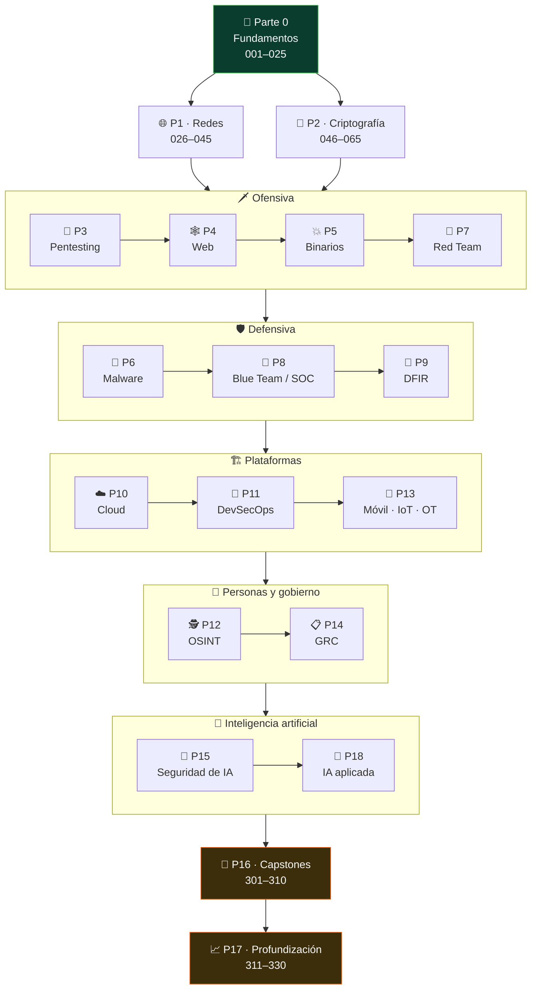
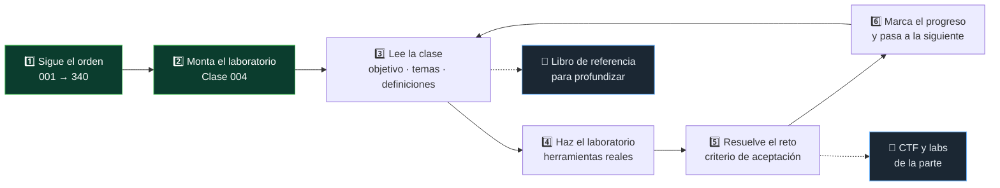

<div align="center">

# 🛡️ Programa de Ciberseguridad Moderna

## **340 clases · 19 partes · de fundamentos a nivel experto**

**El programa de ciberseguridad más completo en español — desde redes, criptografía y Linux
hasta Red Team, DFIR, cloud security, exploit development y seguridad de IA.**

[](https://github.com/vladimiracunadev-create/modern-cybersecurity-program/actions/workflows/ci.yml)
[](https://github.com/vladimiracunadev-create/modern-cybersecurity-program/actions/workflows/security.yml)
[](https://github.com/vladimiracunadev-create/modern-cybersecurity-program/actions/workflows/deploy-pages.yml)

[](classes/README.md)
[](classes/README.md)
[](labs/README.md)
[](rutas/README.md)
[](README.md)
[](LICENSE)

[](scripts/)
[](labs/README.md)
[](classes/parte-0-fundamentos-y-prerrequisitos/004-montaje-del-laboratorio-virtualizacion-kali-snapshots-y-aislamiento-de-red/README.md)
[](classes/parte-8-blue-team-deteccion-y-soc/187-deteccion-basada-en-mitre-att-ck/README.md)
[](classes/parte-4-seguridad-de-aplicaciones-web/README.md)
[](classes/parte-0-fundamentos-y-prerrequisitos/003-frameworks-de-seguridad-nist-csf-iso-27001-mitre-att-ck-y-diamond-model/README.md)
[](mobile/README.md)
[](https://vladimiracunadev-create.github.io/modern-cybersecurity-program/)

[🌐 **Sitio del curso**](https://vladimiracunadev-create.github.io/modern-cybersecurity-program/) ·
[📚 **Índice de las 340 clases**](classes/README.md) ·
[🧭 **Rutas por rol**](rutas/README.md) ·
[🧪 **Laboratorios**](labs/README.md) ·
[📕 **Manual PDF**](manual/MANUAL.pdf) ·
[📱 **App Android**](mobile/README.md) ·
[🎓 **Certificaciones**](certificaciones/README.md) ·
[🗺️ **Roadmap**](ROADMAP.md) ·
[🤝 **Contribuir**](CONTRIBUTING.md) ·
[🔐 **Seguridad**](SECURITY.md)

<br>

| 📚 Clases | 🗂️ Partes | 🧪 Labs | 🚩 CTF | 🧭 Rutas | 🎓 Certis | 📝 Preguntas | 📖 Fuentes |
|:---:|:---:|:---:|:---:|:---:|:---:|:---:|:---:|
| **340** | **19** | **12** | **6 áreas** | **17** | **7** | **97** | **687** |

</div>

---

> [!WARNING]
> **Uso ético y legal.** Todo el contenido ofensivo de este programa (explotación, malware,
> Red Team, cracking) es para **aprendizaje autorizado, laboratorios propios, CTFs y trabajo
> profesional con permiso explícito**. Atacar sistemas sin autorización es delito en
> prácticamente todos los países. Lee la
> [Clase 025 — Ética, legalidad, alcance y divulgación responsable](classes/parte-0-fundamentos-y-prerrequisitos/025-etica-legalidad-alcance-y-divulgacion-responsable/README.md)
> antes de tocar cualquier herramienta.

## 🎯 Qué es esto

Un currículo modular y **secuencial** que cubre **todo el espectro de la ciberseguridad
moderna**, paso a paso, en 340 clases numeradas (001→340) agrupadas en 19 partes.

Cada clase es una carpeta con un `README.md` completo. Siempre la misma anatomía:

| | Sección | Qué aporta |
|:---:|---|---|
| 🎯 | **Objetivo** | Qué problema resuelve la clase |
| 📚 | **Resultados de aprendizaje** | Capacidades verificables, no temas «vistos» |
| 🗺️ | **Temas** | El mapa de la clase, con el porqué de cada uno |
| 📖 | **Definiciones y características** | Los términos técnicos, con su rasgo distintivo |
| 🧰 | **Herramientas y preparación** | Qué instalar antes de empezar |
| 🧪 | **Laboratorio guiado** | Práctica paso a paso con herramientas reales |
| ✍️ | **Ejercicios y reto** | Con criterio de aceptación explícito |
| ⚠️ | **Errores comunes** | Síntoma → causa → solución |
| ❓ | **Preguntas frecuentes** | Las que se hacen de verdad |
| 🔗 | **Referencias** | Los libros y normas de los que sale lo que se afirma |
| 📥 | **Material descargable** | Guía en PDF y presentación de la clase |

## 🗺️ El mapa del programa

Las 19 partes no son una lista: son un recorrido. Cada bloque asume el anterior.



## 📚 Pauta derivada de los mejores libros de seguridad

Cada parte sigue explícitamente la secuencia y los énfasis de la literatura de referencia
del sector:

| | Área | Libros de referencia |
|:---:|---|---|
| 🌐 | **Redes y monitoreo** | Sanders — *Practical Packet Analysis* · Bejtlich — *The Practice of Network Security Monitoring* · Lyon — *Nmap Network Scanning* |
| 🔐 | **Criptografía** | Aumasson — *Serious Cryptography* · Ferguson/Schneier — *Cryptography Engineering* · Wong — *Real-World Cryptography* |
| 🎯 | **Pentesting** | Kim — *The Hacker Playbook 3* · Weidman — *Penetration Testing* · OccupyTheWeb — *Linux Basics for Hackers* |
| 🕸️ | **Web** | Stuttard/Pinto — *The Web Application Hacker's Handbook* · Yaworski — *Real-World Bug Hunting* · Li — *Bug Bounty Bootcamp* |
| 💥 | **Explotación / RE** | Erickson — *Hacking: The Art of Exploitation* · Sikorski — *Practical Malware Analysis* · Andriesse — *Practical Binary Analysis* |
| 🔴 | **Red Team** | *Red Team Field Manual (RTFM)* · MITRE ATT&CK · *Operator Handbook* |
| 🔵 | **Blue Team / DFIR** | *Blue Team Handbook* · Ligh et al. — *The Art of Memory Forensics* · Carrier — *File System Forensic Analysis* |
| ☁️ | **Cloud / DevSecOps** | Rice — *Container Security* · Martin — *Hacking Kubernetes* · Bird — *Securing DevOps* |
| 🕵️ | **OSINT / Social** | Bazzell — *Open Source Intelligence Techniques* · Hadnagy — *Social Engineering* |
| 📋 | **GRC** | *CISSP Official Study Guide* · Hubbard — *How to Measure Anything in Cybersecurity Risk* |

> [!NOTE]
> Las referencias apuntan a las obras; **no se reproduce su contenido**. El material del
> curso es original en su redacción.

## 📖 De dónde sale el material

**Nada de lo que se explica aquí viene de la nada.** Cada clase se apoya en obras reales y
localizables: libros con su ISBN, artículos con su DOI, y la publicación oficial de cada
norma. Están todas en [`sources/bibliography.json`](sources/bibliography.json), con la fecha
en que se comprobó que siguen ahí.

Eso también permite detectar cuándo una norma deja de estar vigente, que es cuando una clase
se queda apoyada en algo que ya no se sostiene.

<!-- fuentes:inicio -->

### Marcos normativos en los que se apoya el programa

| Marco / publicación | Identificador y versión | Partes que lo usan |
|---|---|---:|
| [MITRE ATT&CK: Adversarial Tactics, Techniques and Common…](https://attack.mitre.org/) | MITRE ATT&CK v19.2 | 13 (0, 1, 3, 6, 7, 8, 9, 10, 12, 13, 16, 17, 18) |
| [OWASP Cheat Sheet Series](https://cheatsheetseries.owasp.org/) | OWASP Cheat Sheet Series | 7 (0, 2, 3, 4, 10, 11, 17) |
| [OWASP Web Security Testing Guide](https://owasp.org/www-project-web-security-testing-guide/) | OWASP WSTG v4.2 | 8 (1, 3, 4, 11, 12, 16, 17, 18) |
| [Computer Security Incident Handling Guide](https://csrc.nist.gov/pubs/sp/800/61/r2/final) | NIST SP 800-61 Rev. 2 — **retirada** | 5 (8, 9, 10, 16, 17) |
| [OWASP Community: fichas de ataques y vulnerabilidades](https://owasp.org/www-community/) | OWASP Community | 5 (0, 1, 4, 5, 11) |
| [CISA: avisos, catálogos y recursos de ciberseguridad](https://www.cisa.gov/) | CISA | 7 (0, 9, 12, 13, 14, 16, 17) |
| [MITRE ATLAS: Adversarial Threat Landscape for…](https://atlas.mitre.org/) | MITRE ATLAS v2026.07 | 2 (15, 18) |
| [CIS Benchmarks: guías de configuración segura](https://www.cisecurity.org/cis-benchmarks) | CIS Benchmarks | 4 (0, 10, 14, 17) |
| [Artificial Intelligence Risk Management Framework (AI RMF 1.0)](https://www.nist.gov/itl/ai-risk-management-framework) | NIST AI 100-1 (AI RMF 1.0) | 2 (15, 18) |
| [OWASP Top 10 for Large Language Model Applications](https://genai.owasp.org/llm-top-10/) | OWASP Top 10 for LLM Applications | 2 (15, 18) |
| [Common Vulnerability Scoring System (CVSS)](https://www.first.org/cvss) | FIRST CVSS | 5 (3, 4, 16, 17, 18) |
| [Common Weakness Enumeration (CWE)](https://cwe.mitre.org/) | MITRE CWE 4.20 | 4 (4, 5, 11, 17) |

### Normas citadas que ya no están vigentes

Detectado al construir el registro: el organismo que las publica las ha retirado o sustituido. Se dejan declaradas porque son la fuente que la clase usó; la nota dice qué las reemplaza.

| Publicación | Estado | Clases que la citan |
|---|---|---:|
| [NIST SP 800-61 Rev. 2](https://csrc.nist.gov/pubs/sp/800/61/r2/final) | retirada | 11 |
| [NIST SP 800-63B](https://pages.nist.gov/800-63-3/sp800-63b.html) | superada | 2 |
| [RFC 793](https://www.rfc-editor.org/rfc/rfc793) | obsoleta | 2 |
| [NIST IR 8259](https://csrc.nist.gov/pubs/ir/8259/final) | retirada | 1 |
| [NIST SP 800-161 Rev. 1](https://csrc.nist.gov/pubs/sp/800/161/r1/final) | retirada | 1 |
| [NIST SP 800-162](https://csrc.nist.gov/pubs/sp/800/162/final) | retirada | 1 |
| [NIST SP 800-88 Rev. 1](https://csrc.nist.gov/pubs/sp/800/88/r1/final) | retirada | 1 |
| [RFC 6962](https://www.rfc-editor.org/rfc/rfc6962) | obsoleta | 1 |
| [RFC 7230](https://www.rfc-editor.org/rfc/rfc7230) | obsoleta | 1 |
| [RFC 7489](https://www.rfc-editor.org/rfc/rfc7489) | obsoleta | 1 |
| [RFC 8446](https://www.rfc-editor.org/rfc/rfc8446) | obsoleta | 1 |

Las 687 obras que usan las clases — 57 libros, 24 artículos, 147 normas y 459 documentaciones oficiales — están en [`sources/bibliography.json`](sources/bibliography.json), cada una con su localizador. Comprobado por última vez el 2026-08-19 con [`scripts/verify-sources`](scripts/verify-sources), que corre en CI.

<!-- fuentes:fin -->

## 🗂️ Las 19 partes

Cada parte tiene su **propio README** con narrativa completa: de qué trata, resultados de
aprendizaje, estructura temática y enlaces a las clases.

| | # | Parte | Clases | Foco | |
|:---:|:---:|---|:---:|---|:---:|
| 🧱 | 0 | **Fundamentos y prerrequisitos** | `25` · 001–025 | Redes, SO, Linux, Windows, cripto base, Python ofensivo y laboratorio | [📘](classes/parte-0-fundamentos-y-prerrequisitos/README.md) |
| 🌐 | 1 | **Redes y seguridad de redes** | `20` · 026–045 | Análisis de tráfico, escaneo, firewalls, IDS/IPS, VPN y monitoreo | [📘](classes/parte-1-redes-y-seguridad-de-redes/README.md) |
| 🔐 | 2 | **Criptografía aplicada** | `20` · 046–065 | Simétrica, asimétrica, hashing, PKI, TLS y criptoanálisis | [📘](classes/parte-2-criptografia-aplicada/README.md) |
| 🎯 | 3 | **Hacking ético y pentesting** | `20` · 066–085 | PTES, recon, enumeración, explotación, post-explotación y reporte | [📘](classes/parte-3-hacking-etico-y-pentesting-metodologia/README.md) |
| 🕸️ | 4 | **Seguridad de aplicaciones web** | `30` · 086–115 | OWASP Top 10, Burp Suite, inyecciones, XSS, SSRF, APIs y bug bounty | [📘](classes/parte-4-seguridad-de-aplicaciones-web/README.md) |
| 💥 | 5 | **Explotación de sistemas y binarios** | `25` · 116–140 | Assembly, buffer overflows, ROP, heap, fuzzing e ingeniería inversa | [📘](classes/parte-5-explotacion-de-sistemas-y-binarios/README.md) |
| 🦠 | 6 | **Análisis de malware** | `20` · 141–160 | Estático, dinámico, PE, unpacking, YARA y reporte | [📘](classes/parte-6-analisis-de-malware/README.md) |
| 🔴 | 7 | **Red Team y operaciones ofensivas** | `20` · 161–180 | Adversary emulation, C2, evasión de EDR y Active Directory | [📘](classes/parte-7-red-team-y-operaciones-ofensivas/README.md) |
| 🔵 | 8 | **Blue Team, detección y SOC** | `20` · 181–200 | SIEM, ingeniería de detección, threat hunting y SOAR | [📘](classes/parte-8-blue-team-deteccion-y-soc/README.md) |
| 🔬 | 9 | **Forense digital y respuesta a incidentes** | `20` · 201–220 | DFIR, adquisición, memoria, timelines y playbooks | [📘](classes/parte-9-forense-digital-y-respuesta-a-incidentes/README.md) |
| ☁️ | 10 | **Seguridad en la nube y contenedores** | `15` · 221–235 | AWS, Azure, GCP, IAM, Docker, Kubernetes e IaC | [📘](classes/parte-10-seguridad-en-la-nube-y-contenedores/README.md) |
| 🔄 | 11 | **DevSecOps y seguridad del SDLC** | `13` · 236–248 | Shift-left, threat modeling, SAST/DAST/SCA y supply chain | [📘](classes/parte-11-devsecops-y-seguridad-del-sdlc/README.md) |
| 🕵️ | 12 | **OSINT e ingeniería social** | `12` · 249–260 | Inteligencia de fuentes abiertas, phishing y OPSEC personal | [📘](classes/parte-12-osint-e-ingenieria-social/README.md) |
| 📡 | 13 | **Seguridad móvil, IoT e inalámbrica** | `15` · 261–275 | Android, iOS, firmware, hardware, SDR e ICS/SCADA | [📘](classes/parte-13-seguridad-movil-iot-e-inalambrica/README.md) |
| 📋 | 14 | **GRC, riesgo y cumplimiento** | `15` · 276–290 | Gobernanza, ISO 27001, NIST, PCI-DSS, auditoría y carrera | [📘](classes/parte-14-grc-riesgo-y-cumplimiento/README.md) |
| 🧪 | 15 | **Seguridad de IA y machine learning** | `10` · 291–300 | Ataques adversariales, OWASP LLM, prompt injection y defensa con IA | [📘](classes/parte-15-seguridad-de-ia-y-machine-learning/README.md) |
| 🏁 | 16 | **Capstones y preparación de certificaciones** | `10` · 301–310 | Roadmap OSCP/CISSP, proyectos integradores y aprendizaje continuo | [📘](classes/parte-16-capstones-y-preparacion-de-certificaciones/README.md) |
| 📈 | 17 | **Profundización para certificaciones** | `20` · 311–330 | Gestión de datos, IAM empresarial, arquitectura, seguridad física, gestión de vulnerabilidades y gobierno | [📘](classes/parte-17-profundizacion-para-certificaciones/README.md) |
| 🧠 | 18 | **IA aplicada a la ciberseguridad** | `10` · 331–340 | LLMs y agentes: MCP, kali-mcp, pentesting asistido, defensa e informes | [📘](classes/parte-18-ia-aplicada-a-la-ciberseguridad/README.md) |

➡️ **[Ver el índice plano de las 340 clases](classes/README.md)**

## 🚀 Cómo usar el programa



1. **Sigue el orden.** La numeración es secuencial por diseño: cada clase asume lo anterior.
   Si ya dominas un bloque, sáltalo, pero no empieces por la Parte 5 sin la 0.
2. **Monta el laboratorio primero.** La
   [Clase 004](classes/parte-0-fundamentos-y-prerrequisitos/004-montaje-del-laboratorio-virtualizacion-kali-snapshots-y-aislamiento-de-red/README.md)
   te deja un entorno aislado y seguro para practicar sin riesgo.
3. **Haz los laboratorios y retos.** Leer no basta en seguridad: cada clase trae práctica con
   herramientas reales.
4. **Usa los libros de referencia** para profundizar en los temas que más te interesen.

## 📕 Manual completo (todo el curso en un documento)

¿Prefieres el curso entero en un solo sitio, para leer de corrido o estudiar sin conexión?
El **manual** consolida las **340 clases** en orden, con portada, aviso ético e índice
enlazado.

- 📥 **[Descargar el manual en PDF](manual/MANUAL.pdf)** — ~940 páginas listas para imprimir
  o leer offline.

> Se genera con `python scripts/generar_manual.py` a partir de las clases, así que siempre
> refleja el contenido actual del repositorio.

## 📱 App móvil Android

¿Prefieres estudiar desde el teléfono? La app **Ciberseguridad Moderna**
([`mobile/`](mobile/README.md)) embebe las **340 clases en 19 partes** para leerlas **sin
conexión**, con buscador y seguimiento de progreso local. Cada clase abre su versión completa
en el sitio o en GitHub con un toque.

| | | |
|:---:|---|---|
| 📥 | **Descarga** | [APK — release v1.0.0](https://github.com/vladimiracunadev-create/modern-cybersecurity-program/releases/tag/v1.0.0) · verifica la integridad con `SHA256SUMS.txt` |
| 🧭 | **Navegación** | Home (19 partes + progreso global) → Parte (clases + buscador) → Clase (objetivo, resultados, temas, definiciones y práctica) |
| 🔌 | **Offline-first** | El temario viaja embebido; abrir la clase completa requiere internet. El progreso se guarda **solo en tu dispositivo** |

<div align="center">
  
</div>

> APK de **sideload** (fuera de Play Store), firmado en el pipeline de release. En Android,
> permite instalar desde "orígenes desconocidos" para el instalador que uses. Detalle técnico
> y pipeline en [docs/APP_MOVIL.md](docs/APP_MOVIL.md).

## 🧪 Laboratorios ejecutables

Además de las clases, el programa incluye **entornos de práctica** que se levantan con un
comando, más una colección de retos tipo CTF.

| | Laboratorio | Qué levanta | Parte |
|:---:|---|---|:---:|
| 🕸️ | **[AppSec Web](labs/appsec-web/README.md)** | OWASP Juice Shop + DVWA (OWASP Top 10) | `4` |
| 🛡️ | **[Blue Team / SOC](labs/blue-team-soc/README.md)** | Elasticsearch + Kibana con telemetría de un ataque para detección | `8` |
| 🎯 | **[Red Team / Active Directory](labs/red-team-ad/README.md)** | Caja de atacante + guía GOAD | `7` |
| 🔐 | **[Criptografía](labs/cripto/README.md)** | Retos con solución en Python (XOR, RSA-Fermat, MD5, ECB) | `2` |
| 🧠 | **[DFIR memoria/malware](labs/dfir-memoria/README.md)** | Volatility 3 + YARA para forense de memoria | `9` `17` |
| 🔎 | **[Code review / SAST](labs/appsec-code/README.md)** | App vulnerable + Semgrep/Bandit | `11` `17` |
| 🚚 | **[Pipeline DevSecOps](labs/devsecops-pipeline/README.md)** | Repo vulnerable auditado en **8 capas** (dependencias, SAST, secretos, Dockerfile, contenedor, CI/CD, typosquatting y priorización KEV/EPSS/CVSS) con informe | `11` |
| 🤖 | **[Pentest con IA (kali-mcp)](labs/kali-mcp-ia/README.md)** | Agente de IA orquestando Kali vía MCP | `18` |
| 🪟 | **[Triaje forense de Windows (RootCause)](labs/rootcause-windows/README.md)** | Sensor forense de comportamiento en Rust | `6` `8` `9` |
| 🌐 | **[Escaneo de red (nmap)](labs/redes-nmap/README.md)** | Objetivos y escaneos reproducibles | `1` |
| 💥 | **[Explotación de binarios (pwn)](labs/pwn-binarios/README.md)** | Binarios vulnerables para practicar | `5` |
| ☁️ | **[Auditoría cloud (CSPM)](labs/cloud-security/README.md)** | Entorno cloud mal configurado para auditar | `10` |
| 🚩 | **[Retos tipo CTF](ctf/README.md)** | Web, cripto, redes, forense, OSINT y pwn, con writeups | — |

➡️ Ver todo en **[labs/](labs/README.md)**.

## 🧭 Portal: rutas, autoevaluación y progreso

| | Recurso | Qué es |
|:---:|---|---|
| 🧭 | **[Rutas guiadas por rol](rutas/README.md)** | 17 recorridos ordenados, del pentester al CISO |
| 📝 | **[Autoevaluaciones](autoevaluaciones/README.md)** | 97 preguntas, una batería por parte · [versión interactiva con puntuación](https://vladimiracunadev-create.github.io/modern-cybersecurity-program/autoevaluaciones/quiz.html) |
| ✅ | **[Seguimiento de progreso](https://vladimiracunadev-create.github.io/modern-cybersecurity-program/autoevaluaciones/progreso.html)** | Marca las 340 clases (se guarda en tu navegador) |
| 🔑 | **[Soluciones a los retos](soluciones/README.md)** | Claves de referencia de los ejercicios (Parte 2 completa; resto por lotes) |
| 🎓 | **[Certificaciones](certificaciones/README.md)** | Mapeo a Security+, PenTest+, CySA+, OSCP, CISSP, BTL1 y SANS con **% de cobertura ponderado por dominio** |

🌐 Todo navegable en el
**[sitio del curso](https://vladimiracunadev-create.github.io/modern-cybersecurity-program/)**
(GitHub Pages).

## 🧭 Rutas sugeridas por rol

Cada rol tiene una **guía de carrera completa**: qué es, día a día, qué necesitas saber, tu
ruta en el curso, certificaciones, salario orientativo y progresión. Todas empiezan por la
**Parte 0**.

### 🗡️ Ofensiva

| | Rol | Enfoque | Partes | Alineado a | |
|:---:|---|---|---|---|:---:|
| 🎯 | **Pentester / Ethical Hacker** | Ofensiva generalista: recon, explotación, web, post-explotación y reporte | `0` `1` `3` `4` `5` `7` `12` | OSCP · PenTest+ | [📖](rutas/pentester.md) |
| 🔴 | **Red Teamer** | Emulación de adversario, C2, evasión de EDR y Active Directory | `0` `1` `3` `4` `5` `7` `12` | OSCP · CRTO | [📖](rutas/red-team.md) |
| 🗡️ | **Analista de Seguridad Ofensiva** | El **primer escalón** del oficio ofensivo: pentest de apps, APIs y redes, validación de hallazgos y evidencia técnica | `0` `1` `3` `4` `7` `17` | eJPT · PenTest+ | [📖](rutas/analista-seguridad-ofensiva.md) |
| 🕸️ | **AppSec / Bug Bounty** | Seguridad de aplicaciones web y APIs, de la revisión de código al reporte | `0` `2` `4` `11` | eWPT · Bug bounty | [📖](rutas/appsec.md) |

### 🛡️ Defensiva y plataformas

| | Rol | Enfoque | Partes | Alineado a | |
|:---:|---|---|---|---|:---:|
| 🔵 | **Analista SOC / Blue Team** | SIEM, ingeniería de detección, threat hunting y respuesta de primer nivel | `0` `1` `6` `8` `9` | BTL1 · CySA+ | [📖](rutas/soc-blue-team.md) |
| 🔬 | **DFIR / Forense** | Adquisición, memoria, timelines y playbooks de incidente | `0` `1` `6` `9` | GCFA · BTL1 | [📖](rutas/dfir.md) |
| 🩹 | **Gestión de Vulnerabilidades** | VM, hardening y parcheo, EDR y reporte al negocio | `0` `1` `3` `8` `11` `17` | CySA+ | [📖](rutas/gestion-vulnerabilidades.md) |
| ⚙️ | **Security Engineer / SecOps** | Híbrido seguridad + desarrollo: EDR/XDR multi-SO, automatización con Python/Bash, APIs internas y respuesta de endpoint | `0` `8` `9` `11` `17` `4` | CySA+ | [📖](rutas/secops-engineer.md) |
| 🛡️ | **Analista de Ciberseguridad** *(institución regulada)* | Perfil híbrido Blue/DFIR/GRC: SIEM, eventos, vulnerabilidades, incidentes y marcos NIST/ISO 27001/27035/22301 | `0` `8` `9` `14` `3` `17` | CySA+ | [📖](rutas/analista-ciberseguridad.md) |
| 🏗️ | **Analista de Seguridad de Infraestructura** | El puesto **bisagra** entre sistemas y seguridad: firewalls, IPS, NAC y EDR, ingeniería de las fuentes del SIEM y controles SOX/PCI | `0` `1` `8` `10` `2` `14` `17` | Security+ · CySA+ | [📖](rutas/seguridad-infraestructura.md) |
| 🗂️ | **Operación de Plataformas (MSSP y DLP)** | Operar plataformas para clientes desde un proveedor gestionado, con especialidad en clasificación de datos y DLP | `0` `17` `14` `8` `9` | Security+ | [📖](rutas/operacion-plataformas-dlp.md) |
| ☁️ | **Cloud Security** | IAM, contenedores, Kubernetes, IaC y postura en AWS/Azure/GCP | `0` `2` `10` `11` | CCSP · AWS Security | [📖](rutas/cloud-security.md) |

### 🏛️ Gobierno, arquitectura y dirección

| | Rol | Enfoque | Partes | Alineado a | |
|:---:|---|---|---|---|:---:|
| 📋 | **GRC / Gestión** | Gobernanza, riesgo, ISO 27001, auditoría y cumplimiento | `0` `14` `8` `9` | CISSP · ISO 27001 | [📖](rutas/grc.md) |
| 🏭 | **Arquitecto de Ciberseguridad IT/OT** | **Diseña** la seguridad de una planta: modelo Purdue, zonas y conductos IEC 62443, segmentación IT/OT, integración con nube y SOC, auditoría contra NIST SP 800-82 | `1` `13` `17` `14` `10` `8` `9` `3` | CISSP · IEC 62443 · GICSP | [📖](rutas/arquitecto-it-ot.md) |
| 🧑‍💼 | **Jefe de Seguridad de la Información** | El primer rol **con equipo a cargo**: estrategia, riesgo, cumplimiento ISO 27001/NIST y reporte ejecutivo | `0` `14` `17` `8` `9` | CISSP · CISM | [📖](rutas/ciso-jefe-seguridad.md) |
| 👔 | **CISO / Director de Seguridad** | El **techo de carrera** del programa: máximo responsable de datos, sistemas, servicios digitales y continuidad, con mandato del directorio y responsabilidad ante el regulador | `0` `14` `17` `8` `9` `10` `11` `15` | CISSP · CISM · CRISC | [📖](rutas/ciso.md) |
| 🤝 | **Cooperación y Alianzas Técnicas** | Gobernanza, protección de datos y riesgo de terceros | `0` `14` `1` `8` | CISSP · ISO 27001 | [📖](rutas/cooperacion-alianzas.md) |

➡️ Detalle de cada recorrido, con laboratorios y retos, en **[rutas/](rutas/README.md)**.

## ✅ Calidad y CI

El repositorio no se publica a ciegas: cada `push` y cada PR pasan por integración continua
que valida estructura, enlaces, codificación, fuentes y build del sitio. **Nada llega a
`main` en rojo.**

| | Workflow | Qué cubre |
|:---:|---|---|
| 🧪 | [ci.yml](.github/workflows/ci.yml) | Estructura y enlaces internos, navegación bidireccional (anterior/siguiente), codificación UTF-8 sin mojibake, **trazabilidad de fuentes** (`verify-sources`), `markdownlint` y build del sitio |
| 🔒 | [security.yml](.github/workflows/security.yml) | Escaneo de secretos (`gitleaks`) y análisis estático (`bandit`) de los scripts |
| 🚀 | [deploy-pages.yml](.github/workflows/deploy-pages.yml) | Genera y despliega el sitio del curso a GitHub Pages |

Los mismos validadores corren en local antes de subir:

```bash
python scripts/validar_estructura.py         # 340 clases + enlaces .md sin rotos
python scripts/validar_encoding.py           # todo UTF-8, sin mojibake
python scripts/generar_navegacion.py --check # navegación coherente
python scripts/verify-sources                # fuentes: registro, citas y cifras
npx markdownlint-cli2 "**/*.md"              # estilo de Markdown
```

## 🎯 Qué es y qué no es este programa

<table>
<tr>
<td valign="top" width="50%">

### ✅ Lo que sí es

- 📚 un currículo **secuencial y completo** de 340 clases, de fundamentos a nivel experto;
- 🧪 un curso con **práctica real**: 12 laboratorios ejecutables y retos tipo CTF con writeups;
- 🧭 una guía de **carrera por rol** con día a día, skills, certificaciones y salario orientativo;
- 🎓 un mapeo honesto a **certificaciones** (Security+, PenTest+, CySA+, OSCP, CISSP, BTL1, SANS) con % de cobertura;
- 🌐 material **abierto y offline-friendly** (manual PDF + sitio en Pages + app Android), en español.

</td>
<td valign="top" width="50%">

### ❌ Lo que no es

- 🚫 un atajo para "hackear" sin base: la numeración es secuencial por diseño;
- 🚫 una licencia para atacar sistemas sin autorización (lee la [Clase 025](classes/parte-0-fundamentos-y-prerrequisitos/025-etica-legalidad-alcance-y-divulgacion-responsable/README.md));
- 🚫 un sustituto del examen oficial de ninguna certificación (prepara, no certifica);
- 🚫 una promesa de empleo: las guías de carrera marcan los salarios como **orientativos**;
- 🚫 contenido copiado de los libros de referencia: la redacción es **original**.

</td>
</tr>
</table>

## 👩‍🏫 Para instructores

| | Recurso | Qué contiene |
|:---:|---|---|
| 📅 | **[Syllabus y cronograma](docs/syllabus.md)** | Horas por parte, dependencias y un plan de 30 semanas |
| 📊 | **[Rúbrica de evaluación](docs/rubrica-evaluacion.md)** | Cómo puntuar retos, labs y capstones |
| 🎓 | **[Examen final por rol](docs/examen-final-por-rol.md)** | Teoría + práctica + informe para cada ruta |

## 💡 Idea fuerza

> El valor de este programa no está en presumir herramientas, sino en **traducirlas en
> aprendizaje real**: secuencia pedagógica, laboratorios que se levantan con un comando,
> honestidad sobre lo que cada rol implica y una base que puedes recorrer de principio a fin
> sin quedarte a medias.

## 📄 Licencia

[MIT](LICENSE) — úsalo, modifícalo y compártelo. El conocimiento de seguridad debe ser
accesible; su **uso**, responsable.

---

<div align="center">

**Hecho para quien quiere aprender ciberseguridad en serio, de principio a fin.**

[⬆️ Empezar por el índice de clases](classes/README.md)

<br>

**¿Te resulta útil? ⭐ Dale una estrella al repo.**

[](https://github.com/vladimiracunadev-create/modern-cybersecurity-program/stargazers)
[](https://github.com/vladimiracunadev-create/modern-cybersecurity-program/network/members)
[](https://github.com/vladimiracunadev-create)

Hecho con 🧠 y ☕ por [Vladimir Acuña](https://github.com/vladimiracunadev-create)

</div>
