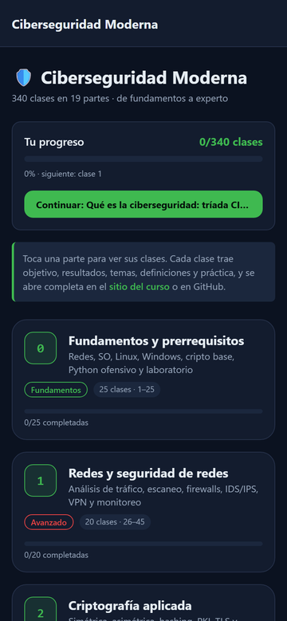
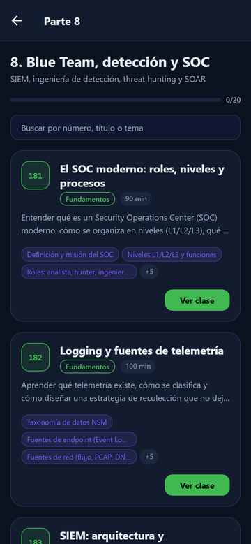
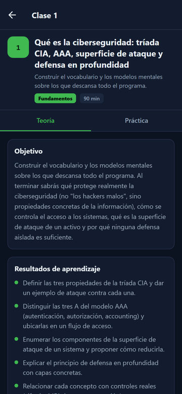

<div align="center">

# 🛡️ Programa de Ciberseguridad Moderna

## **340 clases · 19 partes · de fundamentos a nivel experto**

**El programa de ciberseguridad más completo en español — desde redes, criptografía y Linux hasta Red Team, DFIR, cloud security, exploit development y seguridad de IA.**

[](https://github.com/vladimiracunadev-create/modern-cybersecurity-program/actions/workflows/ci.yml)
[](https://github.com/vladimiracunadev-create/modern-cybersecurity-program/actions/workflows/security.yml)
[](https://github.com/vladimiracunadev-create/modern-cybersecurity-program/actions/workflows/deploy-pages.yml)

[](classes/README.md)
[](classes/README.md)
[](README.md)
[](LICENSE)

[](scripts/)
[](labs/README.md)
[](classes/parte-0-fundamentos-y-prerrequisitos/004-montaje-del-laboratorio-virtualizacion-kali-snapshots-y-aislamiento-de-red/README.md)
[](classes/parte-8-blue-team-deteccion-y-soc/187-deteccion-basada-en-mitre-att-ck/README.md)
[](classes/README.md)
[](https://vladimiracunadev-create.github.io/modern-cybersecurity-program/)

[📚 Índice completo de clases](classes/README.md) · [📕 Manual completo (PDF)](manual/MANUAL.pdf) · [🗺️ Roadmap](ROADMAP.md) · [🤝 Contribuir](CONTRIBUTING.md) · [🔐 Política de seguridad](SECURITY.md)

</div>

---

> ⚠️ **Uso ético y legal.** Todo el contenido ofensivo de este programa (explotación, malware, Red Team, cracking) es para **aprendizaje autorizado, laboratorios propios, CTFs y trabajo profesional con permiso explícito**. Atacar sistemas sin autorización es delito en prácticamente todos los países. Lee la [Clase 025 — Ética, legalidad, alcance y divulgación responsable](classes/parte-0-fundamentos-y-prerrequisitos/025-etica-legalidad-alcance-y-divulgacion-responsable/README.md) antes de tocar cualquier herramienta.

## 🎯 Qué es esto

Un currículo modular y **secuencial** que cubre **todo el espectro de la ciberseguridad moderna**, paso a paso, en 340 clases numeradas (001→340) agrupadas en 19 partes. Cada clase es una carpeta con un `README.md` completo que incluye:

- 🎯 **Objetivo** y **resultados de aprendizaje verificables**.
- 🗺️ **Temas** con el porqué de cada uno.
- 📖 **Definiciones y características** de los términos técnicos.
- 🧪 **Laboratorio guiado** paso a paso (con herramientas reales).
- ✍️ **Ejercicios** y **reto verificable** con criterio de aceptación.
- ⚠️ **Errores comunes** (síntoma → causa → solución).
- ❓ **Preguntas frecuentes** auténticas.
- 🔗 **Referencias** a los libros y fuentes de referencia del área.

## 📚 Pauta derivada de los mejores libros de seguridad

Cada parte sigue explícitamente la secuencia y los énfasis de la literatura de referencia del sector:

| Área | Libros de referencia |
|---|---|
| **Redes y monitoreo** | Sanders — *Practical Packet Analysis* · Bejtlich — *The Practice of Network Security Monitoring* · Lyon — *Nmap Network Scanning* |
| **Criptografía** | Aumasson — *Serious Cryptography* · Ferguson/Schneier — *Cryptography Engineering* · Wong — *Real-World Cryptography* |
| **Pentesting** | Kim — *The Hacker Playbook 3* · Weidman — *Penetration Testing* · OccupyTheWeb — *Linux Basics for Hackers* |
| **Web** | Stuttard/Pinto — *The Web Application Hacker's Handbook* · Yaworski — *Real-World Bug Hunting* · Li — *Bug Bounty Bootcamp* |
| **Explotación / RE** | Erickson — *Hacking: The Art of Exploitation* · Sikorski — *Practical Malware Analysis* · Andriesse — *Practical Binary Analysis* |
| **Red Team** | *Red Team Field Manual (RTFM)* · MITRE ATT&CK · *Operator Handbook* |
| **Blue Team / DFIR** | *Blue Team Handbook* · Ligh et al. — *The Art of Memory Forensics* · Carrier — *File System Forensic Analysis* |
| **Cloud / DevSecOps** | Rice — *Container Security* · Martin — *Hacking Kubernetes* · Bird — *Securing DevOps* |
| **OSINT / Social** | Bazzell — *Open Source Intelligence Techniques* · Hadnagy — *Social Engineering* |
| **GRC** | *CISSP Official Study Guide* · Hubbard — *How to Measure Anything in Cybersecurity Risk* |

> Las referencias apuntan a las obras; **no se reproduce su contenido**. El material del curso es original y original en su redacción.

## 📖 De dónde sale el material

**Nada de lo que se explica aquí viene de la nada.** Cada clase se apoya en obras reales y localizables: libros con su ISBN, artículos con su DOI, y la publicación oficial de cada norma. Están todas en [`sources/bibliography.json`](sources/bibliography.json), con la fecha en que se comprobó que siguen ahí.

Eso también permite detectar cuándo una norma deja de estar vigente, que es cuando una clase se queda apoyada en algo que ya no se sostiene.

<!-- fuentes:inicio -->

### Marcos normativos en los que se apoya el programa

| Marco / publicación | Identificador y versión | Partes que lo usan |
|---|---|---:|
| [MITRE ATT&CK: Adversarial Tactics, Techniques and Common…](https://attack.mitre.org/) | MITRE ATT&CK v19.2 | 13 (0, 1, 3, 6, 7, 8, 9, 10, 12, 13, 16, 17, 18) |
| [OWASP Cheat Sheet Series](https://cheatsheetseries.owasp.org/) | OWASP Cheat Sheet Series | 7 (0, 2, 3, 4, 10, 11, 17) |
| [OWASP Web Security Testing Guide](https://owasp.org/www-project-web-security-testing-guide/) | OWASP WSTG v4.2 | 8 (1, 3, 4, 11, 12, 16, 17, 18) |
| [CISA: avisos, catálogos y recursos de ciberseguridad](https://www.cisa.gov/) | CISA | 7 (0, 9, 12, 13, 14, 16, 17) |
| [Computer Security Incident Handling Guide](https://csrc.nist.gov/pubs/sp/800/61/r2/final) | NIST SP 800-61 Rev. 2 — **retirada** | 6 (7, 8, 9, 10, 16, 17) |
| [OWASP Community: fichas de ataques y vulnerabilidades](https://owasp.org/www-community/) | OWASP Community | 5 (0, 1, 4, 5, 11) |
| [MITRE ATLAS: Adversarial Threat Landscape for…](https://atlas.mitre.org/) | MITRE ATLAS v2026.07 | 2 (15, 18) |
| [CIS Benchmarks: guías de configuración segura](https://www.cisecurity.org/cis-benchmarks) | CIS Benchmarks | 4 (0, 10, 14, 17) |
| [The NIST Cybersecurity Framework (CSF) 2.0](https://www.nist.gov/cyberframework) | NIST CSF 2.0 | 5 (0, 8, 9, 14, 17) |
| [Technical Guide to Information Security Testing and Assessment](https://csrc.nist.gov/pubs/sp/800/115/final) | NIST SP 800-115 | 4 (3, 7, 8, 16) |
| [Incident Response Recommendations and Considerations for…](https://doi.org/10.6028/NIST.SP.800-61r3) | NIST SP 800-61 Rev. 3 | 3 (7, 8, 9) |
| [Artificial Intelligence Risk Management Framework (AI RMF 1.0)](https://www.nist.gov/itl/ai-risk-management-framework) | NIST AI 100-1 (AI RMF 1.0) | 2 (15, 18) |

### Normas citadas que ya no están vigentes

Detectado al construir el registro: el organismo que las publica las ha retirado o sustituido. Se dejan declaradas porque son la fuente que la clase usó; la nota dice qué las reemplaza.

| Publicación | Estado | Clases que la citan |
|---|---|---:|
| [NIST SP 800-61 Rev. 2](https://csrc.nist.gov/pubs/sp/800/61/r2/final) | retirada | 12 |
| [NIST SP 800-63B](https://pages.nist.gov/800-63-3/sp800-63b.html) | superada | 3 |
| [RFC 793](https://www.rfc-editor.org/rfc/rfc793) | obsoleta | 2 |
| [NIST IR 8259](https://csrc.nist.gov/pubs/ir/8259/final) | retirada | 1 |
| [NIST SP 800-161 Rev. 1](https://csrc.nist.gov/pubs/sp/800/161/r1/final) | retirada | 1 |
| [NIST SP 800-162](https://csrc.nist.gov/pubs/sp/800/162/final) | retirada | 1 |
| [NIST SP 800-88 Rev. 1](https://csrc.nist.gov/pubs/sp/800/88/r1/final) | retirada | 1 |
| [RFC 6962](https://www.rfc-editor.org/rfc/rfc6962) | obsoleta | 1 |
| [RFC 7230](https://www.rfc-editor.org/rfc/rfc7230) | obsoleta | 1 |
| [RFC 7489](https://www.rfc-editor.org/rfc/rfc7489) | obsoleta | 1 |
| [RFC 8446](https://www.rfc-editor.org/rfc/rfc8446) | obsoleta | 1 |

Las 688 obras que usan las clases — 57 libros, 24 artículos, 149 normas y 458 documentaciones oficiales — están en [`sources/bibliography.json`](sources/bibliography.json), cada una con su localizador. Comprobado por última vez el 2026-08-19 con [`scripts/verify-sources`](scripts/verify-sources), que corre en CI.

<!-- fuentes:fin -->

## 🗂️ Las 19 partes

Cada parte tiene su **propio README** con narrativa completa: de qué trata, resultados de aprendizaje, estructura temática y enlaces a las clases.

| # | Parte | Clases | Foco | README |
|---|---|---:|---|---|
| 0 | Fundamentos y prerrequisitos | 25 (001–025) | Redes, SO, Linux, Windows, cripto base, Python ofensivo y laboratorio | [📘 leer](classes/parte-0-fundamentos-y-prerrequisitos/README.md) |
| 1 | Redes y seguridad de redes | 20 (026–045) | Análisis de tráfico, escaneo, firewalls, IDS/IPS, VPN y monitoreo | [📘 leer](classes/parte-1-redes-y-seguridad-de-redes/README.md) |
| 2 | Criptografía aplicada | 20 (046–065) | Simétrica, asimétrica, hashing, PKI, TLS y criptoanálisis | [📘 leer](classes/parte-2-criptografia-aplicada/README.md) |
| 3 | Hacking ético y pentesting: metodología | 20 (066–085) | PTES, recon, enumeración, explotación, post-explotación y reporte | [📘 leer](classes/parte-3-hacking-etico-y-pentesting-metodologia/README.md) |
| 4 | Seguridad de aplicaciones web | 30 (086–115) | OWASP Top 10, Burp Suite, inyecciones, XSS, SSRF, APIs y bug bounty | [📘 leer](classes/parte-4-seguridad-de-aplicaciones-web/README.md) |
| 5 | Explotación de sistemas y binarios | 25 (116–140) | Assembly, buffer overflows, ROP, heap, fuzzing e ingeniería inversa | [📘 leer](classes/parte-5-explotacion-de-sistemas-y-binarios/README.md) |
| 6 | Análisis de malware | 20 (141–160) | Estático, dinámico, PE, unpacking, YARA y reporte | [📘 leer](classes/parte-6-analisis-de-malware/README.md) |
| 7 | Red Team y operaciones ofensivas | 20 (161–180) | Adversary emulation, C2, evasión de EDR y Active Directory | [📘 leer](classes/parte-7-red-team-y-operaciones-ofensivas/README.md) |
| 8 | Blue Team, detección y SOC | 20 (181–200) | SIEM, ingeniería de detección, threat hunting y SOAR | [📘 leer](classes/parte-8-blue-team-deteccion-y-soc/README.md) |
| 9 | Forense digital y respuesta a incidentes | 20 (201–220) | DFIR, adquisición, memoria, timelines y playbooks | [📘 leer](classes/parte-9-forense-digital-y-respuesta-a-incidentes/README.md) |
| 10 | Seguridad en la nube y contenedores | 15 (221–235) | AWS, Azure, GCP, IAM, Docker, Kubernetes e IaC | [📘 leer](classes/parte-10-seguridad-en-la-nube-y-contenedores/README.md) |
| 11 | DevSecOps y seguridad del SDLC | 13 (236–248) | Shift-left, threat modeling, SAST/DAST/SCA y supply chain | [📘 leer](classes/parte-11-devsecops-y-seguridad-del-sdlc/README.md) |
| 12 | OSINT e ingeniería social | 12 (249–260) | Inteligencia de fuentes abiertas, phishing y OPSEC personal | [📘 leer](classes/parte-12-osint-e-ingenieria-social/README.md) |
| 13 | Seguridad móvil, IoT e inalámbrica | 15 (261–275) | Android, iOS, firmware, hardware, SDR e ICS/SCADA | [📘 leer](classes/parte-13-seguridad-movil-iot-e-inalambrica/README.md) |
| 14 | GRC, riesgo y cumplimiento | 15 (276–290) | Gobernanza, ISO 27001, NIST, PCI-DSS, auditoría y carrera | [📘 leer](classes/parte-14-grc-riesgo-y-cumplimiento/README.md) |
| 15 | Seguridad de IA y machine learning | 10 (291–300) | Ataques adversariales, OWASP LLM, prompt injection y defensa con IA | [📘 leer](classes/parte-15-seguridad-de-ia-y-machine-learning/README.md) |
| 16 | Capstones y preparación de certificaciones | 10 (301–310) | Roadmap OSCP/CISSP, proyectos integradores y aprendizaje continuo | [📘 leer](classes/parte-16-capstones-y-preparacion-de-certificaciones/README.md) |
| 17 | Profundización para certificaciones | 20 (311–330) | Gestión de datos, IAM empresarial, arquitectura, seguridad física, gestión de vulnerabilidades y gobierno | [📘 leer](classes/parte-17-profundizacion-para-certificaciones/README.md) |
| 18 | IA aplicada a la ciberseguridad | 10 (331–340) | LLMs y agentes: MCP, kali-mcp, pentesting asistido, defensa e informes | [📘 leer](classes/parte-18-ia-aplicada-a-la-ciberseguridad/README.md) |

➡️ **[Ver el índice plano de las 340 clases](classes/README.md)**

## 📕 Manual completo (todo el curso en un documento)

¿Prefieres el curso entero en un solo sitio, para leer de corrido o estudiar sin conexión? El **manual** consolida las **340 clases** en orden, con portada, aviso ético e índice enlazado.

- 📥 **[Descargar el manual en PDF](manual/MANUAL.pdf)** — ~1.020 páginas listas para imprimir o leer offline.

> Se genera con `python scripts/generar_manual.py` a partir de las clases, así que siempre refleja el contenido actual del repositorio.

## 📱 App móvil Android

¿Prefieres estudiar desde el teléfono? La app **Ciberseguridad Moderna** ([`mobile/`](mobile/README.md)) embebe las **340 clases en 19 partes** para leerlas **sin conexión**, con buscador y seguimiento de progreso local. Cada clase abre su versión completa en el sitio o en GitHub con un toque.

- 📥 **[Descargar el APK — release v1.0.0](https://github.com/vladimiracunadev-create/modern-cybersecurity-program/releases/tag/v1.0.0)** · verifica la integridad con `SHA256SUMS.txt`.
- 🧭 **Navegación:** Home (19 partes + progreso global) → Parte (clases + buscador) → Clase (objetivo, resultados, temas, definiciones y práctica).
- 🔌 **Offline-first:** el temario viaja embebido; abrir la clase completa requiere internet. El progreso se guarda **solo en tu dispositivo**.

<div align="center">
  
</div>

> APK de **sideload** (fuera de Play Store), firmado en el pipeline de release. En Android, permite instalar desde "orígenes desconocidos" para el instalador que uses. Detalle técnico y pipeline en [docs/APP_MOVIL.md](docs/APP_MOVIL.md).

## 🧪 Laboratorios ejecutables

Además de las clases, el programa incluye **entornos de práctica** que se levantan con un
comando, más una colección de retos tipo CTF:

- 🕸️ **[AppSec Web](labs/appsec-web/README.md)** — OWASP Juice Shop + DVWA (OWASP Top 10) · Parte 4.
- 🛡️ **[Blue Team / SOC](labs/blue-team-soc/README.md)** — Elasticsearch + Kibana con telemetría de un ataque para detección · Parte 8.
- 🎯 **[Red Team / Active Directory](labs/red-team-ad/README.md)** — caja de atacante + guía GOAD · Parte 7.
- 🔐 **[Criptografía](labs/cripto/README.md)** — retos con solución en Python (XOR, RSA-Fermat, MD5, ECB) · Parte 2.
- 🧠 **[DFIR memoria/malware](labs/dfir-memoria/README.md)** — Volatility 3 + YARA para forense de memoria · Partes 9 y 17.
- 🔎 **[Code review / SAST](labs/appsec-code/README.md)** — app vulnerable + Semgrep/Bandit · Partes 11 y 17.
- 🚚 **[Pipeline de despliegue (DevSecOps)](labs/devsecops-pipeline/README.md)** — repo vulnerable auditado en **8 capas** (dependencias, SAST, secretos, Dockerfile, contenedor, CI/CD, typosquatting y priorización KEV/EPSS/CVSS) con informe · Parte 11.
- 🤖 **[Pentest con IA (kali-mcp)](labs/kali-mcp-ia/README.md)** — agente de IA orquestando Kali vía MCP · Parte 18.
- 🪟 **[Triaje forense de Windows (RootCause)](labs/rootcause-windows/README.md)** — sensor forense de comportamiento en Rust · Partes 6, 8 y 9.
- 🌐 **[Escaneo de red (nmap)](labs/redes-nmap/README.md)** · 💥 **[Explotación de binarios (pwn)](labs/pwn-binarios/README.md)** · ☁️ **[Auditoría cloud (CSPM)](labs/cloud-security/README.md)** — Partes 1, 5 y 10.
- 🚩 **[Retos tipo CTF](ctf/README.md)** — web, cripto, redes, forense, OSINT y pwn, con writeups.

➡️ Ver todo en **[labs/](labs/README.md)**.

## 🧭 Portal: rutas, autoevaluación y progreso

- 🧭 **[Rutas guiadas por rol](rutas/README.md)** — recorridos ordenados para pentester, red team, SOC/blue, DFIR, **gestión de vulnerabilidades**, AppSec, cloud, GRC, **analista de ciberseguridad (institución regulada)**, **analista de seguridad ofensiva**, **security engineer / SecOps**, **seguridad de infraestructura**, **operación de plataformas (MSSP/DLP)**, **jefe de seguridad**, **CISO / director de seguridad de la información**, **arquitecto de ciberseguridad IT/OT** y **cooperación/alianzas técnicas**.
- 📝 **[Autoevaluaciones](autoevaluaciones/README.md)** — 97 preguntas (una batería por parte). Versión interactiva con puntuación: [quiz](https://vladimiracunadev-create.github.io/modern-cybersecurity-program/autoevaluaciones/quiz.html).
- ✅ **[Seguimiento de progreso](https://vladimiracunadev-create.github.io/modern-cybersecurity-program/autoevaluaciones/progreso.html)** — marca las 340 clases (se guarda en tu navegador).
- 🔑 **[Soluciones a los retos](soluciones/README.md)** — claves de referencia de los ejercicios y retos (Parte 2 completa; resto por lotes).
- 🎓 **[Certificaciones](certificaciones/README.md)** — mapeo del programa a Security+, PenTest+, CySA+, OSCP, CISSP, BTL1 y SANS con **% de cobertura ponderado por dominio**.

🌐 Todo navegable en el **[sitio del curso](https://vladimiracunadev-create.github.io/modern-cybersecurity-program/)** (GitHub Pages).

## 👩‍🏫 Para instructores

- 📅 **[Syllabus y cronograma](docs/syllabus.md)** — horas por parte, dependencias y un plan de 30 semanas.
- 📊 **[Rúbrica de evaluación](docs/rubrica-evaluacion.md)** — cómo puntuar retos, labs y capstones.
- 🎓 **[Examen final por rol](docs/examen-final-por-rol.md)** — teoría + práctica + informe para cada ruta.

## 🚀 Cómo usar el programa

1. **Sigue el orden.** La numeración es secuencial por diseño: cada clase asume lo anterior. Si ya dominas un bloque, sáltalo, pero no empieces por la Parte 5 sin la 0.
2. **Monta el laboratorio primero.** La [Clase 004](classes/parte-0-fundamentos-y-prerrequisitos/004-montaje-del-laboratorio-virtualizacion-kali-snapshots-y-aislamiento-de-red/README.md) te deja un entorno aislado y seguro para practicar sin riesgo.
3. **Haz los laboratorios y retos.** Leer no basta en seguridad: cada clase trae práctica con herramientas reales.
4. **Usa los libros de referencia** para profundizar en los temas que más te interesen.

## 🧭 Rutas sugeridas por rol

Cada rol tiene una **guía de carrera completa** (qué es, día a día, qué necesitas saber, tu ruta en el curso, certificaciones, salario y progresión). Haz clic en el nombre:

- **[Pentester](rutas/pentester.md) / [Red Team](rutas/red-team.md)** → Partes 0, 1, 3, 4, 5, 7 (+ 12).
- **[Analista SOC / Blue Team](rutas/soc-blue-team.md)** → Partes 0, 1, 6, 8, 9.
- **[Analista de Gestión de Vulnerabilidades](rutas/gestion-vulnerabilidades.md)** → Partes 0, 1, 3, 8, 11, 17 (VM, hardening/parcheo, EDR y reporte) · alineado a **CySA+**.
- **[AppSec / Bug Bounty](rutas/appsec.md)** → Partes 0, 2, 4, 11.
- **[DFIR / Forense](rutas/dfir.md)** → Partes 0, 1, 6, 9.
- **[Cloud Security](rutas/cloud-security.md)** → Partes 0, 2, 10, 11.
- **[GRC / Gestión](rutas/grc.md)** → Partes 0, 14 (+ 8, 9 para contexto técnico).
- **[Analista de Ciberseguridad (institución regulada)](rutas/analista-ciberseguridad.md)** → Partes 0, 8, 9, 14 (+ 3, 17) · perfil híbrido Blue/DFIR/GRC: SIEM, eventos, vulnerabilidades, incidentes y marcos NIST/ISO 27001/27035/22301; alineado a **CySA+**.
- **[Analista de Seguridad de Infraestructura](rutas/seguridad-infraestructura.md)** → Partes 0, 1, 8, 10 (+ 2, 14, 17) · el puesto **bisagra** entre sistemas y seguridad: firewalls, IPS, NAC y EDR, **ingeniería de las fuentes del SIEM** y controles de cumplimiento (SOX/PCI); alineado a **Security+** y **CySA+**.
- **[Operación de Plataformas de Seguridad (MSSP y DLP)](rutas/operacion-plataformas-dlp.md)** → Partes 0, 17, 14, 8, 9 · operar plataformas para clientes desde un proveedor gestionado, con especialidad en **clasificación de datos y DLP**; alineado a **Security+** (y SC-401 fuera del programa).
- **[Jefe de Seguridad de la Información](rutas/ciso-jefe-seguridad.md)** → Partes 0, 14, 17 (+ 8, 9 y base técnica) · el primer rol con equipo a cargo: estrategia, riesgo, cumplimiento ISO 27001/NIST y reporte ejecutivo; alineado a **CISSP** (y CISM/ISO 27001 fuera del programa).
- **[CISO / Director de Seguridad de la Información](rutas/ciso.md)** → Partes 0, 14, 17 (+ 8, 9, 10, 11, 15) · el **techo de carrera** del programa: el máximo responsable de proteger **datos, sistemas, servicios digitales y continuidad operacional**, con mandato del directorio, presupuesto y responsabilidad ante el regulador; alineado a **CISSP** (y CISM/CRISC/ISO 27001 fuera del programa).
- **[Analista de Seguridad Ofensiva (consultoría)](rutas/analista-seguridad-ofensiva.md)** → Partes 0, 1, 3, 4 (+ 170 de la 7, y 17) · el **primer escalón** del oficio ofensivo: pentest básico-intermedio de apps/APIs/redes, validación de hallazgos y evidencia técnica; alineado a **eJPT** y **PenTest+**.
- **[Security Engineer / SecOps](rutas/secops-engineer.md)** → Partes 0, 8, 9, 11, 17 (+ 4) · perfil híbrido seguridad + desarrollo: EDR/XDR multi-SO, automatización con Python/Bash, APIs REST internas y respuesta a incidentes de endpoint; alineado a **CySA+**.
- **[Arquitecto de Ciberseguridad IT/OT](rutas/arquitecto-it-ot.md)** → Partes 1, 13, 17, 14, 10 (+ 8, 9, 3) · el rol que **diseña** la seguridad de una planta: modelo **Purdue**, **zonas y conductos IEC 62443**, segmentación IT/OT, integración con nube y SOC y auditoría contra **NIST SP 800-82**, NIST CSF e ISO 27001; alineado a **CISSP** (y ISA/IEC 62443 y GICSP fuera del programa).
- **[Cooperación y Alianzas Técnicas](rutas/cooperacion-alianzas.md)** → Partes 0, 14 (+ 1, 8 para base técnica) · gobernanza, protección de datos y riesgo de terceros; alineado a **CISSP** e **ISO 27001**.

## ✅ Calidad y CI

El repositorio no se publica a ciegas: cada `push` y cada PR pasan por integración continua que valida estructura, enlaces, codificación y build del sitio. Nada llega a `main` en rojo.

| ⚙️ Workflow | Qué cubre |
|---|---|
| 🧪 [ci.yml](.github/workflows/ci.yml) | estructura y enlaces internos, navegación bidireccional (anterior/siguiente), codificación UTF-8 sin mojibake, **trazabilidad de fuentes** (`verify-sources`), `markdownlint` y build del sitio |
| 🔒 [security.yml](.github/workflows/security.yml) | escaneo de secretos (`gitleaks`) y análisis estático (`bandit`) de los scripts |
| 🚀 [deploy-pages.yml](.github/workflows/deploy-pages.yml) | genera y despliega el sitio del curso a GitHub Pages |

Los mismos validadores corren en local antes de subir:

```bash
python scripts/validar_estructura.py       # 340 clases + enlaces .md sin rotos
python scripts/validar_encoding.py          # todo UTF-8, sin mojibake
python scripts/generar_navegacion.py --check # navegación coherente
python scripts/verify-sources                # fuentes: registro, citas y cifras
npx markdownlint-cli2 "**/*.md"             # estilo de Markdown
```

## 🎯 Qué es y qué no es este programa

<table>
<tr>
<td valign="top" width="50%">

### ✅ Lo que sí es

- 📚 un currículo **secuencial y completo** de 340 clases, de fundamentos a nivel experto;
- 🧪 un curso con **práctica real**: 11 laboratorios ejecutables y retos tipo CTF con writeups;
- 🧭 una guía de **carrera por rol** con día a día, skills, certificaciones y salario orientativo;
- 🎓 un mapeo honesto a **certificaciones** (Security+, PenTest+, CySA+, OSCP, CISSP, BTL1, SANS) con % de cobertura;
- 🌐 material **abierto y offline-friendly** (manual PDF + sitio en Pages), en español.

</td>
<td valign="top" width="50%">

### ❌ Lo que no es

- 🚫 un atajo para "hackear" sin base: la numeración es secuencial por diseño;
- 🚫 una licencia para atacar sistemas sin autorización (lee la [Clase 025](classes/parte-0-fundamentos-y-prerrequisitos/025-etica-legalidad-alcance-y-divulgacion-responsable/README.md));
- 🚫 un sustituto del examen oficial de ninguna certificación (prepara, no certifica);
- 🚫 una promesa de empleo: las guías de carrera marcan los salarios como **orientativos**;
- 🚫 contenido copiado de los libros de referencia: la redacción es **original**.

</td>
</tr>
</table>

## 💡 Idea fuerza

> El valor de este programa no está en presumir herramientas, sino en **traducirlas en aprendizaje real**: secuencia pedagógica, laboratorios que se levantan con un comando, honestidad sobre lo que cada rol implica y una base que puedes recorrer de principio a fin sin quedarte a medias.

## 📄 Licencia

[MIT](LICENSE) — úsalo, modifícalo y compártelo. El conocimiento de seguridad debe ser accesible; su **uso**, responsable.

---

<div align="center">

**Hecho para quien quiere aprender ciberseguridad en serio, de principio a fin.**

[⬆️ Empezar por el índice de clases](classes/README.md)

<br>

**¿Te resulta útil? ⭐ Dale una estrella al repo.**

[](https://github.com/vladimiracunadev-create/modern-cybersecurity-program/stargazers)
[](https://github.com/vladimiracunadev-create/modern-cybersecurity-program/network/members)
[](https://github.com/vladimiracunadev-create)

Hecho con 🧠 y ☕ por [Vladimir Acuña](https://github.com/vladimiracunadev-create)

</div>
