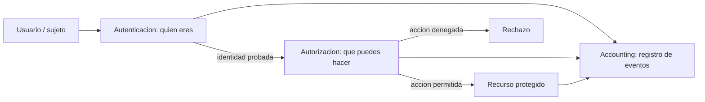

# Clase 001 — Qué es la ciberseguridad: tríada CIA, AAA, superficie de ataque y defensa en profundidad

> Parte: **0 — Fundamentos y prerrequisitos** · Fuente: *NIST SP 800-12 Rev. 1 / CSF 2.0*
> ⏱️ Duración estimada: **90 min** · Nivel: **Fundamentos**

---

## 🎯 Objetivo

Construir el vocabulario y los modelos mentales sobre los que descansa todo el programa. La ciberseguridad no consiste en "detener a los hackers malos": consiste en preservar propiedades concretas y medibles de la información y de los sistemas que la procesan. Al terminar esta clase sabrás qué protege realmente la disciplina (tres propiedades esenciales más varias derivadas), cómo se decide y se registra quién puede hacer qué en un sistema, qué es la superficie de ataque de un activo y cómo reducirla, y por qué ninguna defensa aislada basta, de modo que la estrategia correcta es asumir el fallo y apilar controles en capas.

## 📚 Resultados de aprendizaje

Al finalizar, el alumno podrá:

1. **Definir** las tres propiedades de la tríada CIA y dar un ejemplo de ataque contra cada una.
2. **Distinguir** las tres A del modelo AAA (autenticación, autorización, accounting) y ubicarlas en un flujo de acceso.
3. **Enumerar** los componentes de la superficie de ataque de un sistema y proponer cómo reducirla.
4. **Explicar** el principio de defensa en profundidad con capas concretas y su lógica de contención.
5. **Relacionar** cada concepto con controles reales (cifrado, MFA, logs, segmentación).
6. **Diferenciar** con precisión amenaza, vulnerabilidad y riesgo, y situar el modelo zero trust frente al perímetro clásico.

## 🗺️ Temas

| # | Tema | Por qué importa |
|---|------|-----------------|
| 1 | Tríada CIA | Define qué se protege; es el criterio para evaluar cualquier control |
| 2 | Propiedades extendidas | Autenticidad, no repudio y trazabilidad completan CIA |
| 3 | Modelo AAA | Rige el acceso; la mayoría de brechas son fallos de AAA |
| 4 | Superficie de ataque | Lo que no existe no se puede atacar; base del *hardening* |
| 5 | Vectores y amenazas | Distinguir amenaza, vulnerabilidad y riesgo evita confusiones |
| 6 | Defensa en profundidad | Ninguna capa es infalible; asumir compromiso |
| 7 | Principio de mínimo privilegio | Limita el daño de una cuenta comprometida |
| 8 | Modelos zero trust | Evolución moderna del perímetro |

## 🧠 Explicación en profundidad

### La tríada CIA: el criterio con el que se juzga todo

Cuando un profesional evalúa un sistema no se pregunta "¿es seguro?" —una pregunta sin respuesta objetiva— sino "¿qué propiedades de esta información necesito preservar y contra qué?". La respuesta clásica son tres propiedades, la tríada CIA por sus iniciales en inglés: *Confidentiality*, *Integrity* y *Availability*. La confidencialidad exige que la información solo sea accesible para quien está autorizado; se rompe con una fuga o *disclosure* y se protege con cifrado y control de acceso. La integridad exige que los datos no se alteren de forma no autorizada ni indetectable; se rompe con la manipulación o *tampering* y se protege verificando con funciones hash y firmas digitales. La disponibilidad exige que el servicio responda cuando se necesita; se ataca con denegación de servicio (DoS/DDoS) y se protege con redundancia, capacidad de reserva y planes de recuperación.

Lo valioso de la tríada es que las tres propiedades están en tensión: subir una suele bajar otra. Cifrarlo todo refuerza la confidencialidad pero, si pierdes la clave, destruyes tu propia disponibilidad. Replicar datos en cinco lugares mejora la disponibilidad pero multiplica por cinco las copias que hay que mantener confidenciales. Por eso no existe "máxima seguridad" en abstracto: existe un equilibrio elegido a conciencia para cada activo según su valor y su contexto. Un mismo dato puede exigir prioridades opuestas: en un historial médico manda la confidencialidad; en el sistema de frenos de un coche, la integridad y la disponibilidad están por encima de todo.

### Más allá de CIA: autenticidad, no repudio y trazabilidad

La tríada es el punto de partida, no el final. Modelos posteriores como el *Parkerian Hexad* añaden propiedades que en la práctica moderna son imprescindibles. La **autenticidad** garantiza que un mensaje o dato procede realmente de quien dice ser su origen (una firma digital aporta autenticidad además de integridad). El **no repudio** impide que quien realizó una acción pueda negarla después de forma creíble, lo que sostiene contratos electrónicos y registros de auditoría con valor probatorio. La **trazabilidad** o *accountability* liga cada acción a una identidad concreta, y es lo que convierte un montón de logs en una historia reconstruible tras un incidente. Estas propiedades no compiten con CIA: la extienden, y casi siempre se apoyan en criptografía y en un buen registro de eventos.

### AAA: el ciclo de vida de cada acceso

Si CIA dice *qué* proteger, el modelo AAA dice *cómo* se gobierna el acceso. Sus tres A ocurren en orden y no deben confundirse. La **autenticación** responde a "¿quién eres?" y se basa en factores: algo que sabes (contraseña), algo que tienes (un token o el teléfono) y algo que eres (biometría); combinar dos o más factores independientes es la autenticación multifactor (MFA). La **autorización** responde a "¿qué puedes hacer?" y solo tiene sentido una vez probada la identidad; se implementa con modelos como RBAC (por roles) o ABAC (por atributos). El **accounting** responde a "¿qué hiciste y cuándo?" y produce los registros que habilitan la auditoría y el forense. La gran mayoría de las brechas reales no explotan una criptografía rota, sino un fallo en alguna de estas tres A: contraseñas reutilizadas, permisos excesivos o ausencia de logs que permitan detectar el abuso.



### Superficie de ataque: lo que no existe no se puede atacar

La superficie de ataque de un sistema es la suma de todos los puntos por los que un adversario podría intentar entrar o influir: puertos y servicios de red abiertos, APIs y formularios web, dependencias de terceros, cuentas y credenciales, dispositivos físicos y —siempre— las personas que lo operan, expuestas a la ingeniería social. La estrategia defensiva más rentable no es blindar cada punto, sino eliminar los que no aporten valor: un servicio apagado no tiene vulnerabilidades explotables, un puerto cerrado no acepta conexiones y una cuenta que no existe no puede ser secuestrada. Esta es la esencia del *hardening*: minimizar la superficie desactivando lo innecesario antes de reforzar lo que queda. Conviene distinguir la superficie de red (lo alcanzable remotamente), la de aplicación (la lógica expuesta) y la humana (susceptible de engaño), porque cada una exige controles distintos.

### Amenaza, vulnerabilidad y riesgo: tres palabras que no son sinónimos

Confundir estos tres términos lleva a decisiones malas. Una **amenaza** es un agente o evento que podría causar daño (un grupo de ransomware, un empleado descontento, un incendio). Una **vulnerabilidad** es una debilidad explotable en el activo (un software sin parchear, una contraseña débil, una puerta sin cerradura). El **riesgo** es la combinación de ambos junto con el impacto: informalmente, riesgo ≈ probabilidad de que una amenaza explote una vulnerabilidad × impacto sobre el activo. La consecuencia práctica es que no toda vulnerabilidad merece la misma prisa: una vulnerabilidad crítica en un sistema aislado sin datos sensibles puede ser menos urgente que una media en un servidor expuesto con información valiosa. La gestión de riesgo es priorización, no perfeccionismo.

### Defensa en profundidad y zero trust: asumir que algo fallará

Ninguna capa de seguridad es infalible, así que la arquitectura correcta parte de asumir que alguna caerá y coloca controles redundantes en profundidad, de modo que romper una barrera todavía deje al atacante frente a otra. Se apilan capas desde el perímetro hasta el dato: red, host, aplicación, datos y el factor humano. El **principio de mínimo privilegio** atraviesa todas: cada cuenta, proceso o servicio recibe solo los permisos que necesita para su función, de forma que comprometer uno no entregue el reino entero. El modelo **zero trust** es la evolución moderna de esta idea: elimina la confianza implícita basada en la ubicación de red ("si estás dentro del firewall, eres de fiar") y exige verificar identidad y contexto en cada acceso, sin importar desde dónde llegue. Zero trust no reemplaza la defensa en profundidad; la refina, porque sigue apilando controles pero deja de conceder una zona interna "de confianza" por defecto.

```text
                    ATACANTE
                       |
   +-------------------v--------------------+
   |  Capa 1: Perimetro (firewall, filtrado) |
   +-------------------+--------------------+
   |  Capa 2: Red (segmentacion, IDS/IPS)    |
   +-------------------+--------------------+
   |  Capa 3: Host (EDR, parches, hardening) |
   +-------------------+--------------------+
   |  Capa 4: Aplicacion (validacion, WAF)   |
   +-------------------+--------------------+
   |  Capa 5: Datos (cifrado, backups)       |
   +-------------------+--------------------+
   |  Capa 6: Humano (MFA, concienciacion)   |
   +----------------------------------------+
         Si una capa cae, la siguiente contiene
```

## 📖 Definiciones y características

- **Confidencialidad**: garantía de que la información solo es accesible a quien está autorizado. Se rompe con una fuga o *disclosure* y se protege con cifrado y control de acceso. Es la propiedad más intuitiva pero no siempre la prioritaria: en muchos sistemas industriales importa menos que la integridad.
- **Integridad**: garantía de que los datos no se alteran de forma no autorizada ni indetectable. Se verifica con funciones hash y firmas digitales, y se rompe con manipulación (*tampering*). Sin integridad, ni la confidencialidad ni la disponibilidad significan nada, porque no sabrías si el dato es fiable.
- **Disponibilidad**: garantía de que el servicio está accesible cuando se necesita. Se ataca con DoS/DDoS y se protege con redundancia, capacidad de reserva y recuperación ante desastres. Es una propiedad de seguridad de pleno derecho, no un mero asunto de infraestructura.
- **Autenticación**: proceso de probar que una identidad es quien dice ser mediante factores (algo que sabes, tienes o eres). Sin autenticación fiable, todo lo demás carece de base porque no hay a quién atribuir acciones ni permisos.
- **Autorización**: decisión sobre qué puede hacer una identidad ya autenticada. Se implementa con modelos como RBAC o ABAC y depende del mínimo privilegio para limitar el daño de una cuenta comprometida.
- **Accounting / Auditoría**: registro de quién hizo qué y cuándo. Habilita la trazabilidad, la detección de abusos y la investigación forense; sin logs adecuados, un incidente es invisible o irreconstruible.
- **Superficie de ataque**: suma de todos los puntos por los que un atacante puede intentar entrar (puertos, APIs, formularios, dependencias, personas). Reducirla desactivando lo innecesario es la forma más rentable de bajar el riesgo.
- **Amenaza**: agente o evento con potencial de causar daño (grupo criminal, insider, desastre natural). Existe con independencia de que tengas o no una vulnerabilidad que explote.
- **Vulnerabilidad**: debilidad explotable en un activo (software sin parche, credencial débil, mala configuración). Es solo un ingrediente del riesgo, no el riesgo en sí.
- **Riesgo**: combinación de la probabilidad de que una amenaza explote una vulnerabilidad y el impacto resultante. Es lo que de verdad se gestiona y prioriza, no las vulnerabilidades una a una.
- **Defensa en profundidad**: estrategia de apilar controles redundantes en capas asumiendo que alguna fallará, para que ningún fallo único comprometa el sistema entero.
- **Zero trust**: modelo que elimina la confianza implícita por ubicación de red y verifica identidad y contexto en cada acceso; complementa, no sustituye, la defensa en profundidad.

## 📔 Glosario

| Término | Definición concisa |
|---------|--------------------|
| CIA | Confidencialidad, Integridad y Disponibilidad; las tres propiedades base a proteger |
| AAA | Autenticación, Autorización y Accounting; el modelo de gobierno del acceso |
| MFA | Autenticación multifactor: combinar dos o más factores independientes |
| RBAC | Control de acceso basado en roles |
| ABAC | Control de acceso basado en atributos |
| Hardening | Reducir la superficie de ataque desactivando y reforzando componentes |
| DoS / DDoS | Denegación de servicio (distribuida): ataque contra la disponibilidad |
| Disclosure | Revelación no autorizada de información (rompe confidencialidad) |
| Tampering | Alteración no autorizada de datos (rompe integridad) |
| No repudio | Imposibilidad de negar de forma creíble una acción realizada |
| Mínimo privilegio | Conceder solo los permisos estrictamente necesarios |
| WAF | Web Application Firewall: filtra tráfico HTTP malicioso |
| EDR | Endpoint Detection and Response: detección y respuesta en el host |
| Superficie de ataque | Conjunto de todos los puntos de entrada posibles a un sistema |

## 🧰 Herramientas y preparación

Esta clase es conceptual, pero conviene tener papel o una pizarra digital para diagramar. Instala **draw.io** o usa <https://app.diagrams.net> para dibujar flujos de acceso AAA y capas de defensa. Ten el navegador a mano para consultar dos fuentes primarias: el **NIST Cybersecurity Framework 2.0** y el glosario de términos del **NIST** (<https://csrc.nist.gov/glossary>), que fija definiciones oficiales que usaremos durante todo el programa. No hace falta laboratorio ofensivo todavía; se prepara en la Clase 004. Si quieres ir practicando la mentalidad, elige un sistema real que conozcas para usarlo como ejemplo vivo a lo largo de la clase.

## 🧪 Laboratorio guiado

1. Elige un sistema real que conozcas (tu correo personal, un servidor web, un cajero automático). Anótalo; será tu activo de referencia.
2. **CIA por activo**: para ese sistema, escribe un ejemplo concreto de ataque que rompa (a) confidencialidad, (b) integridad y (c) disponibilidad. Justifica por qué cada uno afecta a esa propiedad y no a otra.
3. **Prioridad CIA**: ordena las tres propiedades para tu activo según su valor real y explica el criterio. No hay respuesta única; hay respuesta justificada.
4. **Flujo AAA**: dibuja en draw.io el recorrido de un login: identidad → autenticación (¿qué factores?) → autorización (¿qué permisos concede?) → accounting (¿qué eventos registra?).
5. **Mapa de superficie de ataque**: lista todos los puntos de entrada del sistema. Para un servidor web típico: puertos 80/443, SSH en el 22, panel de administración, formularios, dependencias de terceros y el propio administrador (ingeniería social).
6. **Reducción**: junto a cada punto, escribe una medida de *hardening* (cerrar puerto, exigir MFA, poner un WAF, parchear, formar al personal).
7. **Capas de defensa**: reorganiza tus controles en capas —perímetro (firewall), red (segmentación), host (EDR, parches), aplicación (validación), datos (cifrado) y humano (concienciación).
8. **Prueba de contención**: para cada capa, contesta "si esta cae, ¿qué otra frena al atacante?". Esa cadena de respuestas es la esencia de la defensa en profundidad.

> ℹ️ **Nota ética**: este ejercicio es de análisis sobre sistemas propios o hipotéticos. No escanees ni pruebes sistemas de terceros sin autorización escrita.

## ✍️ Ejercicios

1. Clasifica estos incidentes según qué propiedad CIA violan principalmente: ransomware, *defacement* de una web, robo de una base de datos, ataque de amplificación DNS.
2. Explica con un ejemplo propio la diferencia entre **amenaza**, **vulnerabilidad** y **riesgo**, y calcula informalmente el riesgo de un caso.
3. Diseña un esquema AAA para una app bancaria: ¿qué factores de autenticación y qué niveles de autorización usarías, y qué eventos registrarías?
4. Toma un dispositivo IoT doméstico y enumera su superficie de ataque completa, separando la parte de red, la de aplicación y la humana.
5. Un servidor tiene un único control: un firewall perimetral. Argumenta por qué es insuficiente y propón tres capas adicionales con su función.
6. Explica cómo una firma digital aporta a la vez integridad, autenticidad y no repudio, y cuál de las tres no cubre por sí sola.
7. Investiga y resume en cinco líneas qué cambia el modelo **zero trust** respecto al perímetro clásico y qué problema concreto resuelve.

## 📝 Reto verificable

Redacta una ficha de una página para un activo de tu elección que contenga: (1) su clasificación CIA con justificación de la prioridad, (2) su matriz AAA con factores y permisos, (3) su mapa de superficie de ataque con al menos 6 puntos, y (4) un diagrama de defensa en profundidad con un mínimo de 4 capas.

**Criterio de aceptación**: la ficha vincula cada punto de la superficie de ataque a al menos un control, y cada control queda asignado a una capa de la defensa en profundidad. Un revisor debe poder señalar, para al menos dos escenarios de fallo, qué capa contiene el ataque cuando la anterior cede.

## ⚠️ Errores comunes

| Síntoma / mensaje | Causa y cómo arreglar |
|-------------------|-----------------------|
| Confundir autenticación con autorización | Autenticar = *¿quién eres?*; autorizar = *¿qué puedes hacer?*. Recuerda el orden: primero autenticas, luego autorizas. |
| Tratar la disponibilidad como algo "de infraestructura" y no de seguridad | Un DoS es un ataque de seguridad; la A de CIA es tan importante como las otras dos. |
| Creer que cifrar lo resuelve todo | El cifrado protege la confidencialidad, no la integridad ni la disponibilidad; hacen falta firmas, hashes y redundancia. |
| Confundir riesgo con vulnerabilidad | Riesgo ≈ probabilidad × impacto sobre un activo; la vulnerabilidad es solo un ingrediente. |
| Diseñar una sola línea de defensa "perfecta" | Asume que fallará; por eso se apilan capas y se aplica mínimo privilegio. |
| Creer que zero trust significa "no confiar en nadie" y basta con eso | Zero trust elimina la confianza *implícita por red*, pero sigue exigiendo capas y verificación continua. |

## ❓ Preguntas frecuentes

**❓ ¿La tríada CIA está desactualizada?** No, sigue siendo el marco base. Se ha extendido con autenticidad, no repudio y trazabilidad (modelos como el *Parkerian Hexad*), pero CIA continúa siendo el punto de partida obligatorio para evaluar cualquier control.

**❓ ¿AAA es lo mismo que MFA?** No. AAA es el modelo completo de gobierno del acceso (autenticación, autorización, accounting). MFA es solo una forma de reforzar la *primera* A combinando varios factores independientes.

**❓ ¿Reducir la superficie de ataque no limita la funcionalidad?** A veces sí, y ahí está el equilibrio: se desactiva lo que no se usa y se conserva lo necesario. Un servicio apagado no tiene vulnerabilidades explotables, así que la pregunta correcta es "¿esto aporta valor suficiente para justificar su riesgo?".

**❓ ¿Zero trust reemplaza la defensa en profundidad?** No, la complementa: zero trust elimina la confianza implícita por ubicación de red, pero sigue apilando controles en capas y añade verificación continua de identidad y contexto.

**❓ ¿Por dónde empieza un atacante real, por la tecnología o por las personas?** Con frecuencia por las personas: el phishing y la ingeniería social explotan la capa humana, que suele ser la más barata de atacar. Por eso la concienciación y la MFA son controles de altísimo retorno.

## 🔗 Referencias

- NIST SP 800-12 Rev. 1, *An Introduction to Information Security* — <https://csrc.nist.gov/pubs/sp/800/12/r1/final>
- NIST Cybersecurity Framework 2.0 — <https://www.nist.gov/cyberframework>
- NIST SP 800-207, *Zero Trust Architecture* — <https://csrc.nist.gov/pubs/sp/800/207/final>
- NIST Glossary (CSRC) — <https://csrc.nist.gov/glossary>
- OWASP, *Attack Surface Analysis Cheat Sheet* — <https://cheatsheetseries.owasp.org/>

## 📥 Material descargable

- 📄 [Guía en PDF](./clase-001-guia.pdf) — versión imprimible de esta clase.
- 🎞️ [Presentación (PPTX)](./clase-001-presentacion.pptx) — deck para proyectar en clase.

## ⬅️ Clase anterior

[Volver al índice del programa](../../README.md)

## ➡️ Siguiente clase

[Clase 002 — El panorama de amenazas moderno: actores, motivaciones y Cyber Kill Chain](../002-el-panorama-de-amenazas-moderno-actores-motivaciones-y-cyber-kill-chain/README.md)
