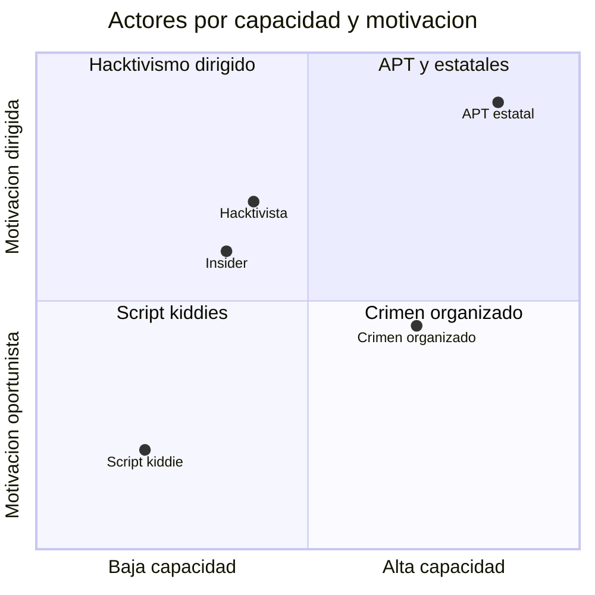
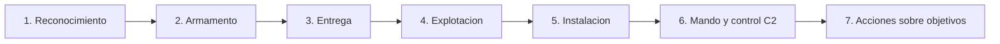

# Clase 002 — El panorama de amenazas moderno: actores, motivaciones y Cyber Kill Chain

> Parte: **0 — Fundamentos y prerrequisitos** · Fuente: *Lockheed Martin, Intelligence-Driven Computer Network Defense (Kill Chain)*
> ⏱️ Duración estimada: **90 min** · Nivel: **Fundamentos**

---

## 🎯 Objetivo

Entender quién ataca, por qué lo hace y cómo se estructura un ataque dirigido de principio a fin. La defensa eficaz no reacciona a golpes aislados: anticipa el comportamiento del adversario y decide dónde interrumpirlo con el menor coste. Al terminar podrás clasificar a un adversario por sus capacidades y motivaciones, descomponer un incidente en las fases de la Cyber Kill Chain para identificar en qué punto detectarlo o cortarlo, y leer informes de *threat intelligence* con el vocabulario preciso que distingue un indicador efímero de un comportamiento duradero.

## 📚 Resultados de aprendizaje

Al finalizar, el alumno podrá:

1. **Clasificar** actores de amenaza por tipo, capacidad y motivación.
2. **Describir** las siete fases de la Cyber Kill Chain de Lockheed Martin.
3. **Ubicar** controles defensivos en cada fase de la cadena.
4. **Diferenciar** amenaza oportunista de amenaza persistente avanzada (APT).
5. **Interpretar** informes de *threat intelligence* con vocabulario correcto.
6. **Distinguir** indicadores de compromiso (IoC) de tácticas, técnicas y procedimientos (TTP) y su distinta caducidad.

## 🗺️ Temas

| # | Tema | Por qué importa |
|---|------|-----------------|
| 1 | Tipos de actor | Un script kiddie y un Estado-nación exigen defensas distintas |
| 2 | Motivaciones | Financiera, geopolítica, hacktivismo, insider |
| 3 | Cyber Kill Chain | Modelo para anticipar y romper el ataque |
| 4 | APT | Adversarios persistentes con recursos y objetivos |
| 5 | Ransomware moderno | Doble extorsión y RaaS como industria |
| 6 | Insider threat | El riesgo desde dentro, a menudo subestimado |
| 7 | Threat intelligence | Cómo se produce y consume información de amenazas |
| 8 | IoC vs. TTP | Indicadores efímeros vs. comportamientos duraderos |

## 🧠 Explicación en profundidad

### Quién ataca: capacidad y motivación como ejes

No todos los adversarios son iguales, y tratarlos como si lo fueran lleva a gastar mal el presupuesto de defensa. Conviene situar a cada actor en dos ejes independientes: su **capacidad** (recursos, habilidad técnica, acceso a exploits propios) y su **motivación** (qué persigue y con cuánta determinación). En el extremo bajo de capacidad están los *script kiddies*, que reutilizan herramientas ajenas sin entenderlas del todo y buscan blancos fáciles y oportunistas. Suben en capacidad los ciberdelincuentes organizados, motivados por el dinero y hoy estructurados como auténticas empresas. Los **hacktivistas** persiguen un fin político o social y suelen buscar visibilidad (defacements, filtraciones) más que sigilo. Los **insiders** —empleados o colaboradores— son peligrosos porque ya tienen acceso legítimo, y pueden ser maliciosos o simplemente negligentes. En la cúspide están los actores **estatales** y las **APT**, con financiación, tiempo y objetivos estratégicos que priorizan la permanencia silenciosa sobre el golpe rápido. La clave operativa: un actor muy motivado puede ser poco capaz, y uno muy capaz puede no tener interés en ti; evalúa siempre ambos ejes por separado.

### La Cyber Kill Chain: descomponer el ataque para poder cortarlo

Lockheed Martin propuso en 2011 un modelo que describe un intrusion dirigido como una cadena de siete fases encadenadas, la *Cyber Kill Chain*. Su valor no es descriptivo sino operativo: si un ataque debe completar las siete fases para tener éxito, al defensor le basta con romper **una** para frustrarlo, y cuanto antes lo haga, más barato le sale. Las fases son: **reconocimiento** (el atacante estudia a la víctima y recopila información), **armamento** (*weaponization*: prepara el artefacto malicioso, por ejemplo un documento con exploit), **entrega** (lo hace llegar, típicamente por correo, web o USB), **explotación** (el exploit se dispara y ejecuta código), **instalación** (se planta persistencia, como una puerta trasera), **mando y control** (*C2*: el implante se comunica con la infraestructura del atacante para recibir órdenes) y **acciones sobre objetivos** (exfiltrar datos, cifrar para pedir rescate, sabotear). Detectar en "entrega" —filtrando un correo— es mucho más barato que descubrir el ataque en "acciones sobre objetivos", cuando el daño ya está hecho.

Conviene tomar la cadena como guía, no como dogma. Los ataques modernos iteran, saltan fases y a veces empiezan comprando un acceso ya existente a un *initial access broker*, saltándose el reconocimiento clásico. Aun así, la lógica de "identifica la fase y córtala lo antes posible" sigue siendo uno de los marcos mentales más útiles del oficio, y se complementa con matrices más detalladas como MITRE ATT&CK, que verás en la clase siguiente.

### Ransomware moderno: el cibercrimen convertido en industria

El ransomware dejó de ser un programa que cifra archivos para convertirse en un ecosistema económico. El modelo **RaaS** (*Ransomware as a Service*) separa a quien desarrolla el malware de quien lo despliega: los operadores mantienen el código y la infraestructura, y los afiliados lo usan a cambio de un porcentaje del rescate. Esto baja drásticamente la barrera de entrada y escala el problema. A la vez apareció la **doble extorsión**: antes de cifrar, el atacante exfiltra los datos, de modo que aunque la víctima tenga copias de seguridad sigue bajo la amenaza de que se publique la información robada. Algunos grupos añaden una tercera y cuarta presión (ataques DoS o avisos a los clientes de la víctima). Defenderse exige copias de seguridad *offline* y probadas, segmentación que frene el movimiento lateral, y detección temprana antes de que se llegue a la fase de cifrado.

### IoC frente a TTP: la pirámide del dolor

Al consumir *threat intelligence* es capital distinguir dos niveles de información. Un **IoC** (indicador de compromiso) es una evidencia concreta y atómica: un hash de un fichero malicioso, una dirección IP, un dominio de C2. Son fáciles de compartir y de bloquear, pero también triviales de rotar para el atacante, que cambia una IP o recompila el binario en minutos. Un **TTP** (táctica, técnica y procedimiento) describe *cómo* se comporta el adversario: usa PowerShell ofuscado para descargar la carga, persiste mediante tareas programadas, exfiltra por DNS. Cambiar un comportamiento arraigado le cuesta mucho más que cambiar una IP. Esta es la idea de la *pirámide del dolor* de David Bianco: cuanto más arriba en la pirámide (de hashes a TTP) se centra tu detección, más caro le resulta al atacante evadirte. Bloquear solo IoC da una sensación de seguridad efímera; cazar por TTP y comportamiento es lo que sostiene una defensa duradera.

### Controles por fase: dónde poner el dinero

El poder combinado de la Kill Chain y la distinción IoC/TTP es que permite asignar cada control defensivo a la fase donde actúa. La tabla siguiente ilustra el mapeo, que después construirás tú mismo en el laboratorio.

| Fase de la Kill Chain | Señal observable | Control que la corta |
|-----------------------|------------------|----------------------|
| Reconocimiento | Escaneos, OSINT sobre la empresa | Minimizar exposición, monitorizar |
| Armamento | (Ocurre en infraestructura del atacante) | *Threat intel* proactiva |
| Entrega | Correo con adjunto o enlace | Filtrado de correo, sandbox |
| Explotación | Comportamiento anómalo del proceso | Parcheo, EDR, hardening |
| Instalación | Persistencia nueva (tarea, servicio) | EDR, control de aplicaciones |
| Mando y control (C2) | Conexión saliente a dominio raro | Bloqueo de salida, proxy, DNS filtering |
| Acciones sobre objetivos | Cifrado masivo, exfiltración | DLP, backups, segmentación |

## 📖 Definiciones y características

- **Actor de amenaza**: entidad (persona o grupo) capaz de causar daño. Se caracteriza por su capacidad, sus recursos y su motivación, tres factores que deben evaluarse por separado para dimensionar la defensa.
- **APT (Advanced Persistent Threat)**: adversario sofisticado y persistente, normalmente estatal o de crimen organizado de alto nivel. Su rasgo distintivo es que prioriza el sigilo y la permanencia prolongada sobre la rapidez del golpe.
- **Cyber Kill Chain**: modelo de siete fases (reconocimiento, armamento, entrega, explotación, instalación, C2 y acciones sobre objetivos). Su utilidad es que romper una sola fase frustra el ataque completo, y cortar temprano cuesta menos.
- **Reconocimiento**: fase inicial en la que el atacante recopila información sobre la víctima (OSINT, escaneos) para preparar el ataque. Reducir la exposición pública encarece esta fase.
- **Mando y control (C2)**: canal por el que un implante recibe órdenes de la infraestructura del atacante. Cortar la salida de red es uno de los controles más efectivos contra esta fase.
- **IoC (Indicator of Compromise)**: evidencia concreta y atómica de un ataque (hash, IP, dominio). Es fácil de bloquear pero también trivial de rotar por el atacante, por lo que caduca rápido.
- **TTP (Tácticas, Técnicas y Procedimientos)**: descripción de cómo opera un adversario. Es más estable que los IoC y constituye la base de la caza de amenazas y de una detección duradera.
- **Ransomware como servicio (RaaS)**: modelo de negocio en el que unos operadores alquilan el malware y la infraestructura a afiliados a cambio de un porcentaje. Profesionaliza y escala el cibercrimen.
- **Doble extorsión**: táctica que combina cifrar los datos con exfiltrarlos y amenazar con publicarlos, de modo que las copias de seguridad por sí solas ya no bastan para negarse a pagar.
- **Insider threat**: riesgo originado por alguien con acceso legítimo (empleado, contratista). Puede ser malicioso o negligente; ambos casos exigen segregación de funciones y monitorización interna.
- **Threat intelligence**: información procesada sobre amenazas (actores, campañas, indicadores) que permite priorizar defensas. Se consume desde estratégica (tendencias) hasta operativa y técnica (IoC concretos).

## 📔 Glosario

| Término | Definición concisa |
|---------|--------------------|
| APT | Advanced Persistent Threat: adversario sofisticado, persistente y con recursos |
| Kill Chain | Modelo de 7 fases de un ataque dirigido de Lockheed Martin |
| C2 / C&C | Command and Control: canal de órdenes entre implante y atacante |
| IoC | Indicator of Compromise: evidencia atómica de un ataque |
| TTP | Tácticas, Técnicas y Procedimientos: comportamiento del adversario |
| RaaS | Ransomware as a Service: modelo de alquiler del malware |
| Script kiddie | Atacante de baja capacidad que reutiliza herramientas ajenas |
| Hacktivismo | Ataques motivados por fines políticos o sociales |
| Insider | Actor con acceso legítimo interno, malicioso o negligente |
| OSINT | Inteligencia de fuentes abiertas, base del reconocimiento |
| Weaponization | Fase de preparación del artefacto malicioso |
| Movimiento lateral | Desplazamiento del atacante entre sistemas ya dentro de la red |
| DBIR | Verizon Data Breach Investigations Report, informe anual de brechas |
| Pirámide del dolor | Jerarquía de indicadores según lo caro que es evadirlos |

## 🧰 Herramientas y preparación

Consulta fuentes reales de *threat intelligence*: la matriz de **MITRE ATT&CK** (<https://attack.mitre.org>), el **catálogo CISA KEV** de vulnerabilidades explotadas activamente (<https://www.cisa.gov/known-exploited-vulnerabilities-catalog>) y los informes anuales públicos como el **Verizon DBIR** y el **ENISA Threat Landscape**. Crea una cuenta gratuita en **AlienVault OTX** o revisa feeds abiertos para ver IoC reales y familiarizarte con su formato. No se requiere laboratorio ofensivo; el trabajo de esta clase es de análisis y clasificación sobre casos públicos documentados.

## 🧪 Laboratorio guiado

1. Elige un incidente público bien documentado (por ejemplo, un caso de ransomware o de compromiso de la cadena de suministro descrito en un aviso de CISA).
2. **Mapea la Kill Chain**: para cada una de las 7 fases, escribe qué hizo el atacante en ese incidente. Si falta información, márcalo explícitamente como "desconocido" en lugar de inventarlo.
3. **Perfil del actor**: clasifica al adversario por tipo, motivación probable y nivel de recursos, y sitúalo en los dos ejes (capacidad y motivación). Justifica con evidencia del informe.
4. **Controles por fase**: junto a cada fase, escribe un control defensivo que la habría cortado (filtrado de correo en "entrega", EDR en "instalación", bloqueo de salida en "C2").
5. **IoC vs. TTP**: extrae del informe 3 IoC y 3 TTP. Razona cuáles caducan antes y por qué, situándolos en la pirámide del dolor.
6. **Correlación con ATT&CK**: identifica al menos 3 técnicas de MITRE ATT&CK presentes en el incidente y anota sus IDs (formato `Txxxx`), verificándolos contra el sitio oficial.

> ℹ️ **Nota ética**: trabaja siempre sobre incidentes públicos y ya documentados. No intentes contactar con la infraestructura del atacante ni "verificar" IoC conectándote a ellos.

## ✍️ Ejercicios

1. Ordena de menor a mayor sofisticación: hacktivista, script kiddie, APT estatal, insider malicioso, y justifica el orden con los dos ejes.
2. Explica por qué romper la cadena en la fase de entrega es más barato que hacerlo en "acciones sobre objetivos".
3. Da un ejemplo de IoC y uno de TTP para una campaña de phishing, y sitúalos en la pirámide del dolor.
4. Contrasta la motivación de un grupo de ransomware con la de una APT estatal: ¿qué objetivos persiguen y cómo cambia eso su comportamiento?
5. Investiga un grupo APT documentado en ATT&CK y resume sus TTP principales con al menos dos IDs de técnica.
6. Diseña una tabla de detección propia: fase de la Kill Chain → señal observable → herramienta que la capta.
7. Argumenta por qué un programa que solo bloquea IoC queda desactualizado en horas y qué añadirías para una defensa duradera.

## 📝 Reto verificable

Elabora un informe de una página tipo *threat profile* sobre un actor o campaña real: incluye clasificación del actor en los dos ejes, mapeo completo de la Kill Chain, al menos 5 técnicas ATT&CK con sus IDs verificables, y una recomendación defensiva por cada fase de la cadena.

**Criterio de aceptación**: cada técnica citada existe en la matriz oficial de ATT&CK con su ID verificable contra attack.mitre.org, y cada fase de la Kill Chain tiene al menos un control defensivo asociado. Un compañero debe poder validar todos los IDs y señalar, para dos fases, por qué el control propuesto las corta.

## ⚠️ Errores comunes

| Síntoma / mensaje | Causa y cómo arreglar |
|-------------------|-----------------------|
| Llamar "APT" a cualquier ataque | APT implica persistencia y recursos altos; la mayoría de ataques son oportunistas. Reserva el término para lo que lo merece. |
| Bloquear solo IoC y sentirse seguro | Los IoC rotan en horas; caza también por TTP y comportamiento, más arriba en la pirámide del dolor. |
| Ver la Kill Chain como lineal e inviolable | Los ataques modernos iteran, saltan fases y compran accesos; úsala como guía, no como dogma. |
| Ignorar el insider threat | No todo ataque viene de fuera; los controles internos y la segregación de funciones importan tanto como el perímetro. |
| Confundir motivación con capacidad | Un actor muy motivado puede ser poco capaz y viceversa; evalúa ambos ejes por separado. |
| Pagar el rescate confiando en recuperar todo | La doble extorsión mantiene la amenaza aunque descifres; la prevención y los backups probados son la única salida fiable. |

## ❓ Preguntas frecuentes

**❓ ¿La Kill Chain de Lockheed sigue vigente frente a ATT&CK?** Sí, son complementarias: la Kill Chain aporta la vista macro por fases y ATT&CK detalla las técnicas concretas dentro de cada fase. Se usan juntas, no como alternativas.

**❓ ¿Por qué el ransomware es tan común hoy?** Porque el modelo RaaS bajó la barrera de entrada al alquilar el malware, y la doble extorsión (cifrar más filtrar) aumentó la presión de pago incluso sobre víctimas con copias de seguridad.

**❓ ¿La threat intelligence es solo para grandes empresas?** No. Incluso una pyme puede consumir feeds gratuitos como CISA KEV u OTX para priorizar parches sobre lo que de verdad se está explotando, que es donde más rinde el esfuerzo limitado.

**❓ ¿Un insider siempre es malicioso?** No: muchos incidentes internos son negligentes (un clic en phishing, una mala configuración), no intencionados. Ambos casos requieren control, y la mayoría de las veces la negligencia es más frecuente que la malicia.

**❓ ¿Qué gano distinguiendo IoC de TTP en la práctica?** Ganas durabilidad en la detección: bloquear un TTP obliga al atacante a rediseñar su forma de operar, mientras que bloquear un IoC solo le cuesta cambiar una IP. Inviertes donde más le duele.

## 🔗 Referencias

- Lockheed Martin, *Cyber Kill Chain* — <https://www.lockheedmartin.com/en-us/capabilities/cyber/cyber-kill-chain.html>
- MITRE ATT&CK — <https://attack.mitre.org/>
- CISA Known Exploited Vulnerabilities Catalog — <https://www.cisa.gov/known-exploited-vulnerabilities-catalog>
- Verizon Data Breach Investigations Report (DBIR) — <https://www.verizon.com/business/resources/reports/dbir/>
- ENISA Threat Landscape — <https://www.enisa.europa.eu/topics/cyber-threats/threats-and-trends>

## 📥 Material descargable

- 📄 [Guía en PDF](./clase-002-guia.pdf) — versión imprimible de esta clase.
- 🎞️ [Presentación (PPTX)](./clase-002-presentacion.pptx) — deck para proyectar en clase.

## ⬅️ Clase anterior

[Clase 001 — Qué es la ciberseguridad: tríada CIA, AAA, superficie de ataque y defensa en profundidad](../001-que-es-la-ciberseguridad-triada-cia-aaa-superficie-de-ataque-y-defensa-en-profundidad/README.md)

## ➡️ Siguiente clase

[Clase 003 — Frameworks de seguridad: NIST CSF, ISO 27001, MITRE ATT&CK y Diamond Model](../003-frameworks-de-seguridad-nist-csf-iso-27001-mitre-att-ck-y-diamond-model/README.md)
