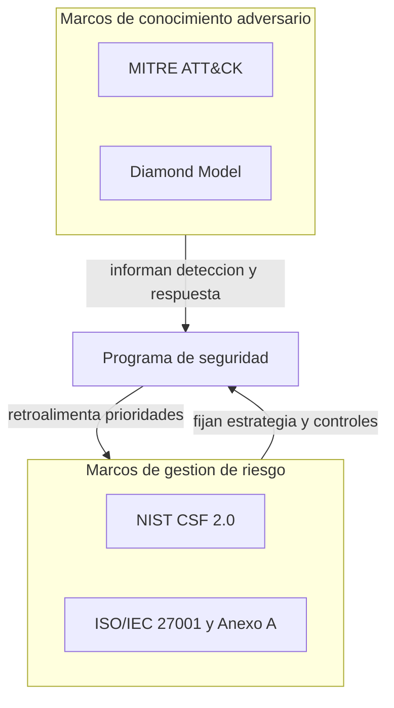
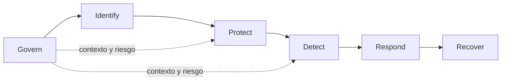
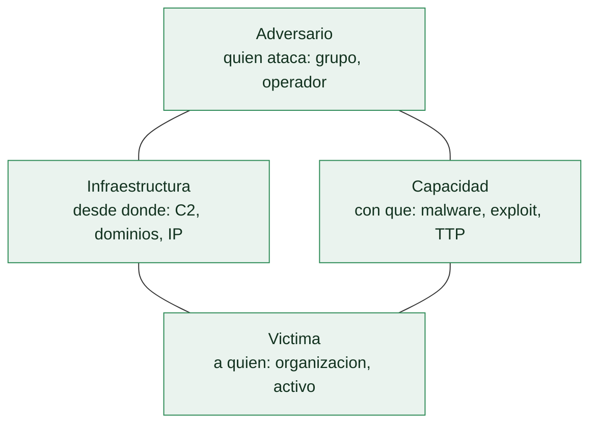

# Clase 003 — Frameworks de seguridad: NIST CSF, ISO 27001, MITRE ATT&CK y Diamond Model

> Parte: **0 — Fundamentos y prerrequisitos** · Fuente: *NIST CSF 2.0 e ISO/IEC 27001:2022*
> ⏱️ Duración estimada: **100 min** · Nivel: **Fundamentos**

---

## 🎯 Objetivo

Conocer los marcos que estructuran la práctica profesional de la ciberseguridad y saber cuándo usar cada uno. Los frameworks no son burocracia: son lenguajes compartidos que permiten a una organización hablar de riesgo, controles y adversarios sin reinventar el vocabulario cada vez. Al terminar podrás ubicar cualquier control o técnica dentro de un marco, entender la diferencia esencial entre un marco de **gestión** (NIST CSF, ISO 27001), que responde a "cómo gobierno mi riesgo", y un marco de **conocimiento adversario** (MITRE ATT&CK, Diamond Model), que responde a "cómo se comporta quien me ataca", y sabrás combinarlos en un mismo caso real.

## 📚 Resultados de aprendizaje

Al finalizar, el alumno podrá:

1. **Enumerar** las funciones del NIST CSF 2.0 y explicar qué agrupa cada una.
2. **Describir** el propósito y la estructura de ISO/IEC 27001 y su Anexo A.
3. **Navegar** la matriz de MITRE ATT&CK por tácticas y técnicas.
4. **Analizar** un evento con el Diamond Model de intrusión.
5. **Combinar** un marco de gestión con uno adversario en un caso real.
6. **Distinguir** cumplimiento de seguridad efectiva y explicar por qué certificar no equivale a estar protegido.

## 🗺️ Temas

| # | Tema | Por qué importa |
|---|------|-----------------|
| 1 | NIST CSF 2.0 | Lenguaje común de gestión de riesgo, ahora con Govern |
| 2 | Tiers y perfiles | Cómo medir madurez y fijar objetivos |
| 3 | ISO/IEC 27001 | Estándar certificable del SGSI |
| 4 | Anexo A (27002) | Catálogo de controles de referencia |
| 5 | MITRE ATT&CK | Base de conocimiento de TTP adversarios |
| 6 | Diamond Model | Análisis de intrusiones en 4 vértices |
| 7 | Mapeo entre marcos | Ninguno basta solo; se complementan |
| 8 | Cumplimiento vs. seguridad | Cumplir no es estar seguro |

## 🧠 Explicación en profundidad

### Dos familias de marcos que responden preguntas distintas

El error más común al empezar con frameworks es tratarlos como si compitieran o como si uno pudiera sustituir a otro. No es así: pertenecen a familias que resuelven problemas diferentes. Los marcos de **gestión de riesgo** —NIST CSF, ISO/IEC 27001— parten de la organización y sus activos y preguntan cómo estructurar el gobierno, la protección, la detección y la recuperación de forma coherente y medible. Los marcos de **conocimiento adversario** —MITRE ATT&CK, Diamond Model— parten del atacante y describen cómo opera, con qué técnicas y en qué relaciones. Un programa maduro usa ambas familias: la de gestión fija la estrategia y la de conocimiento adversario alimenta las decisiones operativas de detección y respuesta. Verlo así evita la trampa de elegir "un framework para todo".

### NIST CSF 2.0: seis funciones y la novedad de Govern

El *Cybersecurity Framework* del NIST organiza toda la actividad de seguridad en un puñado de **funciones** de alto nivel, cada una con categorías y subcategorías. En la versión 2.0, publicada en 2024, son seis: **Govern** (gobernanza: contexto, roles, políticas y gestión de riesgo, la gran novedad respecto a la 1.1), **Identify** (conocer activos, riesgos y dependencias), **Protect** (salvaguardas para limitar el impacto), **Detect** (descubrir eventos y anomalías), **Respond** (actuar ante un incidente) y **Recover** (restaurar capacidades y aprender). La incorporación de Govern como función explícita reconoce que sin gobernanza —sin decisiones de riesgo tomadas al nivel adecuado— el resto queda a merced de la improvisación. El CSF es **voluntario y agnóstico de tecnología**: no dice qué producto comprar, sino qué resultados perseguir, lo que lo hace un lenguaje común entre técnicos, gestión y reguladores.

Para medir dónde está una organización y a dónde quiere llegar, el CSF ofrece dos herramientas. Los **Tiers** (niveles del 1 al 4: Parcial, Informado por riesgo, Repetible, Adaptativo) describen la madurez del proceso de gestión de riesgo. Los **Perfiles** son fotografías del estado "actual" frente al "objetivo" a lo largo de las funciones; la distancia entre ambos perfiles es, literalmente, la lista priorizada de trabajo pendiente.

### ISO/IEC 27001 y su Anexo A: el estándar certificable

Mientras el CSF es voluntario y orientado a resultados, **ISO/IEC 27001** es un estándar internacional **certificable** que define los requisitos de un **SGSI** (Sistema de Gestión de Seguridad de la Información). Su lógica es la mejora continua (el ciclo PDCA: planificar, hacer, verificar, actuar) aplicada a la seguridad, con una organización que evalúa riesgos, selecciona controles, los implanta, los audita y los mejora. El **Anexo A** de la versión 2022 enumera 93 controles de referencia agrupados en cuatro temas: organizacionales, de personas, físicos y tecnológicos; su desarrollo detallado vive en la norma hermana **ISO/IEC 27002**. Un punto que se malentiende a menudo: el Anexo A no es una lista obligatoria a "tachar" entera, sino un catálogo del que se seleccionan controles **según el riesgo** de cada organización, justificando las inclusiones y exclusiones en un documento llamado Declaración de Aplicabilidad.

### MITRE ATT&CK: tácticas y técnicas del adversario real

**MITRE ATT&CK** es una base de conocimiento del comportamiento adversario construida a partir de observaciones **reales**. Se estructura en dos niveles clave: las **tácticas** son el *porqué*, el objetivo que persigue el atacante en un momento dado (acceso inicial, persistencia, escalada de privilegios, exfiltración…), y las **técnicas** son el *cómo*, la manera concreta de lograr esa táctica (por ejemplo, `T1566` Phishing para el acceso inicial). Cada técnica trae descripción, ejemplos de grupos que la usan, y mitigaciones y detecciones asociadas. ATT&CK **no** es una lista de controles ni un checklist de cumplimiento: describe comportamiento, y su valor es permitir a los defensores razonar sobre qué técnicas cubren y cuáles no. El **ATT&CK Navigator** permite pintar mapas de calor de cobertura sobre la matriz y exportarlos como JSON reutilizable.

### Diamond Model: cuatro vértices para analizar una intrusión

El **Diamond Model** modela cada evento de intrusión como un rombo con cuatro vértices relacionados: **adversario** (quién), **capacidad** (con qué: malware, exploit, herramienta), **infraestructura** (desde dónde: dominios, IPs, servidores) y **víctima** (contra quién). Su potencia analítica está en el **pivote**: si conoces un vértice, puedes descubrir los demás siguiendo las relaciones. Por ejemplo, a partir de una infraestructura (un dominio de C2) puedes pivotar hacia otras víctimas que se comunicaron con él, o hacia la capacidad que se distribuyó desde ahí. Es una herramienta de análisis de intrusiones y de *threat intelligence*, no solo de forense, y encaja de forma natural con ATT&CK: las técnicas ATT&CK describen la "capacidad" y parte del "cómo", mientras el Diamond organiza las relaciones del evento completo.

La potencia del modelo está en el **pivote**: conocido un vértice se descubren los
otros. De una muestra de malware (capacidad) se extrae el dominio de mando y control
(infraestructura); de ese dominio salen otras víctimas; y del patrón de víctimas se
infiere la motivación del adversario.

### Cumplimiento no es seguridad, y ningún marco basta solo

Un sistema puede estar certificado en ISO 27001 y ser vulnerable, porque el cumplimiento demuestra que existe un proceso, no que ese proceso esté bien calibrado frente a las amenazas reales de hoy. Del mismo modo, un equipo puede dominar ATT&CK y no tener gobernanza que priorice el gasto. La conclusión práctica es que los marcos se **mapean entre sí**: una técnica ATT&CK que detectas se conecta con la función Detect del CSF y con un control tecnológico del Anexo A que la mitiga. Ese tejido de conexiones —gestión que da estructura, conocimiento adversario que da realismo— es lo que convierte un montón de estándares en un programa de seguridad que funciona.

## 📖 Definiciones y características

- **NIST CSF 2.0**: marco voluntario de gestión de riesgo con seis funciones (Govern, Identify, Protect, Detect, Respond, Recover). Es agnóstico de tecnología y orientado a resultados, lo que lo hace un lenguaje común entre técnica, gestión y reguladores.
- **Funciones del CSF**: los seis grandes agrupadores de actividad. Govern es la novedad de la 2.0 y aporta el contexto, los roles y las decisiones de riesgo que sostienen a las otras cinco.
- **Tiers**: cuatro niveles (Parcial, Informado por riesgo, Repetible, Adaptativo) que describen la madurez del proceso de gestión de riesgo, no la cantidad de controles.
- **Perfil (CSF)**: fotografía del estado actual frente al objetivo a lo largo de las funciones. La brecha entre ambos perfiles es la lista priorizada de trabajo pendiente.
- **SGSI**: Sistema de Gestión de Seguridad de la Información, objeto de ISO/IEC 27001. Se basa en la mejora continua (PDCA) sobre riesgos evaluados.
- **ISO/IEC 27001**: estándar internacional certificable que define los requisitos del SGSI. Certificar demuestra que hay proceso, no que se esté a salvo de toda amenaza.
- **Anexo A / ISO 27002**: catálogo de 93 controles de referencia (versión 2022) en cuatro temas: organizacionales, de personas, físicos y tecnológicos. Se seleccionan según riesgo, no en bloque.
- **MITRE ATT&CK**: base de conocimiento de tácticas (el porqué) y técnicas (el cómo) del adversario, construida sobre observaciones reales. Describe comportamiento, no controles.
- **Táctica vs. técnica**: la táctica es el objetivo del atacante (persistencia, exfiltración); la técnica es la manera concreta de lograrlo (por ejemplo, `T1566` Phishing). Distinguirlas ordena todo el análisis.
- **ATT&CK Navigator**: herramienta web para pintar mapas de calor de cobertura sobre la matriz y exportarlos como JSON reutilizable.
- **Diamond Model**: modelo que relaciona adversario, capacidad, infraestructura y víctima en cada evento de intrusión. Su fuerza es el pivote: conocido un vértice, se descubren los demás.
- **Declaración de Aplicabilidad (SoA)**: documento de ISO 27001 que justifica qué controles del Anexo A se aplican y cuáles se excluyen, y por qué.

## 📔 Glosario

| Término | Definición concisa |
|---------|--------------------|
| NIST CSF | Cybersecurity Framework del NIST, marco voluntario de gestión de riesgo |
| Govern | Función de gobernanza, novedad del CSF 2.0 |
| Tier | Nivel de madurez del proceso de gestión de riesgo (1 a 4) |
| Perfil | Estado actual frente a objetivo en las funciones del CSF |
| SGSI / ISMS | Sistema de Gestión de Seguridad de la Información |
| ISO 27001 | Estándar certificable de requisitos del SGSI |
| ISO 27002 | Guía detallada de los controles del Anexo A |
| Anexo A | Catálogo de 93 controles de referencia (versión 2022) |
| PDCA | Ciclo de mejora continua: Plan, Do, Check, Act |
| ATT&CK | Base de conocimiento de tácticas y técnicas adversarias de MITRE |
| Táctica | Objetivo del adversario en una fase (el porqué) |
| Técnica | Manera concreta de lograr una táctica (el cómo), con ID `Txxxx` |
| Diamond Model | Análisis de intrusión por adversario, capacidad, infraestructura y víctima |
| SoA | Statement of Applicability: justificación de controles ISO aplicados |

## 🧰 Herramientas y preparación

Descarga el **NIST CSF 2.0** (PDF gratuito desde <https://www.nist.gov/cyberframework>). Explora la **matriz de MITRE ATT&CK** en el navegador y el **ATT&CK Navigator** (<https://mitre-attack.github.io/attack-navigator/>) para crear mapas de calor de cobertura. Para ISO, consulta el índice público del Anexo A de la 27001:2022. Ten a mano una hoja de cálculo para construir los mapeos entre marcos. No se requiere laboratorio ofensivo; el trabajo es de análisis y modelado.

## 🧪 Laboratorio guiado

1. **CSF**: toma una organización ficticia (una clínica pequeña) y, para cada una de las 6 funciones del CSF 2.0, escribe una actividad concreta que debería realizar.
2. **Perfil actual vs. objetivo**: asigna a cada función un Tier del 1 al 4 para el estado actual y otro para el deseado. Identifica la mayor brecha y explica por qué priorizarla.
3. **ISO mapeo**: selecciona 5 controles del Anexo A relevantes para esa clínica y justifica cada uno con el riesgo que mitiga, como harías en la Declaración de Aplicabilidad.
4. **ATT&CK Navigator**: crea una capa marcando 5 técnicas que un ransomware usaría contra la clínica, anota sus IDs y exporta el JSON.
5. **Diamond**: para un evento hipotético (un correo malicioso a la recepcionista), rellena los cuatro vértices —adversario, capacidad (el malware), infraestructura (dominio/IP), víctima— y describe un pivote posible entre dos de ellos.
6. **Integración**: muestra cómo una técnica de ATT&CK detectada se conecta con la función Detect del CSF y con un control tecnológico del Anexo A que la mitiga.

> ℹ️ **Nota ética**: todo el ejercicio es de modelado sobre una organización ficticia. No cargues datos reales de terceros ni escanees infraestructura ajena.

## ✍️ Ejercicios

1. ¿Qué función nueva añadió el CSF 2.0 respecto a la 1.1 y qué problema concreto de gobernanza resuelve?
2. Explica con un ejemplo la diferencia entre una táctica y una técnica en ATT&CK, citando un ID real.
3. Da tres controles del Anexo A y clasifícalos en su tema (organizacional, personas, físico o tecnológico).
4. Analiza un incidente sencillo con el Diamond Model y muestra un pivote entre dos vértices distintos.
5. Argumenta por qué "cumplir ISO 27001" no equivale a "estar seguro" con un contraejemplo.
6. Mapea una técnica ATT&CK a la función del CSF que ayudaría a mitigarla y a un control del Anexo A.
7. Explica por qué un programa que solo usa ATT&CK, sin marco de gestión, deja huecos, y qué aporta CSF que ATT&CK no.

## 📝 Reto verificable

Produce un documento que integre los cuatro marcos sobre un mismo escenario: (1) un perfil CSF con estado actual y objetivo para las 6 funciones, (2) una selección justificada de 8 controles del Anexo A vinculados a riesgos, (3) una capa de ATT&CK Navigator con 6 o más técnicas exportada como JSON, y (4) un análisis Diamond de un evento del escenario con al menos un pivote.

**Criterio de aceptación**: el JSON del Navigator carga sin errores en la herramienta oficial, cada control ISO se vincula a un riesgo concreto, y cada técnica ATT&CK se conecta con al menos una función del CSF. El documento demuestra, con al menos dos conexiones explícitas, que gestión y conocimiento adversario se refuerzan mutuamente.

## ⚠️ Errores comunes

| Síntoma / mensaje | Causa y cómo arreglar |
|-------------------|-----------------------|
| Usar ATT&CK como checklist de cumplimiento | ATT&CK describe comportamiento adversario, no es una lista de controles a "tachar". Úsala para razonar sobre cobertura. |
| Confundir ISO 27001 con 27002 | 27001 es el estándar certificable del SGSI; 27002 es la guía detallada de los controles del Anexo A. |
| Certificar por certificar | El cumplimiento sin gestión de riesgo real deja huecos; la seguridad es un proceso continuo, no un sello. |
| Elegir un solo framework para todo | Los de gestión (CSF/ISO) y los adversarios (ATT&CK/Diamond) resuelven problemas distintos; combínalos. |
| Ignorar la nueva función Govern | Gobernanza y contexto son ahora explícitos en el CSF 2.0; omitirla deja el resto sin dirección. |
| Aplicar los 93 controles del Anexo A en bloque | Se seleccionan según riesgo y se justifican en la SoA; aplicarlos todos sin criterio malgasta recursos. |

## ❓ Preguntas frecuentes

**❓ ¿NIST CSF es obligatorio?** No, es voluntario, pero se ha convertido en un lenguaje común y en muchos sectores o países es de facto exigido por contratos o reguladores. Su adopción suele ser una ventaja competitiva además de una buena práctica.

**❓ ¿ATT&CK sustituye a la Kill Chain?** No; ATT&CK detalla técnicas concretas y la Kill Chain da la vista macro por fases. Se usan juntas: la Kill Chain para razonar dónde cortar, ATT&CK para saber con qué técnica se ataca en cada punto.

**❓ ¿Puedo usar solo ATT&CK sin marcos de gestión?** Para operaciones defensivas ayuda mucho, pero sin CSF o ISO faltaría la capa de gobernanza, priorización de riesgo y cumplimiento que decide dónde invertir. ATT&CK dice cómo te atacan; la gestión decide qué proteges primero.

**❓ ¿El Diamond Model es solo para forense?** No; es útil en análisis de intrusiones y *threat intelligence*, no solo tras el incidente. Su capacidad de pivote ayuda a correlacionar campañas y a descubrir víctimas o infraestructura relacionadas.

**❓ ¿Por dónde empiezo si mi organización no tiene nada?** Por Govern e Identify del CSF: entender el contexto, los activos y los riesgos. Sin ese mapa, cualquier control que compres será a ciegas, y los marcos adversarios no tendrán sobre qué priorizar.

## 🔗 Referencias

- NIST Cybersecurity Framework 2.0 — <https://www.nist.gov/cyberframework>
- ISO/IEC 27001:2022 — <https://www.iso.org/standard/27001>
- MITRE ATT&CK y ATT&CK Navigator — <https://attack.mitre.org/>
- Caltagirone, Pendergast y Betz, *The Diamond Model of Intrusion Analysis* — <https://www.activeresponse.org/the-diamond-model/>

## 📥 Material descargable

- 📄 [Guía en PDF](./clase-003-guia.pdf) — versión imprimible de esta clase.
- 🎞️ [Presentación (PPTX)](./clase-003-presentacion.pptx) — deck para proyectar en clase.

## ⬅️ Clase anterior

[Clase 002 — El panorama de amenazas moderno: actores, motivaciones y Cyber Kill Chain](../002-el-panorama-de-amenazas-moderno-actores-motivaciones-y-cyber-kill-chain/README.md)

## ➡️ Siguiente clase

[Clase 004 — Montaje del laboratorio: virtualización, Kali, snapshots y aislamiento de red](../004-montaje-del-laboratorio-virtualizacion-kali-snapshots-y-aislamiento-de-red/README.md)
