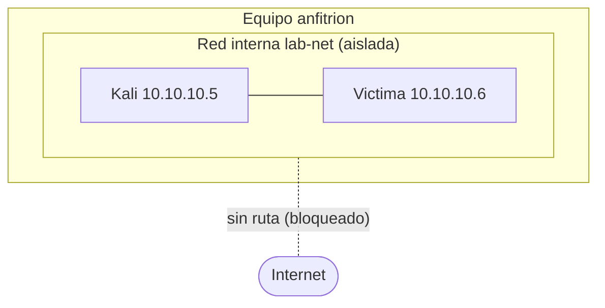

# Clase 004 — Montaje del laboratorio: virtualización, Kali, snapshots y aislamiento de red

> Parte: **0 — Fundamentos y prerrequisitos** · Fuente: *Kali Linux Documentation / OffSec*
> ⏱️ Duración estimada: **180 min** · Nivel: **Fundamentos**

---

## 🎯 Objetivo

Construir un laboratorio de seguridad **aislado, reversible y reproducible** en tu propio equipo.
Practicar técnicas ofensivas requiere un entorno donde el error no tenga consecuencias fuera de
él: una red que no toque Internet ni tu red doméstica, y máquinas que puedas devolver a un estado
limpio en segundos. Al terminar tendrás una estación de trabajo de seguridad y una o más máquinas
víctima en una red interna sin salida. Aprenderás a elegir entre Kali, Parrot, BlackArch y una
plataforma defensiva como Security Onion, a instalarlas y mantenerlas sin confundir una colección
de herramientas con una metodología.

> 🧭 **Principio de portabilidad del programa:** Kali es el entorno de referencia para mostrar
> comandos, no un requisito funcional. Las actividades se evalúan por el objetivo, la evidencia y
> el criterio de seguridad. Puedes trabajar desde Windows, macOS, una distribución Linux general,
> una VM especializada o un contenedor, siempre que uses una herramienta equivalente, documentes
> la versión y conserves el aislamiento. Si una práctica depende de una capacidad exclusiva de un
> sistema operativo, la propia clase debe declararlo.

⚠️ **Nota ética y de seguridad**: todo lo que se practica en este programa se hace **exclusivamente** dentro de este laboratorio aislado o contra sistemas para los que tengas autorización escrita. Atacar redes o equipos ajenos es ilegal. El aislamiento no es opcional: protege a terceros y te protege a ti.

## 📚 Resultados de aprendizaje

Al finalizar, el alumno podrá:

1. **Instalar** un hipervisor y comprobar la virtualización por hardware.
2. **Desplegar** una distribución de seguridad y una VM víctima desde imágenes oficiales verificadas.
3. **Configurar** una red interna/host-only sin acceso a Internet.
4. **Gestionar** snapshots para revertir el estado tras cada práctica.
5. **Verificar** el aislamiento con pruebas de conectividad objetivas.
6. **Justificar** las decisiones de arquitectura del laboratorio (modo de red, recursos, higiene).
7. **Comparar** distribuciones especializadas por función, modelo de actualización y coste operativo.
8. **Gestionar** paquetes, repositorios, actualizaciones, snapshots y evidencia sin romper el lab.
9. **Traducir** una práctica a herramientas equivalentes sin hacerla depender de una distribución.

## 🗺️ Temas

| # | Tema | Por qué importa |
|---|------|-----------------|
| 1 | Virtualización tipo 1 vs. tipo 2 | Elegir hipervisor adecuado al equipo |
| 2 | VT-x/AMD-V | Sin ella, las VMs van lentísimas o no arrancan |
| 3 | Imágenes oficiales y verificación | Evitar ISOs manipuladas (checksum/firma) |
| 4 | Modos de red | NAT, bridged, host-only, internal |
| 5 | Aislamiento | Impedir fugas del laboratorio a producción |
| 6 | Snapshots | Reversibilidad = experimentar sin miedo |
| 7 | Máquinas víctima | Metasploitable, DVWA, VulnHub |
| 8 | Higiene del lab | Recursos, plantillas, mantenimiento |
| 9 | Distribuciones especializadas | Elegir por misión, no por cantidad de herramientas |
| 10 | Instalación y operación | Imágenes, paquetes, actualizaciones y reversión |
| 11 | Portabilidad | Separar el objetivo de la herramienta y del sistema operativo |

## 🧠 Explicación en profundidad

### Virtualización: por qué el laboratorio vive en máquinas virtuales

Un hipervisor es el software que crea y ejecuta máquinas virtuales, entornos de cómputo completos aislados unos de otros y del anfitrión. Se distinguen dos tipos. El **tipo 1** (o *bare-metal*: ESXi, Hyper-V, Proxmox) corre directamente sobre el hardware, sin un sistema operativo anfitrión debajo, y ofrece el mejor rendimiento; es lo habitual en centros de datos. El **tipo 2** (VirtualBox, VMware Workstation) corre como una aplicación sobre tu sistema operativo normal, y es lo adecuado para un laboratorio personal porque es sencillo de instalar y convive con tu escritorio. Para que las VMs rindan de forma aceptable, el procesador debe ofrecer **virtualización asistida por hardware** (VT-x en Intel, AMD-V en AMD): sin ella, el hipervisor tiene que emular la CPU por software y las máquinas van desesperadamente lentas o directamente no arrancan sistemas de 64 bits. Esta extensión suele venir desactivada en la UEFI/BIOS y hay que habilitarla explícitamente.

### La cadena de confianza: verificar la imagen antes de ejecutarla

Descargar una ISO de un sistema de seguridad e instalarla sin verificarla es una contradicción: estarías confiando ciegamente en que nadie manipuló el archivo por el camino. Por eso los proyectos serios publican, junto a cada imagen, un **checksum** criptográfico (SHA-256) y, cuando se puede, una **firma** con su clave. El checksum te dice si el archivo que bajaste es idéntico bit a bit al que publicó el proyecto: recalculas el hash de tu descarga y lo comparas con el valor oficial. Si difiere, la descarga está corrupta o manipulada y **no** debes usarla. La firma va un paso más allá y demuestra que ese checksum lo publicó realmente el proyecto y no un impostor. Este hábito —verificar antes de ejecutar— es un reflejo profesional que aplicarás a cada binario que descargues en tu carrera.

### Distribuciones de ciberseguridad: elegir una función, no una marca

Una **distribución especializada** combina un Linux base, repositorios, configuración y una selección
de herramientas. Ahorra instalación y facilita laboratorios reproducibles, pero no concede permisos,
no reemplaza los fundamentos y no hace que una herramienta sea segura por estar en su menú. Cuantas
más utilidades instales, más espacio, actualizaciones, dependencias y superficie debes gestionar.

| Entorno | Base y propósito | Cuándo elegirlo | Límite que debes recordar |
|---|---|---|---|
| **Kali Linux** | Debian *rolling*; pentesting, investigación y forense | Primera VM ofensiva del curso; abundante documentación y metapaquetes por función | No necesitas `kali-linux-everything`; instala solo lo que usarás |
| **Parrot Security** | Debian; seguridad y forense con perfiles de endurecimiento | Quieres una estación de seguridad completa; Home permite partir mínimo y añadir herramientas | Home y Security difieren sobre todo en software preinstalado; no confundas edición con capacidad |
| **BlackArch** | Repositorio y distribución sobre Arch; arsenal ofensivo muy amplio | Ya administras Arch y necesitas categorías o herramientas específicas | Su modelo *rolling* y amplitud elevan el coste de mantenimiento; no es la opción inicial |
| **Security Onion** | Plataforma Linux defensiva para NSM, detección y búsqueda | Laboratorios SOC con PCAP, Zeek, Suricata y telemetría; usa modo Import/Eval según el ejercicio | No sustituye a Kali y demanda muchos más recursos; producción exige diseño y capacidad propios |
| **Linux general + herramientas** | Ubuntu, Debian, Fedora, Arch u otra base conocida | Ya tienes un entorno fiable o quieres una instalación mínima y auditable | Debes resolver paquetes, rutas y versiones; documenta las diferencias |
| **Contenedor o entorno remoto autorizado** | Herramientas aisladas sobre el SO anfitrión | Tareas acotadas de CLI y equipos con pocos recursos | No emula kernels, Wi-Fi, USB, systemd ni captura de bajo nivel de forma universal |

Kali **Installer** es la opción general para una instalación persistente; **Live** sirve para
arrancar sin instalar y una VM oficial preconstruida reduce pasos. Parrot ofrece ediciones Home y
Security: puedes comenzar con Home y añadir `parrot-tools-full`, aunque en un laboratorio pedagógico
conviene instalar por necesidad. BlackArch ofrece ISO *slim/netinstall* y un repositorio para Arch;
se reserva para alumnado que ya puede recuperar una actualización de Arch. Security Onion es un
nodo defensivo: su modo Import procesa capturas o eventos sin exigir una interfaz de monitoreo en
vivo; Eval añade captura y necesita más CPU, memoria, disco y una interfaz adecuada.

La pregunta correcta no es «¿cuál tiene más herramientas?», sino «¿qué misión, interfaces,
arquitectura, recursos y evidencia necesita este ejercicio?». Para este programa, empieza con
Kali o con tu Linux habitual y crea una VM defensiva separada solo cuando una clase la necesite.

### Tres formas de instalación y su modelo de confianza

1. **VM preconstruida oficial:** es la vía más rápida. Descarga solo del proyecto, verifica hash o
   firma, importa, cambia credenciales si la imagen las documenta, revisa adaptadores y actualiza
   antes de sellar el snapshot. No heredes una red en modo puente por comodidad.
2. **ISO oficial:** ofrece mayor control. Registra URL, fecha, hash, arquitectura y selección de
   paquetes; crea una VM sin red o con NAT temporal para instalar/actualizar y cambia después a
   `internal`. Expulsa la ISO, reinicia, verifica y toma `base-limpia`.
3. **Distribución general + repositorio/herramientas:** minimiza software preinstalado, pero te hace
   responsable de claves, repositorios, compatibilidad y procedencia. No ejecutes un script remoto
   con privilegios sin descargarlo, verificarlo y revisar el procedimiento oficial.

No instales una distribución ofensiva sobre el equipo principal para «ahorrar una VM» al comenzar.
La separación evita contaminar el host con dependencias, credenciales, capturas y configuraciones de
red. Una VM también hace que el estado del curso sea describible y reversible.

### Gestión cotidiana: actualizar sin destruir la reproducibilidad

Estas distribuciones evolucionan continuamente. Actualizar reduce vulnerabilidades conocidas, pero
puede cambiar una salida o romper una herramienta justo antes de una práctica. Usa este ciclo:

1. **Inventariar:** guarda distribución, arquitectura, kernel y versión de las herramientas usadas.
2. **Snapshot previo:** `pre-update-AAAA-MM-DD`; confirma que tienes espacio y una copia exportable
   de la evidencia importante. Un snapshot no sustituye el backup.
3. **Actualizar desde repositorios oficiales:** en Kali, `sudo apt update` seguido de
   `sudo apt full-upgrade`; en Parrot, la documentación recomienda `sudo parrot-upgrade`; en
   BlackArch/Arch, `sudo pacman -Syu`. Security Onion usa su actualizador soportado, no una mezcla
   arbitraria de gestores.
4. **Reiniciar cuando corresponda** y comprobar red, DNS, almacenamiento, hora y herramientas del
   escenario. Repite una prueba corta conocida: una versión que imprime no prueba que el flujo funcione.
5. **Promover o revertir:** si la prueba pasa, crea una nueva base y retira snapshots obsoletos de
   forma planificada; si falla, conserva logs, revierte y resuelve fuera del día de la práctica.

No mezcles repositorios de Debian, Ubuntu, Kali y Parrot: que todos usen APT no significa que sus
paquetes sean intercambiables. Evita instalar «todo»; en Kali, los **metapaquetes** permiten escoger
un núcleo, entorno *headless*, conjunto predeterminado o familias como web, forense o wireless. Fija
la versión relevante en tus notas y no actualices durante una evaluación o encargo salvo que el plan
lo exija. La reproducibilidad necesita un estado conocido, no simplemente «lo último».

### Operar sin depender del sistema operativo

Cada práctica del programa tiene cuatro capas que no deben confundirse:

| Capa | Ejemplo | Qué se conserva al cambiar de SO |
|---|---|---|
| **Objetivo** | Identificar servicios expuestos | La pregunta y el alcance autorizado |
| **Capacidad** | Descubrimiento TCP y *fingerprinting* | Entrada, salida esperada y límites |
| **Implementación** | Nmap desde Kali, macOS o Windows | Opciones equivalentes y versión documentada |
| **Evidencia** | Comando, salida, fecha, objetivo y conclusión | Formato verificable y razonamiento |

Si un comando del texto no existe en tu entorno, no adivines una traducción: consulta la
documentación oficial de la herramienta, reproduce la misma capacidad y anota la diferencia. Un
alumno no aprueba por copiar `apt install`; aprueba cuando instala desde una fuente trazable,
demuestra la capacidad requerida y explica sus límites.

### Modos de red: el corazón del aislamiento

La decisión más importante del laboratorio es cómo conectas las VMs, porque de ahí depende que el entorno sea seguro. Los hipervisores ofrecen cuatro modos y cada uno tiene un nivel de aislamiento distinto. Elegir mal aquí es el fallo que convierte un laboratorio en un riesgo real.

| Modo de red | Quién ve a quién | Salida a Internet | Uso típico |
|-------------|------------------|-------------------|------------|
| NAT | La VM sale, nadie entra a ella | Sí | Actualizar una VM puntualmente |
| Bridged (puente) | La VM es un equipo más de tu LAN | Sí | Casi nunca en un lab de seguridad |
| Host-only | VM ↔ host, pero no a Internet | No | Labs donde el host debe interactuar |
| Internal (interna) | Solo VM ↔ VM | No | Máximo aislamiento para malware/exploits |

Para prácticas ofensivas la elección por defecto es **red interna**: las máquinas solo se ven entre ellas, ni siquiera el anfitrión tiene acceso directo, y no existe ruta hacia Internet ni hacia tu red doméstica. Esto es crítico cuando manejas máquinas deliberadamente vulnerables como Metasploitable, que jamás deben quedar expuestas, o cuando pruebas malware que intentaría "llamar a casa".



### Snapshots: experimentar sin miedo

Un **snapshot** es una fotografía del estado completo de una VM en un instante: su disco y, opcionalmente, su memoria RAM. Es la característica que transforma el aprendizaje ofensivo, porque puedes ejecutar un exploit destructivo, infectar la máquina con malware o romper la configuración a propósito y luego **restaurar** el snapshot para volver en segundos a un punto limpio, como si nada hubiera pasado. La disciplina profesional es tomar un snapshot `base-limpia` de cada VM recién instalada y actualizada, y crear snapshots intermedios antes de cada experimento arriesgado. Un snapshot que incluye la RAM captura también el estado de ejecución (procesos abiertos), mientras que uno sin RAM equivale a apagar y volver a un disco anterior; el primero restaura más fielmente pero ocupa más. Ojo con acumular snapshots indefinidamente: cada uno consume espacio y, encadenados, degradan el rendimiento, así que conviene consolidar o eliminar los antiguos.

### El flujo completo del montaje

Poniéndolo todo junto, el orden lógico de construcción es: comprobar la virtualización por hardware, instalar el hipervisor, verificar y desplegar Kali, verificar y desplegar la víctima, crear la red interna y conectar ambas, direccionar con IPs estáticas en la misma subred, probar que se ven entre sí, comprobar que **ninguna** alcanza Internet, y finalmente sellar el estado limpio con snapshots. Cada paso tiene una verificación objetiva —un `ping` que debe funcionar y otro que debe fallar— para que el aislamiento no sea una suposición, sino un hecho comprobado.

## 📖 Definiciones y características

- **Hipervisor**: software que crea y ejecuta máquinas virtuales. El tipo 1 corre sobre el hardware (ESXi, Hyper-V); el tipo 2 sobre un sistema anfitrión (VirtualBox, VMware Workstation). Para un laboratorio personal, el tipo 2 es suficiente y más cómodo.
- **Virtualización asistida por hardware (VT-x/AMD-V)**: extensiones del procesador que permiten ejecutar VMs con rendimiento aceptable. Sin ellas, la emulación por software hace las máquinas inutilizablemente lentas; suelen venir desactivadas en la UEFI.
- **Snapshot**: fotografía del estado completo de una VM (disco y opcionalmente RAM). Permite volver a un punto limpio en segundos, lo que hace seguro experimentar con exploits o malware.
- **Red host-only**: red virtual entre el anfitrión y las VMs, sin salida a Internet. Aísla del exterior pero el host sigue formando parte de la red, útil cuando el anfitrión debe interactuar con el lab.
- **Red interna (internal)**: red que conecta solo a las VMs entre sí, sin que el host ni Internet tengan acceso. Es el nivel máximo de aislamiento y la opción por defecto para prácticas ofensivas.
- **NAT y bridged**: modos con salida a Internet. NAT permite a la VM salir sin ser alcanzable desde fuera; bridged la convierte en un equipo más de tu LAN. Ambos rompen el aislamiento y se evitan en un lab de seguridad salvo para una actualización puntual.
- **Checksum (SHA-256)**: hash criptográfico que verifica que una descarga es idéntica bit a bit a la publicada. Si no coincide, la imagen está corrupta o manipulada y no debe usarse.
- **Firma**: verificación de que el checksum lo publicó realmente el proyecto y no un impostor, cerrando la cadena de confianza de la descarga.
- **Metasploitable**: máquina virtual deliberadamente vulnerable para practicar de forma legal. Nunca debe exponerse a Internet ni a redes con salida.
- **DVWA (Damn Vulnerable Web Application)**: aplicación web insegura por diseño para practicar vulnerabilidades web dentro del laboratorio.

## 📔 Glosario

| Término | Definición concisa |
|---------|--------------------|
| Hipervisor | Software que ejecuta máquinas virtuales |
| Tipo 1 / bare-metal | Hipervisor que corre directo sobre el hardware |
| Tipo 2 / hosted | Hipervisor que corre sobre un sistema operativo anfitrión |
| VT-x / AMD-V | Virtualización asistida por hardware de Intel / AMD |
| VM | Máquina virtual: entorno de cómputo aislado |
| Snapshot | Fotografía restaurable del estado de una VM |
| Kali Linux | Distribución con herramientas de seguridad ofensiva |
| Metasploitable | VM deliberadamente vulnerable para practicar |
| DVWA | Aplicación web vulnerable por diseño |
| NAT | Modo de red: la VM sale, no es alcanzable desde fuera |
| Bridged | Modo de red: la VM es un equipo más de la LAN |
| Host-only | Red VM ↔ host, sin Internet |
| Internal | Red solo VM ↔ VM, aislamiento máximo |
| Checksum / SHA-256 | Hash para verificar integridad de una descarga |
| OVA / OVF | Formato de empaquetado e importación de VMs |

## 🧰 Herramientas y preparación

Instala **VirtualBox**, VMware Workstation o el hipervisor que ya administres. Descarga una VM/ISO
oficial de **Kali Linux** o **Parrot Security** y una víctima diseñada para practicar, como
Metasploitable 2 o DVWA. BlackArch queda como variante avanzada. Security Onion se instala en una
VM aparte cuando llegues a prácticas defensivas y el equipo cumpla sus requisitos; no lo añadas al
laboratorio inicial por coleccionismo.

Verifica el hash y, si el proyecto la ofrece, la firma. Comprueba VT-x/AMD-V, espacio y RAM. Como
referencia pedagógica, 8 GB de RAM permite una VM de escritorio y una víctima pequeña; 16 GB da más
margen. Consulta siempre los requisitos oficiales actuales: una plataforma de monitoreo con
indexación y PCAP puede necesitar mucho más que una estación Kali.

## 🧪 Laboratorio guiado

1. **Comprobar la virtualización**. En Windows, abre el Administrador de tareas → Rendimiento → CPU y confirma "Virtualización: habilitada". Si no lo está, actívala en la UEFI (VT-x/AMD-V).
2. **Elegir y registrar el entorno**. Escribe misión, distribución/edición, arquitectura, tipo de
   imagen, URL oficial, fecha y recursos asignados. Justifica por qué Kali, Parrot o tu Linux normal
   cubre la práctica sin instalar herramientas innecesarias.
3. **Verificar la imagen**. Descarga la imagen y su checksum oficial. En PowerShell:

   ```powershell
   Get-FileHash .\kali-linux-*.iso -Algorithm SHA256
   ```

   Compara el resultado con el valor publicado en kali.org. Si no coincide, no la uses y vuelve a descargarla.
4. **Crear la VM de seguridad**: 2 vCPU, 4 GB de RAM y 40–60 GB de disco como punto de partida
   para Kali/Parrot. Importa la VM oficial o monta la ISO. No copies credenciales ni claves SSH de
   otra instalación.
5. **Actualizar con red temporal controlada**. Usa NAT solo durante esta fase, actualiza desde los
   repositorios oficiales, reinicia y registra versiones. Apaga la VM y retira el adaptador NAT.
6. **Crear la red interna**. En la configuración de cada VM → Red, selecciona "Red interna" y
   ponle el nombre `lab-net`. Asigna ese adaptador a la estación y a la víctima.
7. **Desplegar la víctima** (Metasploitable) importando su OVA/OVF y conectándola a `lab-net`.
8. **Direccionar**. Configura IPs estáticas en la misma subred, por ejemplo estación
   `10.10.10.5` y víctima `10.10.10.6`, con máscara `/24`.
9. **Probar la conectividad interna**. Desde la estación Linux:

   ```bash
   ping -c 3 10.10.10.6
   ```

   Debe responder: las máquinas se ven entre sí.
10. **Verificar el aislamiento**. Intenta salir a Internet; **no** debe existir ruta:

   ```bash
   ping -c 2 8.8.8.8
   ```

   Debe fallar (destino inalcanzable). Si responde, el adaptador no está en red interna.
11. **Tomar un snapshot** de cada VM en estado limpio recién instalado y actualizado. Etiqueta:
    `base-limpia-AAAA-MM-DD` e incluye las versiones en una nota externa.
12. **Prueba de reversión**. Crea un archivo, apaga la VM, restaura el snapshot y confirma que el
    archivo desapareció: la reversibilidad funciona.
13. **Prueba de portabilidad**. Ejecuta una capacidad inocua del curso, como obtener versión y ayuda
    de Nmap, desde dos entornos distintos. Registra instalación, versión y diferencias de ruta o
    privilegios; la conclusión funcional debe ser la misma.

> ⚠️ **Nota ética**: la máquina víctima es vulnerable a propósito. No la conectes nunca a una red con salida ni a tu LAN doméstica; su único hogar es la red interna aislada.

## ✍️ Ejercicios

1. Explica cuándo usar NAT, bridged, host-only e internal, y por qué el laboratorio ofensivo usa internal por defecto.
2. Documenta el proceso completo de verificación de checksum y qué harías, paso a paso, si el hash no coincide.
3. Crea un tercer nodo (una VM Windows de evaluación) en la misma red interna y verifica que ve a Kali pero no a Internet.
4. Diseña una convención de nombres y de IPs para tu laboratorio, con subredes distintas por escenario.
5. Toma un snapshot con RAM y otro sin RAM sobre la misma VM y explica la diferencia práctica al restaurarlos.
6. Escribe un checklist de "higiene" para mantener el lab: actualizaciones, plantillas base, limpieza de snapshots y control de recursos.
7. Argumenta por qué verificar la firma, además del checksum, aporta una garantía que el checksum solo no da.
8. Elige entre Kali, Parrot, BlackArch, Security Onion y Linux general para cuatro escenarios:
   pentest web, análisis de PCAP, forense de un disco y una VM con 4 GB de RAM. Justifica cada caso.
9. Diseña un calendario de actualización que no cambie versiones durante una evaluación y que
   permita revertir si falla una herramienta.
10. Reescribe una instrucción dependiente de Kali como objetivo + capacidad + evidencia, y explica
    cómo la ejecutarías desde otro sistema operativo.

## 📝 Reto verificable

Entrega un laboratorio funcional con al menos dos VMs (una estación de seguridad más una víctima)
en una red interna aislada, con IPs estáticas documentadas y un snapshot `base-limpia-AAAA-MM-DD`
por VM. Incluye manifiesto de distribución, imagen, hash, paquetes relevantes y versiones. Adjunta
evidencia de: (a) conectividad interna exitosa, (b) salida a Internet fallida, (c) snapshots y
(d) la misma capacidad inocua ejecutada desde dos entornos o una justificación reproducible de la
equivalencia.

**Criterio de aceptación**: la estación alcanza a la víctima por la red interna pero **ninguna** VM
alcanza Internet; restaurar devuelve un estado limpio, y otra persona puede reconstruir el entorno
desde fuentes oficiales. No se exige Kali: se exige la capacidad, el aislamiento y la evidencia.

## ⚠️ Errores comunes

| Síntoma / mensaje | Causa y cómo arreglar |
|-------------------|-----------------------|
| "VT-x is not available" o VM muy lenta | Virtualización desactivada en la UEFI o Hyper-V acaparando VT-x. Actívala; en Windows, desactiva Hyper-V si usas VirtualBox. |
| Las VMs no se ven entre sí | Adaptadores en redes distintas o IPs en subredes diferentes. Ponlas en el mismo `internal` y en la misma subred. |
| La víctima tiene salida a Internet | Adaptador en NAT o bridged por error. Cámbialo a red interna y vuelve a comprobar con `ping 8.8.8.8`. |
| Snapshot enorme o disco lleno | Snapshots acumulados sin limpiar. Consolida o elimina los antiguos que ya no necesites. |
| La ISO no arranca | Descarga corrupta. Verifica el checksum y vuelve a bajarla desde la fuente oficial. |
| El `ping` interno falla pese a estar en `lab-net` | Firewall de la VM bloqueando ICMP o IPs en subredes distintas. Revisa el firewall y el direccionamiento. |

## ❓ Preguntas frecuentes

**❓ ¿Puedo usar Kali como sistema principal?** No es recomendable para empezar: Kali está diseñado como caja de herramientas, no como escritorio diario, y correrlo como anfitrión te expone innecesariamente. Úsalo dentro de una VM aislada.

**❓ ¿Qué distribución exige el curso?** Ninguna. Kali es la referencia porque reduce fricción,
pero puedes usar Parrot, Linux general, Windows o macOS cuando exista una implementación equivalente.
Debes documentar herramienta, versión y diferencias. Security Onion aparece como plataforma
defensiva y BlackArch como variante avanzada, no como requisitos acumulativos.

**❓ ¿Debo instalar todas las herramientas?** No. Instala el conjunto mínimo para la clase. Una
imagen enorme consume recursos, amplía la superficie y hace menos claro qué dependencia produjo el
resultado. Los metapaquetes o categorías son una comodidad, no una lista de competencias.

**❓ ¿Cuándo actualizo?** Antes de crear una base o entre bloques de trabajo: snapshot, actualiza,
reinicia y ejecuta una prueba de humo. No cambies el entorno a mitad de una práctica reproducible o
de un encargo salvo por una vulnerabilidad urgente y con un plan de reversión.

**❓ ¿VirtualBox o VMware?** Ambos sirven para el curso. VirtualBox es gratuito y multiplataforma; VMware suele rendir algo mejor. Elige uno y sé consistente para no dispersarte con dos flujos distintos.

**❓ ¿Por qué red interna y no host-only?** Host-only deja al anfitrión dentro de la red del lab; la red interna aísla aún más, dejando las VMs solas entre sí. Para prácticas con malware, cuanto más aislado, mejor y menos riesgo para el host.

**❓ ¿Necesito mucha RAM?** Con 8 GB puedes correr Kali más una víctima. Con 16 GB trabajas cómodo con varios nodos simultáneos. La RAM suele ser el recurso que primero se agota al añadir máquinas.

**❓ ¿Cada cuánto tomo snapshots?** Uno `base-limpia` tras instalar y actualizar cada VM, y uno más antes de cualquier experimento arriesgado. Después, limpia los que ya no aporten para no llenar el disco ni degradar el rendimiento.

## 🔗 Referencias

- Kali Linux — Get Kali y documentación — <https://www.kali.org/docs/>
- Kali Linux — tipos de imagen — <https://www.kali.org/docs/introduction/what-image-to-download/>
- Kali Linux — actualización — <https://www.kali.org/docs/general-use/updating-kali/>
- Kali Linux — metapaquetes — <https://www.kali.org/docs/general-use/metapackages/>
- ParrotOS — ediciones e imágenes — <https://www.parrotsec.org/docs/introduction/download-parrot/>
- ParrotOS — gestión de software — <https://www.parrotsec.org/docs/configuration/parrot-software-management/>
- BlackArch — descargas e instalación oficial — <https://blackarch.org/downloads.html>
- Security Onion — instalación y requisitos — <https://docs.securityonion.net/en/3/main/installation/>
- Oracle VirtualBox Manual — <https://www.virtualbox.org/manual/>
- Rapid7 Metasploitable 2 — <https://docs.rapid7.com/metasploit/metasploitable-2/>
- OWASP DVWA — <https://github.com/digininja/DVWA>

## 📥 Material descargable

- 📄 [Guía en PDF](./clase-004-guia.pdf) — versión imprimible de esta clase.
- 🎞️ [Presentación (PPTX)](./clase-004-presentacion.pptx) — deck para proyectar en clase.

## ⬅️ Clase anterior

[Clase 003 — Frameworks de seguridad: NIST CSF, ISO 27001, MITRE ATT&CK y Diamond Model](../003-frameworks-de-seguridad-nist-csf-iso-27001-mitre-att-ck-y-diamond-model/README.md)

## ➡️ Siguiente clase

[Clase 005 — Linux esencial para seguridad: filesystem, permisos y usuarios](../005-linux-esencial-para-seguridad-filesystem-permisos-y-usuarios/README.md)
