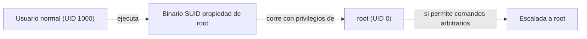

# Clase 005 — Linux esencial para seguridad: filesystem, permisos y usuarios

> Parte: **0 — Fundamentos y prerrequisitos** · Fuente: *Michael Kerrisk, The Linux Programming Interface*
> ⏱️ Duración estimada: **110 min** · Nivel: **Fundamentos**

---

## 🎯 Objetivo

Dominar el modelo de archivos, permisos y usuarios de Linux, que es la base sobre la que ocurren la mayoría de las escaladas de privilegios y de las medidas de *hardening*. Casi todo en Linux es un archivo, y casi todo el control de acceso se reduce a quién puede leer, escribir o ejecutar qué. Al terminar sabrás leer y modificar permisos en sus dos notaciones, entender cómo se definen usuarios y grupos y dónde viven sus contraseñas, y reconocer configuraciones peligrosas como los binarios SUID que un atacante buscaría para convertirse en root.

## 📚 Resultados de aprendizaje

Al finalizar, el alumno podrá:

1. **Navegar** la jerarquía FHS y ubicar archivos clave de seguridad.
2. **Interpretar** y modificar permisos en notación simbólica y octal.
3. **Gestionar** usuarios, grupos y sus archivos de definición.
4. **Identificar** permisos especiales (SUID, SGID, sticky) y su riesgo.
5. **Aplicar** el principio de mínimo privilegio en el filesystem.
6. **Reconocer** vectores de escalada de privilegios basados en permisos mal configurados.

## 🗺️ Temas

| # | Tema | Por qué importa |
|---|------|-----------------|
| 1 | FHS | Saber dónde vive cada cosa acelera todo |
| 2 | `/etc/passwd` y `/etc/shadow` | Fuente de usuarios y hashes de contraseña |
| 3 | Permisos rwx | Núcleo del control de acceso Unix |
| 4 | Notación octal | Forma compacta y examinable |
| 5 | Usuarios y grupos | UID/GID, grupos primarios y secundarios |
| 6 | SUID/SGID/sticky | Vector clásico de escalada de privilegios |
| 7 | `chmod`, `chown`, `umask` | Modificar y establecer permisos por defecto |
| 8 | ACLs | Control fino más allá de rwx |

## 🧠 Explicación en profundidad

### El FHS: un mapa para no perderse

El *Filesystem Hierarchy Standard* (FHS) es la convención que define para qué sirve cada directorio de nivel superior en Linux, y conocerlo convierte un sistema desconocido en territorio familiar. La configuración del sistema vive en `/etc` (ahí están los archivos de usuarios, servicios y red); los registros en `/var/log` (el primer sitio que mira un analista tras un incidente); los binarios esenciales en `/bin` y `/usr/bin`, y los de administración en `/sbin`; los directorios personales en `/home`, y el de root en `/root`. Sistemas de archivos virtuales como `/proc` y `/sys` exponen el estado del kernel y de los procesos como si fueran ficheros. Para un profesional de seguridad, saber que las contraseñas hasheadas están en `/etc/shadow`, que las tareas programadas viven en `/etc/cron*` o que los logs de autenticación están en `/var/log/auth.log` es la diferencia entre investigar con rumbo o a ciegas.

### Usuarios, grupos y dónde viven las contraseñas

Cada usuario en Linux se identifica por un número, el **UID**, y pertenece a uno o varios grupos identificados por su **GID**. El usuario con UID 0 es **root**, el superusuario que ignora las comprobaciones de permisos tradicionales. La definición de las cuentas se reparte entre dos archivos. `/etc/passwd` es legible por todos y contiene, por cada usuario, su nombre, UID, GID, directorio personal y shell; históricamente guardaba también la contraseña, de ahí su nombre, pero eso hoy sería un desastre de seguridad. Las contraseñas se movieron a `/etc/shadow`, legible **solo por root** (permisos típicos `640 root:shadow`), donde se guardan **hasheadas y con sal**, nunca en claro. Esta separación es deliberada: los programas necesitan leer `passwd` para resolver nombres de usuario, pero nadie salvo root debe poder siquiera ver los hashes, porque un atacante que los obtenga puede intentar romperlos *offline* con herramientas de fuerza bruta. Los grupos se definen en `/etc/group`, y un usuario tiene un grupo primario y puede pertenecer a varios secundarios.

### Permisos rwx: el núcleo del control de acceso

El modelo de permisos clásico de Unix asigna a cada archivo tres permisos —**r** (lectura), **w** (escritura) y **x** (ejecución)— para tres categorías de sujetos: el **propietario** (*user*), el **grupo** propietario y **otros** (el resto). Eso da los nueve caracteres que ves en `ls -l`, como en `-rw-r--r--`. El primer carácter indica el tipo (`-` archivo, `d` directorio, `l` enlace). Un matiz crucial y fuente de confusión: sobre un **directorio** los permisos cambian de significado. Ahí `r` permite listar su contenido, `w` permite crear o borrar entradas dentro de él, y `x` permite *atravesarlo* (entrar y acceder a lo que hay dentro si conoces el nombre). Por eso puedes tener un directorio en el que puedes entrar (`x`) pero no listar (`r`), o al revés. Entender esto explica muchos "permission denied" desconcertantes.

```text
   -   rw-   r--   r--
   |    |     |     |
 tipo  user grupo otros
        rw-   =  lee y escribe (propietario)
        r--   =  solo lee (grupo)
        r--   =  solo lee (otros)
```

### Notación octal: los permisos como números

Escribir los permisos con letras es cómodo para ajustes puntuales, pero para asignar un conjunto completo se usa la **notación octal**, más compacta y fácil de auditar. Cada permiso vale una potencia de dos: `r`=4, `w`=2, `x`=1. Se suman por categoría y se escriben tres dígitos, uno para propietario, grupo y otros. Así `rwxr-x---` es `750` (7=4+2+1 para el propietario, 5=4+1 para el grupo, 0 para otros), y `rw-r--r--` es `644`. Interiorizar esta traducción es esencial porque los comandos de administración y los scripts la usan constantemente, y porque leer un `644` de un vistazo te dice al instante qué expone un archivo.

| Octal | Símbolos | Significado |
|-------|----------|-------------|
| 7 | rwx | leer, escribir, ejecutar |
| 6 | rw- | leer y escribir |
| 5 | r-x | leer y ejecutar |
| 4 | r-- | solo leer |
| 0 | --- | sin permisos |

La **umask** completa el cuadro: es una máscara que *resta* permisos a los archivos recién creados. Con una umask típica de `022`, los archivos nuevos nacen sin permiso de escritura para grupo y otros. Define, por tanto, la exposición por defecto de todo lo que creas, y ajustarla es una medida de *hardening* silenciosa pero real.

### Permisos especiales: SUID, SGID y sticky, el terreno de la escalada

Por encima de los nueve bits rwx hay tres **permisos especiales** que son a la vez potentes y peligrosos. El bit **SUID** (*Set User ID*), cuando se aplica a un ejecutable, hace que este corra con los privilegios de su **propietario** en lugar de los de quien lo lanza. Es legítimo y necesario en casos como `passwd`, que un usuario normal debe poder ejecutar pero que necesita escribir en `/etc/shadow` (propiedad de root). El problema es que un binario SUID root mal escrito o innecesario se convierte en un camino directo a root: si un usuario normal puede hacer que ese binario ejecute comandos arbitrarios, hereda los privilegios de root. Por eso una de las primeras cosas que hace un atacante tras entrar es buscar binarios SUID inesperados, y el catálogo **GTFOBins** documenta cómo abusar de muchos de ellos. El bit **SGID** hace lo análogo con el grupo, y sobre un **directorio** provoca que los archivos creados dentro hereden su grupo, útil para carpetas compartidas. El **sticky bit** sobre un directorio restringe el borrado: aunque varios usuarios puedan escribir en él, cada uno solo puede borrar sus propios archivos; es lo que protege `/tmp`.



### Mínimo privilegio en el filesystem

Todo lo anterior converge en un principio: conceder solo lo estrictamente necesario. Un `chmod 777` "para que funcione" es el antipatrón por excelencia, porque da control total a cualquier usuario y borra toda garantía de confidencialidad e integridad sobre ese archivo. La postura correcta es partir de permisos restrictivos y abrir lo justo, usar grupos para compartir en lugar de "otros", y auditar periódicamente el sistema en busca de archivos con escritura para todos, SUID sospechosos o directorios sensibles demasiado abiertos. Cuando rwx no da la granularidad necesaria —por ejemplo, dar acceso a un usuario concreto sin cambiar el grupo— entran las **ACLs** (`getfacl`/`setfacl`), que añaden entradas por usuario o grupo específicas sobre la base rwx.

## 📖 Definiciones y características

- **FHS (Filesystem Hierarchy Standard)**: convención que define el propósito de cada directorio (`/etc` configuración, `/var/log` logs, `/home` usuarios). Conocerla permite orientarse en cualquier sistema y saber dónde buscar tras un incidente.
- **`/etc/passwd`**: archivo legible por todos con los datos de cada cuenta (nombre, UID, GID, home, shell). Ya no guarda contraseñas; sirve para resolver identidades de usuario.
- **`/etc/shadow`**: archivo legible solo por root que almacena las contraseñas hasheadas y con sal. Es el objetivo de un atacante que quiera romper credenciales *offline*, de ahí sus permisos restrictivos.
- **UID y GID**: identificadores numéricos de usuario y grupo. El UID 0 es root, el superusuario que ignora las comprobaciones de permisos rwx tradicionales.
- **Permisos rwx**: lectura, escritura y ejecución para propietario, grupo y otros. Sobre un directorio cambian de sentido: `x` significa poder atravesarlo y `w` poder crear o borrar entradas dentro.
- **Notación octal**: forma compacta de expresar permisos sumando r=4, w=2, x=1 por categoría (por ejemplo, `750`). Es la más usada en administración y auditoría por su concisión.
- **umask**: máscara que resta permisos a los archivos recién creados y define su exposición por defecto. Ajustarla es una medida de *hardening* de bajo coste.
- **SUID (Set User ID)**: bit que hace que un ejecutable corra con los privilegios de su propietario. Legítimo en casos como `passwd`, pero un SUID root mal puesto es un vector directo de escalada a root.
- **SGID (Set Group ID)**: análogo a SUID para el grupo; sobre un directorio hace que los archivos nuevos hereden su grupo, útil para carpetas compartidas.
- **Sticky bit**: sobre un directorio, restringe el borrado a los propietarios de cada archivo aunque otros puedan escribir. Es lo que protege `/tmp` de borrados cruzados.
- **ACL (Access Control List)**: permisos adicionales por usuario o grupo específico más allá de rwx, gestionados con `getfacl`/`setfacl`. Complementan, no sustituyen, el modelo clásico.
- **chmod / chown**: comandos para cambiar permisos (`chmod`) y propietario o grupo (`chown`) de archivos y directorios.

## 📔 Glosario

| Término | Definición concisa |
|---------|--------------------|
| FHS | Estándar que define el propósito de cada directorio en Linux |
| root | Superusuario (UID 0) que ignora los permisos tradicionales |
| UID / GID | Identificadores numéricos de usuario y grupo |
| rwx | Permisos de lectura, escritura y ejecución |
| Octal | Notación numérica de permisos (r=4, w=2, x=1) |
| `/etc/passwd` | Definición de cuentas, legible por todos |
| `/etc/shadow` | Hashes de contraseñas, legible solo por root |
| `/etc/group` | Definición de grupos del sistema |
| umask | Máscara que resta permisos a los archivos nuevos |
| SUID | Bit que ejecuta un binario con privilegios del propietario |
| SGID | Bit análogo para el grupo; en directorios, hereda el grupo |
| Sticky bit | Restringe el borrado en un directorio a cada propietario |
| chmod / chown | Cambian permisos / propietario de archivos |
| ACL | Permisos granulares por usuario o grupo (`setfacl`/`getfacl`) |
| GTFOBins | Catálogo de binarios abusables para escalar privilegios |

## 🧰 Herramientas y preparación

Trabaja en tu VM Kali o en cualquier Linux del laboratorio construido en la Clase 004. Necesitas una terminal y una cuenta con `sudo`. Los comandos base son `ls -l`, `chmod`, `chown`, `id`, `stat`, `find`, `umask` y `getfacl`/`setfacl`. Ten a mano las páginas de manual (`man chmod`, `man 5 shadow`), que son la fuente autorizada cuando dudes de una opción. Practica siempre en el laboratorio aislado, nunca en un sistema en producción.

## 🧪 Laboratorio guiado

1. **Explorar el FHS** y observar los permisos de los archivos de cuentas:

   ```bash
   ls -la / ; ls -l /etc/passwd /etc/shadow
   ```

   Confirma que `shadow` no es legible por usuarios normales.
2. **Leer permisos**. Crea un archivo y examínalo:

   ```bash
   touch prueba.txt ; stat prueba.txt ; ls -l prueba.txt
   ```

   Descompón la cadena `-rw-r--r--` en propietario, grupo y otros.
3. **Cambiar permisos** en notación simbólica y octal:

   ```bash
   chmod u+x prueba.txt ; ls -l prueba.txt
   chmod 640 prueba.txt ; ls -l prueba.txt
   ```

4. **Usuarios y grupos**. Crea un usuario de prueba y revisa su identidad:

   ```bash
   sudo useradd -m alumno ; id alumno ; grep alumno /etc/passwd
   ```

5. **Comprobar tu umask** y su efecto sobre un archivo nuevo:

   ```bash
   umask ; touch nuevo.txt ; ls -l nuevo.txt
   ```

6. **Buscar binarios SUID** en el sistema (reconocimiento de escalada):

   ```bash
   find / -perm -4000 -type f 2>/dev/null
   ```

   Anota los que aparezcan; muchos son legítimos (`sudo`, `passwd`, `mount`).
7. **ACLs**. Da acceso puntual de lectura a `alumno` sobre un archivo:

   ```bash
   setfacl -m u:alumno:r prueba.txt ; getfacl prueba.txt
   ```

> ⚠️ **Nota ética**: la búsqueda de binarios SUID es una técnica de reconocimiento legítima **solo** sobre sistemas propios o autorizados. En este curso se practica exclusivamente en tu laboratorio aislado.

## ✍️ Ejercicios

1. Traduce a octal: `rwxr-x---`, `rw-rw-r--`, `r--------`, y de vuelta `700`, `664`, `600` a símbolos.
2. Explica con un ejemplo qué significa el permiso `x` en un directorio frente a en un archivo.
3. Crea un directorio compartido por un grupo donde los archivos nuevos hereden ese grupo automáticamente (pista: SGID).
4. Configura un directorio temporal donde cada usuario solo pueda borrar sus propios archivos (sticky bit) y verifícalo con dos cuentas.
5. Investiga por qué `/etc/shadow` tiene permisos `640 root:shadow` y qué riesgo concreto introduciría dejarlo en `644`.
6. Con `find`, localiza archivos con escritura para "otros" bajo `/etc` y explica por qué cada hallazgo sería un problema.
7. Explica por qué el kernel ignora el bit SUID en scripts pero lo respeta en binarios compilados, y qué implica eso para la escalada.

## 📝 Reto verificable

Configura una carpeta de proyecto compartida por un grupo `equipo` con estas propiedades: los miembros pueden crear y editar archivos, los archivos nuevos pertenecen automáticamente al grupo `equipo`, y ningún miembro puede borrar los archivos de otro. Documenta los permisos aplicados y el razonamiento.

**Criterio de aceptación**: `ls -ld` de la carpeta muestra los bits SGID y sticky activos; un segundo usuario del grupo puede crear un archivo que queda con grupo `equipo`, pero no puede borrar el archivo creado por el primero. Es verificable con dos cuentas de prueba dentro del laboratorio.

## ⚠️ Errores comunes

| Síntoma / mensaje | Causa y cómo arreglar |
|-------------------|-----------------------|
| `Permission denied` al entrar a un directorio | Falta el bit `x` en el directorio. Añádelo con `chmod +x` sobre el directorio (no sobre los archivos). |
| `chmod 777` "para que funcione" | Antipatrón peligroso: da control total a todos y elimina toda garantía. Usa el mínimo privilegio y grupos. |
| No poder leer `/etc/shadow` como usuario normal | Es el comportamiento correcto: solo root o el grupo shadow. Usa `sudo` si tienes permiso legítimo. |
| Un SUID root en un script propio no eleva privilegios | El kernel ignora SUID en scripts por seguridad; solo aplica a binarios compilados. |
| Permisos rwx correctos pero acceso denegado | Puede haber una ACL restrictiva o un LSM (SELinux/AppArmor). Revisa `getfacl` y el módulo de seguridad. |
| El archivo nuevo no hereda el grupo esperado | Falta el bit SGID en el directorio contenedor. Aplícalo con `chmod g+s` sobre la carpeta. |

## ❓ Preguntas frecuentes

**❓ ¿Octal o simbólico?** Ambos. La octal es compacta para asignar un conjunto completo de permisos de una vez y para auditar de un vistazo; la simbólica es cómoda para añadir o quitar un solo bit sin tocar el resto.

**❓ ¿Por qué los binarios SUID son peligrosos?** Porque ejecutan con los privilegios de su propietario, a menudo root. Si un SUID root tiene un fallo o permite ejecutar comandos arbitrarios, un usuario normal puede convertirse en root. GTFOBins cataloga muchos de estos abusos.

**❓ ¿root puede saltarse los permisos?** Sí, root ignora los permisos rwx tradicionales. Por eso limitar el uso de root y controlar las vías de escalada de privilegios es central en la seguridad de Linux.

**❓ ¿Las ACLs sustituyen a rwx?** No, lo complementan. rwx sigue siendo la base; las ACLs añaden entradas por usuario o grupo específico cuando el modelo de tres categorías se queda corto.

**❓ ¿Dónde miro primero tras un posible compromiso?** En `/var/log` (especialmente `auth.log`), en las cuentas de `/etc/passwd` con UID 0 inesperados, en tareas programadas de `/etc/cron*` y en binarios SUID nuevos. Conocer el FHS es lo que hace rápida esa revisión.

## 🔗 Referencias

- Michael Kerrisk, *The Linux Programming Interface* (capítulos de archivos y permisos).
- `man 1 chmod`, `man 5 passwd`, `man 5 shadow`, `man 1 setfacl`
- Filesystem Hierarchy Standard — <https://refspecs.linuxfoundation.org/fhs.shtml>
- GTFOBins — <https://gtfobins.github.io/>

## 📥 Material descargable

- 📄 [Guía en PDF](./clase-005-guia.pdf) — versión imprimible de esta clase.
- 🎞️ [Presentación (PPTX)](./clase-005-presentacion.pptx) — deck para proyectar en clase.

## ⬅️ Clase anterior

[Clase 004 — Montaje del laboratorio: virtualización, Kali, snapshots y aislamiento de red](../004-montaje-del-laboratorio-virtualizacion-kali-snapshots-y-aislamiento-de-red/README.md)

## ➡️ Siguiente clase

[Clase 006 — Línea de comandos Linux avanzada: grep, sed, awk, pipes y procesos](../006-linea-de-comandos-linux-avanzada-grep-sed-awk-pipes-y-procesos/README.md)
