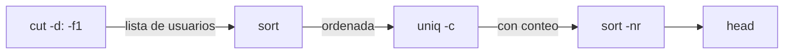
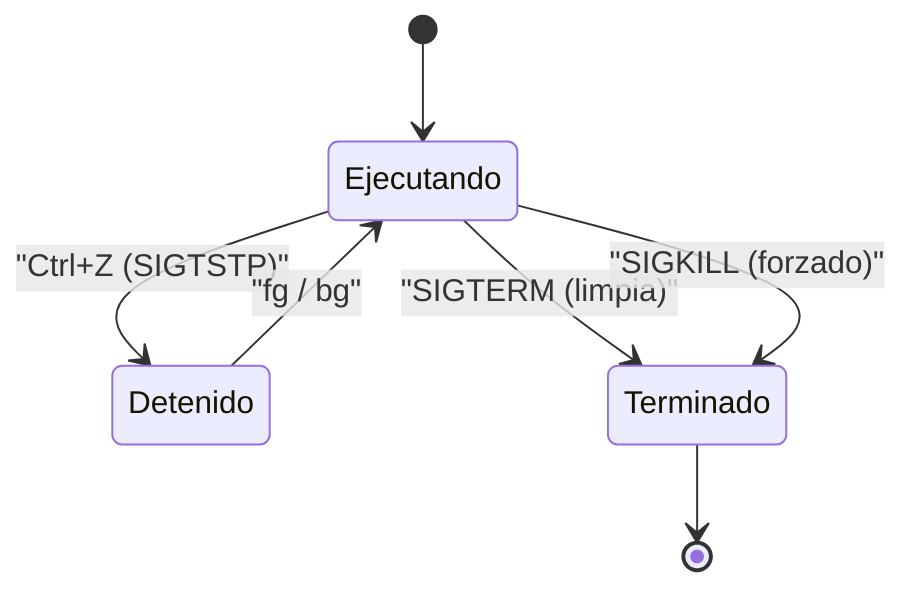

# Clase 006 — Línea de comandos Linux avanzada: grep, sed, awk, pipes y procesos

> Parte: **0 — Fundamentos y prerrequisitos** · Fuente: *Shotts, The Linux Command Line (No Starch Press)*
> ⏱️ Duración estimada: **110 min** · Nivel: **Fundamentos**

---

## 🎯 Objetivo

Convertir la terminal en tu herramienta más rápida para procesar texto, logs y salidas de otras herramientas, entendiendo *por qué* funciona y no solo *qué* teclear. Al terminar podrás encadenar comandos con tuberías, filtrar con `grep`, transformar flujos con `sed`, extraer y agregar campos con `awk`, y controlar procesos y señales. Estas son las habilidades que, en un incidente real, marcan la diferencia entre revisar un log de un millón de líneas en segundos o ahogarte en él; son la base del *threat hunting* manual, del triaje forense y de toda la automatización que construirás en las clases siguientes.

## 📚 Resultados de aprendizaje

Al finalizar, el alumno podrá:

1. **Construir** tuberías (pipes) que combinen varios comandos siguiendo la filosofía Unix de herramientas pequeñas y componibles.
2. **Filtrar** texto con `grep` y expresiones regulares, distinguiendo BRE de ERE.
3. **Transformar** flujos con `sed` (sustitución, borrado, rangos de direcciones) sin abrir un editor.
4. **Extraer** y agregar campos con `awk`, usando sus variables internas y bloques `BEGIN`/`END`.
5. **Gestionar** procesos: listarlos, priorizarlos, enviarles señales y controlar *jobs* en segundo plano.
6. **Diseñar** un one-liner de análisis de logs que reduzca datos temprano para ser eficiente sobre archivos grandes.

## 🗺️ Temas

| # | Tema | Por qué importa |
|---|------|-----------------|
| 1 | Streams y redirección | stdin/stdout/stderr son la base de todo el flujo de datos |
| 2 | Pipes | Componer herramientas pequeñas resuelve problemas grandes |
| 3 | `grep` y regex | Buscar patrones en logs, código y volcados |
| 4 | `sed` | Editar flujos sin abrir un editor, de forma reproducible |
| 5 | `awk` | Procesar datos por columnas y calcular agregados |
| 6 | Orden y unicidad | `sort`, `uniq`, `cut`, `tr`, `wc` para resumir |
| 7 | Procesos y señales | `ps`, `top`, `kill`, `SIGTERM` vs `SIGKILL` |
| 8 | Jobs y background | `&`, `jobs`, `fg`, `bg`, `nohup` |

## 🧠 Explicación en profundidad

### La filosofía Unix: pequeñas herramientas que se conectan

La potencia de la línea de comandos no viene de un programa monolítico que lo hace todo, sino de decenas de utilidades minúsculas —cada una experta en una sola cosa— que se conectan como piezas de tubería. Esta idea, formulada por Doug McIlroy en los Laboratorios Bell, se resume en "escribe programas que hagan una cosa y la hagan bien, y que trabajen juntos". El pegamento que las une es el flujo de texto: la salida de una se convierte en la entrada de la siguiente. Para un analista de seguridad esto es transformador, porque casi cualquier pregunta ("¿qué IP me está atacando más?", "¿qué usuarios tienen shell interactiva?") se responde combinando cuatro o cinco herramientas que ya vienen instaladas, sin escribir un solo programa.

### Streams y redirección: los tres canales

Todo proceso en Linux nace con tres canales de comunicación abiertos, identificados por un descriptor de archivo numérico. El descriptor **0** es la entrada estándar (stdin), por donde el proceso lee; el **1** es la salida estándar (stdout), por donde escribe sus resultados normales; y el **2** es la salida de error estándar (stderr), reservada para diagnósticos y mensajes de fallo. Mantener stdout y stderr separados es una decisión de diseño deliberada: te permite guardar los resultados en un archivo mientras sigues viendo los errores en pantalla, o al revés. El operador `>` redirige stdout a un archivo (sobrescribiéndolo), `>>` lo anexa al final, y `2>` redirige exclusivamente los errores. La construcción `2>&1` significa "manda el descriptor 2 al mismo sitio al que apunta ahora el 1", y es la forma canónica de fusionar ambos flujos.

```text
        ┌───────────────────────┐
 stdin  │                       │  stdout
 (fd 0) ─────▶     proceso    ─────▶ (fd 1)  ──▶ pantalla o archivo
        │                       │
        │                       │  stderr
        └───────────────────────┘─────▶ (fd 2)  ──▶ pantalla o archivo
```

Un detalle crítico para el análisis de logs: **stderr no viaja por la tubería**. Cuando escribes `comando | otro`, solo stdout entra en el pipe; los errores del primer comando siguen yendo a la terminal. Si necesitas procesar también los errores, debes redirigirlos explícitamente con `2>&1` antes del `|`.

### El pipe y el flujo de datos

Una tubería (`|`) conecta la salida estándar de un comando con la entrada estándar del siguiente, y ambos se ejecutan **concurrentemente**: no espera a que el primero termine para empezar el segundo, sino que los datos fluyen a medida que se producen. Esto tiene una consecuencia importante para el rendimiento y para el orden de las etapas. La regla de oro al analizar archivos grandes es **reducir datos lo antes posible**: filtra con `grep` al principio de la tubería para que las etapas caras (como `sort`, que debe cargar todo en memoria) trabajen sobre el menor volumen posible.



Este patrón —extraer un campo, ordenar, contar repeticiones únicas, reordenar por frecuencia y quedarte con los primeros— es el esqueleto de casi todo informe de "top N" que producirás: top de IPs atacantes, top de URLs, top de user-agents.

### grep y las expresiones regulares

`grep` (global regular expression print) imprime las líneas que coinciden con un patrón. Su verdadero poder está en las expresiones regulares, y aquí hay una distinción que confunde a muchos: `grep` usa por defecto **BRE** (Basic Regular Expressions), donde metacaracteres como `+`, `?`, `{`, `|`, `(` y `)` son literales salvo que los escapes con `\`. Con la opción `-E` activas **ERE** (Extended Regular Expressions), donde esos metacaracteres funcionan sin escape, que es lo que la mayoría espera. Las banderas que más usarás en seguridad son `-i` (ignora mayúsculas), `-r` (recursivo por directorios), `-v` (invierte: muestra lo que *no* coincide), `-c` (cuenta coincidencias), `-o` (imprime solo la parte que coincide, ideal para extraer) y `-n` (número de línea). Usar `grep -v` para descartar ruido conocido es tan útil como usarlo para buscar.

### sed: el editor de flujo

`sed` (stream editor) aplica transformaciones línea a línea sin abrir un editor interactivo, lo que lo hace ideal para automatizar y para procesos reproducibles. Su comando estrella es la sustitución `s/patrón/reemplazo/g`, donde la `g` final significa "todas las ocurrencias de la línea" (sin ella, solo cambia la primera). `sed` también entiende **direcciones**: puedes limitar una acción a una línea (`3d` borra la línea 3), a un rango (`10,20d`) o a las líneas que coinciden con un patrón (`/^#/d` borra las que empiezan por `#`). La opción `-i` edita el archivo *in situ*, y es un arma de doble filo: modifica el original sin preguntar. La práctica segura es probar primero sin `-i` para ver el resultado, y cuando edites en sitio usar `-i.bak` para que `sed` guarde una copia de seguridad automática con esa extensión.

### awk: procesar por columnas

`awk` es en realidad un pequeño lenguaje de programación orientado a datos tabulares. Divide cada línea en campos y te da acceso a ellos por número: `$1` es el primer campo, `$2` el segundo, y `$0` la línea completa; `$NF` es el último campo (`NF` = *Number of Fields*) y `$(NF-1)` el penúltimo, algo muy útil cuando la posición del dato que buscas se cuenta mejor desde el final. Otras variables internas clave son `NR` (número de registro/línea actual) y `FS` (el separador de campos, que cambias con `-F`). Un programa `awk` se estructura en patrones y acciones, y admite bloques especiales: `BEGIN{}` se ejecuta antes de leer nada (para inicializar o imprimir cabeceras) y `END{}` después de procesar todo (para imprimir totales). Esto permite hacer en **una sola pasada** lo que en otras herramientas exigiría varias: sumar bytes, contar por categoría con un array asociativo, calcular medias.

### Procesos, señales y control de jobs

Un proceso es una instancia de un programa en ejecución, con su PID (identificador), su usuario propietario y su prioridad. `ps aux` lista todos los procesos del sistema con detalle, y `top`/`htop` los muestran en vivo. Para comunicarte con un proceso le envías una **señal** con `kill`. Aquí la distinción importante es entre `SIGTERM` (señal 15, la que envía `kill` por defecto), que **pide** al proceso que termine y le da la oportunidad de limpiar —cerrar archivos, borrar temporales, liberar sockets— y `SIGKILL` (señal 9), que el kernel ejecuta de inmediato **sin** darle ninguna oportunidad de limpiar. Por eso `kill -9` debe ser el último recurso, no el primero: un proceso muerto con `-9` puede dejar el sistema en un estado inconsistente. El control de jobs te permite lanzar tareas en segundo plano con `&`, listarlas con `jobs`, traerlas al primer plano con `fg` y desasociarlas de la terminal con `nohup` o `disown` para que sobrevivan al cierre de la sesión.



## 📖 Definiciones y características

- **stdin / stdout / stderr**: los tres canales estándar de todo proceso, con descriptores 0, 1 y 2. stdin es la entrada, stdout la salida normal y stderr los diagnósticos. Mantenerlos separados permite guardar resultados y ver errores por vías distintas; en seguridad, recuerda que stderr no entra en un pipe salvo que uses `2>&1`.
- **Pipe (`|`)**: operador que conecta la stdout de un comando con la stdin del siguiente, ejecutándolos concurrentemente. Encarna la filosofía Unix de componer herramientas pequeñas. Es la base de todo informe de análisis de logs.
- **grep**: filtra e imprime líneas que coinciden con un patrón (regex). Banderas clave: `-i` (insensible a mayúsculas), `-r` (recursivo), `-v` (invertir), `-E` (regex extendida), `-o` (solo lo coincidente). Buscar y descartar ruido son igual de valiosos.
- **Expresión regular (regex)**: notación para describir conjuntos de cadenas. BRE (por defecto en grep) trata `+ ? { | ( )` como literales; ERE (`-E`) les da significado especial. Dominar lo básico multiplica tu productividad en logs.
- **sed**: editor de flujo orientado a líneas. Su forma más común es `s/patrón/reemplazo/g`, y entiende direcciones y rangos. Su bandera `-i` edita en sitio; hazlo con `-i.bak` para conservar respaldo.
- **awk**: mini-lenguaje para datos por campos. `$1..$NF` son las columnas, `NR` el número de línea, `FS` el separador. Sus bloques `BEGIN`/`END` permiten cabeceras y totales en una sola pasada.
- **Campo y separador (FS)**: `awk` parte cada línea en campos usando un separador (espacios por defecto). Con `-F:` fijas otro delimitador (`:` para `/etc/passwd`). Un separador mal elegido es la causa nº1 de campos vacíos.
- **Proceso y PID**: instancia de un programa en ejecución identificada por un número único. Su usuario propietario y sus privilegios determinan qué puede tocar; enumerarlos es el primer paso del triaje.
- **Señal**: mensaje asíncrono a un proceso. `SIGTERM` (15) pide terminar y permite limpieza; `SIGKILL` (9) es forzado e inmediato; `SIGHUP` (1) suele indicar recarga de configuración. Elegir la señal correcta evita corrupción de datos.
- **Job y background**: un job es una tarea bajo control de la shell. `&` la lanza en segundo plano, `jobs` las lista, `fg`/`bg` las mueven, y `nohup` la desliga de la terminal para que sobreviva a la desconexión.
- **Redirección (`>`, `>>`, `2>`)**: reencaminar los canales estándar hacia archivos. `>` sobrescribe, `>>` anexa, `2>` captura solo errores. Esencial para guardar evidencia de forma ordenada.

## 📔 Glosario

| Término | Definición concisa |
|---------|--------------------|
| stdin (fd 0) | Canal de entrada estándar de un proceso |
| stdout (fd 1) | Canal de salida normal de un proceso |
| stderr (fd 2) | Canal de mensajes de error y diagnóstico |
| Pipe (`\|`) | Conecta la salida de un comando con la entrada de otro |
| BRE | Basic Regular Expressions (modo por defecto de grep) |
| ERE | Extended Regular Expressions (activadas con `grep -E`) |
| PDU | No aplica aquí; ver clase de redes |
| NR | Variable de awk: número de registro (línea) actual |
| NF | Variable de awk: número de campos de la línea |
| FS | Variable de awk: separador de campos de entrada |
| SIGTERM | Señal 15: petición ordenada de terminación |
| SIGKILL | Señal 9: terminación forzada e inmediata |
| PID | Identificador numérico único de un proceso |
| Job | Tarea gestionada por el control de trabajos de la shell |
| `2>&1` | Fusiona stderr con stdout hacia el mismo destino |

## 🧰 Herramientas y preparación

Todo lo que necesitas viene de serie en cualquier Linux moderno y en Kali: `grep`, `sed`, `awk` (habitualmente GNU `gawk`), `sort`, `uniq`, `cut`, `tr`, `wc`, `ps`, `top` (o el más cómodo `htop`, instalable con `sudo apt install htop`) y `kill`. Para practicar sobre datos realistas, consigue un log auténtico: el `/var/log/auth.log` de tu propia máquina (autenticaciones SSH) o un `access.log` de servidor web. Si no dispones de uno, puedes generar tráfico y logs en tu laboratorio aislado. Trabaja siempre con copias de los logs para no alterar la evidencia original.

## 🧪 Laboratorio guiado

1. **Redirección y streams**. Observa cómo se separan salida y error:

   ```bash
   ls /noexiste /etc 1>salida.txt 2>errores.txt ; cat errores.txt
   ```

2. **Pipes básicas**. Cuenta cuántos usuarios hay en el sistema:

   ```bash
   cut -d: -f1 /etc/passwd | sort | wc -l
   ```

3. **grep en logs**. Busca intentos de inicio de sesión fallidos:

   ```bash
   grep -i "failed password" /var/log/auth.log | head
   ```

4. **Extraer IPs con awk**. De esos fallos, saca la IP atacante y ordénala por frecuencia (ajusta el campo a tu formato de log):

   ```bash
   grep "Failed password" /var/log/auth.log | awk '{print $(NF-3)}' | sort | uniq -c | sort -nr
   ```

   Esto produce un *top* de IPs por número de intentos: el patrón "reduce, ordena, cuenta, reordena".

5. **sed para limpiar**. Elimina comentarios y líneas en blanco de un archivo de configuración:

   ```bash
   sed -e 's/#.*//' -e '/^\s*$/d' /etc/ssh/sshd_config
   ```

6. **awk con agregación**. Suma el total de bytes servidos en un `access.log` (campo típico de tamaño en la posición 10 del formato *combined*):

   ```bash
   awk '{suma += $10} END {print "Total bytes:", suma}' access.log
   ```

7. **Procesos**. Encuentra los procesos que más CPU consumen:

   ```bash
   ps aux --sort=-%cpu | head -5
   ```

8. **Señales y jobs**. Lanza un proceso en segundo plano y termínalo limpiamente:

   ```bash
   sleep 300 & jobs ; kill %1
   ```

## ✍️ Ejercicios

1. A partir de un `access.log`, obtén el top 10 de IPs con más peticiones.
2. Cuenta cuántas peticiones devolvieron código 404 usando exclusivamente `awk`.
3. Con `sed`, cambia todas las apariciones de `http://` por `https://` en un archivo, conservando un respaldo `.bak`.
4. Extrae solo los nombres de usuario con shell `/bin/bash` de `/etc/passwd` en un one-liner.
5. Muestra los 5 procesos que más memoria residente (RSS) consumen, con usuario y PID.
6. Combina `grep`, `sort` y `uniq -c` para contar user-agents distintos en un log web.
7. Usando `awk` con un array asociativo, calcula cuántas peticiones hizo cada IP en una sola pasada (sin `sort`/`uniq`).
8. Explica con tus palabras por qué `comando 2>&1 | grep error` captura los errores y `comando | grep error 2>&1` no.

## 📝 Reto verificable

Escribe una única línea (one-liner) que, a partir de un log de acceso web, produzca un informe ordenado del top 10 de IPs por número de peticiones **excluyendo** las de tu propia red interna. Documenta qué hace cada comando de la tubería.

**Criterio de aceptación**: el one-liner ejecuta sin errores sobre un `access.log` real y su salida es una lista de exactamente hasta 10 IPs con su conteo, ordenadas de mayor a menor y sin incluir la subred interna filtrada. Otra persona puede leer tu documentación y explicar qué hace cada segmento del pipe.

## ⚠️ Errores comunes

| Síntoma / mensaje | Causa y cómo arreglar |
|-------------------|-----------------------|
| `grep` no encuentra lo que ves en pantalla | Regex mal escrita o diferencia de mayúsculas. Prueba `-i` y escapa metacaracteres, o usa `-E` para ERE. |
| `awk` imprime campo vacío | El separador no es el esperado. Fija el delimitador con `-F` (por ejemplo `-F:`). |
| `sed -i` corrompe o vacía el archivo | Editaste en sitio sin copia. Prueba primero sin `-i` y usa `-i.bak` para guardar respaldo. |
| `kill` no termina el proceso | El proceso ignora `SIGTERM` o está en estado no interrumpible. Usa `kill -9` (SIGKILL) solo como último recurso. |
| El pipe "pierde" los errores | stderr no viaja por el pipe. Redirígelo con `2>&1` antes del `\|` si necesitas procesarlo. |
| El one-liner es lentísimo con archivos enormes | Ordenas o procesas demasiados datos. Filtra con `grep` al inicio y reduce antes de `sort`. |

## ❓ Preguntas frecuentes

**❓ ¿grep, sed o awk?** `grep` filtra líneas, `sed` transforma línea a línea, y `awk` procesa por columnas y calcula agregados. Para buscar, usa grep; para sustituir texto, sed; para contar, sumar o estadística por campos, awk. Muchos problemas se resuelven combinándolos en una tubería.

**❓ ¿`kill -9` siempre es mejor?** No. `SIGKILL` no deja al proceso limpiar sus recursos (archivos temporales, sockets, bloqueos), lo que puede dejar el sistema inconsistente. Envía primero `SIGTERM` (el `kill` por defecto) y reserva `-9` para procesos realmente colgados.

**❓ ¿Por qué mi one-liner es lento con archivos enormes?** Porque ordenas o procesas demasiado volumen. `sort` carga datos en memoria y varias pasadas cuestan. Filtra pronto con `grep`, reduce los datos antes de `sort`, y considera hacerlo todo en una sola pasada con `awk`.

**❓ ¿Necesito aprender regex a fondo?** Lo básico ya multiplica tu productividad, pero conviene entender la diferencia entre BRE y ERE para no pelearte con los escapes. En la Clase 019 se profundiza en expresiones regulares aplicadas a logs y datos.

## 🔗 Referencias

- William Shotts, *The Linux Command Line* — <https://linuxcommand.org/tlcl.php>
- `man 1 grep`, `man 1 sed`, `man 1 awk`
- GNU Awk User's Guide — <https://www.gnu.org/software/gawk/manual/>
- GNU sed manual — <https://www.gnu.org/software/sed/manual/>
- `man 7 signal` — semántica de las señales POSIX

## 📥 Material descargable

- 📄 [Guía en PDF](./clase-006-guia.pdf) — versión imprimible de esta clase.
- 🎞️ [Presentación (PPTX)](./clase-006-presentacion.pptx) — deck para proyectar en clase.

## ⬅️ Clase anterior

[Clase 005 — Linux esencial para seguridad: filesystem, permisos y usuarios](../005-linux-esencial-para-seguridad-filesystem-permisos-y-usuarios/README.md)

## ➡️ Siguiente clase

[Clase 007 — Bash scripting para tareas de seguridad](../007-bash-scripting-para-tareas-de-seguridad/README.md)
