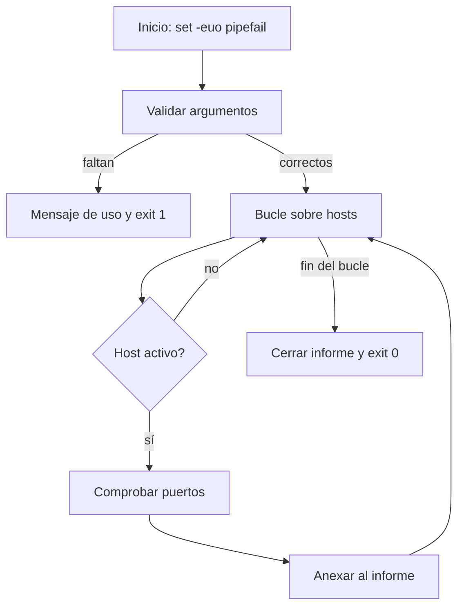

# Clase 007 — Bash scripting para tareas de seguridad

> Parte: **0 — Fundamentos y prerrequisitos** · Fuente: *GNU Bash Reference Manual*
> ⏱️ Duración estimada: **110 min** · Nivel: **Fundamentos**

---

## 🎯 Objetivo

Pasar de teclear comandos sueltos a construir scripts de Bash robustos que automaticen tareas repetitivas de seguridad: barridos de red, parsing de resultados de herramientas, comprobaciones de *hardening* y orquestación de utilidades. Al terminar escribirás scripts con variables, condicionales, bucles, funciones, manejo de argumentos y control de errores, aplicando las prácticas que separan un script frágil de uno que puedes confiar en producción. La automatización no es un lujo en seguridad: un chequeo manual que olvidas hacer es una vulnerabilidad, mientras que un script fiable lo ejecuta igual a las 3 de la madrugada durante un incidente.

## 📚 Resultados de aprendizaje

Al finalizar, el alumno podrá:

1. **Estructurar** un script con shebang, variables, funciones y una organización legible.
2. **Usar** condicionales `[[ ]]`, bucles `for`/`while` y `case` para lógica de control.
3. **Manejar** argumentos con `getopts`, entrada del usuario y códigos de salida.
4. **Aplicar** buenas prácticas de robustez (`set -euo pipefail`, comillas, `trap`).
5. **Automatizar** una tarea real de seguridad de principio a fin, con informe reproducible.
6. **Validar** el código con ShellCheck y corregir los avisos antes de darlo por terminado.

## 🗺️ Temas

| # | Tema | Por qué importa |
|---|------|-----------------|
| 1 | Shebang y ejecución | Cómo se interpreta y lanza un script |
| 2 | Variables y expansión | Datos, sustitución de comandos y valores por defecto |
| 3 | Condicionales `[[ ]]` | Tomar decisiones según condiciones |
| 4 | Bucles `for`/`while` | Iterar sobre hosts, puertos y líneas |
| 5 | Funciones | Reutilizar y organizar el código |
| 6 | Argumentos y `getopts` | Scripts parametrizables y usables |
| 7 | Robustez | `set -euo pipefail`, quoting y `trap` |
| 8 | Códigos de salida | Encadenar scripts y detectar fallos |

## 🧠 Explicación en profundidad

### Del comando al script: shebang y ejecución

Un script no es más que un archivo de texto con comandos que la shell ejecuta en orden. Lo que convierte ese texto en un programa ejecutable es la primera línea, el **shebang**: `#!/usr/bin/env bash`. Cuando ejecutas `./script.sh`, el kernel lee esos dos primeros caracteres (`#!`) y lanza el intérprete que indican, pasándole el archivo. La forma `#!/usr/bin/env bash` es preferible a `#!/bin/bash` por portabilidad: `env` busca `bash` en el `PATH` del usuario, de modo que el script funciona igual en distribuciones donde bash vive en rutas distintas (por ejemplo en algunos BSD o en instalaciones con Homebrew). Para que el archivo sea lanzable necesita el permiso de ejecución, que le das con `chmod +x`.

### Variables, expansión y la disciplina del entrecomillado

En Bash las variables se asignan sin espacios alrededor del `=` (`red="10.10.10"`) y se expanden con `$red` o, de forma más segura, `${red}`. La **sustitución de comandos** `$(comando)` captura la salida de un comando en una cadena —prefiérela siempre a las backticks `` `comando` ``, que no anidan bien y son difíciles de leer—. Bash ofrece expansiones de parámetro muy útiles para robustez: `${x:-valor}` usa `valor` si `x` no está definida, y `${x:?mensaje}` aborta con ese mensaje si falta, ideal para validar argumentos obligatorios.

Aquí está la lección más importante de toda la clase: **entrecomilla siempre tus variables**. Escribir `"$var"` en lugar de `$var` evita el *word splitting* (que Bash parta el valor por espacios) y el *globbing* (que expanda caracteres como `*`). Un archivo llamado `informe final.txt` sin comillas se convierte en dos argumentos; una variable que contiene `*` sin comillas se expande a la lista de archivos del directorio. Esta es la causa número uno de bugs sutiles y, en contextos donde la variable viene de fuera, de vulnerabilidades de inyección.

### Estructuras de control y funciones

Bash toma decisiones con `[[ condición ]]`, la forma moderna y segura de test (más robusta que el antiguo `[ ]` porque no sufre word splitting dentro de los corchetes y admite operadores como `=~` para regex). Los bucles `for` iteran sobre listas (`for ip in $(seq 1 254)`) y los `while read` recorren líneas de un archivo o de una tubería, patrón ideal para procesar una lista de hosts. La sentencia `case` es más legible que una cadena de `if/elif` cuando comparas una variable contra varios patrones. Las **funciones** agrupan lógica reutilizable, reciben argumentos posicionales (`$1`, `$2`) igual que el script, y devuelven un estado con `return`; declarar variables locales dentro con `local` evita contaminar el ámbito global. Refactorizar un bloque repetido a una función no es cosmético: reduce la superficie de error y hace el script mantenible.



### Robustez: el modo estricto y las trampas

Por defecto, Bash es peligrosamente permisivo: si un comando falla, el script sigue adelante como si nada; si usas una variable inexistente, la trata como cadena vacía; y en una tubería solo importa el estado del último comando. El **modo estricto** `set -euo pipefail` corrige las tres cosas: `-e` aborta el script si un comando devuelve error, `-u` aborta si usas una variable no definida (cazando erratas), y `-o pipefail` hace que una tubería falle si *cualquier* etapa falla, no solo la última. Es la línea que convierte un script frágil en uno confiable.

La otra herramienta de robustez es `trap`, que captura señales y eventos para ejecutar código de limpieza. `trap 'rm -f "$tmp"' EXIT` garantiza que el archivo temporal se borre al salir del script, tanto si termina normalmente como si el usuario pulsa Ctrl+C. Esta higiene importa en seguridad porque los scripts a menudo manejan archivos con datos sensibles (volcados, credenciales de prueba) que no deben quedar tirados en disco.

### Códigos de salida: el lenguaje de los scripts

Todo comando devuelve al terminar un **código de salida**: un entero de 0 a 255 donde 0 significa éxito y cualquier otro valor indica un tipo de fallo. La variable especial `$?` contiene el del último comando. Estos códigos son el mecanismo por el que los scripts se comunican entre sí y con la shell: `comando1 && comando2` ejecuta el segundo solo si el primero tuvo éxito, y `comando1 || comando2` lo ejecuta solo si falló. Un script bien hecho **elige deliberadamente** su código de salida (`exit 0` para éxito, `exit 1` u otros para distintos fallos), de modo que pueda encadenarse dentro de una automatización mayor y que un orquestador sepa si debe continuar o alertar.

### El ciclo de calidad con ShellCheck

Escribir Bash correcto es sorprendentemente difícil por sus reglas de expansión. **ShellCheck** es un analizador estático que lee tu script y señala quoting olvidado, variables no usadas, comparaciones frágiles y decenas de errores clásicos, con un enlace explicativo por cada aviso. Integrarlo en tu flujo —ejecutarlo antes de considerar terminado cualquier script— te enseña las buenas prácticas mientras trabajas y evita que un bug de word splitting arruine un barrido en mitad de un pentest. Es la contraparte de robustez que el modo estricto no puede darte, porque actúa antes de ejecutar.

## 📖 Definiciones y características

- **Shebang (`#!/usr/bin/env bash`)**: primera línea que le dice al kernel qué intérprete usar. Con `env` el script es portable entre distribuciones donde bash esté en rutas distintas. Sin shebang y sin permiso de ejecución, el archivo no se lanza solo.
- **Sustitución de comandos (`$(...)`)**: captura la salida estándar de un comando en una cadena. Se anida sin problemas y se lee mejor que las backticks, que están desaconsejadas. Es como los scripts incorporan resultados dinámicos.
- **Expansión de parámetro (`${x:-}`, `${x:?}`)**: mecanismos para dar valores por defecto o exigir que una variable exista. `${x:?mensaje}` aborta con el mensaje si falta, perfecto para validar argumentos obligatorios sin escribir un `if`.
- **`set -euo pipefail`**: el "modo estricto". `-e` aborta ante errores, `-u` ante variables no definidas y `pipefail` ante fallos en cualquier etapa de una tubería. Convierte scripts silenciosamente rotos en scripts que fallan pronto y ruidosamente.
- **Quoting**: entrecomillar variables (`"$var"`, `"$@"`) evita word splitting y globbing. Es la causa número uno de bugs y de inyección en Bash. Regla simple: en la duda, pon comillas dobles.
- **`[[ ]]`**: la forma moderna de evaluar condiciones, más segura que `[ ]` porque no sufre word splitting y admite `=~` para comparar contra regex. Usarla previene el clásico error `unary operator expected`.
- **Función**: bloque de código reutilizable con nombre que recibe argumentos posicionales. Declarar variables con `local` evita efectos colaterales. Refactorizar a funciones reduce la duplicación y la superficie de error.
- **`getopts`**: utilidad incorporada para parsear opciones de línea de comandos (`-p 80`) de forma estándar. Da a tus scripts una interfaz predecible y mensajes de uso coherentes con el resto de herramientas Unix.
- **Código de salida**: entero 0–255 que un comando devuelve; 0 = éxito. Se lee con `$?` y permite encadenar con `&&`/`||`. Elegirlo deliberadamente es lo que hace que un script se integre en automatizaciones mayores.
- **`trap`**: captura señales o el evento `EXIT` para ejecutar limpieza (`trap 'rm -f "$tmp"' EXIT`). Garantiza higiene ante interrupciones, incluido Ctrl+C, algo crítico cuando el script maneja datos sensibles.
- **ShellCheck**: analizador estático que detecta quoting olvidado, variables no usadas y bugs sutiles antes de ejecutar. Integrarlo en el flujo enseña buenas prácticas y previene fallos en momentos críticos.

## 📔 Glosario

| Término | Definición concisa |
|---------|--------------------|
| Shebang | Línea `#!` inicial que fija el intérprete del script |
| PATH | Lista de directorios donde la shell busca ejecutables |
| Word splitting | Partición de un valor no entrecomillado por espacios |
| Globbing | Expansión de comodines (`*`, `?`) a nombres de archivo |
| `$(...)` | Sustitución de comandos (captura su salida) |
| `set -e` | Aborta el script si un comando falla |
| `set -u` | Aborta si se usa una variable no definida |
| `pipefail` | Hace fallar una tubería si cualquier etapa falla |
| `[[ ]]` | Evaluación de condiciones robusta de Bash |
| `getopts` | Parser incorporado de opciones de línea de comandos |
| `$?` | Código de salida del último comando ejecutado |
| `trap` | Ejecuta código ante señales o al salir del script |
| `local` | Declara una variable con ámbito de función |
| ShellCheck | Linter estático para scripts de shell |
| Ping sweep | Barrido que descubre hosts activos mediante ICMP |

## 🧰 Herramientas y preparación

Necesitas Bash (ya presente en Linux y Kali), un editor cómodo (nano, vim o VS Code con la extensión de Bash) y **ShellCheck** para el análisis estático:

```bash
sudo apt install shellcheck
```

Ten a mano las utilidades que orquestarás en las prácticas: `ping`, `nc` (netcat) y `nmap` si está instalado. Considera también integrar ShellCheck en tu editor para ver los avisos mientras escribes. Trabaja **siempre** en tu laboratorio aislado con direcciones bajo tu control.

## 🧪 Laboratorio guiado

1. **Esqueleto robusto**. Crea `barrido.sh` con modo estricto y validación de argumento:

   ```bash
   #!/usr/bin/env bash
   set -euo pipefail
   red="${1:?Uso: $0 <prefijo /24, p.ej. 10.10.10>}"
   ```

2. **Bucle de descubrimiento** (ping sweep) sobre tu red interna:

   ```bash
   for i in $(seq 1 254); do
     ip="${red}.${i}"
     if ping -c1 -W1 "$ip" &>/dev/null; then
       echo "[+] Activo: $ip"
     fi
   done
   ```

3. **Ejecuta** contra tu subred de laboratorio:

   ```bash
   chmod +x barrido.sh ; ./barrido.sh 10.10.10
   ```

4. **Refactor a función**. Extrae la comprobación a una función `esta_activo()` que reciba la IP y devuelva su código de salida, y llámala desde el bucle.

5. **Guardar resultados** con marca de tiempo:

   ```bash
   out="activos_$(date +%F_%H%M).txt"
   ```

   y anexa los hallazgos con `>> "$out"`.

6. **Chequeo de hardening**. Un script que verifique si SSH permite login de root:

   ```bash
   grep -qi "^PermitRootLogin yes" /etc/ssh/sshd_config \
     && echo "[!] Root SSH habilitado" || echo "[ok] Root SSH restringido"
   ```

7. **Limpieza con trap**. Añade un archivo temporal y garantiza su borrado al salir:

   ```bash
   tmp="$(mktemp)"
   trap 'rm -f "$tmp"' EXIT
   ```

8. **Análisis estático**. Pasa ShellCheck y corrige todos los avisos:

   ```bash
   shellcheck barrido.sh
   ```

> ⚠️ **Nota ética**: los barridos y escaneos se ejecutan **solo** contra tu propio laboratorio o sistemas para los que tengas autorización explícita por escrito. Escanear redes ajenas puede ser un delito.

## ✍️ Ejercicios

1. Añade a `barrido.sh` la opción `-p PUERTO` con `getopts` para probar un puerto TCP con `nc -z`.
2. Escribe un script que reciba una lista de hosts desde un archivo y los recorra con `while read`.
3. Implementa manejo de errores: si falta `nmap`, avisa por stderr y termina con un código distinto de 0.
4. Crea una función `es_ip_valida()` que valide que el argumento es una IPv4 bien formada.
5. Usa `trap` para borrar un archivo temporal al salir, comprobando que también funciona con Ctrl+C.
6. Escribe un mini auditor que revise 3 controles de hardening y devuelva un resumen con conteo de OK/FALLO.
7. Modifica un script para que devuelva códigos de salida distintos según el tipo de fallo, y documéntalos.
8. Ejecuta un script tuyo con `bash -x` y explica qué muestra la traza en dos de sus líneas.

## 📝 Reto verificable

Entrega un script `auditor.sh` parametrizable que reciba una subred, descubra hosts activos, para cada uno compruebe si tiene el puerto 22 o 80 abierto, y genere un informe con marca de tiempo. Debe pasar ShellCheck sin avisos, usar `set -euo pipefail` y limpiar cualquier temporal con `trap`.

**Criterio de aceptación**: `shellcheck auditor.sh` no reporta problemas; ejecutado contra tu laboratorio produce un archivo de informe legible con hosts y puertos; y ante un argumento inválido termina con un mensaje de uso y un código de salida distinto de 0.

## ⚠️ Errores comunes

| Síntoma / mensaje | Causa y cómo arreglar |
|-------------------|-----------------------|
| `unbound variable` | Variable usada sin definir con `set -u` activo. Dale valor por defecto (`${x:-}`) o defínela antes. |
| El script "come" archivos con espacios | Falta de comillas. Entrecomilla siempre `"$var"` y usa `"$@"` para los argumentos. |
| El pipe falla pero el script sigue | Sin `pipefail`, solo cuenta el último comando de la tubería. Añade `set -o pipefail`. |
| `[: ==: unary operator expected` | Comparación con variable vacía sin comillas. Usa `[[ ]]` y entrecomilla los operandos. |
| `Permission denied` al ejecutar | Falta `chmod +x` o el shebang es incorrecto. Revisa ambos. |
| `set -e` no aborta donde esperas | Está dentro de un `if` o de una cadena con `&&` u `or` lógico, contextos donde `-e` se desactiva. Comprueba el estado explícitamente. |

## ❓ Preguntas frecuentes

**❓ ¿Bash o Python para automatizar seguridad?** Bash brilla pegando herramientas de línea de comandos y en tareas rápidas del sistema. Para lógica compleja, estructuras de datos, parsing robusto o red, Python (Clases 015–017) es mejor. La regla práctica: si el script supera las ~100 líneas o necesita estructuras de datos, considera Python.

**❓ ¿Por qué `#!/usr/bin/env bash` y no `#!/bin/bash`?** Porque `env` busca bash en el `PATH`, lo que hace el script portable entre distribuciones donde bash puede vivir en rutas distintas. La ruta fija `/bin/bash` funciona en la mayoría de Linux pero falla en otros sistemas.

**❓ ¿ShellCheck es imprescindible?** Muy recomendable. Detecta quoting olvidado, variables no usadas y bugs sutiles antes de que exploten en producción, y cada aviso viene con explicación. Intégralo en tu editor y en tu flujo antes de dar cualquier script por terminado.

**❓ ¿Cómo depuro un script?** Ejecútalo con `bash -x script.sh` para ver cada comando ya expandido, o inserta `set -x` justo antes de la sección que quieres inspeccionar y `set +x` después para acotar la traza.

## 🔗 Referencias

- GNU Bash Reference Manual — <https://www.gnu.org/software/bash/manual/>
- ShellCheck — <https://www.shellcheck.net/>
- Google Shell Style Guide — <https://google.github.io/styleguide/shellguide.html>
- `man 1 bash` — sección de expansiones y palabras reservadas

## 📥 Material descargable

- 📄 [Guía en PDF](./clase-007-guia.pdf) — versión imprimible de esta clase.
- 🎞️ [Presentación (PPTX)](./clase-007-presentacion.pptx) — deck para proyectar en clase.

## ⬅️ Clase anterior

[Clase 006 — Línea de comandos Linux avanzada: grep, sed, awk, pipes y procesos](../006-linea-de-comandos-linux-avanzada-grep-sed-awk-pipes-y-procesos/README.md)

## ➡️ Siguiente clase

[Clase 008 — Windows esencial para seguridad: arquitectura, registro y servicios](../008-windows-esencial-para-seguridad-arquitectura-registro-y-servicios/README.md)
