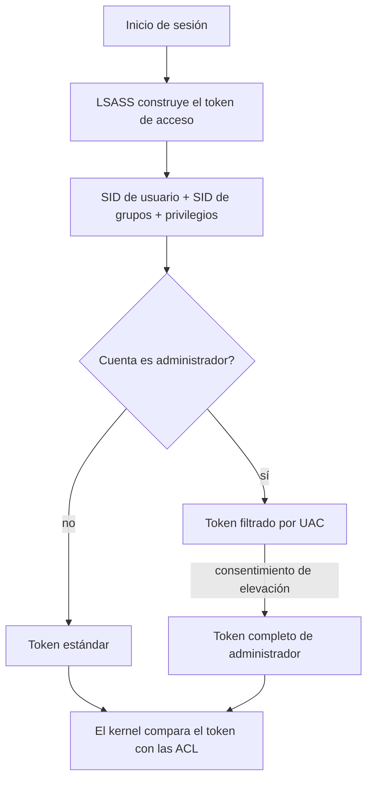

# Clase 008 — Windows esencial para seguridad: arquitectura, registro y servicios

> Parte: **0 — Fundamentos y prerrequisitos** · Fuente: *Russinovich, Solomon & Ionescu, Windows Internals*
> ⏱️ Duración estimada: **110 min** · Nivel: **Fundamentos**

---

## 🎯 Objetivo

Comprender cómo funciona Windows por dentro lo suficiente para atacarlo y defenderlo con criterio: su arquitectura de doble modo, el modelo de seguridad basado en SID y tokens, el papel de UAC, el Registro como base de datos de configuración y los servicios como procesos privilegiados de fondo. Windows domina el parque corporativo, así que estos fundamentos son indispensables para todo lo que viene después: sin entender qué es un token o por qué SYSTEM es tan codiciado, técnicas como el robo de tokens, la persistencia por *Run keys* o la escalada por *unquoted service path* son magia incomprensible en lugar de mecanismos que puedes detectar y mitigar.

## 📚 Resultados de aprendizaje

Al finalizar, el alumno podrá:

1. **Describir** la arquitectura de Windows y la frontera entre user mode y kernel mode.
2. **Explicar** el modelo de seguridad: SID, tokens de acceso, privilegios y UAC.
3. **Navegar** y consultar el Registro de Windows con criterio de seguridad.
4. **Gestionar** servicios y detectar los mal configurados que permiten escalada.
5. **Identificar** rutas comunes de persistencia y sus técnicas MITRE ATT&CK asociadas.
6. **Auditar** una VM enumerando cuentas, auto-inicios y servicios vulnerables.

## 🗺️ Temas

| # | Tema | Por qué importa |
|---|------|-----------------|
| 1 | Arquitectura NT | user/kernel mode y subsistemas |
| 2 | SID y cuentas | Identidad y privilegios de cada principal |
| 3 | Tokens y UAC | Cómo se conceden y elevan permisos |
| 4 | Registro | Configuración y persistencia |
| 5 | Servicios | Procesos privilegiados de fondo (SYSTEM) |
| 6 | Procesos y DLLs | Superficie de inyección y hijacking |
| 7 | Logs de eventos | Fuente de detección y análisis forense |
| 8 | Persistencia común | Run keys, tareas programadas, servicios |

## 🧠 Explicación en profundidad

### La arquitectura NT: dos modos, una frontera

Windows NT (el núcleo de todas las versiones modernas) divide la ejecución en dos anillos de privilegio que el hardware impone: **user mode**, donde corren las aplicaciones y los subsistemas con acceso restringido, y **kernel mode**, donde corren el ejecutivo, el planificador, los controladores de dispositivo y el HAL, con acceso total a la memoria y al hardware. Esta frontera es la línea de defensa más importante del sistema: un fallo en user mode derriba una aplicación, pero un fallo o un exploit en kernel mode compromete la máquina entera (de ahí que los rootkits busquen ejecutar en kernel). Las llamadas al sistema cruzan esa frontera de forma controlada; entender que existe explica por qué un controlador malicioso es catastrófico y por qué Windows firma obligatoriamente el código de kernel.

### Identidad: SID, cuentas y el principal de seguridad

Windows no identifica a usuarios y grupos por su nombre —los nombres se pueden renombrar— sino por un **SID (Security Identifier)**, una cadena única e inmutable con la forma `S-1-5-21-...`. Algunos SID son universales y conviene reconocerlos: `S-1-5-18` es la cuenta LocalSystem (SYSTEM), `S-1-5-32-544` es el grupo Administradores, y los que terminan en `-500` son la cuenta Administrador integrada. Cada objeto securizable (archivo, clave del Registro, servicio) lleva un descriptor de seguridad con una lista de control de acceso (ACL) que asocia SID a permisos. Comprender esto es la base para leer `whoami /all` y entender exactamente qué puede tocar un proceso.

### Tokens de acceso, privilegios y UAC

Cuando inicias sesión, el sistema construye un **token de acceso**: una estructura que porta tu SID, los SID de tus grupos y tu lista de **privilegios** (como `SeDebugPrivilege`, que permite depurar cualquier proceso, o `SeImpersonatePrivilege`, que permite suplantar a otro cliente). Cada proceso que lanzas hereda una copia de ese token, y el kernel decide qué puede hacer comparando el token contra las ACL de los objetos. Este diseño es exactamente lo que los atacantes explotan: el **robo de tokens** consiste en duplicar el token de un proceso más privilegiado para heredar su identidad, y privilegios como `SeImpersonatePrivilege` son la palanca de familias de exploits enteras (los "Potato").

**UAC (User Account Control)** añade un matiz: aunque seas administrador, tus procesos corren por defecto con un token *filtrado* que tiene los privilegios de administrador desactivados; solo al elevar (el diálogo de consentimiento) obtienes el token completo. Es importante interiorizar que Microsoft afirma explícitamente que **UAC no es una frontera de seguridad**: existen técnicas de bypass documentadas. UAC reduce la ejecución accidental con privilegios, pero no detiene a un atacante decidido que ya ejecuta código en tu sesión.



### El Registro: la base de datos del sistema

El **Registro** es una base de datos jerárquica que centraliza casi toda la configuración del sistema operativo y de las aplicaciones, organizada en colmenas raíz. Las dos que más importan en seguridad son **HKLM** (`HKEY_LOCAL_MACHINE`), que guarda la configuración de la máquina y afecta a todos los usuarios y requiere privilegios para escribir, y **HKCU** (`HKEY_CURRENT_USER`), la del usuario actual, escribible sin elevación. Esta distinción es directamente relevante para la persistencia: una entrada de auto-arranque en HKLM se ejecuta para toda la máquina (persistencia "de máquina"), mientras que en HKCU solo para ese usuario (persistencia "de usuario", que no necesita privilegios). Las claves `Run` y `RunOnce` bajo `...\CurrentVersion\` son el mecanismo de persistencia más clásico y lo primero que revisa cualquier respondedor de incidentes.

### Servicios: los procesos privilegiados de fondo

Un **servicio** es un proceso de fondo gestionado por el SCM (Service Control Manager) que suele arrancar con el sistema y, a menudo, correr como **SYSTEM**, la cuenta de mayor privilegio local. Esa combinación —privilegio alto y arranque automático— convierte a los servicios en objetivo doble: para persistencia (crear o modificar un servicio) y para escalada. Dos configuraciones defectuosas son legendarias. El **unquoted service path**: si la ruta del binario contiene espacios y no está entre comillas (`C:\Program Files\Mi App\svc.exe`), Windows intenta ejecutar `C:\Program.exe` primero, y si un atacante puede escribir ahí, gana ejecución como SYSTEM. Y los **permisos débiles**: si el ejecutable del servicio o su carpeta son escribibles por un usuario estándar, ese usuario puede sustituir el binario. Detectar ambos es parte del *hardening* rutinario.

### Detección: procesos, DLLs y logs de eventos

Los procesos cargan **DLLs**, y el orden de búsqueda de esas bibliotecas abre la puerta al *DLL hijacking* (colocar una DLL maliciosa donde el proceso la cargará antes que la legítima), otra vía de persistencia y evasión. Del lado defensivo, el **Visor de eventos** y los logs de seguridad son la fuente principal de detección y forense. Conviene memorizar dos: el evento **4624** (inicio de sesión correcto) y el **4625** (fallido), cuyo campo *Logon Type* distingue un login interactivo local (tipo 2) de uno por red (tipo 3) o remoto por RDP (tipo 10). Estos IDs son el pan de cada día de un analista de SOC.

## 📖 Definiciones y características

- **User mode / Kernel mode**: los dos niveles de privilegio de ejecución que impone el hardware. El kernel accede a todo el sistema; un exploit ahí compromete la máquina entera, por eso Windows firma obligatoriamente el código de kernel.
- **SID (Security Identifier)**: identificador único e inmutable de una cuenta o grupo (`S-1-5-...`). Windows autoriza por SID, no por nombre. `S-1-5-18` es SYSTEM y `S-1-5-32-544` el grupo Administradores.
- **Token de acceso**: estructura que porta la identidad (SID de usuario y grupos) y los privilegios de un proceso. El kernel lo compara con las ACL para autorizar. Es la base del robo y la suplantación de tokens.
- **Privilegio**: derecho especial que otorga un token, como `SeDebugPrivilege` (depurar cualquier proceso) o `SeImpersonatePrivilege` (suplantar a un cliente). Ciertos privilegios equivalen a control total y son palanca de escalada.
- **UAC (User Account Control)**: mecanismo que da a los administradores un token filtrado y exige elevación para el completo. Reduce la ejecución accidental con privilegios, pero Microsoft afirma que no es una frontera de seguridad: existen bypasses.
- **Registro**: base de datos jerárquica de configuración del SO y las apps. HKLM afecta a la máquina (requiere privilegios); HKCU al usuario actual. Sus claves `Run`/`RunOnce` son persistencia clásica y objetivo forense.
- **Servicio**: proceso de fondo gestionado por el SCM, a menudo como SYSTEM. Rutas sin comillas (*unquoted service path*) o permisos débiles sobre el binario permiten escalada de privilegios.
- **SCM (Service Control Manager)**: componente que arranca, detiene y supervisa los servicios. Se consulta con `sc.exe` y define el nombre corto (interno) frente al nombre visible de cada servicio.
- **DLL hijacking**: técnica que aprovecha el orden de búsqueda de bibliotecas para que un proceso cargue una DLL maliciosa. Sirve para persistencia y evasión de defensas.
- **Evento 4624 / 4625**: registros de inicio de sesión correcto (4624) y fallido (4625) en el log de Seguridad. Su *Logon Type* distingue interactivo (2), red (3) o RDP (10). Son fuente central para el SOC.
- **Persistencia**: conjunto de técnicas para mantener acceso tras un reinicio (Run keys, tareas programadas, servicios). MITRE ATT&CK las cataloga bajo la táctica de Persistence (por ejemplo T1547).

## 📔 Glosario

| Término | Definición concisa |
|---------|--------------------|
| NT | Núcleo de las versiones modernas de Windows |
| HAL | Capa de abstracción de hardware en kernel mode |
| SID | Identificador único de seguridad de un principal |
| ACL | Lista de control de acceso de un objeto securizable |
| Token | Estructura con la identidad y privilegios de un proceso |
| UAC | Control de cuentas de usuario (elevación de privilegios) |
| SYSTEM | Cuenta local de máximo privilegio (`S-1-5-18`) |
| HKLM | Colmena del Registro de ámbito de máquina |
| HKCU | Colmena del Registro del usuario actual |
| SCM | Service Control Manager (gestor de servicios) |
| Run key | Clave del Registro que ejecuta algo al iniciar sesión |
| Unquoted path | Ruta de servicio con espacios y sin comillas (escalada) |
| LSASS | Proceso que gestiona la autenticación y los tokens |
| ATT&CK | Base de conocimiento de tácticas y técnicas de MITRE |
| Logon Type | Campo del evento 4624/4625 que indica el tipo de acceso |

## 🧰 Herramientas y preparación

Usa una **VM de Windows de evaluación** en tu laboratorio aislado (nunca tu equipo principal). Instala la **Sysinternals Suite** desde <https://learn.microsoft.com/sysinternals/>, especialmente Process Explorer (árbol de procesos y DLLs), Autoruns (todos los puntos de auto-inicio) y Process Monitor (actividad en vivo de archivos y Registro). Las herramientas nativas que usarás son `regedit`, `services.msc`, `sc.exe`, `whoami /all`, `wevtutil` y el Visor de eventos. Considera también snapshots de la VM para poder revertir tras experimentar. Trabaja **siempre** dentro de la VM.

## 🧪 Laboratorio guiado

1. **Identidad y privilegios**. En una consola, localiza tu SID, grupos y privilegios:

   ```cmd
   whoami /all
   ```

   Identifica si tienes `SeDebugPrivilege` o `SeImpersonatePrivilege` y razona qué implicarían.

2. **Explorar procesos** con Process Explorer: observa el árbol de procesos, la cuenta bajo la que corre cada uno y, para uno de ellos, las DLLs cargadas.

3. **Registro y persistencia**. Abre `regedit` y navega a las claves de auto-arranque:

   ```text
   HKCU\Software\Microsoft\Windows\CurrentVersion\Run
   HKLM\Software\Microsoft\Windows\CurrentVersion\Run
   ```

   Anota qué se ejecuta al iniciar sesión y contrasta HKCU (usuario) con HKLM (máquina).

4. **Autoruns**. Ejecútalo elevado y revisa todas las categorías de auto-inicio; marca las entradas no firmadas o de editor desconocido.

5. **Servicios**. Lista servicios con su binario y busca rutas sospechosas:

   ```cmd
   sc query state= all | more
   wmic service get name,pathname,startmode | more
   ```

   Localiza rutas con espacios **sin comillas** (posible *unquoted service path*).

6. **Logs de eventos**. Consulta los últimos inicios de sesión fallidos:

   ```cmd
   wevtutil qe Security /q:"*[System[(EventID=4625)]]" /c:5 /rd:true /f:text
   ```

> ⚠️ **Nota ética**: la enumeración de servicios, Registro y privilegios se realiza en **tu propia VM** de laboratorio. Aplicar esto a equipos ajenos sin autorización explícita es un delito.

## ✍️ Ejercicios

1. Explica la diferencia entre HKLM y HKCU y qué implica para persistencia por usuario frente a por máquina.
2. Investiga qué es `SeImpersonatePrivilege` y por qué es relevante para escalada de privilegios.
3. Encuentra en tu VM un servicio con *unquoted service path* o razona con evidencia por qué no hay ninguno.
4. Documenta 3 ubicaciones de persistencia distintas y cómo detectarlas con Autoruns.
5. Compara UAC con `sudo` de Linux: similitudes y diferencias de modelo de privilegios.
6. Con el Visor de eventos, distingue un login interactivo (tipo 2) de uno de red (tipo 3) por su *Logon Type*.
7. Relaciona la clave `Run` con su técnica de MITRE ATT&CK y anota el identificador.
8. Comprueba con `icacls` los permisos de la carpeta de un servicio y razona si un usuario estándar podría sustituir su binario.

## 📝 Reto verificable

Realiza una mini auditoría de *hardening* de tu VM Windows: enumera cuentas y privilegios, identifica todas las entradas de auto-inicio con Autoruns marcando las no firmadas, y revisa los servicios en busca de rutas sin comillas o binarios en carpetas escribibles. Entrega un informe con hallazgos, evidencia (comando o captura) y recomendaciones.

**Criterio de aceptación**: el informe lista al menos 5 puntos de auto-inicio clasificados por riesgo, indica si existe algún servicio vulnerable (con evidencia del comando usado) y propone una mitigación por cada hallazgo. Otro alumno puede reproducirlo en una VM equivalente.

## ⚠️ Errores comunes

| Síntoma / mensaje | Causa y cómo arreglar |
|-------------------|-----------------------|
| "Access is denied" al editar el Registro | Falta elevación. Abre la consola o `regedit` como administrador. |
| UAC no pide confirmación al elevar | Nivel de UAC bajo o cuenta ya administrador con auto-elevación. Revísalo en la configuración de UAC. |
| No ves procesos de otros usuarios | Falta privilegio. Ejecuta Process Explorer elevado. |
| `sc` no encuentra el servicio | Confundes el nombre corto con el visible. Usa `sc query` para obtener el nombre interno real. |
| Los logs de seguridad aparecen vacíos | La auditoría no está habilitada. Actívala en la directiva de auditoría local. |
| Marcas como vulnerable un *unquoted path* que no lo es | La ruta tiene espacios pero está entre comillas, o ningún directorio intermedio es escribible. Verifica ambos con `icacls`. |

## ❓ Preguntas frecuentes

**❓ ¿UAC es una frontera de seguridad?** No. Microsoft afirma explícitamente que UAC **no** es un límite de seguridad estricto: existen técnicas de bypass documentadas. Es una barrera de conveniencia que reduce la ejecución accidental con privilegios, no un control que detenga a un atacante que ya ejecuta código en tu sesión.

**❓ ¿Por qué SYSTEM es tan codiciado?** Porque es la cuenta de mayor privilegio local, por encima incluso del administrador para ciertas operaciones sobre el propio sistema. Como muchos servicios corren como SYSTEM, un fallo en uno de ellos suele traducirse en control total de la máquina.

**❓ ¿El Registro sustituye a los archivos de configuración?** En gran medida sí para Windows: centraliza la configuración del SO y de muchas aplicaciones. Precisamente por eso es a la vez un objetivo de persistencia para el atacante y una fuente rica de análisis forense para el defensor.

**❓ ¿Necesito programar en Windows para esto?** No en esta clase; en la Clase 009 usaremos PowerShell para automatizar la enumeración. Aquí basta con entender la arquitectura y saber enumerar con herramientas nativas y de Sysinternals.

## 🔗 Referencias

- 🛠️ [RootCause Windows Inspector](https://github.com/vladimiracunadev-create/rootcause-windows-inspector) (Apache-2.0) — sensor forense de comportamiento para Windows · lab: [`labs/rootcause-windows`](../../../labs/rootcause-windows/README.md).
- Russinovich, Solomon & Ionescu, *Windows Internals* (Microsoft Press).
- Microsoft Sysinternals — <https://learn.microsoft.com/sysinternals/>
- Windows Registry reference — <https://learn.microsoft.com/windows/win32/sysinfo/registry>
- MITRE ATT&CK, técnica T1547 (Boot or Logon Autostart Execution) — <https://attack.mitre.org/techniques/T1547/>

## 📥 Material descargable

- 📄 [Guía en PDF](./clase-008-guia.pdf) — versión imprimible de esta clase.
- 🎞️ [Presentación (PPTX)](./clase-008-presentacion.pptx) — deck para proyectar en clase.

## ⬅️ Clase anterior

[Clase 007 — Bash scripting para tareas de seguridad](../007-bash-scripting-para-tareas-de-seguridad/README.md)

## ➡️ Siguiente clase

[Clase 009 — PowerShell para seguridad ofensiva y defensiva](../009-powershell-para-seguridad-ofensiva-y-defensiva/README.md)
