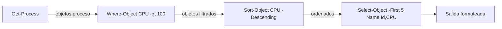
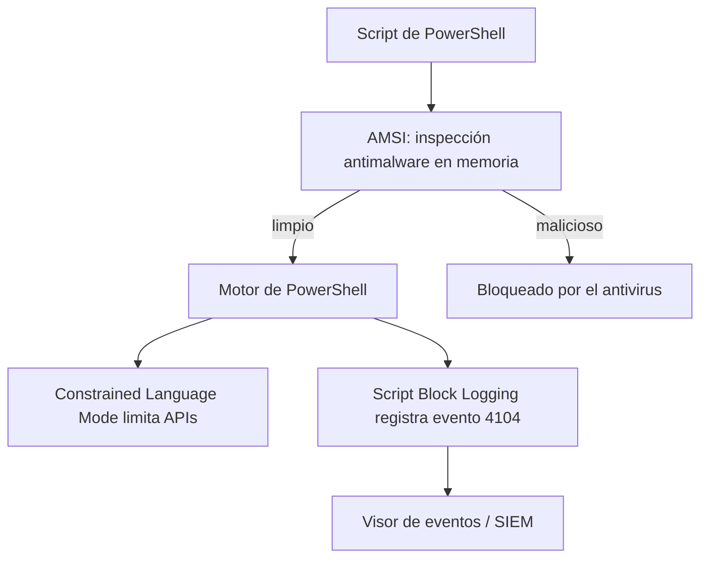

# Clase 009 — PowerShell para seguridad ofensiva y defensiva

> Parte: **0 — Fundamentos y prerrequisitos** · Fuente: *Microsoft PowerShell Documentation*
> ⏱️ Duración estimada: **110 min** · Nivel: **Fundamentos**

---

## 🎯 Objetivo

Aprender PowerShell como la herramienta dual que es: los atacantes lo usan para "vivir de la tierra" (*living off the land*) porque está preinstalado y firmado por Microsoft, y los defensores lo usan para automatizar el triaje y la respuesta a incidentes. Al terminar sabrás manejar la tubería de objetos —lo que distingue radicalmente a PowerShell de Bash—, consultar procesos, servicios, red y eventos, entender por qué PowerShell es un vector ofensivo tan frecuente y, sobre todo, qué controles defensivos (Script Block Logging, AMSI, Constrained Language Mode) lo vigilan. Dominar ambas caras es lo que te permite tanto detectar el abuso como configurar las defensas que lo delatan.

## 📚 Resultados de aprendizaje

Al finalizar, el alumno podrá:

1. **Usar** cmdlets, la tubería de objetos y el sistema de ayuda autodescubrible.
2. **Consultar** procesos, servicios, conexiones de red y eventos con PowerShell.
3. **Explicar** por qué PowerShell es un vector ofensivo frecuente y qué es un LOLBin.
4. **Configurar** defensas: Script Block Logging, transcripción, Execution Policy y AMSI.
5. **Escribir** un script de recolección para respuesta a incidentes que exporte un informe.
6. **Verificar** que la ejecución de un script queda registrada en el evento 4104.

## 🗺️ Temas

| # | Tema | Por qué importa |
|---|------|-----------------|
| 1 | Cmdlets y Verbo-Nombre | Sintaxis consistente y descubrible |
| 2 | Pipeline de objetos | Fluyen objetos con propiedades, no texto |
| 3 | `Get-Help` / `Get-Member` | Autodescubrimiento del entorno |
| 4 | Consulta del sistema | Procesos, servicios, red y eventos |
| 5 | Uso ofensivo | Ejecución en memoria y LOLBins |
| 6 | Execution Policy | Qué es y por qué no es seguridad |
| 7 | Logging y AMSI | Script Block Logging, transcripción, antimalware |
| 8 | Constrained Language Mode | Mitigación de ejecución arbitraria |

## 🧠 Explicación en profundidad

### Cmdlets y la convención Verbo-Nombre

PowerShell no es una shell de texto como Bash, sino un motor de automatización construido sobre .NET. Su unidad básica es el **cmdlet**, un pequeño comando con la forma `Verbo-Nombre`: `Get-Process`, `Stop-Service`, `New-Item`. Esta convención no es cosmética: los verbos están estandarizados por Microsoft (`Get`, `Set`, `New`, `Remove`, `Start`, `Stop`...), lo que hace el lenguaje **descubrible**. Si sabes obtener procesos con `Get-Process`, adivinas que los servicios se obtienen con `Get-Service`. Ese diseño reduce la memorización y convierte la exploración en una habilidad sistemática, apoyada por el sistema de ayuda.

### La tubería de objetos: la diferencia fundamental

Aquí está la idea que lo cambia todo. En Bash, por una tubería fluye **texto**, y para extraer un dato hay que recortarlo con `awk` o `cut`, lo que es frágil ante cambios de formato. En PowerShell, por la tubería fluyen **objetos .NET** con propiedades y métodos tipados. Cuando escribes `Get-Process`, no obtienes líneas de texto sino objetos proceso, cada uno con propiedades como `.Name`, `.Id`, `.CPU` y `.Path`. Filtras con `Where-Object`, seleccionas propiedades con `Select-Object` y ordenas con `Sort-Object`, todo por nombre de propiedad, sin parsear nada. Esto es más robusto y más legible, y es la razón de que `Get-Member` —que lista las propiedades y métodos reales de un objeto— sea el cmdlet más importante que aprenderás: cuando el pipeline no filtra como esperas, casi siempre es porque tratas los objetos como si fueran texto.



### Consulta del sistema para triaje y forense

La misma tubería de objetos convierte a PowerShell en una navaja suiza para el triaje. `Get-Process` con sus rutas revela binarios sospechosos; `Get-Service | Where-Object Status -eq 'Running'` enumera servicios activos; `Get-NetTCPConnection` muestra las conexiones y los puertos en escucha; y `Get-WinEvent` consulta los logs de eventos con filtros eficientes. La clave de rendimiento aquí es filtrar en el origen: `Get-WinEvent -FilterHashtable @{LogName='Security'; Id=4625}` pide al motor de eventos solo lo que necesitas, en lugar de traer millones de registros y filtrarlos después con `Where-Object`, que sería órdenes de magnitud más lento. Este conjunto de consultas es el esqueleto de cualquier script de recolección para respuesta a incidentes.

### Por qué los atacantes aman PowerShell

PowerShell es el ejemplo canónico de **living off the land**: usar herramientas legítimas ya presentes en el sistema para no depositar malware que un antivirus detecte. Sus ventajas para el atacante son concretas: está preinstalado en todo Windows, está firmado por Microsoft (por lo que las listas blancas basadas en firma lo permiten), tiene acceso completo a .NET, WMI y las APIs de Windows, y puede ejecutar código **directamente en memoria** sin escribir un archivo en disco (fileless). Un **LOLBin** (Living Off the Land Binary) es un binario legítimo del sistema del que se abusa para fines maliciosos; el proyecto LOLBAS cataloga muchos de ellos. Entender esto no es aprender a atacar, sino comprender qué patrones debe buscar la defensa: descargas seguidas de ejecución en memoria, uso de `Invoke-Expression`, cadenas codificadas en Base64.

### Execution Policy: lo que no es

Es un malentendido casi universal, así que conviene ser tajante: la **Execution Policy no es un control de seguridad**. Es una salvaguarda contra la ejecución *accidental* de scripts (por ejemplo, hacer doble clic en un `.ps1` recibido por correo), pero se evade de forma trivial. Un atacante con `-ExecutionPolicy Bypass` en la línea de comandos, o canalizando el script por stdin, la anula sin necesitar ningún permiso especial. No es un fallo: nunca se diseñó para detener a un adversario. Confiar en ella como barrera es un error conceptual que esta clase busca erradicar.

### Las defensas de verdad: logging, AMSI y CLM

Las defensas reales operan en tres frentes complementarios. El **Script Block Logging** registra el contenido completo de cada bloque de script que se ejecuta —incluso si estaba ofuscado o codificado, porque lo captura tras descodificarlo— en el evento **4104** del log `Microsoft-Windows-PowerShell/Operational`. Es el pilar de la detección de abuso y lo primero que habilita cualquier organización madura. La **transcripción** guarda además la entrada y salida de las sesiones en archivos de texto. **AMSI (Antimalware Scan Interface)** es la interfaz por la que el motor de PowerShell entrega el contenido de un script al antivirus para su inspección *en memoria*, justo antes de ejecutarlo, cerrando el hueco del código fileless; los atacantes intentan evadirla, lo que a su vez genera artefactos detectables. Por último, **Constrained Language Mode (CLM)** limita el acceso a las APIs de .NET y a los tipos peligrosos, recortando drásticamente lo que un script puede hacer aunque llegue a ejecutarse. Ninguna de las tres es infalible por sí sola, pero combinadas elevan enormemente el coste para el atacante.



## 📖 Definiciones y características

- **Cmdlet**: comando nativo con forma `Verbo-Nombre` (`Get-Process`). Devuelve objetos .NET, no texto, y los verbos estandarizados hacen el lenguaje descubrible. Es la unidad básica de automatización.
- **Pipeline de objetos**: encadena cmdlets pasando objetos con propiedades tipadas, no texto. `Where-Object`, `Select-Object` y `Sort-Object` operan por nombre de propiedad, lo que es más robusto que parsear texto y evita errores de formato.
- **`Get-Member`**: cmdlet que revela las propiedades y métodos reales de un objeto. Es la herramienta de diagnóstico número uno: cuando el pipeline no filtra bien, casi siempre es que tratas los objetos como texto.
- **Execution Policy**: ajuste que controla qué scripts se ejecutan por defecto. **No** es una barrera de seguridad: se evade con `-ExecutionPolicy Bypass` sin privilegios. Solo previene la ejecución accidental.
- **Living off the land (LotL)**: táctica de usar herramientas legítimas del sistema para no depositar malware detectable. PowerShell es su ejemplo canónico por estar preinstalado, firmado y con acceso a .NET.
- **LOLBin / LOLBAS**: binario legítimo del sistema del que se abusa con fines maliciosos. El proyecto LOLBAS los cataloga. Reconocerlos es clave para la detección basada en comportamiento.
- **AMSI (Antimalware Scan Interface)**: interfaz que entrega el contenido de un script al antivirus para inspeccionarlo en memoria antes de ejecutarlo, cerrando el hueco del código fileless. Los atacantes intentan evadirla.
- **Script Block Logging**: registra el contenido de cada bloque ejecutado —incluso tras desofuscarlo— en el evento 4104. Es el pilar de la detección de abuso de PowerShell y base del análisis forense.
- **Evento 4104**: registro del log `Microsoft-Windows-PowerShell/Operational` que contiene el bloque de script ejecutado. Permite reconstruir qué hizo un atacante aunque cifrara o codificara su carga.
- **Constrained Language Mode (CLM)**: modo que restringe el acceso a APIs de .NET y tipos peligrosos. Reduce drásticamente la capacidad ofensiva de un script aunque logre ejecutarse. Se combina con logging y AMSI.
- **Ejecución fileless**: correr código directamente en memoria sin escribir un archivo en disco. Evade defensas basadas en archivos y es una de las razones por las que AMSI es necesaria.

## 📔 Glosario

| Término | Definición concisa |
|---------|--------------------|
| Cmdlet | Comando `Verbo-Nombre` que devuelve objetos .NET |
| Objeto | Dato tipado con propiedades y métodos que fluye por el pipeline |
| `Where-Object` | Filtra objetos del pipeline por una condición |
| `Select-Object` | Selecciona propiedades o un número de objetos |
| `Get-Member` | Revela propiedades y métodos reales de un objeto |
| LotL | Living off the land: abusar de herramientas legítimas |
| LOLBin | Binario legítimo del sistema del que se abusa |
| Fileless | Ejecución en memoria sin tocar el disco |
| Execution Policy | Ajuste que limita la ejecución de scripts (no es seguridad) |
| AMSI | Interfaz de inspección antimalware en memoria |
| Script Block Logging | Registro del contenido de los bloques ejecutados |
| Evento 4104 | Registro que contiene el bloque de script ejecutado |
| CLM | Constrained Language Mode: limita APIs peligrosas |
| WMI | Interfaz de gestión de Windows accesible desde PowerShell |
| IR | Respuesta a incidentes (Incident Response) |

## 🧰 Herramientas y preparación

Trabaja en tu **VM Windows de laboratorio**. PowerShell viene integrado; usa la consola y **VS Code** con la extensión de PowerShell (el clásico ISE sigue disponible pero está en mantenimiento). Para las defensas, explora la Directiva de grupo local con `gpedit.msc` y el Visor de eventos en `Microsoft-Windows-PowerShell/Operational`. Ten claro que existen dos ediciones: **Windows PowerShell 5.1** (omnipresente en el parque corporativo, por lo que es la que más verás como defensor) y **PowerShell 7+** (multiplataforma); los conceptos de esta clase aplican a ambas. No ejecutes cargas ofensivas contra sistemas ajenos.

## 🧪 Laboratorio guiado

1. **Descubrir el entorno** y aprender a autodescubrir:

   ```powershell
   Get-Command -Verb Get | Measure-Object
   Get-Help Get-Process -Examples
   Get-Process | Get-Member
   ```

2. **Consultas de sistema** (uso defensivo y forense) apoyándote en la tubería de objetos:

   ```powershell
   Get-Process | Sort-Object CPU -Descending | Select-Object -First 5 Name,Id,CPU
   Get-Service | Where-Object Status -eq 'Running' | Select-Object Name,DisplayName
   Get-NetTCPConnection | Where-Object State -eq 'Listen'
   ```

3. **Eventos de seguridad**. Últimos fallos de inicio de sesión, filtrando en el origen:

   ```powershell
   Get-WinEvent -FilterHashtable @{LogName='Security'; Id=4625} -MaxEvents 5
   ```

4. **Execution Policy**. Compruébala y razona por qué no impide todo:

   ```powershell
   Get-ExecutionPolicy -List
   ```

   Reflexiona: `-ExecutionPolicy Bypass` la anula sin permisos especiales.

5. **Activar defensas**. Habilita Script Block Logging por directiva local (Configuración del equipo → Plantillas administrativas → Componentes de Windows → Windows PowerShell). Ejecuta un script y verifica que aparece el evento **4104**:

   ```powershell
   Get-WinEvent -LogName 'Microsoft-Windows-PowerShell/Operational' -MaxEvents 5 |
     Where-Object Id -eq 4104
   ```

6. **Script de recolección IR**. Crea `recolectar.ps1` que exporte a CSV los procesos con sus rutas, los servicios en ejecución y las conexiones de red en escucha, todo con marca de tiempo.

> ⚠️ **Nota ética**: las capacidades ofensivas de PowerShell (descarga y ejecución en memoria, evasión de AMSI) se estudian aquí **solo** para entender la detección y **exclusivamente** en tu laboratorio. Usarlas contra terceros sin autorización explícita es un delito.

## ✍️ Ejercicios

1. Escribe un one-liner que liste los 10 procesos con más memoria (WorkingSet) ordenados de mayor a menor.
2. Exporta a CSV todos los servicios con inicio automático que están detenidos.
3. Explica con un ejemplo por qué `Get-ExecutionPolicy` no protege realmente contra scripts maliciosos.
4. Investiga qué es un LOLBin y da dos ejemplos usados a través de PowerShell, citando el proyecto LOLBAS.
5. Configura y verifica la transcripción de PowerShell (PowerShell Transcription) y localiza el archivo que genera.
6. Detecta con `Get-WinEvent` cualquier evento 4104 cuyo contenido incluya la palabra `Invoke-Expression`.
7. Usa `Get-Member` sobre la salida de `Get-Service` y enumera tres propiedades que no imprime la vista por defecto.
8. Explica la diferencia entre filtrar con `-FilterHashtable` y filtrar con `Where-Object` tras traer todos los eventos.

## 📝 Reto verificable

Construye `triage.ps1`, un script de recolección para respuesta a incidentes que genere un informe (CSV o JSON) con: procesos y sus rutas, servicios en ejecución, conexiones de red en escucha, usuarios locales y entradas de auto-inicio. Habilita Script Block Logging y demuestra que la ejecución del script queda registrada en el evento 4104.

**Criterio de aceptación**: el script produce un informe estructurado sin errores en la VM, y en el registro `Microsoft-Windows-PowerShell/Operational` aparece un evento 4104 correspondiente a su ejecución. Otro alumno puede correr el script y obtener un informe equivalente.

## ⚠️ Errores comunes

| Síntoma / mensaje | Causa y cómo arreglar |
|-------------------|-----------------------|
| "running scripts is disabled on this system" | Execution Policy en Restricted. Ajústala con `Set-ExecutionPolicy` (con permiso) o lanza con `-File` y política adecuada. |
| El pipeline no filtra como esperas | Tratas los objetos como texto. Usa `Get-Member` para ver las propiedades reales y filtra con `Where-Object` por su nombre. |
| No aparecen eventos 4104 | Script Block Logging no está habilitado. Actívalo por directiva local y reintenta. |
| `Get-WinEvent` lento o sin resultados | Filtras tras traer todo. Usa `-FilterHashtable` para filtrar en el origen. |
| El script funciona en ISE pero no en consola | Diferencias de contexto, perfil o edición. Prueba siempre en la consola de destino. |
| Confundes 5.1 con 7 y falta un cmdlet | Algunos cmdlets difieren entre ediciones. Comprueba la versión con `$PSVersionTable`. |

## ❓ Preguntas frecuentes

**❓ ¿Por qué a los atacantes les gusta PowerShell?** Porque está preinstalado, firmado por Microsoft, accede a .NET, WMI y las APIs de Windows, y puede ejecutar código directamente en memoria sin tocar el disco. Es *living off the land* por excelencia: no deposita malware que un antivirus basado en archivos detecte.

**❓ ¿La Execution Policy protege mi equipo?** No frente a un atacante decidido: se evade con un simple parámetro `-ExecutionPolicy Bypass` sin necesitar privilegios. Es una salvaguarda contra la ejecución *accidental* de scripts, no un control de seguridad.

**❓ ¿Qué versión de PowerShell debo aprender?** Los conceptos son iguales en Windows PowerShell 5.1 y en PowerShell 7+. Para defensa, la 5.1 sigue siendo omnipresente en equipos corporativos, así que es la que más te encontrarás al analizar incidentes.

**❓ ¿AMSI lo detiene todo?** No; existen técnicas de evasión de AMSI. Pero combinada con Script Block Logging (que registra el evento 4104 aun tras la desofuscación) y Constrained Language Mode, eleva enormemente la barrera y genera artefactos que la propia evasión delata.

## 🔗 Referencias

- Microsoft PowerShell Documentation — <https://learn.microsoft.com/powershell/>
- About Execution Policies — <https://learn.microsoft.com/powershell/module/microsoft.powershell.core/about/about_execution_policies>
- AMSI overview — <https://learn.microsoft.com/windows/win32/amsi/antimalware-scan-interface-portal>
- LOLBAS Project — <https://lolbas-project.github.io/>
- MITRE ATT&CK, técnica T1059.001 (PowerShell) — <https://attack.mitre.org/techniques/T1059/001/>

## 📥 Material descargable

- 📄 [Guía en PDF](./clase-009-guia.pdf) — versión imprimible de esta clase.
- 🎞️ [Presentación (PPTX)](./clase-009-presentacion.pptx) — deck para proyectar en clase.

## ⬅️ Clase anterior

[Clase 008 — Windows esencial para seguridad: arquitectura, registro y servicios](../008-windows-esencial-para-seguridad-arquitectura-registro-y-servicios/README.md)

## ➡️ Siguiente clase

[Clase 010 — Redes TCP/IP: modelo OSI, encapsulación y capas](../010-redes-tcp-ip-modelo-osi-encapsulacion-y-capas/README.md)
