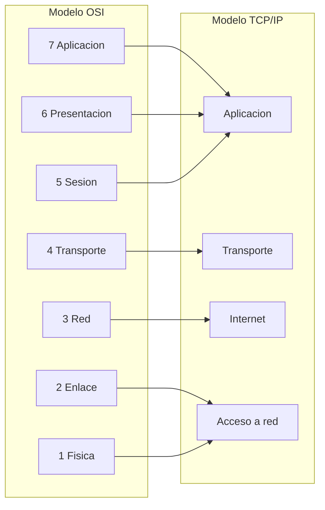

# Clase 010 — Redes TCP/IP: modelo OSI, encapsulación y capas

> Parte: **0 — Fundamentos y prerrequisitos** · Fuente: *W. Richard Stevens, TCP/IP Illustrated Vol. 1*
> ⏱️ Duración estimada: **100 min** · Nivel: **Fundamentos**

---

## 🎯 Objetivo

Entender cómo se comunican los sistemas en red mediante modelos de capas, la abstracción más importante de toda la disciplina de redes. Al terminar podrás explicar qué hace cada capa, cómo se **encapsulan** los datos al bajar por la pila del emisor y cómo se **desencapsulan** al subir en el receptor, y traducir con soltura entre el modelo OSI de 7 capas (el vocabulario de la industria) y el modelo TCP/IP real de 4 capas (el que gobierna Internet). Este marco no es teoría abstracta: sin él, frases como "un ataque de capa 7", "un balanceador L4" o "spoofing de capa 2" son ruido, y no se entiende dónde actúa un firewall, un IDS o cada familia de ataque.

## 📚 Resultados de aprendizaje

Al finalizar, el alumno podrá:

1. **Enumerar** las capas de los modelos OSI y TCP/IP y describir la función de cada una.
2. **Explicar** la encapsulación y nombrar la PDU de cada capa.
3. **Mapear** protocolos reales (Ethernet, IP, TCP, HTTP) a su capa correspondiente.
4. **Relacionar** ataques concretos con la capa que afectan.
5. **Observar** la encapsulación real en una captura de red con Wireshark.
6. **Calcular** la sobrecarga de cabeceras que añade cada capa a un payload.

## 🗺️ Temas

| # | Tema | Por qué importa |
|---|------|-----------------|
| 1 | Modelo OSI (7 capas) | Marco de referencia y vocabulario universal |
| 2 | Modelo TCP/IP (4 capas) | El que se usa de verdad en Internet |
| 3 | Encapsulación | Cómo se envuelven los datos capa a capa |
| 4 | PDU por capa | Bits, tramas, paquetes, segmentos |
| 5 | Direccionamiento por capa | MAC, IP y puerto |
| 6 | Protocolos por capa | Ethernet, IP, TCP/UDP, HTTP |
| 7 | Ataques por capa | Cada capa tiene su superficie |
| 8 | Herramientas de observación | Wireshark y tcpdump |

## 🧠 Explicación en profundidad

### Por qué capas: divide y vencerás

Comunicar dos ordenadores es un problema enorme: hay que convertir bits en señales físicas, entregar datos al equipo correcto de la red local, encaminarlos por Internet, garantizar que lleguen íntegros y en orden, y finalmente que la aplicación los interprete. Resolverlo todo de golpe sería inmanejable, así que la ingeniería de redes lo parte en **capas**, cada una con una responsabilidad acotada y una interfaz clara con la de arriba y la de abajo. La ventaja es la modularidad: puedes cambiar el medio físico (de cable a WiFi) sin tocar TCP, o cambiar la aplicación sin tocar IP. Cada capa "habla" con su capa homóloga en el otro extremo como si tuviera una conexión directa, mientras que en realidad delega en la capa inferior.

### Los dos modelos: OSI y TCP/IP

Existen dos modelos y hay que conocer ambos. El **modelo OSI** es conceptual, de 7 capas (de arriba abajo: aplicación, presentación, sesión, transporte, red, enlace de datos y física), y su valor es el vocabulario: cuando alguien dice "capa 7" o "capa 3", habla en OSI. El **modelo TCP/IP** es el que realmente implementa Internet, con 4 capas (aplicación, transporte, Internet y acceso a red), y colapsa varias capas OSI en una sola: las funciones de sesión y presentación de OSI se realizan dentro de la capa de aplicación de TCP/IP o dentro de protocolos como TLS. No compiten; se complementan. La industria razona con el vocabulario de OSI pero opera con TCP/IP.



### Encapsulación y las PDU

La **encapsulación** es el mecanismo central. Cuando una aplicación envía datos, estos descienden por la pila y **cada capa añade su propia cabecera** (y a veces un cierre) delante de lo que recibe de la capa superior, como una serie de sobres dentro de sobres. El dato en cada capa recibe un nombre específico, su **PDU** (Protocol Data Unit): en la capa de aplicación son **datos**; al pasar por transporte se convierten en un **segmento** (TCP) o **datagrama** (UDP) al añadirse la cabecera con los puertos; en la capa de red/Internet se convierten en un **paquete** al añadirse la cabecera IP con las direcciones IP; en la capa de enlace se convierten en una **trama** al añadirse la cabecera Ethernet con las direcciones MAC; y finalmente la capa física los transmite como **bits**. En el receptor ocurre lo inverso: cada capa lee y retira su cabecera (**desencapsulación**) y entrega el contenido a la capa superior. El payload original nunca se modifica, solo se envuelve.

```text
 Datos de aplicacion            [ HTTP: "GET / HTTP/1.1" ]
 + cabecera TCP (segmento)   [ TCP | HTTP ................ ]
 + cabecera IP  (paquete)  [ IP | TCP | HTTP ............. ]
 + cabecera Ethernet (trama) [ ETH | IP | TCP | HTTP | FCS ]
 -> a la red como bits
```

### Direccionamiento: tres direcciones para un mismo paquete

Una idea que suele confundir es que un mismo paquete lleva **tres identificadores distintos, uno por capa**, y cada uno cumple una función diferente. La dirección **MAC** (capa de enlace) identifica una tarjeta de red en el segmento local y solo tiene alcance dentro de esa red física; cambia en cada salto. La dirección **IP** (capa de red) identifica el host de origen y destino de extremo a extremo y no cambia a lo largo del trayecto (salvo NAT). El **puerto** (capa de transporte) identifica la aplicación concreta dentro del host, lo que permite la **multiplexación**: que un mismo equipo mantenga cientos de conexiones simultáneas distinguiéndolas por el par puerto-origen / puerto-destino. Por eso un switch, que opera en capa 2, decide por MAC, mientras que un router, en capa 3, decide por IP.

### Cada capa, su superficie de ataque

El modelo de capas también organiza las amenazas, porque cada capa tiene su propia superficie. En la **capa de enlace**, el *ARP spoofing* envenena la tabla que asocia IP a MAC para interceptar tráfico local (man-in-the-middle). En la **capa de red**, el *IP spoofing* falsifica la dirección de origen. En la **capa de transporte**, el *SYN flood* agota los recursos de conexión de un servidor. Y en la **capa de aplicación**, viven las inyecciones (SQL, comandos) y la mayoría de ataques web. Esta correspondencia explica dónde actúan las defensas: un firewall de paquetes filtra en capas 3-4 (por IP y puerto), mientras que un WAF (Web Application Firewall) inspecciona la capa 7. Entender la capa de un ataque es el primer paso para elegir el control adecuado.

| Capa TCP/IP | PDU | Direccionamiento | Ataque típico | Defensa típica |
|-------------|-----|------------------|---------------|----------------|
| Aplicación | Datos | Nombre / URL | Inyección SQL | WAF |
| Transporte | Segmento | Puerto | SYN flood | Rate limiting / firewall |
| Internet | Paquete | IP | IP spoofing | Filtrado por IP / RPF |
| Acceso a red | Trama | MAC | ARP spoofing | Port security / DAI |

## 📖 Definiciones y características

- **Modelo OSI**: modelo conceptual de 7 capas (física, enlace, red, transporte, sesión, presentación, aplicación). Es la referencia para razonar y el vocabulario común de la industria ("capa 7"), no una implementación literal de Internet.
- **Modelo TCP/IP**: modelo práctico de 4 capas (acceso a red, Internet, transporte, aplicación) que gobierna Internet de verdad. Colapsa las capas de sesión y presentación de OSI dentro de la de aplicación o de protocolos como TLS.
- **Encapsulación**: proceso por el que cada capa añade su cabecera a los datos al bajar por la pila. Los datos de aplicación viajan envueltos como segmento → paquete → trama. El payload original se preserva; solo se envuelve.
- **Desencapsulación**: proceso inverso en el receptor, donde cada capa lee y retira su cabecera y entrega el contenido a la capa superior. Es lo que permite que cada capa "converse" con su homóloga del otro extremo.
- **PDU (Protocol Data Unit)**: nombre del dato en cada capa: datos en aplicación, segmento en transporte, paquete en red, trama en enlace y bits en física. Precisa la terminología y evita confundir capas.
- **Dirección MAC**: identificador físico de una tarjeta de red, de alcance local (capa de enlace). Cambia en cada salto de la ruta. Es la base del envenenamiento ARP.
- **Dirección IP**: identificador lógico de un host de extremo a extremo (capa de red). No cambia a lo largo del trayecto salvo NAT. Determina el encaminamiento entre redes.
- **Puerto**: número que identifica una aplicación dentro de un host (capa de transporte). Habilita la multiplexación: muchas conexiones simultáneas distinguidas por sus puertos.
- **Multiplexación por puerto**: mecanismo por el que la capa de transporte usa los puertos para separar conexiones de distintas aplicaciones sobre un mismo host. Sin ella, un equipo solo podría mantener una conversación a la vez.
- **MTU (Maximum Transmission Unit)**: tamaño máximo de la carga útil a nivel de enlace (típicamente 1500 bytes en Ethernet). Superarla obliga a fragmentar el paquete, con implicaciones de rendimiento y de evasión de IDS.
- **Switch vs router**: un switch conmuta tramas por dirección MAC (capa 2); un router encamina paquetes por dirección IP entre redes distintas (capa 3). Confundir sus capas es un error conceptual frecuente.

## 📔 Glosario

| Término | Definición concisa |
|---------|--------------------|
| OSI | Modelo conceptual de referencia de 7 capas |
| TCP/IP | Modelo práctico de 4 capas que implementa Internet |
| PDU | Unidad de datos de protocolo (nombre por capa) |
| Trama | PDU de la capa de enlace (lleva MAC y FCS) |
| Paquete | PDU de la capa de red (lleva la cabecera IP) |
| Segmento | PDU de transporte con TCP (datagrama con UDP) |
| MAC | Dirección física de una tarjeta de red (capa 2) |
| IP | Dirección lógica de un host de extremo a extremo (capa 3) |
| Puerto | Identificador de aplicación dentro de un host (capa 4) |
| MTU | Tamaño máximo de carga a nivel de enlace |
| Encapsulación | Añadir la cabecera de cada capa al bajar la pila |
| ARP spoofing | Envenenamiento de la tabla IP-a-MAC en la red local |
| SYN flood | Agotamiento de recursos de conexión en transporte |
| WAF | Firewall de aplicación web (inspecciona capa 7) |
| pcap | Formato de archivo de captura de tráfico de red |

## 🧰 Herramientas y preparación

Instala **Wireshark** en tu equipo o VM desde <https://www.wireshark.org> y ten `tcpdump` disponible en Kali. Wireshark analiza en profundidad con su árbol de capas y sus filtros; `tcpdump` captura rápido en servidores sin interfaz gráfica; se complementan. Practica **solo** sobre tu red de laboratorio o sobre tráfico propio. Tener a mano un diagrama impreso que alinee las capas OSI y TCP/IP con sus protocolos ayuda mucho a fijar el mapeo durante la clase.

## 🧪 Laboratorio guiado

1. **Dibuja el mapeo**. En una tabla, alinea las 7 capas OSI con las 4 de TCP/IP y coloca al menos un protocolo por capa.

2. **Captura tráfico** de una petición web sencilla. En Kali (ajusta la interfaz con `ip a`):

   ```bash
   sudo tcpdump -i eth0 -c 20 -w captura.pcap host <ip-destino>
   ```

   Genera tráfico con `curl http://<ip-destino>/`.

3. **Abre la captura en Wireshark** y selecciona un paquete HTTP.

4. **Observa la encapsulación**. En el panel de detalle verás las capas anidadas: Ethernet (enlace) → IP (red) → TCP (transporte) → HTTP (aplicación). Expande cada una y localiza su cabecera.

5. **Identifica las tres direcciones**: la MAC en Ethernet, la IP en la capa de red y el puerto en TCP. Anota las tres para el mismo paquete y asócialas a su capa.

6. **Relaciona las PDU**: confirma que lo que Wireshark llama *frame* contiene el *packet* IP, que a su vez contiene el *segment* TCP.

7. **Ataque por capa** (conceptual): junto a cada capa, escribe un ataque típico (ARP spoofing en enlace, IP spoofing en red, SYN flood en transporte, inyección en aplicación) y qué control lo mitiga.

> ⚠️ **Nota ética**: captura únicamente tráfico de tu propio laboratorio o del que tengas permiso explícito. Interceptar comunicaciones ajenas es un delito.

## ✍️ Ejercicios

1. Ordena de menor a mayor nivel de capa: TCP, Ethernet, HTTP, IP.
2. Explica qué cabecera añade cada capa a un mensaje "hola" que envía una aplicación.
3. ¿En qué PDU y capa actúa un switch? ¿Y un router? Justifícalo.
4. Da un ejemplo de ataque para cada una de las 4 capas del modelo TCP/IP.
5. Calcula cuánta sobrecarga en bytes añaden las cabeceras Ethernet + IP + TCP a un payload (usa los tamaños mínimos de cada cabecera).
6. Explica por qué el modelo OSI tiene capas (sesión, presentación) que TCP/IP no separa, y dónde acaban esas funciones.
7. Describe qué ocurre con la dirección MAC y con la dirección IP de un paquete al pasar por un router.
8. Razona por qué un firewall de capa 3-4 no puede bloquear una inyección SQL y qué tipo de defensa sí puede.

## 📝 Reto verificable

A partir de una captura propia, entrega un documento que "diseccione" un único paquete HTTP mostrando, capa por capa, la cabecera añadida y sus campos clave (MAC origen/destino, IP origen/destino, puertos y la primera línea HTTP). Incluye una captura de pantalla del árbol de Wireshark.

**Criterio de aceptación**: el documento identifica correctamente las cuatro capas del paquete con al menos un campo relevante de cada una, y las direcciones (MAC, IP, puerto) coinciden con las de la captura mostrada. Es verificable abriendo el `.pcap` adjunto.

## ⚠️ Errores comunes

| Síntoma / mensaje | Causa y cómo arreglar |
|-------------------|-----------------------|
| Confundir OSI con TCP/IP | Son modelos distintos; TCP/IP colapsa varias capas OSI en una. Aprende el mapeo entre ambos. |
| `tcpdump` no captura nada | Interfaz equivocada o sin permisos. Usa `sudo` y verifica la interfaz con `ip a`. |
| El tráfico se ve cifrado e ilegible | HTTPS oculta la capa de aplicación con TLS. Usa HTTP en el laboratorio o descifra con claves propias. |
| Creer que un switch enruta por IP | Un switch opera en capa 2 (MAC); el router en capa 3 (IP). No confundas sus responsabilidades. |
| Pensar que la encapsulación cambia los datos | Solo los envuelve con cabeceras; el payload original se preserva intacto. |
| Buscar un ataque de "capa 5" en TCP/IP | TCP/IP no separa sesión ni presentación; esas funciones viven en la capa de aplicación o en TLS. |

## ❓ Preguntas frecuentes

**❓ ¿Aprendo OSI o TCP/IP?** Ambos. TCP/IP es el modelo real que implementa Internet, pero OSI aporta el vocabulario que usa toda la industria: "un ataque de capa 7", "un balanceador L4", "spoofing de capa 2". Necesitas OSI para comunicarte y TCP/IP para entender lo que ocurre de verdad.

**❓ ¿Por qué importa la encapsulación en seguridad?** Porque cada capa se puede inspeccionar, filtrar o falsificar de forma independiente. Firewalls, IDS/IPS y los propios ataques operan en capas concretas; sin el modelo de encapsulación no se entiende dónde actúa cada control ni cada amenaza.

**❓ ¿Las capas de sesión y presentación existen en la práctica?** Sus funciones (gestión de sesión, cifrado y codificación) sí existen, pero en el modelo TCP/IP se realizan dentro de la capa de aplicación o de protocolos como TLS, en lugar de en capas separadas. Por eso no buscarás una "capa 5" en una pila TCP/IP real.

**❓ ¿Wireshark o tcpdump?** `tcpdump` para capturar rápido en servidores sin interfaz gráfica y en scripts; Wireshark para analizar en profundidad con su árbol de capas y sus potentes filtros de visualización. En la práctica se combinan: capturas con tcpdump y analizas el `.pcap` en Wireshark.

## 🔗 Referencias

- W. Richard Stevens, *TCP/IP Illustrated, Vol. 1*.
- Wireshark User's Guide — <https://www.wireshark.org/docs/>
- RFC 1122, *Requirements for Internet Hosts — Communication Layers* — <https://www.rfc-editor.org/rfc/rfc1122>
- RFC 791, *Internet Protocol* — <https://www.rfc-editor.org/rfc/rfc791>
- Cloudflare Learning: OSI model — <https://www.cloudflare.com/learning/ddos/glossary/open-systems-interconnection-model-osi/>

## 📥 Material descargable

- 📄 [Guía en PDF](./clase-010-guia.pdf) — versión imprimible de esta clase.
- 🎞️ [Presentación (PPTX)](./clase-010-presentacion.pptx) — deck para proyectar en clase.

## ⬅️ Clase anterior

[Clase 009 — PowerShell para seguridad ofensiva y defensiva](../009-powershell-para-seguridad-ofensiva-y-defensiva/README.md)

## ➡️ Siguiente clase

[Clase 011 — Protocolos de red: IP, TCP, UDP e ICMP en profundidad](../011-protocolos-de-red-ip-tcp-udp-e-icmp-en-profundidad/README.md)
