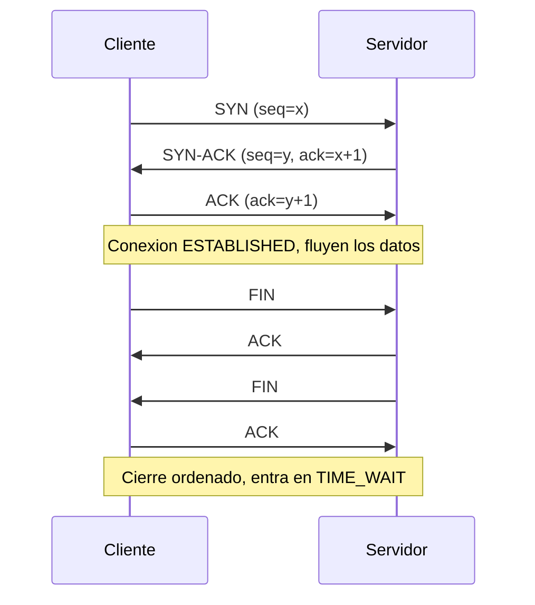

# Clase 011 — Protocolos de red: IP, TCP, UDP e ICMP en profundidad

> Parte: **0 — Fundamentos y prerrequisitos** · Fuente: *RFC 791, 793 y W. R. Stevens, TCP/IP Illustrated*
> ⏱️ Duración estimada: **110 min** · Nivel: **Fundamentos**

---

## 🎯 Objetivo

Conocer al detalle los protocolos que mueven Internet: cómo se estructuran sus cabeceras bit a bit, cómo TCP establece, mantiene y cierra una conexión fiable, en qué se diferencia radicalmente UDP y para qué sirve ICMP. Este conocimiento no es teoría inerte: es el sustrato del escaneo de puertos, del fingerprinting de sistemas operativos, de la detección de intrusiones y de una familia entera de ataques de red. Quien entiende las cabeceras entiende por qué un escaneo funciona, por qué un firewall responde como responde y qué revela cada paquete que viaja por el cable.

## 📚 Resultados de aprendizaje

Al finalizar, el alumno podrá:

1. **Interpretar** los campos clave de las cabeceras IP, TCP, UDP e ICMP y explicar su función.
2. **Explicar** el three-way handshake, el control de flujo por ventana y el cierre ordenado o abrupto de una conexión TCP.
3. **Distinguir** TCP de UDP y justificar cuándo el diseño de un protocolo elige cada uno.
4. **Relacionar** flags y estados TCP con las técnicas de escaneo (SYN, connect, FIN, UDP).
5. **Analizar** una conversación real en Wireshark, identificando fases y anomalías.
6. **Reconocer** cómo ICMP y ciertos campos IP se abusan para evasión, fingerprinting y exfiltración.

## 🗺️ Temas

| # | Tema | Por qué importa |
|---|------|-----------------|
| 1 | Cabecera IP | TTL, protocolo, fragmentación e identificación |
| 2 | Three-way handshake | SYN, SYN-ACK, ACK: el nacimiento de toda conexión TCP |
| 3 | Flags TCP | SYN, ACK, FIN, RST, PSH, URG y su semántica |
| 4 | Estados TCP | LISTEN, ESTABLISHED, TIME_WAIT y la máquina de estados |
| 5 | Ventana y secuencia | Fiabilidad, orden y control de flujo |
| 6 | UDP | Sin conexión, base de DNS, DHCP, QUIC y VoIP |
| 7 | ICMP | Diagnóstico legítimo y su abuso ofensivo |
| 8 | Escaneo de puertos | SYN, connect, FIN, UDP scan y sus huellas |

## 🧠 Explicación en profundidad

### La cabecera IP: el sobre que todo lo envuelve

Cada paquete que sale de tu máquina lleva delante una cabecera IP de 20 bytes (sin opciones) que actúa como el sobre postal del envío: contiene la dirección de origen y destino, pero también metadatos que la seguridad aprovecha a diario. El campo **TTL (Time To Live)** empieza en un valor típico según el sistema operativo (64 en Linux y macOS, 128 en Windows, 255 en muchos routers) y cada router que reenvía el paquete lo decrementa en uno; cuando llega a cero, el paquete se descarta y el router devuelve un ICMP "Time Exceeded". Esa mecánica es la que hace posible `traceroute`, y también permite un fingerprinting grosero: si recibes una respuesta con TTL 57, probablemente el origen partió de 64 y atravesó 7 saltos, lo que sugiere un Linux. El campo **Protocol** indica qué viaja dentro (6 = TCP, 17 = UDP, 1 = ICMP), y los campos de **Identification**, **Flags** y **Fragment Offset** gobiernan la fragmentación, un terreno históricamente fértil para evadir IDS mediante paquetes solapados o diminutos.

El detalle importante es que IP es un protocolo *best-effort*: no garantiza entrega, ni orden, ni ausencia de duplicados. Toda la fiabilidad que asociamos a Internet vive una capa más arriba, en TCP. IP solo promete intentarlo.

### TCP: fiabilidad construida sobre un medio poco fiable

TCP toma el canal caótico de IP y construye encima una ilusión perfecta: un flujo de bytes ordenado, sin pérdidas ni duplicados, entre dos extremos. Lo consigue con tres ideas: números de secuencia, confirmaciones (ACK) y retransmisión. Cada byte del flujo tiene un número de secuencia; el receptor confirma hasta dónde ha recibido correctamente; y si el emisor no ve confirmación en un tiempo, retransmite. La **ventana** (window) anuncia cuántos bytes puede aceptar el receptor sin desbordarse, implementando control de flujo, mientras que algoritmos de control de congestión ajustan el ritmo según la salud de la red.

Todo empieza con el **three-way handshake**. El cliente envía un segmento con el flag **SYN** y un número de secuencia inicial (ISN) aleatorio; el servidor responde **SYN-ACK**, confirmando el SYN del cliente y proponiendo su propio ISN; el cliente cierra con un **ACK**. A partir de ahí la conexión está ESTABLISHED y fluyen los datos. Este baile de tres pasos es exactamente lo que un escáner de puertos manipula.



### Flags y estados: la máquina que un escáner interroga

Los **flags** de la cabecera TCP son bits que cambian el significado de un segmento. **SYN** inicia; **ACK** confirma; **FIN** pide cerrar de forma ordenada; **RST** aborta de golpe (sin negociación); **PSH** pide entrega inmediata a la aplicación; **URG** marca datos urgentes. La regla que hace posible el escaneo es sencilla y está en el RFC 793: un puerto TCP **cerrado** que recibe un SYN responde con **RST**, mientras que un puerto **abierto** responde con **SYN-ACK**. Un puerto **filtrado** por un firewall simplemente no responde (o devuelve un ICMP administrativamente prohibido). Esas tres respuestas distintas son la materia prima de `nmap`.

Detrás de esos flags hay una máquina de estados. Una conexión transita por LISTEN, SYN-SENT, SYN-RECEIVED, ESTABLISHED, y al cerrar pasa por FIN-WAIT, CLOSE-WAIT y el célebre **TIME_WAIT**, un estado de espera que evita que segmentos rezagados de una conexión vieja contaminen una nueva. Entender esta máquina explica por qué a veces ves miles de conexiones en TIME_WAIT en un servidor cargado y por qué eso no siempre es un problema.

### UDP e ICMP: velocidad sin promesas, y el mensajero de la red

**UDP** es lo opuesto a TCP: cabecera de 8 bytes, sin handshake, sin números de secuencia, sin retransmisión. Envías un datagrama y esperas lo mejor. Esa simplicidad es una virtud cuando la latencia importa más que la fiabilidad perfecta: DNS resuelve en un solo intercambio, DHCP arranca antes de tener IP, VoIP y videojuegos prefieren un paquete perdido a uno retrasado, y QUIC (base de HTTP/3) reconstruye fiabilidad y cifrado por encima de UDP. La ausencia de handshake también hace de UDP el vehículo favorito de la amplificación en ataques DDoS (DNS, NTP, memcached), porque no hay que probar que la dirección de origen es real.

**ICMP** es el sistema nervioso de diagnóstico de IP. Transporta mensajes de control: "echo request/reply" (lo que usa `ping`), "destination unreachable" (incluido el sub-código "port unreachable" que delata un puerto UDP cerrado), "time exceeded" (motor de `traceroute`) y "redirect". Es imprescindible: bloquearlo por completo rompe el Path MTU Discovery y el diagnóstico. Pero también se abusa: un **túnel ICMP** esconde datos exfiltrados dentro del payload de paquetes echo, atravesando firewalls que dejan pasar el ping sin inspeccionarlo.

### Del protocolo al escaneo: cómo nmap lee las respuestas

Cuando entiendes las tablas anteriores, el escaneo deja de ser magia. La siguiente tabla resume lo que un puerto revela según el tipo de sonda y su estado, que es justo lo que interpretarás en el laboratorio.

| Técnica (nmap) | Sonda enviada | Puerto abierto | Puerto cerrado | Puerto filtrado |
|----------------|---------------|----------------|----------------|-----------------|
| SYN scan (`-sS`) | SYN | SYN-ACK (luego RST) | RST | Sin respuesta / ICMP |
| Connect scan (`-sT`) | Handshake completo | Conexión completada | RST | Sin respuesta / ICMP |
| FIN scan (`-sF`) | FIN | Sin respuesta | RST | Sin respuesta |
| UDP scan (`-sU`) | Datagrama UDP | Respuesta o silencio | ICMP port unreachable | Sin respuesta |

El SYN scan se llama *half-open* porque nunca completa el handshake: tras recibir el SYN-ACK envía un RST y descarta la conexión, lo que históricamente evitaba que la aplicación registrara el intento. El UDP scan es lento e incierto precisamente por la falta de handshake: la ausencia de respuesta puede significar "abierto" o "filtrado", y nmap debe reintentar y esperar.

## 📖 Definiciones y características

- **TTL (Time To Live)**: contador de saltos en la cabecera IP que cada router decrementa; al llegar a cero el paquete se descarta con un ICMP "Time Exceeded". Es el motor de `traceroute` y, como los sistemas parten de valores típicos (64, 128, 255), permite inferir el SO de origen contando saltos.
- **Three-way handshake**: secuencia SYN → SYN-ACK → ACK que abre toda conexión TCP e intercambia los números de secuencia iniciales. Es la base del connect scan, y su saturación es lo que provoca el ataque SYN flood.
- **Flag RST**: bit que aborta una conexión de forma inmediata, sin negociación. Un puerto TCP cerrado responde con RST a un SYN, y esa respuesta es exactamente lo que le dice al escáner que el puerto no escucha.
- **Número de secuencia (ISN)**: identifica la posición de cada byte en el flujo TCP. Su predictibilidad en implementaciones antiguas permitió ataques de spoofing e inyección; los SO modernos lo aleatorizan para mitigarlo.
- **Ventana (window)**: campo que anuncia cuántos bytes puede recibir el extremo sin desbordar su buffer. Implementa el control de flujo y evita que un emisor rápido ahogue a un receptor lento.
- **UDP**: transporte sin conexión, sin orden ni garantías, con cabecera de solo 8 bytes. Su ligereza lo hace ideal para DNS, DHCP, VoIP y QUIC, pero también para ataques de amplificación por su falta de validación de origen.
- **ICMP**: protocolo de control y diagnóstico de IP (echo, unreachable, time exceeded). Sostiene `ping` y `traceroute`; su payload también sirve como canal encubierto para túneles y exfiltración.
- **Puerto filtrado**: estado en el que un firewall descarta la sonda sin responder, indistinguible a primera vista de la pérdida de red. Se diferencia de "cerrado" porque este último sí responde (RST o ICMP).

## 📔 Glosario

| Término | Definición concisa |
|---------|--------------------|
| IP | Protocolo de red best-effort que direcciona y enruta paquetes sin garantías. |
| TCP | Transporte fiable orientado a conexión: orden, retransmisión y control de flujo. |
| UDP | Transporte sin conexión, rápido y sin garantías de entrega ni orden. |
| ICMP | Protocolo de control y diagnóstico de IP (ping, traceroute, errores). |
| TTL | Contador de saltos que evita bucles y sirve para fingerprinting. |
| ISN | Número de secuencia inicial aleatorio que abre una conexión TCP. |
| SYN | Flag que solicita abrir una conexión TCP. |
| ACK | Flag que confirma la recepción de datos hasta un número de secuencia. |
| RST | Flag que aborta una conexión de forma abrupta. |
| FIN | Flag que solicita cerrar la conexión de forma ordenada. |
| Handshake | Intercambio de tres segmentos que establece una conexión TCP. |
| TIME_WAIT | Estado de espera tras cerrar que evita solapamiento con conexiones nuevas. |
| Fragmentación | División de un paquete IP en fragmentos según el MTU del enlace. |
| MTU | Tamaño máximo de trama que un enlace puede transmitir sin fragmentar. |
| Half-open scan | Escaneo SYN que no completa el handshake para pasar inadvertido. |

## 🧰 Herramientas y preparación

Trabaja siempre en un laboratorio aislado (VMs en red interna, nunca contra terceros). Usa **Wireshark** para el análisis visual paquete a paquete, **tcpdump** para capturas rápidas desde la terminal, y **nmap** para el escaneo. Para generar tráfico controlado tienes `curl`, `ping` y `nc` (netcat). Conviene tener a la vista los diagramas de cabecera de los RFC 791 (IP) y 793 (TCP) mientras analizas capturas: te ayudarán a localizar cada campo. Verifica que tu interfaz de captura es la correcta (`ip a`) y que tienes permisos de root para capturar y para el SYN scan.

## 🧪 Laboratorio guiado

1. **Capturar un handshake**. En Kali, arranca la captura y luego conéctate a un servicio de la víctima:

   ```bash
   sudo tcpdump -i eth0 -n 'tcp and host 10.10.10.6' -w tcp.pcap &
   curl http://10.10.10.6/ ; sudo pkill tcpdump
   ```

2. **Analiza en Wireshark** con el filtro `tcp.flags.syn == 1`. Identifica SYN, SYN-ACK y ACK, y anota los números de secuencia y los puertos de origen y destino.
3. **Cierre de conexión**. Localiza los paquetes FIN/ACK (o el RST) al final de la conversación y contrástalos con el diagrama de secuencia de esta clase.
4. **Escaneo SYN** (half-open) contra tu víctima, capturando en paralelo:

   ```bash
   sudo nmap -sS -p 1-1000 10.10.10.6
   ```

   Observa que a los puertos cerrados llega **RST** y a los abiertos, **SYN-ACK** seguido de un RST del escáner.
5. **UDP e ICMP**. Lanza un ping y un escaneo UDP:

   ```bash
   ping -c 3 10.10.10.6
   sudo nmap -sU -p 53,67,123 10.10.10.6
   ```

   Observa las respuestas ICMP "port unreachable" que delatan los puertos UDP cerrados.
6. **TTL fingerprinting**. Compara el TTL de las respuestas de un Linux (parte de ~64) y un Windows (parte de ~128) en tu laboratorio, y estima cuántos saltos hubo.

> ⚠️ **Nota ética**: los escaneos se ejecutan **solo** contra tus propias VMs de laboratorio o con autorización explícita por escrito. Ejecutar `nmap` contra terceros sin permiso puede constituir delito en muchas jurisdicciones.

## ✍️ Ejercicios

1. Dibuja el three-way handshake indicando qué flag lleva cada paquete y cómo evolucionan `seq` y `ack`.
2. Explica qué respuesta da un puerto TCP abierto, cerrado y filtrado ante un SYN scan, y por qué difieren.
3. ¿Por qué el escaneo UDP es más lento y menos fiable que el TCP? Relaciónalo con la ausencia de handshake.
4. Interpreta el campo TTL de tres capturas y estima el SO de origen y el número de saltos.
5. Explica la diferencia entre `-sS` (SYN) y `-sT` (connect) en nmap y sus implicaciones de sigilo y de permisos.
6. Describe cómo ICMP puede usarse para exfiltrar datos mediante un túnel y qué señales permitirían detectarlo.
7. Justifica por qué bloquear todo ICMP en una red puede degradar el rendimiento (pista: Path MTU Discovery).

## 📝 Reto verificable

Realiza y documenta un escaneo comparativo contra tu VM víctima: un SYN scan y un connect scan sobre el mismo rango de puertos, capturando ambos en Wireshark. Entrega una tabla que muestre, para tres puertos (uno abierto, uno cerrado y uno filtrado), qué paquetes se intercambiaron en cada tipo de escaneo.

**Criterio de aceptación**: la tabla refleja correctamente las respuestas (SYN-ACK / RST / sin respuesta) para cada puerto y explica por qué el SYN scan no completa el handshake mientras el connect sí lo hace. Las capturas adjuntas respaldan objetivamente cada fila de la tabla.

## ⚠️ Errores comunes

| Síntoma / mensaje | Causa y cómo arreglar |
|-------------------|-----------------------|
| Todos los puertos aparecen "filtered" | Un firewall descarta los paquetes. Ajusta el escenario o prueba `-Pn` y un timing distinto. |
| nmap SYN scan requiere root | El SYN scan usa paquetes crudos. Ejecútalo con `sudo`. |
| UDP scan tarda muchísimo | Es normal: ante el silencio, nmap espera y reintenta. Limita el número de puertos. |
| Confundir puerto cerrado con filtrado | Cerrado responde (RST o ICMP); filtrado no responde. Distínguelos por la respuesta. |
| TTL no coincide con el esperado | Hubo saltos intermedios (routers) que lo decrementaron. Razona relativo al valor inicial típico. |
| No aparece el handshake en la captura | Filtro mal escrito o interfaz equivocada. Verifica con `ip a` y revisa el filtro de captura. |

## ❓ Preguntas frecuentes

**❓ ¿Por qué el SYN scan es "sigiloso"?** Porque no completa el handshake: tras recibir el SYN-ACK envía un RST, por lo que históricamente muchas aplicaciones no llegaban a registrar la conexión. Aun así, los IDS modernos lo detectan sin dificultad por su patrón.

**❓ ¿UDP es "inseguro" por no tener handshake?** No es inseguro en sí mismo; simplemente no garantiza entrega ni orden. Los protocolos que corren sobre UDP (DNS, QUIC) añaden sus propias garantías o cifrado cuando lo necesitan.

**❓ ¿Se puede bloquear todo ICMP sin consecuencias?** No conviene: rompes el diagnóstico (ping) y el Path MTU Discovery, lo que puede degradar conexiones. Filtra selectivamente por tipo en lugar de bloquear ICMP por completo.

**❓ ¿Los números de secuencia siguen siendo predecibles?** Los SO modernos los aleatorizan (ISN aleatorio), mitigando el spoofing e inyección clásicos. Es un buen ejemplo de cómo una debilidad de diseño se corrige con la evolución del software.

## 🔗 Referencias

- RFC 791 (Internet Protocol) — <https://www.rfc-editor.org/rfc/rfc791>
- RFC 793 (Transmission Control Protocol) — <https://www.rfc-editor.org/rfc/rfc793>
- RFC 768 (User Datagram Protocol) — <https://www.rfc-editor.org/rfc/rfc768>
- RFC 792 (Internet Control Message Protocol) — <https://www.rfc-editor.org/rfc/rfc792>
- Nmap Reference Guide — <https://nmap.org/book/man.html>
- W. R. Stevens, *TCP/IP Illustrated, Vol. 1*.

## 📥 Material descargable

- 📄 [Guía en PDF](./clase-011-guia.pdf) — versión imprimible de esta clase.
- 🎞️ [Presentación (PPTX)](./clase-011-presentacion.pptx) — deck para proyectar en clase.

## ⬅️ Clase anterior

[Clase 010 — Redes TCP/IP: modelo OSI, encapsulación y capas](../010-redes-tcp-ip-modelo-osi-encapsulacion-y-capas/README.md)

## ➡️ Siguiente clase

[Clase 012 — DNS, DHCP y ARP: funcionamiento y riesgos](../012-dns-dhcp-y-arp-funcionamiento-y-riesgos/README.md)
