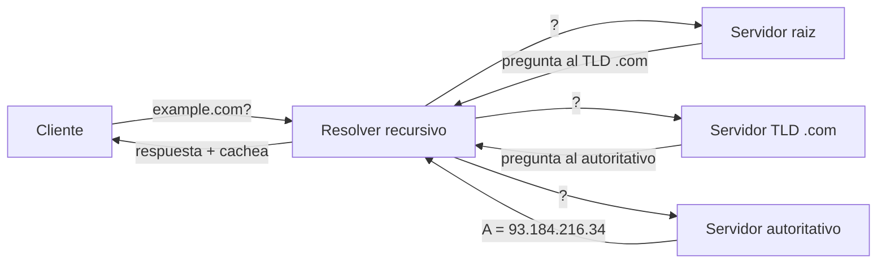
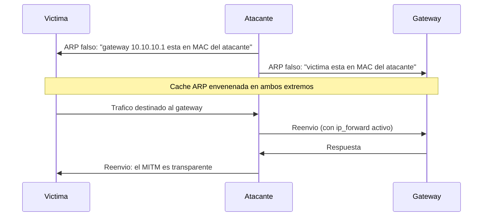

# Clase 012 — DNS, DHCP y ARP: funcionamiento y riesgos

> Parte: **0 — Fundamentos y prerrequisitos** · Fuente: *RFC 1035 (DNS), RFC 2131 (DHCP), RFC 826 (ARP)*
> ⏱️ Duración estimada: **100 min** · Nivel: **Fundamentos**

---

## 🎯 Objetivo

Comprender los tres protocolos de infraestructura que hacen funcionar cualquier red local e Internet: DNS (resolución de nombres), DHCP (asignación automática de direcciones) y ARP (mapeo entre IP y MAC). Los tres comparten un mismo pecado original: se diseñaron para redes confiables, sin autenticación, lo que los convierte en los vectores clásicos de ataque dentro de una red local. Entender cómo funcionan por dentro es entender por qué el man-in-the-middle en LAN sigue siendo tan efectivo décadas después.

## 📚 Resultados de aprendizaje

Al finalizar, el alumno podrá:

1. **Describir** el proceso de resolución DNS jerárquica y sus tipos de registro.
2. **Explicar** el intercambio DHCP (DORA) y por qué su ausencia de autenticación habilita servidores rogue.
3. **Detallar** cómo ARP resuelve una MAC a partir de una IP dentro del segmento local.
4. **Identificar** los ataques ARP spoofing, DNS spoofing y DHCP rogue, y su relación con el MITM.
5. **Observar y detectar** estos ataques en el laboratorio con evidencia.
6. **Seleccionar** defensas reales (DHCP snooping, DAI, DNSSEC) y justificar qué ataque frena cada una.

## 🗺️ Temas

| # | Tema | Por qué importa |
|---|------|-----------------|
| 1 | Resolución DNS | Cómo un nombre se convierte en una IP |
| 2 | Tipos de registro | A, AAAA, CNAME, MX, TXT, NS y su uso |
| 3 | Caché y recursión | Rendimiento y superficie de envenenamiento |
| 4 | DHCP DORA | Discover, Offer, Request, Ack |
| 5 | ARP | El puente entre la capa 3 y la capa 2 |
| 6 | ARP spoofing | La base del MITM en LAN |
| 7 | DNS/DHCP rogue | Redirección y control del tráfico |
| 8 | Defensas | DHCP snooping, DAI, DNSSEC, DoH/DoT |

## 🧠 Explicación en profundidad

### DNS: la agenda telefónica jerárquica de Internet

Cuando escribes `example.com`, tu máquina no sabe dónde está ese servidor; solo sabe hablar con números. DNS es el sistema distribuido y jerárquico que traduce nombres legibles en direcciones IP. La resolución recorre un árbol: tu **resolver** (normalmente el de tu ISP o uno público como 8.8.8.8) pregunta a un servidor **raíz**, que lo remite al servidor autoritativo del **TLD** (`.com`), que a su vez remite al servidor autoritativo del dominio, que finalmente entrega la IP. Para no repetir este viaje cada vez, cada nivel **cachea** las respuestas durante el tiempo que marca el **TTL** del registro. Esa caché es a la vez la clave del rendimiento de Internet y la superficie del ataque más famoso de DNS: el **envenenamiento de caché**, en el que un atacante inyecta una respuesta falsa que el resolver almacena y sirve a muchas víctimas.



Los **tipos de registro** definen qué se pregunta: **A** (IPv4) y **AAAA** (IPv6) son los más consultados; **CNAME** crea un alias de un nombre a otro; **MX** indica el servidor de correo del dominio; **NS** delega la zona a sus servidores autoritativos; y **TXT** guarda texto arbitrario, usado hoy para SPF, DKIM y verificaciones de propiedad. DNS viaja normalmente sobre **UDP/53** por rapidez, y recurre a **TCP/53** para respuestas grandes y transferencias de zona.

### DHCP: cómo una máquina obtiene identidad antes de tenerla

Un equipo que se conecta a una red no tiene IP, ni sabe cuál es su gateway ni su servidor DNS. DHCP resuelve la paradoja de comunicarse sin dirección mediante un intercambio de cuatro mensajes conocido por su acrónimo **DORA**: el cliente emite un **Discover** en broadcast ("¿hay algún servidor DHCP?"), uno o varios servidores responden con una **Offer** (una IP propuesta y parámetros), el cliente elige una y confirma con un **Request**, y el servidor cierra con un **Acknowledge** que concede la concesión (lease). El punto débil está a la vista: el cliente confía en el **primer servidor que responde**, sin comprobar su identidad. Un atacante que levante un servidor DHCP falso (rogue) más rápido que el legítimo puede entregar a las víctimas una configuración maliciosa: su propia IP como gateway y como DNS, convirtiéndose en el hombre en el medio de todo el tráfico saliente.

### ARP: el eslabón olvidado entre IP y el hardware

Dentro de un segmento Ethernet, los paquetes no se entregan por IP sino por **dirección MAC**. Cuando tu máquina quiere enviar algo a `10.10.10.1` y no conoce su MAC, emite una petición **ARP** en broadcast: "¿quién tiene 10.10.10.1? Dímelo a mi MAC". El dueño responde con su MAC y tu equipo la guarda en la **caché ARP**. El problema es de raíz: ARP no tiene estado, ni número de secuencia, ni autenticación. Cualquier máquina del segmento puede enviar una respuesta ARP no solicitada (*gratuitous ARP*), y la víctima la creerá. Eso es el **ARP spoofing**: el atacante anuncia "10.10.10.1 (el gateway) está en MI MAC", y a partir de ese momento todo el tráfico que la víctima cree enviar al gateway pasa por el atacante.



### El hilo común: ausencia de autenticación y sus defensas

Los tres protocolos fallan por la misma razón histórica: nacieron en los años 80 para redes de confianza, donde todos los nodos eran amigos. Añadir seguridad después es siempre más difícil que diseñarla de origen, y por eso las defensas son parches a nivel de infraestructura más que rediseños. Contra el DHCP rogue existe **DHCP snooping**, que configura el switch para aceptar ofertas DHCP solo desde puertos marcados como confiables. Sobre esa base, **Dynamic ARP Inspection (DAI)** valida cada respuesta ARP contra la tabla de concesiones DHCP y descarta las falsificadas. Y contra el envenenamiento DNS, **DNSSEC** firma criptográficamente las respuestas para garantizar su integridad y autenticidad de origen, aunque no las cifra. El cifrado del canal lo aportan **DoH** (DNS sobre HTTPS) y **DoT** (DNS sobre TLS), que protegen la confidencialidad frente a un observador, pero no sustituyen a DNSSEC ni resuelven por sí solos los ataques dentro de la LAN.

## 📖 Definiciones y características

- **DNS**: sistema jerárquico y distribuido que traduce nombres a direcciones IP. Usa UDP/53 para consultas y TCP/53 para respuestas grandes y transferencias; sin DNSSEC, sus respuestas no están autenticadas y pueden falsificarse.
- **Registro A / AAAA**: mapea un nombre a una dirección IPv4 (A) o IPv6 (AAAA). Es el registro más consultado y el objetivo natural de una redirección maliciosa.
- **Registro MX / NS / TXT**: MX indica el servidor de correo del dominio, NS delega la zona a sus servidores autoritativos, y TXT guarda texto usado hoy para SPF, DKIM y verificaciones.
- **DHCP DORA**: secuencia Discover, Offer, Request, Acknowledge que concede una IP. El cliente confía en el primer servidor que responde, lo que abre la puerta a un servidor rogue.
- **ARP**: protocolo que resuelve una IP local a su MAC mediante broadcast. Carece de estado y de autenticación, así que cualquier nodo del segmento puede responder con datos falsos.
- **ARP spoofing**: envío de respuestas ARP falsas para asociar la MAC del atacante a la IP de la víctima o del gateway. Es el habilitador clásico del man-in-the-middle en redes conmutadas.
- **DHCP rogue**: servidor DHCP no autorizado que entrega configuración maliciosa (gateway y DNS controlados por el atacante) para interceptar el tráfico de las víctimas.
- **DNSSEC**: extensión que firma las respuestas DNS para garantizar integridad y autenticidad de origen. Mitiga el envenenamiento de caché, pero no aporta confidencialidad.

## 📔 Glosario

| Término | Definición concisa |
|---------|--------------------|
| DNS | Servicio que traduce nombres de dominio a direcciones IP. |
| Resolver | Servidor recursivo que resuelve consultas en nombre del cliente. |
| Autoritativo | Servidor que posee los datos oficiales de una zona DNS. |
| TTL (DNS) | Tiempo que una respuesta puede permanecer en caché. |
| Registro A | Mapeo de nombre a dirección IPv4. |
| CNAME | Alias que apunta un nombre a otro nombre canónico. |
| DHCP | Protocolo de asignación automática de direcciones y parámetros de red. |
| DORA | Discover, Offer, Request, Acknowledge: el intercambio DHCP. |
| Lease | Concesión temporal de una IP a un cliente DHCP. |
| ARP | Protocolo que asocia una IP local con su dirección MAC. |
| Caché ARP | Tabla local de correspondencias IP-MAC aprendidas. |
| MITM | Man-in-the-middle: atacante interpuesto que intercepta el tráfico. |
| DHCP snooping | Control de switch que solo confía en puertos DHCP autorizados. |
| DAI | Dynamic ARP Inspection: valida respuestas ARP contra concesiones DHCP. |
| DNSSEC | Firma criptográfica de respuestas DNS para garantizar integridad. |
| DoH / DoT | DNS cifrado sobre HTTPS o TLS para proteger la confidencialidad. |

## 🧰 Herramientas y preparación

En Kali dispones de `dig` y `nslookup` para consultar DNS, `arp` e `ip neigh` para inspeccionar la caché ARP, y `dhclient` para renovar concesiones DHCP. Para las prácticas ofensivas de laboratorio usarás **ettercap** o **bettercap** y `arpspoof` (del paquete dsniff), y **Wireshark** para observar cada fase. Necesitas al menos tres nodos en tu red interna aislada: atacante, víctima y gateway o servidor. Antes de empezar, anota las MAC e IP legítimas de cada nodo: sin esa foto inicial no podrás demostrar después que el envenenamiento ocurrió.

## 🧪 Laboratorio guiado

1. **Consultas DNS**. Observa la resolución jerárquica y distintos registros:

   ```bash
   dig A example.com +short
   dig MX example.com
   dig +trace example.com
   ```

2. **Ver la caché ARP** de tu equipo y anotar la MAC legítima del gateway:

   ```bash
   ip neigh show
   ```

3. **Observar DHCP**. Captura mientras renuevas la concesión en la VM e identifica los cuatro mensajes DORA:

   ```bash
   sudo tcpdump -i eth0 -n port 67 or port 68 &
   sudo dhclient -v eth0
   ```

4. **ARP spoofing controlado** (solo laboratorio). Habilita el reenvío y envenena entre víctima y gateway:

   ```bash
   echo 1 | sudo tee /proc/sys/net/ipv4/ip_forward
   sudo arpspoof -i eth0 -t 10.10.10.6 10.10.10.1
   ```

5. **Verifica el MITM**. En la víctima, `ip neigh` mostrará ahora la MAC del atacante asociada a la IP del gateway. Captura su tráfico en Wireshark desde el atacante.
6. **Detección**. En la víctima, observa entradas ARP duplicadas o que cambian de MAC: esa inconsistencia es la firma del ataque.

> ⚠️ **Nota ética**: ARP, DNS y DHCP spoofing se practican **exclusivamente** en tu laboratorio aislado, entre tus propias VMs. Ejecutarlos en una red real ajena constituye interceptación ilegal de comunicaciones.

## ✍️ Ejercicios

1. Explica paso a paso qué ocurre desde que escribes un dominio hasta que recibes su IP, nombrando cada servidor implicado.
2. Da un ejemplo de uso real de cada registro: A, MX, TXT, CNAME y NS.
3. Describe cómo un servidor DHCP rogue puede convertirse en el gateway efectivo de las víctimas.
4. ¿Por qué ARP es tan fácil de falsificar? ¿Qué propiedad de seguridad le falta al protocolo?
5. Investiga DHCP snooping y Dynamic ARP Inspection e indica qué ataque concreto frena cada uno.
6. Explica qué protege DNSSEC y qué **no** protege, y compáralo con lo que aportan DoH/DoT.
7. Propón un método para detectar automáticamente ARP spoofing observando la caché ARP en el tiempo.

## 📝 Reto verificable

Monta en tu laboratorio un ataque de ARP spoofing entre dos VMs y **demuéstralo con evidencia**: captura la tabla ARP de la víctima antes y después del ataque, y muestra en Wireshark tráfico de la víctima pasando por el atacante. Después, describe una defensa que lo habría impedido.

**Criterio de aceptación**: la tabla ARP de la víctima muestra la MAC del atacante asociada a la IP del gateway tras el ataque, y existe una captura que evidencia el tráfico interceptado. La sección de defensa nombra un control real (DAI o ARP estático) y explica por qué habría frustrado el ataque.

## ⚠️ Errores comunes

| Síntoma / mensaje | Causa y cómo arreglar |
|-------------------|-----------------------|
| El ARP spoofing corta la conexión de la víctima | No habilitaste `ip_forward`. Actívalo para reenviar el tráfico y mantener el MITM transparente. |
| `dig` devuelve SERVFAIL | Resolver mal configurado o fallo de validación DNSSEC. Prueba otro servidor con `@8.8.8.8`. |
| La víctima no cae en el spoofing | Tiene ARP estático o DAI activo. Es exactamente la defensa funcionando. |
| No veo los cuatro mensajes DHCP | La concesión aún es válida. Fuérzalo con `dhclient -r` y renueva. |
| DNS spoofing no redirige | La víctima usa DoH/DoT o tiene la respuesta en caché. Considera el cifrado del canal y el TTL. |
| La caché ARP no muestra la MAC esperada | Aún no hubo tráfico hacia esa IP. Genera un ping para poblar la entrada. |

## ❓ Preguntas frecuentes

**❓ ¿Por qué estos protocolos no tienen autenticación?** Se diseñaron en los años 80 para redes confiables. Añadir seguridad después (DNSSEC, DAI) es más difícil que haberla incluido de origen; es una lección de diseño que se repite en toda la historia de las redes.

**❓ ¿DNS over HTTPS (DoH) lo resuelve todo?** Añade confidencialidad e integridad del canal entre cliente y resolver, dificultando el spoofing y la vigilancia, pero no autentica la zona como DNSSEC ni protege por sí solo dentro de la LAN.

**❓ ¿ARP spoofing funciona en redes conmutadas modernas?** Sí, porque explota la ausencia de autenticación del protocolo, no el medio físico. Las mitigaciones son a nivel de switch (DAI) y mediante segmentación de la red.

**❓ ¿Cómo detecto un servidor DHCP rogue?** Monitorizando ofertas DHCP inesperadas en la red y activando DHCP snooping en los switches, que solo confía en los puertos autorizados a servir DHCP.

## 🔗 Referencias

- RFC 1035 (Domain Names — Implementation and Specification) — <https://www.rfc-editor.org/rfc/rfc1035>
- RFC 2131 (Dynamic Host Configuration Protocol) — <https://www.rfc-editor.org/rfc/rfc2131>
- RFC 826 (Address Resolution Protocol) — <https://www.rfc-editor.org/rfc/rfc826>
- RFC 4033 (DNS Security Introduction and Requirements) — <https://www.rfc-editor.org/rfc/rfc4033>
- Cloudflare Learning: What is DNS? — <https://www.cloudflare.com/learning/dns/what-is-dns/>

## 📥 Material descargable

- 📄 [Guía en PDF](./clase-012-guia.pdf) — versión imprimible de esta clase.
- 🎞️ [Presentación (PPTX)](./clase-012-presentacion.pptx) — deck para proyectar en clase.

## ⬅️ Clase anterior

[Clase 011 — Protocolos de red: IP, TCP, UDP e ICMP en profundidad](../011-protocolos-de-red-ip-tcp-udp-e-icmp-en-profundidad/README.md)

## ➡️ Siguiente clase

[Clase 013 — HTTP, HTTPS y la arquitectura de la web moderna](../013-http-https-y-la-arquitectura-de-la-web-moderna/README.md)
