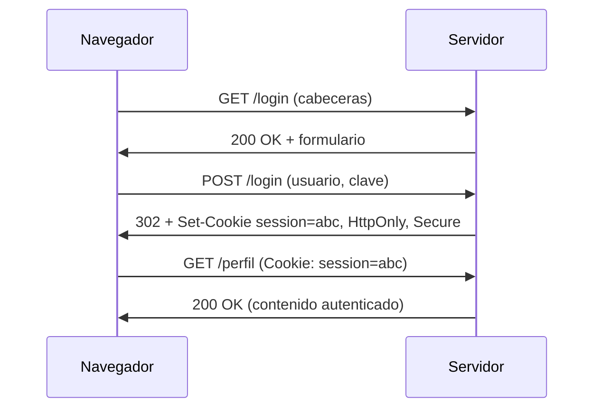

# Clase 013 — HTTP, HTTPS y la arquitectura de la web moderna

> Parte: **0 — Fundamentos y prerrequisitos** · Fuente: *RFC 9110 (HTTP Semantics) / MDN Web Docs*
> ⏱️ Duración estimada: **110 min** · Nivel: **Fundamentos**

---

## 🎯 Objetivo

Dominar el protocolo sobre el que corre la web y, con él, la mayor parte de la superficie de ataque moderna. Al terminar entenderás la anatomía de peticiones y respuestas HTTP, la semántica de métodos y códigos de estado, el papel de las cabeceras, cómo cookies y sesiones simulan estado sobre un protocolo que no lo tiene, y cómo HTTPS y TLS añaden confidencialidad, integridad y autenticación al canal. Este es el idioma que hablan navegadores, APIs y atacantes por igual.

## 📚 Resultados de aprendizaje

Al finalizar, el alumno podrá:

1. **Construir** e interpretar peticiones y respuestas HTTP crudas.
2. **Explicar** la semántica de métodos, códigos de estado y cabeceras relevantes.
3. **Describir** cómo funcionan cookies, sesiones y la autenticación web.
4. **Explicar** qué aporta TLS y cómo se establece una conexión HTTPS.
5. **Analizar** tráfico web con herramientas de interceptación como Burp o ZAP.
6. **Evaluar** la postura de seguridad de un sitio a partir de sus cabeceras.

## 🗺️ Temas

| # | Tema | Por qué importa |
|---|------|-----------------|
| 1 | Modelo petición/respuesta | La base de toda interacción web |
| 2 | Métodos HTTP | GET, POST, PUT, DELETE y su semántica |
| 3 | Códigos de estado | 2xx/3xx/4xx/5xx diagnostican todo |
| 4 | Cabeceras | Control, seguridad y contexto |
| 5 | Cookies y sesiones | Estado sobre un protocolo sin estado |
| 6 | HTTPS/TLS | Confidencialidad, integridad y autenticación |
| 7 | Cabeceras de seguridad | HSTS, CSP y compañía |
| 8 | HTTP/2 y HTTP/3 | La web moderna sobre TCP y QUIC |

## 🧠 Explicación en profundidad

### El modelo petición/respuesta: texto plano con reglas estrictas

HTTP es, en su forma clásica (HTTP/1.1), un protocolo de texto sorprendentemente legible. El cliente abre una conexión TCP y envía una **petición** con tres partes: una línea inicial (método, ruta y versión), un bloque de **cabeceras** (`Host`, `User-Agent`, `Cookie`...) y, opcionalmente, un **cuerpo**. El servidor responde con una **línea de estado** (versión y código), sus propias cabeceras y el cuerpo con el contenido. La propiedad definitoria es que HTTP es **sin estado**: cada petición se procesa de forma independiente, sin memoria de las anteriores. Toda la ilusión de "estar logueado" se construye artificialmente sobre esta base, y ahí reside buena parte de la superficie de ataque web.



### Métodos y códigos: la semántica que define el comportamiento

Los **métodos** son verbos que declaran la intención de la petición. **GET** recupera un recurso y debe ser *seguro* (no modifica estado) e *idempotente* (repetirlo no cambia nada); **POST** envía datos y puede crear o alterar estado; **PUT** reemplaza un recurso completo de forma idempotente; **DELETE** lo elimina. Respetar esta semántica no es cosmético: cachés, proxies y crawlers asumen que un GET es seguro, de modo que exponer una acción destructiva bajo GET es un fallo de diseño con consecuencias reales (un rastreador podría borrar datos al indexar).

Los **códigos de estado** son el primer diagnóstico de cualquier interacción, agrupados por su primer dígito. La siguiente tabla condensa la lógica de cada familia.

| Familia | Significado | Ejemplos representativos |
|---------|-------------|--------------------------|
| 2xx | Éxito | 200 OK, 201 Created, 204 No Content |
| 3xx | Redirección | 301 Moved Permanently, 302 Found, 304 Not Modified |
| 4xx | Error del cliente | 400, 401 (no autenticado), 403 (prohibido), 404, 429 (demasiadas peticiones) |
| 5xx | Error del servidor | 500 Internal Server Error, 502 Bad Gateway, 503 Service Unavailable |

La distinción entre **401** y **403** es una fuente eterna de confusión y merece precisión: 401 significa "no sé quién eres, autentícate", mientras que 403 significa "sé quién eres, pero no tienes permiso". Confundirlas en una API filtra información sobre la existencia de recursos.

### Cookies y sesiones: fabricar memoria sobre un protocolo amnésico

Como HTTP no recuerda nada, el servidor necesita un mecanismo para reconocer al mismo usuario entre peticiones. La solución clásica es la **cookie**: en la respuesta al login, el servidor incluye una cabecera `Set-Cookie` con un identificador de sesión; el navegador la guarda y la reenvía automáticamente en cada petición al mismo dominio. Ese identificador es, en la práctica, la llave de la sesión, y protegerlo es crítico. Tres atributos lo blindan: **`HttpOnly`** impide que JavaScript lo lea (mitiga el robo por XSS), **`Secure`** obliga a enviarlo solo por HTTPS (evita su captura en claro), y **`SameSite`** restringe su envío en peticiones de origen cruzado (mitiga el CSRF). Una cookie de sesión sin estos atributos es una invitación abierta al secuestro de sesión.

### HTTPS y TLS: cifrado, integridad y prueba de identidad

**HTTPS no es un protocolo aparte**: es HTTP transportado sobre **TLS**. TLS envuelve la conexión y aporta tres garantías. **Confidencialidad**: el tráfico va cifrado, así que un observador de la red ve destino y volumen, pero no el contenido. **Integridad**: cualquier manipulación en tránsito se detecta. **Autenticación**: mediante certificados firmados por una autoridad de certificación (CA), el cliente verifica que habla con el servidor legítimo y no con un impostor. El establecimiento de la conexión (handshake TLS) negocia la versión del protocolo y el conjunto de cifrado, valida el certificado del servidor y deriva las claves de sesión. Es esencial tener claro el límite: **TLS protege el canal, no la aplicación**. Una web con HTTPS impecable puede seguir siendo vulnerable a inyección SQL, XSS o fallos de lógica de negocio; el candado del navegador certifica el transporte, no la calidad del código.

### Endurecer la web: cabeceras de seguridad y la evolución del protocolo

Sobre HTTPS se apilan **cabeceras de seguridad** que instruyen al navegador para reducir riesgos. **HSTS** (`Strict-Transport-Security`) fuerza al navegador a usar siempre HTTPS con ese dominio, cerrando la ventana del downgrade a HTTP. **CSP** (`Content-Security-Policy`) declara de qué orígenes puede cargarse script, estilo o imagen, siendo una de las defensas más potentes contra XSS. Otras como `X-Content-Type-Options`, `X-Frame-Options` o `Referrer-Policy` cierran vectores concretos. En paralelo, el protocolo ha evolucionado sin cambiar su semántica: **HTTP/2** multiplexa muchas peticiones en una sola conexión TCP para eliminar el bloqueo en cabeza de línea, y **HTTP/3** corre sobre **QUIC** (sobre UDP) reduciendo la latencia de establecimiento y sobreviviendo mejor a los cambios de red. Los métodos y códigos que aprendes aquí siguen siendo idénticos en las tres versiones.

## 📖 Definiciones y características

- **HTTP**: protocolo de aplicación sin estado que corre sobre TCP (o sobre QUIC en HTTP/3). Cada petición es independiente; el estado se añade artificialmente con cookies y tokens.
- **Método HTTP**: verbo que declara la intención (GET lee, POST envía, PUT reemplaza, DELETE borra). GET debe ser seguro e idempotente, y violar esa semántica genera fallos reales de caché y crawling.
- **Código de estado**: número de tres dígitos que resume el resultado de la petición, agrupado en familias 2xx/3xx/4xx/5xx. Es el primer diagnóstico de cualquier fallo web.
- **Cookie**: dato que el servidor pide al navegador almacenar y reenviar. Sus atributos `HttpOnly`, `Secure` y `SameSite` determinan su resistencia a XSS, captura en claro y CSRF.
- **Sesión**: mecanismo por el que el servidor asocia peticiones al mismo usuario, normalmente mediante un identificador guardado en cookie. Es el objetivo del secuestro de sesión.
- **TLS**: protocolo que cifra y autentica el canal mediante certificados. Aporta confidencialidad, integridad y autenticación, pero no protege contra fallos de la aplicación.
- **HSTS**: cabecera que obliga al navegador a usar HTTPS con un dominio, mitigando los ataques de downgrade a HTTP.
- **CSP**: cabecera que restringe los orígenes desde los que se cargan recursos, siendo una defensa de primera línea contra XSS.

## 📔 Glosario

| Término | Definición concisa |
|---------|--------------------|
| HTTP | Protocolo de aplicación sin estado para transferir recursos web. |
| HTTPS | HTTP transportado sobre TLS: canal cifrado y autenticado. |
| TLS | Protocolo que cifra, autentica y protege la integridad del canal. |
| Método | Verbo HTTP que declara la acción sobre un recurso. |
| Idempotente | Operación que repetida produce el mismo efecto que una sola vez. |
| Código de estado | Número que resume el resultado de una respuesta HTTP. |
| Cabecera | Par clave-valor con metadatos de una petición o respuesta. |
| Cookie | Dato guardado por el navegador y reenviado al servidor. |
| Sesión | Asociación de peticiones al mismo usuario autenticado. |
| HttpOnly | Atributo que impide a JavaScript leer una cookie. |
| SameSite | Atributo que limita el envío de cookies entre orígenes. |
| Certificado | Documento firmado por una CA que prueba la identidad del servidor. |
| CA | Autoridad de certificación que firma certificados de confianza. |
| HSTS | Cabecera que fuerza el uso de HTTPS en un dominio. |
| CSP | Cabecera que restringe orígenes de recursos para mitigar XSS. |
| QUIC | Transporte sobre UDP que sustenta HTTP/3 y reduce latencia. |

## 🧰 Herramientas y preparación

Usa `curl` para lanzar peticiones crudas y leer cabeceras, el navegador con sus **DevTools** (pestaña Network) para inspeccionar tráfico real, y un proxy de interceptación como **Burp Suite Community** o **OWASP ZAP** para capturar, modificar y reenviar peticiones. Para examinar TLS, `openssl s_client` muestra el certificado y la negociación. Practica siempre contra una aplicación de laboratorio (DVWA o un servidor propio), nunca contra sitios ajenos sin permiso. Antes de interceptar HTTPS con Burp o ZAP, instala su certificado CA en el navegador; sin ese paso, el navegador rechazará el tráfico interceptado.

## 🧪 Laboratorio guiado

1. **Petición cruda con curl**. Observa la línea de estado, las cabeceras y el cuerpo:

   ```bash
   curl -v http://10.10.10.6/ 2>&1 | head -40
   ```

2. **Métodos y estados**. Prueba distintos métodos y observa solo el código de estado:

   ```bash
   curl -s -o /dev/null -w "%{http_code}\n" -X POST http://10.10.10.6/login
   ```

3. **Inspeccionar cookies**. Haz login en la app de laboratorio con las DevTools abiertas y revisa la cookie de sesión: ¿tiene `HttpOnly`, `Secure` y `SameSite`?
4. **Interceptar con Burp o ZAP**. Configura el navegador para pasar por el proxy, captura una petición, modifícala y reenvíala (Repeater) para observar el efecto en el servidor.
5. **Examinar TLS**. Lee el emisor y la validez del certificado:

   ```bash
   openssl s_client -connect example.com:443 -servername example.com </dev/null 2>/dev/null | openssl x509 -noout -subject -issuer -dates
   ```

6. **Cabeceras de seguridad**. Comprueba si un sitio envía HSTS o CSP:

   ```bash
   curl -sI https://example.com | grep -iE 'strict-transport|content-security'
   ```

> ⚠️ **Nota ética**: la interceptación y manipulación de tráfico web se realiza **solo** contra aplicaciones propias o con autorización explícita. Usar un proxy contra sitios de terceros sin permiso es ilegal.

## ✍️ Ejercicios

1. Clasifica estos códigos e indica qué significa cada uno: 204, 301, 401, 403, 429, 502.
2. Explica con un ejemplo la diferencia práctica entre 401 y 403 en una API.
3. ¿Qué atributos hacen segura una cookie de sesión y contra qué ataque protege cada uno?
4. Describe qué información revela y qué oculta TLS a un observador de la red.
5. Investiga la cabecera `Content-Security-Policy` y escribe un ejemplo que mitigue XSS.
6. Con Burp o ZAP Repeater, cambia un parámetro de una petición y documenta cómo responde la app.
7. Explica por qué HTTPS es necesario pero no suficiente para la seguridad de una aplicación.

## 📝 Reto verificable

Usando un proxy de interceptación, captura el flujo completo de autenticación de una app de laboratorio: la petición de login, la respuesta que establece la cookie de sesión y una petición autenticada posterior. Documenta las cabeceras de seguridad presentes y ausentes, y propón mejoras concretas.

**Criterio de aceptación**: la evidencia muestra la cookie de sesión con sus atributos reales, e identificas correctamente al menos dos cabeceras de seguridad faltantes (por ejemplo HSTS, CSP o `SameSite`) con una recomendación concreta para cada una. El procedimiento es reproducible contra la misma app.

## ⚠️ Errores comunes

| Síntoma / mensaje | Causa y cómo arreglar |
|-------------------|-----------------------|
| Burp no intercepta HTTPS | Falta instalar el certificado CA de Burp en el navegador. Impórtalo y confía en él. |
| `curl` da error de certificado | Certificado autofirmado en el laboratorio. Usa `-k` **solo** en laboratorio, nunca en producción. |
| La cookie no se envía en las peticiones | Atributo `SameSite`/`Secure` o dominio/ruta incorrectos. Revisa el scope de la cookie. |
| 405 Method Not Allowed | El recurso no admite ese método. Comprueba la definición de la API. |
| HTTP/2 no aparece en la captura | Se negocia por ALPN dentro de TLS. Usa herramientas que soporten HTTP/2. |
| El login funciona pero se pierde la sesión | La cookie no se guarda o se bloquea por `SameSite`. Revisa dominio, ruta y atributos. |

## ❓ Preguntas frecuentes

**❓ ¿HTTPS hace segura mi aplicación?** No: cifra y autentica el canal, pero no protege contra fallos de la aplicación (inyección, XSS, lógica de negocio). Es necesario pero no suficiente.

**❓ ¿Por qué HTTP es "sin estado" si existen las sesiones?** El protocolo no recuerda peticiones anteriores; las cookies y los tokens simulan estado guardándolo en el cliente o en el servidor y reenviándolo en cada petición.

**❓ ¿Qué cambia con HTTP/2 y HTTP/3?** HTTP/2 multiplexa varias peticiones en una conexión TCP; HTTP/3 corre sobre QUIC (UDP) reduciendo latencia y resistiendo cambios de red. La semántica (métodos, estados, cabeceras) se mantiene idéntica.

**❓ ¿Burp o ZAP?** Ambos interceptan y modifican tráfico. Burp es el estándar profesional con una edición Community limitada; ZAP es open source y completamente gratuito. Para aprender, cualquiera de los dos sirve.

## 🔗 Referencias

- RFC 9110, *HTTP Semantics* — <https://www.rfc-editor.org/rfc/rfc9110>
- RFC 6265, *HTTP State Management Mechanism (Cookies)* — <https://www.rfc-editor.org/rfc/rfc6265>
- MDN Web Docs: HTTP — <https://developer.mozilla.org/docs/Web/HTTP>
- OWASP Secure Headers Project — <https://owasp.org/www-project-secure-headers/>
- PortSwigger Web Security Academy — <https://portswigger.net/web-security>

## 📥 Material descargable

- 📄 [Guía en PDF](./clase-013-guia.pdf) — versión imprimible de esta clase.
- 🎞️ [Presentación (PPTX)](./clase-013-presentacion.pptx) — deck para proyectar en clase.

## ⬅️ Clase anterior

[Clase 012 — DNS, DHCP y ARP: funcionamiento y riesgos](../012-dns-dhcp-y-arp-funcionamiento-y-riesgos/README.md)

## ➡️ Siguiente clase

[Clase 014 — Direccionamiento IP y subnetting](../014-direccionamiento-ip-y-subnetting/README.md)
