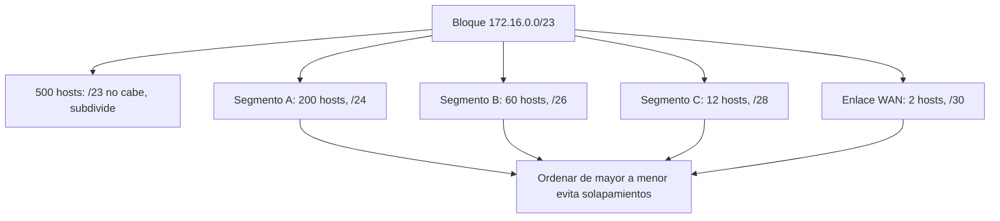

# Clase 014 — Direccionamiento IP y subnetting

> Parte: **0 — Fundamentos y prerrequisitos** · Fuente: *RFC 4632 (CIDR) y W. R. Stevens, TCP/IP Illustrated*
> ⏱️ Duración estimada: **100 min** · Nivel: **Fundamentos**

---

## 🎯 Objetivo

Calcular subredes con soltura, una destreza que necesitarás constantemente para definir el alcance de un escaneo, segmentar una red defensivamente o interpretar el rango de un objetivo. Al terminar sabrás moverte con fluidez entre notación decimal, binaria y CIDR, calcular direcciones de red, broadcast, primer y último host y número de direcciones utilizables, y dividir una red en subredes de tamaño fijo o variable. El subnetting no es aritmética por gusto: equivocarse de máscara deja objetivos fuera del alcance o, peor, incluye redes que no debías tocar.

## 📚 Resultados de aprendizaje

Al finalizar, el alumno podrá:

1. **Convertir** direcciones IP entre notación decimal y binaria con precisión.
2. **Interpretar** máscaras de red y notación CIDR y traducir entre ambas.
3. **Calcular** dirección de red, broadcast, primer y último host y número de hosts.
4. **Dividir** una red en subredes de tamaño fijo (subnetting) y variable (VLSM).
5. **Reconocer** rangos privados, especiales y reservados y su relevancia en seguridad.
6. **Diseñar** un plan de direccionamiento sin solapamientos que optimice el espacio.

## 🗺️ Temas

| # | Tema | Por qué importa |
|---|------|-----------------|
| 1 | IPv4 y binario | Todo el cálculo vive en bits |
| 2 | Máscara de red | Separa la porción de red de la de host |
| 3 | Notación CIDR | `/24` es el lenguaje del día a día |
| 4 | Red y broadcast | Direcciones no asignables a hosts |
| 5 | Cálculo de hosts | `2^n − 2` direcciones utilizables |
| 6 | Subnetting | Partir una red en subredes iguales |
| 7 | VLSM | Subredes de tamaño variable sin desperdicio |
| 8 | Rangos especiales | Privados, loopback, APIPA e IPv6 básico |

## 🧠 Explicación en profundidad

### El bit manda: por qué el binario no es opcional

Una dirección IPv4 son 32 bits que solemos escribir en cuatro octetos decimales (`192.168.10.5`), pero todo el cálculo de subredes ocurre en binario. Cada octeto representa 8 bits, con valores de posición 128, 64, 32, 16, 8, 4, 2 y 1. Aprender a convertir `192` en `11000000` o `255` en `11111111` de memoria acelera enormemente el trabajo. La razón de fondo es que la frontera entre "qué parte de la dirección identifica la red" y "qué parte identifica al host" cae en algún punto de esos 32 bits, y solo viéndolo en binario esa frontera se hace visible.

### La máscara y CIDR: dónde cae la frontera red/host

La **máscara de red** es un patrón de 32 bits donde los bits a `1` marcan la porción de red y los bits a `0` la porción de host. La notación **CIDR** (Classless Inter-Domain Routing) resume la máscara contando cuántos bits a `1` tiene: `/24` significa 24 bits de red, equivalente a `255.255.255.0`. CIDR sustituyó al viejo sistema de clases A/B/C precisamente porque permite prefijos arbitrarios (`/26`, `/30`, `/23`) y la agregación de rutas, haciendo un uso mucho más eficiente del espacio de direcciones. Cuando ves `10.10.10.0/24`, estás leyendo "los primeros 24 bits son fijos (la red) y los 8 restantes varían (los hosts)".

```text
                red (26 bits)                    host (6 bits)
          |--------------------------------|   |-----------|
IP        11000000 . 10101000 . 00001010 . 00 000101    192.168.10.5
Mascara   11111111 . 11111111 . 11111111 . 11 000000    255.255.255.192  (/26)
Red       11000000 . 10101000 . 00001010 . 00 000000    192.168.10.0     <- host todo a 0
1er host  11000000 . 10101000 . 00001010 . 00 000001    192.168.10.1
Ult. host 11000000 . 10101000 . 00001010 . 00 111110    192.168.10.62
Broadcast 11000000 . 10101000 . 00001010 . 00 111111    192.168.10.63    <- host todo a 1
```

El prefijo `/26` marca dónde cae la frontera: los 26 bits de la izquierda son
inmutables dentro de la subred y los 6 de la derecha son el espacio de hosts. De ahí
salen las cuatro cifras que se calculan siempre: 2⁶ = 64 direcciones totales, 62
utilizables (se restan red y broadcast), primer host = red + 1 y último host =
broadcast − 1.

### Red, broadcast y el cálculo de hosts

Dentro de cada bloque hay dos direcciones que no puedes asignar a una máquina. La **dirección de red** es la primera del bloque, con todos los bits de host a `0`; identifica al segmento en sí. La **dirección de broadcast** es la última, con todos los bits de host a `1`; enviar a ella alcanza a todos los hosts del segmento. Por eso el número de direcciones **utilizables** es `2^(bits de host) − 2`: restas red y broadcast. En un `/24` hay 8 bits de host, luego `2^8 − 2 = 254` hosts utilizables. La única excepción moderna importante es el `/31`, definido en el RFC 3021 para enlaces punto a punto, donde por convención se aprovechan las dos direcciones porque solo hay dos extremos y el broadcast no aporta nada.

La siguiente tabla es la que memorizarás con la práctica; relaciona prefijo, máscara y hosts.

| CIDR | Máscara | Bits de host | Hosts utilizables |
|------|---------|--------------|-------------------|
| /24 | 255.255.255.0 | 8 | 254 |
| /25 | 255.255.255.128 | 7 | 126 |
| /26 | 255.255.255.192 | 6 | 62 |
| /27 | 255.255.255.224 | 5 | 30 |
| /28 | 255.255.255.240 | 4 | 14 |
| /30 | 255.255.255.252 | 2 | 2 |

### Subnetting y VLSM: partir una red sin desperdiciar

**Subnetting** es tomar prestados bits de la porción de host para crear varias subredes más pequeñas. Dividir un `/24` en cuatro subredes iguales significa tomar 2 bits (porque `2^2 = 4`), convirtiéndolo en cuatro `/26` de 62 hosts cada uno. Este enfoque de tamaño fijo es simple, pero desperdicia direcciones cuando los segmentos tienen necesidades muy distintas: asignar un `/26` (62 hosts) a un enlace de solo 2 máquinas malgasta 60 direcciones. La respuesta es **VLSM** (Variable Length Subnet Masking): asignar a cada segmento la máscara mínima que satisface su número de hosts. La regla práctica es ordenar los segmentos de mayor a menor y asignarlos en ese orden, empezando por el más grande, para que las fronteras encajen sin solaparse.



### Rangos especiales: leer una IP como una pista

No todas las direcciones son iguales, y reconocer un rango de un vistazo es información operativa. Los **rangos privados** del RFC 1918 (`10.0.0.0/8`, `172.16.0.0/12`, `192.168.0.0/16`) no son enrutables en Internet y pueblan LANs y laboratorios. La **loopback** `127.0.0.0/8` (típicamente `127.0.0.1`) apunta a la propia máquina. El rango **APIPA** `169.254.0.0/16` se autoasigna cuando falla DHCP: verlo suele delatar un problema de red, lo que lo convierte en una señal diagnóstica útil. Todo lo demás es, en general, espacio público enrutable. En IPv6 los conceptos se trasladan: se sigue razonando con prefijos (`/64` es el tamaño estándar de subred), aunque el cálculo de hosts cambia radicalmente por la magnitud del espacio de direcciones.

## 📖 Definiciones y características

- **Máscara de red**: patrón de 32 bits que separa la porción de red (bits a 1) de la de host (bits a 0). `/24` equivale a `255.255.255.0`, es decir 24 bits de red.
- **CIDR**: notación `IP/prefijo` que reemplazó las clases A/B/C. Permite prefijos arbitrarios y la agregación de rutas, optimizando el uso del espacio de direcciones.
- **Dirección de red**: primera dirección del bloque, con todos los bits de host a 0. Identifica el segmento y no se asigna a ningún host.
- **Dirección de broadcast**: última dirección del bloque, con todos los bits de host a 1. Alcanza a todos los hosts del segmento y tampoco es asignable.
- **Hosts utilizables**: número de direcciones asignables, igual a `2^(bits de host) − 2`, porque se restan red y broadcast (salvo en /31 y /32).
- **Subnetting**: proceso de dividir una red tomando bits de host para crear subredes iguales, a costa de flexibilidad.
- **VLSM**: Variable Length Subnet Masking; asigna a cada segmento la máscara mínima que cubre sus hosts, evitando el desperdicio del tamaño fijo.
- **Rangos privados (RFC 1918)**: `10/8`, `172.16/12` y `192.168/16`; no enrutables en Internet y típicos de LANs y laboratorios.

## 📔 Glosario

| Término | Definición concisa |
|---------|--------------------|
| IPv4 | Dirección de 32 bits escrita en cuatro octetos decimales. |
| Octeto | Grupo de 8 bits; cada uno de los cuatro números de una IPv4. |
| Máscara | Patrón que distingue los bits de red de los de host. |
| CIDR | Notación IP/prefijo que indica cuántos bits son de red. |
| Prefijo | Número de bits de red en notación CIDR (por ejemplo /26). |
| Dirección de red | Primera dirección del bloque; identifica el segmento. |
| Broadcast | Última dirección del bloque; alcanza a todos los hosts. |
| Host utilizable | Dirección asignable a una máquina dentro del rango. |
| Subred | Porción de una red mayor delimitada por una máscara. |
| Subnetting | División de una red en subredes iguales. |
| VLSM | Subredes de longitud variable ajustadas a cada segmento. |
| RFC 1918 | Rangos privados no enrutables en Internet. |
| Loopback | 127.0.0.0/8; se refiere a la propia máquina. |
| APIPA | 169.254.0.0/16; autoasignación cuando falla DHCP. |
| Segmentación | Separar una red en subredes para limitar el alcance de un ataque. |

## 🧰 Herramientas y preparación

Al principio, bastan papel y lápiz: el objetivo es entender el cálculo, no automatizarlo. Para **verificar** tus resultados usa `ipcalc` (Linux), `sipcalc` o la calculadora del sistema en modo programador. En Kali:

```bash
sudo apt install ipcalc sipcalc
```

Evita apoyarte en calculadoras online mientras aprendes: durante un pentest necesitarás razonar rangos al vuelo, sin conexión, y detectar cuándo una herramienta te da un resultado incoherente. La calculadora es para comprobar, no para pensar por ti.

## 🧪 Laboratorio guiado

1. **Decimal a binario**. Convierte a mano `192.168.10.0` y `255.255.255.192` a binario, y luego verifica:

   ```bash
   ipcalc 192.168.10.0/26
   ```

2. **Analiza un bloque /24**. Para `10.10.10.0/24` determina a mano: máscara, dirección de red, broadcast, primer y último host y número de hosts.
3. **Subnetear en tamaño fijo**. Divide `192.168.1.0/24` en 4 subredes iguales (`/26`). Escribe para cada una red, rango de hosts y broadcast.
4. **Verifica con la herramienta**:

   ```bash
   ipcalc 192.168.1.0/24 -s 62 62 62 62
   sipcalc 192.168.1.0/26
   ```

5. **VLSM**. Dado `172.16.0.0/16`, diseña subredes para 500, 100 y 25 hosts y un enlace punto a punto (2 hosts). Elige la máscara mínima adecuada para cada una y ordénalas de mayor a menor.
6. **Rangos especiales**. Clasifica `127.0.0.1`, `169.254.5.5`, `10.0.0.1` y `8.8.8.8` indicando cuáles son públicos, privados, loopback o APIPA.

## ✍️ Ejercicios

1. ¿Cuántos hosts utilizables tiene un `/22`? ¿Y un `/30`?
2. Para `10.20.30.45/27`, calcula la dirección de red y la de broadcast.
3. Divide `192.168.100.0/24` en 8 subredes y da la 3ª subred completa (red, rango y broadcast).
4. Diseña con VLSM un plan para tres departamentos de 60, 30 y 10 hosts partiendo de un `/24`.
5. Explica por qué un `/31` puede usarse en enlaces punto a punto pese a la regla `−2`.
6. Determina si `192.168.5.130` y `192.168.5.200` están en la misma subred `/26`.
7. Justifica con un ejemplo por qué equivocarse de máscara altera el alcance de un escaneo.

## 📝 Reto verificable

Diseña un plan de direccionamiento para una organización ficticia con cuatro segmentos de distinto tamaño (por ejemplo 200, 60 y 12 hosts y un enlace WAN de 2) partiendo de un único bloque `/23`, usando VLSM para no desperdiciar direcciones. Entrega una tabla con red, máscara, rango de hosts y broadcast de cada segmento.

**Criterio de aceptación**: las subredes no se solapan, cada una tiene la máscara mínima que satisface su número de hosts, y la suma cabe dentro del `/23` asignado. El plan es verificable con `ipcalc` o `sipcalc` sobre cada subred de la tabla.

## ⚠️ Errores comunes

| Síntoma / mensaje | Causa y cómo arreglar |
|-------------------|-----------------------|
| Olvidar restar red y broadcast | Los hosts utilizables son `2^n − 2`, no `2^n`. Réstalos siempre. |
| Subredes solapadas en VLSM | Asignaste sin ordenar por tamaño. Empieza por la subred más grande. |
| Confundir `/24` con `255.255.0.0` | `/24` es `255.255.255.0`. Cuenta los bits a 1 de la máscara. |
| Poner un host en la dirección de red o broadcast | No son asignables (salvo /31 y /32). Usa el rango intermedio. |
| Mezclar bits de red al subnetear | Trabaja en binario para ver con claridad la frontera red/host. |
| El plan VLSM no cabe en el bloque | Sumaste subredes con máscaras demasiado holgadas. Ajusta cada una a su mínimo. |

## ❓ Preguntas frecuentes

**❓ ¿Por qué importa el subnetting en seguridad?** Define el alcance: un `/24` son 254 hosts a escanear, y equivocarse de máscara deja objetivos fuera o incluye redes que no debías tocar. Además es la base de la segmentación defensiva que limita el movimiento lateral de un atacante.

**❓ ¿Sigo necesitando esto con IPv6?** Sí: IPv6 usa prefijos igual (por ejemplo `/64`), aunque el cálculo de hosts cambia por la magnitud del espacio. Los conceptos de red y prefijo se trasladan directamente.

**❓ ¿Puedo usar siempre una calculadora?** Para trabajar, sí; pero entender el cálculo te permite razonar rangos al vuelo durante un pentest y detectar cuándo la herramienta se equivoca o la usas mal.

**❓ ¿Qué es APIPA (169.254.x.x)?** Direcciones que un host se autoasigna cuando no consigue respuesta de DHCP. Verlas suele indicar un problema de red, por lo que sirven como señal diagnóstica.

## 🔗 Referencias

- RFC 4632 (Classless Inter-Domain Routing) — <https://www.rfc-editor.org/rfc/rfc4632>
- RFC 1918 (Address Allocation for Private Internets) — <https://www.rfc-editor.org/rfc/rfc1918>
- RFC 3021 (Using 31-Bit Prefixes on IPv4 Point-to-Point Links) — <https://www.rfc-editor.org/rfc/rfc3021>
- `man 1 ipcalc`, `man 1 sipcalc`
- Cisco: IP Addressing and Subnetting for New Users — <https://www.cisco.com/c/en/us/support/docs/ip/routing-information-protocol-rip/13788-3.html>

## 📥 Material descargable

- 📄 [Guía en PDF](./clase-014-guia.pdf) — versión imprimible de esta clase.
- 🎞️ [Presentación (PPTX)](./clase-014-presentacion.pptx) — deck para proyectar en clase.

## ⬅️ Clase anterior

[Clase 013 — HTTP, HTTPS y la arquitectura de la web moderna](../013-http-https-y-la-arquitectura-de-la-web-moderna/README.md)

## ➡️ Siguiente clase

[Clase 015 — Python para seguridad: fundamentos del lenguaje](../015-python-para-seguridad-fundamentos-del-lenguaje/README.md)
