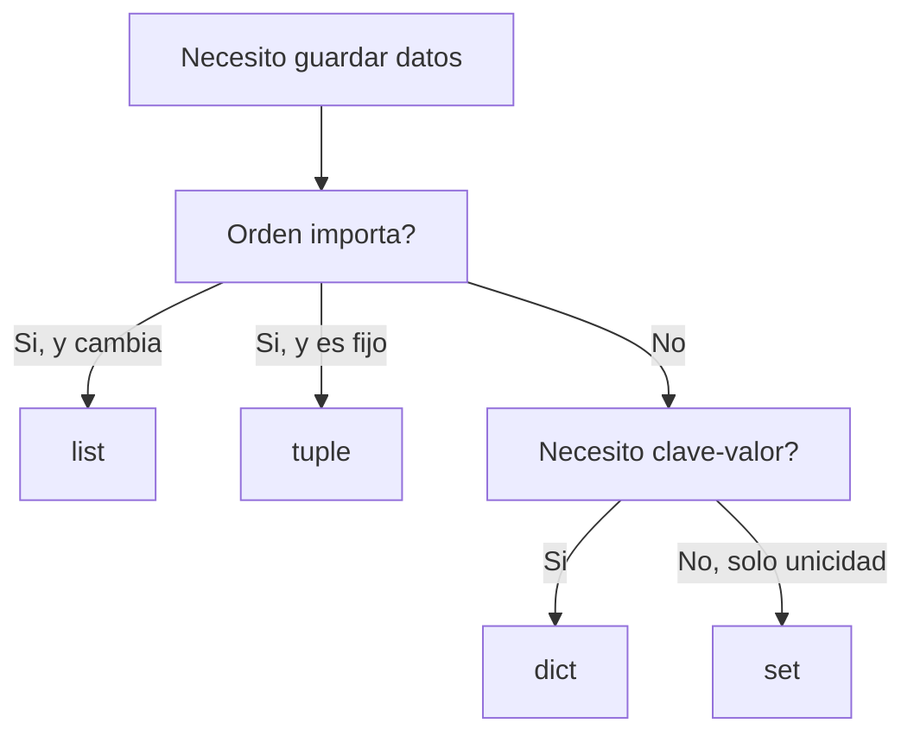

# Clase 015 — Python para seguridad: fundamentos del lenguaje

> Parte: **0 — Fundamentos y prerrequisitos** · Fuente: *Seitz & Arnold, Black Hat Python (2ª ed.)*
> ⏱️ Duración estimada: **120 min** · Nivel: **Fundamentos**

---

## 🎯 Objetivo

Adquirir la base de Python necesaria para escribir herramientas de seguridad: tipos y estructuras de datos, control de flujo, funciones y módulos, manejo de archivos y gestión de errores con excepciones. Python es el lenguaje franco de la ciberseguridad, tanto ofensiva como defensiva, porque combina una sintaxis legible con una librería estándar enorme y un ecosistema de librerías (requests, scapy, pwntools) inigualable. Esta clase asienta lo que usarás en las siguientes sobre sockets, Scapy y automatización.

## 📚 Resultados de aprendizaje

Al finalizar, el alumno podrá:

1. **Manejar** tipos, listas, diccionarios, conjuntos y comprensiones con soltura.
2. **Escribir** control de flujo, funciones reutilizables y módulos organizados.
3. **Leer y escribir** archivos y procesar su contenido de forma eficiente.
4. **Gestionar** errores con excepciones y apoyarse en la librería estándar.
5. **Crear** un script CLI de utilidad para seguridad con `argparse`.
6. **Distinguir** `str` de `bytes` y convertir entre ambos sin errores.

## 🗺️ Temas

| # | Tema | Por qué importa |
|---|------|-----------------|
| 1 | Tipos y variables | str, int, bytes, bool y sus conversiones |
| 2 | Estructuras de datos | list, dict, set, tuple |
| 3 | Control de flujo | if, for, while y comprensiones |
| 4 | Funciones y módulos | Reutilización y organización del código |
| 5 | Archivos | Leer logs y escribir informes |
| 6 | Excepciones | Robustez ante fallos de E/S y red |
| 7 | Librería estándar | os, sys, subprocess, argparse, hashlib |
| 8 | Entornos virtuales | Aislar dependencias con venv y pip |

## 🧠 Explicación en profundidad

### Tipos y el abismo entre str y bytes

Python distingue tajantemente entre `str` (texto Unicode) y `bytes` (datos binarios crudos), y esa distinción es la fuente número uno de errores al programar herramientas de red. Una `str` es una secuencia de caracteres pensada para humanos; unos `bytes` son una secuencia de octetos, que es lo que realmente viaja por un socket o alimenta una función criptográfica. El puente entre ambos son `.encode()` (de texto a bytes, eligiendo una codificación como UTF-8) y `.decode()` (de bytes a texto). Confundirlos produce el clásico `TypeError: a bytes-like object is required`, y por eso conviene interiorizar desde el primer día que **la red y la cripto hablan bytes, no texto**. Los demás tipos básicos (`int`, `bool`, `float`) se comportan como esperas, con la comodidad de que Python maneja enteros de precisión arbitraria, útil en criptografía.

### Estructuras de datos: elegir la correcta cambia todo

Python ofrece cuatro colecciones fundamentales, cada una con una vocación distinta. La **lista** (`list`) es una secuencia ordenada y mutable, ideal para acumular resultados. El **diccionario** (`dict`) es un mapa de clave a valor, la herramienta perfecta para estructurar datos de seguridad: `ip -> lista_de_puertos`, `hash -> nombre_de_archivo`, `usuario -> shell`. El **conjunto** (`set`) guarda elementos únicos sin orden y responde a la pertenencia en tiempo constante, perfecto para deduplicar IPs o comprobar si un puerto ya se vio. La **tupla** (`tuple`) es una secuencia inmutable, útil para datos que no deben cambiar, como una pareja `(ip, puerto)`. Elegir la estructura adecuada no es un detalle estético: usar un `set` en vez de recorrer una lista puede convertir un script lento en uno instantáneo.



### Control de flujo y comprensiones: expresividad densa

El control de flujo de Python (`if`, `for`, `while`) es directo, pero su rasgo más característico son las **comprensiones**, que transforman y filtran una colección en una sola línea legible: `[f(x) for x in it if cond]` construye una lista aplicando `f` a cada elemento que cumple `cond`. Existen variantes para diccionarios (`{k: v for ...}`) y conjuntos. Bien usadas, sustituyen bucles verbosos por una expresión clara; mal usadas (anidadas hasta lo ilegible) se vuelven contraproducentes. La regla es: si una comprensión ya no se lee de un vistazo, vuelve al bucle explícito. En seguridad las verás constantemente para filtrar IPs privadas, extraer códigos de estado de un log o normalizar una lista de puertos.

### Funciones, excepciones y la stdlib: robustez de herramienta real

Una función encapsula lógica reutilizable y da nombre a una idea; agrupar funciones relacionadas en un **módulo** (un archivo `.py`) organiza el proyecto. Pero lo que separa un script de juguete de una herramienta usable es el manejo de **excepciones**. Una herramienta de red se topa constantemente con fallos: un archivo que no existe, un permiso denegado, una conexión que se cae, una entrada malformada. Envolver las operaciones frágiles en `try/except` (capturando excepciones concretas como `FileNotFoundError`, no un `except:` genérico que oculta bugs) hace que el programa falle con gracia en lugar de reventar con un rastreo ininteligible. Sobre esa base, la **librería estándar** aporta piezas listas para usar: `os` y `sys` para interactuar con el sistema, `subprocess` para invocar herramientas externas (nmap y compañía), `argparse` para construir una CLI con ayuda y validación automáticas, y `hashlib` para calcular hashes como SHA-256. La tabla siguiente resume los módulos que más usarás.

| Módulo | Para qué sirve en seguridad |
|--------|------------------------------|
| `os` / `sys` | Rutas, variables de entorno, argumentos y salida del proceso |
| `subprocess` | Ejecutar herramientas externas y capturar su salida |
| `argparse` | Definir una CLI con `--help`, argumentos y validación |
| `hashlib` | Calcular SHA-256 y otros hashes de archivos o datos |
| `collections` | `Counter` para contar frecuencias (IPs, códigos, eventos) |
| `socket` | Comunicación de red de bajo nivel (clases posteriores) |

### venv: aislar para no romper el sistema

Muchas herramientas del propio sistema operativo dependen de su Python, así que instalar librerías con `pip` de forma global puede romperlas. La solución es el **entorno virtual** (`venv`): una copia aislada de Python por proyecto, con sus propias dependencias. Crear `python3 -m venv venv`, activarlo y luego instalar con `pip` mantiene cada proyecto autocontenido, reproducible y sin efectos colaterales sobre el sistema. Es una práctica que ahorra horas de depuración y que se espera en cualquier proyecto serio.

## 📖 Definiciones y características

- **str vs. bytes**: `str` es texto Unicode para humanos; `bytes` son octetos crudos que viajan por la red y alimentan la cripto. Se convierten con `.encode()` y `.decode()`, y confundirlos es el error más frecuente en herramientas de red.
- **Diccionario (dict)**: mapa de clave a valor con acceso en tiempo constante. Es la estructura base para indexar y estructurar resultados de seguridad, como `ip -> puertos`.
- **Conjunto (set)**: colección de elementos únicos sin orden, con pertenencia en tiempo constante. Ideal para deduplicar y comprobar existencia rápidamente.
- **Comprensión de listas**: expresión `[f(x) for x in it if cond]` que transforma y filtra en una línea. Sustituye bucles verbosos cuando sigue siendo legible.
- **Excepción**: mecanismo de control de errores con `try/except`. Capturar tipos concretos evita que un fallo de E/S o de red tumbe todo el script.
- **argparse**: módulo estándar para construir interfaces de línea de comandos. Aporta `--help`, parseo y validación de argumentos sin esfuerzo.
- **hashlib**: módulo estándar para calcular hashes criptográficos (SHA-256, etc.). Se usa para verificar integridad de archivos y comparar contra `sha256sum`.
- **venv**: entorno virtual que aísla las dependencias de un proyecto. Evita romper el Python del sistema y hace reproducible la instalación.

## 📔 Glosario

| Término | Definición concisa |
|---------|--------------------|
| str | Secuencia de caracteres Unicode (texto). |
| bytes | Secuencia de octetos crudos (datos binarios). |
| encode / decode | Conversión entre texto y bytes eligiendo codificación. |
| list | Secuencia ordenada y mutable. |
| dict | Mapa clave-valor con acceso rápido. |
| set | Colección de elementos únicos sin orden. |
| tuple | Secuencia ordenada e inmutable. |
| Comprensión | Expresión que construye una colección filtrando y transformando. |
| Función | Bloque reutilizable con nombre que encapsula lógica. |
| Módulo | Archivo `.py` que agrupa funciones y datos relacionados. |
| Excepción | Objeto que señala un error y se gestiona con try/except. |
| stdlib | Librería estándar incluida con Python. |
| argparse | Módulo estándar para crear CLIs. |
| hashlib | Módulo estándar de funciones hash criptográficas. |
| venv | Entorno virtual que aísla dependencias por proyecto. |
| pip | Gestor de paquetes de Python. |

## 🧰 Herramientas y preparación

Necesitas **Python 3** (ya presente en Kali) y un editor cómodo; **VS Code** con la extensión oficial de Python es una buena opción por su depurador y linting. Crea un entorno virtual por proyecto antes de instalar nada:

```bash
python3 -m venv venv && source venv/bin/activate
pip install requests
```

Familiarízate con el **REPL** (ejecuta `python3` sin argumentos) para experimentar con expresiones al vuelo, y con `pip` para instalar librerías dentro del entorno activo. Verifica tu versión con `python3 --version`: todo el material moderno asume Python 3.

## 🧪 Laboratorio guiado

1. **REPL y tipos**. Explora las conversiones entre `str` y `bytes`:

   ```python
   b = "admin".encode(); print(b, b.hex(), b.decode())
   ```

2. **Estructuras de datos**. Cuenta ocurrencias de IPs en una lista, primero con un diccionario manual y luego con `collections.Counter`, y compara.
3. **Leer un log**. Escribe un script que abra un archivo y cuente líneas que contengan "error":

   ```python
   with open("app.log") as f:
       errores = sum(1 for line in f if "error" in line.lower())
   print(f"Errores: {errores}")
   ```

4. **Funciones y módulos**. Extrae la lógica a una función `contar_patron(ruta, patron)` y llámala desde una función `main()`.
5. **Excepciones**. Envuelve la apertura del archivo en `try/except FileNotFoundError` para fallar con un mensaje claro.
6. **CLI con argparse**. Convierte el script en una herramienta con argumentos:

   ```python
   import argparse
   p = argparse.ArgumentParser()
   p.add_argument("ruta"); p.add_argument("--patron", default="error")
   args = p.parse_args()
   ```

7. **hashlib**. Añade una función que calcule el SHA-256 de un archivo, leyéndolo por bloques (adelanto de la Clase 021).

## ✍️ Ejercicios

1. Escribe una comprensión que devuelva solo las IPs privadas de una lista dada.
2. Crea un diccionario que agrupe usuarios por su shell leyendo `/etc/passwd`.
3. Implementa una función que valide si una cadena es una IPv4 bien formada, sin usar expresiones regulares.
4. Lee un archivo grande línea a línea y extrae todas las que contengan un código HTTP 5xx.
5. Añade manejo de excepciones para los casos de permiso denegado y archivo inexistente.
6. Empaqueta tu utilidad con `argparse`, incluyendo `--help` y un argumento opcional con valor por defecto.
7. Refactoriza un bucle anidado en una comprensión y discute cuándo esa transformación mejora o empeora la legibilidad.

## 📝 Reto verificable

Escribe `logstats.py`, una herramienta CLI que reciba la ruta de un log y un patrón, y produzca un pequeño informe: total de líneas, líneas coincidentes, top 5 de las IPs más frecuentes (si las hay) y el SHA-256 del archivo. Debe manejar los errores de archivo con mensajes claros y ofrecer `--help`.

**Criterio de aceptación**: ejecutar `python3 logstats.py --help` muestra el uso; corriendo sobre un log real produce el informe correcto; y ante un archivo inexistente termina con un mensaje amable y un código de salida distinto de 0. El SHA-256 calculado coincide con el de `sha256sum` sobre el mismo archivo.

## ⚠️ Errores comunes

| Síntoma / mensaje | Causa y cómo arreglar |
|-------------------|-----------------------|
| `TypeError: a bytes-like object is required` | Mezclas `str` y `bytes`. Convierte con `.encode()` o `.decode()` según corresponda. |
| `UnicodeDecodeError` al leer un archivo | La codificación no coincide. Abre con `encoding='utf-8', errors='replace'` o en modo binario. |
| El script modifica el Python del sistema | No usaste venv. Crea y activa un entorno virtual por proyecto antes de instalar. |
| `IndentationError` | Mezcla de tabuladores y espacios. Usa 4 espacios de forma consistente. |
| El programa peta ante entradas raras | Falta manejo de excepciones. Envuelve la E/S y el parseo en `try/except`. |
| `except:` oculta un bug real | Capturaste todo de forma genérica. Captura tipos concretos como `FileNotFoundError`. |

## ❓ Preguntas frecuentes

**❓ ¿Python 2 o 3?** Solo Python 3. Python 2 está fuera de soporte desde 2020 y todo el material ofensivo y defensivo moderno usa la versión 3.

**❓ ¿Por qué str vs. bytes es tan importante en seguridad?** Porque los sockets, la criptografía y los protocolos binarios trabajan con `bytes`. Confundirlos es la causa número uno de errores en herramientas de red.

**❓ ¿Necesito venv para todo?** Es una buena práctica prácticamente siempre: aísla dependencias, facilita la reproducibilidad y evita romper herramientas del sistema que dependen de Python.

**❓ ¿Cuándo uso `subprocess` en vez de una librería?** Para invocar herramientas externas que no tienen equivalente nativo (nmap, por ejemplo). Cuando existe una librería nativa (requests, socket), prefiérela: es más segura, controlable y fácil de manejar los errores.

## 🔗 Referencias

- Seitz & Arnold, *Black Hat Python* (2ª ed., No Starch Press).
- Documentación oficial de Python 3 — <https://docs.python.org/3/>
- Python `argparse` HOWTO — <https://docs.python.org/3/howto/argparse.html>
- Python `hashlib` — <https://docs.python.org/3/library/hashlib.html>
- Real Python — <https://realpython.com/>

## 📥 Material descargable

- 📄 [Guía en PDF](./clase-015-guia.pdf) — versión imprimible de esta clase.
- 🎞️ [Presentación (PPTX)](./clase-015-presentacion.pptx) — deck para proyectar en clase.

## ⬅️ Clase anterior

[Clase 014 — Direccionamiento IP y subnetting](../014-direccionamiento-ip-y-subnetting/README.md)

## ➡️ Siguiente clase

[Clase 016 — Python para seguridad: sockets y programación de red](../016-python-para-seguridad-sockets-y-programacion-de-red/README.md)
