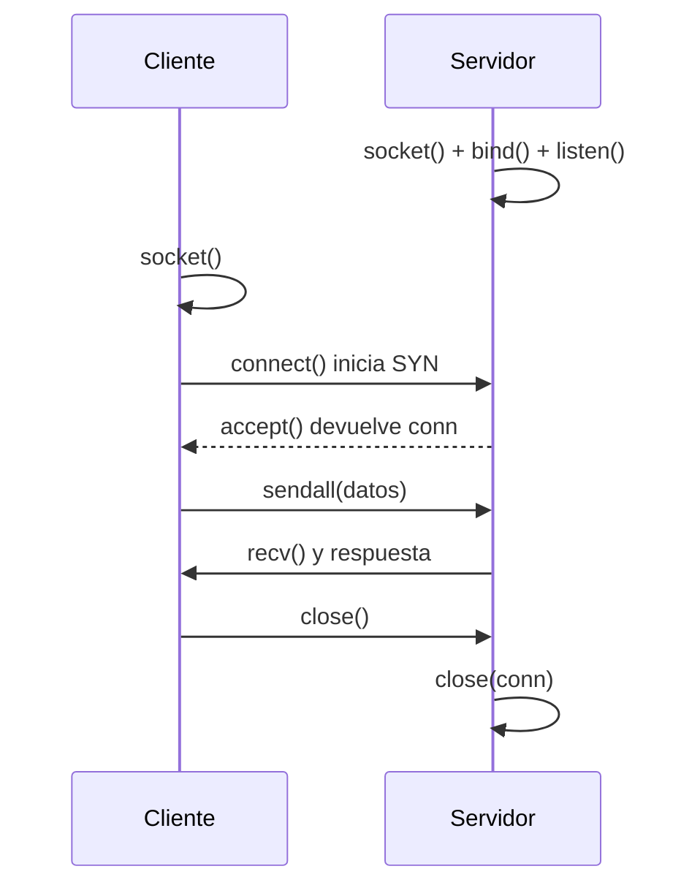
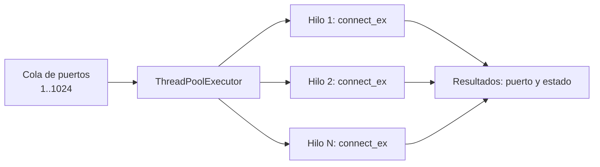

# Clase 016 — Python para seguridad: sockets y programación de red

> Parte: **0 — Fundamentos y prerrequisitos** · Fuente: *Seitz & Arnold, Black Hat Python (2ª ed.)*
> ⏱️ Duración estimada: **120 min** · Nivel: **Fundamentos**

---

## 🎯 Objetivo

Programar comunicaciones de red desde cero con la librería estándar `socket` de Python, entendiendo cómo cada línea de código se corresponde con un concepto del stack TCP/IP que ya estudiaste. Al terminar podrás construir clientes y servidores TCP y UDP, un escáner de puertos con manejo de timeouts, y un banner grabber capaz de identificar servicios, y sabrás por qué esas primitivas son el ladrillo con el que están hechas casi todas las herramientas ofensivas y defensivas de red, desde `nmap` hasta un simple *reverse shell*.

## 📚 Resultados de aprendizaje

Al finalizar, el alumno podrá:

1. **Explicar** cómo la API de sockets traduce el modelo TCP/IP a llamadas concretas del sistema operativo.
2. **Crear** clientes y servidores TCP con `socket`, controlando el ciclo `bind`/`listen`/`accept`.
3. **Implementar** comunicación UDP sin conexión y razonar sus límites de fiabilidad.
4. **Construir** un escáner de puertos con `connect_ex()` y timeouts que no se cuelgue ante puertos filtrados.
5. **Realizar** banner grabbing para inferir el servicio y su versión.
6. **Aplicar** concurrencia con hilos para acelerar tareas de red I/O-bound de forma medible.

## 🗺️ Temas

| # | Tema | Por qué importa |
|---|------|-----------------|
| 1 | API de sockets | `socket`, `connect`, `bind`, `listen`, `accept` traducen TCP/IP a código |
| 2 | Cliente TCP | Base de cualquier herramienta que hable con un servicio |
| 3 | Servidor TCP | Fundamento de listeners, handlers y reverse shells |
| 4 | UDP | Envío sin conexión: rápido pero sin garantías |
| 5 | Timeouts y errores | Evitan bloqueos indefinidos y distinguen estados de puerto |
| 6 | Escáner de puertos | Aplicación práctica directa del connect scan |
| 7 | Banner grabbing | Identificar servicios y versiones para fingerprinting |
| 8 | Concurrencia | Hilos y pools para escanear en una fracción del tiempo |

## 🧠 Explicación en profundidad

### El socket como abstracción del sistema operativo

Un **socket** no es una entidad de red que viaje por el cable: es una estructura de datos que el núcleo del sistema operativo te entrega como un descriptor de fichero, y que representa un extremo de una comunicación. Cuando en Python escribes `socket.socket(socket.AF_INET, socket.SOCK_STREAM)`, estás pidiendo al kernel un extremo IPv4 (`AF_INET`, la familia de direcciones) orientado a flujo de bytes fiable (`SOCK_STREAM`, que sobre IPv4 implica TCP). Si en su lugar pides `SOCK_DGRAM`, obtienes un extremo de datagramas (UDP). Esta elección de dos constantes es la que decide, por debajo, si vas a tener el *three-way handshake*, la retransmisión y el control de flujo de TCP, o el envío desnudo y sin garantías de UDP. Toda la librería `socket` de Python es una capa delgada sobre las llamadas al sistema BSD sockets (`socket()`, `connect()`, `bind()`, `listen()`, `accept()`, `send()`, `recv()`), de modo que aprender esta API es en gran medida aprender la interfaz de red del propio sistema operativo.

### Cliente y servidor: dos coreografías distintas

El lado **cliente** es la coreografía corta: creas el socket, opcionalmente le fijas un timeout con `settimeout()`, y llamas a `connect((ip, puerto))`. Ese `connect` desencadena el handshake TCP; si vuelve sin excepción, tienes un canal bidireccional listo para `sendall()` y `recv()`. El lado **servidor** es más largo porque debe existir *antes* de que llegue nadie: se crea el socket, se le asocia una dirección local con `bind(("0.0.0.0", puerto))`, se pasa a modo escucha con `listen()` (que fija el backlog de conexiones pendientes) y se bloquea en `accept()`, que devuelve un *socket nuevo* dedicado a ese cliente concreto más su dirección. Un detalle que confunde a quien empieza: el socket que escucha y el socket que conversa con cada cliente son objetos distintos; el primero solo reparte, el segundo transporta datos. El siguiente diagrama muestra la secuencia canónica de una conexión TCP a través de la API de sockets.



### TCP frente a UDP: qué garantiza cada uno

La diferencia entre `SOCK_STREAM` y `SOCK_DGRAM` no es de sintaxis sino de contrato. TCP te vende un **flujo de bytes fiable y ordenado**: garantiza entrega, orden y control de congestión, a cambio de establecer conexión y de una mayor latencia. UDP te vende un **datagrama best-effort**: envías y ruegas, sin handshake, sin acuse y sin orden garantizado. Para un atacante esto tiene una consecuencia directa en el escaneo: en TCP, un puerto cerrado responde con RST y uno abierto completa el handshake, así que el estado se infiere con fiabilidad; en UDP, la ausencia de respuesta es ambigua (puede significar "abierto y callado" o "filtrado por un firewall"), y por eso el escaneo UDP es lento e incierto incluso para `nmap`.

| Característica | TCP (`SOCK_STREAM`) | UDP (`SOCK_DGRAM`) |
|---------------|---------------------|--------------------|
| Conexión previa | Sí (three-way handshake) | No |
| Fiabilidad | Entrega y orden garantizados | Best-effort, sin garantía |
| Detección de estado en escaneo | Fiable (RST vs. SYN-ACK) | Ambigua (silencio = ¿abierto o filtrado?) |
| Latencia y sobrecarga | Mayor | Menor |
| Uso típico | HTTP, SSH, SMTP | DNS, SNMP, sondas rápidas |

### Timeouts: la diferencia entre una herramienta y un cuelgue

Sin `settimeout()`, una llamada a `connect()` o `recv()` puede bloquear tu programa durante decenas de segundos si el destino no responde, porque adopta el timeout por defecto del sistema. En un escáner que recorre 1024 puertos, un solo puerto filtrado detrás de un firewall que descarta silenciosamente los paquetes bastaría para colgar todo el barrido. Fijar un timeout corto y explícito por socket es lo que convierte un experimento frágil en una herramienta usable; el precio es que un timeout demasiado agresivo puede marcar como cerrado un puerto abierto pero lento. El método `connect_ex()` es el aliado del escáner: en lugar de lanzar una excepción, devuelve el código de error del sistema (0 significa éxito, es decir, puerto abierto), lo que evita envolver cada intento en un `try/except` y hace el bucle más limpio.

### Concurrencia: por qué los hilos aceleran aquí

El escaneo de red es **I/O-bound**: tu CPU pasa casi todo el tiempo esperando respuestas del otro extremo, no calculando. Ese es exactamente el escenario donde los hilos de Python brillan pese al GIL (Global Interpreter Lock), porque el GIL se libera durante las operaciones de red bloqueantes, permitiendo que otros hilos avancen mientras uno espera. Un `ThreadPoolExecutor` de `concurrent.futures` te deja lanzar decenas o cientos de sondas simultáneas y reduce el tiempo total de minutos a segundos. El siguiente esquema resume el modelo de un pool de hilos aplicado al escaneo.



Ten presente que más hilos no es siempre mejor: pasado cierto punto compites por descriptores de fichero y por ancho de banda, y puedes provocar `OSError: Too many open files` o saturar la red destino. Para escalar a miles de conexiones concurrentes, `asyncio` suele ser más eficiente en memoria, pero los hilos son el punto de partida más intuitivo.

## 📖 Definiciones y características

- **Socket**: extremo de comunicación identificado por la tupla IP + puerto, entregado por el kernel como descriptor de fichero. La clave es la pareja `AF_INET` (IPv4) con `SOCK_STREAM` (TCP) o `SOCK_DGRAM` (UDP), que determina el protocolo y sus garantías.
- **`connect()`**: inicia el three-way handshake TCP hacia un destino. Un `connect` exitoso implica que el puerto está abierto y acepta conexiones; es la base teórica del *connect scan*, el más fiable pero también el más ruidoso porque completa la conexión.
- **`connect_ex()`**: variante de `connect` que devuelve el código de error del sistema en lugar de lanzar una excepción. Devuelve 0 cuando el puerto está abierto, lo que hace el código de un escáner más limpio y rápido.
- **`bind()` / `listen()` / `accept()`**: la tríada del lado servidor. `bind` fija la dirección local, `listen` pone el socket en modo escucha con un backlog, y `accept` bloquea hasta que llega un cliente y devuelve un socket nuevo dedicado a él. Son la base de cualquier listener o handler.
- **Timeout**: tiempo máximo que una operación de socket espera antes de rendirse. Sin él, un puerto filtrado cuelga el escáner indefinidamente; con él, distingues respuestas rápidas de silencios. Se fija con `settimeout()`.
- **Banner**: texto que muchos servicios envían nada más aceptar la conexión (versión, software, mensaje de bienvenida). Revela información valiosa para el *fingerprinting* y para cruzar con bases de vulnerabilidades.
- **Banner grabbing**: técnica de conectar a un puerto abierto y leer ese banner para identificar el servicio. Algunos servicios (como HTTP) esperan que hables tú primero, así que a veces hay que enviar una petición antes de leer.
- **Hilo (thread)**: flujo de ejecución concurrente dentro del mismo proceso. Como la red es I/O-bound y el GIL se libera en las esperas de red, los hilos aceleran mucho el escaneo pese a las limitaciones del GIL para tareas de CPU.
- **GIL (Global Interpreter Lock)**: cerrojo del intérprete CPython que impide ejecutar bytecode en paralelo, pero que se libera durante operaciones de I/O bloqueantes, razón por la que los hilos siguen siendo útiles en tareas de red.

## 📔 Glosario

| Término | Definición concisa |
|---------|--------------------|
| Socket | Extremo de comunicación (IP + puerto) gestionado por el kernel |
| `AF_INET` | Familia de direcciones IPv4 |
| `SOCK_STREAM` | Tipo de socket orientado a flujo fiable (TCP) |
| `SOCK_DGRAM` | Tipo de socket de datagramas sin conexión (UDP) |
| Handshake | Intercambio SYN, SYN-ACK, ACK que abre una conexión TCP |
| Backlog | Cola de conexiones pendientes que fija `listen()` |
| Connect scan | Escaneo que completa el handshake TCP para detectar puertos abiertos |
| Banner | Texto de identificación que un servicio envía al conectar |
| Timeout | Tiempo máximo de espera de una operación de red |
| I/O-bound | Tarea limitada por espera de entrada/salida, no por CPU |
| GIL | Cerrojo del intérprete CPython que serializa el bytecode |
| `ThreadPoolExecutor` | Gestor de un pool de hilos reutilizables de `concurrent.futures` |
| netcat (`nc`) | Utilidad para leer/escribir en conexiones TCP/UDP |

## 🧰 Herramientas y preparación

Solo necesitas Python 3 y su librería estándar (`socket`, `threading`, `concurrent.futures`); no hace falta instalar nada. Trabaja siempre en tu laboratorio aislado, con una máquina Kali como atacante y una VM víctima con servicios conocidos (por ejemplo Metasploitable o un contenedor con SSH y un servidor web). Ten `nc` (netcat) a mano para levantar servicios de prueba rápidos y para comparar el comportamiento de tus clientes y servidores con una herramienta madura. Es muy recomendable tener Wireshark o `tcpdump` abierto en paralelo para ver en el cable lo que tu código produce.

## 🧪 Laboratorio guiado

1. **Cliente TCP mínimo**. Conéctate a un servicio de la víctima y lee su banner:

   ```python
   import socket
   s = socket.socket(socket.AF_INET, socket.SOCK_STREAM)
   s.settimeout(3)
   s.connect(("10.10.10.6", 22))
   print(s.recv(1024).decode(errors="replace"))
   s.close()
   ```

2. **Servidor de eco** en Kali, para entender el lado servidor completo:

   ```python
   import socket
   srv = socket.socket()
   srv.setsockopt(socket.SOL_SOCKET, socket.SO_REUSEADDR, 1)
   srv.bind(("0.0.0.0", 9000))
   srv.listen(1)
   conn, addr = srv.accept()
   print("Conexión de", addr)
   conn.sendall(conn.recv(1024))
   conn.close()
   ```

   Pruébalo desde otra terminal con `nc 10.10.10.5 9000` y escribe algo: debería devolvértelo.
3. **UDP sin conexión**. Envía un datagrama con `SOCK_DGRAM` y observa que no hay handshake ni garantía de entrega:

   ```python
   import socket
   u = socket.socket(socket.AF_INET, socket.SOCK_DGRAM)
   u.sendto(b"ping", ("10.10.10.6", 53))
   u.close()
   ```

4. **Escáner de puertos secuencial**. Recorre un rango con `connect_ex()` (devuelve 0 si abre):

   ```python
   import socket
   for port in range(1, 1025):
       s = socket.socket()
       s.settimeout(0.5)
       if s.connect_ex(("10.10.10.6", port)) == 0:
           print(f"[+] {port} abierto")
       s.close()
   ```

5. **Banner grabbing**. Para cada puerto abierto, intenta leer el banner y guárdalo; para servicios web, envía primero `b"HEAD / HTTP/1.0\r\n\r\n"`.
6. **Acelerar con hilos**. Reescribe el escáner con `concurrent.futures.ThreadPoolExecutor` y mide el tiempo con `time.perf_counter()` para comparar con la versión secuencial.

> ⚠️ **Nota ética**: los escáneres y clientes se ejecutan **únicamente** contra tus VMs de laboratorio o sistemas para los que tengas autorización expresa y por escrito. Escanear infraestructuras ajenas sin permiso es ilegal en la mayoría de jurisdicciones.

## ✍️ Ejercicios

1. Añade a tu escáner la resolución de nombre a IP con `socket.gethostbyname` y maneja el caso de nombre no resoluble.
2. Implementa un timeout configurable por argumento de línea de comandos con `argparse`.
3. Modifica el banner grabber para enviar `HEAD / HTTP/1.0\r\n\r\n` y capturar la respuesta de un servidor web, distinguiéndola del comportamiento de SSH.
4. Escribe un pequeño servidor TCP concurrente que registre cada conexión con su IP y hora en un fichero de log.
5. Compara y grafica el tiempo de escaneo de 1024 puertos en versión secuencial frente a 100 hilos, y explica dónde deja de ayudar añadir hilos.
6. Maneja de forma diferenciada `ConnectionRefusedError`, `socket.timeout` y `OSError`, e imprime un estado (cerrado, filtrado, error) según cada uno.

## 📝 Reto verificable

Construye `pyscan.py`, un escáner de puertos TCP multihilo que reciba un objetivo y un rango de puertos por línea de comandos, use timeouts por socket, haga banner grabbing de los puertos abiertos y muestre un informe ordenado (puerto → estado → banner). Debe manejar los errores de red sin abortar y ser notablemente más rápido que la versión secuencial.

**Criterio de aceptación**: contra tu VM víctima detecta correctamente los puertos abiertos conocidos y captura al menos un banner (por ejemplo el de SSH), completa el escaneo de 1024 puertos en una fracción del tiempo de la versión secuencial (mídelo), y no se cuelga ante puertos filtrados. Su salida de puertos abiertos es comparable con la de `nmap -sT` sobre el mismo objetivo.

## ⚠️ Errores comunes

| Síntoma / mensaje | Causa y cómo arreglar |
|-------------------|-----------------------|
| El escáner se cuelga en algunos puertos | Falta `settimeout`. Fija un timeout corto por socket antes de `connect`. |
| `OSError: Too many open files` | No cierras los sockets o abres demasiados a la vez. Usa `with`/`close()` y limita el número de hilos. |
| Todos los puertos parecen "abiertos" o "cerrados" | Confundes `connect_ex` (0 = abierto) con la lógica de excepciones. Revisa el código de retorno. |
| Banner vacío en puertos abiertos | El servicio espera que hables tú primero (HTTP). Envía una petición antes de `recv`. |
| Datos ilegibles al imprimir | Recibes `bytes`, no texto. Decodifica con `errors="replace"` o trabaja en hexadecimal. |
| `OSError: Address already in use` en el servidor | El puerto quedó en TIME_WAIT. Usa `setsockopt(SOL_SOCKET, SO_REUSEADDR, 1)` antes de `bind`. |

## ❓ Preguntas frecuentes

**❓ ¿Por qué mi escáner en Python es más lento que nmap?** nmap está escrito en C, usa raw sockets y técnicas avanzadas (SYN scan half-open, temporización adaptativa, deduplicación). El objetivo de esta clase es entender el mecanismo desde dentro, no superar a nmap.

**❓ ¿Hago connect scan o SYN scan en Python?** Con la librería `socket` haces *connect scan*, que completa el handshake y por tanto es más fácil de detectar y registrar. Para un SYN scan half-open necesitas raw sockets o Scapy, que veremos en la Clase 017.

**❓ ¿Hilos o asyncio?** Para I/O de red ambos sirven. Los hilos son más sencillos de entender al principio y aprovechan que el GIL se libera en las esperas de red; `asyncio` escala mejor a miles de conexiones con menos memoria.

**❓ ¿Puedo escanear UDP con sockets?** Sí, pero es poco fiable: la falta de respuesta no distingue "abierto" de "filtrado", porque UDP no acusa recibo. Por eso el escaneo UDP es difícil e incierto incluso para nmap.

## 🔗 Referencias

- Seitz & Arnold, *Black Hat Python* (2ª ed.), capítulo de redes.
- Python, documentación de `socket` — <https://docs.python.org/3/library/socket.html>
- Python, documentación de `concurrent.futures` — <https://docs.python.org/3/library/concurrent.futures.html>
- Beej's Guide to Network Programming — <https://beej.us/guide/bgnet/>
- RFC 9293, *Transmission Control Protocol (TCP)* — <https://www.rfc-editor.org/rfc/rfc9293>

## 📥 Material descargable

- 📄 [Guía en PDF](./clase-016-guia.pdf) — versión imprimible de esta clase.
- 🎞️ [Presentación (PPTX)](./clase-016-presentacion.pptx) — deck para proyectar en clase.

## ⬅️ Clase anterior

[Clase 015 — Python para seguridad: fundamentos del lenguaje](../015-python-para-seguridad-fundamentos-del-lenguaje/README.md)

## ➡️ Siguiente clase

[Clase 017 — Python para seguridad: manipulación de paquetes con Scapy](../017-python-para-seguridad-manipulacion-de-paquetes-con-scapy/README.md)
