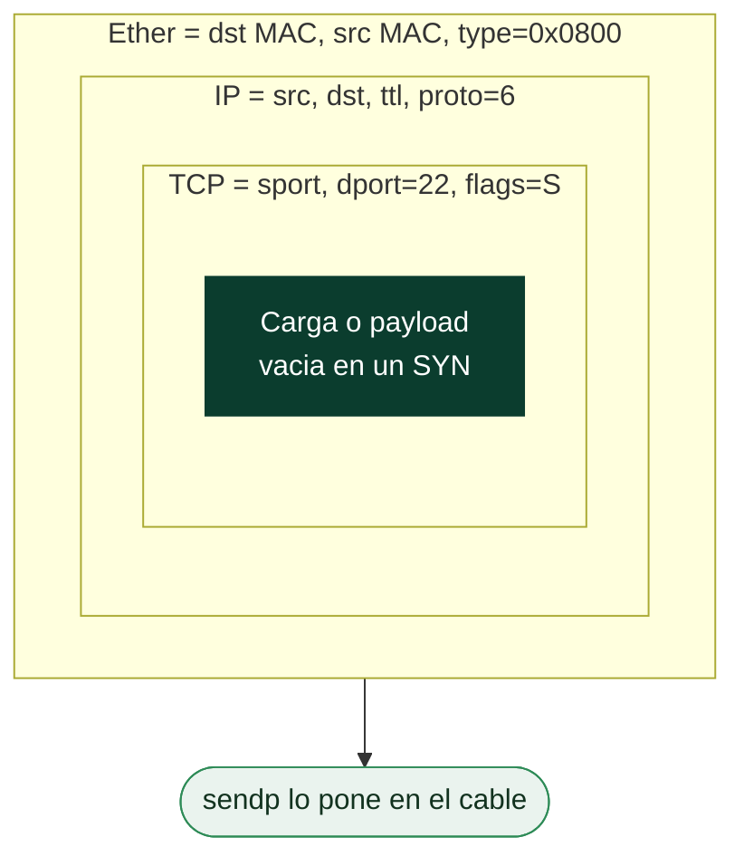
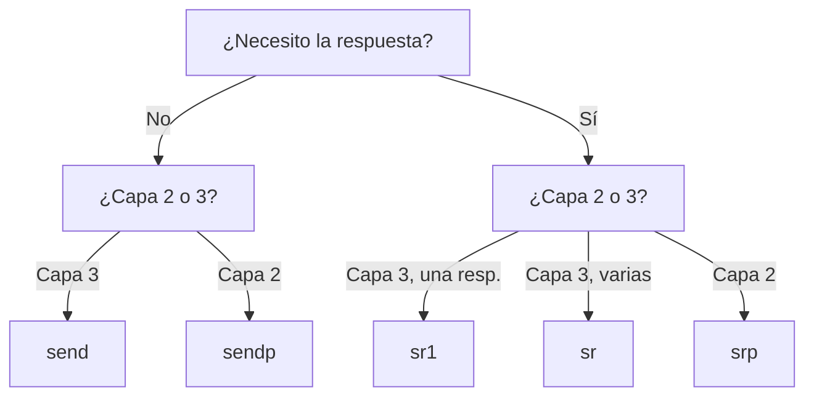

# Clase 017 — Python para seguridad: manipulación de paquetes con Scapy

> Parte: **0 — Fundamentos y prerrequisitos** · Fuente: *Scapy Documentation / Black Hat Python*
> ⏱️ Duración estimada: **120 min** · Nivel: **Fundamentos**

---

## 🎯 Objetivo

Construir, enviar, capturar y diseccionar paquetes de red a bajo nivel con Scapy, controlando cada campo de cada cabecera en lugar de depender de lo que el sistema operativo decida por ti. Al terminar podrás forjar paquetes capa por capa, implementar tu propio ping y tu propio SYN scan half-open, esnifar tráfico con filtros y automatizar pruebas de red, uniendo en la práctica todo lo aprendido sobre el modelo TCP/IP y sobre Python.

## 📚 Resultados de aprendizaje

Al finalizar, el alumno podrá:

1. **Forjar** paquetes especificando cada capa (Ether, IP, TCP, UDP, ICMP) con el operador `/`.
2. **Enviar** y recibir paquetes con `send`, `sr`, `sr1` y `srp`, distinguiendo capa 2 de capa 3.
3. **Esnifar** tráfico en vivo y aplicar filtros BPF para reducir el ruido.
4. **Implementar** un SYN scan half-open y un descubrimiento de hosts por ARP e ICMP.
5. **Diseccionar** las respuestas para inferir el estado de un puerto y la presencia de un host.
6. **Verificar** con Wireshark que los paquetes forjados salen exactamente como los diseñaste.

## 🗺️ Temas

| # | Tema | Por qué importa |
|---|------|-----------------|
| 1 | Modelo de capas en Scapy | El operador `/` apila capas como cebolla |
| 2 | Construcción de paquetes | Control total de cada campo de cabecera |
| 3 | Envío y recepción | `send`, `sr`, `sr1`, `srp` y cuándo usar cada uno |
| 4 | Sniffing | Capturar y procesar tráfico en vivo |
| 5 | Filtros BPF | Reducir el ruido en la captura |
| 6 | SYN scan | Escaneo half-open implementado a mano |
| 7 | ARP e ICMP | Descubrimiento de hosts en la red |
| 8 | Análisis de respuestas | Interpretar flags TCP y códigos ICMP |

## 🧠 Explicación en profundidad

### El operador `/` y el modelo de cebolla

La idea central de Scapy es que un paquete es una **pila de capas** y que apilarlas es tan sencillo como dividir con el operador `/`. Cuando escribes `IP(dst="10.10.10.6")/TCP(dport=22, flags="S")`, no estás dividiendo nada: estás diciendo "una capa IP que contiene una capa TCP". Scapy encadena los objetos, rellena automáticamente los campos que no especificas (longitudes, checksums, número de secuencia inicial) con valores sensatos y deja bajo tu control absoluto los que sí tocas. Esta es la diferencia radical con la librería `socket` de la clase anterior: allí el kernel construía las cabeceras por ti y solo veías el payload; aquí tú eres quien decide el TTL, los flags TCP o incluso valores deliberadamente anómalos para probar cómo reacciona un objetivo. El siguiente esquema muestra cómo se anida una sonda SYN típica.



Fíjate en qué capa es la más externa, porque de eso depende la función de envío que
toca usar: si construyes desde `Ether()` estás fabricando la trama entera y se envía
con `sendp()` a nivel 2; si empiezas en `IP()` dejas que el kernel resuelva la capa
de enlace y se envía con `send()`. Confundir ambas es el error más frecuente al
empezar con Scapy.

### Enviar y recibir: elegir la función correcta

Scapy ofrece una familia de funciones de envío cuya diferencia es sutil pero importante, y confundirlas es la causa más común de "no me responde nada". La distinción tiene dos ejes: si esperas respuesta o no, y en qué capa trabajas. `send()` dispara paquetes de capa 3 (IP) y no espera respuesta. `sr()` (send-receive) envía en capa 3 y devuelve dos listas: paquetes respondidos y no respondidos. `sr1()` es el atajo cuando solo te interesa la primera respuesta, ideal para un ping o para sondear un único puerto. Cuando necesitas trabajar en capa 2 —porque vas a forjar la trama Ethernet completa, como en ARP— usas las variantes con `p`: `sendp()` y `srp()`. El siguiente diagrama resume la decisión.



### El SYN scan half-open y la lectura de flags

El SYN scan que implementas aquí es la versión artesanal del `nmap -sS`, y su lógica es pura lectura de flags TCP. Envías un único segmento con el flag SYN activado hacia un puerto. Si el puerto está **abierto**, la pila TCP del objetivo responde con SYN-ACK (los flags valen `0x12`, es decir SYN + ACK); si está **cerrado**, responde con RST-ACK (`0x14`); y si no responde nada tras un timeout razonable, se clasifica como **filtrado**, señal habitual de un firewall que descarta el paquete en silencio. Se llama *half-open* porque nunca completas el handshake: en cuanto recibes el SYN-ACK, envías un RST para abortar, de modo que la conexión nunca llega a establecerse del todo. Históricamente esto lo hacía más sigiloso porque muchas aplicaciones solo registraban conexiones completas, aunque los IDS y firewalls modernos detectan el patrón sin problemas.

| Respuesta del objetivo | Flags TCP | Estado inferido |
|------------------------|-----------|-----------------|
| SYN-ACK | `0x12` | Abierto |
| RST-ACK | `0x14` | Cerrado |
| Sin respuesta | (ninguna) | Filtrado |
| ICMP unreachable | (tipo 3) | Filtrado por firewall |

### Descubrimiento de hosts: ARP frente a ICMP

Antes de escanear puertos conviene saber qué hosts están vivos, y ahí hay dos técnicas de nivel distinto. El **ping ICMP** (echo request, tipo 8) opera en capa 3 y funciona a través de routers, pero muchos hosts y firewalls bloquean ICMP, así que un silencio no prueba que el host esté muerto. El **descubrimiento ARP** opera en capa 2 y solo funciona dentro de tu propio segmento de red local, pero es infalible ahí: ningún host puede participar en la LAN sin responder a ARP, porque ARP es el mecanismo que traduce direcciones IP a direcciones MAC. Por eso, dentro de tu subred de laboratorio, un barrido ARP con `srp()` es la forma más fiable de enumerar hosts vivos, mientras que ICMP es la herramienta cuando el objetivo está a varios saltos.

### Sniffing y filtros BPF

Capturar tráfico con `sniff()` es trivial, pero capturar *todo* el tráfico de una interfaz activa te ahoga en ruido. Los **filtros BPF** (Berkeley Packet Filter) son un pequeño lenguaje que el kernel aplica *antes* de entregarte los paquetes, de modo que expresiones como `tcp port 80` o `icmp` descartan lo irrelevante con eficiencia, sin que tu código Python tenga que procesar y desechar millones de paquetes. Es el mismo lenguaje de filtro que usa `tcpdump`. No hay que confundirlo con los filtros de visualización de Wireshark, que tienen su propia sintaxis y se aplican después de capturar.

### Por qué Scapy necesita privilegios

Todo esto exige que Scapy use **raw sockets**, un tipo de socket que permite construir y enviar paquetes con las cabeceras hechas a mano, saltándose la pila normal del sistema operativo. Fabricar tramas arbitrarias es una capacidad potente —y potencialmente peligrosa— que los sistemas Unix reservan al usuario root, por eso Scapy debe ejecutarse con `sudo` para enviar o esnifar. Esa misma potencia es la que lo hace tan valioso para defensa: generar tráfico de prueba controlado para validar reglas de un IDS, prototipar detecciones o analizar capturas.

## 📖 Definiciones y características

- **Scapy**: librería de Python para forjar, enviar, capturar y diseccionar paquetes de red. Su rasgo distintivo es apilar capas con el operador `/` (`IP()/TCP()`) y rellenar automáticamente los campos que no especificas.
- **Capa (layer)**: cada nivel del paquete (Ether, IP, TCP, UDP, ICMP) modelado como un objeto Python con sus campos. Se accede a una capa concreta con `pkt[TCP]` y se comprueba su presencia con `haslayer()`.
- **`sr1()`**: envía un paquete de capa 3 y devuelve únicamente la primera respuesta. Es la elección natural para sondas puntuales como un ping o el sondeo de un solo puerto.
- **`sr()`**: envía en capa 3 y devuelve dos conjuntos, respondidos y no respondidos. Útil para escanear muchos puertos u hosts de una vez.
- **`srp()`**: equivalente a `sr` pero en capa 2 (Ethernet), imprescindible para ARP porque necesitas forjar la trama con la MAC de broadcast.
- **Filtro BPF**: expresión de filtrado (`tcp port 80`, `icmp`) que el kernel aplica en captura para entregarte solo el tráfico relevante y ahorrar procesamiento.
- **SYN scan (half-open)**: técnica que envía un SYN y clasifica el puerto según la respuesta (SYN-ACK = abierto, RST = cerrado, silencio = filtrado), abortando con RST sin completar el handshake.
- **Raw socket**: socket de bajo nivel que permite construir cabeceras a mano; requiere privilegios de root porque puede fabricar tráfico arbitrario.
- **ARP**: protocolo de capa 2 que resuelve una IP en su MAC dentro de la LAN; su naturaleza obligatoria lo hace ideal para descubrir hosts vivos en el segmento local.

## 📔 Glosario

| Término | Definición concisa |
|---------|--------------------|
| Scapy | Librería Python de forja y análisis de paquetes |
| Capa | Nivel del paquete (Ether/IP/TCP/UDP/ICMP) como objeto |
| Operador `/` | Apila una capa dentro de otra en Scapy |
| `send` | Envía paquetes de capa 3 sin esperar respuesta |
| `sr1` | Envía capa 3 y devuelve la primera respuesta |
| `srp` | Envía/recibe en capa 2 (Ethernet), necesario para ARP |
| Flag TCP | Bit de control (SYN, ACK, RST, FIN...) del segmento TCP |
| SYN-ACK (`0x12`) | Respuesta que indica puerto abierto |
| RST (`0x14`) | Respuesta que indica puerto cerrado |
| Half-open | Escaneo que no completa el handshake, aborta con RST |
| BPF | Berkeley Packet Filter: lenguaje de filtrado en captura |
| Sniffing | Captura pasiva de tráfico de una interfaz |
| Raw socket | Socket de bajo nivel que exige privilegios de root |
| ARP | Protocolo que traduce IP a MAC en la LAN |

## 🧰 Herramientas y preparación

Instala Scapy en tu entorno virtual de Kali:

```bash
pip install scapy    # o: sudo apt install python3-scapy
sudo scapy           # consola interactiva (necesita root para enviar)
```

Trabaja siempre en la red interna del laboratorio, con la NIC de la VM en modo *host-only* o red interna para no tocar redes reales. Ten Wireshark abierto en paralelo, filtrando por la interfaz correcta, para verificar que tus paquetes forjados salen con exactamente los campos que esperas: comparar lo que crees haber enviado con lo que Wireshark muestra es la mejor forma de aprender.

## 🧪 Laboratorio guiado

1. **Forjar y ver un paquete**:

   ```python
   from scapy.all import *
   pkt = IP(dst="10.10.10.6")/ICMP()
   pkt.show()
   ```

2. **Ping propio** con `sr1`:

   ```python
   resp = sr1(IP(dst="10.10.10.6")/ICMP(), timeout=2, verbose=0)
   print("Vivo" if resp else "Sin respuesta")
   ```

3. **Descubrimiento ARP** en la subred (capa 2):

   ```python
   ans, _ = srp(Ether(dst="ff:ff:ff:ff:ff:ff")/ARP(pdst="10.10.10.0/24"),
                timeout=2, verbose=0)
   for _, r in ans:
       print(r.psrc, r.hwsrc)
   ```

4. **SYN scan a mano** de un puerto, cerrando limpiamente con RST:

   ```python
   r = sr1(IP(dst="10.10.10.6")/TCP(dport=22, flags="S"), timeout=2, verbose=0)
   if r and r.haslayer(TCP):
       if r[TCP].flags == 0x12:
           print("abierto")
           send(IP(dst="10.10.10.6")/TCP(dport=22, flags="R"), verbose=0)
       else:
           print("cerrado")
   else:
       print("filtrado")
   ```

5. **Sniffing con filtro BPF**:

   ```python
   pkts = sniff(filter="tcp port 80", count=10, timeout=15)
   pkts.summary()
   ```

6. **Verifica en Wireshark** que tus SYN forjados aparecen con los flags correctos y que ves el patrón SYN → SYN-ACK → RST en los puertos abiertos.

> ⚠️ **Nota ética**: forjar y enviar paquetes se hace **solo** en tu laboratorio aislado y sobre sistemas para los que tengas autorización expresa. Inyectar tráfico en redes ajenas sin permiso es ilegal y puede causar daños reales.

## ✍️ Ejercicios

1. Modifica el ping para variar el TTL (por ejemplo de 1 a 10) y reconstruye un `traceroute` manual observando de qué salto llega el ICMP Time Exceeded.
2. Escribe un escáner que recorra una lista de puertos con SYN scan y clasifique cada uno como abierto, cerrado o filtrado.
3. Implementa un descubrimiento de hosts que combine ARP (para la LAN) e ICMP (para hosts remotos) y explica cuándo usar cada uno.
4. Captura 20 paquetes con `sniff` y extrae con Scapy la lista de IPs origen únicas.
5. Forja un paquete UDP a un puerto DNS cerrado y analiza la respuesta ICMP Port Unreachable si la hay.
6. Asegúrate de enviar siempre el RST tras un SYN-ACK y verifica en Wireshark que no dejas conexiones a medias.

## 📝 Reto verificable

Implementa `scapyscan.py`, un escáner SYN con Scapy que reciba un objetivo y una lista de puertos, clasifique cada puerto como abierto, cerrado o filtrado según la respuesta, cierre con RST los que respondan SYN-ACK, y muestre un informe ordenado. Verifica con Wireshark que los paquetes salen correctos.

**Criterio de aceptación**: el clasificador coincide con `nmap -sS` sobre los mismos puertos de tu VM víctima (abierto/cerrado/filtrado); en Wireshark se observa el patrón SYN → SYN-ACK → RST para los puertos abiertos; y la herramienta se ejecuta con privilegios sin dejar conexiones a medias ni sockets colgados.

## ⚠️ Errores comunes

| Síntoma / mensaje | Causa y cómo arreglar |
|-------------------|-----------------------|
| `PermissionError` / no envía nada | Scapy necesita root para raw sockets. Ejecuta con `sudo`. |
| Interfaz equivocada | Scapy usa la ruta por defecto. Especifica `iface=` si tienes varias NIC. |
| `sr1` devuelve `None` siempre | Timeout demasiado corto o host filtrado. Sube el timeout y verifica conectividad con un ping. |
| Los paquetes no aparecen en Wireshark | Filtro mal escrito o interfaz incorrecta. Ajusta el filtro y la NIC en Wireshark. |
| El SYN scan deja conexiones a medias | No enviaste el RST. Cierra tú la conexión tras recibir el SYN-ACK. |
| Comparación de flags que nunca cuadra | Comparas el objeto flags como cadena. Compara con el entero (`r[TCP].flags == 0x12`) o con `"SA"`. |

## ❓ Preguntas frecuentes

**❓ ¿Para qué usar Scapy si existe nmap?** Scapy da control total del paquete: puedes forjar cabeceras arbitrarias, probar comportamientos anómalos y construir herramientas a medida que nmap no cubre. Es didáctico y extremadamente flexible para prototipar.

**❓ ¿Por qué necesita root?** Enviar paquetes forjados requiere raw sockets, una operación privilegiada porque permite fabricar tráfico arbitrario. Esa misma potencia obliga a usarlo con responsabilidad.

**❓ ¿Scapy sirve para defensa?** Sí: prototipar detecciones, generar tráfico de prueba controlado para validar un IDS, o analizar capturas guardadas. No es una herramienta solo ofensiva.

**❓ ¿Puedo hacer sniffing sin modo promiscuo?** Verás tu propio tráfico, pero para capturar el de otros hosts en una LAN conmutada necesitarías port mirroring o un MITM (y la autorización correspondiente). Recuerda siempre el marco legal.

## 🔗 Referencias

- Scapy, documentación oficial — <https://scapy.readthedocs.io/>
- Seitz & Arnold, *Black Hat Python* (2ª ed.), capítulo sobre Scapy.
- Nmap, *Port Scanning Techniques* (SYN scan) — <https://nmap.org/book/synscan.html>
- RFC 826, *Address Resolution Protocol (ARP)* — <https://www.rfc-editor.org/rfc/rfc826>
- RFC 792, *Internet Control Message Protocol (ICMP)* — <https://www.rfc-editor.org/rfc/rfc792>
- *BPF filter syntax* (sintaxis de los filtros de captura que acepta `sniff`) — <https://biot.com/capstats/bpf.html>

## 📥 Material descargable

- 📄 [Guía en PDF](./clase-017-guia.pdf) — versión imprimible de esta clase.
- 🎞️ [Presentación (PPTX)](./clase-017-presentacion.pptx) — deck para proyectar en clase.

## ⬅️ Clase anterior

[Clase 016 — Python para seguridad: sockets y programación de red](../016-python-para-seguridad-sockets-y-programacion-de-red/README.md)

## ➡️ Siguiente clase

[Clase 018 — Git y control de versiones para profesionales de seguridad](../018-git-y-control-de-versiones-para-profesionales-de-seguridad/README.md)
