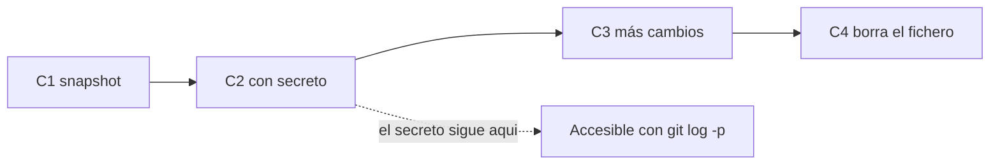
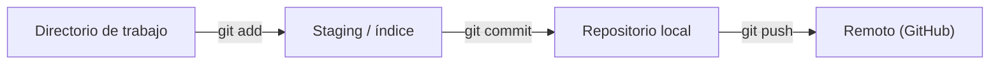
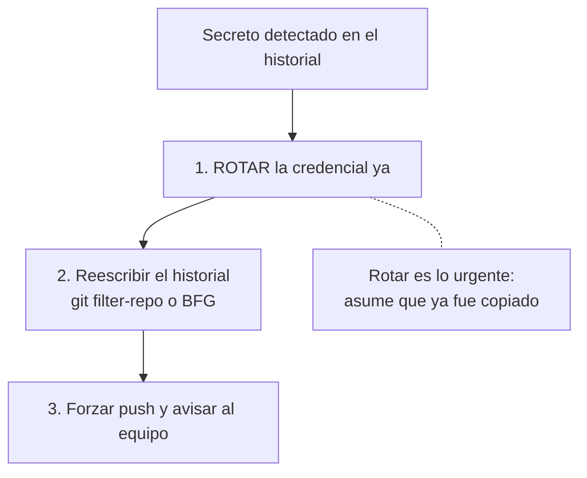

# Clase 018 — Git y control de versiones para profesionales de seguridad

> Parte: **0 — Fundamentos y prerrequisitos** · Fuente: *Chacon & Straub, Pro Git*
> ⏱️ Duración estimada: **100 min** · Nivel: **Fundamentos**

---

## 🎯 Objetivo

Usar Git con soltura para versionar herramientas, notas y hallazgos, colaborar en equipo y, sobre todo, evitar filtrar secretos en el historial, uno de los errores de seguridad más comunes y más caros del mundo real. Al terminar manejarás el flujo básico, las ramas, la resolución de conflictos y las prácticas de higiene de secretos, y entenderás por qué el modelo de datos de Git hace que un secreto empujado no se borre con solo eliminarlo en un commit posterior.

## 📚 Resultados de aprendizaje

Al finalizar, el alumno podrá:

1. **Ejecutar** el flujo básico de Git: init, add, commit, log y diff, entendiendo el área de staging.
2. **Trabajar** con ramas, fusiones y resolución manual de conflictos.
3. **Sincronizar** con repositorios remotos mediante clone, push y pull.
4. **Prevenir** la fuga de secretos con `.gitignore` y buenas prácticas de higiene.
5. **Auditar** un repositorio en busca de secretos en todo su historial con herramientas dedicadas.
6. **Explicar** el procedimiento correcto de remediación cuando un secreto ya fue empujado.

## 🗺️ Temas

| # | Tema | Por qué importa |
|---|------|-----------------|
| 1 | Modelo de Git | Guarda snapshots completos, no diffs |
| 2 | Área de staging | El paso intermedio que muchos ignoran |
| 3 | Flujo básico | add / commit / log / diff |
| 4 | Ramas y merge | Trabajo paralelo aislado |
| 5 | Conflictos | Resolverlos sin romper nada |
| 6 | Remotos | Colaboración, respaldo y su riesgo |
| 7 | `.gitignore` | Primera línea contra subir secretos |
| 8 | Secretos en el historial | El error clásico y su remediación |

## 🧠 Explicación en profundidad

### El modelo de datos: snapshots, no diferencias

La intuición equivocada más extendida es pensar que Git guarda las diferencias entre versiones. No: Git guarda **snapshots completos** del árbol de ficheros en cada commit, referenciados por un hash SHA-1 (o SHA-256 en repos modernos) que resume el contenido. Cada commit apunta a su árbol de contenido y a su commit o commits padre, formando un grafo dirigido acíclico donde cada nodo es inmutable e identificado por su hash. Esta arquitectura tiene una consecuencia de seguridad enorme y contraintuitiva: como cada commit es un objeto inmutable direccionado por contenido, **un secreto que entró en un commit vive en ese commit para siempre**, aunque lo borres en un commit posterior. El commit nuevo solo añade un snapshot sin el secreto; el commit viejo, con el secreto, sigue ahí y sigue siendo accesible con `git log -p` o `git show`. El siguiente diagrama muestra la cadena de commits y por qué eliminar en C4 no toca C2.



### El área de staging: los tres estados

Git organiza tu trabajo en tres zonas, y entenderlas evita la mayor parte de la confusión de un principiante. El **directorio de trabajo** son tus ficheros tal como los ves y editas. El **área de staging** (o índice) es una zona intermedia donde preparas exactamente qué cambios entrarán en el próximo commit: `git add` mueve cambios del directorio de trabajo al staging. El **repositorio** es donde `git commit` graba de forma permanente lo que había en staging. Este paso intermedio es una virtud, no un estorbo: te permite componer commits atómicos y coherentes (por ejemplo, no mezclar el arreglo de un bug con el fichero `.env` que se te coló). En seguridad, mirar qué hay en staging con `git diff --cached` antes de cada commit es un hábito que evita fugas.



### Ramas y merge: trabajo paralelo barato

Una **rama** en Git no es una copia de los ficheros sino un simple puntero móvil a un commit; crear una rama es tan barato como escribir 41 bytes en un fichero. Eso hace que ramificar sea la operación natural para aislar trabajo: pruebas un exploit peligroso o una refactorización arriesgada en su propia rama, sin ensuciar `main`, y si sale mal la descartas. Fusionar (`merge`) integra el trabajo de una rama en otra. Cuando las dos ramas modificaron líneas distintas, Git fusiona automáticamente; cuando ambas tocaron la misma línea, se produce un **conflicto** que Git no puede resolver por ti: marca la zona con `<<<<<<<`, `=======` y `>>>>>>>`, y tú decides qué versión queda, editas el fichero, haces `git add` y confirmas. Resolver conflictos con calma, entendiendo ambas versiones en lugar de borrar a ciegas, es una destreza que se practica.

### Remotos: la razón por la que una fuga es tan grave

Un **remoto** es una copia del repositorio en otra máquina (GitHub, GitLab, un servidor propio) con la que sincronizas mediante `push` y `pull`. Git es distribuido: cada `clone` es una copia completa del historial, no un enlace a un servidor central. Aquí está el núcleo del problema de seguridad: cuando empujas un secreto a un remoto público, no solo queda en el servidor, sino que **cualquiera que clone el repositorio se lleva una copia íntegra del historial, secreto incluido**, y hay bots que escanean GitHub en continuo y encuentran claves nuevas en segundos. Por eso la única respuesta segura ante un secreto expuesto no es borrarlo, sino **rotarlo**: invalidar la credencial filtrada y emitir una nueva.

### Higiene de secretos: prevención y remediación

La prevención empieza con `.gitignore`, un fichero que lista patrones de rutas que Git no debe rastrear (`.env`, `*.pem`, `*.key`, `venv/`). Es la primera línea de defensa, aunque tiene un matiz: `.gitignore` solo ignora ficheros que Git **aún no rastrea**; si un fichero ya fue añadido, hay que sacarlo del seguimiento con `git rm --cached`. La segunda línea son los escáneres de secretos como **gitleaks** o **trufflehog**, que recorren todo el historial buscando patrones de claves, tokens y contraseñas, y que se integran idealmente como *pre-commit hook* para bloquear la fuga antes de que ocurra. Cuando la prevención falla y el secreto ya está en el historial, la remediación tiene dos pasos innegociables, y este es el orden mental que debes memorizar:



Fíjate en que rotar va **primero**: reescribir el historial es lento y no garantiza nada si alguien ya clonó el repo, mientras que rotar la clave la vuelve inútil de inmediato aunque el atacante la tenga.

## 📖 Definiciones y características

- **Commit**: instantánea completa del proyecto en un momento dado, identificada por un hash único e inmutable. Git guarda snapshots, no diferencias, y cada commit apunta a su padre formando la cadena del historial.
- **Área de staging (índice)**: zona intermedia donde preparas qué cambios entrarán en el próximo commit. `git add` la llena y `git diff --cached` te deja revisarla antes de confirmar, un hábito clave para no filtrar secretos.
- **Rama (branch)**: puntero móvil y ligero a un commit. Aísla líneas de trabajo sin afectar a `main`, lo que permite experimentar con exploits o cambios arriesgados de forma segura.
- **Merge**: integración de una rama en otra. Es automática si las ramas tocaron líneas distintas y produce un conflicto si ambas modificaron la misma línea, que hay que resolver a mano.
- **`.gitignore`**: fichero con patrones de rutas que Git no debe rastrear. Es la primera defensa contra subir secretos y artefactos, pero solo afecta a ficheros aún no rastreados.
- **Historial inmutable**: cada commit es un objeto direccionado por contenido; reescribir el pasado (rebase, filter-repo) cambia los hashes. Un secreto ya empujado no desaparece por eliminarlo en un commit nuevo.
- **Remoto**: copia del repositorio en otra máquina con la que sincronizas por push/pull. Como Git es distribuido, cada clon incluye todo el historial, lo que agrava cualquier fuga.
- **Rotación de credenciales**: invalidar una clave o token expuesto y emitir uno nuevo. Es la única remediación fiable ante un secreto filtrado, porque debes asumir que ya fue copiado.
- **gitleaks / trufflehog**: escáneres que detectan secretos en todo el historial de un repo. Integrados como pre-commit hook, previenen fugas antes de que se produzcan.

## 📔 Glosario

| Término | Definición concisa |
|---------|--------------------|
| Commit | Snapshot inmutable del proyecto con hash único |
| Hash SHA | Identificador de contenido de un objeto Git |
| Staging (índice) | Zona intermedia de cambios preparados |
| `git add` | Mueve cambios al área de staging |
| Rama | Puntero móvil a un commit |
| `main` | Rama principal por convención |
| Merge | Integra una rama en otra |
| Conflicto | Choque de ediciones en la misma línea |
| Remoto | Copia del repo en otra máquina |
| `push` / `pull` | Sincronizan con el remoto |
| `.gitignore` | Patrones de ficheros no rastreados |
| Historial | Cadena inmutable de commits |
| gitleaks | Escáner de secretos en el historial |
| Rotar credencial | Invalidar y reemitir una clave expuesta |
| `git rm --cached` | Deja de rastrear un fichero sin borrarlo |

## 🧰 Herramientas y preparación

Instala Git y configúralo con tu identidad:

```bash
sudo apt install git
git config --global user.name "Tu Nombre"
git config --global user.email "tu@correo"
```

Para el escaneo de secretos, instala **gitleaks** (<https://github.com/gitleaks/gitleaks>). Opcionalmente, crea una cuenta en GitHub o GitLab para practicar los remotos. Importante: **no** ejecutes los ejercicios de esta clase dentro del repositorio del curso; crea un repositorio de práctica aparte para poder plantar y borrar secretos sin riesgo.

## 🧪 Laboratorio guiado

1. **Crear un repo de práctica** (fuera del repo del curso):

   ```bash
   mkdir ~/practica-git && cd ~/practica-git && git init
   ```

2. **Flujo básico** y revisión del staging:

   ```bash
   echo "# Notas" > README.md
   git add README.md
   git diff --cached          # revisa qué vas a confirmar
   git commit -m "Primer commit"
   git log --oneline
   ```

3. **Ramas y conflicto controlado**. Crea una rama, edita la misma línea del README en ambas ramas y fuerza un conflicto al fusionar; resuélvelo editando los marcadores y confirmando.
4. **`.gitignore`** con patrones típicos de secretos y artefactos:

   ```gitignore
   .env
   *.pem
   *.key
   venv/
   __pycache__/
   ```

5. **Simular una fuga**. Crea un fichero `secreto.env` con una clave **falsa**, añádelo por error y haz commit. Comprueba que aparece en `git log -p`.
6. **Auditar con gitleaks**:

   ```bash
   gitleaks detect --source . -v
   ```

   Observa cómo detecta el secreto plantado en el historial.
7. **Aprende la lección**: borra `secreto.env` en un commit nuevo y vuelve a ejecutar `gitleaks`. Verás que **sigue detectándolo**, porque permanece en el commit anterior. Esa es la prueba de que hay que reescribir el historial y, sobre todo, rotar el secreto.

## ✍️ Ejercicios

1. Crea, cambia entre y fusiona tres ramas, documentando cada paso con `git log --graph --oneline`.
2. Provoca y resuelve un conflicto de merge en un fichero con dos ediciones incompatibles.
3. Escribe un `.gitignore` completo para un proyecto Python de seguridad (entornos, claves, artefactos, cachés).
4. Usa `git log`, `git diff` y `git blame` para investigar quién y cuándo cambió una línea concreta.
5. Ejecuta gitleaks sobre un repo con un secreto plantado y explica con tus palabras el hallazgo que reporta.
6. Investiga cómo eliminar un secreto del historial con `git filter-repo` o BFG, y argumenta por qué además hay que rotar la credencial.

## 📝 Reto verificable

Crea un repositorio de práctica, simula la fuga de un secreto (clave ficticia) en un commit, detéctalo con gitleaks, y documenta el procedimiento correcto de remediación: rotación de la credencial y eliminación del historial. Añade un `.gitignore` que habría prevenido la fuga.

**Criterio de aceptación**: gitleaks detecta el secreto plantado en el historial; tu `.gitignore` incluye el patrón que lo habría bloqueado; y tu documento explica por qué "borrar el fichero en un commit posterior" es insuficiente, por qué la rotación es lo primero y qué herramienta se usa para reescribir el historial. Todo reproducible en un repo limpio.

## ⚠️ Errores comunes

| Síntoma / mensaje | Causa y cómo arreglar |
|-------------------|-----------------------|
| Secreto ya empujado a un remoto | Rota la credencial de inmediato; reescribir el historial no basta si alguien ya lo clonó. |
| `.gitignore` no ignora un fichero | Ya estaba rastreado. Ejecuta `git rm --cached fichero` y vuelve a confirmar. |
| Conflicto de merge sin resolver | Edita los marcadores `<<<<<<<`, `=======`, `>>>>>>>`, haz `git add` y confirma. |
| `detached HEAD` | Hiciste checkout a un commit, no a una rama. Crea una rama desde ahí con `git switch -c`. |
| Push rechazado (non-fast-forward) | El remoto avanzó. Haz `git pull --rebase`, resuelve y vuelve a empujar. |
| `gitleaks` sigue detectando tras borrar | El secreto persiste en commits anteriores. Reescribe el historial y rota la clave. |

## ❓ Preguntas frecuentes

**❓ ¿Por qué es tan grave subir un secreto a Git?** Porque el historial es distribuido y persistente: cualquiera que clone el repo se lleva el secreto, y hay bots que escanean GitHub en segundos. La única respuesta segura es **rotar** el secreto, no confiar en borrarlo.

**❓ ¿`git rm` borra un secreto del historial?** No: `git rm` lo quita del árbol actual, pero sigue presente en los commits anteriores. Hay que reescribir el historial (git filter-repo o BFG) y, antes que nada, rotar la clave.

**❓ ¿Necesito ramas si trabajo solo?** No es obligatorio, pero las ramas te dejan experimentar con algo peligroso (un exploit, una refactorización) sin ensuciar `main`. Es buena higiene y prácticamente gratis.

**❓ ¿Debo pasar gitleaks en cada commit?** Sí: integrarlo como *pre-commit hook* evita las fugas antes de que ocurran. La prevención es mucho más barata que la remediación, que implica rotar credenciales y reescribir historial.

## 🔗 Referencias

- Chacon & Straub, *Pro Git* (libro gratuito) — <https://git-scm.com/book>
- gitleaks — <https://github.com/gitleaks/gitleaks>
- GitHub, *Removing sensitive data from a repository* — <https://docs.github.com/authentication/keeping-your-account-and-data-secure/removing-sensitive-data-from-a-repository>
- OWASP, *Secrets Management Cheat Sheet* — <https://cheatsheetseries.owasp.org/cheatsheets/Secrets_Management_Cheat_Sheet.html>
- NIST SP 800-63B, gestión de credenciales (referencia sobre rotación) — <https://pages.nist.gov/800-63-3/sp800-63b.html>

## 📥 Material descargable

- 📄 [Guía en PDF](./clase-018-guia.pdf) — versión imprimible de esta clase.
- 🎞️ [Presentación (PPTX)](./clase-018-presentacion.pptx) — deck para proyectar en clase.

## ⬅️ Clase anterior

[Clase 017 — Python para seguridad: manipulación de paquetes con Scapy](../017-python-para-seguridad-manipulacion-de-paquetes-con-scapy/README.md)

## ➡️ Siguiente clase

[Clase 019 — Expresiones regulares para análisis de logs y datos](../019-expresiones-regulares-para-analisis-de-logs-y-datos/README.md)
