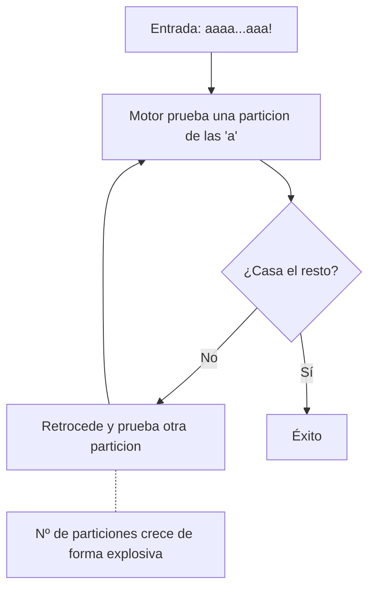

# Clase 019 — Expresiones regulares para análisis de logs y datos

> Parte: **0 — Fundamentos y prerrequisitos** · Fuente: *Friedl, Mastering Regular Expressions (O'Reilly)*
> ⏱️ Duración estimada: **100 min** · Nivel: **Fundamentos**

---

## 🎯 Objetivo

Dominar las expresiones regulares para extraer, validar y correlacionar información en logs, capturas y volcados de datos con precisión y velocidad. Las regex son omnipresentes en SIEM, IDS, reglas de detección, `grep` y prácticamente cualquier herramienta de análisis; saber escribirlas bien —y saber cuándo no usarlas— multiplica tu rendimiento como analista y te protege de patrones peligrosos que pueden colgar tu propio pipeline de análisis.

## 📚 Resultados de aprendizaje

Al finalizar, el alumno podrá:

1. **Construir** patrones con clases de caracteres, cuantificadores y anclas.
2. **Capturar** subcadenas con grupos, grupos con nombre y referencias.
3. **Extraer** IOCs (IPs, hashes, URLs, correos) de texto no estructurado.
4. **Aplicar** regex de forma coherente en `grep -P`, en Python (`re`) y en herramientas de análisis.
5. **Distinguir** codicia de pereza y elegir la variante correcta en cada extracción.
6. **Evitar** patrones vulnerables a ReDoS y otros errores frecuentes.

## 🗺️ Temas

| # | Tema | Por qué importa |
|---|------|-----------------|
| 1 | Literales y metacaracteres | La base de todo patrón |
| 2 | Clases de caracteres | `[...]`, `\d`, `\w`, `\s` |
| 3 | Cuantificadores | `*`, `+`, `?`, `{n,m}` |
| 4 | Anclas y límites | `^`, `$`, `\b` |
| 5 | Grupos y captura | `(...)`, alternancia, grupos con nombre |
| 6 | Codicia y pereza | `.*` frente a `.*?` |
| 7 | Extracción de IOCs | IPs, hashes, dominios, correos |
| 8 | ReDoS | Regex que se cuelgan por retroceso |

## 🧠 Explicación en profundidad

### Qué es realmente una regex: una máquina que recorre texto

Una expresión regular es una notación compacta para describir un **conjunto de cadenas**, que el motor traduce internamente a una máquina de estados que recorre el texto carácter a carácter intentando casar el patrón. Entender que hay un motor "andando" por el texto es la clave para todo lo demás: cada metacarácter no es magia, sino una instrucción sobre cómo debe avanzar o retroceder esa máquina. Los **literales** casan consigo mismos (`error` casa la palabra error), mientras que los **metacaracteres** (`. * + ? [ ] ( ) ^ $ \ |`) tienen significado especial y, cuando quieres tratarlos como texto normal, hay que escaparlos con `\` (por ejemplo `\.` para un punto literal, algo esencial al casar IPs o dominios).

### Clases, cuantificadores y anclas: los tres ejes

Casi todo patrón útil combina tres tipos de piezas. Las **clases de caracteres** dicen *qué* puede aparecer: `[a-f0-9]` es un dígito hexadecimal, y hay atajos como `\d` (dígito), `\w` (alfanumérico más guion bajo) y `\s` (espacio en blanco). Los **cuantificadores** dicen *cuántas veces*: `*` (cero o más), `+` (una o más), `?` (cero o una) y `{n,m}` (entre n y m). Las **anclas** dicen *dónde*: `^` (inicio de línea), `$` (fin de línea) y `\b` (límite de palabra), y son las que evitan coincidencias parciales indeseadas, como casar `192.168.1.1` dentro de `1192.168.1.1000`. El siguiente esquema descompone un patrón típico de hora en un log.

```text
  \b   \d{2}   :   \d{2}   :   \d{2}   \b
   |     |     |     |     |     |     |
límite  dos    lit. dos   lit. dos  límite
palabra dígitos ':' dígitos ':' dígitos palabra
        (hora)      (min)       (seg)
```

### Grupos y captura: quedarse con la parte útil

Casar no es lo mismo que **extraer**. Los grupos de captura `(...)` guardan la porción que coincidió para que puedas recuperarla después: en `Failed password for (\w+) from ([\d.]+)`, el grupo 1 te da el usuario y el grupo 2 la IP. Cuando quieres agrupar para aplicar un cuantificador pero no necesitas guardar el contenido, usas un grupo de no captura `(?:...)`, más eficiente. Y cuando el patrón tiene varios grupos, nombrarlos con `(?P<ip>...)` en Python hace el código legible y robusto frente a reordenaciones. Los grupos con nombre son la forma profesional de escribir un extractor de IOCs mantenible.

### Codicia frente a pereza: el error silencioso número uno

Por defecto, los cuantificadores son **codiciosos**: intentan casar lo máximo posible y luego retroceden solo lo justo para que el resto del patrón cuadre. Esto provoca el error más frecuente y silencioso: `<.*>` aplicado a `<a><b>` no casa `<a>`, sino `<a><b>` entero, porque `.*` se traga todo hasta el último `>`. La versión **perezosa** `<.*?>` casa lo mínimo, devolviendo `<a>` primero. La tabla lo hace evidente.

| Patrón | Entrada | Casa | Por qué |
|--------|---------|------|---------|
| `<.*>` | `<a><b>` | `<a><b>` | Codicioso: toma hasta el último `>` |
| `<.*?>` | `<a><b>` | `<a>` | Perezoso: toma hasta el primer `>` |
| `\d+` | `2024x` | `2024` | Codicioso pero acotado por la clase |
| `[^>]*` | `<a><b>` | (dentro) | Clase negada: alternativa sin pereza |

A menudo la mejor solución no es la pereza sino una **clase de caracteres negada** como `[^>]*`, que es más rápida y menos propensa a sorpresas porque no puede pasarse del delimitador.

### Extracción de IOCs y el arte de "suficientemente bueno"

En análisis de seguridad extraes **IOCs** (Indicators of Compromise): IPs, dominios, URLs, correos y hashes. Aquí conviene una lección de humildad: una regex perfecta para direcciones de correo según el RFC 5321 es monstruosa e inmantenible, y una para IPv4 que valide de verdad el rango 0-255 de cada octeto es engorrosa. La estrategia profesional es de dos fases: usar una regex razonable para **acotar candidatos** rápido (`\b(?:\d{1,3}\.){3}\d{1,3}\b` captura algo con forma de IP) y luego **validar con código** (el módulo `ipaddress` de Python confirma que sea una IP real y descarta `999.999.999.999`). Los hashes son un caso agradecido porque se distinguen por longitud: 32 hex son MD5, 40 son SHA-1 y 64 son SHA-256.

| Tipo de hash | Longitud en hex | Bits |
|--------------|-----------------|------|
| MD5 | 32 | 128 |
| SHA-1 | 40 | 160 |
| SHA-256 | 64 | 256 |

### ReDoS: cuando tu propia regex es la vulnerabilidad

Una regex mal construida puede tardar tiempo exponencial en fallar sobre ciertas entradas, un fenómeno llamado **retroceso catastrófico** que da lugar a un ataque de **ReDoS** (Regular Expression Denial of Service). Ocurre cuando hay cuantificadores anidados sobre patrones ambiguos, el caso escolar es `(a+)+$` frente a una cadena larga de `a` seguida de un carácter que no casa: el motor prueba una explosión combinatoria de formas de repartir las `a` antes de rendirse. Como analista esto te importa doble: no debes introducir estos patrones en tus propias herramientas de parseo de logs (un atacante podría enviar una línea de log diseñada para colgar tu SIEM), y debes reconocerlos al auditar reglas ajenas. El diagrama resume por qué el anidamiento explota.



La defensa es evitar cuantificadores anidados sobre solapamientos, preferir clases negadas específicas, anclar bien el patrón y, en entornos críticos, usar motores con garantía lineal.

## 📖 Definiciones y características

- **Metacarácter**: símbolo con significado especial en una regex (`. * + ? [ ] ( ) ^ $ \ |`). Para tratarlo como texto literal hay que escaparlo con `\`, algo imprescindible al casar puntos en IPs o dominios.
- **Clase de caracteres**: conjunto de caracteres permitidos entre corchetes (`[a-f0-9]`). Atajos frecuentes: `\d` (dígito), `\w` (alfanumérico más `_`), `\s` (espacio). Una clase negada `[^...]` casa cualquier cosa salvo lo indicado.
- **Cuantificador**: indica cuántas repeticiones (`*` cero o más, `+` una o más, `?` cero o una, `{n,m}` un rango). Por defecto son codiciosos.
- **Codicioso frente a perezoso**: un cuantificador codicioso (`.*`) toma lo máximo y retrocede; el perezoso (`.*?`) toma lo mínimo. Elegir mal "traga" texto de más; a menudo una clase negada es aún mejor opción.
- **Grupo de captura**: paréntesis `(...)` que guardan lo coincidido para reutilizarlo; `(?:...)` agrupa sin capturar y `(?P<nombre>...)` captura con nombre en Python, lo que hace el extractor legible.
- **Ancla**: posición sin consumir caracteres: `^` (inicio), `$` (fin), `\b` (límite de palabra). Evitan coincidencias parciales no deseadas.
- **Lookaround**: aserción que comprueba contexto sin consumirlo (`(?=...)` lookahead, `(?<=...)` lookbehind). Útil para extraer algo "seguido de" o "precedido por" sin incluir el contexto.
- **IOC (Indicator of Compromise)**: dato observable que sugiere actividad maliciosa (IP, dominio, URL, hash, correo). Las regex son la herramienta habitual para extraerlos de texto no estructurado.
- **ReDoS**: denegación de servicio provocada por una regex con retroceso catastrófico. Los cuantificadores anidados sobre patrones ambiguos son la causa típica y pueden colgar tu propio pipeline de análisis.

## 📔 Glosario

| Término | Definición concisa |
|---------|--------------------|
| Regex | Notación que describe un conjunto de cadenas |
| Literal | Carácter que casa consigo mismo |
| Metacarácter | Símbolo con significado especial en regex |
| `\d` `\w` `\s` | Atajos: dígito, alfanumérico, espacio |
| Clase negada | `[^...]`: casa todo salvo lo listado |
| Cuantificador | Nº de repeticiones (`*`, `+`, `?`, `{n,m}`) |
| Codicioso | Casa lo máximo y retrocede |
| Perezoso | Casa lo mínimo (`*?`) |
| Ancla | Posición sin consumir (`^`, `$`, `\b`) |
| Grupo de captura | `(...)` guarda lo coincidido |
| Grupo con nombre | `(?P<n>...)` en Python |
| Lookaround | Aserción de contexto sin consumir |
| IOC | Indicador de compromiso (IP, hash, URL...) |
| PCRE | Perl Compatible Regular Expressions |
| ReDoS | DoS por retroceso catastrófico de una regex |

## 🧰 Herramientas y preparación

Practica con `grep -P` (que activa el motor PCRE y entiende `\d`, `\b`, lookarounds), con el módulo `re` de Python, y con un entorno visual como **regex101.com** eligiendo el motor PCRE o Python para ver el árbol de coincidencias y, muy importante, el contador de pasos de retroceso que delata un patrón peligroso. Ten a mano un log real (`auth.log`, `access.log`) y una muestra de texto con IOCs conocidos para poder verificar tus extracciones contando a mano.

## 🧪 Laboratorio guiado

1. **Clases y cuantificadores**. Encuentra todas las horas `HH:MM:SS` en un log:

   ```bash
   grep -oP '\b\d{2}:\d{2}:\d{2}\b' auth.log | head
   ```

2. **Extraer IPv4** y contar las más frecuentes:

   ```bash
   grep -oP '\b(?:\d{1,3}\.){3}\d{1,3}\b' access.log | sort | uniq -c | sort -nr
   ```

3. **Grupos de captura en Python**:

   ```python
   import re
   m = re.search(r'Failed password for (\w+) from ([\d.]+)', linea)
   if m:
       usuario, ip = m.group(1), m.group(2)
   ```

4. **Extraer hashes por longitud**. Distingue MD5 (32), SHA-1 (40) y SHA-256 (64):

   ```bash
   grep -oP '\b[a-fA-F0-9]{64}\b' muestra.txt   # SHA-256
   ```

5. **Correos y URLs**. Escribe patrones razonables para extraer direcciones de correo y URLs `http(s)`, aceptando que no serán perfectas según el RFC.
6. **Codicia frente a pereza**. Compara `<.*>` y `<.*?>` sobre `<a><b>` y observa la diferencia; prueba también `[^>]*` como alternativa.
7. **Validar en regex101**: pega tus patrones, revisa el desglose y mide los pasos de retroceso para detectar riesgo de ReDoS.

> ⚠️ **Nota**: cuando construyas extractores para procesar logs de producción, trátalos como código de seguridad. Una línea de log manipulada por un atacante podría disparar un ReDoS y colgar tu análisis, así que valida tus patrones contra entradas adversas.

## ✍️ Ejercicios

1. Escribe una regex que extraiga solo IPs privadas (rangos 10/8, 172.16/12 y 192.168/16) de un log.
2. Captura usuario e IP de cada línea de "Failed password" y cuenta los intentos por IP.
3. Crea un patrón que valide un correo de forma razonable (sin perseguir la perfección del RFC) y explica sus límites.
4. Extrae todas las URLs de una página guardada y quédate solo con el dominio usando un grupo de captura.
5. Diferencia en una sola pasada MD5, SHA-1 y SHA-256 por su longitud, usando alternancia o grupos con nombre.
6. Investiga un ejemplo real de ReDoS (por ejemplo un patrón `(a+)+`), reprodúcelo en regex101 midiendo los pasos, y reescríbelo para hacerlo seguro.

## 📝 Reto verificable

Escribe `iocextract.py`, una herramienta que reciba un fichero de texto y extraiga y clasifique IOCs: IPv4, dominios, URLs, correos y hashes (MD5/SHA-1/SHA-256), imprimiendo un recuento por categoría y la lista deduplicada. Usa grupos con nombre y evita patrones vulnerables a ReDoS.

**Criterio de aceptación**: sobre una muestra con IOCs conocidos, la herramienta los extrae todos sin falsos positivos evidentes, clasifica correctamente los tres tipos de hash por su longitud, y deduplica la salida. El código no contiene cuantificadores anidados peligrosos. Verificable contando a mano los IOCs de la muestra y comparando.

## ⚠️ Errores comunes

| Síntoma / mensaje | Causa y cómo arreglar |
|-------------------|-----------------------|
| El patrón captura de más | Cuantificador codicioso. Usa la versión perezosa `*?` o, mejor, una clase negada como `[^>]*`. |
| `.` no coincide con lo esperado | `.` no incluye el salto de línea por defecto. Usa el flag DOTALL si necesitas abarcar varias líneas. |
| Falsos positivos en IPs (`999.999.999.999`) | El patrón no valida el rango 0-255. Extrae con regex y valida después con `ipaddress`. |
| `grep` no entiende `\d` | `grep` básico no es PCRE. Usa `grep -P`, o `-E` con clases POSIX (`[[:digit:]]`). |
| La regex cuelga el proceso | ReDoS por retroceso. Elimina cuantificadores anidados (`(a+)+`) y ancla bien el patrón. |
| El grupo devuelve `None` | El grupo opcional no casó. Comprueba que existió coincidencia antes de leer el grupo. |

## ❓ Preguntas frecuentes

**❓ ¿Debo validar IPs solo con regex?** La regex acota candidatos con rapidez, pero validar el rango exacto 0-255 de cada octeto con regex es engorroso y frágil. Es mejor extraer con regex y validar con código (`ipaddress` en Python).

**❓ ¿Por qué mi regex funciona en regex101 pero no en grep?** Los motores difieren. `grep` básico usa BRE/ERE; PCRE (regex101, Python) admite `\d`, lookarounds y más. Ajusta el patrón al motor real donde vas a ejecutarlo.

**❓ ¿Qué es un lookahead o lookbehind?** Aserciones que comprueban contexto sin consumirlo (`(?=...)`, `(?<=...)`). Sirven para extraer algo "seguido de" o "precedido por" sin incluir ese contexto en la coincidencia.

**❓ ¿Sirve regex para parsear HTML o JSON?** Para extracciones puntuales sí, pero para estructuras anidadas usa un parser dedicado. Las regex no manejan bien el anidamiento arbitrario y acabas con patrones frágiles y propensos a ReDoS.

## 🔗 Referencias

- Jeffrey Friedl, *Mastering Regular Expressions* (O'Reilly).
- Python, documentación de `re` — <https://docs.python.org/3/library/re.html>
- regex101 (probador interactivo con contador de pasos) — <https://regex101.com/>
- OWASP, *Regular Expression Denial of Service (ReDoS)* — <https://owasp.org/www-community/attacks/Regular_expression_Denial_of_Service_-_ReDoS>
- MITRE ATT&CK, *Indicator Removal / IOC* (contexto de indicadores) — <https://attack.mitre.org/>

## 📥 Material descargable

- 📄 [Guía en PDF](./clase-019-guia.pdf) — versión imprimible de esta clase.
- 🎞️ [Presentación (PPTX)](./clase-019-presentacion.pptx) — deck para proyectar en clase.

## ⬅️ Clase anterior

[Clase 018 — Git y control de versiones para profesionales de seguridad](../018-git-y-control-de-versiones-para-profesionales-de-seguridad/README.md)

## ➡️ Siguiente clase

[Clase 020 — Sistemas de numeración y encoding: binario, hex, base64 y URL](../020-sistemas-de-numeracion-y-encoding-binario-hex-base64-y-url/README.md)
