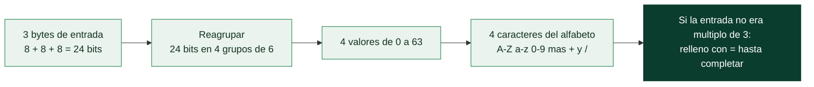
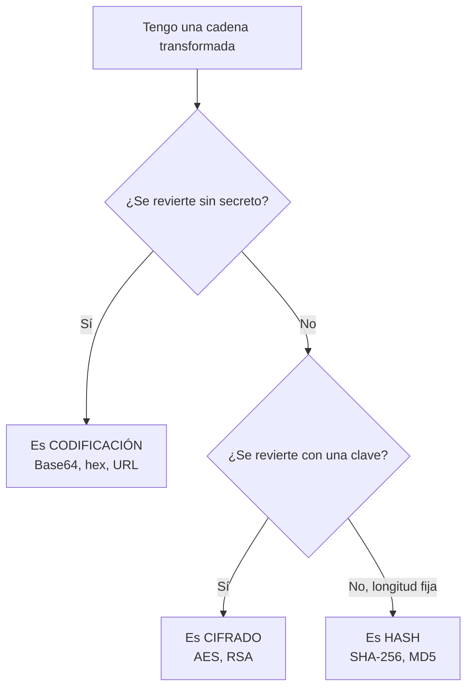

# Clase 020 — Sistemas de numeración y encoding: binario, hex, base64 y URL

> Parte: **0 — Fundamentos y prerrequisitos** · Fuente: *RFC 4648 (Base16/32/64) y RFC 3986 (URI)*
> ⏱️ Duración estimada: **90 min** · Nivel: **Fundamentos**

---

## 🎯 Objetivo

Entender cómo se representan y transforman los datos a bajo nivel, la base para leer volcados hexadecimales, decodificar payloads, ofuscar y desofuscar cargas y trabajar con protocolos. Al terminar distinguirás con criterio firme tres conceptos que se confunden constantemente y con consecuencias graves de seguridad: **codificación**, **cifrado** y **hashing**. Confundirlos lleva a errores tan reales como "proteger" contraseñas con Base64, y esta clase te vacuna contra ese error.

## 📚 Resultados de aprendizaje

Al finalizar, el alumno podrá:

1. **Convertir** entre binario, decimal, octal y hexadecimal con soltura.
2. **Explicar** la relación entre ASCII, Unicode y UTF-8, y la diferencia entre bytes y texto.
3. **Codificar y decodificar** en Base64, hexadecimal y URL/percent encoding.
4. **Distinguir** con criterio codificación, cifrado y hashing.
5. **Analizar** payloads codificados y en capas dentro de un contexto de seguridad.
6. **Detectar** heurísticamente el tipo de codificación de una cadena desconocida.

## 🗺️ Temas

| # | Tema | Por qué importa |
|---|------|-----------------|
| 1 | Bases numéricas | Binario y hex están en todas partes |
| 2 | Conversión entre bases | Leer memoria, direcciones, máscaras |
| 3 | ASCII, Unicode y UTF-8 | La frontera entre texto y bytes |
| 4 | Hex dump | Ver los datos crudos tal cual son |
| 5 | Base64 | Transportar binario como texto imprimible |
| 6 | URL/percent encoding | Datos en URLs y evasión de filtros web |
| 7 | Encoding vs. cifrado vs. hash | Distinción conceptual crítica |
| 8 | Cadenas de encoding | Payloads con varias capas |

## 🧠 Explicación en profundidad

### Bases numéricas: por qué el hex está en todas partes

Un mismo número puede escribirse en distintas **bases** sin cambiar su valor: `255` en decimal es `11111111` en binario y `FF` en hexadecimal. El binario es como piensa la máquina (bits), pero es incómodo de leer para un humano; el hexadecimal es el punto dulce porque cada dígito hex representa exactamente **4 bits** (un nibble), de modo que un byte completo son exactamente dos dígitos hex. Esa correspondencia limpia es la razón de que el hex domine en seguridad: direcciones de memoria, volcados de red, hashes, máscaras de red y códigos de color se expresan en hex porque se traduce a bits de un vistazo. El prefijo `0x` señala hexadecimal y `0b` binario. La siguiente tabla fija la correspondencia nibble a hex que conviene tener interiorizada.

| Decimal | Binario (nibble) | Hex |
|---------|------------------|-----|
| 0 | 0000 | 0 |
| 5 | 0101 | 5 |
| 10 | 1010 | A |
| 15 | 1111 | F |
| 255 | 1111 1111 | FF |

### De caracteres a bytes: ASCII, Unicode y UTF-8

Aquí vive una de las confusiones más persistentes: la diferencia entre un **carácter** y un **byte**. ASCII fue el mapeo original que asignaba a cada carácter un número de 7 bits (la `A` es 65, `0x41`), suficiente para el inglés. Unicode amplió la idea a un catálogo universal de más de un millón de *code points* que cubre casi todo idioma y emoji, pero Unicode es un catálogo abstracto, no dice cómo guardar esos números en bytes. Ahí entra **UTF-8**, la codificación que traduce cada code point Unicode a una secuencia de 1 a 4 bytes, con la elegancia de que el rango ASCII sigue ocupando un solo byte idéntico. La lección de seguridad es clara: cuando decodificas datos, primero tienes **bytes**, y solo se convierten en **texto** cuando aplicas una codificación de caracteres concreta. Tratar bytes como si ya fueran texto produce los "caracteres raros" que confunden a todo principiante, y en seguridad esa frontera importa porque un mismo byte puede interpretarse de formas distintas según la codificación asumida.

### Base64: transportar binario como texto (y por qué no es cifrado)

Muchos canales solo transportan texto imprimible con fiabilidad (cabeceras de correo, JSON, URLs), pero a menudo necesitas enviar datos binarios por ellos. **Base64** resuelve esto representando cada 3 bytes (24 bits) como 4 caracteres imprimibles elegidos de un alfabeto de 64 símbolos (A-Z, a-z, 0-9, `+`, `/`), con `=` como relleno. El precio es un aumento de tamaño de aproximadamente un tercio. El punto crítico, que hay que repetir hasta el cansancio, es que **Base64 no cifra nada**: es una transformación pública y reversible por cualquiera sin ninguna clave. Ver una cabecera `Authorization: Basic dXNlcjpwYXNz` no significa que las credenciales estén protegidas; se decodifican en un segundo. El diagrama muestra el empaquetado de 3 bytes en 4 caracteres.



De la geometría del diagrama sale la regla práctica para **reconocer** Base64 a
simple vista en un log o en una captura: la salida es siempre múltiplo de 4
caracteres, usa solo `A-Za-z0-9+/`, y si termina en `=` o `==` es que la entrada no
era múltiplo de 3 y se rellenó (un `=` significa que sobraban 2 bytes; dos `=`, que
sobraba 1). Cuidado con la variante **Base64URL**, que sustituye `+` y `/` por `-` y
`_` para poder viajar en una URL: la verás constantemente en tokens JWT.

### URL/percent encoding: datos seguros en una URL

Las URLs solo admiten un subconjunto de caracteres; los reservados o inseguros se sustituyen por `%XX`, siendo `XX` el valor hexadecimal del byte. Así `%20` es un espacio y `%3C` es `<`. Este mecanismo es funcional y omnipresente en la web, pero para un atacante también es una vía de **evasión de filtros**: un WAF que busca la cadena `<script>` puede no reconocer `%3Cscript%3E`, que el navegador o el servidor decodificarán al mismo `<script>`. Por eso, al analizar tráfico web sospechoso, decodificar el percent encoding suele ser el primer paso para ver el payload real.

### La distinción que lo cambia todo: encoding, cifrado y hash

Este es el corazón conceptual de la clase. **Codificar** es transformar datos de forma reversible **sin ningún secreto**, para transporte o compatibilidad: Base64, hex y URL encoding no aportan confidencialidad porque cualquiera revierte la operación. **Cifrar** es transformar datos de forma reversible **solo con una clave**, y su objetivo es la confidencialidad: sin la clave, no se recupera el original. **Hashear** es aplicar una función **unidireccional** que produce un valor de longitud fija del que no se puede recuperar la entrada; su objetivo es la integridad y la verificación, no ocultar datos recuperables. El error de tratar Base64 como cifrado, o de "revertir" un hash, nace de no tener clara esta tabla.

| Propiedad | Codificación | Cifrado | Hashing |
|-----------|--------------|---------|---------|
| Reversible | Sí, por cualquiera | Sí, con la clave | No |
| Requiere secreto | No | Sí (la clave) | No |
| Objetivo | Transporte/compatibilidad | Confidencialidad | Integridad/verificación |
| Ejemplos | Base64, hex, URL | AES, RSA, ChaCha20 | SHA-256, MD5, bcrypt |
| Da confidencialidad | No | Sí | No (no oculta recuperable) |



### Payloads en capas: desofuscar como un analista

En el mundo real los atacantes apilan codificaciones para evadir detección: un payload puede estar en Base64, y ese Base64 a su vez percent-encoded dentro de una URL. Analizarlo es pelar la cebolla capa a capa, identificando cada codificación por sus pistas (los `%XX` gritan URL encoding; una cadena de A-Za-z0-9 con `=` al final sugiere Base64; solo `[0-9a-f]` con longitud par sugiere hex). Herramientas como CyberChef permiten encadenar estas operaciones visualmente, pero la destreza clave es reconocer cada capa y saber que decodificar nunca revela un secreto protegido, solo desofusca algo que nunca estuvo cifrado.

## 📖 Definiciones y características

- **Hexadecimal**: sistema en base 16 (0-9, A-F). Cada dígito representa exactamente 4 bits (un nibble), por lo que un byte son dos dígitos hex. Se prefija con `0x` y domina en seguridad por su correspondencia limpia con los bits.
- **Nibble**: grupo de 4 bits, la mitad de un byte, que se corresponde con un único dígito hexadecimal. Es la unidad que hace del hex una notación tan cómoda.
- **ASCII**: mapeo original de caracteres a números de 7 bits (la `A` es 65). Cubre el inglés y es la base sobre la que se construyó Unicode; en UTF-8 los caracteres ASCII ocupan un solo byte idéntico.
- **Unicode y UTF-8**: Unicode es el catálogo abstracto de code points de casi todos los idiomas; UTF-8 es la codificación que los traduce a secuencias de 1 a 4 bytes. Distinguir el carácter (abstracto) del byte (concreto) es esencial para no producir texto corrupto.
- **Base64**: codificación que representa cada 3 bytes como 4 caracteres imprimibles de un alfabeto de 64 símbolos, con `=` de relleno. No cifra: es reversible por cualquiera y aumenta el tamaño en torno a un 33%.
- **URL/percent encoding**: sustitución de caracteres reservados por `%XX` (su valor hex). `%20` es espacio; se usa legítimamente en URLs y también para evadir filtros y WAFs en inyecciones web.
- **Codificación**: transformación reversible **sin secreto**, para transporte o compatibilidad. No aporta confidencialidad porque cualquiera la revierte; confundirla con cifrado es un error de seguridad frecuente.
- **Cifrado**: transformación reversible **solo con una clave**, cuyo objetivo es la confidencialidad. Sin la clave no se recupera el original.
- **Hashing**: función unidireccional que produce un valor de longitud fija irreversible. Verifica integridad y no oculta datos recuperables; "revertir" un hash es un sinsentido conceptual.

## 📔 Glosario

| Término | Definición concisa |
|---------|--------------------|
| Bit | Dígito binario, 0 o 1 |
| Byte | Grupo de 8 bits |
| Nibble | Grupo de 4 bits = un dígito hex |
| Base | Sistema de numeración (2, 8, 10, 16) |
| Hexadecimal | Base 16 (0-9, A-F), prefijo `0x` |
| ASCII | Mapeo de caracteres a 7 bits |
| Unicode | Catálogo universal de code points |
| UTF-8 | Codificación de Unicode en 1-4 bytes |
| Hex dump | Vista de datos crudos en hex y ASCII |
| Base64 | Binario como 64 caracteres imprimibles |
| Padding | Relleno `=` al final de un Base64 |
| Percent encoding | Sustitución `%XX` en URLs |
| Codificación | Transformación reversible sin secreto |
| Cifrado | Transformación reversible con clave |
| Hashing | Función unidireccional de longitud fija |
| CyberChef | Herramienta web para encadenar operaciones |

## 🧰 Herramientas y preparación

Trabajarás con `xxd` y `hexdump` para volcados hex, con `base64` para codificar y decodificar, con Python (`base64`, `binascii`, `urllib.parse`) para automatizar, y con **CyberChef** (<https://gchq.github.io/CyberChef/>) para experimentar visualmente encadenando operaciones ("recetas") sobre cadenas en capas. Todo está disponible en Kali o directamente en el navegador, así que no necesitas instalar nada especial.

## 🧪 Laboratorio guiado

1. **Conversión de bases** en Python:

   ```python
   n = 0xFF
   print(bin(n), oct(n), n)          # binario, octal, decimal
   print(int("11111111", 2), hex(255))
   ```

2. **Hex dump** de una cadena, relacionando cada byte con su carácter ASCII:

   ```bash
   echo -n "admin:1234" | xxd
   ```

3. **Base64 ida y vuelta**, comprobando que es trivialmente reversible:

   ```bash
   echo -n "usuario:secreto" | base64
   echo -n "dXN1YXJpbzpzZWNyZXRv" | base64 -d
   ```

4. **URL encoding** en Python:

   ```python
   from urllib.parse import quote, unquote
   print(quote("a b&c=1"))            # a%20b%26c%3D1
   print(unquote("%3Cscript%3E"))     # <script>
   ```

5. **Cadena de encodings**. En CyberChef, toma un texto, aplícale Base64 y después URL-encode; luego construye la receta inversa para revertirlo. Así ves cómo se pelan los payloads en capas.
6. **Diferenciar hashing**. Calcula el SHA-256 de `admin` y comprueba que **no** puedes recuperar `admin` a partir de él, a diferencia de lo que ocurre con Base64:

   ```bash
   echo -n "admin" | sha256sum
   ```

## ✍️ Ejercicios

1. Convierte a mano `192` y `168` a binario y a hexadecimal; verifica el resultado con Python.
2. Decodifica una cabecera HTTP `Authorization: Basic ...` (Base64) y explica por qué transmitirla sin TLS es un riesgo.
3. Determina si `5f4dcc3b5aa765d61d8327deb882cf99` es un hash o una codificación, y de qué tipo, razonando por su longitud y su alfabeto.
4. Toma un payload XSS y aplícale por separado URL encoding y HTML entity encoding; explica para qué sirve cada uno en un ataque y en una defensa.
5. Escribe una función que detecte heurísticamente si una cadena parece Base64, hex o URL-encoded, y justifica cada regla de detección.
6. Decodifica una cadena con doble Base64 y documenta cada capa que vas revelando.

## 📝 Reto verificable

Escribe `decoder.py`, una utilidad que reciba una cadena e intente detectar y decodificar automáticamente su capa externa (Base64, hex o percent encoding), aplicándolo de forma recursiva hasta obtener texto legible o datos binarios. Debe informar de cada capa detectada y **negarse** a "decodificar" un hash, explicando por qué es irreversible.

**Criterio de aceptación**: sobre una cadena con dos capas (por ejemplo el URL-encode de un Base64), la herramienta revela el texto original indicando ambas capas en orden; ante un SHA-256 responde que se trata de un hash irreversible en lugar de intentar decodificarlo. Todo reproducible y verificable con las mismas operaciones en CyberChef.

## ⚠️ Errores comunes

| Síntoma / mensaje | Causa y cómo arreglar |
|-------------------|-----------------------|
| Llamar "cifrado" a Base64 | Base64 es codificación reversible sin clave; no da confidencialidad. Corrige el concepto. |
| Base64 no decodifica (padding) | Faltan los `=` de relleno. Ajusta el padding o usa la variante URL-safe. |
| Caracteres raros al decodificar | Confundes bytes con texto. Trabaja en `bytes` y decodifica con la codificación de caracteres correcta. |
| Intentar "revertir" un hash | Los hashes no se revierten; a lo sumo se comparan o se atacan por diccionario/fuerza bruta. |
| URL encode/decode inconsistente | `+` frente a `%20` según el contexto (form-urlencoded vs. path). Usa la función adecuada a cada caso. |
| Detección de tipo equivocada | Una cadena hex también es Base64 válida. Aplica reglas por longitud, alfabeto y padding en orden. |

## ❓ Preguntas frecuentes

**❓ ¿Base64 aporta algo de seguridad?** No en términos de confidencialidad: cualquiera lo decodifica sin clave. Solo sirve para transportar binario por canales de texto. Nunca lo uses para "proteger" datos sensibles.

**❓ ¿Por qué los atacantes codifican los payloads?** Para evadir filtros, WAFs o detección por firma. Encontrar una cadena Base64, hex o URL-encoded en un log suele merecer decodificarla y analizar qué esconde.

**❓ ¿Hashing es lo mismo que cifrado?** No. El cifrado es reversible con clave y busca confidencialidad; el hash es unidireccional y busca integridad. Lo vemos a fondo en la Clase 021.

**❓ ¿Qué es CyberChef?** Una "navaja suiza" web para encadenar operaciones de codificación, cifrado y análisis en "recetas". Es ideal para desofuscar payloads en capas paso a paso y verificar tus propias herramientas.

## 🔗 Referencias

- RFC 4648, *The Base16, Base32, and Base64 Data Encodings* — <https://www.rfc-editor.org/rfc/rfc4648>
- RFC 3986, *Uniform Resource Identifier (URI): Generic Syntax* — <https://www.rfc-editor.org/rfc/rfc3986>
- The Unicode Standard (Unicode Consortium) — <https://home.unicode.org/>
- CyberChef (GCHQ) — <https://gchq.github.io/CyberChef/>
- Python, documentación de `base64` — <https://docs.python.org/3/library/base64.html>

## 📥 Material descargable

- 📄 [Guía en PDF](./clase-020-guia.pdf) — versión imprimible de esta clase.
- 🎞️ [Presentación (PPTX)](./clase-020-presentacion.pptx) — deck para proyectar en clase.

## ⬅️ Clase anterior

[Clase 019 — Expresiones regulares para análisis de logs y datos](../019-expresiones-regulares-para-analisis-de-logs-y-datos/README.md)

## ➡️ Siguiente clase

[Clase 021 — Criptografía: conceptos fundamentales e intuición](../021-criptografia-conceptos-fundamentales-e-intuicion/README.md)
