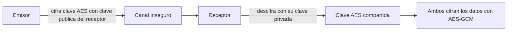
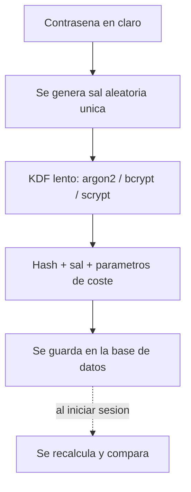

# Clase 021 — Criptografía: conceptos fundamentales e intuición

> Parte: **0 — Fundamentos y prerrequisitos** · Fuente: *Ferguson, Schneier & Kohno, Cryptography Engineering*
> ⏱️ Duración estimada: **120 min** · Nivel: **Fundamentos**

---

## 🎯 Objetivo

Construir la intuición criptográfica que sostiene silenciosamente casi todo lo que hacemos en seguridad: TLS que protege el tráfico web, firmas que garantizan la procedencia de un binario, autenticación de usuarios y almacenamiento seguro de contraseñas. Al terminar entenderás con soltura el cifrado simétrico y asimétrico, las funciones hash, HMAC, las firmas digitales y el intercambio de claves, y —sobre todo— habrás interiorizado la regla que separa a un profesional de un aficionado peligroso: "nunca inventes tu propia cripto". No perseguimos las matemáticas avanzadas que hay debajo, sino el criterio para elegir y combinar las primitivas correctas sin abrir agujeros invisibles.

## 📚 Resultados de aprendizaje

Al finalizar, el alumno podrá:

1. **Distinguir** el cifrado simétrico del asimétrico, sus costes y por qué se combinan en la práctica.
2. **Explicar** qué es una función hash criptográfica, sus tres propiedades de seguridad y qué significa que MD5 o SHA-1 estén "rotos".
3. **Diferenciar** el hashing de contraseñas (bcrypt, scrypt, argon2) de un hash genérico y justificar por qué SHA-256 "pelado" no sirve.
4. **Describir** cómo HMAC, las firmas digitales y el intercambio de claves aportan integridad, autenticidad y no repudio.
5. **Aplicar** las primitivas adecuadas mediante una librería confiable, sin reimplementar algoritmos.
6. **Reconocer** los errores clásicos (nonce reutilizado, cifrar sin autenticar, algoritmos obsoletos) antes de cometerlos.

## 🗺️ Temas

| # | Tema | Por qué importa |
|---|------|-----------------|
| 1 | Terminología (CIA) | Confidencialidad, integridad y autenticidad son objetivos distintos |
| 2 | Cifrado simétrico | AES, modos de operación, IV/nonce |
| 3 | Cifrado asimétrico | RSA, ECC, el par de claves y la distribución |
| 4 | Funciones hash | SHA-2/SHA-3, efecto avalancha, colisiones |
| 5 | Hash de contraseñas | bcrypt, scrypt, argon2, sal y factor de coste |
| 6 | HMAC y MAC | Integridad autenticada con clave compartida |
| 7 | Firmas digitales | Autenticidad, integridad y no repudio |
| 8 | Intercambio de claves | Diffie-Hellman, PKI y confianza |

## 🧠 Explicación en profundidad

### Los tres objetivos: confidencialidad, integridad y autenticidad

Antes de hablar de algoritmos conviene fijar qué queremos proteger, porque cada primitiva resuelve un problema distinto y confundirlos es la raíz de casi todos los diseños inseguros. La **confidencialidad** impide que un tercero lea el contenido; es lo que aporta el cifrado. La **integridad** garantiza que el mensaje no fue alterado en tránsito ni una sola vez. La **autenticidad** prueba quién lo originó. Un error habitual de principiante es asumir que cifrar un mensaje también lo protege de manipulación: no es así. Un atacante que no puede leer un texto cifrado todavía puede voltear bits y corromperlo de formas controladas si el modo de cifrado no incluye autenticación. Por eso la criptografía moderna favorece construcciones que dan confidencialidad **e** integridad a la vez (cifrado autenticado), en lugar de la confidencialidad a secas.

### Cifrado simétrico: rápido, pero con el problema de la clave

En el cifrado simétrico la misma clave secreta cifra y descifra. El estándar de facto es **AES** (Advanced Encryption Standard), un cifrado por bloques de 128 bits con claves de 128, 192 o 256 bits. AES por sí solo cifra un único bloque; para cifrar un mensaje de longitud arbitraria se usa un **modo de operación**. Aquí es donde entra el matiz de seguridad: el modo ECB cifra cada bloque de forma independiente y filtra patrones del texto plano (bloques idénticos producen cifrados idénticos), por lo que está proscrito. Los modos correctos introducen un **IV (vector de inicialización)** o un **nonce** aleatorio o único que hace que cifrar dos veces el mismo mensaje produzca cifrados distintos. El modo recomendado hoy es **AES-GCM**, que además de cifrar produce una etiqueta de autenticación: si alguien altera un solo byte del cifrado, el descifrado falla en vez de devolver basura. La gran ventaja del cifrado simétrico es la velocidad; su talón de Aquiles es la **distribución de la clave**: si dos partes que nunca se han visto necesitan una clave compartida, ¿cómo se la intercambian sin que un espía la capture? Ese problema lo resuelve la criptografía asimétrica.

### Cifrado asimétrico: resolver la distribución de claves

El cifrado asimétrico usa un **par de claves** matemáticamente relacionadas: una **pública**, que se puede publicar libremente, y una **privada**, que se guarda en secreto. Lo cifrado con la pública solo se descifra con la privada, y viceversa. Los dos grandes exponentes son **RSA**, basado en la dificultad de factorizar números enormes, y la **criptografía de curva elíptica (ECC)**, basada en el logaritmo discreto sobre curvas. ECC ofrece el mismo nivel de seguridad que RSA con claves mucho más pequeñas (una clave ECC de 256 bits equivale grosso modo a una RSA de 3072 bits), por lo que es la opción preferida en dispositivos y protocolos modernos. El cifrado asimétrico es órdenes de magnitud más lento que el simétrico, así que en la práctica no se cifran datos grandes con él: se usa para **intercambiar o transportar una clave simétrica** y a partir de ahí se cifra el grueso del tráfico con AES. Este patrón híbrido es exactamente lo que hace TLS en cada conexión HTTPS.



### Funciones hash: la huella digital de los datos

Una **función hash criptográfica** toma una entrada de cualquier tamaño y produce una salida corta de longitud fija (por ejemplo, 256 bits en SHA-256) que actúa como huella digital. Debe cumplir tres propiedades: **resistencia a preimagen** (dado un hash, es inviable encontrar una entrada que lo produzca), **resistencia a segunda preimagen** (dado un mensaje, es inviable encontrar otro distinto con el mismo hash) y **resistencia a colisiones** (es inviable encontrar dos mensajes cualesquiera con el mismo hash). El **efecto avalancha** hace que cambiar un solo bit de la entrada altere aproximadamente la mitad de los bits de salida, de modo que la huella no revela nada sobre cuán parecidas eran dos entradas. Cuando decimos que **MD5 y SHA-1 están "rotos"** nos referimos a que se han encontrado colisiones prácticas: un atacante puede fabricar dos archivos distintos con el mismo hash, lo que invalida su uso para integridad y firmas. Hoy se usan **SHA-256/SHA-512** (familia SHA-2) o **SHA-3**. Un punto crítico: una función hash por sí sola verifica integridad frente a errores accidentales, pero **no** frente a un atacante activo, porque quien altera el mensaje puede recalcular el hash. Para protegerse de un adversario hace falta una clave: eso es HMAC.

### Hash de contraseñas: por qué SHA-256 no sirve

Almacenar contraseñas es un caso especial que confunde a mucha gente. Nunca se guarda la contraseña en claro ni se "cifra" (cifrar es reversible con la clave). Se guarda un **hash**, pero **no** un hash rápido como SHA-256. El problema es precisamente la velocidad: una GPU moderna calcula miles de millones de SHA-256 por segundo, así que un atacante con la base de datos filtrada prueba diccionarios enteros en minutos. La solución tiene dos piezas. La **sal (salt)** es un valor aleatorio único por contraseña que se almacena junto al hash; impide las tablas precomputadas (rainbow tables) y evita que dos usuarios con la misma contraseña tengan el mismo hash. El **factor de coste** hace la función deliberadamente lenta y ajustable: algoritmos como **bcrypt**, **scrypt** y **argon2** están diseñados para consumir tiempo (y, en scrypt/argon2, también memoria), de modo que cada intento le cueste al atacante. Argon2 es el ganador de la Password Hashing Competition y la recomendación actual de OWASP para nuevos sistemas.



### HMAC, firmas e intercambio de claves

**HMAC** combina una función hash con una clave secreta para producir un código de autenticación de mensaje (MAC). Garantiza a la vez integridad y autenticidad: solo quien conoce la clave puede generar o verificar la etiqueta, así que un atacante no puede alterar el mensaje y recalcular el MAC. Es simétrico: emisor y receptor comparten la clave. La **firma digital** resuelve el mismo problema en el mundo asimétrico y añade **no repudio**: se calcula el hash del mensaje y se "cifra" ese hash con la clave **privada** del firmante; cualquiera verifica la firma con la clave **pública**. Como solo el dueño de la privada pudo firmarla, este no puede negar la autoría después. Finalmente, el **intercambio de claves Diffie-Hellman** permite a dos partes acordar una clave simétrica compartida a través de un canal público sin transmitir jamás la clave: cada uno combina su secreto privado con el público del otro y ambos llegan al mismo valor, que un espía no puede reconstruir. La **PKI (infraestructura de clave pública)** y sus certificados atan una clave pública a una identidad verificada por una autoridad de certificación, resolviendo la pregunta de fondo: "¿esta clave pública es realmente de quien dice ser?".

## 📖 Definiciones y características

- **Cifrado simétrico**: esquema donde la misma clave cifra y descifra (AES). Es rápido y apto para grandes volúmenes de datos, pero exige distribuir la clave secreta de forma segura entre las partes, lo que constituye su principal reto operativo.
- **Cifrado asimétrico**: esquema con un par de claves pública/privada (RSA, ECC). Resuelve la distribución de claves porque la pública se publica sin riesgo, a cambio de un coste computacional mucho mayor; por eso se usa para intercambiar claves simétricas, no para cifrar datos masivos.
- **Función hash criptográfica**: mapeo unidireccional de datos arbitrarios a una huella de longitud fija (SHA-256). Verifica integridad y es la base de firmas y estructuras como blockchains; MD5 y SHA-1 quedaron obsoletos por colisiones prácticas.
- **Sal (salt)**: valor aleatorio único que se añade a cada contraseña antes de aplicar el KDF. Neutraliza las rainbow tables y garantiza que contraseñas idénticas produzcan hashes distintos, cerrando un canal de fuga clásico.
- **KDF de contraseñas**: función de derivación deliberadamente lenta y costosa (bcrypt, scrypt, argon2) pensada para resistir fuerza bruta. Su factor de coste ajustable permite endurecer el sistema conforme aumenta la potencia de cálculo del atacante.
- **HMAC**: código de autenticación de mensaje construido sobre una función hash y una clave secreta. Aporta integridad **y** autenticidad simultáneamente, algo que un hash simple no puede lograr frente a un adversario activo.
- **Firma digital**: hash del mensaje transformado con la clave privada del firmante. Prueba autoría (autenticidad), que el contenido no cambió (integridad) y que el firmante no puede desdecirse (no repudio).
- **Cifrado autenticado (AEAD)**: modo que combina confidencialidad e integridad en una sola operación (AES-GCM, ChaCha20-Poly1305). Detecta cualquier manipulación del cifrado y es hoy el modo por defecto recomendado.
- **Nonce / IV**: valor único (o aleatorio) por mensaje que aleatoriza el cifrado. Reutilizarlo en modos como GCM es catastrófico: puede filtrar el texto plano o la clave de autenticación.
- **Diffie-Hellman**: protocolo que permite a dos partes acordar una clave compartida sobre un canal público sin transmitirla. Es la base del secreto hacia adelante (forward secrecy) en TLS moderno.

## 📔 Glosario

| Término | Definición concisa |
|---------|--------------------|
| AES | Cifrado por bloques simétrico estándar, claves de 128/192/256 bits |
| RSA | Cifrado/firma asimétrico basado en la factorización de enteros grandes |
| ECC | Criptografía de curva elíptica; misma seguridad con claves más pequeñas |
| Hash | Huella de longitud fija de una entrada arbitraria |
| Colisión | Dos entradas distintas que producen el mismo hash |
| Efecto avalancha | Un cambio mínimo en la entrada altera medio hash de salida |
| Sal (salt) | Valor aleatorio por contraseña contra tablas precomputadas |
| KDF | Función de derivación de clave, lenta a propósito para contraseñas |
| bcrypt/scrypt/argon2 | Algoritmos de hash de contraseñas con factor de coste |
| MAC | Código de autenticación de mensaje con clave secreta |
| HMAC | MAC construido sobre una función hash |
| AEAD | Cifrado autenticado con datos asociados (AES-GCM) |
| Nonce/IV | Valor único por mensaje que aleatoriza el cifrado |
| No repudio | Propiedad que impide negar la autoría de una firma |
| PKI | Infraestructura que ata claves públicas a identidades vía certificados |
| PQC | Criptografía post-cuántica, resistente a computadores cuánticos |

## 🧰 Herramientas y preparación

Trabajaremos con Python y la librería **cryptography** de PyCA, que expone primitivas auditadas y seguras por defecto, además del módulo estándar `hashlib`. Para contraseñas usaremos `bcrypt` y `argon2-cffi`. Instala en tu entorno virtual:

```bash
pip install cryptography bcrypt argon2-cffi
```

También conviene tener **openssl** en línea de comandos para experimentar con claves y firmas RSA. La **regla de oro** que gobierna toda esta clase: usa librerías establecidas y mantenidas, nunca implementaciones caseras de las primitivas. La criptografía falla en silencio; un algoritmo mal implementado sigue produciendo salida de aspecto correcto mientras es completamente inseguro.

## 🧪 Laboratorio guiado

1. **Hash e integridad**. Calcula el hash de un mensaje y observa el efecto avalancha:

   ```python
   import hashlib
   print(hashlib.sha256(b"mensaje").hexdigest())
   print(hashlib.sha256(b"mensahe").hexdigest())
   ```

   Cambia un solo carácter y compara: verás que la salida cambia por completo, sin parecido con la anterior.

2. **Por qué MD5/SHA-1 no valen**. Investiga las colisiones documentadas de MD5 y el ataque SHAttered contra SHA-1. Razona por qué una colisión práctica invalida su uso para integridad y firmas, aunque el hash "parezca" seguir funcionando.

3. **Cifrado simétrico autenticado con AES-GCM** vía `cryptography`:

   ```python
   from cryptography.hazmat.primitives.ciphers.aead import AESGCM
   import os
   key = AESGCM.generate_key(bit_length=256)
   aes = AESGCM(key)
   nonce = os.urandom(12)
   ct = aes.encrypt(nonce, b"secreto", None)
   print(aes.decrypt(nonce, ct, None))
   ```

   El nonce debe ser único por mensaje. Prueba a alterar un byte de `ct` antes de descifrar y observa que la operación lanza una excepción en vez de devolver datos corruptos.

4. **Hash de contraseñas con sal**:

   ```python
   import bcrypt
   h = bcrypt.hashpw(b"Contrasena1", bcrypt.gensalt())
   print(bcrypt.checkpw(b"Contrasena1", h))
   print(bcrypt.checkpw(b"incorrecta", h))
   ```

   Compara con hashear la misma contraseña con SHA-256 "pelado" y razona por qué esto último es inseguro.

5. **HMAC para integridad autenticada**. Genera un HMAC de un mensaje con una clave compartida y verifica que, si alteras el mensaje, la verificación falla:

   ```python
   import hmac, hashlib
   clave = b"clave-secreta"
   etiqueta = hmac.new(clave, b"transferir 100", hashlib.sha256).hexdigest()
   print(etiqueta)
   ```

6. **Claves asimétricas y firma**. Genera un par RSA con openssl y firma/verifica un archivo:

   ```bash
   openssl genrsa -out priv.pem 2048
   openssl rsa -in priv.pem -pubout -out pub.pem
   openssl dgst -sha256 -sign priv.pem -out firma archivo
   openssl dgst -sha256 -verify pub.pem -signature firma archivo
   ```

## ✍️ Ejercicios

1. Explica con un ejemplo concreto cuándo usarías cifrado simétrico y cuándo asimétrico, y por qué TLS combina ambos en cada conexión.
2. Enumera las tres propiedades de seguridad de una función hash criptográfica y explica qué protege cada una.
3. Justifica por qué SHA-256 no es adecuado para almacenar contraseñas y qué debe usarse en su lugar, mencionando el papel de la sal y del factor de coste.
4. Describe cómo una firma digital aporta a la vez integridad, autenticidad y no repudio, y en qué se diferencia de un HMAC.
5. Explica el papel del IV/nonce en un cifrado y qué puede ocurrir si se reutiliza en un modo como AES-GCM.
6. Investiga cómo Diffie-Hellman permite que dos partes acuerden una clave compartida sin transmitirla, y qué es el "secreto hacia adelante" (forward secrecy).
7. Compara RSA y ECC en tamaño de clave y rendimiento, y explica por qué ECC se prefiere en dispositivos modernos.

## 📝 Reto verificable

Implementa `securebox.py`, una herramienta de línea de comandos que cifre y descifre un archivo con **AES-GCM**, derivando la clave de una contraseña mediante un KDF adecuado (scrypt o argon2) con sal aleatoria, y verificando la integridad al descifrar. La herramienta debe almacenar junto al cifrado la sal y el nonce necesarios para descifrar, y fallar de forma clara si el archivo fue manipulado o la contraseña es incorrecta.

**Criterio de aceptación**: un archivo cifrado y luego descifrado con la contraseña correcta se recupera idéntico (mismo SHA-256 que el original); alterar un solo byte del cifrado o usar una contraseña errónea produce un **error de autenticación explícito**, nunca datos corruptos entregados en silencio. La solución debe apoyarse en la librería PyCA cryptography, sin implementar cripto casera.

## ⚠️ Errores comunes

| Síntoma / mensaje | Causa y cómo arreglar |
|-------------------|-----------------------|
| Almacenar contraseñas con SHA-256 sin sal | Vulnerable a rainbow tables y cracking por GPU. Usa bcrypt/scrypt/argon2 con sal. |
| Reutilizar el nonce en AES-GCM | Rompe la confidencialidad y puede filtrar la clave de autenticación. Genera un nonce único por mensaje. |
| Implementar AES o RSA "a mano" | Errores sutiles (timing, padding) que pasan inadvertidos = inseguro. Usa librerías auditadas. |
| Usar MD5/SHA-1 para firmas o integridad | Rotos por colisiones prácticas. Migra a SHA-256/SHA-3. |
| Cifrar sin autenticar (solo AES-CBC) | Permite manipulación indetectable del cifrado. Usa AEAD (GCM) o encrypt-then-MAC. |
| Confundir cifrar con hashear una contraseña | Cifrar es reversible; una contraseña se guarda con un KDF de un solo sentido. |
| IV o nonce predecible o fijo | Deja patrones explotables. Genera valores aleatorios con un CSPRNG (`os.urandom`). |

## ❓ Preguntas frecuentes

**❓ ¿Por qué "no inventes tu propia cripto"?** Porque las primitivas son fáciles de implementar mal de formas invisibles pero catastróficas: fugas por tiempo de ejecución, padding mal validado, nonces reutilizados, generadores de aleatoriedad débiles. Las librerías establecidas han sido auditadas por expertos durante años y cierran esos flancos por ti.

**❓ ¿Cifrado o hashing para contraseñas?** Ninguno de los dos a secas. Se usa un **hash de contraseñas** lento y con sal (bcrypt/scrypt/argon2), diseñado específicamente para resistir la fuerza bruta. Cifrar sería reversible y guardar la clave junto a los datos anula la protección.

**❓ ¿RSA está obsoleto?** No, sigue siendo seguro con tamaños de clave adecuados, pero la criptografía de curva elíptica (ECC) ofrece la misma seguridad con claves mucho más pequeñas y mejor rendimiento, por lo que es preferida en diseños nuevos. Ambos conviven en la infraestructura actual.

**❓ ¿Qué es la criptografía post-cuántica?** Son algoritmos diseñados para resistir a un computador cuántico capaz de romper RSA y ECC mediante el algoritmo de Shor. El NIST ya ha estandarizado los primeros esquemas PQC (como ML-KEM y ML-DSA); es un tema emergente que aquí solo introducimos para que conozcas su existencia.

**❓ ¿Un hash sirve para verificar que un archivo no fue manipulado por un atacante?** Solo si el hash de referencia llega por un canal confiable e independiente. Frente a un adversario que controla el canal, necesitas un HMAC (clave compartida) o una firma digital (clave pública verificada), no un hash a secas.

## 🔗 Referencias

- Ferguson, Schneier & Kohno, *Cryptography Engineering*.
- PyCA `cryptography` — <https://cryptography.io/>
- NIST Cryptographic Standards and Guidelines — <https://csrc.nist.gov/projects/cryptographic-standards-and-guidelines>
- NIST FIPS 197 (AES) — <https://csrc.nist.gov/pubs/fips/197/final>
- OWASP Password Storage Cheat Sheet — <https://cheatsheetseries.owasp.org/cheatsheets/Password_Storage_Cheat_Sheet.html>
- RFC 2104 (HMAC) — <https://www.rfc-editor.org/rfc/rfc2104>

## 📥 Material descargable

- 📄 [Guía en PDF](./clase-021-guia.pdf) — versión imprimible de esta clase.
- 🎞️ [Presentación (PPTX)](./clase-021-presentacion.pptx) — deck para proyectar en clase.

## ⬅️ Clase anterior

[Clase 020 — Sistemas de numeración y encoding: binario, hex, base64 y URL](../020-sistemas-de-numeracion-y-encoding-binario-hex-base64-y-url/README.md)

## ➡️ Siguiente clase

[Clase 022 — Docker y contenedores para laboratorios de seguridad](../022-docker-y-contenedores-para-laboratorios-de-seguridad/README.md)
