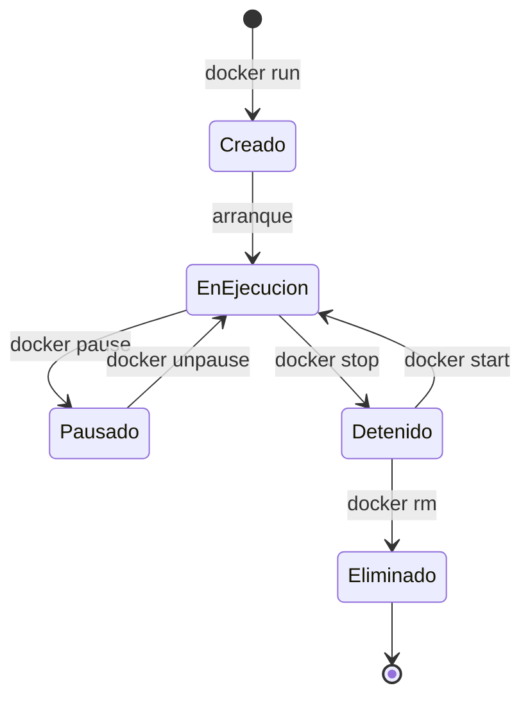
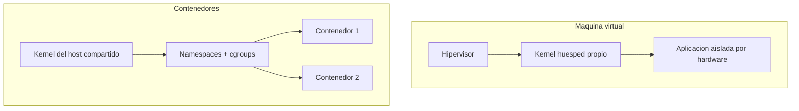

# Clase 022 — Docker y contenedores para laboratorios de seguridad

> Parte: **0 — Fundamentos y prerrequisitos** · Fuente: *Docker Documentation / NIST SP 800-190*
> ⏱️ Duración estimada: **110 min** · Nivel: **Fundamentos**

---

## 🎯 Objetivo

Aprender a usar contenedores para desplegar entornos vulnerables y herramientas de seguridad de forma rápida, reproducible y desechable, que es exactamente lo que necesita un laboratorio de práctica. Al terminar sabrás construir imágenes con un Dockerfile, ejecutar y gestionar contenedores desde la CLI, orquestar varios servicios con Docker Compose y —tan importante como lo anterior— comprender el modelo de aislamiento de contenedores, sus límites reales frente a una máquina virtual y qué implica eso cuando manipulas software deliberadamente inseguro.

## 📚 Resultados de aprendizaje

Al finalizar, el alumno podrá:

1. **Ejecutar** y gestionar contenedores con la CLI de Docker (run, ps, exec, logs, stop, rm).
2. **Construir** imágenes propias con un Dockerfile y entender cómo funcionan las capas y la caché.
3. **Orquestar** varios servicios interconectados con un archivo de Docker Compose.
4. **Desplegar** laboratorios vulnerables (DVWA, Juice Shop) de forma aislada y reproducible.
5. **Explicar** el modelo de aislamiento por namespaces y cgroups y sus límites frente a una VM.
6. **Aplicar** buenas prácticas básicas de seguridad de contenedores (usuario no root, imagen mínima, escaneo).

## 🗺️ Temas

| # | Tema | Por qué importa |
|---|------|-----------------|
| 1 | Imágenes vs. contenedores | Distinguir plantilla inmutable de instancia viva |
| 2 | CLI de Docker | run, ps, exec, logs, stop: el flujo diario |
| 3 | Dockerfile | Construir imágenes propias reproducibles |
| 4 | Volúmenes y redes | Persistencia de datos y conectividad entre contenedores |
| 5 | Docker Compose | Levantar un laboratorio multi-servicio con un comando |
| 6 | Labs vulnerables | Entornos de práctica reproducibles y desechables |
| 7 | Aislamiento | Namespaces y cgroups: la base del contenedor |
| 8 | Seguridad de contenedores | Superficie de ataque y buenas prácticas |

## 🧠 Explicación en profundidad

### Imagen y contenedor: plantilla e instancia

La distinción más importante y a la vez la más malentendida es la que separa una **imagen** de un **contenedor**. Una imagen es un artefacto inmutable y de solo lectura: un empaquetado en capas que contiene un sistema de archivos con el software, sus dependencias y la configuración necesaria para arrancar. Un contenedor es una **instancia en ejecución** de una imagen, con una fina capa de escritura por encima donde se registran los cambios que ocurren mientras vive. La analogía clásica es la de una clase y sus objetos en programación, o la de un ejecutable en disco y el proceso que nace al lanzarlo. De una misma imagen puedes arrancar diez contenedores idénticos e independientes. Y —este es el punto clave para un laboratorio— un contenedor es **efímero por diseño**: lo creas para una prueba, lo destruyes y todo cambio en su capa de escritura desaparece, dejándote un entorno limpio para la siguiente. Esa desechabilidad es justo lo que quieres cuando practicas con software malicioso o vulnerable.

### El ciclo de vida en la CLI

El trabajo diario con Docker gira en torno a un puñado de comandos. `docker run` crea y arranca un contenedor a partir de una imagen (descargándola del registro si no está local); `docker ps` lista los contenedores en ejecución; `docker exec` abre un proceso dentro de un contenedor vivo (típicamente una shell para inspeccionarlo); `docker logs` muestra su salida estándar; `docker stop` lo detiene ordenadamente y `docker rm` lo elimina. Comprender este ciclo —crear, inspeccionar, detener, destruir— es la base sobre la que se apoya todo lo demás. Las banderas más frecuentes son `-d` para ejecutar en segundo plano, `-p host:contenedor` para publicar puertos y `--name` para dar un nombre manejable en lugar del identificador aleatorio.



### Dockerfile: recetas reproducibles

Un **Dockerfile** es una receta declarativa, línea a línea, para construir una imagen. Cada instrucción (`FROM`, `COPY`, `RUN`, `ENTRYPOINT`) genera una **capa** que se apila sobre la anterior, y Docker cachea esas capas: si no cambia una instrucción ni sus insumos, reutiliza la capa ya construida, acelerando enormemente las reconstrucciones. Este mecanismo tiene dos consecuencias prácticas. Primera, el **orden importa**: conviene poner al principio lo que cambia poco (instalar dependencias del sistema) y al final lo que cambia a menudo (copiar tu código), para maximizar los aciertos de caché. Segunda, la **elección de la imagen base** determina el tamaño y la superficie de ataque: partir de una base `slim` o `alpine` en lugar de una completa reduce megabytes y también el número de paquetes con posibles CVEs. Un Dockerfile bien escrito es la diferencia entre un laboratorio que otro alumno reproduce en segundos y uno que "solo funciona en mi máquina".

### Volúmenes, redes y Compose

Como el contenedor es efímero, cualquier dato que deba sobrevivir a su destrucción tiene que vivir en un **volumen**: un almacenamiento gestionado por Docker, independiente del ciclo de vida del contenedor, que se monta en una ruta interna. Sin volumen, recrear un contenedor de base de datos borra todos sus datos. Para la comunicación, Docker crea **redes** virtuales donde los contenedores se descubren entre sí por su nombre de servicio, de modo que un contenedor "atacante" puede alcanzar a la "víctima" sin exponer nada al exterior. Cuando un laboratorio necesita varios contenedores coordinados —una aplicación web, su base de datos y quizá un contenedor de herramientas— escribirlos y lanzarlos a mano es tedioso y frágil. **Docker Compose** resuelve esto declarando todos los servicios, sus redes y volúmenes en un único archivo `compose.yml`; un solo `docker compose up` levanta el laboratorio completo y `docker compose down` lo desmonta sin dejar rastro.

### Aislamiento: contenedor frente a máquina virtual

Aquí está el concepto de seguridad más importante de la clase, y el que más se malinterpreta. Un contenedor **no** es una máquina virtual. Una VM ejecuta un sistema operativo huésped completo sobre un hipervisor, con su propio kernel, y el aislamiento lo garantiza el hardware de virtualización. Un contenedor, en cambio, **comparte el kernel del host** y se apoya en dos características del propio kernel de Linux: los **namespaces**, que dan a cada contenedor su propia vista aislada de procesos, red, usuarios y sistema de archivos, y los **cgroups** (control groups), que limitan cuántos recursos (CPU, memoria) puede consumir. Es un aislamiento real y útil, pero más débil que el de una VM: una vulnerabilidad de escape que abuse del kernel compartido puede sacar a un atacante del contenedor al host. La regla práctica que se deriva de esto: para labs web reproducibles y herramientas, los contenedores son ideales por su rapidez; para analizar malware capaz de explotar el kernel o para el máximo aislamiento, se prefiere una VM. Ambos se complementan, no compiten.



## 📖 Definiciones y características

- **Imagen**: plantilla inmutable y en capas con el software y su entorno de ejecución. Se versiona mediante tags y sirve de base para crear contenedores; su elección determina tamaño y superficie de ataque.
- **Contenedor**: instancia en ejecución de una imagen, con una capa de escritura efímera. Es rápido de crear y destruir, lo que lo hace ideal para laboratorios desechables que siempre parten de un estado limpio.
- **Dockerfile**: receta declarativa que describe cómo construir una imagen paso a paso. Aporta reproducibilidad y control exacto de lo que se instala; el orden de sus instrucciones afecta a la eficiencia de la caché de capas.
- **Volumen**: almacenamiento persistente gestionado por Docker, independiente del contenedor. Permite que datos como los de una base de datos sobrevivan a la recreación o destrucción del contenedor.
- **Namespaces**: mecanismo del kernel que da a cada contenedor una vista aislada de procesos, red, usuarios y sistema de archivos. Es una de las dos piedras angulares del aislamiento de contenedores.
- **cgroups**: mecanismo del kernel que limita y contabiliza el uso de recursos (CPU, memoria, E/S) de un contenedor. Evita que un contenedor agote los recursos del host y afecte a los demás.
- **Docker Compose**: herramienta que declara varios servicios, redes y volúmenes en un archivo `compose.yml`. Levanta o destruye un laboratorio multi-servicio completo con un solo comando, garantizando reproducibilidad.
- **Registro (registry)**: repositorio de imágenes, como Docker Hub, desde el que se descargan y al que se publican. Las imágenes de terceros deben tratarse con cautela: pueden contener dependencias vulnerables o incluso maliciosas.
- **Red bridge interna**: red virtual creada por Compose donde los servicios se resuelven por nombre. Permite que los contenedores se comuniquen entre sí sin publicar puertos al host, clave para aislar un lab vulnerable.
- **Escape de contenedor**: explotación que rompe el aislamiento y permite pasar del contenedor al host. Es el riesgo que hace que un contenedor sea una frontera de seguridad más débil que una VM.

## 📔 Glosario

| Término | Definición concisa |
|---------|--------------------|
| Imagen | Plantilla inmutable en capas para crear contenedores |
| Contenedor | Instancia en ejecución de una imagen |
| Capa (layer) | Unidad incremental de una imagen, cacheable |
| Dockerfile | Receta declarativa para construir una imagen |
| Registro | Repositorio de imágenes (p. ej. Docker Hub) |
| Tag | Etiqueta de versión de una imagen |
| Volumen | Almacenamiento persistente fuera del contenedor |
| Bind mount | Montaje de una ruta del host en el contenedor |
| Namespace | Aislamiento de recursos del kernel por contenedor |
| cgroup | Límite de recursos del kernel por contenedor |
| Compose | Orquestador declarativo multi-servicio |
| DVWA | Damn Vulnerable Web Application, lab de práctica |
| Juice Shop | Aplicación web vulnerable de OWASP para práctica |
| Escape | Ruptura del aislamiento del contenedor hacia el host |
| CVE | Identificador público de una vulnerabilidad conocida |

## 🧰 Herramientas y preparación

Instala **Docker Engine** (Linux) o **Docker Desktop** (Windows/macOS) y verifica que funciona:

```bash
docker --version && docker run hello-world
```

Comprueba también que tienes Compose disponible con `docker compose version`. Trabaja siempre dentro de tu **VM de laboratorio** o de una red aislada para no exponer contenedores vulnerables. Las imágenes de práctica que usaremos son `vulnerables/web-dvwa` y `bkimminich/juice-shop`, ambas deliberadamente inseguras. Para el escaneo de imágenes en los ejercicios avanzados puedes instalar **Trivy** o **Grype**, que detectan CVEs en las capas de una imagen.

## 🧪 Laboratorio guiado

1. **Primer contenedor**. Lanza un servidor web y comprueba que responde:

   ```bash
   docker run -d --name web -p 8080:80 nginx
   docker ps
   curl -s localhost:8080 | head
   ```

2. **Inspeccionar y entrar**. Mira los logs y abre una shell dentro del contenedor:

   ```bash
   docker logs web
   docker exec -it web bash
   ```

3. **Desplegar un lab vulnerable** (solo en red aislada):

   ```bash
   docker run -d -p 3000:3000 bkimminich/juice-shop
   ```

   Abre `http://localhost:3000` desde la propia VM y no desde otra máquina.

4. **Construir una imagen propia**. Crea un `Dockerfile` que empaquete una herramienta Python tuya (por ejemplo `pyscan.py`):

   ```dockerfile
   FROM python:3.12-slim
   COPY pyscan.py /app/pyscan.py
   ENTRYPOINT ["python", "/app/pyscan.py"]
   ```

   ```bash
   docker build -t pyscan .
   docker run --rm pyscan --help
   ```

5. **Compose multi-servicio**. Escribe un `compose.yml` que levante DVWA junto a su base de datos MySQL en una red interna y arráncalo con `docker compose up -d`. Verifica que la app resuelve la base de datos por su nombre de servicio.

6. **Limpieza**. Detén y elimina todo lo creado; interioriza que un contenedor es efímero:

   ```bash
   docker rm -f web
   docker compose down
   ```

> ⚠️ **Nota ética y de seguridad**: las imágenes deliberadamente vulnerables (DVWA, Juice Shop) **jamás** deben exponerse a Internet ni a tu red doméstica. Un atacante que las encuentre puede usarlas como punto de apoyo. Ejecútalas solo en el laboratorio aislado, publica sus puertos únicamente en `localhost` o en la red interna de Compose, y elimínalas al terminar.

## ✍️ Ejercicios

1. Explica con una analogía la diferencia entre una imagen y un contenedor, y qué significa que un contenedor sea "efímero".
2. Monta un volumen para que los datos de un contenedor de base de datos persistan tras recrearlo, y demuéstralo.
3. Escribe un Dockerfile mínimo que empaquete una de tus herramientas Python usando una imagen base `slim` y un usuario no root.
4. Crea una red Docker interna y conecta dos contenedores que se comuniquen entre sí por su nombre de servicio.
5. Compara el aislamiento de un contenedor frente al de una VM: indica qué comparte cada uno con el host y qué implica para la seguridad.
6. Investiga y describe tres buenas prácticas de seguridad de imágenes (usuario no root, imagen mínima, escaneo de CVEs) y por qué reducen el riesgo.
7. Ejecuta un escaneo de vulnerabilidades con Trivy o Grype sobre una imagen pública y comenta los hallazgos más graves.

## 📝 Reto verificable

Crea con Docker Compose un laboratorio web vulnerable reproducible (por ejemplo DVWA con su base de datos) que se levante con un solo comando en tu red aislada, más un contenedor "atacante" con tus herramientas Python conectado a la misma red interna. Documenta cómo se lanza, cómo se comunican los contenedores y cómo se destruye todo limpiamente.

**Criterio de aceptación**: `docker compose up -d` levanta la aplicación vulnerable accesible **solo** desde la VM (no desde el exterior); el contenedor atacante alcanza a la víctima a través de la red interna de Compose usando su nombre de servicio; y `docker compose down` elimina todos los contenedores, redes y volúmenes sin dejar recursos huérfanos. Otro alumno debe poder reproducir el laboratorio completo únicamente con tu `compose.yml`.

## ⚠️ Errores comunes

| Síntoma / mensaje | Causa y cómo arreglar |
|-------------------|-----------------------|
| `permission denied` al usar docker | Tu usuario no está en el grupo `docker`. Añádelo (y reinicia sesión) o usa `sudo`. |
| El puerto ya está en uso | Otro proceso ocupa el puerto del host. Cambia el mapeo `-p` a un puerto libre. |
| Los datos desaparecen al recrear | No usaste un volumen. Monta uno para persistir los datos que deban sobrevivir. |
| Lab vulnerable accesible desde fuera | Publicaste a `0.0.0.0` en una red no aislada. Restringe a `127.0.0.1` o a la red interna. |
| Imagen enorme o build lento | Base pesada y capas mal ordenadas. Usa imágenes `slim`/`alpine` y aprovecha la caché de capas. |
| El contenedor termina al instante | El proceso principal terminó (no había servicio en primer plano). Revisa el `ENTRYPOINT`/`CMD`. |
| Cambios en el Dockerfile no se reflejan | La caché sirvió una capa antigua. Reconstruye con `--no-cache` o cambia la línea que corresponda. |

## ❓ Preguntas frecuentes

**❓ ¿Un contenedor es tan seguro como una VM?** No. Comparte el kernel del host, por lo que su aislamiento es más débil: un exploit de escape que abuse del kernel puede saltar del contenedor al host. Para malware de kernel o el máximo aislamiento usa VMs; para servicios y labs web reproducibles, contenedores.

**❓ ¿Por qué usar Docker para labs si ya tengo VMs?** Por rapidez y reproducibilidad. Levantas y destruyes entornos en segundos y compartes un `compose.yml` que cualquiera reproduce idéntico. Los contenedores complementan a las VMs de laboratorio, no las sustituyen.

**❓ ¿Debo actualizar y escanear mis imágenes?** Sí. Las imágenes empaquetan dependencias que acumulan CVEs con el tiempo. Escanéalas con Trivy o Grype, parte de bases mínimas y actualizadas, y reconstruye periódicamente para incorporar parches.

**❓ ¿Ejecutar un contenedor como root es peligroso?** Sí. Si el contenedor se compromete, el proceso corre como root dentro de él y un eventual escape sería mucho más dañino. Define un usuario no privilegiado en tus imágenes con la instrucción `USER`.

**❓ ¿Puedo confiar en cualquier imagen de Docker Hub?** No a ciegas. Prefiere imágenes oficiales o de editores verificados, revisa el Dockerfile cuando esté disponible y escanea antes de usar. Una imagen de terceros puede traer dependencias vulnerables o incluso código malicioso.

## 🔗 Referencias

- Docker Documentation — <https://docs.docker.com/>
- NIST SP 800-190, *Application Container Security Guide* — <https://csrc.nist.gov/pubs/sp/800/190/final>
- OWASP Juice Shop — <https://owasp.org/www-project-juice-shop/>
- OWASP Docker Security Cheat Sheet — <https://cheatsheetseries.owasp.org/cheatsheets/Docker_Security_Cheat_Sheet.html>
- CIS Docker Benchmark — <https://www.cisecurity.org/benchmark/docker>

## 📥 Material descargable

- 📄 [Guía en PDF](./clase-022-guia.pdf) — versión imprimible de esta clase.
- 🎞️ [Presentación (PPTX)](./clase-022-presentacion.pptx) — deck para proyectar en clase.

## ⬅️ Clase anterior

[Clase 021 — Criptografía: conceptos fundamentales e intuición](../021-criptografia-conceptos-fundamentales-e-intuicion/README.md)

## ➡️ Siguiente clase

[Clase 023 — Sistemas operativos: procesos, memoria y syscalls](../023-sistemas-operativos-procesos-memoria-y-syscalls/README.md)
