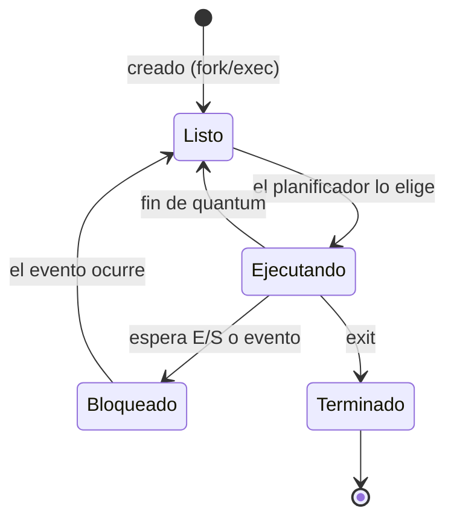
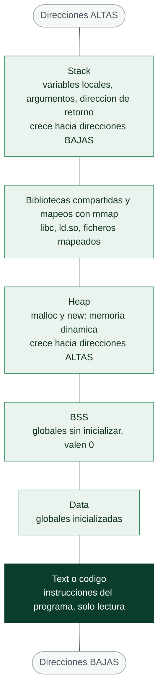
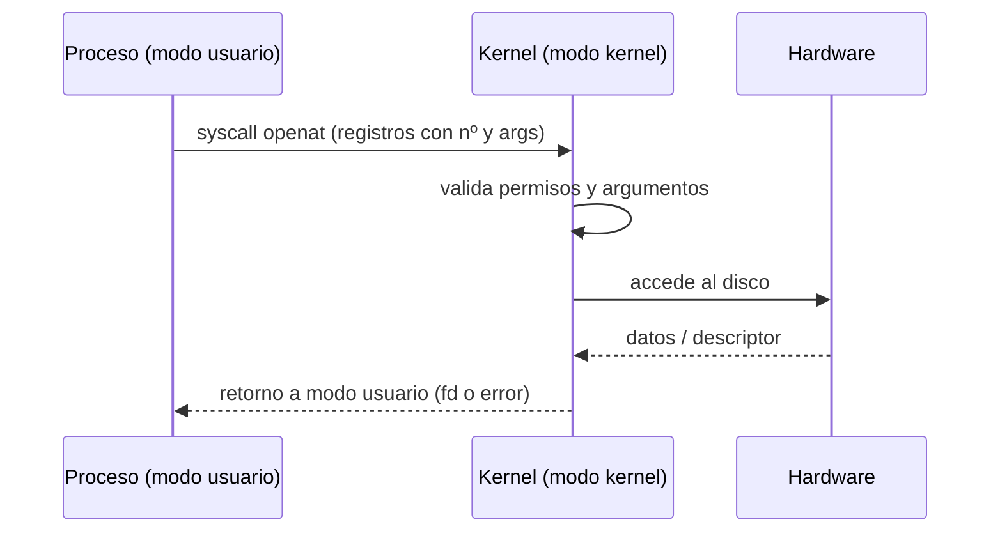

# Clase 023 — Sistemas operativos: procesos, memoria y syscalls

> Parte: **0 — Fundamentos y prerrequisitos** · Fuente: *Tanenbaum & Bos, Modern Operating Systems*
> ⏱️ Duración estimada: **110 min** · Nivel: **Fundamentos**

---

## 🎯 Objetivo

Comprender cómo un sistema operativo gestiona los procesos, organiza su memoria y traza la frontera entre el modo usuario y el modo kernel a través de las llamadas al sistema. Este es el sustrato exacto sobre el que ocurren la explotación de memoria, la inyección de código, la evasión y la detección: sin entender dónde vive cada dato de un proceso y cómo pide servicios al kernel, las técnicas ofensivas y defensivas de las partes avanzadas del programa quedan como magia. Aquí construimos el modelo mental que hace que todo lo demás tenga sentido.

## 📚 Resultados de aprendizaje

Al finalizar, el alumno podrá:

1. **Explicar** el ciclo de vida de un proceso, sus estados y cómo el planificador reparte la CPU.
2. **Describir** el layout de memoria de un proceso (code, data, heap, stack) y qué vive en cada región.
3. **Diferenciar** el modo usuario del modo kernel y el papel de las syscalls como única puerta legítima al kernel.
4. **Rastrear** las llamadas al sistema de un programa con `strace` y las de librería con `ltrace`.
5. **Relacionar** estos mecanismos con técnicas de ataque (buffer overflow, hooking) y de detección (EDR, sandbox).
6. **Interpretar** el mapa de memoria de un proceso vivo a través de `/proc`.

## 🗺️ Temas

| # | Tema | Por qué importa |
|---|------|-----------------|
| 1 | Procesos e hilos | La unidad de ejecución y su aislamiento |
| 2 | Estados y planificación | Cómo comparten la CPU muchos procesos |
| 3 | Layout de memoria | Dónde vive el código, los datos, el heap y el stack |
| 4 | Memoria virtual | Aislamiento entre procesos y paginación |
| 5 | Modo usuario/kernel | La frontera de privilegios de la CPU |
| 6 | Syscalls | La puerta de entrada controlada al kernel |
| 7 | Herramientas de traza | strace, ltrace, procfs |
| 8 | Relevancia ofensiva | Inyección, hooking, monitoreo, evasión |

## 🧠 Explicación en profundidad

### Procesos e hilos: la unidad de ejecución

Un **proceso** es un programa en ejecución: no el archivo en disco, sino la instancia viva con su propio espacio de memoria, sus descriptores de archivo abiertos, su identificador (PID) y su contexto de CPU. La propiedad de seguridad fundamental es el **aislamiento**: gracias a la memoria virtual, cada proceso cree tener toda la memoria para sí y no puede leer ni escribir la de otro proceso salvo por mecanismos explícitos. Un **hilo (thread)** es un flujo de ejecución **dentro** de un proceso; varios hilos del mismo proceso comparten su memoria y recursos, lo que permite concurrencia eficiente pero introduce el riesgo del estado compartido (condiciones de carrera). Esta diferencia tiene consecuencias de seguridad concretas: comprometer un proceso te da su espacio de memoria completo, y como los hilos lo comparten, inyectar código en un hilo afecta a todo el proceso. La creación de procesos en Unix sigue el patrón `fork` (duplicar el proceso actual) seguido de `execve` (reemplazar su imagen por un nuevo programa), una secuencia que aparece constantemente al analizar comportamiento.

### Estados y planificación: compartir la CPU

Una CPU solo ejecuta un hilo por núcleo en cada instante, pero un sistema típico tiene cientos de procesos. El **planificador (scheduler)** del kernel crea la ilusión de simultaneidad alternando rápidamente entre ellos. Cada proceso transita por varios **estados**: *ejecutándose* (en la CPU), *listo* (esperando turno), *bloqueado* (esperando un evento, como que termine una lectura de disco) y *terminado*. Cuando un proceso se bloquea a la espera de E/S, el planificador aprovecha para dar la CPU a otro, lo que explica por qué el sistema sigue respondiendo mientras un programa espera datos de la red. Entender esta danza importa en seguridad porque muchos ataques de temporización (side channels) y técnicas de evasión (dormir para escapar de un sandbox) explotan precisamente el comportamiento del planificador y de los estados.



### El layout de memoria de un proceso

El espacio de direcciones virtual de un proceso está organizado en regiones bien definidas, y conocerlas es imprescindible para entender la explotación de memoria. En las direcciones más bajas está el segmento de **código (text)**, de solo lectura y ejecutable, con las instrucciones del programa. Encima, los segmentos de **datos**: el inicializado (variables globales con valor) y el BSS (variables globales sin inicializar). A continuación crece hacia arriba el **heap**, la memoria dinámica que el programa solicita en tiempo de ejecución con `malloc`/`new` y que es el terreno de vulnerabilidades como el use-after-free y el heap overflow. En la parte alta del espacio, y creciendo hacia abajo, está el **stack (pila)**, una estructura LIFO que almacena los marcos de las llamadas a función: variables locales, argumentos y —crucialmente— la dirección de retorno. Entre heap y stack se mapean las bibliotecas compartidas. El stack es el objetivo clásico del **buffer overflow**: escribir más allá de un buffer local puede sobrescribir la dirección de retorno y desviar el flujo de ejecución.



Lee el diagrama de abajo arriba y verás por qué el orden no es arbitrario: lo que
tiene tamaño fijo y se conoce al compilar (`text`, `data`, BSS) ocupa la parte baja,
y las dos regiones que crecen en tiempo de ejecución —heap y stack— quedan enfrentadas
en los extremos del espacio libre que hay en medio. Ese mapa no es teórico: puedes ver
el tuyo en cualquier proceso con `cat /proc/<pid>/maps`, y volverás a él en cuanto
empieces a razonar sobre dónde cae cada dato de un binario.

### Memoria virtual: la ilusión del aislamiento

Ningún proceso accede directamente a la RAM física. El kernel, con ayuda de la MMU (unidad de gestión de memoria) del procesador, presenta a cada proceso un **espacio de direcciones virtual** propio que se traduce a memoria física mediante tablas de páginas. Esta indirección logra tres cosas de enorme valor para la seguridad. Primera, **aislamiento**: un proceso no puede direccionar la memoria de otro porque sus tablas de páginas no la mapean. Segunda, **permisos por página** (lectura, escritura, ejecución), que permiten marcar el código como no escribible y el stack como no ejecutable (la base de DEP/NX). Tercera, hace posible **ASLR (Address Space Layout Randomization)**, que aleatoriza las direcciones base de las regiones en cada ejecución para que un atacante no pueda predecir dónde caerá su carga útil. Estas mitigaciones nacen todas de la infraestructura de memoria virtual.

### La frontera usuario/kernel y las syscalls

El procesador ejecuta código en distintos **niveles de privilegio** (los "rings" de x86). El código de aplicación corre en **modo usuario**, con acceso restringido: no puede tocar el hardware, la memoria de otros procesos ni las estructuras del kernel directamente. El kernel corre en **modo kernel**, con acceso total. La única vía legítima para que un proceso de usuario solicite un servicio privilegiado —abrir un archivo, enviar por la red, crear un proceso— es la **llamada al sistema (syscall)**. Una syscall es una transición controlada: el proceso coloca el número de la llamada y sus argumentos en registros, ejecuta una instrucción especial (`syscall` en x86-64) que salta al kernel en un punto de entrada fijo, el kernel valida la petición, la atiende y devuelve el control a modo usuario. Esta frontera es una **frontera de seguridad** de primer orden: toda la superficie de ataque del kernel se concentra en cómo valida esas peticiones, y una "elevación a kernel" (explotar el kernel desde modo usuario) es el santo grial de la escalada de privilegios porque da control total de la máquina.



### Relevancia ofensiva y defensiva

Todo lo anterior converge en la práctica de seguridad. La **explotación de memoria** (buffer overflow en el stack, use-after-free en el heap) corrompe estructuras para secuestrar el flujo de ejecución, y no se entiende sin el layout de memoria. La **inyección de código** y el **hooking de syscalls** —interceptar las llamadas al sistema para alterar su comportamiento— son la base tanto de los rootkits ofensivos como de los EDR defensivos, que observan las syscalls para detectar actividad maliciosa. El **análisis dinámico de malware** se apoya en trazar syscalls con `strace` para descubrir qué archivos toca un binario, con qué se conecta y qué procesos lanza. Y la **evasión** consiste a menudo en detectar que se está siendo observado (por ejemplo, la presencia de un trazador vía `ptrace`) y cambiar de comportamiento. Por eso un profesional de seguridad, sea del lado que sea, necesita fluidez en esta capa.

## 📖 Definiciones y características

- **Proceso**: programa en ejecución con su propio espacio de memoria virtual, PID y recursos. Está aislado de otros procesos por la memoria virtual, lo que lo convierte en la unidad básica de contención del sistema.
- **Hilo (thread)**: flujo de ejecución dentro de un proceso que comparte su memoria con los demás hilos. Permite concurrencia eficiente, pero el estado compartido abre la puerta a condiciones de carrera y a que la inyección en un hilo afecte a todo el proceso.
- **Stack (pila)**: región de memoria LIFO que guarda los marcos de llamada: variables locales, argumentos y la dirección de retorno. Es el objetivo clásico del buffer overflow, ya que sobrescribir la dirección de retorno desvía la ejecución.
- **Heap**: región de memoria dinámica gestionada por el programa mediante `malloc`/`new`. Sus errores de gestión (use-after-free, doble liberación, overflow) son una fuente prolífica de vulnerabilidades explotables.
- **Memoria virtual**: abstracción que da a cada proceso un espacio de direcciones propio traducido a memoria física por la MMU. Proporciona aislamiento, permisos por página y es la base de mitigaciones como ASLR y DEP/NX.
- **Syscall**: interfaz controlada por la que un proceso solicita servicios al kernel (open, read, write, execve). Es la única vía legítima para tocar el hardware o los recursos, y por tanto un punto central de observación y de superficie de ataque.
- **Modo usuario / modo kernel**: niveles de privilegio de la CPU que separan el código de aplicación del código del kernel. Esta frontera evita que un proceso comprometa el sistema directamente; superarla es el objetivo de la escalada a kernel.
- **Planificador (scheduler)**: componente del kernel que decide qué proceso listo recibe la CPU y por cuánto tiempo. Su comportamiento sustenta la multitarea y es explotado por ciertos ataques de temporización y técnicas de evasión.
- **ptrace**: mecanismo de Linux que permite a un proceso observar y controlar la ejecución de otro. Es la base de depuradores y de `strace`, y su detección es una técnica anti-análisis común del malware.
- **procfs (/proc)**: sistema de archivos virtual que expone información de cada proceso (mapa de memoria, estado, descriptores). Es una ventana de introspección esencial para el análisis de procesos vivos.

## 📔 Glosario

| Término | Definición concisa |
|---------|--------------------|
| Proceso | Programa en ejecución con memoria propia |
| Hilo | Flujo de ejecución que comparte memoria dentro de un proceso |
| PID | Identificador numérico de un proceso |
| Stack | Pila LIFO de marcos de llamada |
| Heap | Memoria dinámica (malloc/new) |
| BSS | Segmento de globales sin inicializar |
| Memoria virtual | Espacio de direcciones propio por proceso |
| MMU | Unidad de hardware que traduce direcciones |
| Página | Unidad de memoria virtual (típicamente 4 KiB) |
| Syscall | Llamada al sistema, servicio del kernel |
| Modo kernel | Nivel de privilegio total de la CPU |
| Modo usuario | Nivel de privilegio restringido |
| strace | Trazador de llamadas al sistema |
| ltrace | Trazador de llamadas a librería |
| ptrace | Mecanismo de traza/depuración de procesos |
| ASLR | Aleatorización del layout de memoria |
| EDR | Endpoint Detection and Response, defensa por telemetría |

## 🧰 Herramientas y preparación

En Linux/Kali usaremos herramientas de observación del propio sistema: `ps`, `top`/`htop`, el sistema de archivos `/proc`, `strace` para trazar syscalls, `ltrace` para llamadas a librería, `pmap` y `cat /proc/<pid>/maps` para el mapa de memoria. Necesitas permisos para trazar tus propios procesos (en algunas distribuciones `kernel.yama.ptrace_scope` restringe la traza; puedes ajustarlo solo en tu laboratorio). Un programa en C mínimo o cualquier binario dinámico sirve como sujeto de estudio. Trabaja siempre en tu **VM de laboratorio**.

## 🧪 Laboratorio guiado

1. **Explorar un proceso vivo**. Lanza un proceso durmiente y examínalo:

   ```bash
   sleep 1000 &
   ps -o pid,ppid,state,cmd -p $!
   cat /proc/$!/status | head
   ```

2. **Layout de memoria**. Observa las regiones del proceso e identifica stack, heap y bibliotecas:

   ```bash
   pmap $!
   cat /proc/$!/maps
   ```

3. **Trazar syscalls**. Filtra las llamadas de E/S de archivos de un comando:

   ```bash
   strace -f -e trace=open,openat,read,write ls / 2>&1 | head -30
   ```

4. **Llamadas a librería** con `ltrace` sobre un binario enlazado dinámicamente:

   ```bash
   ltrace -e 'malloc+free' ./programa 2>&1 | head
   ```

5. **Reparto usuario/kernel**. Mide cuánto tiempo pasa un proceso dentro de syscalls frente a espacio de usuario:

   ```bash
   strace -c ls
   ```

6. **Relevancia ofensiva (conceptual)**. Relaciona lo observado con la seguridad: un buffer overflow corrompe el **stack**; un `execve` inesperado en la traza puede delatar una **ejecución maliciosa**; el hooking de syscalls es la base tanto de rootkits como de EDR. Escribe tus conclusiones.

> ⚠️ **Nota ética**: traza únicamente procesos propios o dentro de tu laboratorio. Interceptar o depurar procesos de otros usuarios sin autorización puede ser ilegal y viola la privacidad del sistema.

## ✍️ Ejercicios

1. Dibuja el layout de memoria de un proceso e indica en qué región vive cada tipo de dato (código, globales, memoria dinámica, variables locales).
2. Explica la diferencia entre un proceso y un hilo, y da una implicación de seguridad concreta de cada uno.
3. Con `strace`, identifica todas las syscalls que usa un programa para leer un archivo, desde que lo abre hasta que lo cierra.
4. Investiga qué es una interrupción o *trap* y cómo transfiere el control desde modo usuario al kernel.
5. Compara `strace` y `ltrace`: qué observa cada uno, cuándo uno no ve nada y para qué sirve cada uno en el análisis de malware.
6. Explica por qué la separación usuario/kernel es una frontera de seguridad y qué significa una "elevación a kernel".
7. Interpreta un `/proc/<pid>/maps` real: localiza las regiones ejecutables, las de solo lectura y el stack, y explica cómo ASLR afecta a esas direcciones.

## 📝 Reto verificable

Analiza un binario desconocido pero inofensivo, provisto en tu laboratorio, usando **solo** herramientas de observación del sistema operativo. Describe su comportamiento a partir de sus syscalls (qué archivos abre, qué conexiones de red intenta, qué procesos lanza) sin ejecutar nada peligroso fuera del entorno aislado. Entrega un informe con el "perfil de comportamiento" del programa.

**Criterio de aceptación**: el informe lista las syscalls relevantes observadas con `strace` (E/S de archivos, actividad de red, `execve`) y deduce a partir de ellas qué hace el programa, distinguiendo con criterio la actividad benigna de los indicios sospechosos. El análisis debe ser reproducible ejecutando el mismo comando `strace` sobre el binario en el laboratorio.

## ⚠️ Errores comunes

| Síntoma / mensaje | Causa y cómo arreglar |
|-------------------|-----------------------|
| `strace: Operation not permitted` | Restricción de `ptrace_scope` o proceso ajeno. Traza procesos propios o ajusta la política en tu lab. |
| `ltrace` no muestra nada | Binario estático o sin símbolos. `ltrace` necesita enlace dinámico para interceptar librería. |
| `/proc/<pid>/maps` vacío o denegado | Permisos insuficientes o el proceso ya terminó. Usa un PID vivo y propio. |
| Confundir stack con heap | Stack = automático y LIFO (locales); heap = dinámico (`malloc`). Revisa el layout de memoria. |
| `strace` ralentiza mucho el programa | Es esperable: intercepta cada syscall. Filtra con `-e trace=` para reducir el ruido y el impacto. |
| No ver syscalls de red esperadas | El programa usa una librería que multiplexa o cachea. Combina `strace` con `ltrace` y revisa `-f` para hijos. |

## ❓ Preguntas frecuentes

**❓ ¿Por qué un pentester necesita entender syscalls?** Porque la explotación de memoria, la inyección de shellcode y la evasión operan justo en esta capa. Y en el lado defensivo, los EDR y los sandboxes se basan en observar syscalls para detectar comportamiento malicioso; entenderlas te sirve para atacar y para defender.

**❓ ¿Qué relación hay con los buffer overflows?** Un overflow corrompe estructuras en el stack o el heap para desviar el flujo de ejecución. Sin comprender el layout de memoria, ni el ataque ni sus mitigaciones (ASLR, DEP/NX, canarios de pila) tienen sentido; son respuestas directas a cómo está organizada la memoria del proceso.

**❓ ¿`strace` sirve para analizar malware?** Sí, es una herramienta clave del análisis dinámico: revela qué archivos toca un binario, con qué servidores se conecta y qué procesos lanza. Debe usarse siempre en un entorno aislado, porque estás ejecutando el binario para observarlo.

**❓ ¿Windows tiene equivalentes?** Sí. Process Monitor (Sysinternals), ETW (Event Tracing for Windows) y los monitores de API cumplen un papel análogo, observando llamadas y actividad del sistema. Los conceptos de proceso, memoria virtual y frontera de privilegios son equivalentes aunque cambien los nombres y las herramientas.

## 🔗 Referencias

- Tanenbaum & Bos, *Modern Operating Systems*.
- Michael Kerrisk, *The Linux Programming Interface*.
- `man 1 strace`, `man 5 proc`
- Linux syscall reference — <https://man7.org/linux/man-pages/man2/syscalls.2.html>
- MITRE ATT&CK — Process Injection (T1055) — <https://attack.mitre.org/techniques/T1055/>

## 📥 Material descargable

- 📄 [Guía en PDF](./clase-023-guia.pdf) — versión imprimible de esta clase.
- 🎞️ [Presentación (PPTX)](./clase-023-presentacion.pptx) — deck para proyectar en clase.

## ⬅️ Clase anterior

[Clase 022 — Docker y contenedores para laboratorios de seguridad](../022-docker-y-contenedores-para-laboratorios-de-seguridad/README.md)

## ➡️ Siguiente clase

[Clase 024 — Arquitectura de computadores: CPU, registros y memoria](../024-arquitectura-de-computadores-cpu-registros-y-memoria/README.md)
