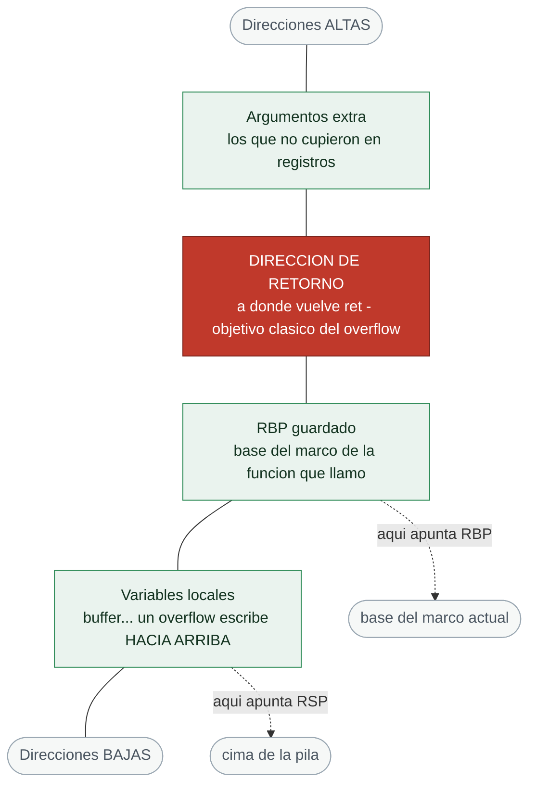
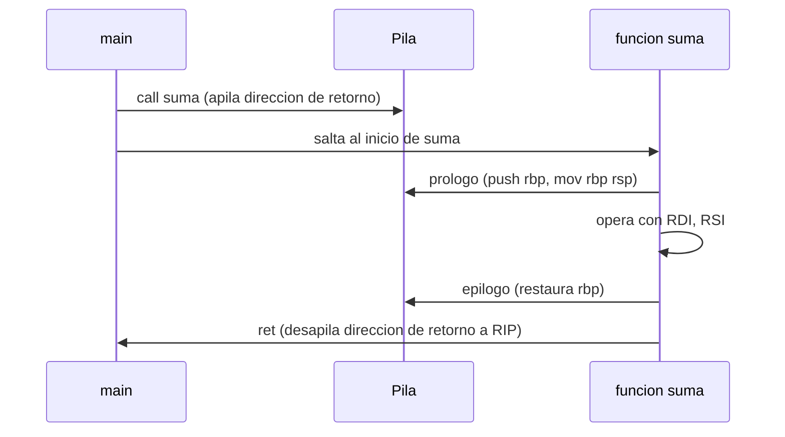

# Clase 024 — Arquitectura de computadores: CPU, registros y memoria

> Parte: **0 — Fundamentos y prerrequisitos** · Fuente: *Jon Erickson, Hacking: The Art of Exploitation*
> ⏱️ Duración estimada: **110 min** · Nivel: **Fundamentos**

---

## 🎯 Objetivo

Entender cómo funciona una CPU a bajo nivel: sus registros, la pila de llamadas, el ciclo de ejecución de instrucciones y el ensamblador básico que da vida a todo programa. Este conocimiento es el requisito previo indispensable para la explotación binaria, la ingeniería inversa y el análisis de malware que abordarás en las partes avanzadas del programa. No buscamos convertirte en programador de ensamblador, sino darte el modelo mental para leer código máquina, seguir el rastro de una llamada a función y entender exactamente por qué un buffer overflow permite tomar el control de la ejecución.

## 📚 Resultados de aprendizaje

Al finalizar, el alumno podrá:

1. **Describir** los registros clave de x86-64 y la función de cada uno, en especial RIP, RSP y RBP.
2. **Explicar** el ciclo fetch-decode-execute que ejecuta cada instrucción.
3. **Trazar** el uso de la pila durante una llamada a función, incluyendo la dirección de retorno.
4. **Leer** ensamblador básico (mov, push, pop, call, ret) y relacionarlo con código C.
5. **Conectar** estos conceptos con las vulnerabilidades de memoria y sus mitigaciones (ASLR, NX/DEP, canarios).
6. **Aplicar** endianness al escribir direcciones al inspeccionar memoria.

## 🗺️ Temas

| # | Tema | Por qué importa |
|---|------|-----------------|
| 1 | CPU y ciclo de ejecución | Cómo se ejecutan las instrucciones una a una |
| 2 | Registros x86-64 | RAX, RBX, RSP, RBP, RIP y su propósito |
| 3 | La pila (stack) | Llamadas, retorno y variables locales |
| 4 | Convención de llamada | Cómo se pasan los argumentos a una función |
| 5 | Ensamblador básico | mov, push, pop, call, ret |
| 6 | Endianness | El orden de los bytes en memoria |
| 7 | Del C al ensamblador | Compilar y desensamblar para comparar |
| 8 | Relevancia en exploiting | Control de RIP, overflow, ASLR/DEP |

## 🧠 Explicación en profundidad

### La CPU y el ciclo fetch-decode-execute

En su núcleo, una CPU hace una sola cosa repetida a miles de millones de veces por segundo: ejecutar el **ciclo fetch-decode-execute**. En la fase de **fetch**, la CPU lee de memoria la instrucción a la que apunta el registro de instrucción (RIP en x86-64). En la fase de **decode**, interpreta qué operación codifica esa instrucción y qué operandos necesita. En la fase de **execute**, la realiza: una suma en la ALU, una lectura de memoria, un salto. Tras ejecutar, RIP avanza a la siguiente instrucción (o a otra distinta, si la instrucción fue un salto). Este bucle es la esencia de toda computación, y su implicación de seguridad es profunda: si un atacante logra controlar el valor de RIP, controla qué instrucción ejecuta la CPU a continuación y, por tanto, secuestra el programa. Todo el arte del *control-flow hijacking* se reduce a manipular RIP.

### Registros: la memoria más rápida de la máquina

Los **registros** son pequeñas celdas de almacenamiento dentro de la propia CPU, órdenes de magnitud más rápidas que la RAM. En x86-64 hay un conjunto de registros de propósito general de 64 bits (RAX, RBX, RCX, RDX, RSI, RDI, R8–R15) que las instrucciones usan para operar, y varios de propósito especial cuya comprensión es crítica para la seguridad. **RIP** (instruction pointer) apunta a la siguiente instrucción a ejecutar; es el objetivo último de un exploit. **RSP** (stack pointer) apunta a la cima de la pila. **RBP** (base pointer) marca la base del marco de la función actual. Los registros de propósito general tienen convenciones de uso (por ejemplo, RAX suele contener el valor de retorno de una función), pero es RIP, RSP y RBP los que gobiernan el flujo de ejecución y la gestión de la pila, y por eso serán protagonistas cuando estudiemos overflows.

### La pila y la anatomía de una llamada a función

La **pila (stack)** es una región de memoria que funciona como estructura LIFO (last-in, first-out) y que, en x86-64, crece hacia **direcciones más bajas**. Es donde el programa guarda las variables locales, los argumentos que no caben en registros y —el dato más importante para la seguridad— la **dirección de retorno**. Cuando se ejecuta la instrucción `call funcion`, la CPU hace dos cosas: apila la dirección de la instrucción siguiente al `call` (la dirección de retorno) y salta al inicio de la función. La función suele empezar con un **prólogo** (`push rbp; mov rbp, rsp`) que establece su marco de pila, reserva espacio para las locales y trabaja. Al terminar, un **epílogo** restaura el marco anterior y la instrucción `ret` **desapila** la dirección de retorno a RIP, devolviendo el control a quien la llamó. Aquí está la vulnerabilidad clásica: si una escritura descontrolada (un buffer local sin comprobar límites) sobrescribe esa dirección de retorno guardada en la pila, cuando se ejecute `ret` la CPU saltará a donde el atacante quiera. Ese es el corazón del stack buffer overflow.



El diagrama hay que leerlo **de abajo arriba**, porque ese es el sentido en el que
escribe un desbordamiento: el `buffer` vive en la zona baja del marco, y al pasarse
de tamaño avanza primero sobre el `RBP` guardado y solo después sobre la dirección de
retorno. Esa distancia —cuántos bytes hay entre el inicio del buffer y la dirección
de retorno— es lo que en explotación se llama el *offset*, y calcularlo es el primer
paso de cualquier exploit de pila. La mitigación que ataca justo ese camino es el
**canario de pila**: un valor aleatorio que el compilador coloca entre las locales y
el `RBP` guardado y comprueba en el epílogo; si cambió, el programa aborta antes de
ejecutar `ret`.

### La convención de llamada System V

Para que el código compilado sea interoperable, existe un contrato sobre **cómo se pasan los argumentos** y quién preserva qué registros: la **convención de llamada**. En Linux x86-64 se usa la **System V AMD64 ABI**, que pasa los primeros seis argumentos enteros en los registros **RDI, RSI, RDX, RCX, R8 y R9**, en ese orden, y devuelve el resultado en RAX. Los argumentos adicionales van a la pila. Conocer esta convención es lo que te permite, al leer un desensamblado, decir "el primer argumento de esta función está en RDI, el segundo en RSI", y así reconstruir qué hace el código sin tener el fuente. Es una herramienta de lectura fundamental en ingeniería inversa: sin ella, el ensamblador es una sopa de registros; con ella, cobra sentido.

### Ensamblador básico y del C al ASM

Un puñado de instrucciones cubre la mayoría de lo que verás al empezar. `mov` copia datos entre registros y memoria; `push` y `pop` apilan y desapilan; `call` y `ret` gestionan las llamadas como vimos; `add`, `sub`, `cmp` operan y comparan; los saltos (`jmp`, `je`, `jne`) alteran el flujo. La mejor forma de aprender es **comparar C con su ensamblador**: escribes una función sencilla, la compilas sin optimizaciones (`-O0`) para que la traducción sea directa, y la desensamblas para ver cómo cada línea de C se convierte en instrucciones. Reconocerás el prólogo, el cuerpo y el epílogo, y empezarás a leer patrones. Un detalle que confunde al principio es la **sintaxis**: existe la de AT&T y la de Intel, con órdenes de operandos opuestos; en este curso usamos siempre Intel (`-M intel` en objdump, `set disassembly-flavor intel` en gdb) por ser más legible.



### Endianness y la relevancia en exploiting

Un último detalle imprescindible: el **endianness**, el orden en que se almacenan los bytes de un valor multibyte en memoria. x86-64 es **little-endian**, lo que significa que el byte menos significativo va primero (en la dirección más baja). Así, el valor `0x00401136` se guarda en memoria como los bytes `36 11 40 00`. Esto importa muchísimo al construir un exploit: cuando escribes una dirección para sobrescribir la dirección de retorno, debes escribirla en el orden de bytes correcto o saltarás a un sitio equivocado. Todo lo estudiado converge en la explotación: un buffer local demasiado pequeño que recibe datos sin validar puede sobrescribir la dirección de retorno guardada en la pila, y al ejecutarse `ret`, RIP toma el valor que el atacante colocó. Las defensas modernas responden a cada pieza de este ataque: los **canarios de pila** detectan la sobrescritura antes del `ret`, **NX/DEP** impide ejecutar código en el stack, y **ASLR** aleatoriza las direcciones para que el atacante no sepa a dónde saltar. Verlas ahora te prepara para entender la carrera armamentística entre ataque y defensa.

## 📖 Definiciones y características

- **Registro**: celda de almacenamiento interna de la CPU, extremadamente rápida. Las instrucciones operan sobre registros; `RIP` apunta a la siguiente instrucción, así que controlarlo equivale a controlar la ejecución del programa.
- **RIP (instruction pointer)**: registro que contiene la dirección de la próxima instrucción a ejecutar. Es el objetivo final de un exploit de secuestro de flujo: quien controla RIP controla qué ejecuta la CPU.
- **RSP / RBP**: puntero de pila (cima) y puntero de marco (base de la función actual). Delimitan el marco de la función y son centrales en el análisis y la explotación de overflows de pila.
- **Pila (stack)**: estructura de memoria LIFO que en x86 crece hacia direcciones bajas. Almacena la dirección de retorno, el marco anterior y las variables locales, lo que la convierte en objetivo del buffer overflow.
- **call / ret**: `call` apila la dirección de retorno y salta a la función; `ret` desapila esa dirección a RIP. Sobrescribir la dirección de retorno antes del `ret` es el mecanismo del stack overflow clásico.
- **Convención de llamada System V**: contrato que pasa los primeros seis argumentos enteros en RDI, RSI, RDX, RCX, R8 y R9, y devuelve en RAX. Saber esto permite leer un desensamblado e identificar los parámetros de cada función.
- **Endianness**: orden de los bytes de un valor multibyte en memoria; x86-64 es little-endian (byte menos significativo primero). Debe respetarse al escribir direcciones en un exploit o al interpretar un volcado de memoria.
- **Ciclo fetch-decode-execute**: bucle fundamental de la CPU que lee, interpreta y ejecuta cada instrucción. Explica por qué controlar RIP secuestra el programa: dicta qué instrucción se busca a continuación.
- **Canario de pila (stack canary)**: valor centinela colocado antes de la dirección de retorno que se verifica antes del `ret`. Si un overflow lo altera, el programa aborta, detectando la corrupción de la pila.
- **NX/DEP y ASLR**: mitigaciones que marcan la pila como no ejecutable (NX/DEP) y aleatorizan las direcciones base (ASLR). Elevan enormemente el coste de un exploit, aunque técnicas como ROP e infoleaks buscan eludirlas.

## 📔 Glosario

| Término | Definición concisa |
|---------|--------------------|
| CPU | Unidad de procesamiento que ejecuta instrucciones |
| Registro | Almacenamiento interno rapidísimo de la CPU |
| RIP | Puntero a la siguiente instrucción |
| RSP | Puntero a la cima de la pila |
| RBP | Puntero a la base del marco actual |
| RAX | Registro que suele contener el valor de retorno |
| Pila (stack) | Memoria LIFO de marcos de llamada |
| Marco (stack frame) | Espacio de una función en la pila |
| Dirección de retorno | Dónde continúa la ejecución tras `ret` |
| Prólogo/epílogo | Código que crea/destruye el marco de función |
| call / ret | Instrucciones de llamada y retorno |
| Convención de llamada | Contrato de paso de argumentos (System V) |
| Endianness | Orden de bytes en memoria (x86 = little-endian) |
| Ensamblador | Representación legible del código máquina |
| Canario | Centinela que detecta overflow de pila |
| NX/DEP | Marca de memoria no ejecutable |
| ASLR | Aleatorización de direcciones de memoria |
| ROP | Técnica de reutilización de código para eludir NX |

## 🧰 Herramientas y preparación

En Linux/Kali usaremos `gcc` para compilar, `objdump` y `readelf` para inspeccionar binarios y `gdb` como depurador, idealmente potenciado con **GEF** o **pwndbg** para una vista más rica de registros y pila. Puedes instalar GEF con:

```bash
bash -c "$(curl -fsSL https://gef.blah.cat/sh)"
```

Trabaja siempre en tu **VM de laboratorio**. Un programa en C sencillo basta para compilar, desensamblar y depurar. Para estudiar direcciones estables durante el aprendizaje puedes desactivar ASLR en el lab con cuidado (por ejemplo con `setarch -R`), recordando que en producción esa mitigación es deseable.

## 🧪 Laboratorio guiado

1. **Compilar y desensamblar**. Crea `suma.c` con una función `suma(a, b)` llamada desde `main`, compílala sin optimizar y desensámblala:

   ```bash
   gcc -O0 -g suma.c -o suma
   objdump -d -M intel suma | sed -n '/<suma>:/,/ret/p'
   ```

   Identifica el prólogo (`push rbp`, `mov rbp, rsp`), las operaciones y el `ret`.

2. **Registros en gdb**. Detente al entrar en la función y observa los argumentos:

   ```bash
   gdb ./suma
   (gdb) break suma
   (gdb) run
   (gdb) info registers rdi rsi rsp rbp rip
   ```

   Comprueba que los argumentos llegan en RDI y RSI según System V.

3. **Ver la pila**. En el breakpoint, examina la memoria de la pila y localiza la dirección de retorno guardada:

   ```text
   (gdb) x/8gx $rsp
   ```

4. **Seguir call/ret**. Ejecuta instrucción a instrucción con `stepi` y observa cómo `ret` restaura RIP tomando el valor desde la pila.

5. **Endianness**. Escribe un entero conocido en memoria y examínalo byte a byte para comprobar el orden little-endian.

6. **Conexión con exploiting (conceptual)**. Razona cómo un buffer local demasiado grande podría sobrescribir la dirección de retorno guardada en la pila, y qué mitigación (canario, NX/DEP, ASLR) frena cada paso del ataque. Documenta tu razonamiento.

> ⚠️ **Nota ética**: la explotación real de vulnerabilidades se practica en las partes avanzadas y **solo** sobre binarios de laboratorio propios o retos autorizados (CTF, VulnHub, plataformas de práctica). Aquí se estudia la teoría y la lectura de código, no se ataca ningún sistema ajeno.

## ✍️ Ejercicios

1. Enumera seis registros de x86-64 y describe la función de cada uno, destacando el papel de RIP, RSP y RBP.
2. Explica qué guarda la pila cuando se llama a una función y en qué orden se colocan la dirección de retorno, el RBP guardado y las variables locales.
3. Desensambla una función sencilla y anota a qué construcción del código C corresponde cada instrucción clave.
4. Escribe en little-endian la secuencia de bytes de la dirección `0x00401136` tal como aparecería en memoria.
5. Explica paso a paso cómo un overflow de un buffer en la pila puede alterar RIP y desviar la ejecución.
6. Investiga qué protege cada mitigación —ASLR, NX/DEP y los canarios de pila— y contra qué parte concreta del ataque actúa.
7. Identifica en un desensamblado la convención System V: señala en qué registros llegan el primer y el segundo argumento de una función.

## 📝 Reto verificable

Toma un programa en C con una función que reciba argumentos y realice un cálculo. Compílalo con `-O0 -g`, desensámblalo y, con gdb, produce un "mapa" anotado que muestre: los registros que contienen los argumentos al entrar en la función (según System V), la ubicación de la dirección de retorno en la pila y la instrucción `ret` que la consume. Explica en qué punto exacto un atacante intentaría intervenir para tomar el control.

**Criterio de aceptación**: el mapa identifica correctamente los registros de argumentos según la convención System V, señala la dirección de retorno en el volcado de la pila (`x/gx $rsp`) y explica de forma coherente la relación entre sobrescribir esa dirección y el control de RIP. El resultado debe ser reproducible ejecutando los mismos comandos de gdb sobre el binario compilado.

## ⚠️ Errores comunes

| Síntoma / mensaje | Causa y cómo arreglar |
|-------------------|-----------------------|
| El desensamblado no se parece al C | El compilador optimizó. Compila con `-O0` para obtener una traducción directa. |
| gdb no muestra símbolos ni nombres | Falta información de depuración. Compila con `-g`. |
| Las direcciones cambian en cada ejecución | ASLR está activo. Para estudiar direcciones estables, desactívalo en el lab (`setarch -R`) con cuidado. |
| Confundir el orden de los bytes | x86 es little-endian; escribe e interpreta las direcciones byte a byte al revés. |
| La sintaxis del ASM resulta confusa | Estás viendo AT&T. Usa `-M intel` en objdump y `set disassembly-flavor intel` en gdb. |
| No encontrar la dirección de retorno en la pila | Estás mirando el offset equivocado respecto a RBP/RSP. Repasa el layout del marco tras el prólogo. |

## ❓ Preguntas frecuentes

**❓ ¿Necesito ser experto en ensamblador?** No para esta clase. Basta con reconocer patrones (el prólogo y el epílogo de una función, `call`/`ret`) y saber leer registros y la pila. La maestría se construye después, en las partes de exploiting e ingeniería inversa; aquí sientas la base.

**❓ ¿Por qué x86-64 y no ARM?** Porque x86-64 domina el escritorio y el servidor, y la mayor parte de la literatura de exploiting parte de él. Los conceptos —registros, pila, convención de llamada, endianness— se trasladan a ARM con cambios de nombres y algunos detalles, de modo que lo que aprendes aquí es transferible.

**❓ ¿Qué es RIP y por qué es tan importante?** Es el puntero de instrucción: contiene la dirección de lo que la CPU ejecutará a continuación. Todo el *control-flow hijacking* consiste en lograr que RIP apunte a donde el atacante quiere, por eso sobrescribir la dirección de retorno (que acaba en RIP tras `ret`) es tan buscado.

**❓ ¿Estas mitigaciones (ASLR, DEP) hacen imposible el exploiting?** Lo dificultan mucho, pero no lo impiden. Existen técnicas para eludirlas: ROP reutiliza código ya presente y ejecutable para sortear NX, y las fugas de información (infoleaks) revelan direcciones para derrotar ASLR. Conocerlas ahora te prepara para entender esa carrera continua.

## 🔗 Referencias

- Jon Erickson, *Hacking: The Art of Exploitation* (No Starch Press).
- Intel 64 and IA-32 Architectures Software Developer's Manual — <https://www.intel.com/sdm>
- System V AMD64 ABI — <https://gitlab.com/x86-psABIs/x86-64-ABI>
- GEF (GDB Enhanced Features) — <https://hugsy.github.io/gef/>
- `man 1 objdump`, `man 1 gdb`

## 📥 Material descargable

- 📄 [Guía en PDF](./clase-024-guia.pdf) — versión imprimible de esta clase.
- 🎞️ [Presentación (PPTX)](./clase-024-presentacion.pptx) — deck para proyectar en clase.

## ⬅️ Clase anterior

[Clase 023 — Sistemas operativos: procesos, memoria y syscalls](../023-sistemas-operativos-procesos-memoria-y-syscalls/README.md)

## ➡️ Siguiente clase

[Clase 025 — Ética, legalidad, alcance y divulgación responsable](../025-etica-legalidad-alcance-y-divulgacion-responsable/README.md)
