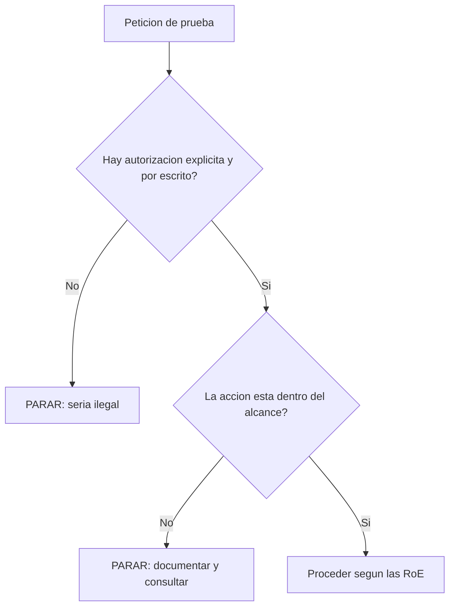
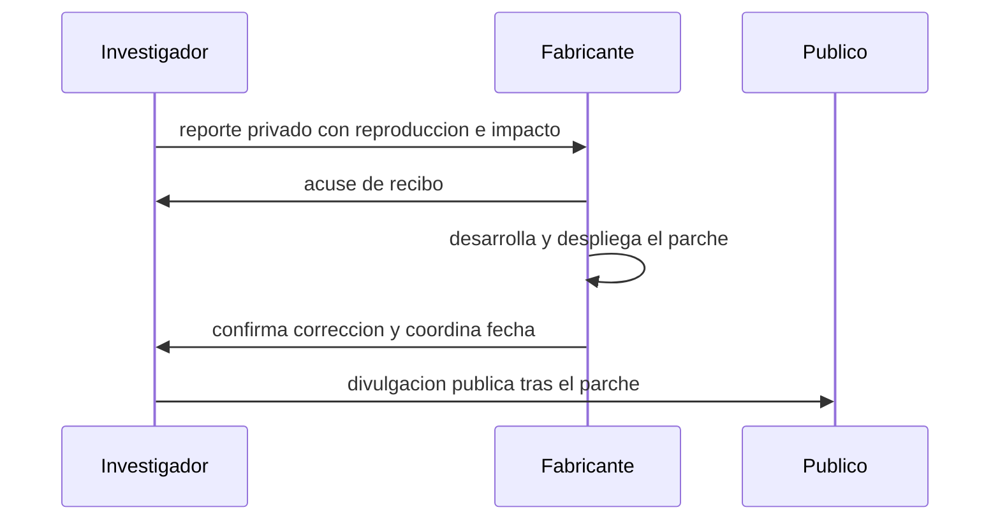

# Clase 025 — Ética, legalidad, alcance y divulgación responsable

> Parte: **0 — Fundamentos y prerrequisitos** · Fuente: *EC-Council Code of Ethics / ISO/IEC 29147 y 30111*
> ⏱️ Duración estimada: **100 min** · Nivel: **Fundamentos**

---

## 🎯 Objetivo

Interiorizar el marco legal y ético que separa a un profesional de seguridad de un delincuente informático. Al terminar sabrás qué es la autorización y por qué es innegociable, cómo se define y se respeta el alcance de un compromiso, qué tipo de conductas tipifican las leyes de delitos informáticos y cómo divulgar una vulnerabilidad de forma responsable sin causar daño ni exponerte legalmente. Esta clase no es un trámite: es la que legitima absolutamente todo lo demás del programa. Las mismas técnicas que aprenderás son legales o son delito según una única variable —el permiso— y esa distinción es tu responsabilidad conocerla y respetarla.

## 📚 Resultados de aprendizaje

Al finalizar, el alumno podrá:

1. **Explicar** por qué la autorización explícita y por escrito es la línea que nunca se cruza.
2. **Definir** el alcance (scope) de un compromiso y justificar por qué salirse de él invalida la legalidad del test.
3. **Identificar** las categorías de conducta que penan las leyes de delitos informáticos relevantes.
4. **Aplicar** un proceso de divulgación coordinada de vulnerabilidades (CVD) paso a paso.
5. **Redactar** los elementos imprescindibles de unas reglas de compromiso (RoE) de pentesting.
6. **Distinguir** el hacking ético, el grey hat y el black hat por su relación con la autorización y la intención.

## 🗺️ Temas

| # | Tema | Por qué importa |
|---|------|-----------------|
| 1 | Autorización | Es la frontera exacta entre lo legal y lo ilegal |
| 2 | Alcance (scope) | Define qué se puede tocar y qué queda prohibido |
| 3 | Reglas de compromiso (RoE) | El contrato que protege a ambas partes |
| 4 | Marco legal | Qué conductas tipifican las leyes de delitos informáticos |
| 5 | Tipos de hacker | White, grey y black hat según intención y permiso |
| 6 | Divulgación responsable | CVD y programas de bug bounty |
| 7 | Manejo de datos | Confidencialidad y destrucción de hallazgos |
| 8 | Ética profesional | Códigos deontológicos y certificaciones |

## 🧠 Explicación en profundidad

### La autorización: la única línea que importa

En seguridad ofensiva, la diferencia entre un profesional y un criminal no está en las herramientas ni en el conocimiento —son idénticos— sino en una sola cosa: la **autorización**. Un escaneo de puertos, un intento de inyección SQL o una prueba de credenciales son actividades legítimas cuando el propietario del sistema te ha dado permiso explícito, y son delitos cuando no lo ha hecho. Esto tiene una consecuencia que conviene grabar a fuego: **"tenía buena intención" no es una defensa legal**. Muchas leyes de delitos informáticos se centran en el acceso *no autorizado* con independencia de si causaste daño o de tu motivación. Encontrar una vulnerabilidad "para avisar" y "probarla" sin permiso puede constituir un delito. Por eso la autorización debe ser **explícita, por escrito y otorgada por quien tiene potestad legal sobre el sistema** —el propietario o un responsable con autoridad para consentir— y no una aprobación verbal, informal o de alguien sin capacidad para darla.

### El alcance: qué está dentro y qué está fuera

La autorización nunca es un cheque en blanco. El **alcance (scope)** delimita con precisión qué activos, rangos de red, aplicaciones y técnicas están permitidos, y —tan importante como lo anterior— cuáles están **excluidos**. Un compromiso puede autorizar el pentest de una aplicación web concreta pero excluir explícitamente los ataques de denegación de servicio, la ingeniería social contra el personal o el acceso a ciertos sistemas críticos. La regla de oro es que **salirse del alcance convierte un test autorizado en una actividad ilegal**, aunque el resto del trabajo estuviera perfectamente permitido. Esto plantea una tensión real: durante un test es habitual encontrar algo "interesante" fuera del scope. La conducta profesional es detenerse, documentarlo y consultar con el cliente antes de tocarlo, nunca "aprovechar" el hallazgo por iniciativa propia. El scope también protege al pentester: le da certeza de qué puede hacer sin incurrir en responsabilidad.

### Las reglas de compromiso: el contrato del pentest

Las **reglas de compromiso (Rules of Engagement, RoE)** son el documento que formaliza y da vida operativa a la autorización y el alcance. Unas RoE completas fijan al menos: el alcance detallado (activos incluidos y excluidos), las **ventanas de tiempo** en las que se puede operar (para evitar impactos en horas críticas del negocio), los **contactos de emergencia** de ambas partes por si algo se rompe, las **técnicas prohibidas**, el **manejo de datos sensibles** que se puedan encontrar y las condiciones de **confidencialidad**. Este documento protege a las dos partes: al cliente, porque acota lo que se le va a hacer y cómo se tratará su información; y al profesional, porque le da respaldo escrito de que actúa dentro de lo pactado. Un compromiso serio nunca empieza sin RoE firmadas. Un elemento crítico y a menudo olvidado es el protocolo ante hallazgos graves —por ejemplo, encontrar datos personales reales o evidencia de un compromiso previo— que debe estar previsto antes de empezar, no improvisado.

### El marco legal y los tipos de hacker

Las **leyes de delitos informáticos** varían por país, pero suelen tipificar categorías comunes: el **acceso no autorizado** a sistemas o datos, la **interceptación** ilegítima de comunicaciones, y los **daños** a datos o sistemas (borrado, alteración, sabotaje). El punto que debes interiorizar es que necesitas conocer la ley aplicable en **tu jurisdicción** y en la del objetivo, porque la responsabilidad es real y personal. La distinción popular entre **white hat, grey hat y black hat** se ordena exactamente según estas dos variables: autorización e intención. El *white hat* actúa siempre con permiso y con fin legítimo; el *black hat* actúa sin permiso y con fin malicioso; el *grey hat* opera en una zona ambigua —típicamente sin autorización pero sin intención dañina, como quien "prueba" una web ajena para reportar un fallo—, y esa ambigüedad no lo exime de responsabilidad legal: sigue siendo acceso no autorizado.

### La divulgación coordinada de vulnerabilidades

¿Qué haces cuando descubres una vulnerabilidad real, dentro o fuera de un compromiso? La respuesta profesional es la **divulgación coordinada de vulnerabilidades (CVD)**, un proceso que equilibra el interés público en que los fallos se corrijan con el riesgo de que se exploten antes de haber parche. El flujo estándar es: reportar la vulnerabilidad de forma **privada** al fabricante o responsable, con detalle suficiente para reproducirla y evaluar su impacto; acordar un **plazo razonable** para que desarrolle y despliegue la corrección; y publicar los detalles solo **después** de que el parche esté disponible (o cuando vence un plazo prudente si el proveedor no responde). Publicar un 0-day sin avisar es irresponsable y a veces ilegal. Los estándares **ISO/IEC 29147** (cómo divulgar) y **30111** (cómo gestionar internamente las vulnerabilidades reportadas) formalizan este proceso. Los **programas de bug bounty** son la versión con autorización previa: publican reglas, un alcance y a menudo una cláusula de **"safe harbor"** que protege legalmente a quien investiga dentro de esas reglas —y solo dentro de ellas.

## 📖 Definiciones y características

- **Autorización**: permiso explícito, por escrito y otorgado por quien tiene potestad sobre el sistema, para probarlo. Sin ella, cualquier prueba es potencialmente delito, con independencia de la intención; es la frontera exacta entre la actividad legal y la ilegal.
- **Alcance (scope)**: conjunto de activos, rangos, aplicaciones y técnicas permitidas —y explícitamente prohibidas— en un compromiso. Salir del alcance convierte un test autorizado en una acción ilegal, aunque el resto estuviera permitido.
- **Reglas de compromiso (RoE)**: documento que fija alcance, ventanas de tiempo, contactos, técnicas prohibidas, confidencialidad y manejo de datos. Protege legal y operativamente a ambas partes y nunca debe faltar antes de empezar.
- **Divulgación coordinada (CVD)**: proceso de reportar una vulnerabilidad de forma privada al responsable y dar plazo para corregirla antes de publicarla. Equilibra la transparencia con el riesgo de explotación temprana.
- **Bug bounty**: programa que autoriza y recompensa el reporte de fallos dentro de reglas publicadas. Constituye una autorización previa y acotada, válida solo mientras se respeten su alcance y sus condiciones.
- **Safe harbor**: cláusula de un programa que protege legalmente al investigador que actúa de buena fe dentro de las reglas. No cubre las acciones que se salgan del alcance o las condiciones establecidas.
- **White / grey / black hat**: categorías de hacker según autorización e intención. El white hat siempre tiene permiso y fin legítimo; el black hat carece de permiso y actúa con malicia; el grey hat opera en una ambigüedad que no lo libra de responsabilidad legal.
- **Acceso no autorizado**: conducta —tipificada por la mayoría de leyes de delitos informáticos— de entrar o interactuar con un sistema sin permiso. Suele ser punible aun sin daño y sin importar la motivación del autor.
- **Confidencialidad de hallazgos**: obligación de proteger, no divulgar y finalmente destruir la información sensible obtenida durante un compromiso. Su incumplimiento genera responsabilidad legal y ética grave.
- **Ventana de pruebas**: franja temporal acordada en la que se autoriza operar. Evita impactos en horas críticas del negocio y forma parte del contrato de las RoE.

## 📔 Glosario

| Término | Definición concisa |
|---------|--------------------|
| Autorización | Permiso explícito y por escrito del propietario |
| Alcance (scope) | Activos y técnicas permitidos y prohibidos |
| RoE | Reglas de compromiso de un pentest |
| Pentest | Prueba de penetración autorizada |
| CVD | Divulgación coordinada de vulnerabilidades |
| 0-day | Vulnerabilidad sin parche disponible |
| Bug bounty | Programa que recompensa reportes autorizados |
| Safe harbor | Protección legal dentro de las reglas del programa |
| White hat | Hacker ético con autorización |
| Grey hat | Hacker sin permiso pero sin intención dañina clara |
| Black hat | Hacker malicioso sin autorización |
| ISO/IEC 29147 | Estándar de divulgación de vulnerabilidades |
| ISO/IEC 30111 | Estándar de gestión de vulnerabilidades |
| CFAA | Ley estadounidense de fraude y abuso informático |
| NDA | Acuerdo de confidencialidad |
| Acceso no autorizado | Interacción con un sistema sin permiso, delito común |

## 🧰 Herramientas y preparación

Esta clase es conceptual y documental, pero exige preparación real. Familiarízate con la **ley de delitos informáticos de tu país** (por ejemplo, en EE. UU. la Computer Fraud and Abuse Act, CFAA; en la Unión Europea la Directiva 2013/40/UE; y la norma específica de tu jurisdicción, que debes localizar). Revisa los estándares **ISO/IEC 29147** (divulgación) y **ISO/IEC 30111** (gestión interna), consulta plantillas reales de RoE y de acuerdos de confidencialidad, y estudia las reglas publicadas de programas de bug bounty reales (HackerOne, Bugcrowd) para ver cómo se define un alcance y una cláusula de safe harbor en la práctica.

## 🧪 Laboratorio guiado (ejercicio aplicado)

1. **Investiga tu jurisdicción**. Localiza la ley de delitos informáticos aplicable donde vives y anota qué conductas tipifica (acceso no autorizado, interceptación, daños) y qué penas prevé.

2. **Analiza un caso**. Toma el escenario "encontré una web con una vulnerabilidad evidente y la 'probé' sin permiso para confirmarla". Determina si es legal, por qué, y qué debió hacerse en su lugar.

3. **Define un alcance**. Redacta el scope de un pentest ficticio: rangos IP **incluidos y excluidos**, aplicaciones cubiertas, técnicas prohibidas (por ejemplo DoS o ingeniería social al personal) y ventana horaria de pruebas.

4. **Redacta unas RoE mínimas**. Escribe las reglas de compromiso: contactos de emergencia de ambas partes, protocolo ante el hallazgo de un dato sensible real, y manejo y destrucción de la información recopilada.

5. **Simula una divulgación responsable**. Redacta un informe de vulnerabilidad para un fabricante siguiendo CVD: descripción, impacto, pasos de reproducción y una propuesta de plazo de publicación.

6. **Revisa un programa de bug bounty real**. Extrae qué está en alcance, qué queda fuera y cómo está redactada su cláusula de safe harbor.

> ⚠️ **Nota ética**: todos estos ejercicios son documentales. No pruebes técnicas contra sistemas reales sin autorización, ni siquiera para "verificar" lo que escribes. Practica las técnicas ofensivas solo en tu laboratorio o en plataformas diseñadas para ello.

## ✍️ Ejercicios

1. Explica por qué "tenía buena intención" no constituye una defensa legal frente a un acceso no autorizado.
2. Enumera seis elementos que no pueden faltar en unas RoE de pentest y justifica brevemente cada uno.
3. Da tres ejemplos de acciones que, aun con una autorización general, deberían estar explícitamente excluidas del alcance y explica por qué.
4. Describe el proceso de divulgación coordinada paso a paso, incluyendo qué hacer si el fabricante no responde en un plazo razonable.
5. Diferencia el hacking ético, el grey hat y el black hat con un ejemplo concreto de cada uno, señalando la variable que los separa.
6. Investiga qué es una cláusula de "safe harbor" en un bug bounty, qué protege exactamente y qué queda fuera de su cobertura.
7. Redacta el protocolo que seguirías si durante un test autorizado descubres datos personales reales de terceros expuestos.

## 📝 Reto verificable

Elabora un paquete de autorización completo para un compromiso ficticio compuesto de cuatro documentos: (1) un documento de **alcance** con activos incluidos y excluidos; (2) unas **reglas de compromiso** con contactos, ventanas de tiempo y técnicas prohibidas; (3) una **cláusula de confidencialidad y manejo de datos** que incluya la destrucción de la información al finalizar; y (4) una **plantilla de informe de divulgación responsable**. El paquete debe ser suficiente para que un tercero entienda sin ambigüedad qué está y qué no está autorizado.

**Criterio de aceptación**: un revisor puede determinar sin ambigüedad, a partir de tus documentos, si una acción concreta (por ejemplo, escanear una IP dada o lanzar un DoS) está autorizada o no. El paquete especifica qué hacer ante el hallazgo de datos sensibles reales, define el manejo y la destrucción de la información, y es coherente con la ley de delitos informáticos de tu jurisdicción.

## ⚠️ Errores comunes

| Síntoma / mensaje | Causa y cómo arreglar |
|-------------------|-----------------------|
| "Es solo un escaneo, no hace daño" | Escanear sin permiso ya puede ser delito según la jurisdicción. Exige autorización siempre, incluso para reconocimiento. |
| Autorización verbal o informal | Insuficiente y arriesgada. Debe ser explícita, por escrito y con alcance claro, firmada por quien tiene potestad. |
| Salirse del alcance "porque encontré algo interesante" | Convierte un test legal en ilegal. Ante hallazgos fuera de scope, detente, documenta y consulta. |
| Publicar un 0-day sin avisar al fabricante | Irresponsable y a veces ilegal. Sigue un proceso CVD con plazos y reporte privado previo. |
| Guardar datos reales del cliente tras el test | Riesgo legal y ético. Define en las RoE el manejo, la retención mínima y la destrucción de la información. |
| Aceptar autorización de quien no tiene potestad | Puede no ser válida legalmente. Verifica que el firmante tiene autoridad sobre el sistema. |

## ❓ Preguntas frecuentes

**❓ ¿Puedo practicar en cualquier web "para aprender"?** No. Practica solo en tu laboratorio, en plataformas diseñadas para ello (HackTheBox, TryHackMe, VulnHub, CTFs) o en programas de bug bounty que te autoricen explícitamente dentro de sus reglas. Una web ajena, por vulnerable que sea, no está autorizada por defecto.

**❓ ¿La autorización de un empleado cualquiera basta?** No necesariamente. Debe provenir de quien tiene potestad sobre el sistema —el propietario o un responsable con autoridad para consentir. Verifica siempre que quien firma puede autorizar legalmente el test; de lo contrario, la "autorización" podría no protegerte.

**❓ ¿Qué hago si encuentro una vulnerabilidad grave por casualidad?** No la explotes ni la difundas. Sigue la divulgación coordinada: contacta de forma privada al responsable, documenta con cuidado los pasos de reproducción y el impacto, y concede un plazo razonable para la corrección antes de considerar cualquier publicación.

**❓ ¿Un bug bounty me protege legalmente?** Solo dentro de su alcance y sus reglas (cláusula de "safe harbor"). En cuanto te sales de ellas —tocas un activo fuera de scope, usas una técnica prohibida o excedes lo autorizado— pierdes esa protección. Lee siempre la política completa antes de probar nada.

**❓ ¿Por qué esta clase es un prerrequisito de todo el programa?** Porque todas las técnicas que aprenderás después son neutrales: legales con autorización, delictivas sin ella. Sin este marco, el conocimiento ofensivo se convierte en un riesgo para ti y para otros. La ética y la legalidad no son un añadido, son la condición que hace posible ejercer la profesión.

## 🔗 Referencias

- ISO/IEC 29147 (divulgación de vulnerabilidades) — <https://www.iso.org/standard/72311.html>
- ISO/IEC 30111 (gestión de vulnerabilidades) — <https://www.iso.org/standard/69725.html>
- CISA Coordinated Vulnerability Disclosure Process — <https://www.cisa.gov/coordinated-vulnerability-disclosure-process>
- EC-Council Code of Ethics — <https://www.eccouncil.org/code-of-ethics/>
- FIRST Guidelines and Practices for Multi-Party Vulnerability Coordination — <https://www.first.org/global/sigs/vulnerability-coordination/multiparty/guidelines-v1.1>

## 📥 Material descargable

- 📄 [Guía en PDF](./clase-025-guia.pdf) — versión imprimible de esta clase.
- 🎞️ [Presentación (PPTX)](./clase-025-presentacion.pptx) — deck para proyectar en clase.

## ⬅️ Clase anterior

[Clase 024 — Arquitectura de computadores: CPU, registros y memoria](../024-arquitectura-de-computadores-cpu-registros-y-memoria/README.md)

## ➡️ Siguiente clase

[Clase 026 — Wireshark: captura y análisis de paquetes](../../parte-1-redes-y-seguridad-de-redes/026-wireshark-captura-y-analisis-de-paquetes/README.md)
