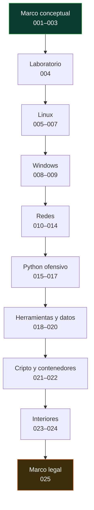

# 🧱 Parte 0 — Fundamentos y prerrequisitos

> [⬅️ Volver al programa](../../README.md) · [📚 Índice completo](../README.md) · [⏭️ Parte siguiente](../parte-1-redes-y-seguridad-de-redes/README.md)

Redes, sistemas operativos, Linux, Windows, cripto base, Python ofensivo y laboratorio

**Fuentes de referencia de esta parte:**

- W. Richard Stevens, *TCP/IP Illustrated, Volume 1: The Protocols* (2ª ed., Addison-Wesley).
- Andrew S. Tanenbaum & Herbert Bos, *Modern Operating Systems* (4ª ed., Pearson).
- Michael Kerrisk, *The Linux Programming Interface* (No Starch Press).
- Justin Seitz & Tim Arnold, *Black Hat Python* (2ª ed., No Starch Press).
- Jon Erickson, *Hacking: The Art of Exploitation* (2ª ed., No Starch Press).
- NIST SP 800-series y el *Cybersecurity Framework (CSF) 2.0*.

---

## 🎯 ¿De qué trata esta parte?

La Parte 0 es la base sobre la que se construye todo el programa. Antes de atacar o defender un sistema hay que **entenderlo**: cómo viajan los paquetes por una red, cómo un sistema operativo gestiona procesos y permisos, cómo se representan los datos en binario y cómo la criptografía protege la información. Sin estos fundamentos, las técnicas ofensivas y defensivas de las partes siguientes se vuelven recetas memorizadas sin criterio.

Cubrimos cinco pilares: **redes** (modelo OSI/TCP-IP, protocolos, DNS, HTTP, subnetting), **sistemas operativos** (Linux y Windows a nivel administrativo y de interiores, procesos, memoria, syscalls), **automatización** (Bash, PowerShell y sobre todo Python ofensivo con sockets y Scapy), **representación y criptografía base** (encoding, sistemas de numeración, hashing y cifrado), y el **entorno de trabajo** (laboratorio virtualizado, Docker, Git y expresiones regulares). Cerramos con ética y legalidad, el marco que hace legítima toda la práctica posterior.

Esta parte sirve a quien llega desde soporte, desarrollo, sysadmin o desde cero con vocación. Al terminarla tendrás un laboratorio funcional, la capacidad de leer tráfico y logs, y el criterio para saber por qué una defensa funciona o falla.

## 🧩 Problemas que resuelve

- No tener un entorno seguro y aislado donde practicar sin dañar sistemas reales ni redes ajenas.
- Confundir conceptos básicos (autenticación vs. autorización, cifrado vs. codificación, hashing vs. cifrado).
- No saber interpretar una captura de red, un volcado hexadecimal o una cabecera HTTP.
- Depender de herramientas gráficas sin entender qué hacen por debajo ni poder automatizar.
- No comprender el modelo de permisos de Linux/Windows, origen de la mayoría de las escaladas de privilegios.
- Escribir scripts frágiles en lugar de herramientas reproducibles y versionadas.
- Practicar técnicas ofensivas sin marco legal ni ético, con riesgo personal y profesional.

## 🎓 Resultados de aprendizaje

Al terminar la parte, el alumno podrá:

- Montar y aislar un laboratorio de seguridad con máquinas virtuales, snapshots y redes internas.
- Explicar la tríada CIA, el modelo AAA, la superficie de ataque y la defensa en profundidad con ejemplos.
- Operar Linux y Windows con soltura: filesystem, permisos, procesos, registro, servicios y scripting.
- Capturar, filtrar y razonar sobre tráfico TCP/IP, DNS, DHCP, ARP y HTTP/HTTPS.
- Calcular subredes y direccionar una red sin calculadora.
- Escribir herramientas de seguridad en Python usando sockets y Scapy.
- Distinguir y aplicar correctamente encoding, hashing y cifrado simétrico/asimétrico.
- Actuar dentro de la ley y la ética: alcance, autorización y divulgación responsable.

## 🧱 Prerrequisitos

Ninguno formal: es el punto de entrada del programa. Se asume manejo básico de un computador (instalar software, navegar por carpetas) y disposición para trabajar en línea de comandos. Un equipo con virtualización por hardware (VT-x/AMD-V) y al menos 8 GB de RAM es muy recomendable.

## 🗺️ Estructura temática

<!-- arco:inicio -->

<!-- arco:fin -->

| Bloque | Clases | Contenido |
|--------|--------|-----------|
| Marco conceptual | 001–003 | CIA/AAA, panorama de amenazas, frameworks |
| Laboratorio | 004 | Virtualización, Kali, snapshots, aislamiento |
| Linux | 005–007 | Filesystem, permisos, CLI avanzada, Bash |
| Windows | 008–009 | Arquitectura, registro, servicios, PowerShell |
| Redes | 010–014 | OSI/TCP-IP, protocolos, DNS/DHCP/ARP, HTTP, subnetting |
| Python ofensivo | 015–017 | Lenguaje, sockets, Scapy |
| Herramientas y datos | 018–020 | Git, regex, numeración y encoding |
| Cripto y contenedores | 021–022 | Criptografía base, Docker |
| Interiores | 023–024 | Procesos/memoria/syscalls, arquitectura de CPU |
| Marco legal | 025 | Ética, legalidad, alcance, divulgación |

## 🔗 Referencias de la parte

- NIST Cybersecurity Framework 2.0 — <https://www.nist.gov/cyberframework>
- MITRE ATT&CK — <https://attack.mitre.org/>
- The Linux Documentation Project — <https://tldp.org/>
- RFC Editor (RFCs 791, 793, 1035, 2616, 9110) — <https://www.rfc-editor.org/>
- OWASP — <https://owasp.org/>

## ▶️ Empezar

[Clase 001 — Qué es la ciberseguridad: tríada CIA, AAA, superficie de ataque y defensa en profundidad](001-que-es-la-ciberseguridad-triada-cia-aaa-superficie-de-ataque-y-defensa-en-profundidad/README.md)
