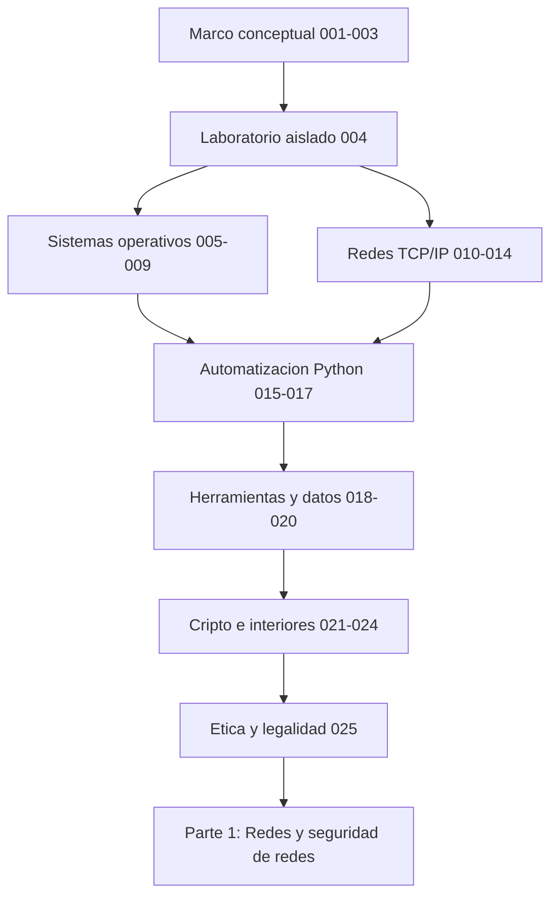

# Parte 0 — Fundamentos y prerrequisitos

> [⬅️ Volver al programa](../../README.md) · [📚 Índice completo](../README.md) · [⏭️ Parte siguiente](../parte-1-redes-y-seguridad-de-redes/README.md)

**25 clases** · rango 001–025 · Redes, sistemas operativos, Linux, Windows, cripto base, Python ofensivo y laboratorio

**Fuentes de referencia de esta parte:**

- W. Richard Stevens, *TCP/IP Illustrated, Volume 1: The Protocols* (2ª ed., Addison-Wesley).
- Andrew S. Tanenbaum & Herbert Bos, *Modern Operating Systems* (4ª ed., Pearson).
- Michael Kerrisk, *The Linux Programming Interface* (No Starch Press).
- Justin Seitz & Tim Arnold, *Black Hat Python* (2ª ed., No Starch Press).
- Jon Erickson, *Hacking: The Art of Exploitation* (2ª ed., No Starch Press).
- NIST SP 800-series y el *Cybersecurity Framework (CSF) 2.0*.

---

## 🎯 ¿De qué trata esta parte?

La Parte 0 es la base sobre la que se construye todo el programa. Antes de atacar o defender un sistema hay que **entenderlo**: cómo viajan los paquetes por una red, cómo un sistema operativo gestiona procesos y permisos, cómo se representan los datos en binario y cómo la criptografía protege la información. Sin estos fundamentos, las técnicas ofensivas y defensivas de las partes siguientes se vuelven recetas memorizadas sin criterio.

Cubrimos cinco pilares: **redes** (modelo OSI/TCP-IP, protocolos, DNS, HTTP, subnetting), **sistemas operativos** (Linux y Windows a nivel administrativo y de interiores, procesos, memoria, syscalls), **automatización** (Bash, PowerShell y sobre todo Python ofensivo con sockets y Scapy), **representación y criptografía base** (encoding, sistemas de numeración, hashing y cifrado), y el **entorno de trabajo** (laboratorio virtualizado, Docker, Git y expresiones regulares). Cerramos con ética y legalidad, el marco que hace legítima toda la práctica posterior.

Esta parte sirve a quien llega desde soporte, desarrollo, sysadmin o desde cero con vocación. Al terminarla tendrás un laboratorio funcional, la capacidad de leer tráfico y logs, y el criterio para saber por qué una defensa funciona o falla.

## 🧩 Problemas que resuelve

- No tener un entorno seguro y aislado donde practicar sin dañar sistemas reales ni redes ajenas.
- Confundir conceptos básicos (autenticación vs. autorización, cifrado vs. codificación, hashing vs. cifrado).
- No saber interpretar una captura de red, un volcado hexadecimal o una cabecera HTTP.
- Depender de herramientas gráficas sin entender qué hacen por debajo ni poder automatizar.
- No comprender el modelo de permisos de Linux/Windows, origen de la mayoría de las escaladas de privilegios.
- Escribir scripts frágiles en lugar de herramientas reproducibles y versionadas.
- Practicar técnicas ofensivas sin marco legal ni ético, con riesgo personal y profesional.

## 🎓 Resultados de aprendizaje

Al terminar la parte, el alumno podrá:

- Montar y aislar un laboratorio de seguridad con máquinas virtuales, snapshots y redes internas.
- Explicar la tríada CIA, el modelo AAA, la superficie de ataque y la defensa en profundidad con ejemplos.
- Operar Linux y Windows con soltura: filesystem, permisos, procesos, registro, servicios y scripting.
- Capturar, filtrar y razonar sobre tráfico TCP/IP, DNS, DHCP, ARP y HTTP/HTTPS.
- Calcular subredes y direccionar una red sin calculadora.
- Escribir herramientas de seguridad en Python usando sockets y Scapy.
- Distinguir y aplicar correctamente encoding, hashing y cifrado simétrico/asimétrico.
- Actuar dentro de la ley y la ética: alcance, autorización y divulgación responsable.

## 🧱 Prerrequisitos

Ninguno formal: es el punto de entrada del programa. Se asume manejo básico de un computador (instalar software, navegar por carpetas) y disposición para trabajar en línea de comandos.

En cuanto al equipo, esto es lo que conviene tener antes de llegar a la [Clase 004](004-montaje-del-laboratorio-virtualizacion-kali-snapshots-y-aislamiento-de-red/README.md), donde se monta el laboratorio:

| Requisito | Mínimo | Recomendado | Por qué |
|---|---|---|---|
| Virtualización por hardware | VT-x / AMD-V activada en la BIOS | ídem | Sin ella las máquinas virtuales o no arrancan o van a paso de tortuga |
| RAM | 8 GB | 16 GB | 8 GB permite una VM cómoda; 16 GB permite atacante y víctima a la vez |
| Disco libre | 60 GB | 120 GB | Kali, una o dos víctimas y sus *snapshots* ocupan más de lo que parece |
| CPU | 4 hilos | 8 hilos | Compilar, capturar tráfico y ejecutar dos VM en paralelo |
| Sistema anfitrión | Windows, macOS o Linux | cualquiera de los tres | Todas las clases indican el equivalente en los tres sistemas |
| Conexión | intermitente | estable | Solo para descargar ISOs e imágenes; el laboratorio trabaja aislado |

> 💡 Si tu equipo se queda corto, la mayor parte del contenido de Linux, Python, redes teóricas y criptografía se puede seguir con **Docker** ([Clase 022](022-docker-y-contenedores-para-laboratorios-de-seguridad/README.md)) o con un VPS barato, sin virtualización completa.

## 🧭 Cómo recorrer esta parte

**El orden importa.** Las 25 clases están numeradas y encadenadas a propósito: cada una da por sabido lo de la anterior. Si vienes de otro sitio y te tienta empezar por la 015 (Python) o la 022 (Docker), lee antes la sección **🚦 ¿Puedo saltarme clases?** de esta misma página.

**El ritmo.** La parte suma unas **44 h 30 min** de trabajo guiado, sin contar los ejercicios ni el reto de cada clase. Repartida de forma realista:

| Ritmo | Dedicación | Duración de la Parte 0 |
|---|---|---|
| Intensivo | 4 h/día, 5 días/semana | ≈ 2,5 semanas |
| Sostenido | 2 h/día, 5 días/semana | ≈ 5 semanas |
| Compatible con trabajo | 1 h/día + fines de semana | ≈ 8-10 semanas |

**El método, clase a clase.** Cada README está pensado para recorrerse en este orden, y saltarse el laboratorio es la forma más rápida de que nada de esto se quede:

1. Lee **🎯 Objetivo** y **📚 Resultados de aprendizaje** para saber qué deberías poder hacer al final.
2. Lee **🧠 Explicación en profundidad** entera antes de tocar el teclado. Es la sección que responde al *porqué*; los diagramas están ahí para que te hagas el modelo mental.
3. Prepara lo que pida **🧰 Herramientas y preparación**.
4. Haz el **🧪 Laboratorio guiado** paso a paso, sin copiar y pegar a ciegas: si un comando falla, la respuesta suele estar en **⚠️ Errores comunes**.
5. Resuelve los **✍️ Ejercicios** y, sobre todo, el **📝 Reto verificable**: tiene criterio de aceptación explícito, así que puedes autocorregirte.
6. Repasa el **📔 Glosario** al cerrar. Si hay un término que no sabrías explicar en voz alta, vuelve a la sección donde aparece.

**Qué hacer con lo que produces.** Desde la [Clase 018](018-git-y-control-de-versiones-para-profesionales-de-seguridad/README.md) tendrás Git; a partir de ahí versiona tus scripts, tus notas y tus fichas de reto en un repositorio propio. Ese repositorio es, en la práctica, tu primer portafolio de seguridad.

**Cómo comprobar que va calando.** Al terminar la parte, pasa por la [autoevaluación](../../autoevaluaciones/README.md) —tiene una batería específica de la Parte 0— y marca tu avance en el [seguimiento de progreso](https://vladimiracunadev-create.github.io/modern-cybersecurity-program/autoevaluaciones/progreso.html). Si fallas más de un tercio de las preguntas de un bloque, vuelve a ese bloque antes de seguir a la Parte 1.

## 🧱 Anatomía de una clase

Las 25 clases de la Parte 0 siguen el **estándar pedagógico profundo** del programa, así que sabes de antemano qué te vas a encontrar en cada README y en qué orden:

| Sección | Qué contiene | Para qué la usas |
|---|---|---|
| 🎯 Objetivo | Qué sabrás hacer al terminar y por qué importa | Decidir si necesitas la clase |
| 📚 Resultados de aprendizaje | Lista verificable de capacidades concretas | Autoevaluarte al final |
| 🗺️ Temas | Cada tema con el porqué de su inclusión | Ubicarte antes de leer |
| 🧠 Explicación en profundidad | Prosa que explica el mecanismo y lo conecta con el resto del programa, con diagramas | Entender, no memorizar |
| 📖 Definiciones y características | Cada término desarrollado con su relevancia en seguridad | Consulta puntual |
| 📔 Glosario | Términos y siglas de la clase, en una tabla | Repaso rápido |
| 🧰 Herramientas y preparación | Qué instalar y tener a mano | Antes del laboratorio |
| 🧪 Laboratorio guiado | Práctica paso a paso con herramientas reales | Donde de verdad se aprende |
| ✍️ Ejercicios | Problemas para resolver por tu cuenta | Consolidar |
| 📝 Reto verificable | Un entregable con criterio de aceptación | Demostrar que lo dominas |
| ⚠️ Errores comunes | Síntoma → causa → solución | Cuando algo falla |
| ❓ Preguntas frecuentes | Las dudas reales que surgen en esta clase | Resolver el "sí, pero…" |
| 🔗 Referencias | Fuentes primarias y libros del área | Profundizar |

El CI del repositorio verifica que ninguna clase de esta parte pierda las secciones **🧠 Explicación en profundidad** ni **📔 Glosario**, así que la profundidad no se degrada con el tiempo.

## 🗺️ Estructura temática

| Bloque | Clases | Contenido | Tiempo |
|--------|--------|-----------|--------|
| Marco conceptual | 001–003 | CIA/AAA, panorama de amenazas, frameworks | ≈ 4 h 40 |
| Laboratorio | 004 | Virtualización, Kali, snapshots, aislamiento | ≈ 2 h |
| Linux | 005–007 | Filesystem, permisos, CLI avanzada, Bash | ≈ 5 h 30 |
| Windows | 008–009 | Arquitectura, registro, servicios, PowerShell | ≈ 3 h 40 |
| Redes | 010–014 | OSI/TCP-IP, protocolos, DNS/DHCP/ARP, HTTP, subnetting | ≈ 8 h 40 |
| Python ofensivo | 015–017 | Lenguaje, sockets, Scapy | ≈ 6 h |
| Herramientas y datos | 018–020 | Git, regex, numeración y encoding | ≈ 4 h 50 |
| Cripto y contenedores | 021–022 | Criptografía base, Docker | ≈ 3 h 50 |
| Interiores | 023–024 | Procesos/memoria/syscalls, arquitectura de CPU | ≈ 3 h 40 |
| Marco legal | 025 | Ética, legalidad, alcance, divulgación | ≈ 1 h 40 |

El orden no es casual: cada bloque habilita el siguiente. El marco conceptual da el
vocabulario, el laboratorio da dónde practicar sin romper nada ajeno, los sistemas
operativos y las redes dan el terreno que después se ataca y se defiende, la
automatización convierte el conocimiento en herramientas propias, y la ética delimita
qué es legítimo hacer con todo lo anterior.

## 📖 Guía capítulo a capítulo

Qué hace cada clase, por qué está donde está y para qué te sirve después.

### 🧠 Bloque 1 · Marco conceptual — clases 001 a 003

Tres clases sin teclado, y son las que más te ahorrarán después. Aquí se fija el **vocabulario** con el que vas a razonar durante las 340 clases del programa: qué se protege exactamente, quién ataca y con qué lógica, y qué marcos usa la industria para hablar de todo ello sin reinventar los términos cada vez.

- **[001 · Qué es la ciberseguridad: tríada CIA, AAA, superficie de ataque y defensa en profundidad](001-que-es-la-ciberseguridad-triada-cia-aaa-superficie-de-ataque-y-defensa-en-profundidad/README.md)** · 90 min — Las propiedades que la disciplina protege de verdad (confidencialidad, integridad, disponibilidad, más autenticidad y no repudio), el ciclo de vida de un acceso (autenticación → autorización → *accounting*), qué es la superficie de ataque y por qué la estrategia correcta es apilar capas asumiendo que alguna caerá. Es el criterio con el que juzgarás cualquier control del resto del programa.
- **[002 · El panorama de amenazas moderno: actores, motivaciones y Cyber Kill Chain](002-el-panorama-de-amenazas-moderno-actores-motivaciones-y-cyber-kill-chain/README.md)** · 90 min — Quién ataca (crimen organizado, Estados, *hacktivistas*, *insiders*), qué busca cada uno y cómo se descompone un ataque dirigido en fases. Saber en qué fase estás mirando es lo que permite decidir *dónde* interrumpir al adversario con el menor coste, en vez de reaccionar a golpes sueltos.
- **[003 · Frameworks de seguridad: NIST CSF, ISO 27001, MITRE ATT&CK y Diamond Model](003-frameworks-de-seguridad-nist-csf-iso-27001-mitre-att-ck-y-diamond-model/README.md)** · 100 min — La diferencia esencial entre marcos de **gestión de riesgo** (CSF, ISO 27001), que organizan el gobierno, y marcos de **conocimiento adversario** (ATT&CK, Diamond Model), que describen cómo opera el atacante. Aquí aprendes a ubicar cualquier técnica dentro de un marco, algo que se te pedirá constantemente en las partes de Blue Team y GRC.

### 🧪 Bloque 2 · Laboratorio — clase 004

Una sola clase, pero es la bisagra de todo el programa: hasta aquí has leído, a partir de aquí ejecutas. Y ejecutas donde el error no tiene consecuencias.

- **[004 · Montaje del laboratorio: virtualización, Kali, snapshots y aislamiento de red](004-montaje-del-laboratorio-virtualizacion-kali-snapshots-y-aislamiento-de-red/README.md)** · 120 min — Construyes una máquina atacante (Kali) y una o más víctimas en una red interna **sin salida a Internet ni a tu red doméstica**, y aprendes a usar *snapshots* para volver a un estado limpio en segundos. Los dos conceptos clave —aislamiento y reversibilidad— son los que hacen que practicar sea seguro; todos los laboratorios posteriores dan este entorno por hecho.

### 🐧 Bloque 3 · Linux — clases 005 a 007

Linux es el sistema del atacante y el de la mayoría de los servidores atacados. Este bloque va de menos a más: primero el modelo de permisos (donde ocurren las escaladas de privilegios), después la terminal como herramienta de análisis, y por último la automatización.

- **[005 · Linux esencial para seguridad: filesystem, permisos y usuarios](005-linux-esencial-para-seguridad-filesystem-permisos-y-usuarios/README.md)** · 110 min — El modelo `rwx` en sus dos notaciones, usuarios y grupos, `/etc/passwd` frente a `/etc/shadow`, y los bits especiales (SUID, SGID, *sticky*) que son la vía clásica de escalada de privilegios. Casi todo el *hardening* de Linux y casi toda su explotación local se reducen a este modelo.
- **[006 · Línea de comandos Linux avanzada: grep, sed, awk, pipes y procesos](006-linea-de-comandos-linux-avanzada-grep-sed-awk-pipes-y-procesos/README.md)** · 110 min — Encadenar comandos con tuberías, filtrar con `grep`, transformar con `sed`, agregar campos con `awk` y controlar procesos y señales. En un incidente real, esto es lo que separa responder en minutos de responder en horas: cuando tengas 400 MB de logs, esta clase es la que aplicas.
- **[007 · Bash scripting para tareas de seguridad](007-bash-scripting-para-tareas-de-seguridad/README.md)** · 110 min — El salto de teclear comandos sueltos a construir scripts robustos: variables, condicionales, bucles, funciones, argumentos y control de errores. Automatizarás barridos de red, *parsing* de salidas de herramientas y comprobaciones de configuración, con las prácticas que separan un script frágil de uno reutilizable.

### 🪟 Bloque 4 · Windows — clases 008 a 009

Windows domina el parque corporativo, así que la mayoría de los objetivos reales lo llevan. Sin estos dos capítulos, toda la Parte 7 (Red Team, Active Directory) sería magia negra.

- **[008 · Windows esencial para seguridad: arquitectura, registro y servicios](008-windows-esencial-para-seguridad-arquitectura-registro-y-servicios/README.md)** · 110 min — La arquitectura de doble modo (usuario/kernel), el modelo de seguridad basado en **SID y tokens**, qué hace realmente UAC, el Registro como base de datos de configuración y los servicios como procesos privilegiados de fondo. Aquí aparecen por primera vez las claves `Run` y los privilegios de token que después se usan para persistencia y escalada.
- **[009 · PowerShell para seguridad ofensiva y defensiva](009-powershell-para-seguridad-ofensiva-y-defensiva/README.md)** · 110 min — La herramienta dual por excelencia: los atacantes la usan para *vivir de la tierra* porque viene preinstalada y firmada por Microsoft, y los defensores para automatizar triaje y respuesta. Aprenderás la tubería de **objetos** —lo que lo distingue radicalmente de Bash—, a consultar procesos, servicios, red y eventos, y qué deja registrado cada uso.

### 🌐 Bloque 5 · Redes — clases 010 a 014

El bloque más largo de la parte, y con razón: la red es el terreno común de casi todo lo que viene después. Se avanza de la abstracción al detalle y del detalle al cálculo.

- **[010 · Redes TCP/IP: modelo OSI, encapsulación y capas](010-redes-tcp-ip-modelo-osi-encapsulacion-y-capas/README.md)** · 100 min — La abstracción más importante de la disciplina: cómo se **encapsulan** los datos al bajar por la pila y se desencapsulan al subir, y cómo traducir entre el modelo OSI de 7 capas (el vocabulario de la industria) y el TCP/IP de 4 (lo que Internet implementa de verdad). Sin esto, una captura de Wireshark es ruido.
- **[011 · Protocolos de red: IP, TCP, UDP e ICMP en profundidad](011-protocolos-de-red-ip-tcp-udp-e-icmp-en-profundidad/README.md)** · 110 min — Las cabeceras campo a campo, el *three-way handshake*, el cierre de conexión y la diferencia radical de UDP. Este es el sustrato exacto del escaneo de puertos, del *fingerprinting* de sistemas operativos y de una familia entera de ataques de red: entender los flags TCP aquí es lo que hace que un SYN scan tenga sentido en la Parte 3.
- **[012 · DNS, DHCP y ARP: funcionamiento y riesgos](012-dns-dhcp-y-arp-funcionamiento-y-riesgos/README.md)** · 100 min — Los tres protocolos que hacen funcionar cualquier red local, y su pecado original común: se diseñaron **sin autenticación**, para redes confiables. De ahí salen el *ARP spoofing*, el *DNS cache poisoning* y los ataques de DHCP fraudulento que verás en la Parte 1 y en Red Team.
- **[013 · HTTP, HTTPS y la arquitectura de la web moderna](013-http-https-y-la-arquitectura-de-la-web-moderna/README.md)** · 110 min — Anatomía de peticiones y respuestas, métodos y códigos de estado, cabeceras, y cómo cookies y sesiones simulan estado sobre un protocolo que no lo tiene. Más TLS: qué añade exactamente y qué no. Es el prerrequisito directo de toda la Parte 4 (seguridad de aplicaciones web).
- **[014 · Direccionamiento IP y subnetting](014-direccionamiento-ip-y-subnetting/README.md)** · 100 min — Moverte entre decimal, binario y CIDR, y calcular red, broadcast, primer y último host y direcciones utilizables **sin calculadora**. Es la destreza que usas cada vez que defines el alcance de un escaneo, segmentas una red o interpretas el rango de un objetivo en un contrato de pentest.

### 🐍 Bloque 6 · Python ofensivo — clases 015 a 017

Tres clases encadenadas que van del lenguaje a la red y de la red al paquete. Al final de este bloque dejas de ser usuario de herramientas para empezar a escribir las tuyas.

- **[015 · Python para seguridad: fundamentos del lenguaje](015-python-para-seguridad-fundamentos-del-lenguaje/README.md)** · 120 min — Tipos y estructuras de datos, control de flujo, funciones y módulos, archivos y excepciones. Python es el idioma franco de la ciberseguridad —ofensiva y defensiva— por su legibilidad y por un ecosistema (`requests`, `scapy`, `pwntools`) que no tiene equivalente.
- **[016 · Python para seguridad: sockets y programación de red](016-python-para-seguridad-sockets-y-programacion-de-red/README.md)** · 120 min — Clientes y servidores TCP y UDP con la librería estándar, un escáner de puertos con manejo de *timeouts* y un *banner grabber* que identifica servicios. Cada línea de código se corresponde con un concepto del bloque de redes: aquí es donde la teoría de las clases 010–014 se vuelve tangible.
- **[017 · Python para seguridad: manipulación de paquetes con Scapy](017-python-para-seguridad-manipulacion-de-paquetes-con-scapy/README.md)** · 120 min — Forjar paquetes capa por capa controlando cada campo, implementar tu propio `ping` y tu propio SYN scan *half-open*, esnifar con filtros. La diferencia con los sockets es total: allí el kernel construía las cabeceras por ti; aquí decides tú hasta el TTL. Es la puerta de entrada al *packet crafting* de las partes ofensivas.

### 🧰 Bloque 7 · Herramientas y datos — clases 018 a 020

Tres capacidades transversales que usarás en todas las partes restantes: versionar tu trabajo, extraer señal de montañas de texto, y leer datos a bajo nivel.

- **[018 · Git y control de versiones para profesionales de seguridad](018-git-y-control-de-versiones-para-profesionales-de-seguridad/README.md)** · 100 min — Flujo básico, ramas, conflictos y —lo importante aquí— **higiene de secretos**: por qué el modelo de datos de Git hace que una credencial empujada al historial no desaparezca borrando el archivo, y qué se hace entonces. Es uno de los fallos más comunes y más caros del mundo real.
- **[019 · Expresiones regulares para análisis de logs y datos](019-expresiones-regulares-para-analisis-de-logs-y-datos/README.md)** · 100 min — Clases, cuantificadores, anclas, grupos de captura y *lookarounds*, con criterio para saber también **cuándo no usar regex**. Están en todas partes: SIEM, reglas de IDS, detecciones de YARA, `grep`. Incluye los patrones peligrosos que provocan *ReDoS*.
- **[020 · Sistemas de numeración y encoding: binario, hex, base64 y URL](020-sistemas-de-numeracion-y-encoding-binario-hex-base64-y-url/README.md)** · 90 min — Leer volcados hexadecimales, reconocer y decodificar payloads, y sobre todo distinguir tres cosas que se confunden a diario con consecuencias graves: **codificación**, **cifrado** y **hashing**. Confundirlas produce errores tan reales como creer que un `Authorization: Basic` protege una credencial.

### 🔐 Bloque 8 · Criptografía y contenedores — clases 021 a 022

Dos clases que no se parecen entre sí pero comparten función: ambas te dan una infraestructura de la que después dependerás sin darte cuenta.

- **[021 · Criptografía: conceptos fundamentales e intuición](021-criptografia-conceptos-fundamentales-e-intuicion/README.md)** · 120 min — Cifrado simétrico y asimétrico, funciones hash, HMAC, firmas digitales e intercambio de claves, y —lo más valioso— **qué garantiza cada primitiva y qué no**. Es la intuición que sostiene TLS, la firma de binarios, la autenticación y el almacenamiento de contraseñas; se profundiza en la Parte 2, pero sin esta base aquella no se sigue.
- **[022 · Docker y contenedores para laboratorios de seguridad](022-docker-y-contenedores-para-laboratorios-de-seguridad/README.md)** · 110 min — Construir imágenes con un `Dockerfile`, gestionar contenedores, orquestar servicios con Compose y entender el modelo de aislamiento real (*namespaces*, *cgroups*) y sus límites. A partir de aquí, los [laboratorios del programa](../../labs/README.md) se levantan con un comando, y en la Parte 10 esto se convierte en superficie de ataque por derecho propio.

### ⚙️ Bloque 9 · Interiores — clases 023 a 024

Las dos clases más "de máquina" de la parte. No buscan convertirte en programador de sistemas, sino darte el modelo mental sin el cual la explotación binaria, la ingeniería inversa y el análisis de malware son imposibles de seguir.

- **[023 · Sistemas operativos: procesos, memoria y syscalls](023-sistemas-operativos-procesos-memoria-y-syscalls/README.md)** · 110 min — Estados de un proceso y planificador, el mapa de memoria (`text`, `data`, BSS, heap, stack) y la frontera entre modo usuario y modo kernel que cruzan las **llamadas al sistema**. Es el sustrato exacto sobre el que ocurren la inyección de código, la evasión de *sandbox* y su detección.
- **[024 · Arquitectura de computadores: CPU, registros y memoria](024-arquitectura-de-computadores-cpu-registros-y-memoria/README.md)** · 110 min — Registros, ciclo de ejecución, ensamblador básico y, sobre todo, el **marco de pila**: cómo `call` apila la dirección de retorno y cómo `ret` la desapila. Ahí vive el *stack buffer overflow*, y con él el porqué de los canarios, NX/DEP y ASLR. Es el prerrequisito duro de la Parte 5.

### ⚖️ Bloque 10 · Marco legal — clase 025

- **[025 · Ética, legalidad, alcance y divulgación responsable](025-etica-legalidad-alcance-y-divulgacion-responsable/README.md)** · 100 min — Qué es la **autorización** y por qué es innegociable, cómo se define y se respeta el alcance de un compromiso, qué conductas tipifican las leyes de delitos informáticos y cómo divulgar una vulnerabilidad sin causar daño ni exponerte legalmente. Cierra la parte a propósito: es lo que convierte todo lo anterior en una profesión en lugar de en un delito.

## 🧰 Qué tendrás al terminar

No solo conocimiento: cosas concretas que puedes enseñar y seguir usando.

- Un **laboratorio aislado y reversible** con máquina atacante y víctimas, y el hábito de trabajar con *snapshots*.
- Un **repositorio Git propio** con tus scripts de Bash, PowerShell y Python, versionado y sin secretos en el historial.
- Un **escáner de puertos** y un ***banner grabber*** escritos por ti con sockets, más un `ping` y un SYN scan hechos con Scapy.
- **Fichas de análisis** de al menos un activo: clasificación CIA, matriz AAA, mapa de superficie de ataque y diagrama de defensa en profundidad.
- La capacidad de **leer una captura de red** y una **cabecera HTTP** sin herramienta que te lo interprete.
- Un **entorno Docker** para levantar laboratorios desechables en segundos.
- El criterio para **decir que no** a un encargo sin autorización escrita, y para divulgar un hallazgo correctamente.

## 🚦 ¿Puedo saltarme clases?

Puedes, pero con criterio. Sáltate una clase solo si puedes responder **de memoria y en voz alta** a su pregunta de control:

| Si dominas… | Pregunta de control | Si titubeas |
|---|---|---|
| Linux (005–007) | ¿Qué significa `x` sobre un **directorio**, y qué hace SUID? | Haz 005 completa |
| Windows (008–009) | ¿Qué es un token de acceso y en qué se diferencia de un SID? | Haz 008 completa |
| Redes (010–014) | ¿Cuántos hosts utilizables tiene un `/27` y por qué? | Haz 014 al menos |
| Python (015–017) | ¿Cómo distingues con sockets un puerto **cerrado** de uno **filtrado**? | Haz 016 completa |
| Cripto (021) | ¿Por qué un hash no es cifrado, y para qué sirve HMAC? | Haz 021 completa |
| Interiores (023–024) | ¿Dónde vive la dirección de retorno y qué la protege? | Haz 024 completa |

Tres clases **no se saltan nunca**, aunque vengas con experiencia: la [001](001-que-es-la-ciberseguridad-triada-cia-aaa-superficie-de-ataque-y-defensa-en-profundidad/README.md) porque fija el vocabulario que usa todo el programa, la [004](004-montaje-del-laboratorio-virtualizacion-kali-snapshots-y-aislamiento-de-red/README.md) porque sin laboratorio aislado no hay práctica segura, y la [025](025-etica-legalidad-alcance-y-divulgacion-responsable/README.md) porque delimita qué puedes hacer legalmente con el resto.

## ❓ Dudas frecuentes antes de empezar

**❓ ¿Necesito saber programar para empezar?** No. La Parte 0 introduce Bash, PowerShell y Python desde cero, en ese orden y con ejemplos de seguridad. Lo que sí necesitas es tolerancia a la línea de comandos.

**❓ ¿Puedo hacer los laboratorios en mi equipo de trabajo?** No lo hagas. Usa un equipo personal o una VM claramente separada: varios laboratorios levantan servicios deliberadamente vulnerables, y muchas políticas corporativas prohíben instalar herramientas ofensivas.

**❓ ¿Hace falta Kali, o me vale mi Linux de siempre?** Vale cualquier Linux, pero Kali trae el instrumental ya integrado y las clases dan por hechas sus rutas y sus paquetes. Si usas otra distribución, cuenta con dedicar tiempo a instalar herramientas.

**❓ ¿Por qué hay tanta teoría antes de tocar herramientas?** Porque las herramientas cambian cada dos años y los fundamentos no. Quien aprende `nmap` sin entender TCP sabe teclear un comando; quien entiende TCP puede interpretar cualquier escáner y escribir el suyo —que es exactamente lo que harás en la clase [017](017-python-para-seguridad-manipulacion-de-paquetes-con-scapy/README.md).

**❓ ¿Y si me atasco en una clase?** Empieza por **⚠️ Errores comunes** y **❓ Preguntas frecuentes** de esa clase, que recogen los tropiezos reales. Si sigue sin salir, continúa con el laboratorio de la siguiente y vuelve: muchos conceptos encajan al verlos aplicados más adelante.

**❓ ¿Qué viene después de la Parte 0?** La [Parte 1 — Redes y seguridad de redes](../parte-1-redes-y-seguridad-de-redes/README.md), que retoma exactamente donde termina el bloque de redes. Si quieres ver el recorrido completo hacia un rol concreto, mira las [rutas por rol](../../rutas/README.md).

## 🔗 Referencias de la parte

- NIST Cybersecurity Framework 2.0 — <https://www.nist.gov/cyberframework>
- MITRE ATT&CK — <https://attack.mitre.org/>
- The Linux Documentation Project — <https://tldp.org/>
- RFC Editor (RFCs 791, 793, 1035, 2616, 9110) — <https://www.rfc-editor.org/>
- OWASP — <https://owasp.org/>

## ▶️ Empezar

Si vas a hacer la parte entera, empieza por el principio y no cambies el orden:

[Clase 001 — Qué es la ciberseguridad: tríada CIA, AAA, superficie de ataque y defensa en profundidad](001-que-es-la-ciberseguridad-triada-cia-aaa-superficie-de-ataque-y-defensa-en-profundidad/README.md)

Y si quieres tener el laboratorio funcionando desde el primer día, deja programada la [Clase 004](004-montaje-del-laboratorio-virtualizacion-kali-snapshots-y-aislamiento-de-red/README.md) para una sesión con tiempo: es la única de la parte que depende de descargas grandes.
