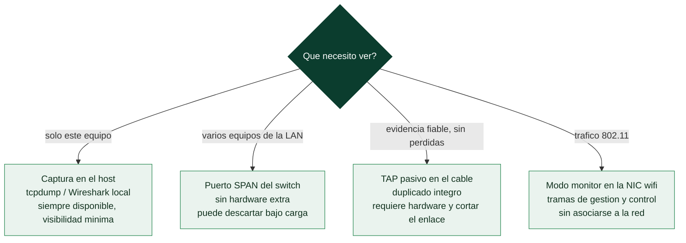

# Clase 026 — Wireshark: captura y análisis de paquetes

> Parte: **1 — Redes y seguridad de redes** · Fuente: *Practical Packet Analysis, C. Sanders*
> ⏱️ Duración estimada: **120 min** · Nivel: **Fundamentos**

---

## 🎯 Objetivo

Aprender a capturar tráfico de red con Wireshark, entender la anatomía de un paquete disecado capa por capa (Ethernet → IP → TCP/UDP → aplicación) y usar la interfaz para responder preguntas concretas: quién habla con quién, con qué protocolo y qué transporta. Al final el alumno tendrá un método reproducible para pasar de una captura cruda a una conclusión.

## 📚 Resultados de aprendizaje

Al finalizar, el alumno podrá:

1. **Configurar** una interfaz en modo promiscuo y elegir el punto de captura correcto.
2. **Capturar** tráfico en vivo y guardarlo en formato `.pcapng` para análisis posterior.
3. **Interpretar** las tres zonas de la ventana (lista de paquetes, detalle disecado, bytes crudos).
4. **Distinguir** las capas del modelo TCP/IP dentro de un mismo paquete.
5. **Colorear y perfilar** la vista para resaltar anomalías rápidamente.
6. **Exportar** objetos y subconjuntos de paquetes para compartir evidencia.

## 🗺️ Temas

| # | Tema | Por qué importa |
|---|------|-----------------|
| 1 | Puntos de captura (hub, SPAN, TAP, host) | Determina qué tráfico ves realmente |
| 2 | Modo promiscuo vs. monitor | Sin él solo ves tu propio tráfico |
| 3 | Anatomía de la ventana de Wireshark | Es tu instrumento principal |
| 4 | Disección por capas | Localizar el dato relevante rápido |
| 5 | Perfiles y reglas de colorización | Acelera el triaje visual |
| 6 | Marcas de tiempo y referencia temporal | Medir latencia y ordenar eventos |
| 7 | Exportar objetos y guardar subconjuntos | Compartir evidencia sin ruido |

## 🧠 Explicación en profundidad

### El problema no es capturar, es capturar donde hay algo que ver

La primera decisión de cualquier análisis no es qué filtro escribir, sino **dónde
enchufar el analizador**, y es la que más capturas inútiles produce. La red de los años
noventa usaba *hubs*, que repetían cada trama por todos los puertos: bastaba con
conectarse en cualquier sitio para verlo todo. La red moderna es **conmutada**, y un
switch aprende qué MAC vive detrás de cada puerto y entrega cada trama solo por el
puerto correcto. La consecuencia práctica es dura: si abres Wireshark en tu portátil
conectado a un switch, verás tu propio tráfico, el *broadcast* y el *multicast*, y
nada más. No hay filtro que arregle eso, porque lo que falta nunca llegó a tu tarjeta.

De ahí salen las cuatro posiciones posibles, cada una con su compromiso. Capturar **en
el propio host** es lo más sencillo y siempre está disponible, pero solo ves lo de ese
host y un atacante con privilegios podría manipular lo que ves. Un **puerto SPAN** (o
*mirror*) le pide al switch que copie a un puerto el tráfico de otros: no requiere
hardware extra, pero el switch descarta copias bajo carga, así que puedes perder
justamente los paquetes del incidente. Un **TAP** de red es un dispositivo pasivo
intercalado en el cable que duplica el tráfico sin participar en él: es la opción
fiable y la que se usa cuando la captura tiene que valer como evidencia. Y en
inalámbrico hace falta **modo monitor**, que no es lo mismo que el promiscuo: el
promiscuo entrega las tramas Ethernet que la tarjeta ve aunque no vayan dirigidas a
ella; el monitor entrega las tramas 802.11 crudas, incluidas las de gestión y control,
sin estar asociado a ninguna red.



### Dos filtros que no son el mismo filtro

Wireshark tiene dos lenguajes de filtrado y confundirlos es el error número uno del
principiante. El **filtro de captura** usa la sintaxis BPF (`host 10.0.0.5 and tcp port
80`), se aplica en el momento de capturar y decide qué se guarda en disco: lo que
descarta se pierde para siempre. El **filtro de visualización** usa la sintaxis propia
de Wireshark (`http.request.method == "GET"`), se aplica sobre lo ya capturado y solo
oculta filas: nada se destruye y puedes cambiarlo cuantas veces quieras.

La regla operativa que se deriva de esa asimetría es sencilla: **sé generoso al
capturar y estricto al visualizar**. Filtrar en captura solo se justifica cuando el
volumen es inmanejable o cuando hay una razón legal o de privacidad para no almacenar
cierto tráfico. Si dudas, captura de más: siempre puedes esconder paquetes después,
pero no puedes recuperar los que nunca guardaste.

### La disección: de bytes a campos con nombre

Lo que convierte a Wireshark en un instrumento y no en un volcador de bytes es el
**disector**. Cada protocolo tiene un módulo que sabe leer sus cabeceras y presentarlas
como campos con nombre y tipo, y los disectores se encadenan siguiendo exactamente la
encapsulación que estudiaste en la Parte 0: la trama Ethernet declara en su campo
*type* que lleva IPv4, la cabecera IP declara en *protocol* que lleva TCP, y el puerto
TCP sugiere qué protocolo de aplicación viene dentro. Por eso el panel de detalle es un
árbol desplegable: estás abriendo las capas de fuera hacia dentro.

Ese encadenamiento explica también dos rarezas cotidianas. Que un servicio en un puerto
no estándar aparezca como "Data" es porque el disector se elige por puerto, y la
solución es *Decode As*. Y que los *checksums* TCP/IP salgan en rojo en tu propia
máquina casi nunca indica corrupción: es el **checksum offloading**, es decir, la
tarjeta de red calcula el checksum después de que Wireshark haya visto el paquete, así
que lo que capturas todavía lo lleva vacío.

## 📖 Definiciones y características

- **Paquete / trama (frame):** unidad de datos capturada en el cable. Wireshark muestra la trama Ethernet completa; su característica clave es que incluye todas las cabeceras encapsuladas.
- **Modo promiscuo:** el NIC entrega a la pila todos los frames que ve, no solo los dirigidos a su MAC. Sin él, en una red conmutada solo verás broadcast, multicast y tu propio unicast.
- **pcapng:** formato de captura moderno que guarda metadatos (interfaz, comentarios, timestamps de alta resolución). Sucesor del clásico `.pcap`.
- **Disector (dissector):** módulo que interpreta bytes de un protocolo y los presenta como campos legibles. Wireshark trae cientos.
- **Colorización:** reglas que pintan filas según condiciones (p. ej. rojo para checksums malos, negro para resets TCP).
- **SPAN/mirror port:** puerto del switch configurado para copiar el tráfico de otros puertos hacia el analizador.

## 📔 Glosario

| Término | Definición concisa |
|---------|--------------------|
| Trama (*frame*) | Unidad de datos en el cable, con todas las cabeceras encapsuladas |
| Modo promiscuo | La NIC entrega todas las tramas Ethernet que ve, no solo las suyas |
| Modo monitor | Captura de tramas 802.11 crudas sin asociarse a una red |
| SPAN / *mirror port* | Puerto del switch que copia el tráfico de otros puertos |
| TAP | Dispositivo pasivo que duplica el tráfico de un enlace sin participar en él |
| BPF | *Berkeley Packet Filter*: sintaxis del filtro de **captura** |
| Filtro de visualización | Sintaxis propia de Wireshark; oculta, no descarta |
| Disector | Módulo que interpreta los bytes de un protocolo como campos con nombre |
| Decode As | Forzar un disector concreto cuando el puerto no es el estándar |
| pcapng | Formato de captura moderno, con metadatos y comentarios |
| Checksum offloading | La NIC calcula el checksum tras la captura; produce falsos rojos |
| Colorización | Reglas que pintan filas según una condición, para triaje visual |
| Perfil | Conjunto guardado de columnas, colores y preferencias |
| Stream index | Identificador que Wireshark asigna a cada conversación TCP |

## 🧰 Herramientas y preparación

- **Wireshark 4.x** (incluye `dumpcap`, `tshark`, `editcap`, `mergecap`). Instalación:
  - Debian/Ubuntu: `sudo apt install wireshark` (acepta que usuarios del grupo `wireshark` capturen sin root).
  - macOS: `brew install --cask wireshark`. Windows: instalador oficial + Npcap.
- Añadir tu usuario al grupo de captura para no ejecutar como root:

  ```bash
  sudo usermod -aG wireshark $USER   # cerrar sesión y volver a entrar
  ```

- Capturas de práctica: usa las **muestras oficiales** de <https://wiki.wireshark.org/SampleCaptures> o genera tráfico propio en tu laboratorio.

> ⚠️ **Nota ética:** captura solo tráfico de redes que administras o para las que tienes autorización explícita. Interceptar comunicaciones ajenas puede ser delito. Practica en tu laboratorio aislado.

## 🧪 Laboratorio guiado

1. **Elige interfaz.** Abre Wireshark; en la pantalla de inicio verás las interfaces con un *sparkline* de actividad. Elige la que tenga tráfico (p. ej. `eth0`).
2. **Aplica un filtro de captura** para reducir ruido antes de capturar. En el campo "capture filter" escribe:

   ```text
   host 192.168.56.101 and tcp port 80
   ```

   (sintaxis BPF, distinta a los filtros de visualización).
3. **Inicia la captura** con la aleta azul. En otra terminal genera tráfico:

   ```bash
   curl http://192.168.56.101/
   ```

4. **Detén la captura** (botón rojo). Observa las tres zonas: lista, detalle y bytes.
5. **Expande la disección** de un paquete HTTP: haz clic en el triángulo de cada capa (Ethernet II → Internet Protocol → Transmission Control Protocol → Hypertext Transfer Protocol).
6. **Identifica el 3-way handshake:** localiza `SYN`, `SYN, ACK`, `ACK` al inicio del flujo.
7. **Añade una columna** útil: clic derecho sobre el campo TCP `Stream index` → *Apply as Column*.
8. **Colorea resets:** Ver → Reglas de colorización → añade `tcp.flags.reset==1` con fondo rojo.
9. **Exporta un objeto HTTP:** Archivo → Exportar objetos → HTTP, y guarda el recurso descargado.
10. **Guarda un subconjunto:** selecciona paquetes marcados y Archivo → Exportar paquetes especificados como `lab026.pcapng`.

## ✍️ Ejercicios

1. Captura un `ping` a un host de tu laboratorio e identifica los paquetes ICMP echo request/reply.
2. Con una captura HTTP, localiza el `User-Agent` enviado por el cliente.
3. Añade columnas para `ip.ttl` y compara TTL de tu gateway vs. un host remoto; deduce el SO probable.
4. Crea un **perfil** nuevo llamado "triage" con tus columnas y colores, y cámbialo con el selector inferior derecho.
5. Usa Estadísticas → Jerarquía de protocolos para ver la composición de una captura de 5 minutos.
6. Exporta a texto plano (Archivo → Exportar disecciones de paquetes) solo los paquetes de un flujo.

## 📝 Reto verificable

A partir de una captura de tu laboratorio con al menos tres protocolos (ICMP, DNS y HTTP), entrega un `.pcapng` recortado que contenga **solo** la conversación HTTP completa de una descarga, más una nota con: IP cliente, IP servidor, recurso solicitado y código de respuesta.

**Criterio de aceptación:** al abrir tu archivo, el revisor ve únicamente esa conversación (sin ruido de otros hosts) y tus datos coinciden con lo que muestra la disección.

## ⚠️ Errores comunes

| Síntoma / mensaje | Causa y cómo arreglar |
|-------------------|-----------------------|
| "No interfaces found" o lista vacía | Faltan permisos de captura; añade el usuario al grupo `wireshark` o revisa Npcap en Windows |
| Solo ves tu propio tráfico | Estás en un switch sin SPAN/TAP; captura en el host, usa un TAP o configura mirror port |
| Todo aparece como "Malformed Packet" | Disector equivocado o offloading del NIC; desactiva TCP checksum offload o usa "Decode As" |
| Checksums TCP/IP en rojo | Checksum offloading de la tarjeta; desactiva validación en Preferencias del protocolo |
| Captura enorme e inmanejable | No usaste filtro de captura; aplica BPF o usa un ring buffer con límite de tamaño |

## ❓ Preguntas frecuentes

**❓ ¿Cuál es la diferencia entre filtro de captura y filtro de visualización?**
El de captura (BPF) decide qué se guarda y no se puede cambiar después; el de visualización solo oculta/enseña sobre lo ya capturado y usa la sintaxis rica de Wireshark (`http.request.method == "GET"`).

**❓ ¿Necesito ser root para capturar?**
No es recomendable. Configura `dumpcap` con capacidades o usa el grupo de captura para que solo el proceso de captura tenga privilegios elevados.

**❓ ¿pcap o pcapng?**
Usa `pcapng` por defecto (metadatos y comentarios). Convierte a `.pcap` con `editcap` solo si una herramienta antigua lo exige.

**❓ ¿Por qué no veo el tráfico de otros equipos en la oficina?**
Las redes modernas son conmutadas: el switch solo te envía lo tuyo. Necesitas un puerto SPAN, un TAP de red o capturar en el propio host.

## 🔗 Referencias

- Sanders, C. *Practical Packet Analysis*, 3rd ed. No Starch Press. <https://nostarch.com/packetanalysis3>
- Wireshark User's Guide. <https://www.wireshark.org/docs/wsug_html_chunked/>
- Wireshark SampleCaptures. <https://wiki.wireshark.org/SampleCaptures>
- pcapng spec. <https://pcapng.github.io/pcapng/>

## 📥 Material descargable

- 📄 [Guía en PDF](./clase-026-guia.pdf) — versión imprimible de esta clase.
- 🎞️ [Presentación (PPTX)](./clase-026-presentacion.pptx) — deck para proyectar en clase.

## ⬅️ Clase anterior

[Clase 025 — Ética, legalidad, alcance y divulgación responsable](../../parte-0-fundamentos-y-prerrequisitos/025-etica-legalidad-alcance-y-divulgacion-responsable/README.md)

## ➡️ Siguiente clase

[Clase 027 — Análisis de tráfico: filtros, seguimiento de flujos y estadísticas](../027-analisis-de-trafico-filtros-seguimiento-de-flujos-y-estadisticas/README.md)
