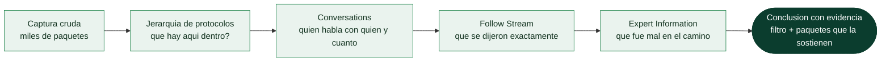

# Clase 027 — Análisis de tráfico: filtros, seguimiento de flujos y estadísticas

> Parte: **1 — Redes y seguridad de redes** · Fuente: *Practical Packet Analysis, C. Sanders*
> ⏱️ Duración estimada: **120 min** · Nivel: **Fundamentos**

---

## 🎯 Objetivo

Dominar el lenguaje de **filtros de visualización** de Wireshark, el seguimiento de flujos (Follow Stream) y las herramientas estadísticas para pasar de miles de paquetes a una respuesta en segundos. El alumno aprenderá a formular preguntas precisas sobre una captura y a responderlas con expresiones y vistas agregadas.

## 📚 Resultados de aprendizaje

Al finalizar, el alumno podrá:

1. **Construir** filtros de visualización complejos con operadores lógicos y de comparación.
2. **Seguir** un flujo TCP/UDP/HTTP y leer el diálogo cliente-servidor reconstruido.
3. **Cuantificar** conversaciones y endpoints con las tablas de estadísticas.
4. **Detectar** anomalías con Expert Information y el gráfico de I/O.
5. **Medir** latencia y round-trip time a partir de las marcas de tiempo.
6. **Automatizar** filtros equivalentes en `tshark` para procesamiento por lotes.

## 🗺️ Temas

| # | Tema | Por qué importa |
|---|------|-----------------|
| 1 | Sintaxis de filtros de visualización | Es el bisturí del análisis |
| 2 | Operadores y campos de protocolo | Precisión al aislar tráfico |
| 3 | Follow TCP/UDP/HTTP/TLS Stream | Ver la conversación completa |
| 4 | Estadísticas: Conversations y Endpoints | Quién habla y cuánto |
| 5 | Jerarquía de protocolos | Composición del tráfico |
| 6 | Expert Information | Retransmisiones, dup ACK, resets |
| 7 | I/O Graph y RTT | Rendimiento y latencia |
| 8 | `tshark` para filtros por lote | Escalar el análisis |

## 🧠 Explicación en profundidad

### El filtro de visualización es un lenguaje, no una caja de búsqueda

Escribir `http` en la barra de filtro no busca la palabra "http" en ninguna parte:
evalúa la expresión booleana "este paquete tiene una capa HTTP". Entender que es un
lenguaje con campos tipados cambia por completo lo que puedes pedirle. Cada campo que
un disector produce es direccionable —`ip.src`, `tcp.flags.syn`, `dns.qry.name`,
`http.response.code`— y Wireshark te dice el nombre exacto de cualquier campo si lo
seleccionas en el panel de detalle y miras la barra de estado.

Sobre esos campos operan comparadores (`==`, `!=`, `>`, `<=`), pertenencia a conjuntos
(`tcp.port in {80 443 8080}`), subcadenas (`contains`), expresiones regulares
(`matches`) y los operadores lógicos `and`, `or`, `not`. Hay una trampa clásica que
conviene interiorizar ya: `ip.addr != 10.0.0.5` **no** significa "paquetes que no
tocan a ese host". `ip.addr` aparece dos veces en cada paquete (origen y destino), y la
expresión es cierta en cuanto *alguna* de las dos ocurrencias sea distinta, lo que
incluye a todos los paquetes que van hacia ese host. La forma correcta es negar la
pertenencia entera: `not (ip.addr == 10.0.0.5)`.

### Del paquete al flujo: la unidad real del análisis

Un paquete aislado casi nunca responde una pregunta. La unidad que importa es la
**conversación**, y por eso *Follow Stream* es probablemente la función más usada de
Wireshark: reensambla todos los segmentos de un flujo en el orden correcto, descarta
retransmisiones y te muestra el diálogo tal y como lo vieron las aplicaciones. Al
hacerlo, Wireshark escribe además un filtro `tcp.stream == N` que te deja volver a la
vista de paquetes con esa conversación ya aislada.

Alrededor de esa idea giran las tres estadísticas que resuelven la mayoría de los
triajes. **Conversations** ordena los pares de interlocutores por bytes o paquetes, y
responde "¿quién habla más y con quién?" —así se detecta una exfiltración o un host que
no debería estar hablando con Internet—. **Endpoints** cuenta por host y revela al
equipo que contacta con cientos de destinos, la firma de un escaneo. Y la **jerarquía
de protocolos** describe la composición del tráfico en un vistazo: un porcentaje
inesperado de DNS, o tráfico en un puerto que nadie sabía que estaba en uso, salta ahí
antes que en ningún otro sitio.



### Expert Information: lo que la red te está diciendo

Wireshark clasifica automáticamente las anomalías que detecta y las agrupa en **Expert
Information** por severidad. Aprender a leer esa lista ahorra horas, porque cada
categoría apunta a una causa distinta. Las **retransmisiones** y los **dup ACK**
indican pérdida de paquetes en el camino, no un problema del servidor. Un
**TCP ZeroWindow** dice que el receptor se quedó sin espacio de buffer: el cuello de
botella es la aplicación que no lee, no la red. Un **RST** indica un cierre abrupto,
que puede ser un puerto cerrado, un firewall que corta o una aplicación que abortó. Y
los **out-of-order** suelen ser consecuencia de rutas asimétricas o de balanceo.

Conviene separar desde el principio dos preguntas que se confunden: *¿la red va mal?*
se responde con retransmisiones, RTT y ventana; *¿alguien está haciendo algo raro?* se
responde con endpoints, jerarquía de protocolos y patrones temporales. Son análisis
distintos con herramientas distintas dentro de la misma captura.

### Escalar con tshark

Todo lo anterior tiene su equivalente en línea de comandos con `tshark`, y esa es la
puerta a procesar cien capturas en lugar de una. `tshark -r captura.pcapng -Y
'dns.flags.response == 0' -T fields -e dns.qry.name` aplica el mismo filtro de
visualización y extrae solo el campo que te interesa, en un formato que puedes pasar
por `sort | uniq -c | sort -rn` y convertir en un ranking de dominios consultados. El
análisis interactivo sirve para entender un caso; `tshark` sirve para convertir ese
entendimiento en una comprobación repetible.

## 📖 Definiciones y características

- **Filtro de visualización:** expresión booleana sobre campos disecados (`ip.addr == 10.0.0.5 && tcp.port == 443`). No altera la captura, solo la vista.
- **Flujo (stream):** conjunto de paquetes de una misma conversación identificada por `tcp.stream` o `udp.stream`. Follow Stream reensambla su carga útil.
- **Conversación:** par de endpoints que intercambian paquetes; la tabla suma bytes, paquetes y duración.
- **Retransmisión:** reenvío de un segmento TCP no confirmado; señal de pérdida o congestión.
- **Duplicate ACK:** ACKs repetidos que indican huecos en la secuencia; preludio de retransmisión rápida.
- **RTT (Round-Trip Time):** tiempo entre un segmento y su ACK; base para medir latencia.

## 📔 Glosario

| Término | Definición concisa |
|---------|--------------------|
| Filtro de visualización | Expresión booleana sobre campos disecados; oculta paquetes |
| Campo de protocolo | Dato direccionable de una cabecera (`ip.src`, `tcp.flags.syn`) |
| `contains` / `matches` | Operadores de subcadena y de expresión regular |
| Follow Stream | Reensamblado de una conversación completa en orden |
| `tcp.stream` | Índice que identifica cada conversación TCP de la captura |
| Conversations | Estadística por pares de interlocutores (bytes, paquetes, duración) |
| Endpoints | Estadística por host individual; delata escaneos |
| Jerarquía de protocolos | Composición porcentual del tráfico de la captura |
| Expert Information | Anomalías detectadas por Wireshark, agrupadas por severidad |
| Retransmisión | Reenvío de un segmento no confirmado; indica pérdida |
| Dup ACK | ACK repetido que señala un hueco en la secuencia recibida |
| TCP ZeroWindow | El receptor anuncia buffer lleno; cuello de botella en la aplicación |
| RST | Cierre abrupto de conexión: puerto cerrado, firewall o aborto |
| RTT | *Round-trip time*: latencia de ida y vuelta medida sobre el flujo |
| tshark | Wireshark en línea de comandos; mismo lenguaje de filtros |

## 🧰 Herramientas y preparación

- **Wireshark 4.x** y su binario de consola **`tshark`**.
- Una captura de práctica con varios flujos. Puedes generar una así en tu laboratorio:

  ```bash
  sudo tcpdump -i eth0 -w /tmp/lab027.pcapng &
  curl http://192.168.56.101/ ; dig @192.168.56.1 example.com ; ping -c3 192.168.56.1
  sudo pkill tcpdump
  ```

- Referencia de campos: <https://www.wireshark.org/docs/dfref/>.

## 🧪 Laboratorio guiado

1. Abre `lab027.pcapng`. Aplica el filtro `dns` y observa consultas y respuestas.
2. Filtra por método HTTP: `http.request.method == "GET"`.
3. Combina condiciones: `ip.addr == 192.168.56.101 && tcp.flags.syn == 1 && tcp.flags.ack == 0` para ver intentos de conexión salientes.
4. Sobre un paquete HTTP, clic derecho → **Follow → HTTP Stream**. Lee petición y respuesta reensambladas (cliente en rojo, servidor en azul).
5. Cambia a **Follow → TCP Stream** del mismo flujo para ver bytes crudos y el `tcp.stream` asociado.
6. Abre **Estadísticas → Conversaciones**. Ordena por bytes; marca "Limit to display filter" para acotar.
7. Abre **Estadísticas → Jerarquía de protocolos** y anota el porcentaje de cada protocolo.
8. Abre **Analizar → Expert Information**: identifica retransmisiones (`tcp.analysis.retransmission`) y dup ACKs.
9. Abre **Estadísticas → I/O Graph**; añade una serie con filtro `tcp.analysis.retransmission` para visualizar picos de pérdida.
10. Repite un filtro en consola:

    ```bash
    tshark -r /tmp/lab027.pcapng -Y 'http.request' -T fields -e ip.src -e http.host -e http.request.uri
    ```

## ✍️ Ejercicios

1. Escribe un filtro que muestre solo tráfico TLS handshake (`tls.handshake.type == 1`).
2. Encuentra todas las conversaciones que superen 100 KB y anótalas.
3. Usa `tcp.analysis.flags` para listar todos los eventos de análisis de la captura.
4. Con Follow HTTP Stream, extrae el `Server:` de la respuesta de un sitio.
5. Calcula el RTT medio de un flujo añadiendo la columna `tcp.analysis.ack_rtt`.
6. Reproduce la tabla de Endpoints en consola: `tshark -r lab027.pcapng -q -z endpoints,ip`.

## 📝 Reto verificable

Dada una captura con al menos 5 conversaciones, entrega un informe corto (media página) que identifique: la conversación con más bytes, el número de retransmisiones totales, el protocolo de aplicación dominante y una captura de pantalla del I/O Graph. Adjunta también el comando `tshark` que usaste para verificar el conteo de retransmisiones.

**Criterio de aceptación:** los números del informe coinciden con los que el revisor obtiene al aplicar `tcp.analysis.retransmission` y abrir la tabla de Conversaciones sobre la misma captura.

## ⚠️ Errores comunes

| Síntoma / mensaje | Causa y cómo arreglar |
|-------------------|-----------------------|
| Campo del filtro en rojo | Sintaxis o nombre de campo inválido; consulta el Display Filter Reference |
| Follow Stream muestra basura | Es tráfico cifrado (TLS); necesitas las claves de sesión para descifrar |
| Muchas "retransmisiones" falsas | Capturaste en el emisor con offloading; puede ser reordenamiento, no pérdida real |
| Estadísticas vacías | Tienes un filtro de visualización que no aplicaste o "Limit to display filter" activo sin coincidencias |
| `tshark` no encuentra campos | Nombre de campo mal escrito; usa `tshark -G fields \| grep <nombre>` |

## ❓ Preguntas frecuentes

**❓ ¿`ip.addr == x` o `ip.src == x`?**
`ip.addr` coincide si x es origen **o** destino; `ip.src`/`ip.dst` fijan la dirección. Ojo con la negación: usa `!(ip.addr == x)` en lugar de `ip.addr != x`.

**❓ ¿Puedo descifrar TLS en Follow Stream?**
Sí, si dispones del archivo de claves (variable `SSLKEYLOGFILE` en el cliente) o de la clave privada RSA sin PFS. Se configura en Preferencias → Protocols → TLS.

**❓ ¿Qué diferencia hay entre Conversations y Endpoints?**
Conversations agrupa por pares (A↔B); Endpoints agrupa por host individual con su total de tráfico.

**❓ ¿Cómo cuento paquetes que cumplen un filtro sin abrir la GUI?**
`tshark -r archivo.pcapng -Y 'filtro' \| wc -l`, o mejor `-q -z io,stat,0,'COUNT(frame)filtro'`.

## 🔗 Referencias

- Sanders, C. *Practical Packet Analysis*, 3rd ed., cap. 5–6. No Starch Press.
- Wireshark Display Filter Reference. <https://www.wireshark.org/docs/dfref/>
- tshark man page. <https://www.wireshark.org/docs/man-pages/tshark.html>
- Wireshark Statistics docs. <https://www.wireshark.org/docs/wsug_html_chunked/ChStatistics.html>

## 📥 Material descargable

- 📄 [Guía en PDF](./clase-027-guia.pdf) — versión imprimible de esta clase.
- 🎞️ [Presentación (PPTX)](./clase-027-presentacion.pptx) — deck para proyectar en clase.

## ⬅️ Clase anterior

[Clase 026 — Wireshark: captura y análisis de paquetes](../026-wireshark-captura-y-analisis-de-paquetes/README.md)

## ➡️ Siguiente clase

[Clase 028 — tcpdump y captura de tráfico en línea de comandos](../028-tcpdump-y-captura-de-trafico-en-linea-de-comandos/README.md)
