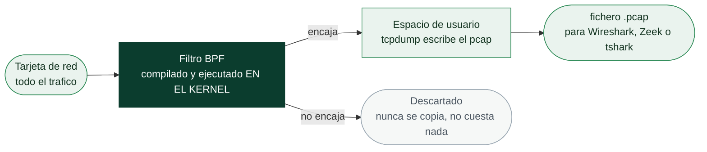

# Clase 028 — tcpdump y captura de tráfico en línea de comandos

> Parte: **1 — Redes y seguridad de redes** · Fuente: *Practical Packet Analysis, C. Sanders*
> ⏱️ Duración estimada: **90 min** · Nivel: **Fundamentos**

---

## 🎯 Objetivo

Capturar y filtrar tráfico desde la terminal con **tcpdump**, la herramienta imprescindible cuando no hay entorno gráfico (servidores, contenedores, dispositivos remotos por SSH). El alumno aprenderá la sintaxis BPF, la rotación de archivos y el flujo de trabajo "capturar en el servidor, analizar en Wireshark".

## 📚 Resultados de aprendizaje

Al finalizar, el alumno podrá:

1. **Seleccionar** interfaz, tamaño de snap y verbosidad adecuados para cada captura.
2. **Escribir** filtros BPF por host, red, puerto, protocolo y flags TCP.
3. **Guardar** capturas en `.pcap` y rotarlas por tamaño o tiempo con un ring buffer.
4. **Leer** capturas guardadas y aplicar filtros de lectura sin recapturar.
5. **Combinar** tcpdump con SSH para capturar en remoto y ver en local.
6. **Reconocer** los límites de tcpdump frente a analizadores gráficos.

## 🗺️ Temas

| # | Tema | Por qué importa |
|---|------|-----------------|
| 1 | Selección de interfaz (`-i`) | Capturar en el punto correcto |
| 2 | Snap length (`-s`) y verbosidad (`-v`) | Equilibrio detalle/tamaño |
| 3 | Filtros BPF primitivos y compuestos | Reducir ruido en origen |
| 4 | Escritura y lectura de pcap (`-w`/`-r`) | Analizar después con otras herramientas |
| 5 | Rotación con `-C`, `-G`, `-W` | Capturas de larga duración |
| 6 | Filtrado por flags TCP | Ver handshakes, resets, escaneos |
| 7 | tcpdump sobre SSH | Capturar donde no hay GUI |

## 🧠 Explicación en profundidad

### Por qué el analista serio acaba en la línea de comandos

Wireshark es insuperable para entender **una** captura; `tcpdump` es lo que usas cuando
tienes que capturar en un servidor sin entorno gráfico, dejar corriendo una captura
durante días, o meter la captura dentro de un script. Es además la herramienta que casi
con seguridad ya está instalada en la máquina comprometida que estás investigando, y la
que consume menos recursos en el equipo que estás observando.

Los dos parámetros que más consecuencias tienen son los menos vistosos. El **snap
length** (`-s`) fija cuántos bytes se guardan de cada paquete: en versiones modernas el
valor por defecto es el paquete completo, pero un `-s 96` clásico guarda solo las
cabeceras y te deja sin la carga útil justo cuando la necesitas. Y el **modo
promiscuo**, que `tcpdump` activa por defecto, se desactiva con `-p`; hacerlo es a
menudo lo correcto en un servidor, porque reduce ruido y carga.

### BPF: un filtro que se compila y se ejecuta en el kernel

La sintaxis de filtro de `tcpdump` no es una comodidad de la herramienta: es **BPF**,
un pequeño lenguaje que se compila a bytecode y se ejecuta **dentro del kernel**, sobre
cada paquete, antes de que este se copie al espacio de usuario. Esa arquitectura es la
razón de que un filtro de captura bien puesto no solo reduzca el tamaño del fichero,
sino que evite descartes bajo carga: los paquetes que el filtro rechaza nunca llegan a
cruzar la frontera kernel-usuario.

El lenguaje se construye con tres tipos de primitivas —tipo (`host`, `net`, `port`,
`portrange`), dirección (`src`, `dst`) y protocolo (`ip`, `ip6`, `tcp`, `udp`,
`icmp`, `arp`)— combinadas con `and`, `or` y `not`. Y tiene un nivel más potente que
casi nadie usa: el acceso directo a bytes de la cabecera con la notación
`proto[offset:tamaño]`. Así, `tcp[13] & 2 != 0` selecciona los paquetes cuyo byte 13 de
la cabecera TCP (el de los flags) tiene activo el bit SYN, que es exactamente cómo se
caza un escaneo sin depender de ningún disector.



### Capturas que duran días sin llenar el disco

Una captura de larga duración no se hace lanzando `tcpdump` y esperando: se hace con
**rotación**. `-C` corta por tamaño en megabytes, `-G` corta por tiempo en segundos, y
`-W` limita cuántos ficheros se conservan antes de empezar a sobrescribir los más
antiguos. La combinación de los tres es un *buffer* circular: `-G 3600 -W 24` deja
siempre las últimas 24 horas en ficheros de una hora, con un consumo de disco acotado y
predecible.

Ese patrón es la base de la captura de contenido completo en un programa de NSM, y su
límite es el que verás en la clase 043: el disco. Guardar todo el tráfico de un enlace
saturado durante semanas es inviable, y por eso el monitoreo real combina contenido
completo de ventana corta con metadatos de retención larga.

### Un apunte de privilegios

Capturar exige privilegios elevados, pero eso no obliga a ejecutar el analizador como
root. En Linux lo correcto es conceder la capacidad concreta al binario de captura
(`setcap cap_net_raw,cap_net_admin=eip`), o usar el patrón de Wireshark: `dumpcap`
privilegiado y la interfaz de análisis sin privilegios. Es el principio de mínimo
privilegio de la clase 001 aplicado a un caso muy concreto: un disector que procesa
datos hostiles es una superficie de ataque, y no quieres que corra como root.

## 📖 Definiciones y características

- **BPF (Berkeley Packet Filter):** lenguaje de filtrado compilado en kernel; muy eficiente porque descarta paquetes antes de copiarlos a espacio de usuario.
- **Snap length (`-s`):** bytes capturados por paquete. `-s 0` (o el valor por defecto moderno) captura el paquete completo.
- **Ring buffer:** conjunto rotatorio de archivos (`-C` tamaño, `-W` número) que evita llenar el disco.
- **Primitiva BPF:** unidad básica del filtro: `host`, `net`, `port`, `tcp`, `udp`, `src`, `dst`.
- **`-n`:** desactiva resolución DNS/puertos; acelera y evita generar tráfico extra durante la captura.

## 📔 Glosario

| Término | Definición concisa |
|---------|--------------------|
| tcpdump | Capturador de paquetes en línea de comandos, basado en libpcap |
| BPF | Lenguaje de filtrado compilado y ejecutado en el kernel |
| Primitiva BPF | Pieza del filtro: tipo (`host`), dirección (`src`) o protocolo (`tcp`) |
| `proto[off:len]` | Acceso directo a bytes de una cabecera dentro del filtro |
| Snap length (`-s`) | Bytes que se guardan de cada paquete |
| `-p` | Desactiva el modo promiscuo (captura solo lo dirigido al host) |
| `-w` / `-r` | Escribir la captura a fichero / leer un fichero existente |
| `-C` | Rotación por tamaño de fichero (MB) |
| `-G` | Rotación por tiempo (segundos) |
| `-W` | Número máximo de ficheros conservados (buffer circular) |
| `-n` | No resolver nombres; evita DNS que contamina la propia captura |
| Descarte (*drop*) | Paquete perdido por saturación del buffer de captura |
| libpcap | Librería de captura sobre la que se apoyan tcpdump, Wireshark y Zeek |
| `setcap` | Concede capacidades concretas a un binario sin darle root entero |

## 🧰 Herramientas y preparación

- **tcpdump** (Linux/macOS/BSD): `sudo apt install tcpdump` o viene preinstalado.
- Requiere privilegios para capturar: `sudo` o capacidad `CAP_NET_RAW` (`sudo setcap cap_net_raw+ep $(which tcpdump)`).
- Para analizar después: Wireshark o `tshark`.

> ⚠️ **Nota ética:** captura solo en interfaces de sistemas que administras o con autorización escrita. En servidores compartidos, tcpdump puede exponer datos de terceros.

## 🧪 Laboratorio guiado

1. Lista interfaces disponibles:

   ```bash
   sudo tcpdump -D
   ```

2. Captura básica sin resolución de nombres:

   ```bash
   sudo tcpdump -i eth0 -n
   ```

3. Filtra por host y puerto:

   ```bash
   sudo tcpdump -i eth0 -n host 192.168.56.101 and tcp port 80
   ```

4. Captura solo paquetes SYN (inicio de conexión) usando el offset de flags:

   ```bash
   sudo tcpdump -i eth0 -n 'tcp[tcpflags] & tcp-syn != 0 and tcp[tcpflags] & tcp-ack == 0'
   ```

5. Guarda a archivo con snap completo:

   ```bash
   sudo tcpdump -i eth0 -s 0 -w /tmp/lab028.pcap port 53
   ```

   Genera tráfico DNS en otra terminal (`dig example.com`) y detén con Ctrl-C.
6. Lee lo capturado con filtro de lectura:

   ```bash
   tcpdump -n -r /tmp/lab028.pcap 'udp port 53'
   ```

7. Captura larga con rotación (archivos de 10 MB, máximo 5):

   ```bash
   sudo tcpdump -i eth0 -s 0 -C 10 -W 5 -w /tmp/rot.pcap
   ```

8. Aumenta verbosidad para ver TTL, opciones y checksums:

   ```bash
   sudo tcpdump -i eth0 -vvv -n icmp
   ```

9. **Captura remota vía SSH** y análisis en tu Wireshark local:

   ```bash
   ssh usuario@servidor 'sudo tcpdump -i eth0 -s 0 -U -w - not port 22' | wireshark -k -i -
   ```

   (El filtro `not port 22` evita capturar tu propia sesión SSH y un bucle infinito.)

## ✍️ Ejercicios

1. Captura solo tráfico ICMP entre dos hosts de tu laboratorio y guárdalo en `icmp.pcap`.
2. Escribe un filtro que capture tráfico HTTP y HTTPS (`port 80 or port 443`).
3. Captura paquetes con el flag RST activo e interpreta qué conexiones se rechazan.
4. Usa `-c 100` para limitar la captura a 100 paquetes y explica cuándo conviene.
5. Rota capturas cada 60 segundos con `-G 60` y nómbralas con `%Y%m%d-%H%M%S`.
6. Convierte tu `.pcap` a `.pcapng` con `editcap` y ábrelo en Wireshark.

## 📝 Reto verificable

Desde un servidor de laboratorio (o VM) sin entorno gráfico, captura durante 30 segundos todo el tráfico **excepto** tu sesión SSH, guárdalo con rotación en archivos de 5 MB, y entrega el primer archivo junto con el comando exacto usado. Documenta cuántos paquetes contiene según `tcpdump -r archivo -n | wc -l`.

**Criterio de aceptación:** el archivo abre sin errores en Wireshark, no contiene tráfico del puerto 22 hacia/desde tu IP, y el conteo declarado coincide con el del revisor.

## ⚠️ Errores comunes

| Síntoma / mensaje | Causa y cómo arreglar |
|-------------------|-----------------------|
| `tcpdump: <iface>: You don't have permission` | Falta privilegio; usa `sudo` o asigna `cap_net_raw` |
| La captura por SSH nunca termina o se dispara | No excluiste el puerto 22; añade `not port 22` |
| Paquetes truncados en Wireshark | Snap length bajo; captura con `-s 0` |
| Filtro no captura nada | Sintaxis BPF incorrecta; prueba el filtro por partes y usa comillas |
| Disco lleno en captura larga | Sin rotación; usa `-C`/`-W` o `-G`/`-W` |
| No resuelve nombres y va lento | Al contrario, `-n` acelera; si va lento probablemente falta `-n` y hay DNS inverso |

## ❓ Preguntas frecuentes

**❓ ¿tcpdump o Wireshark?**
tcpdump para capturar donde no hay GUI y para filtros rápidos; Wireshark para el análisis profundo. El flujo típico es capturar con tcpdump y disecar en Wireshark.

**❓ ¿Por qué usar `-w` en vez de leer la salida de texto?**
El texto pierde información. `-w` guarda el paquete íntegro para análisis posterior con cualquier herramienta.

**❓ ¿Los filtros BPF de tcpdump y Wireshark son iguales?**
Los filtros de **captura** de Wireshark sí son BPF (idénticos a tcpdump). Los de **visualización** de Wireshark son un lenguaje distinto y más rico.

**❓ ¿Cómo capturo sin que la captura afecte el rendimiento del servidor?**
Filtra en origen con BPF, usa snap length moderado si solo necesitas cabeceras (`-s 96`) y evita `-vvv` en producción.

## 🔗 Referencias

- tcpdump man page y ejemplos. <https://www.tcpdump.org/manpages/tcpdump.1.html>
- pcap-filter (sintaxis BPF). <https://www.tcpdump.org/manpages/pcap-filter.7.html>
- Sanders, C. *Practical Packet Analysis*, apéndice de tcpdump.
- Wireshark: capturas remotas. <https://wiki.wireshark.org/CaptureSetup/Pipes>

## 📥 Material descargable

- 📄 [Guía en PDF](./clase-028-guia.pdf) — versión imprimible de esta clase.
- 🎞️ [Presentación (PPTX)](./clase-028-presentacion.pptx) — deck para proyectar en clase.

## ⬅️ Clase anterior

[Clase 027 — Análisis de tráfico: filtros, seguimiento de flujos y estadísticas](../027-analisis-de-trafico-filtros-seguimiento-de-flujos-y-estadisticas/README.md)

## ➡️ Siguiente clase

[Clase 029 — Nmap: descubrimiento de hosts y técnicas de ping](../029-nmap-descubrimiento-de-hosts-y-tecnicas-de-ping/README.md)
