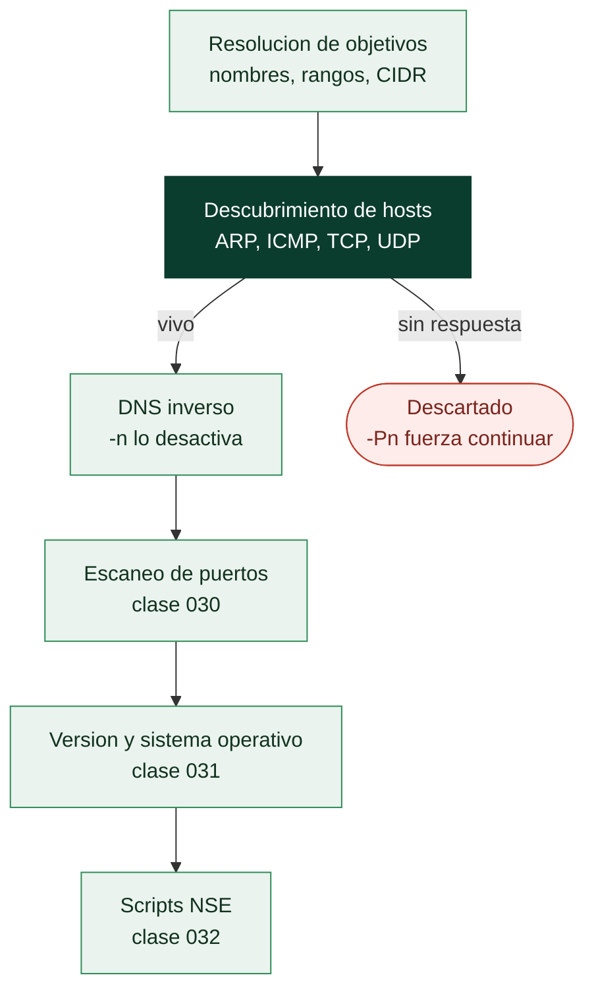

# Clase 029 — Nmap: descubrimiento de hosts y técnicas de ping

> Parte: **1 — Redes y seguridad de redes** · Fuente: *Nmap Network Scanning, G. Lyon*
> ⏱️ Duración estimada: **100 min** · Nivel: **Fundamentos**

---

## 🎯 Objetivo

Aprender a descubrir qué hosts están vivos en una red usando las distintas técnicas de "host discovery" de Nmap (ARP, ICMP, TCP, UDP), entender cuándo usar cada una según la topología y las defensas, y producir un inventario fiable de la superficie de red antes de escanear puertos.

## 📚 Resultados de aprendizaje

Al finalizar, el alumno podrá:

1. **Ejecutar** un barrido de descubrimiento (`-sn`) sobre un rango o subred.
2. **Elegir** la técnica de sonda adecuada (ARP, ICMP echo/timestamp, TCP SYN/ACK, UDP).
3. **Interpretar** por qué un host aparece como "up" o "down" y sus falsos negativos.
4. **Controlar** la resolución DNS y la temporización del descubrimiento.
5. **Exportar** la lista de hosts vivos para las siguientes fases.
6. **Evitar** ruido innecesario y respetar los límites del alcance autorizado.

## 🗺️ Temas

| # | Tema | Por qué importa |
|---|------|-----------------|
| 1 | Fases de un escaneo Nmap | Ubica el descubrimiento en el flujo |
| 2 | `-sn` (ping scan, sin puertos) | Inventario rápido de hosts vivos |
| 3 | ARP discovery en LAN | El método más fiable en red local |
| 4 | Sondas ICMP (`-PE`, `-PP`, `-PM`) | Descubrimiento a través de routers |
| 5 | Sondas TCP/UDP (`-PS`, `-PA`, `-PU`) | Rodear firewalls que bloquean ICMP |
| 6 | Control de DNS (`-n`, `-R`) | Velocidad y sigilo |
| 7 | Formatos de salida (`-oA`) | Alimentar fases posteriores |

## 🧠 Explicación en profundidad

### Nmap es una tubería, y saltarse una fase distorsiona el resultado

Nmap no ejecuta "un escaneo": ejecuta una secuencia de fases, y cada una alimenta a la
siguiente. Primero resuelve los objetivos, después **descubre** qué hosts están vivos,
luego resuelve DNS inverso de los que respondieron, a continuación escanea puertos
sobre esos hosts, y por último aplica detección de versión, de sistema operativo y
scripts NSE si se lo pides. Entender esa tubería explica el fallo más caro del
principiante: si la fase de descubrimiento decide erróneamente que un host está caído,
**Nmap nunca le escanea los puertos**, y el informe dirá que no hay nada donde sí había
un servidor.

De ahí que existan dos banderas complementarias que conviene tener siempre presentes.
`-sn` hace **solo** descubrimiento y omite el escaneo de puertos: es el inventario
rápido. Y `-Pn` hace lo contrario, **omitir el descubrimiento** y tratar a todos los
objetivos como vivos: es lo que se usa contra hosts que no responden a ninguna sonda
—muy común en redes con firewall— a costa de tardar mucho más, porque escanea también
direcciones vacías.



### En la LAN manda ARP, y no hay discusión

Cuando el objetivo está en tu mismo segmento de capa 2, Nmap ignora lo que le pidas y
usa **ARP**, porque es la técnica correcta por una razón estructural: para enviarle un
paquete IP a un vecino hay que conocer su MAC de todas formas, así que la consulta ARP
es obligatoria. Y como ARP vive por debajo de IP, ningún firewall de host puede
ignorarlo sin dejar de participar en la red. El resultado es que el descubrimiento en
LAN es rápido y prácticamente infalible, mientras que a través de un router es un
ejercicio de probabilidades.

Fuera del segmento local sí eliges. Las sondas ICMP —`-PE` (echo), `-PP` (timestamp),
`-PM` (address mask)— son las clásicas, y muchas redes filtran el echo pero olvidan las
otras dos. Las sondas TCP son las más útiles contra firewalls: `-PS` envía un SYN a un
puerto (cualquier respuesta, `SYN/ACK` o `RST`, demuestra que el host existe) y `-PA`
envía un ACK, que atraviesa filtros sin estado que solo bloquean SYN. `-PU` prueba UDP
buscando el `ICMP port unreachable`, que también prueba existencia. La estrategia
razonable contra una red desconocida es combinar varias contra puertos con
probabilidades altas: `-PS22,80,443 -PA3389 -PU161`.

### El DNS es una fuga y un freno

Por defecto Nmap resuelve el DNS inverso de los hosts que responden. Eso tiene dos
costes que conviene decidir a conciencia. El primero es **velocidad**: en un `/16` con
poca respuesta, las consultas DNS pueden dominar el tiempo total del escaneo; `-n` las
desactiva y suele ser la única optimización que hace falta. El segundo es **sigilo**:
cada consulta inversa deja tu interés registrado en el servidor DNS de la organización,
que a menudo es justamente el servidor que un defensor está monitorizando. En un
ejercicio con requisitos de discreción, `-n` no es una optimización, es una medida
operativa.

Por último, `-oA base` guarda a la vez los tres formatos —normal, *grepable* y XML— con
el mismo prefijo, y ese hábito paga solo. El XML es lo que consumen las herramientas
posteriores y los informes; el *grepable* es lo que te deja sacar una lista de IPs con
un puerto abierto en una línea de `awk` para alimentar la fase siguiente.

## 📖 Definiciones y características

- **Host discovery:** fase en la que Nmap determina qué objetivos están activos antes de escanear puertos, para no perder tiempo en IPs muertas.
- **ARP scan:** en una LAN, Nmap usa ARP en lugar de IP; es rápido y no se puede filtrar fácilmente porque opera en capa 2.
- **Ping scan (`-sn`):** realiza descubrimiento pero **omite** el escaneo de puertos; devuelve solo la lista de hosts vivos.
- **Sonda TCP SYN a 443 (`-PS443`):** envía un SYN; un SYN/ACK o RST prueba que el host existe aunque bloquee ICMP.
- **Falso negativo:** host vivo que aparece como "down" porque filtró todas las sondas usadas.

## 📔 Glosario

| Término | Definición concisa |
|---------|--------------------|
| Fases de Nmap | Objetivos → descubrimiento → DNS → puertos → versión/OS → NSE |
| `-sn` | Solo descubrimiento de hosts; no escanea puertos |
| `-Pn` | Omite el descubrimiento y trata todo objetivo como vivo |
| ARP discovery | Descubrimiento en la LAN mediante consultas ARP; el más fiable |
| `-PE` / `-PP` / `-PM` | Sondas ICMP: echo, timestamp y address mask |
| `-PS` | Sonda TCP SYN a un puerto para probar existencia del host |
| `-PA` | Sonda TCP ACK; atraviesa filtros sin estado |
| `-PU` | Sonda UDP; busca el ICMP *port unreachable* |
| `-n` / `-R` | Nunca resolver DNS / resolver siempre |
| `-oA` | Guarda salida en los tres formatos (normal, grepable y XML) |
| Formato grepable | Salida de una línea por host, pensada para `grep`/`awk` |
| Host vivo | Objetivo que respondió a alguna sonda de descubrimiento |
| Falso negativo de descubrimiento | Host activo descartado por no responder; se corrige con `-Pn` |

## 🧰 Herramientas y preparación

- **Nmap 7.x**: `sudo apt install nmap` / `brew install nmap` / instalador Windows.
- Laboratorio: red interna con 2–4 VMs (p. ej. `192.168.56.0/24`). Ejecuta desde la VM atacante.
- Verifica la versión: `nmap --version`.

> ⚠️ **Nota ética:** escanea únicamente redes y hosts de tu propiedad o con autorización explícita por escrito. El escaneo no autorizado puede ser ilegal y disparar alertas. Todo lo de esta clase se hace en tu laboratorio aislado.

## 🧪 Laboratorio guiado

1. **Barrido de subred** (solo descubrimiento):

   ```bash
   sudo nmap -sn 192.168.56.0/24
   ```

2. **Fuerza ARP** en LAN y mira los paquetes en paralelo con tcpdump:

   ```bash
   sudo nmap -sn -PR 192.168.56.0/24
   ```

3. **Descubrimiento a través de router** con ICMP echo + timestamp + TCP SYN a 80/443:

   ```bash
   sudo nmap -sn -PE -PP -PS80,443 192.168.56.101
   ```

4. **Sonda TCP ACK** para hosts que dejan pasar respuestas a conexiones establecidas:

   ```bash
   sudo nmap -sn -PA80 192.168.56.101
   ```

5. **Desactiva ping** (asume que están vivos) cuando el objetivo bloquea todo descubrimiento:

   ```bash
   sudo nmap -Pn 192.168.56.101
   ```

6. **Solo listar** objetivos sin enviar paquetes (list scan) para validar tu rango:

   ```bash
   nmap -sL 192.168.56.0/28
   ```

7. **Sin resolución DNS** para acelerar:

   ```bash
   sudo nmap -sn -n 192.168.56.0/24
   ```

8. **Guarda en los tres formatos** para reutilizar:

   ```bash
   sudo nmap -sn 192.168.56.0/24 -oA hosts-vivos
   ```

9. Extrae la lista limpia de IPs vivas:

   ```bash
   grep "Up" hosts-vivos.gnmap | awk '{print $2}'
   ```

## ✍️ Ejercicios

1. Compara el número de hosts detectados con `-sn` por defecto vs. `-sn -PR` en tu LAN. Explica la diferencia.
2. Usa tcpdump para confirmar qué sondas envía `-sn` cuando el objetivo está en otra subred.
3. Descubre hosts que solo responden a TCP SYN en 22 (`-PS22`).
4. Ejecuta un list scan (`-sL`) de un /29 y verifica que no genera tráfico a los objetivos.
5. Guarda resultados con `-oA` y escribe un one-liner que produzca un archivo `vivos.txt` con una IP por línea.
6. Investiga y prueba `--traceroute` junto a `-sn` para mapear la ruta hacia un host.

## 📝 Reto verificable

Sobre tu subred de laboratorio, produce un archivo `vivos.txt` con las IPs de todos los hosts activos, usando la técnica de descubrimiento que detecte el mayor número de hosts. Justifica en 3–4 líneas por qué elegiste esa técnica y adjunta el comando y la evidencia de tcpdump que confirma el tipo de sondas enviadas.

**Criterio de aceptación:** la lista incluye todos los hosts que el revisor sabe que están encendidos en la red, y la justificación es coherente con la topología (ARP en LAN, TCP/ICMP a través de router).

## ⚠️ Errores comunes

| Síntoma / mensaje | Causa y cómo arreglar |
|-------------------|-----------------------|
| Todos los hosts salen "down" | El objetivo filtra tus sondas; prueba `-Pn` o varía las sondas (`-PS`, `-PA`, `-PU`) |
| Descubrimiento muy lento | Resolución DNS activa; añade `-n` |
| En LAN detecta menos hosts de lo esperado | Firewalls de host bloquean ICMP; usa ARP (`-PR`, es el default en LAN) |
| "requires root privileges" | Las sondas raw necesitan privilegios; usa `sudo` |
| Escaneas y no ves nada en la red destino | Estás en otra subred sin ruta; verifica routing y usa sondas TCP |

## ❓ Preguntas frecuentes

**❓ ¿`-sn` escanea puertos?**
No. `-sn` hace solo descubrimiento de hosts. Antes se llamaba `-sP`. Para puertos necesitas otro tipo de escaneo (siguiente clase).

**❓ ¿Por qué a veces `-Pn` es mejor?**
Cuando el objetivo bloquea todo descubrimiento, `-Pn` salta la fase y escanea directamente, evitando falsos negativos, a costa de más tiempo (escanea IPs que podrían estar muertas).

**❓ ¿ARP funciona a través de un router?**
No. ARP es de capa 2 y solo sirve dentro del mismo dominio de difusión (tu LAN). Fuera de ella se usan sondas IP.

**❓ ¿El descubrimiento es detectable?**
Sí. Genera tráfico característico que un IDS puede alertar. Ajusta la temporización y limita el alcance a lo autorizado.

## 🔗 Referencias

- Lyon, G. *Nmap Network Scanning*, cap. "Host Discovery". <https://nmap.org/book/host-discovery.html>
- Nmap Reference Guide. <https://nmap.org/book/man.html>
- Nmap: Host Discovery Techniques. <https://nmap.org/book/host-discovery-techniques.html>

## 📥 Material descargable

- 📄 [Guía en PDF](./clase-029-guia.pdf) — versión imprimible de esta clase.
- 🎞️ [Presentación (PPTX)](./clase-029-presentacion.pptx) — deck para proyectar en clase.

## ⬅️ Clase anterior

[Clase 028 — tcpdump y captura de tráfico en línea de comandos](../028-tcpdump-y-captura-de-trafico-en-linea-de-comandos/README.md)

## ➡️ Siguiente clase

[Clase 030 — Nmap: escaneo de puertos y tipos de escaneo](../030-nmap-escaneo-de-puertos-y-tipos-de-escaneo/README.md)
