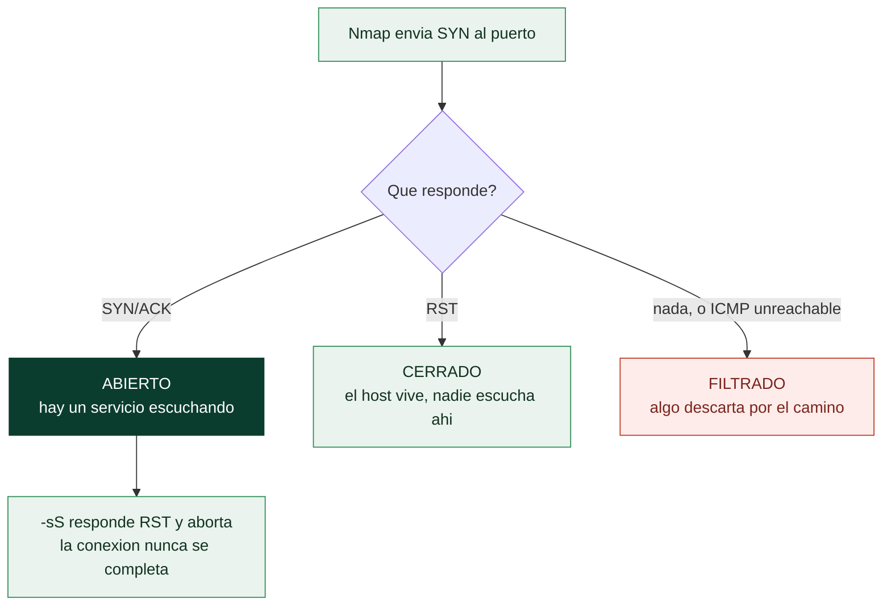

# Clase 030 — Nmap: escaneo de puertos y tipos de escaneo

> Parte: **1 — Redes y seguridad de redes** · Fuente: *Nmap Network Scanning, G. Lyon*
> ⏱️ Duración estimada: **120 min** · Nivel: **Intermedio**

---

## 🎯 Objetivo

Dominar los tipos de escaneo de puertos de Nmap (SYN, connect, UDP, y los "stealth" FIN/NULL/Xmas/ACK), entender la máquina de estados TCP que hay detrás de cada uno y saber elegir el tipo, el rango de puertos y la temporización correctos según el objetivo y las defensas presentes.

## 📚 Resultados de aprendizaje

Al finalizar, el alumno podrá:

1. **Diferenciar** SYN scan (`-sS`), connect scan (`-sT`) y UDP scan (`-sU`) y cuándo usar cada uno.
2. **Interpretar** los seis estados de puerto de Nmap (open, closed, filtered, etc.).
3. **Especificar** rangos de puertos, top-ports y escaneo completo.
4. **Ajustar** la temporización (`-T0`..`-T5`) y el paralelismo.
5. **Aplicar** escaneos ACK para mapear reglas de firewall.
6. **Reconocer** las huellas que cada tipo de escaneo deja en un IDS.

## 🗺️ Temas

| # | Tema | Por qué importa |
|---|------|-----------------|
| 1 | Handshake TCP y estados de puerto | Base de toda interpretación |
| 2 | SYN scan (`-sS`) semiabierto | Rápido y relativamente sigiloso |
| 3 | Connect scan (`-sT`) sin privilegios | Cuando no hay root/raw sockets |
| 4 | UDP scan (`-sU`) | Servicios críticos (DNS, SNMP) van por UDP |
| 5 | FIN/NULL/Xmas/ACK | Rodear filtros y mapear firewalls |
| 6 | Selección de puertos (`-p`, `--top-ports`, `-F`) | Cobertura vs. tiempo |
| 7 | Temporización (`-T`, `--min-rate`) | Precisión vs. sigilo vs. velocidad |

## 🧠 Explicación en profundidad

### Los seis estados de un puerto, y por qué "filtrado" es el interesante

Nmap no clasifica los puertos en abierto y cerrado, sino en seis estados, y la
diferencia entre tres de ellos es la que convierte un escaneo en información útil sobre
la arquitectura de la red. **Abierto** significa que hay una aplicación aceptando
conexiones. **Cerrado** significa que el host respondió pero nadie escucha ahí: es una
respuesta informativa, porque demuestra que el host existe y que el paquete llegó.
**Filtrado** significa que Nmap no obtuvo respuesta o recibió un error ICMP: algo en el
camino está descartando el paquete, y eso es un hallazgo sobre el firewall, no una
ausencia de datos. Los otros tres —*unfiltered*, *open|filtered* y *closed|filtered*—
expresan ambigüedades propias de ciertos tipos de escaneo.

Todo esto se deduce del comportamiento de TCP que estudiaste en la clase 011. Un SYN a
un puerto abierto responde `SYN/ACK`; a un puerto cerrado responde `RST`; y si no
responde nada, o llega un `ICMP unreachable` de tipo administrativo, hay un filtro por
medio. El escáner no "mira" el puerto: infiere su estado a partir de la respuesta, y
por eso conocer el protocolo es lo que te permite interpretar el resultado en vez de
leerlo.



### SYN scan, connect scan y por qué uno necesita root

El **SYN scan** (`-sS`) es el escaneo por defecto de Nmap cuando tiene privilegios, y
se llama *semiabierto* porque no completa el handshake: envía el SYN, interpreta la
respuesta y contesta con un `RST` que aborta la conexión antes de que se establezca.
Eso le da dos ventajas —es más rápido y históricamente no dejaba entrada en los logs de
la aplicación, que solo registra conexiones completas— y una exigencia: necesita
*raw sockets*, y por tanto privilegios de root o la capacidad `CAP_NET_RAW`.

El **connect scan** (`-sT`) es la alternativa sin privilegios: usa la llamada
`connect()` del sistema operativo, igual que cualquier cliente normal. Es más lento,
completa el handshake y por tanto es perfectamente visible en los logs del servicio,
pero funciona desde una cuenta sin privilegios, que es exactamente la situación en la
que te encuentras cuando pivotas desde un host comprometido. Conviene desmontar aquí un
mito extendido: el SYN scan **no** es sigiloso frente a un IDS moderno. Suricata o Zeek
detectan sin esfuerzo un patrón de SYN a muchos puertos desde un mismo origen. Lo que
evita el SYN scan es el log de la aplicación, no la detección de red.

### UDP: lento, ambiguo e imprescindible

El escaneo UDP (`-sU`) es la parte que casi todo el mundo omite y donde se esconden
servicios críticos: DNS, SNMP, NTP, DHCP, TFTP y buena parte del mundo industrial. Su
dificultad es estructural: UDP no tiene handshake, así que un puerto abierto
normalmente **no responde nada**, y la única señal fiable es el `ICMP port unreachable`
que devuelve un puerto cerrado. Como los sistemas operativos limitan la tasa de esos
mensajes ICMP, Nmap tiene que esperar, y de ahí que un `-sU` completo pueda tardar
horas. El resultado habitual es `open|filtered`: no se puede distinguir un puerto
abierto y callado de uno filtrado. Enviar sondas específicas del protocolo con
`-sU -sV` resuelve buena parte de esa ambigüedad, porque un servicio real sí contesta a
una consulta bien formada.

### Elegir cuántos puertos y a qué velocidad

Los 65 535 puertos rara vez se escanean enteros por defecto. Nmap escanea los 1000 más
frecuentes salvo que digas otra cosa; `-F` baja a los 100 más frecuentes, `--top-ports
N` fija el número, y `-p-` los abre todos. La frecuencia no es una lista arbitraria:
sale del fichero `nmap-services`, construido con datos de escaneos masivos reales.

La temporización (`-T0` a `-T5`) ajusta simultáneamente paralelismo, *timeouts* y
retardo entre sondas. `-T4` es un valor razonable en redes locales fiables; `-T5` puede
perder resultados por *timeouts* agresivos, y `-T0`/`-T1` existen para eludir umbrales
de detección a costa de tardar horas. Hay un compromiso que conviene enunciar sin
rodeos: **velocidad, precisión y sigilo forman un triángulo del que solo se eligen
dos**. Y en una red de producción, un escaneo agresivo puede tumbar dispositivos
frágiles —impresoras, controladores industriales, equipos médicos—, así que el ritmo
no es solo una decisión técnica sino de riesgo operacional.

## 📖 Definiciones y características

- **SYN scan (`-sS`):** envía SYN y ante un SYN/ACK envía RST sin completar la conexión ("semiabierto"). Requiere privilegios; es el default de Nmap con root.
- **Connect scan (`-sT`):** completa el handshake con la syscall `connect()`. No necesita privilegios pero es más ruidoso y lento; queda en logs de aplicación.
- **UDP scan (`-sU`):** envía datagramas UDP; la ausencia de respuesta se interpreta como `open\|filtered`, y un ICMP port-unreachable como `closed`. Lento por diseño.
- **Estado `filtered`:** Nmap no puede determinar si el puerto está abierto porque un firewall descarta las sondas.
- **ACK scan (`-sA`):** no determina open/closed, sino si el puerto está `filtered` o `unfiltered`; sirve para mapear reglas de firewall con y sin estado.

## 📔 Glosario

| Término | Definición concisa |
|---------|--------------------|
| Abierto | Una aplicación acepta conexiones en ese puerto |
| Cerrado | El host responde pero nadie escucha; prueba que el host existe |
| Filtrado | Sin respuesta o error ICMP: un filtro descarta el tráfico |
| `open` / `filtered` (ambiguo) | Estado indeterminado típico de UDP y de FIN/NULL/Xmas |
| SYN scan (`-sS`) | Escaneo semiabierto; requiere *raw sockets* y privilegios |
| Connect scan (`-sT`) | Usa `connect()`; sin privilegios, pero visible en los logs |
| UDP scan (`-sU`) | Escaneo UDP; lento y ambiguo, pero cubre DNS, SNMP y NTP |
| ACK scan (`-sA`) | No determina apertura: mapea si hay firewall con estado |
| FIN / NULL / Xmas | Escaneos con flags atípicos para eludir filtros simples |
| `-p` / `-F` / `-p-` | Selección de puertos: lista, los 100 frecuentes, todos |
| `--top-ports` | Escanea los N puertos más frecuentes según `nmap-services` |
| `-T0`…`-T5` | Plantillas de temporización: de sigiloso y lento a agresivo |
| `--min-rate` | Fuerza un mínimo de paquetes por segundo |
| Raw socket | Socket que permite construir cabeceras a mano; exige privilegios |

## 🧰 Herramientas y preparación

- **Nmap 7.x** con privilegios (`sudo`) para los escaneos raw.
- Un objetivo de laboratorio con varios servicios (levanta contenedores: `docker run -d -p 80:80 nginx`, un DNS, etc.).
- tcpdump o Wireshark en paralelo para observar las sondas.

> ⚠️ **Nota ética:** el escaneo de puertos contra sistemas ajenos sin permiso es intrusivo y puede ser delito. Practica solo en tu laboratorio o con autorización explícita y alcance definido por escrito.

## 🧪 Laboratorio guiado

1. **SYN scan** de los 1000 puertos más comunes:

   ```bash
   sudo nmap -sS 192.168.56.101
   ```

   Observa en Wireshark que Nmap responde con RST a cada SYN/ACK.
2. **Connect scan** sin privilegios y compara la salida:

   ```bash
   nmap -sT 192.168.56.101
   ```

3. **Escaneo completo** de los 65535 puertos TCP:

   ```bash
   sudo nmap -sS -p- 192.168.56.101
   ```

4. **UDP scan** de puertos clave:

   ```bash
   sudo nmap -sU -p 53,123,161 192.168.56.101
   ```

5. **Top-ports** y escaneo rápido:

   ```bash
   sudo nmap -sS --top-ports 100 192.168.56.101
   nmap -F 192.168.56.101
   ```

6. **ACK scan** para mapear el firewall:

   ```bash
   sudo nmap -sA -p 1-1000 192.168.56.101
   ```

7. **Escaneos stealth** (útiles solo contra pilas que cumplen el RFC 793):

   ```bash
   sudo nmap -sF 192.168.56.101   # FIN
   sudo nmap -sN 192.168.56.101   # NULL
   sudo nmap -sX 192.168.56.101   # Xmas
   ```

8. **Ajusta temporización** y tasa mínima:

   ```bash
   sudo nmap -sS -T4 --min-rate 500 -p- 192.168.56.101
   ```

9. **Combina** descubrimiento omitido + razones de estado:

   ```bash
   sudo nmap -Pn --reason -p 22,80,443 192.168.56.101
   ```

## ✍️ Ejercicios

1. Escanea el mismo host con `-sS` y `-sT` y compara tiempos y estados; explica por qué difieren.
2. Usa `--reason` para averiguar por qué un puerto aparece como `filtered`.
3. Haz un UDP scan de 53 y explica por qué puede salir `open\|filtered`.
4. Con `-sA`, deduce si el firewall del objetivo es con estado o sin estado.
5. Mide cuánto tarda `-p-` con `-T3` vs. `-T4 --min-rate 1000` y comenta el riesgo de perder puertos.
6. Escanea un rango de puertos por nombre de servicio: `-p http,https,domain`.

## 📝 Reto verificable

Elabora un inventario de puertos abiertos TCP y UDP de un host de laboratorio, indicando para cada puerto el estado y la **razón** (`--reason`). Entrega el comando usado, la salida `-oN` y una tabla con: puerto, protocolo, estado y razón. Incluye al menos un puerto `filtered` correctamente justificado.

**Criterio de aceptación:** la tabla coincide con un reescaneo del revisor y cada estado está respaldado por la razón correcta (p. ej. `syn-ack` para open, `no-response`/`admin-prohibited` para filtered).

## ⚠️ Errores comunes

| Síntoma / mensaje | Causa y cómo arreglar |
|-------------------|-----------------------|
| `-sS` cae a connect scan | Sin privilegios; ejecuta con `sudo` |
| UDP scan tardísimo | Es normal por rate-limiting ICMP; limita puertos con `-p` o usa `--host-timeout` |
| Todos los puertos `filtered` | Firewall descarta sondas; combina con `-Pn`, prueba otros tipos, revisa alcance/ruta |
| FIN/NULL/Xmas dan todo `open\|filtered` | El objetivo es Windows (no sigue RFC 793 así); esos escaneos no aplican |
| Resultados inconsistentes entre corridas | Temporización agresiva provoca pérdidas; baja a `-T3` o aumenta reintentos |

## ❓ Preguntas frecuentes

**❓ ¿Cuál es el escaneo por defecto?**
Con privilegios, `-sS` (SYN). Sin privilegios, `-sT` (connect). Puedes forzar cualquiera explícitamente.

**❓ ¿Por qué el UDP scan es tan lento?**
Porque la ausencia de respuesta es ambigua y los hosts limitan la tasa de mensajes ICMP unreachable, obligando a Nmap a esperar y reintentar.

**❓ ¿Los escaneos "stealth" son realmente invisibles?**
No. Un IDS moderno (Suricata/Snort) los detecta. "Stealth" se refiere a que evitan completar el handshake y ciertos logs de aplicación, no a ser indetectables.

**❓ ¿Qué diferencia hay entre `closed` y `filtered`?**
`closed` responde con RST (el host está vivo pero sin servicio en ese puerto). `filtered` no responde o responde con error de firewall (no puedes saber si hay servicio).

## 🔗 Referencias

- Lyon, G. *Nmap Network Scanning*, cap. "Port Scanning Techniques". <https://nmap.org/book/scan-methods.html>
- Nmap: Port Scanning Basics. <https://nmap.org/book/man-port-scanning-basics.html>
- RFC 793 — Transmission Control Protocol. <https://www.rfc-editor.org/rfc/rfc793>
- Nmap: Timing and Performance. <https://nmap.org/book/performance.html>

## 📥 Material descargable

- 📄 [Guía en PDF](./clase-030-guia.pdf) — versión imprimible de esta clase.
- 🎞️ [Presentación (PPTX)](./clase-030-presentacion.pptx) — deck para proyectar en clase.

## ⬅️ Clase anterior

[Clase 029 — Nmap: descubrimiento de hosts y técnicas de ping](../029-nmap-descubrimiento-de-hosts-y-tecnicas-de-ping/README.md)

## ➡️ Siguiente clase

[Clase 031 — Nmap: detección de servicios y fingerprinting de OS](../031-nmap-deteccion-de-servicios-y-fingerprinting-de-os/README.md)
