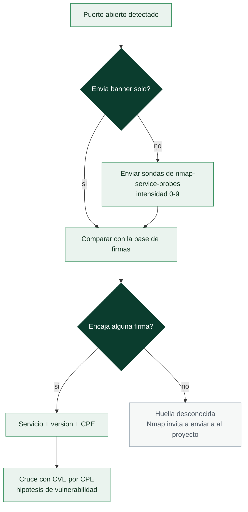

# Clase 031 — Nmap: detección de servicios y fingerprinting de OS

> Parte: **1 — Redes y seguridad de redes** · Fuente: *Nmap Network Scanning, G. Lyon*
> ⏱️ Duración estimada: **100 min** · Nivel: **Intermedio**

---

## 🎯 Objetivo

Ir más allá de "puerto abierto" para saber **qué** servicio corre, en qué **versión** y sobre qué **sistema operativo**. El alumno aprenderá la detección de versiones (`-sV`), el fingerprinting de OS (`-O`), su relación con las vulnerabilidades conocidas y cómo interpretar la confianza de cada resultado.

## 📚 Resultados de aprendizaje

Al finalizar, el alumno podrá:

1. **Ejecutar** detección de versión de servicios y ajustar su intensidad.
2. **Realizar** fingerprinting de sistema operativo e interpretar el porcentaje de acierto.
3. **Leer** los campos de servicio (producto, versión, extrainfo, CPE).
4. **Relacionar** una versión detectada con vulnerabilidades conocidas (CVE) de forma responsable.
5. **Combinar** `-sV`, `-O` y scripts en un escaneo integral (`-A`).
6. **Reconocer** las limitaciones y falsos positivos del fingerprinting.

## 🗺️ Temas

| # | Tema | Por qué importa |
|---|------|-----------------|
| 1 | Detección de versión (`-sV`) | Convierte puertos en servicios concretos |
| 2 | Intensidad de sondeo (`--version-intensity`) | Precisión vs. ruido |
| 3 | nmap-service-probes y CPE | Cómo Nmap identifica y cataloga |
| 4 | OS fingerprinting (`-O`) | Adaptar tácticas al sistema |
| 5 | Fiabilidad y `--osscan-guess` | Interpretar la confianza |
| 6 | Escaneo agresivo (`-A`) | Todo en una pasada |
| 7 | De versión a vulnerabilidad (CVE/CPE) | Priorizar hallazgos |

## 🧠 Explicación en profundidad

### Un puerto abierto no es información; un servicio con versión sí lo es

Saber que el 8080 está abierto no permite decidir nada. Saber que ahí corre un *Apache
Tomcat 9.0.30* sí, porque eso ya se puede cruzar con un catálogo de vulnerabilidades
conocidas y con la política de parches de la organización. La detección de versión
(`-sV`) es el paso que convierte un mapa de puertos en un inventario accionable, y su
mecánica es más sencilla de lo que parece: Nmap se conecta al puerto, **escucha el
banner** que muchos servicios envían sin que nadie se lo pida, y si eso no basta empieza
a enviar sondas del fichero `nmap-service-probes`, cada una diseñada para provocar una
respuesta característica de un protocolo concreto. Después compara la respuesta con
miles de expresiones regulares hasta encontrar la que encaja.

La `--version-intensity` (0 a 9) controla cuántas de esas sondas se lanzan. Baja
intensidad significa rápido y silencioso pero con más servicios sin identificar; alta
intensidad significa preciso pero ruidoso, con muchas conexiones raras que un IDS marca
sin dificultad. `--version-light` equivale a intensidad 2 y `--version-all` a 9. Y hay
un detalle que conviene tener presente en un pentest: los banners **mienten con
frecuencia**, porque endurecer un servidor suele incluir ocultar o falsear la versión.
Un banner no es prueba; es una hipótesis que hay que confirmar por comportamiento.



### CPE: el identificador que enlaza tu escaneo con el mundo de las CVE

Cuando Nmap identifica un servicio, además del texto legible emite un **CPE** (*Common
Platform Enumeration*), un identificador normalizado con la forma
`cpe:/a:apache:tomcat:9.0.30`. Ese identificador es la pieza que convierte un informe de
escaneo en algo automatizable, porque las bases de vulnerabilidades —el NVD entre
ellas— indexan las CVE por CPE. Así, la cadena completa del trabajo real queda cerrada:
puerto abierto → servicio identificado → CPE → lista de CVE aplicables → priorización
por explotabilidad e impacto.

Insisto en la palabra *hipótesis*. Que una versión aparezca asociada a una CVE no
significa que el sistema sea explotable: puede estar parcheado sin cambiar el número de
versión (algo habitual en los paquetes de las distribuciones, que aplican *backports*),
puede no tener activo el módulo afectado, o puede tener una mitigación por
configuración. Confundir "versión vulnerable según el catálogo" con "sistema
comprometible" es el origen de la mayoría de los falsos positivos de un informe.

### Fingerprinting de OS: adivinar por los detalles que nadie estandarizó

`-O` deduce el sistema operativo aprovechando que los RFC dejan libertad en muchos
detalles de implementación. Nmap envía una batería de sondas TCP, UDP e ICMP —algunas
deliberadamente anómalas— y mide una **firma** compuesta por decenas de rasgos: el TTL
inicial, el tamaño de ventana TCP, qué opciones aparecen y en qué orden, cómo se generan
los números de secuencia iniciales, cómo responde el sistema a flags imposibles. Cada
familia de sistemas operativos combina esos rasgos de forma distinta, y la firma
resultante se compara con la base `nmap-os-db`.

El método exige al menos un puerto abierto y uno cerrado para ser fiable, y por eso su
salida viene con un porcentaje de confianza. `--osscan-guess` fuerza a Nmap a proponer
la coincidencia más próxima cuando no hay una exacta, lo que es útil para orientarse
pero peligroso para afirmar. Dispositivos con pila TCP/IP propia —impresoras, cámaras,
autómatas industriales, balanceadores— confunden con frecuencia al detector. Y `-A`
agrupa en una sola bandera `-sV -O --script=default --traceroute`: es cómodo, pero es
la opción más ruidosa que ofrece Nmap y no debería ser el reflejo automático en un
entorno donde la discreción importe.

## 📖 Definiciones y características

- **Detección de versión (`-sV`):** Nmap envía sondas específicas y compara las respuestas con la base `nmap-service-probes` para identificar producto y versión exacta.
- **CPE (Common Platform Enumeration):** identificador estandarizado (`cpe:/a:apache:http_server:2.4.41`) que Nmap emite y que enlaza con bases de vulnerabilidades.
- **OS fingerprinting (`-O`):** analiza detalles de la pila TCP/IP (ISN, opciones, tamaño de ventana, TTL) para inferir el sistema operativo.
- **Intensidad de versión (0–9):** controla cuántas sondas se lanzan; mayor intensidad = más precisión y más ruido.
- **Fiabilidad de OS:** porcentaje que expresa cuán segura es la coincidencia; por debajo de cierto umbral Nmap muestra varias conjeturas.

## 📔 Glosario

| Término | Definición concisa |
|---------|--------------------|
| `-sV` | Detección de versión de servicio mediante banners y sondas |
| Banner | Texto de presentación que muchos servicios envían al conectar |
| `nmap-service-probes` | Base de sondas y expresiones regulares de identificación |
| `--version-intensity` | Número de sondas a lanzar (0 = mínimo, 9 = exhaustivo) |
| CPE | Identificador normalizado de plataforma (`cpe:/a:apache:tomcat:9.0.30`) |
| NVD | Base de datos nacional de vulnerabilidades; indexa CVE por CPE |
| Backport | Parche aplicado sin subir el número de versión; falsea el cruce con CVE |
| `-O` | Detección de sistema operativo por huella de pila TCP/IP |
| Huella de pila | Conjunto de rasgos de implementación (TTL, ventana, opciones, ISN) |
| `nmap-os-db` | Base de firmas de sistemas operativos de Nmap |
| `--osscan-guess` | Propone la coincidencia más próxima cuando no hay una exacta |
| `-A` | Modo agresivo: versión, OS, scripts por defecto y traceroute |
| Falso positivo | Hallazgo reportado que no se sostiene al verificarlo |

## 🧰 Herramientas y preparación

- **Nmap 7.x** con privilegios (el fingerprinting de OS requiere raw sockets).
- Objetivos variados en el laboratorio: un Linux con SSH/HTTP, un Windows, un servicio en versión antigua (contenedor deliberadamente desactualizado, aislado).
- Opcional: `searchsploit` / base local de CVE para correlacionar versiones.

> ⚠️ **Nota ética:** identificar versiones para localizar vulnerabilidades es legítimo solo con autorización. No explotes nada fuera de tu laboratorio. Correlacionar CVEs es análisis; explotarlos sin permiso es un delito.

## 🧪 Laboratorio guiado

1. **Detección de versión** básica:

   ```bash
   sudo nmap -sV 192.168.56.101
   ```

2. **Aumenta intensidad** para servicios difíciles:

   ```bash
   sudo nmap -sV --version-intensity 9 192.168.56.101
   ```

3. **Detección de OS**:

   ```bash
   sudo nmap -O 192.168.56.101
   ```

4. **Fuerza conjeturas** cuando no hay coincidencia exacta:

   ```bash
   sudo nmap -O --osscan-guess 192.168.56.101
   ```

5. **Escaneo agresivo** (versión + OS + scripts por defecto + traceroute):

   ```bash
   sudo nmap -A 192.168.56.101
   ```

6. **Limita a puertos abiertos conocidos** para ir más rápido:

   ```bash
   sudo nmap -sV -p 22,80,443 192.168.56.101
   ```

7. **Extrae los CPE** de la salida XML:

   ```bash
   sudo nmap -sV -oX serv.xml 192.168.56.101
   grep -o 'cpe:[^<]*' serv.xml | sort -u
   ```

8. **Correlaciona** una versión con exploits conocidos (offline, informativo):

   ```bash
   searchsploit "OpenSSH 7.2"
   ```

## ✍️ Ejercicios

1. Escanea un servicio y anota producto, versión y CPE exacto.
2. Compara `-O` con y sin `--osscan-guess` en un host difícil de identificar.
3. Ejecuta `-A` y clasifica qué información aporta cada sección de la salida.
4. Investiga por qué la detección de OS necesita al menos un puerto abierto y uno cerrado.
5. Toma un CPE detectado y busca (sin explotar) CVEs asociados en NVD.
6. Ajusta `--version-intensity` de 0 a 9 sobre el mismo host y compara resultados y ruido.

## 📝 Reto verificable

Genera un inventario de servicios de un host de laboratorio con producto, versión y CPE, y añade una columna "riesgo potencial" citando al menos un CVE público asociado a una de las versiones detectadas (solo referencia, sin explotación). Entrega la salida `-oA` y la tabla.

**Criterio de aceptación:** las versiones y CPE coinciden con un reescaneo del revisor, y el CVE citado corresponde realmente a la versión reportada según NVD.

## ⚠️ Errores comunes

| Síntoma / mensaje | Causa y cómo arreglar |
|-------------------|-----------------------|
| `-O` no identifica el OS | Falta un puerto cerrado o el host filtra; usa `--osscan-guess` o abre el alcance de puertos |
| Versión aparece como "tcpwrapped" | El servicio cierra la conexión tras el handshake; suele indicar filtrado o control de acceso |
| `-sV` muy lento | Intensidad alta o muchos puertos; baja intensidad o limita con `-p` |
| CPE ausente | Nmap no reconoció el producto; sube intensidad o revisa manualmente el banner |
| OS reportado con baja fiabilidad | Pila TCP/IP atípica (NAT, dispositivos embebidos); toma el resultado como conjetura |

## ❓ Preguntas frecuentes

**❓ ¿`-sV` explota el servicio?**
No. Solo envía sondas benignas y compara banners/respuestas. No intenta comprometer nada.

**❓ ¿Puedo confiar al 100% en la versión detectada?**
No siempre. Los banners pueden estar ofuscados o modificados. Trátalo como una hipótesis fuerte, verificable con más pruebas.

**❓ ¿Por qué el OS a veces sale como varias opciones?**
Cuando ninguna huella supera el umbral de fiabilidad, Nmap lista las candidatas más probables. Dispositivos tras NAT o embebidos complican la identificación.

**❓ ¿Qué gano con el CPE?**
Es la llave para automatizar la búsqueda de vulnerabilidades: se cruza con bases como NVD para saber qué CVEs afectan a esa versión concreta.

## 🔗 Referencias

- Lyon, G. *Nmap Network Scanning*, cap. "Service and Application Version Detection" y "OS Detection". <https://nmap.org/book/vscan.html>
- Nmap OS Detection. <https://nmap.org/book/osdetect.html>
- CPE Dictionary (NIST). <https://nvd.nist.gov/products/cpe>
- NVD — National Vulnerability Database. <https://nvd.nist.gov/>

## 📥 Material descargable

- 📄 [Guía en PDF](./clase-031-guia.pdf) — versión imprimible de esta clase.
- 🎞️ [Presentación (PPTX)](./clase-031-presentacion.pptx) — deck para proyectar en clase.

## ⬅️ Clase anterior

[Clase 030 — Nmap: escaneo de puertos y tipos de escaneo](../030-nmap-escaneo-de-puertos-y-tipos-de-escaneo/README.md)

## ➡️ Siguiente clase

[Clase 032 — Nmap Scripting Engine (NSE)](../032-nmap-scripting-engine-nse/README.md)
