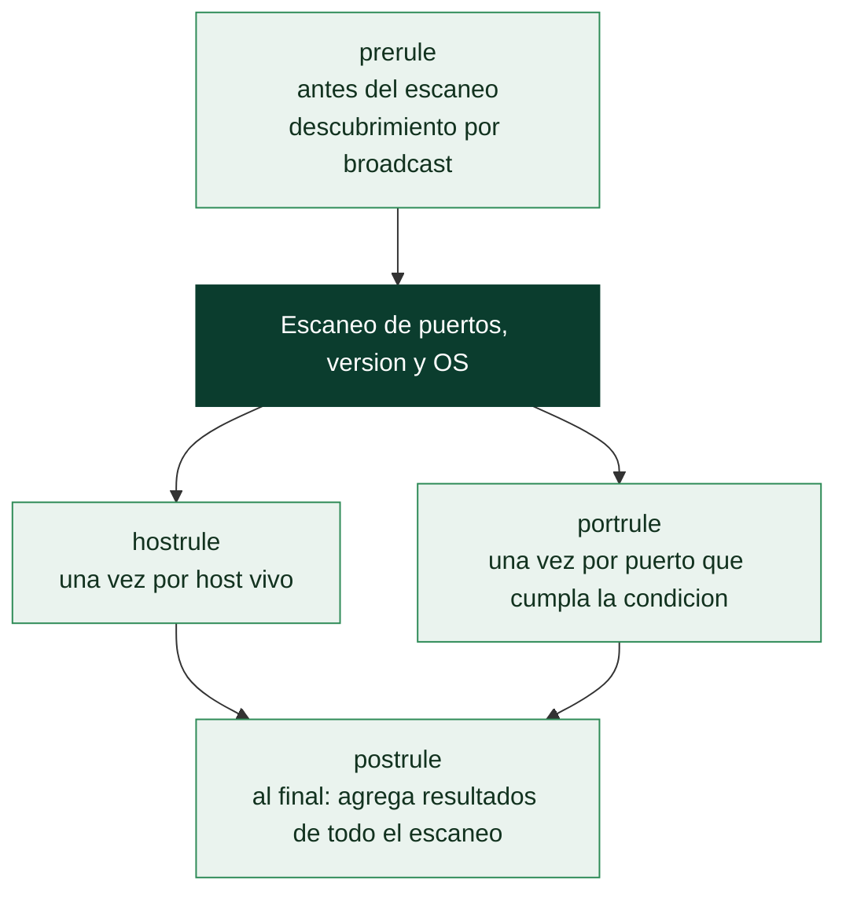

# Clase 032 — Nmap Scripting Engine (NSE)

> Parte: **1 — Redes y seguridad de redes** · Fuente: *Nmap Network Scanning, G. Lyon*
> ⏱️ Duración estimada: **110 min** · Nivel: **Intermedio**

---

## 🎯 Objetivo

Aprovechar el **Nmap Scripting Engine** para automatizar tareas de descubrimiento, detección de vulnerabilidades, enumeración y hasta explotación ligera mediante scripts en Lua. El alumno aprenderá a elegir scripts por categoría, pasarles argumentos, leer su salida y escribir un script mínimo propio.

## 📚 Resultados de aprendizaje

Al finalizar, el alumno podrá:

1. **Seleccionar** scripts por nombre, categoría o expresión.
2. **Ejecutar** el conjunto por defecto (`-sC`) y conjuntos temáticos (vuln, discovery, safe).
3. **Pasar** argumentos a los scripts con `--script-args`.
4. **Actualizar** la base de datos de scripts y consultar su documentación local.
5. **Interpretar** con criterio la salida de scripts de vulnerabilidad.
6. **Escribir** un script NSE elemental en Lua.

## 🗺️ Temas

| # | Tema | Por qué importa |
|---|------|-----------------|
| 1 | Categorías NSE (safe, default, vuln, exploit…) | Elegir según objetivo y riesgo |
| 2 | Selección de scripts (`--script`) | Precisión en la automatización |
| 3 | Argumentos (`--script-args`) | Adaptar scripts al contexto |
| 4 | `-sC` y `-A` | Conjuntos convenientes |
| 5 | `--script-help` y `--script-updatedb` | Documentación y mantenimiento |
| 6 | Scripts de vulnerabilidad y su fiabilidad | Evitar falsos positivos |
| 7 | Estructura de un script Lua | Extender Nmap |

## 🧠 Explicación en profundidad

### NSE convierte un escáner en una plataforma

El *Nmap Scripting Engine* es un intérprete de **Lua** embebido en Nmap con acceso a
todo lo que el escaneo ya descubrió y a librerías propias para hablar HTTP, SMB, SSH,
DNS o SNMP. Eso cambia la naturaleza de la herramienta: Nmap deja de responder solo
"¿qué hay aquí?" y pasa a responder "¿y qué puedo averiguar o comprobar sobre lo que
hay?". La consulta de una zona DNS, la enumeración de comparticiones SMB, la lista de
cifradores TLS aceptados por un servidor o la comprobación de una vulnerabilidad
concreta son, todas, scripts NSE.

Cada script declara en qué **fase** se ejecuta, y eso determina qué información tiene
disponible. Los de fase `prerule` corren antes de cualquier escaneo (por ejemplo, para
descubrir hosts por *broadcast*); los de `hostrule` se ejecutan una vez por host; los de
`portrule` —la mayoría— una vez por puerto que cumpla una condición, típicamente
"puerto 445 abierto"; y los de `postrule` al final, para agregar resultados de todo el
escaneo.



### Las categorías son una declaración de riesgo, no una taxonomía

Los más de 600 scripts que trae Nmap están etiquetados en categorías, y leerlas como
etiquetas de riesgo es lo que separa un uso profesional de un accidente. **`safe`**
agrupa los que no van a tumbar nada ni disparar defensas de forma apreciable.
**`default`** (los que ejecuta `-sC` y `-A`) son rápidos, útiles y razonablemente
seguros. **`discovery`** y **`version`** amplían la información sin agresividad.
**`vuln`** comprueba vulnerabilidades conocidas. Y en el otro extremo, **`intrusive`**
puede afectar al objetivo, **`dos`** intenta explícitamente provocar una denegación de
servicio, y **`exploit`** intenta explotar de verdad.

De ahí sale una regla que conviene grabarse: **`--script vuln` no es una categoría
inocente**. Muchos de esos scripts son intrusivos, y algunos comprueban la
vulnerabilidad provocándola. Ejecutarlos contra un sistema de producción sin
autorización explícita para pruebas intrusivas es exactamente el tipo de acción que la
clase 025 delimita. La selección admite combinaciones lógicas —`--script "default and
safe"`, `--script "smb-* and not brute"`— y ese control fino es la forma correcta de
acotar el riesgo.

### Argumentos, salida y fiabilidad

`--script-args` pasa parámetros a los scripts (credenciales, dominios, límites de
tiempo, rutas de diccionario) y `--script-args-file` los lee de un fichero, que es lo
razonable cuando hay secretos de por medio: un argumento en la línea de comandos queda
en el historial de la shell y es visible en la tabla de procesos para cualquier usuario
del sistema.

Sobre la interpretación de resultados, hay dos advertencias que ahorran informes
embarazosos. La primera es que muchos scripts de `vuln` determinan la vulnerabilidad
**por versión**, no por comprobación real, y arrastran por tanto el problema de los
*backports* de la clase anterior; el estado `VULNERABLE (DoS)` o el sufijo `LIKELY
VULNERABLE` te está diciendo justamente eso. La segunda es que NSE también sirve para
defenderse: correr los scripts de descubrimiento contra tu propia red es una forma
barata y honesta de saber qué ve un atacante que llegue hasta ahí.

## 📖 Definiciones y características

- **NSE:** motor que ejecuta scripts Lua durante o después del escaneo, con acceso a los resultados de puertos y a librerías de red.
- **Categoría:** etiqueta que agrupa scripts por propósito y riesgo: `safe`, `default`, `discovery`, `version`, `auth`, `brute`, `vuln`, `exploit`, `intrusive`, `dos`, `malware`.
- **`--script-args`:** mecanismo para pasar parámetros (credenciales, rutas, límites) a los scripts.
- **Script de vulnerabilidad:** comprueba una debilidad concreta (p. ej. `ssl-heartbleed`) y reporta estado, referencias y a veces CVE.
- **`--script-help`:** muestra la documentación de un script sin ejecutarlo.

## 📔 Glosario

| Término | Definición concisa |
|---------|--------------------|
| NSE | *Nmap Scripting Engine*: intérprete Lua embebido en Nmap |
| Lua | Lenguaje de scripting ligero en el que se escriben los scripts NSE |
| `prerule` | Fase previa al escaneo; no depende de ningún host |
| `hostrule` | Se ejecuta una vez por host que cumpla la condición |
| `portrule` | Se ejecuta una vez por puerto que cumpla la condición |
| `postrule` | Se ejecuta al final para agregar resultados globales |
| Categoría `safe` | Scripts que no afectan al objetivo de forma apreciable |
| Categoría `default` | Conjunto que ejecutan `-sC` y `-A` |
| Categoría `vuln` | Comprobación de vulnerabilidades conocidas; a menudo intrusiva |
| Categoría `intrusive` / `dos` / `exploit` | Pueden degradar, tumbar o explotar el objetivo |
| `--script` | Selecciona scripts por nombre, categoría, patrón o expresión lógica |
| `--script-args` | Pasa parámetros a los scripts seleccionados |
| `--script-help` | Muestra la documentación de un script sin ejecutarlo |
| `--script-updatedb` | Reconstruye el índice tras añadir scripts propios |
| `LIKELY VULNERABLE` | Veredicto por versión, no por comprobación efectiva |

## 🧰 Herramientas y preparación

- **Nmap 7.x** (incluye ~600 scripts NSE en `/usr/share/nmap/scripts/`).
- Actualiza la base de datos:

  ```bash
  sudo nmap --script-updatedb
  ```

- Objetivos de laboratorio: un servidor web, un SMB, un servicio con TLS. Contenedores deliberadamente vulnerables (aislados) para practicar scripts `vuln`.

> ⚠️ **Nota ética:** las categorías `intrusive`, `brute`, `exploit` y `dos` pueden dañar o bloquear servicios y realizan acciones ofensivas. Úsalas **solo** en sistemas propios o con autorización explícita y alcance definido. Nunca contra terceros.

## 🧪 Laboratorio guiado

1. **Scripts por defecto** (categoría `default`, seguros y útiles):

   ```bash
   sudo nmap -sC 192.168.56.101
   ```

2. **Enumeración HTTP**:

   ```bash
   sudo nmap -p80 --script http-title,http-headers,http-enum 192.168.56.101
   ```

3. **Enumeración SMB**:

   ```bash
   sudo nmap -p445 --script smb-os-discovery,smb-enum-shares 192.168.56.101
   ```

4. **TLS/certificados**:

   ```bash
   sudo nmap -p443 --script ssl-cert,ssl-enum-ciphers 192.168.56.101
   ```

5. **Categoría vuln** (solo en tu laboratorio):

   ```bash
   sudo nmap -sV --script vuln 192.168.56.101
   ```

6. **Pasar argumentos** (ejemplo con enumeración HTTP y user-agent):

   ```bash
   sudo nmap -p80 --script http-enum --script-args http.useragent="Lab-Scanner" 192.168.56.101
   ```

7. **Consultar ayuda** de un script:

   ```bash
   nmap --script-help ssl-enum-ciphers
   ```

8. **Selección por expresión** (todos los `http-*` menos los intrusivos):

   ```bash
   sudo nmap -p80 --script "http-* and not intrusive" 192.168.56.101
   ```

9. **Escribe un script NSE mínimo** `hello.nse`:

   ```lua
   description = "Devuelve un saludo por cada puerto abierto"
   author = "alumno"
   categories = {"safe"}
   portrule = function(host, port) return port.state == "open" end
   action = function(host, port)
     return "Hola desde el puerto " .. port.number
   end
   ```

   Ejecútalo:

   ```bash
   sudo nmap -p80 --script ./hello.nse 192.168.56.101
   ```

## ✍️ Ejercicios

1. Lista todos los scripts de la categoría `vuln` con `ls /usr/share/nmap/scripts/ | grep vuln` y elige tres para leer su `--script-help`.
2. Ejecuta `-sC` y explica qué información añadió cada script a la salida.
3. Usa `ssl-enum-ciphers` y evalúa si el objetivo soporta cifradores débiles.
4. Modifica `hello.nse` para que también imprima el nombre del servicio detectado.
5. Combina `-sV` con `--script banner` y compara con la detección de versión nativa.
6. Investiga la diferencia entre un `portrule` y un `hostrule` en NSE.

## 📝 Reto verificable

Escribe (o adapta) un escaneo NSE que enumere un servicio web de tu laboratorio y produzca: título de la página, cabeceras de seguridad presentes/ausentes y cifradores TLS soportados. Entrega el comando, la salida `-oN` y una breve interpretación de dos hallazgos de seguridad.

**Criterio de aceptación:** la salida incluye los tres bloques de información y la interpretación identifica correctamente al menos una debilidad real (p. ej. falta de HSTS o soporte de un cifrador obsoleto).

## ⚠️ Errores comunes

| Síntoma / mensaje | Causa y cómo arreglar |
|-------------------|-----------------------|
| "'X' did not match a category, filename, or directory" | Nombre de script mal escrito o base sin actualizar; corre `--script-updatedb` |
| Script no devuelve nada | El `portrule` no se cumple (puerto cerrado o servicio distinto); verifica con `-sV` |
| Escaneo `vuln` tumba el servicio | Usaste scripts intrusivos; limita a `safe`/`default` fuera del laboratorio |
| Argumentos ignorados | Formato incorrecto de `--script-args`; usa `clave=valor` separados por coma |
| Salida de `brute` sin resultados | Diccionario inadecuado o cuenta bloqueada; ajusta `userdb`/`passdb` (solo en laboratorio) |

## ❓ Preguntas frecuentes

**❓ ¿`-sC` es lo mismo que `--script default`?**
Sí. `-sC` ejecuta todos los scripts de la categoría `default`, considerados seguros y útiles para un escaneo general.

**❓ ¿Los scripts `vuln` explotan la vulnerabilidad?**
Normalmente solo la detectan. Los que explotan están en la categoría `exploit` y son mucho más peligrosos; úsalos con extremo cuidado y solo con permiso.

**❓ ¿En qué lenguaje se escriben los scripts?**
En Lua, usando las librerías NSE (nmap, shortport, http, etc.). Son fáciles de leer y modificar.

**❓ ¿Cómo sé qué hace un script antes de ejecutarlo?**
Con `nmap --script-help <nombre>`, que muestra descripción, categorías, argumentos y ejemplos sin lanzar nada.

## 🔗 Referencias

- Lyon, G. *Nmap Network Scanning*, cap. "Nmap Scripting Engine". <https://nmap.org/book/nse.html>
- NSE Script Documentation. <https://nmap.org/nsedoc/>
- NSE: Writing Scripts. <https://nmap.org/book/nse-tutorial.html>
- Categorías NSE. <https://nmap.org/book/nse-usage.html>

## 📥 Material descargable

- 📄 [Guía en PDF](./clase-032-guia.pdf) — versión imprimible de esta clase.
- 🎞️ [Presentación (PPTX)](./clase-032-presentacion.pptx) — deck para proyectar en clase.

## ⬅️ Clase anterior

[Clase 031 — Nmap: detección de servicios y fingerprinting de OS](../031-nmap-deteccion-de-servicios-y-fingerprinting-de-os/README.md)

## ➡️ Siguiente clase

[Clase 033 — Enumeración de servicios de red](../033-enumeracion-de-servicios-de-red/README.md)
