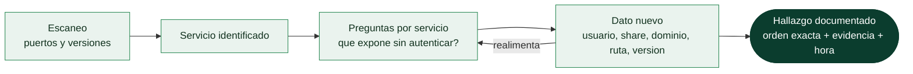

# Clase 033 — Enumeración de servicios de red

> Parte: **1 — Redes y seguridad de redes** · Fuente: *The Hacker Playbook / OSCP methodology; docs oficiales de cada servicio*
> ⏱️ Duración estimada: **130 min** · Nivel: **Intermedio**

---

## 🎯 Objetivo

Profundizar la fase de **enumeración**: una vez identificados puertos y versiones, extraer toda la información útil de cada servicio (SMB, HTTP, DNS, SMTP, SNMP, FTP, LDAP) con herramientas especializadas. La enumeración exhaustiva es lo que separa un escaneo superficial de una evaluación real, y suele ser la fase que más hallazgos produce.

## 📚 Resultados de aprendizaje

Al finalizar, el alumno podrá:

1. **Enumerar** recursos compartidos, usuarios y políticas SMB.
2. **Explorar** servidores web: directorios, tecnologías, vhosts y cabeceras.
3. **Extraer** información de DNS (registros, transferencias de zona).
4. **Interrogar** SNMP, SMTP y FTP para obtener usuarios y configuración.
5. **Organizar** los hallazgos en notas estructuradas por servicio.
6. **Priorizar** vectores según el valor de la información obtenida.

## 🗺️ Temas

| # | Tema | Por qué importa |
|---|------|-----------------|
| 1 | Metodología de enumeración | Orden y exhaustividad |
| 2 | SMB (139/445) | Muy rico en información en redes Windows |
| 3 | HTTP/HTTPS (80/443) | Mayor superficie de ataque |
| 4 | DNS (53) | Mapa de la infraestructura |
| 5 | SNMP (161/udp) | Configuración y a veces credenciales |
| 6 | SMTP (25) | Enumeración de usuarios |
| 7 | FTP/LDAP | Accesos anónimos y directorio |

## 🧠 Explicación en profundidad

### Enumerar es distinto de escanear, y es donde se gana el compromiso

El escaneo responde *qué hay*; la enumeración responde *qué me deja ver y hacer eso que
hay*. Es una diferencia de profundidad, no de herramienta: escanear el 445 te dice que
hay SMB; enumerarlo te da la lista de comparticiones, los usuarios del dominio, la
política de contraseñas y a veces un fichero de configuración con credenciales dentro.
En la práctica profesional, la enumeración es la fase que más determina el resultado de
un pentest, y la que más se hace mal por prisa.

El método que funciona tiene tres propiedades. Es **exhaustivo**: no se salta un puerto
raro porque "seguramente no sea nada", porque el servicio olvidado es precisamente el
que nadie parchea. Es **iterativo**: cada dato encontrado abre una consulta nueva —un
nombre de usuario lleva a probar acceso, un dominio lleva a una transferencia de zona,
una versión lleva a un exploit conocido—. Y es **documentado**: cada hallazgo se anota
con la orden exacta que lo produjo y la marca de tiempo, porque un informe sin
reproducibilidad no vale nada y porque el cliente puede pedirte que demuestres qué
hiciste y cuándo.



### Qué preguntar a cada servicio

Cada protocolo tiene su repertorio de preguntas, y conviene tenerlo interiorizado.
**SMB** (139/445) es el más generoso en redes Windows: comparticiones accesibles,
sesiones nulas en sistemas antiguos, usuarios y grupos, política de contraseñas y
versión del dialecto —si acepta SMBv1, ya tienes un hallazgo por sí solo—. **HTTP/S**
(80/443) abre la superficie más grande: cabeceras y tecnología del servidor,
`robots.txt` y ficheros de metadatos, directorios y ficheros por diccionario,
*virtual hosts* que responden distinto según el `Host`, y el certificado TLS, que suele
regalar nombres internos en sus *Subject Alternative Names*.

**DNS** (53) dibuja el mapa: registros habituales, y sobre todo la transferencia de zona
(`AXFR`), que en un servidor mal configurado entrega el listado completo de la
infraestructura de una vez. **SNMP** (161/udp) es el clásico infravalorado: con la
comunidad por defecto `public` se obtienen inventario de interfaces, procesos, software
instalado y a veces configuraciones enteras; con `private`, escritura. **SMTP** (25)
permite validar usuarios con `VRFY`, `EXPN` o el propio `RCPT TO`. **FTP** (21) se
comprueba siempre por acceso anónimo. Y **LDAP** (389/636) es, en un dominio, el
directorio completo si permite consultas anónimas.

### El límite: enumerar no es explotar

Hay una frontera que conviene tener nítida antes de tocar nada. Consultar lo que un
servicio ofrece sin autenticación es enumeración. Probar credenciales por fuerza bruta,
escribir en una compartición o disparar un exploit es otra cosa, y necesita estar dentro
del **alcance autorizado** por escrito. El riesgo no es solo legal: un ataque de
diccionario contra un directorio activo bloquea cuentas y produce un incidente real
—llamadas al *service desk*, usuarios sin poder trabajar— que el cliente te va a
facturar en credibilidad. La regla operativa es sencilla: si una acción puede modificar
el estado del sistema objetivo, tiene que estar explícitamente permitida.

## 📖 Definiciones y características

- **Enumeración:** proceso de interactuar con un servicio para extraer información detallada (usuarios, recursos, versiones, configuración) más allá de saber que existe.
- **Null session (SMB):** conexión sin credenciales que en sistemas mal configurados revela usuarios y recursos.
- **Transferencia de zona (AXFR):** volcado completo de una zona DNS; si está mal permitida, expone todos los registros.
- **Community string (SNMP):** "contraseña" en claro (a menudo `public`/`private`) que da acceso de lectura/escritura a la MIB.
- **VHost (Virtual Host):** varios sitios en una misma IP diferenciados por cabecera `Host`; enumerarlos revela aplicaciones ocultas.

## 📔 Glosario

| Término | Definición concisa |
|---------|--------------------|
| Enumeración | Extraer información detallada de un servicio ya identificado |
| Sesión nula | Conexión SMB sin credenciales que revela usuarios y recursos |
| Compartición (*share*) | Recurso de red publicado por SMB |
| SMBv1 | Dialecto obsoleto e inseguro; su presencia ya es un hallazgo |
| AXFR | Transferencia de zona DNS; entrega la zona completa |
| Cadena de comunidad | "Contraseña" de SNMP; `public` y `private` son los valores por defecto |
| `VRFY` / `EXPN` | Órdenes SMTP que permiten validar o expandir usuarios |
| FTP anónimo | Acceso sin credenciales con el usuario `anonymous` |
| LDAP anónimo | Consulta al directorio sin autenticar; expone la estructura del dominio |
| *Virtual host* | Sitio que responde según la cabecera `Host`; oculta contenido |
| SAN del certificado | *Subject Alternative Names*; suele filtrar nombres internos |
| Fuerza bruta | Prueba masiva de credenciales; **fuera** de la enumeración pasiva |
| Bloqueo de cuentas | Efecto colateral de la fuerza bruta contra un directorio |
| Alcance autorizado | Conjunto de sistemas y acciones permitidos por escrito |

## 🧰 Herramientas y preparación

- **SMB:** `smbclient`, `enum4linux-ng`, `nmap` scripts `smb-*`, `crackmapexec`.
- **HTTP:** `whatweb`, `gobuster`/`feroxbuster`, `nikto`, `curl`.
- **DNS:** `dig`, `dnsenum`, `dnsrecon`.
- **SNMP:** `snmpwalk`, `onesixtyone`.
- **SMTP/FTP/LDAP:** `smtp-user-enum`, `ftp`, `ldapsearch`.
- Instalación típica en Kali: la mayoría vienen preinstaladas; si no, `sudo apt install smbclient snmp dnsutils gobuster nikto`.

> ⚠️ **Nota ética:** la enumeración es intrusiva y genera tráfico y logs. Realízala solo contra sistemas propios o dentro del alcance autorizado por escrito. Practica en tu laboratorio aislado.

## 🧪 Laboratorio guiado

1. **SMB — recursos y sistema**:

   ```bash
   smbclient -L //192.168.56.101/ -N
   nmap -p445 --script smb-enum-shares,smb-enum-users,smb-os-discovery 192.168.56.101
   enum4linux-ng -A 192.168.56.101
   ```

2. **HTTP — tecnologías y directorios**:

   ```bash
   whatweb http://192.168.56.101/
   gobuster dir -u http://192.168.56.101/ -w /usr/share/wordlists/dirb/common.txt -t 30
   curl -sI http://192.168.56.101/    # cabeceras
   nikto -h http://192.168.56.101/
   ```

3. **DNS — registros y transferencia de zona**:

   ```bash
   dig @192.168.56.1 lab.local ANY
   dig @192.168.56.1 lab.local AXFR      # transferencia de zona
   dnsrecon -d lab.local -n 192.168.56.1
   ```

4. **SNMP**:

   ```bash
   onesixtyone -c /usr/share/wordlists/snmp.txt 192.168.56.101
   snmpwalk -v2c -c public 192.168.56.101
   ```

5. **SMTP — enumeración de usuarios**:

   ```bash
   smtp-user-enum -M VRFY -U users.txt -t 192.168.56.101
   ```

6. **FTP anónimo**:

   ```bash
   ftp 192.168.56.101   # usuario: anonymous, password: cualquiera
   ```

7. **Documenta** cada hallazgo en un archivo por servicio (`notas-smb.md`, `notas-http.md`, …).

## ✍️ Ejercicios

1. Enumera los recursos SMB del objetivo y determina cuáles permiten acceso anónimo.
2. Con gobuster, encuentra al menos dos directorios no enlazados desde la página principal.
3. Intenta una transferencia de zona AXFR y explica el riesgo si tiene éxito.
4. Haz `snmpwalk` y localiza el nombre del sistema y la tabla de procesos.
5. Enumera usuarios por SMTP con VRFY y explica por qué muchos servidores lo desactivan.
6. Usa `whatweb` y `curl -I` para inventariar el stack tecnológico de un sitio.

## 📝 Reto verificable

Elabora una "hoja de enumeración" de un host multiservicio de laboratorio que documente, por cada servicio abierto: versión, información sensible obtenida (recursos, usuarios, registros, directorios) y al menos un vector de ataque potencial priorizado. Entrega las notas y los comandos usados.

**Criterio de aceptación:** la hoja cubre todos los servicios abiertos que el revisor conoce, cada hallazgo es reproducible con el comando indicado y el vector priorizado es coherente con la información obtenida.

## ⚠️ Errores comunes

| Síntoma / mensaje | Causa y cómo arreglar |
|-------------------|-----------------------|
| `smbclient` "NT_STATUS_ACCESS_DENIED" | El recurso requiere credenciales; prueba null session `-N` o busca credenciales válidas |
| gobuster devuelve todo 200/403 igual | Falta filtrar por código o tamaño; usa `-b` para excluir códigos o `--exclude-length` |
| AXFR "Transfer failed" | La transferencia de zona está (correctamente) restringida; no es un fallo, es una buena práctica del servidor |
| `snmpwalk` sin respuesta | Community string incorrecta o SNMP filtrado; prueba `public`/`private` o versiones distintas |
| enum4linux muy lento | Muchas comprobaciones; usa opciones selectivas en lugar de `-A` |

## ❓ Preguntas frecuentes

**❓ ¿Por qué SMB da tanta información?**
Porque en redes Windows expone recursos, usuarios, políticas y el SO por diseño. Mal configurado (null sessions), regala un mapa de la organización.

**❓ ¿Enumeración y escaneo son lo mismo?**
No. El escaneo dice qué hay (puertos/servicios); la enumeración interactúa con cada servicio para extraer información detallada y utilizable.

**❓ ¿La enumeración es detectable?**
Mucho. Genera numerosas conexiones y peticiones que un IDS/SIEM registra. Por eso solo se hace dentro del alcance autorizado.

**❓ ¿Qué hago con tanta información?**
Organízala por servicio y prioriza vectores según impacto y facilidad. Unas buenas notas de enumeración son la base de las fases de explotación posteriores.

## 🔗 Referencias

- Nmap NSE scripts (smb-*, http-*, dns-*). <https://nmap.org/nsedoc/>
- OWASP Testing Guide — Information Gathering. <https://owasp.org/www-project-web-security-testing-guide/>
- gobuster. <https://github.com/OJ/gobuster>
- enum4linux-ng. <https://github.com/cddmp/enum4linux-ng>

## 📥 Material descargable

- 📄 [Guía en PDF](./clase-033-guia.pdf) — versión imprimible de esta clase.
- 🎞️ [Presentación (PPTX)](./clase-033-presentacion.pptx) — deck para proyectar en clase.

## ⬅️ Clase anterior

[Clase 032 — Nmap Scripting Engine (NSE)](../032-nmap-scripting-engine-nse/README.md)

## ➡️ Siguiente clase

[Clase 034 — Firewalls: tipos, iptables y nftables](../034-firewalls-tipos-iptables-y-nftables/README.md)
