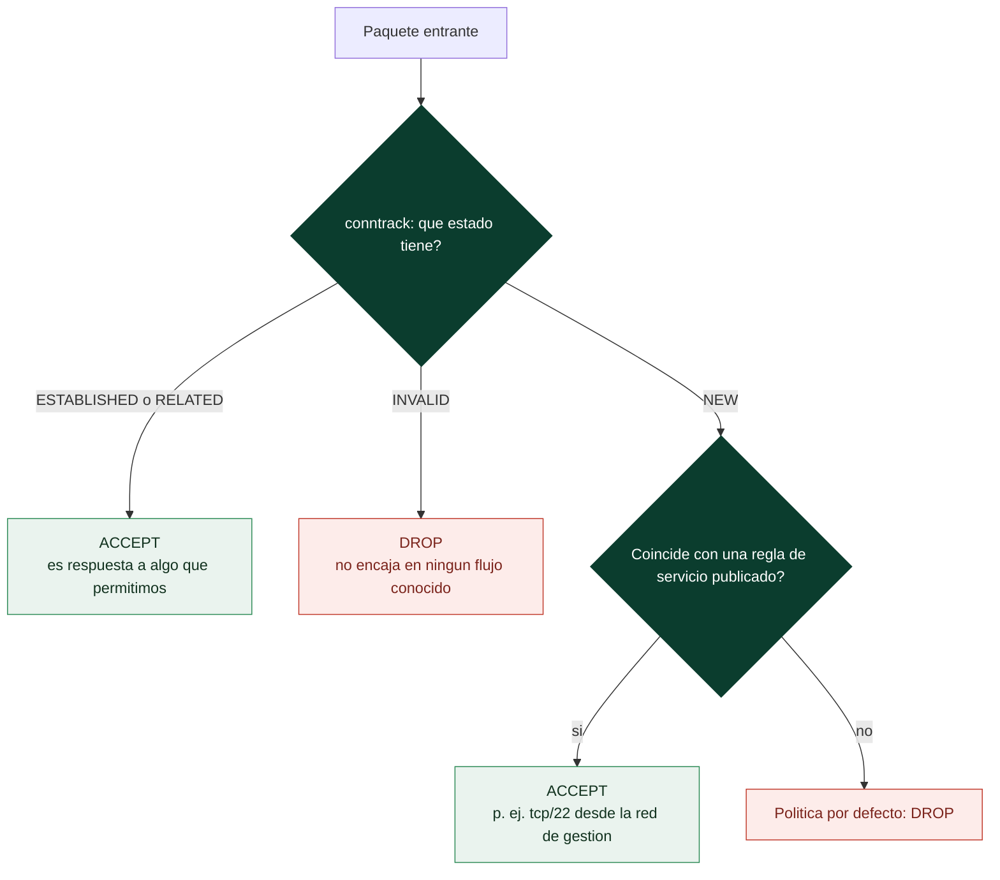

# Clase 034 — Firewalls: tipos, iptables y nftables

> Parte: **1 — Redes y seguridad de redes** · Fuente: *Documentación del kernel Linux (netfilter); Michael Lucas, PF/firewalls*
> ⏱️ Duración estimada: **130 min** · Nivel: **Intermedio**

---

## 🎯 Objetivo

Entender los tipos de firewall (sin estado, con estado, de aplicación) y construir conjuntos de reglas reales en Linux con **iptables** y su sucesor **nftables**. El alumno aprenderá a filtrar tráfico por defecto-denegar, permitir servicios concretos, hacer seguimiento de conexiones y a persistir y auditar las reglas.

## 📚 Resultados de aprendizaje

Al finalizar, el alumno podrá:

1. **Distinguir** firewalls sin estado, con estado y de capa de aplicación.
2. **Explicar** la arquitectura de netfilter (tablas, cadenas, hooks).
3. **Escribir** una política por defecto-denegar con excepciones controladas.
4. **Usar** conntrack para permitir tráfico de conexiones establecidas.
5. **Traducir** reglas entre iptables y nftables.
6. **Persistir**, registrar y auditar el conjunto de reglas.

## 🗺️ Temas

| # | Tema | Por qué importa |
|---|------|-----------------|
| 1 | Tipos de firewall | Elegir la tecnología adecuada |
| 2 | Arquitectura netfilter | Entender dónde actúa cada regla |
| 3 | Tablas y cadenas (filter, nat) | Ubicar la lógica correcta |
| 4 | Estados de conexión (conntrack) | Reglas simples y seguras |
| 5 | Política por defecto | Base de un firewall robusto |
| 6 | nftables vs. iptables | Sintaxis moderna unificada |
| 7 | Persistencia y logging | Reglas duraderas y auditables |

## 🧠 Explicación en profundidad

### El estado lo cambia todo

Un firewall **sin estado** juzga cada paquete por separado: mira direcciones, puertos y
flags, y decide. Suena razonable hasta que intentas escribir una regla para "permitir
que mis usuarios naveguen". Sin estado necesitas dos reglas —salida al 443 y entrada
desde el 443— y esa segunda regla abre un agujero enorme, porque cualquier atacante que
ponga el 443 como puerto de origen atraviesa tu filtro. Un firewall **con estado** en
cambio recuerda las conexiones que ha visto nacer, y por eso puede expresar la
intención real: "permite lo que salga y lo que sea respuesta a algo que salió".

En Linux esa memoria es **conntrack**, y clasifica cada paquete en cuatro estados.
`NEW` es un intento de conexión nuevo. `ESTABLISHED` pertenece a una conexión ya
aceptada. `RELATED` es tráfico asociado a otra conexión existente —el caso clásico es
el canal de datos de FTP, o un `ICMP unreachable` que corresponde a una conexión
conocida—. E `INVALID` es lo que no encaja en ningún flujo conocido y casi siempre se
descarta. Con esas cuatro piezas, un firewall de host completo cabe en cuatro reglas, y
eso no es una simplificación de manual: es la forma correcta de escribirlo.



### Dónde actúa cada regla: netfilter en cinco ganchos

`iptables` y `nftables` no son el firewall: son la interfaz para programar
**netfilter**, el subsistema del kernel que intercepta los paquetes en cinco puntos
—`PREROUTING`, `INPUT`, `FORWARD`, `OUTPUT` y `POSTROUTING`—. Saber en qué gancho actúa
cada cadena es lo que evita el desconcierto más común del principiante: una regla en
`INPUT` no filtra el tráfico que el equipo **enruta** hacia otra máquina, porque ese
tráfico pasa por `FORWARD` y nunca toca `INPUT`. Del mismo modo, el NAT de destino se
hace en `PREROUTING` —antes de decidir la ruta, porque cambia el destino— y el NAT de
origen en `POSTROUTING`, justo antes de salir.

Las reglas se evalúan **en orden** dentro de cada cadena y la primera coincidencia
decide, así que el orden no es un detalle de estilo: una regla permisiva colocada arriba
anula todo lo que venga después. Y al final está la **política por defecto**, que en un
firewall serio es `DROP`: se deniega todo y se abre lo justificado, no al revés.
Escribir la política de `INPUT` en `DROP` sin haber permitido antes el tráfico
`ESTABLISHED` y el interfaz de *loopback* es, por cierto, la forma más rápida y clásica
de perder el acceso SSH a un servidor remoto.

### nftables, y por qué conviene migrar

`nftables` sustituye a la familia entera de herramientas antiguas —`iptables`,
`ip6tables`, `arptables`, `ebtables`— por una sola sintaxis y un solo motor. Sus mejoras
no son cosméticas: los **conjuntos** (*sets*) y **mapas** permiten expresar "estos
cuarenta puertos" o "estas redes" en una única regla en lugar de cuarenta, con
evaluación eficiente en lugar de lineal; una misma tabla `inet` cubre IPv4 e IPv6 sin
duplicar el conjunto de reglas —y olvidar IPv6 es un agujero real, porque un servidor
con IPv6 activo y sin filtrar está expuesto aunque su IPv4 esté impecable—; y las
actualizaciones son atómicas, así que no hay ventana con el firewall a medio cargar.

Dos hábitos completan el cuadro. **Persistencia**: las reglas viven en memoria y
desaparecen al reiniciar, así que hay que guardarlas explícitamente
(`nft list ruleset > /etc/nftables.conf`, `iptables-save`, o el mecanismo de la
distribución). Y **logging**: registrar lo que se descarta, con límite de tasa para no
inundar el disco, es lo que convierte al firewall en una fuente de detección y no solo
en un muro mudo.

## 📖 Definiciones y características

- **Firewall sin estado:** filtra cada paquete de forma aislada según cabeceras; simple pero incapaz de relacionar paquetes de una misma conexión.
- **Firewall con estado (stateful):** mantiene una tabla de conexiones (conntrack) y decide en función del estado (`NEW`, `ESTABLISHED`, `RELATED`); es el estándar actual.
- **Firewall de aplicación (proxy/WAF):** inspecciona la capa 7; entiende HTTP, SQL, etc. y filtra por contenido.
- **Cadena (chain):** lista ordenada de reglas asociada a un hook de netfilter (`INPUT`, `OUTPUT`, `FORWARD`).
- **Política por defecto:** acción cuando ninguna regla coincide. La postura segura es `DROP` en INPUT/FORWARD.
- **nftables:** framework moderno del kernel que reemplaza iptables/ip6tables/arptables/ebtables con una sintaxis unificada y mejor rendimiento.

## 📔 Glosario

| Término | Definición concisa |
|---------|--------------------|
| Firewall sin estado | Juzga cada paquete de forma aislada; exige reglas de vuelta inseguras |
| Firewall con estado | Recuerda las conexiones vistas y permite sus respuestas |
| conntrack | Subsistema del kernel Linux que sigue el estado de las conexiones |
| `NEW` | Paquete que inicia una conexión nueva |
| `ESTABLISHED` | Paquete perteneciente a una conexión ya aceptada |
| `RELATED` | Tráfico asociado a otra conexión (datos de FTP, ICMP correspondiente) |
| `INVALID` | Paquete que no encaja en ningún flujo conocido; se descarta |
| netfilter | Subsistema del kernel que intercepta paquetes; el motor real |
| `PREROUTING` / `POSTROUTING` | Ganchos antes y después de la decisión de ruta (NAT) |
| `INPUT` / `OUTPUT` / `FORWARD` | Tráfico hacia, desde y a través del equipo |
| Política por defecto | Veredicto si ninguna regla coincide; en un firewall serio, `DROP` |
| DROP vs. REJECT | Descartar en silencio o responder con un error explícito |
| nftables | Sustituto moderno y unificado de iptables/ip6tables/arptables/ebtables |
| *Set* / mapa | Estructura de nftables que agrupa puertos o redes en una sola regla |
| Tabla `inet` | Tabla de nftables que cubre IPv4 e IPv6 con un solo conjunto de reglas |

## 🧰 Herramientas y preparación

- **iptables** y **nftables**: `sudo apt install iptables nftables`.
- **conntrack-tools** para inspeccionar conexiones: `sudo apt install conntrack`.
- Persistencia: `iptables-persistent` (Debian/Ubuntu) o servicio `nftables`.
- Practica en una VM: una regla mal hecha puede dejarte sin SSH.

> ⚠️ **Nota:** trabaja en una VM con consola alternativa (no solo SSH). Ten a mano una tarea programada que limpie las reglas por si te bloqueas:
>
> ```bash
> echo "iptables -F" | at now + 5 minutes
> ```

## 🧪 Laboratorio guiado — iptables

1. **Ver reglas actuales**:

   ```bash
   sudo iptables -L -n -v
   ```

2. **Permitir loopback y conexiones establecidas** (siempre primero):

   ```bash
   sudo iptables -A INPUT -i lo -j ACCEPT
   sudo iptables -A INPUT -m conntrack --ctstate ESTABLISHED,RELATED -j ACCEPT
   ```

3. **Permitir SSH y HTTP entrantes**:

   ```bash
   sudo iptables -A INPUT -p tcp --dport 22 -m conntrack --ctstate NEW -j ACCEPT
   sudo iptables -A INPUT -p tcp --dport 80 -m conntrack --ctstate NEW -j ACCEPT
   ```

4. **Registrar y denegar el resto**:

   ```bash
   sudo iptables -A INPUT -j LOG --log-prefix "FW-DROP: " --log-level 4
   sudo iptables -P INPUT DROP
   ```

5. **Inspecciona conexiones**:

   ```bash
   sudo conntrack -L
   ```

6. **Persistir**:

   ```bash
   sudo netfilter-persistent save
   ```

## 🧪 Laboratorio guiado — nftables

7. **Crear tabla y cadena con política drop**:

   ```bash
   sudo nft add table inet filtro
   sudo nft add chain inet filtro entrada '{ type filter hook input priority 0; policy drop; }'
   ```

8. **Reglas equivalentes**:

   ```bash
   sudo nft add rule inet filtro entrada iif lo accept
   sudo nft add rule inet filtro entrada ct state established,related accept
   sudo nft add rule inet filtro entrada tcp dport {22, 80} ct state new accept
   sudo nft add rule inet filtro entrada log prefix "FW-DROP: " drop
   ```

9. **Ver el ruleset y persistir**:

   ```bash
   sudo nft list ruleset | sudo tee /etc/nftables.conf
   sudo systemctl enable --now nftables
   ```

## ✍️ Ejercicios

1. Escribe una política por defecto-denegar que solo permita SSH desde una subred concreta (`-s 192.168.56.0/24`).
2. Añade una regla que limite la tasa de nuevas conexiones SSH (`-m limit` o `ct count`) para mitigar fuerza bruta.
3. Traduce tu conjunto de reglas de iptables a nftables y verifica que se comportan igual.
4. Configura logging solo para paquetes denegados y localiza las entradas en `journalctl -k`.
5. Bloquea todo el tráfico saliente salvo DNS y HTTP/HTTPS (política OUTPUT restrictiva).
6. Usa `conntrack -E` para observar en vivo la creación y cierre de conexiones.

## 📝 Reto verificable

Configura en una VM un firewall stateful con política por defecto-denegar en INPUT que permita: loopback, conexiones establecidas, SSH solo desde tu subred de laboratorio y HTTP desde cualquier origen; registra y descarta el resto. Entrega el ruleset (`nft list ruleset` o `iptables-save`) y una evidencia de que un escaneo Nmap externo solo ve los puertos permitidos.

**Criterio de aceptación:** desde otra VM, `nmap -Pn` muestra 22 (solo desde la subred autorizada) y 80 abiertos y el resto `filtered`; los intentos denegados aparecen en el log del kernel.

## ⚠️ Errores comunes

| Síntoma / mensaje | Causa y cómo arreglar |
|-------------------|-----------------------|
| Te quedas sin SSH al aplicar `-P INPUT DROP` | No permitiste established/SSH antes de la política; añade esas reglas primero y usa un `at` de rescate |
| Reglas se pierden al reiniciar | No persististe; usa `netfilter-persistent save` o `/etc/nftables.conf` |
| El orden de las reglas no funciona | Las cadenas se evalúan de arriba a abajo; coloca los ACCEPT específicos antes del DROP general |
| iptables y nftables se pisan | Ambos activos a la vez; en sistemas modernos usa solo nftables (iptables suele ser el backend `nft`) |
| Logging llena el disco | Sin límite de tasa en LOG; añade `-m limit --limit 5/min` |

## ❓ Preguntas frecuentes

**❓ ¿iptables está obsoleto?**
Está siendo reemplazado por nftables, que es el framework recomendado. En muchas distros `iptables` ya es un frontend sobre nftables. Aprende ambos: verás iptables en sistemas heredados.

**❓ ¿Qué es conntrack y por qué importa?**
Es el subsistema de seguimiento de conexiones. Permite escribir reglas simples ("permite lo establecido") en lugar de reglas espejo para cada dirección del tráfico.

**❓ ¿Dónde va la política por defecto?**
Al final. Primero los ACCEPT específicos y las reglas de established; la última palabra es `DROP` para todo lo no permitido.

**❓ ¿Un firewall de host reemplaza al perimetral?**
No, se complementan. Defensa en profundidad: firewall perimetral + firewall de host + segmentación.

## 🔗 Referencias

- netfilter/iptables project. <https://www.netfilter.org/>
- nftables wiki. <https://wiki.nftables.org/>
- Arch Wiki — nftables. <https://wiki.archlinux.org/title/Nftables>
- Man pages: `iptables(8)`, `nft(8)`, `conntrack(8)`.

## 📥 Material descargable

- 📄 [Guía en PDF](./clase-034-guia.pdf) — versión imprimible de esta clase.
- 🎞️ [Presentación (PPTX)](./clase-034-presentacion.pptx) — deck para proyectar en clase.

## ⬅️ Clase anterior

[Clase 033 — Enumeración de servicios de red](../033-enumeracion-de-servicios-de-red/README.md)

## ➡️ Siguiente clase

[Clase 035 — IDS/IPS con Snort y Suricata](../035-ids-ips-con-snort-y-suricata/README.md)
