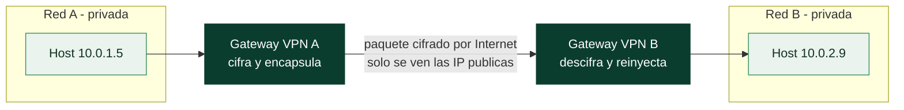

# Clase 036 — VPN y túneles: IPsec, WireGuard y OpenVPN

> Parte: **1 — Redes y seguridad de redes** · Fuente: *RFC 4301 (IPsec); documentación de WireGuard y OpenVPN*
> ⏱️ Duración estimada: **130 min** · Nivel: **Intermedio**

---

## 🎯 Objetivo

Comprender cómo funcionan las redes privadas virtuales y los túneles cifrados, y configurar los tres más usados: **WireGuard** (moderno y simple), **OpenVPN** (flexible y probado) e **IPsec** (estándar para site-to-site). El alumno aprenderá a elegir la tecnología según el caso de uso y a desplegar un túnel funcional con parámetros seguros.

## 📚 Resultados de aprendizaje

Al finalizar, el alumno podrá:

1. **Explicar** la diferencia entre VPN de acceso remoto y site-to-site, y entre túnel y transporte.
2. **Configurar** un túnel WireGuard punto a punto con claves y `AllowedIPs`.
3. **Desplegar** un servidor OpenVPN con certificados (PKI).
4. **Describir** las fases de IPsec (IKE, ESP) y sus modos.
5. **Verificar** el cifrado con captura de paquetes.
6. **Evaluar** ventajas, rendimiento y superficie de ataque de cada opción.

## 🗺️ Temas

| # | Tema | Por qué importa |
|---|------|-----------------|
| 1 | Conceptos: VPN, túnel, encapsulación | Base de todo lo demás |
| 2 | Acceso remoto vs. site-to-site | Elegir arquitectura |
| 3 | WireGuard: criptografía moderna | Simplicidad y rendimiento |
| 4 | OpenVPN: PKI y TLS | Flexibilidad y compatibilidad |
| 5 | IPsec: IKE, ESP, AH, modos | Estándar de la industria |
| 6 | Enrutamiento y `AllowedIPs`/split tunnel | Qué tráfico va por el túnel |
| 7 | Verificación y hardening | Confirmar que cifra y es seguro |

## 🧠 Explicación en profundidad

### Un túnel es un paquete dentro de otro paquete

La idea que sostiene toda VPN es la **encapsulación**: coger un paquete IP completo,
cifrarlo, y meterlo como carga útil dentro de otro paquete IP que viaja por la red
pública. El paquete exterior lleva las direcciones de los dos extremos del túnel y no
revela nada de lo que transporta; el interior, con las direcciones reales de origen y
destino, viaja protegido. Cuando el paquete llega al otro extremo, se descifra y se
reinyecta como si hubiera nacido en esa red. Eso es lo que crea la ilusión de que dos
redes separadas por Internet son una sola red privada.

De esa mecánica salen las dos arquitecturas. En **acceso remoto**, un usuario (el
"guerrero de carretera") monta un túnel hasta la red de su organización y trabaja como
si estuviera dentro. En **site-to-site**, dos redes enteras se unen a través de un par
de *gateways* que cifran todo lo que cruza entre ellas, de forma transparente para los
equipos de cada lado. La diferencia no es de tecnología sino de dónde termina el túnel:
en un dispositivo del usuario o en la puerta de una red.



### Tres tecnologías, tres filosofías

**WireGuard** es la apuesta moderna y su virtud es la simplicidad. Vive en el kernel,
usa un conjunto **fijo** de primitivas criptográficas actuales (Curve25519,
ChaCha20-Poly1305, BLAKE2), y su configuración cabe en unas pocas líneas: cada par se
identifica por su clave pública, exactamente como SSH. Menos código significa menos
superficie de ataque y menos que auditar, y su rendimiento supera al de las
alternativas. Su modelo mental clave es `AllowedIPs`, que cumple doble función: define
qué destinos se enrutan por el túnel y, en recepción, qué IP de origen se aceptan de
cada par (*cryptokey routing*).

**OpenVPN** es la opción veterana y flexible: corre en espacio de usuario, se apoya en
TLS y en una **PKI** de certificados, y por eso puede atravesar casi cualquier red
—incluso disfrazándose de HTTPS sobre el 443— a costa de más configuración y menor
rendimiento. **IPsec** es el estándar de la industria y el más complejo: no es un
protocolo sino una suite (IKE negocia las claves; ESP cifra y autentica la carga; AH
solo autentica), con dos modos —*transporte*, que cifra solo la carga, y *túnel*, que
cifra el paquete entero— y es lo que hablan de fábrica los equipos de red y los
cortafuegos corporativos.

### Lo que un túnel cifrado no te da gratis

Montar el túnel es la mitad del trabajo; la otra mitad es asegurarse de que hace lo que
crees. El error de configuración más frecuente y peligroso es el **split tunneling** mal
entendido: si solo enrutas por el túnel el rango de la oficina, el resto del tráfico del
usuario sale por su conexión local sin protección, lo que puede ser aceptable o un
agujero según el caso —un portátil comprometido con un pie en cada red es un puente—.
Enrutar *todo* por el túnel (`AllowedIPs = 0.0.0.0/0`) protege pero concentra el tráfico
y expone la resolución DNS, que hay que forzar también por el túnel para no filtrar por
fuera qué dominios visita el usuario.

Y una VPN cifra el **transporte**, no valida al usuario ni comprueba el estado del
dispositivo: es un canal, no un control de acceso. Por eso encaja como una pieza dentro
del zero trust de la clase 042 y no como su sustituto. Verificar que un túnel realmente
cifra —capturando en el interfaz físico y confirmando que ahí no se ve el tráfico
interior en claro— es un hábito que separa "lo configuré" de "funciona".

## 📖 Definiciones y características

- **Túnel:** encapsulación de paquetes dentro de otros para atravesar una red intermedia, normalmente cifrando la carga.
- **WireGuard:** VPN moderna en el kernel Linux; usa criptografía fija y opinada (Curve25519, ChaCha20-Poly1305, BLAKE2s) y config mínima. Muy rápida.
- **OpenVPN:** VPN en espacio de usuario sobre TLS; muy flexible (TCP/UDP, certificados, usuario/clave) y ampliamente soportada.
- **IPsec:** conjunto de protocolos (IKE para negociar claves, ESP para cifrar) estandarizado en RFC 4301; base de la mayoría de VPN site-to-site empresariales.
- **`AllowedIPs` (WireGuard):** define qué rangos se enrutan por el túnel y qué IP de origen se aceptan del peer; determina el "split tunnel".
- **PFS (Perfect Forward Secrecy):** propiedad por la que comprometer una clave no revela sesiones pasadas; aportada por el intercambio efímero de claves.

## 📔 Glosario

| Término | Definición concisa |
|---------|--------------------|
| VPN | Red privada extendida sobre una infraestructura pública mediante cifrado |
| Túnel | Encapsulación de un paquete dentro de otro para atravesar una red |
| Acceso remoto | Túnel de un usuario individual hacia la red de la organización |
| Site-to-site | Túnel entre dos redes completas, gateway a gateway |
| WireGuard | VPN moderna en kernel, con criptografía fija y configuración mínima |
| `AllowedIPs` | En WireGuard, destinos enrutados y orígenes aceptados por par |
| OpenVPN | VPN en espacio de usuario basada en TLS y PKI; muy flexible |
| IPsec | Suite estándar de VPN: IKE, ESP y AH |
| IKE | Protocolo de intercambio de claves de IPsec |
| ESP / AH | Cifrado+autenticación / solo autenticación en IPsec |
| Modo túnel vs. transporte | Cifrar el paquete entero o solo su carga útil |
| Split tunneling | Enrutar solo parte del tráfico por el túnel |
| PKI | Infraestructura de certificados que autentica los extremos |
| Fuga de DNS | Resolver nombres fuera del túnel, revelando los dominios visitados |

## 🧰 Herramientas y preparación

- **WireGuard**: `sudo apt install wireguard`.
- **OpenVPN** + **easy-rsa**: `sudo apt install openvpn easy-rsa`.
- **IPsec**: `strongswan` (`sudo apt install strongswan`).
- Dos VMs de laboratorio en redes distintas (o una red que las separe) para probar el túnel.

> ⚠️ **Nota:** genera y protege las claves privadas con permisos estrictos (`chmod 600`). Nunca compartas claves privadas ni las subas a repositorios. Practica en tu laboratorio.

## 🧪 Laboratorio guiado — WireGuard

1. **Genera claves** en cada peer:

   ```bash
   wg genkey | tee privada.key | wg pubkey > publica.key
   chmod 600 privada.key
   ```

2. **Configura el servidor** `/etc/wireguard/wg0.conf`:

   ```ini
   [Interface]
   Address = 10.10.0.1/24
   ListenPort = 51820
   PrivateKey = <privada-servidor>

   [Peer]
   PublicKey = <publica-cliente>
   AllowedIPs = 10.10.0.2/32
   ```

3. **Configura el cliente** análogamente con `AllowedIPs = 10.10.0.0/24` y `Endpoint = <ip-servidor>:51820`.
4. **Levanta el túnel** en ambos y verifica:

   ```bash
   sudo wg-quick up wg0
   sudo wg show
   ping 10.10.0.1
   ```

5. **Confirma que cifra**: captura en la interfaz física y verifica que ves UDP/51820 con payload cifrado (ESP-like), no el ICMP en claro:

   ```bash
   sudo tcpdump -i eth0 -n udp port 51820
   ```

## 🧪 Laboratorio guiado — OpenVPN e IPsec

6. **OpenVPN — PKI mínima** con easy-rsa:

   ```bash
   make-cadir ~/ca && cd ~/ca
   ./easyrsa init-pki && ./easyrsa build-ca nopass
   ./easyrsa build-server-full servidor nopass
   ./easyrsa build-client-full cliente1 nopass
   ```

   Configura `server.conf` (puerto 1194/udp, `dev tun`, cifrado AES-GCM) y arranca `sudo openvpn --config server.conf`.
7. **IPsec con strongSwan** (site-to-site, esquema): edita `/etc/ipsec.conf` con `ikev2`, `esp=aes256-sha256`, define `leftsubnet`/`rightsubnet`, y levanta con `sudo ipsec up <conexion>`.

## ✍️ Ejercicios

1. Monta un túnel WireGuard entre dos VMs y demuestra con tcpdump que el tráfico interno viaja cifrado.
2. Configura split tunnel en WireGuard para que solo una subred concreta pase por la VPN.
3. Con OpenVPN, revoca un certificado de cliente y verifica que ya no puede conectar (CRL).
4. Compara el tamaño de la configuración y el handshake de WireGuard vs. OpenVPN.
5. Explica, capturando con Wireshark, las fases IKE de una negociación IPsec.
6. Aplica un firewall (clase 034) que solo permita el puerto de la VPN y bloquee el resto.

## 📝 Reto verificable

Despliega un túnel funcional (WireGuard u OpenVPN) entre dos VMs de laboratorio en subredes distintas, de modo que puedan alcanzarse por la IP interna del túnel. Entrega: los archivos de configuración (sin claves privadas), la salida de `wg show`/estado de OpenVPN, y una captura de tcpdump en la interfaz física que demuestre que el tráfico va cifrado.

**Criterio de aceptación:** el `ping` entre IPs internas funciona, la captura en la interfaz física no muestra el contenido en claro, y las claves privadas tienen permisos `600` (nunca incluidas en la entrega).

## ⚠️ Errores comunes

| Síntoma / mensaje | Causa y cómo arreglar |
|-------------------|-----------------------|
| WireGuard no pasa tráfico | `AllowedIPs` mal definido o falta habilitar `ip_forward`; revisa rutas y `sysctl net.ipv4.ip_forward=1` |
| "handshake did not complete" | Clave pública equivocada, reloj desincronizado o firewall bloquea el puerto UDP |
| OpenVPN "TLS handshake failed" | Certificados mal generados o CA no confiable; regenera la PKI |
| El túnel sube pero no hay conectividad | Falta NAT/masquerade en el servidor o firewall bloquea el `tun`; añade regla POSTROUTING |
| IPsec no cifra la subred esperada | `leftsubnet`/`rightsubnet` incorrectos; ajusta las políticas de tráfico |

## ❓ Preguntas frecuentes

**❓ ¿WireGuard o OpenVPN?**
WireGuard es más simple, rápido y con menor superficie de código; ideal para nuevos despliegues. OpenVPN es más flexible y compatible con entornos que exigen TCP/443 o autenticación por usuario. IPsec domina el site-to-site empresarial.

**❓ ¿Una VPN me hace anónimo?**
No. Cifra el tráfico entre tus extremos y desplaza la confianza al proveedor de la VPN. No es anonimato; para eso hay otras herramientas y consideraciones.

**❓ ¿Qué es un split tunnel?**
Configuración donde solo parte del tráfico (ciertas subredes) va por la VPN y el resto sale directo. Se controla con las rutas y `AllowedIPs`.

**❓ ¿Por qué importa PFS?**
Porque si un atacante captura tráfico hoy y roba una clave mañana, con PFS no puede descifrar las sesiones pasadas. WireGuard y las suites modernas lo proporcionan.

## 🔗 Referencias

- WireGuard whitepaper y docs. <https://www.wireguard.com/>
- OpenVPN Community docs. <https://openvpn.net/community-resources/>
- RFC 4301 — Security Architecture for the Internet Protocol (IPsec). <https://www.rfc-editor.org/rfc/rfc4301>
- strongSwan documentation. <https://docs.strongswan.org/>

## 📥 Material descargable

- 📄 [Guía en PDF](./clase-036-guia.pdf) — versión imprimible de esta clase.
- 🎞️ [Presentación (PPTX)](./clase-036-presentacion.pptx) — deck para proyectar en clase.

## ⬅️ Clase anterior

[Clase 035 — IDS/IPS con Snort y Suricata](../035-ids-ips-con-snort-y-suricata/README.md)

## ➡️ Siguiente clase

[Clase 037 — Proxies, NAT y pivoting de red](../037-proxies-nat-y-pivoting-de-red/README.md)
