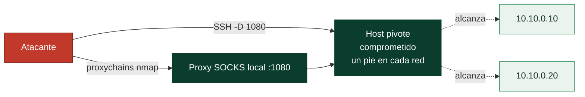

# Clase 037 — Proxies, NAT y pivoting de red

> Parte: **1 — Redes y seguridad de redes** · Fuente: *The Hacker Playbook; documentación de OpenSSH, proxychains, Chisel*
> ⏱️ Duración estimada: **130 min** · Nivel: **Avanzado**

---

## 🎯 Objetivo

Entender NAT y proxies como piezas de red, y aprender la técnica ofensiva/defensiva del **pivoting**: usar un host comprometido como trampolín para alcanzar redes internas no accesibles directamente. El alumno practicará túneles SSH, reenvío de puertos, SOCKS y herramientas de pivoting en un laboratorio controlado.

## 📚 Resultados de aprendizaje

Al finalizar, el alumno podrá:

1. **Explicar** SNAT/DNAT/PAT y el papel del NAT en la conectividad.
2. **Diferenciar** proxy directo, inverso y SOCKS.
3. **Crear** túneles SSH: local (`-L`), remoto (`-R`) y dinámico (`-D`).
4. **Encadenar** herramientas a través de un proxy con proxychains.
5. **Pivotar** hacia una segunda red usando un host intermedio.
6. **Detectar** y mitigar pivoting desde el lado defensivo.

## 🗺️ Temas

| # | Tema | Por qué importa |
|---|------|-----------------|
| 1 | NAT: SNAT, DNAT, PAT | Cómo se traduce el direccionamiento |
| 2 | Tipos de proxy | Control y ocultación del tráfico |
| 3 | Port forwarding SSH local/remoto | Acceso a servicios no expuestos |
| 4 | SSH dynamic (SOCKS) | Túnel genérico para múltiples destinos |
| 5 | proxychains | Enrutar herramientas por el túnel |
| 6 | Pivoting multi-salto | Alcanzar redes segmentadas |
| 7 | Detección defensiva del pivoting | Cerrar el vector |

## 🧠 Explicación en profundidad

### NAT: la traducción que moldea toda la red moderna

**NAT** reescribe direcciones (y a menudo puertos) de los paquetes que cruzan un router,
y entender sus tres variantes evita mucha confusión. **SNAT** cambia la dirección de
*origen*: es lo que hace tu router doméstico para que muchos equipos con IP privada
compartan una IP pública. **DNAT** cambia la de *destino*: es el *port forwarding* que
publica un servidor interno hacia fuera. Y **PAT** —la forma habitual de SNAT— multiplexa
por puerto de origen, de modo que el router recuerda en una tabla qué conexión interna
corresponde a cada puerto reescrito y puede devolver las respuestas al equipo correcto.

Esa tabla de traducción tiene una consecuencia de seguridad que es la base del resto de
la clase: **desde fuera no se puede iniciar una conexión hacia un equipo tras NAT**,
porque no hay entrada previa en la tabla que diga a dónde entregarla. El NAT no se
diseñó como control de seguridad, pero funciona como uno de facto, y por eso el atacante
que quiere alcanzar una red interna no ataca de fuera hacia dentro: hace que la conexión
**nazca desde dentro**.

### Pivoting: usar un equipo comprometido como puente

El *pivoting* es exactamente eso. Una vez que se controla un host con un pie en dos
redes —una alcanzable y otra segmentada—, ese host se usa como trampolín para llegar a
lo que antes era inaccesible. La herramienta natural es **SSH**, porque sus reenvíos de
puerto crean túneles sin instalar nada. Hay tres modos y conviene no confundirlos:

- **Local (`-L`)**: abres un puerto en *tu* máquina que sale por el servidor SSH hacia un
  destino concreto. Sirve para alcanzar *un* servicio interno.
- **Remoto (`-R`)**: abres un puerto en el *servidor* que vuelve hacia tu máquina. Es el
  *reverse shell* de los túneles: sirve cuando el equipo interno puede salir hacia ti
  pero tú no puedes entrar a él.
- **Dinámico (`-D`)**: conviertes el cliente SSH en un **proxy SOCKS**, un túnel genérico
  hacia *cualquier* destino que el servidor pueda alcanzar. Es el pivote de propósito
  general.



### proxychains, cadenas de saltos y cómo se ve desde el otro lado

**proxychains** intercepta las llamadas de red de una herramienta que no sabe hablar
SOCKS y las fuerza por el proxy del túnel, de modo que puedes lanzar un `nmap -sT` o un
cliente cualquiera "a través" del pivote. Hay dos límites que conviene enunciar sin
adornos: por un túnel SOCKS solo pasa **TCP** con conexión completa —así que nada de SYN
scan ni de UDP; el escaneo debe ser `-sT` y sin ping (`-Pn`)—, y cada salto añade
latencia, por lo que una cadena de tres o cuatro pivotes vuelve el escaneo lento y
frágil. Cuando la profundidad crece, los operadores pasan a frameworks de C2 con
enrutamiento propio, pero el concepto es el mismo.

Todo esto tiene su reverso defensivo, que es lo que de verdad importa proteger. El
pivoting deja huellas: conexiones internas que nacen en un host que no debería
iniciarlas, un servidor de aplicaciones hablando SSH hacia estaciones de trabajo, picos
de conexiones salientes de larga duración. La defensa no es un único control sino la
suma de segmentar de verdad (clase 042), monitorizar el tráfico **este-oeste** —el que
va de host interno a host interno, que el perímetro no ve— y restringir qué equipos
pueden iniciar conexiones hacia dónde. Un pivote solo funciona si la red interna confía
en sus propios equipos por el mero hecho de estar dentro, que es precisamente la
suposición que el zero trust elimina.

## 📖 Definiciones y características

- **NAT (Network Address Translation):** traduce direcciones entre redes; PAT (overload) multiplexa muchos hosts internos tras una IP pública usando puertos.
- **Proxy directo (forward):** intermedia las peticiones salientes de clientes hacia Internet; puede filtrar y registrar.
- **Proxy inverso (reverse):** se coloca delante de servidores y distribuye/oculta el backend.
- **Proxy SOCKS:** proxy de nivel de sesión, agnóstico al protocolo de aplicación; ideal para túneles genéricos (SOCKS5).
- **Pivoting:** técnica de usar un host ya controlado como punto de apoyo para acceder a segmentos de red que no son alcanzables directamente desde el atacante.
- **Túnel SSH dinámico (`-D`):** abre un proxy SOCKS local que reenvía por SSH cualquier conexión al otro extremo.

## 📔 Glosario

| Término | Definición concisa |
|---------|--------------------|
| NAT | Traducción de direcciones de red al cruzar un router |
| SNAT | Reescribe la dirección de origen (salida de una red privada) |
| DNAT | Reescribe la dirección de destino (*port forwarding*) |
| PAT | SNAT multiplexado por puerto; la forma doméstica habitual |
| Tabla de traducción | Registro que asocia cada conexión interna con su puerto reescrito |
| Proxy | Intermediario que reenvía tráfico en nombre de otro |
| Pivoting | Usar un host comprometido como puente hacia otra red |
| SSH `-L` (local) | Túnel hacia un servicio interno concreto |
| SSH `-R` (remoto) | Túnel de vuelta desde el servidor hacia el atacante |
| SSH `-D` (dinámico) | Convierte el cliente SSH en un proxy SOCKS genérico |
| SOCKS | Protocolo de proxy genérico; transporta TCP con conexión completa |
| proxychains | Fuerza el tráfico de una herramienta a través de un proxy |
| Tráfico este-oeste | Comunicación entre hosts internos; invisible al perímetro |
| Movimiento lateral | Avance del atacante de un host interno a otro |

## 🧰 Herramientas y preparación

- **OpenSSH** (cliente y servidor).
- **proxychains-ng**: `sudo apt install proxychains4`.
- **Chisel** (túneles sobre HTTP/WebSocket) y **socat** para casos sin SSH.
- Laboratorio: atacante → host pivote (con dos interfaces) → red interna con una víctima solo alcanzable desde el pivote.

> ⚠️ **Nota ética:** el pivoting es una técnica ofensiva de post-explotación. Practícalo **exclusivamente** en tu laboratorio o en un compromiso con autorización explícita y alcance definido por escrito. Usarlo para saltar a redes ajenas es un delito.

## 🧪 Laboratorio guiado

1. **Port forwarding local** (`-L`): accede a un servicio del pivote/red interna como si fuera local:

   ```bash
   ssh -L 8080:10.20.0.5:80 usuario@pivote
   curl http://127.0.0.1:8080/
   ```

2. **Port forwarding remoto** (`-R`): expón un servicio tuyo en el pivote (útil para reverse shells controladas):

   ```bash
   ssh -R 9000:127.0.0.1:80 usuario@pivote
   ```

3. **Túnel dinámico SOCKS** (`-D`):

   ```bash
   ssh -D 1080 usuario@pivote
   ```

4. **Configura proxychains** (`/etc/proxychains4.conf`):

   ```text
   [ProxyList]
   socks5 127.0.0.1 1080
   ```

5. **Enruta herramientas** por el túnel para alcanzar la red interna:

   ```bash
   proxychains4 nmap -sT -Pn -p 22,80,445 10.20.0.0/24
   proxychains4 curl http://10.20.0.5/
   ```

6. **Pivote sin SSH con Chisel** (esquema): en el pivote `chisel server -p 8000 --reverse`; en el atacante `chisel client <pivote>:8000 R:socks` para obtener un SOCKS.
7. **Lado defensivo**: en el pivote, detecta el túnel observando conexiones anómalas:

   ```bash
   ss -tnp | grep -E "ESTAB"
   ```

   y revisa reglas de firewall que impidan reenvíos no autorizados.

## ✍️ Ejercicios

1. Alcanza un servicio web de la red interna únicamente con un túnel `-L`.
2. Usa `-D` + proxychains para escanear la red interna con Nmap (`-sT`, sin raw).
3. Explica por qué con SOCKS conviene `-sT` y no `-sS` en Nmap.
4. Configura un reenvío remoto `-R` y describe un caso legítimo de uso (administración).
5. Con Chisel, establece un pivote cuando el pivote solo permite salida HTTP.
6. Desde el lado azul, escribe una regla de firewall/IDS que detecte un túnel SOCKS sospechoso.

## 📝 Reto verificable

Partiendo de un host pivote con dos interfaces (una hacia ti, otra hacia una red interna aislada), establece un túnel que te permita escanear y acceder a un servicio de la red interna que **no** es alcanzable directamente. Entrega los comandos usados, evidencia del escaneo a través del túnel y una explicación del camino que sigue un paquete desde tu máquina hasta la víctima interna.

**Criterio de aceptación:** demuestras acceso a un servicio interno inaccesible sin el túnel, el escaneo por proxychains devuelve puertos de la red interna, y la explicación del recorrido del paquete es correcta (atacante → SOCKS local → SSH → pivote → red interna).

## ⚠️ Errores comunes

| Síntoma / mensaje | Causa y cómo arreglar |
|-------------------|-----------------------|
| proxychains "denied" o sin salida | Puerto SOCKS mal configurado; verifica que `-D 1080` está activo y coincide con el conf |
| Nmap por proxychains no ve nada | Usaste `-sS` (raw no funciona por SOCKS); usa `-sT -Pn` |
| `-R` no expone el puerto | Falta `GatewayPorts yes` en el sshd del pivote |
| Túnel se cae por inactividad | Añade `ServerAliveInterval` o usa `autossh` |
| DNS no resuelve por el túnel | proxychains no proxifica DNS UDP por defecto; usa `proxy_dns` o resuelve por IP |

## ❓ Preguntas frecuentes

**❓ ¿Qué diferencia hay entre `-L` y `-R`?**
`-L` reenvía un puerto **local** hacia un destino accesible desde el servidor SSH (acceso entrante a un servicio remoto). `-R` reenvía un puerto **del servidor** hacia un destino accesible desde tu máquina (útil para exponerte hacia dentro).

**❓ ¿Por qué SOCKS y no un proxy HTTP?**
SOCKS es agnóstico al protocolo: túnela cualquier TCP (y SOCKS5 también UDP). Un proxy HTTP solo entiende HTTP.

**❓ ¿El pivoting es siempre malicioso?**
No. Los administradores usan túneles SSH y bastiones legítimamente. La técnica es neutra; el contexto y la autorización determinan la legalidad.

**❓ ¿Cómo se defiende una red del pivoting?**
Con segmentación estricta (clase 042), egress filtering, detección de túneles (tráfico cifrado anómalo, SOCKS), y principio de mínimo privilegio en los hosts que podrían servir de trampolín.

## 🔗 Referencias

- OpenSSH manual (port forwarding). <https://man.openbsd.org/ssh#L>
- proxychains-ng. <https://github.com/rofl0r/proxychains-ng>
- Chisel. <https://github.com/jpillora/chisel>
- MITRE ATT&CK — Proxy (T1090). <https://attack.mitre.org/techniques/T1090/>

## 📥 Material descargable

- 📄 [Guía en PDF](./clase-037-guia.pdf) — versión imprimible de esta clase.
- 🎞️ [Presentación (PPTX)](./clase-037-presentacion.pptx) — deck para proyectar en clase.

## ⬅️ Clase anterior

[Clase 036 — VPN y túneles: IPsec, WireGuard y OpenVPN](../036-vpn-y-tuneles-ipsec-wireguard-y-openvpn/README.md)

## ➡️ Siguiente clase

[Clase 038 — Seguridad WiFi: WPA2, WPA3 y superficie de ataque](../038-seguridad-wifi-wpa2-wpa3-y-superficie-de-ataque/README.md)
