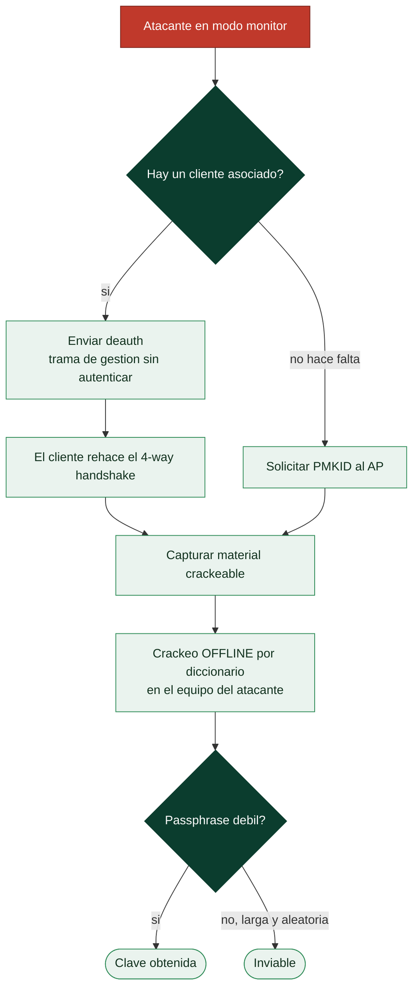

# Clase 038 — Seguridad WiFi: WPA2, WPA3 y superficie de ataque

> Parte: **1 — Redes y seguridad de redes** · Fuente: *IEEE 802.11; documentación de Aircrack-ng y hcxtools*
> ⏱️ Duración estimada: **130 min** · Nivel: **Avanzado**

---

## 🎯 Objetivo

Comprender la seguridad de las redes inalámbricas 802.11: cómo funcionan WPA2 y WPA3, el handshake de autenticación, y las técnicas de ataque (captura de handshake, PMKID, deauth, evil twin) junto con sus defensas. El alumno practicará auditoría WiFi de su propia red en un entorno controlado.

## 📚 Resultados de aprendizaje

Al finalizar, el alumno podrá:

1. **Explicar** el 4-way handshake de WPA2 y las mejoras de WPA3 (SAE).
2. **Poner** una tarjeta en modo monitor y capturar tráfico 802.11.
3. **Capturar** un handshake o PMKID de su propia red.
4. **Intentar** el crackeo offline de una passphrase de laboratorio.
5. **Reconocer** ataques de deauth y evil twin.
6. **Aplicar** contramedidas: WPA3, PMF, passphrases fuertes, WPA-Enterprise.

## 🗺️ Temas

| # | Tema | Por qué importa |
|---|------|-----------------|
| 1 | 802.11: SSID, BSSID, canales, tramas | Base del medio inalámbrico |
| 2 | WPA2-PSK y el 4-way handshake | Objetivo clásico de ataque |
| 3 | WPA3-SAE (Dragonfly) | El estándar seguro actual |
| 4 | Modo monitor y captura | Requisito para auditar |
| 5 | Captura de handshake y PMKID | Vectores de crackeo offline |
| 6 | Deauth y evil twin | Ataques activos |
| 7 | Contramedidas y PMF | Defensa real |

## 🧠 Explicación en profundidad

### El medio compartido cambia las reglas

En una red cableada, alcanzar el tráfico exige acceso físico al cable o al switch. En
inalámbrico, el medio es el aire y **cualquiera dentro del alcance recibe todas las
tramas**, aunque no esté conectado a la red. Esa diferencia es la raíz de toda la
seguridad WiFi: el cifrado no es un extra, es lo único que impide que el vecino lea tu
tráfico. Antes de hablar de ataques hay que fijar el vocabulario de 802.11: el **SSID**
es el nombre de la red; el **BSSID** es la MAC del punto de acceso; y las tramas se
dividen en tres tipos —*gestión* (asociación, autenticación, *beacons*), *control*
(ACK, RTS/CTS) y *datos*—. Las tramas de gestión son la superficie de ataque clave,
porque históricamente viajaban **sin autenticar**.

Para capturar todo eso hace falta **modo monitor**, distinto del promiscuo cableado:
entrega las tramas 802.11 crudas de todos los tipos, sin estar asociado a ninguna red, y
requiere una tarjeta y un driver que lo soporten. Sin modo monitor no hay auditoría WiFi
posible.

### WPA2 y el talón de Aquiles del 4-way handshake

WPA2-PSK protege el tráfico con una clave por sesión, pero esa clave se deriva durante
un intercambio inicial —el **4-way handshake**— que ocurre cada vez que un cliente se
asocia. El problema es que ese handshake contiene material suficiente para verificar
*offline* si una contraseña candidata es correcta. El atacante no necesita estar
conectado: le basta con **capturar el handshake** y después probar millones de
contraseñas contra él en su propio equipo, sin volver a tocar la red. Y no tiene que
esperar a que alguien se conecte: una trama de **deauth** —de gestión, sin autenticar—
expulsa a un cliente ya asociado y lo obliga a rehacer el handshake al reconectar.

El ataque **PMKID** lo hizo aún más fácil en muchos routers: permite obtener el material
crackeable directamente del punto de acceso, sin necesidad de un cliente conectado. En
ambos casos, la fortaleza real de una red WPA2-PSK **no está en el protocolo, sino en la
contraseña**: una passphrase larga y aleatoria es inviable de romper; una débil cae en
minutos con un diccionario.



### WPA3 y las defensas que sí funcionan

**WPA3** cambia el handshake por **SAE** (*Simultaneous Authentication of Equals*, o
Dragonfly), y la diferencia es estructural: SAE es un intercambio autenticado por
contraseña que **no entrega material para crackeo offline**. Aunque el atacante capture
todo, no puede probar contraseñas contra la captura; cada intento exige interactuar con
la red, lo que se puede limitar y detectar. WPA3 añade además *forward secrecy* —romper
una sesión no descubre las anteriores— y cifra incluso las redes abiertas con OWE.

La otra defensa imprescindible es **PMF** (*Protected Management Frames*, 802.11w), que
autentica las tramas de gestión y con ello **neutraliza el deauth**: sin la posibilidad
de expulsar clientes a voluntad, buena parte de los ataques activos —incluido el *evil
twin* que fuerza reconexiones— pierde su palanca. Un **evil twin** es un punto de acceso
falso que imita el SSID legítimo para que los clientes se asocien a él; combinado con
deauth para echarlos del bueno, es el vector clásico de robo de credenciales en WiFi. La
defensa realista combina WPA3 donde el parque de dispositivos lo permita, PMF activado,
una passphrase fuerte donde aún haya WPA2, y separar la red de invitados de la interna.

## 📖 Definiciones y características

- **WPA2-PSK:** autenticación con clave precompartida; deriva la clave de sesión mediante un 4-way handshake que puede capturarse y atacarse offline por diccionario.
- **4-way handshake:** intercambio de cuatro mensajes EAPOL que confirma que ambas partes conocen la PSK y deriva claves de cifrado.
- **PMKID:** identificador presente en el primer mensaje EAPOL; en ciertos AP permite un ataque de crackeo sin necesidad de un cliente conectado.
- **WPA3-SAE (Simultaneous Authentication of Equals):** reemplaza el PSK vulnerable por un intercambio resistente a ataques offline y con forward secrecy.
- **PMF (Protected Management Frames, 802.11w):** protege tramas de gestión, mitigando ataques de deauth.
- **Evil twin:** punto de acceso falso que imita a uno legítimo para interceptar clientes.

## 📔 Glosario

| Término | Definición concisa |
|---------|--------------------|
| SSID | Nombre de la red inalámbrica |
| BSSID | Dirección MAC del punto de acceso |
| Tramas de gestión | Asociación, autenticación y *beacons*; superficie de ataque clave |
| Modo monitor | Captura de tramas 802.11 crudas sin asociarse a la red |
| WPA2-PSK | Cifrado con clave precompartida; vulnerable a crackeo offline |
| 4-way handshake | Intercambio que deriva la clave de sesión; capturable |
| Deauth | Trama de gestión que expulsa a un cliente y fuerza reconexión |
| PMKID | Material crackeable obtenible del AP sin cliente conectado |
| Crackeo offline | Prueba de contraseñas contra una captura, sin tocar la red |
| WPA3-SAE (Dragonfly) | Handshake que no expone material para crackeo offline |
| *Forward secrecy* | Romper una sesión no compromete las anteriores |
| PMF (802.11w) | Autenticación de tramas de gestión; neutraliza el deauth |
| Evil twin | AP falso que imita un SSID legítimo para captar clientes |
| OWE | Cifrado oportunista para redes abiertas |

## 🧰 Herramientas y preparación

- **Aircrack-ng suite** (`airmon-ng`, `airodump-ng`, `aireplay-ng`, `aircrack-ng`).
- **hcxdumptool** / **hcxtools** para PMKID.
- **hashcat** para crackeo offline por GPU.
- Un adaptador WiFi que soporte **modo monitor** e inyección (chipset compatible).

> ⚠️ **Nota ética — CRÍTICA:** ataca **solo tu propia red WiFi** o una de laboratorio con permiso explícito por escrito. Capturar handshakes, hacer deauth o levantar un evil twin contra redes ajenas es ilegal en la mayoría de jurisdicciones. La deauth además interrumpe el servicio de usuarios reales. Todo esto se practica en un entorno aislado y propio.

## 🧪 Laboratorio guiado

1. **Activa modo monitor** en tu adaptador:

   ```bash
   sudo airmon-ng start wlan0        # crea wlan0mon
   ```

2. **Escanea redes** cercanas (identifica tu red por su BSSID):

   ```bash
   sudo airodump-ng wlan0mon
   ```

3. **Captura en el canal de TU red**:

   ```bash
   sudo airodump-ng -c 6 --bssid AA:BB:CC:DD:EE:FF -w captura wlan0mon
   ```

4. **Fuerza un handshake** (sobre TU red, con un dispositivo propio) mediante una deauth breve:

   ```bash
   sudo aireplay-ng --deauth 3 -a AA:BB:CC:DD:EE:FF wlan0mon
   ```

   Espera el mensaje "WPA handshake" en airodump.
5. **Alternativa PMKID** (sin cliente), sobre tu red:

   ```bash
   sudo hcxdumptool -i wlan0mon -o pmkid.pcapng --enable_status=1
   hcxpcapngtool -o hash.hc22000 pmkid.pcapng
   ```

6. **Crackeo offline** con diccionario (contra tu propia passphrase de laboratorio):

   ```bash
   aircrack-ng -w /usr/share/wordlists/rockyou.txt -b AA:BB:CC:DD:EE:FF captura-01.cap
   # o con hashcat:
   hashcat -m 22000 hash.hc22000 rockyou.txt
   ```

7. **Restaura** el modo gestionado al terminar:

   ```bash
   sudo airmon-ng stop wlan0mon
   ```

## ✍️ Ejercicios

1. Identifica en airodump el BSSID, canal, cifrado y clientes de tu red de pruebas.
2. Captura un handshake de tu red y verifica su validez con `aircrack-ng` (sin crackear).
3. Compara el tiempo de crackeo de una passphrase débil vs. una de 15+ caracteres.
4. Explica por qué WPA3-SAE frustra el crackeo offline por diccionario.
5. Investiga cómo PMF (802.11w) mitiga los ataques de deauth.
6. Documenta cómo detectarías un evil twin (dos BSSID con el mismo SSID, señales anómalas).

## 📝 Reto verificable

Sobre tu propia red de laboratorio configurada con una passphrase débil que tú elijas, captura el handshake (o el PMKID), realiza el crackeo offline y recupera la passphrase. Luego reconfigura el AP con WPA3 (o WPA2 con una passphrase fuerte y PMF) y demuestra que el mismo ataque ya no es viable. Entrega evidencia de ambas fases.

**Criterio de aceptación:** recuperas la passphrase débil por diccionario y documentas que, tras endurecer el AP (WPA3/passphrase fuerte), el ataque no la obtiene. Toda la actividad es sobre tu red propia.

## ⚠️ Errores comunes

| Síntoma / mensaje | Causa y cómo arreglar |
|-------------------|-----------------------|
| No aparece "WPA handshake" | No había cliente que reautenticar; conecta un dispositivo propio o usa PMKID |
| El adaptador no entra en modo monitor | Chipset no compatible; usa uno con soporte de monitor/inyección |
| `aireplay-ng` "no such BSSID" | Estás en el canal equivocado; fija `-c` al canal correcto |
| Crackeo eterno | Passphrase fuera del diccionario; contra WPA2 fuerte es inviable, y eso es lo esperado |
| Interferencia de NetworkManager | Detén servicios que gestionan la interfaz (`airmon-ng check kill`) |

## ❓ Preguntas frecuentes

**❓ ¿Por qué WPA2 es crackeable y WPA3 no (por diccionario)?**
WPA2-PSK permite capturar el handshake y probar millones de contraseñas offline. WPA3-SAE usa un intercambio (Dragonfly) que obliga a interactuar con el AP por cada intento, haciendo inviable el ataque offline.

**❓ ¿La deauth "hackea" la red?**
No, solo desconecta clientes para forzar un nuevo handshake (o para denegar servicio). PMF la mitiga. Es disruptiva y solo se prueba en redes propias.

**❓ ¿Necesito un cliente conectado para atacar WPA2?**
Para el handshake clásico, sí. El ataque PMKID puede funcionar sin clientes en AP vulnerables.

**❓ ¿Qué es lo más importante para asegurar mi WiFi?**
Passphrase larga y aleatoria (o WPA3), PMF activado, WPA-Enterprise en organizaciones, y actualizar el firmware del AP.

## 🔗 Referencias

- Aircrack-ng documentation. <https://www.aircrack-ng.org/documentation.html>
- hashcat mode 22000 (WPA-PBKDF2-PMKID+EAPOL). <https://hashcat.net/wiki/>
- Wi-Fi Alliance — WPA3. <https://www.wi-fi.org/discover-wi-fi/security>
- IEEE 802.11 standard overview. <https://standards.ieee.org/ieee/802.11/>

## 📥 Material descargable

- 📄 [Guía en PDF](./clase-038-guia.pdf) — versión imprimible de esta clase.
- 🎞️ [Presentación (PPTX)](./clase-038-presentacion.pptx) — deck para proyectar en clase.

## ⬅️ Clase anterior

[Clase 037 — Proxies, NAT y pivoting de red](../037-proxies-nat-y-pivoting-de-red/README.md)

## ➡️ Siguiente clase

[Clase 039 — Ataques de capa 2: ARP spoofing y VLAN hopping](../039-ataques-de-capa-2-arp-spoofing-y-vlan-hopping/README.md)
