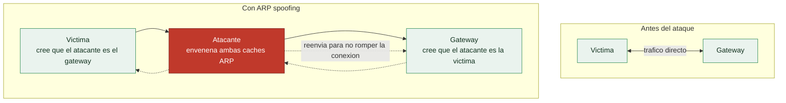

# Clase 039 — Ataques de capa 2: ARP spoofing y VLAN hopping

> Parte: **1 — Redes y seguridad de redes** · Fuente: *IEEE 802.1Q; documentación de ettercap, yersinia, scapy*
> ⏱️ Duración estimada: **120 min** · Nivel: **Avanzado**

---

## 🎯 Objetivo

Explorar los ataques que operan en la capa de enlace (capa 2), donde muchos controles de seguridad de capas superiores no llegan: **ARP spoofing/poisoning**, **MAC flooding**, **STP manipulation** y **VLAN hopping**. El alumno reproducirá estos ataques en laboratorio y aprenderá las contramedidas (DAI, port security, PVLAN).

## 📚 Resultados de aprendizaje

Al finalizar, el alumno podrá:

1. **Explicar** por qué la capa 2 carece de autenticación por diseño.
2. **Ejecutar** ARP spoofing para posicionarse en medio de dos hosts.
3. **Reproducir** MAC flooding y entender su efecto en un switch.
4. **Describir** VLAN hopping por switch spoofing y double tagging.
5. **Detectar** anomalías de capa 2 en capturas.
6. **Aplicar** contramedidas: DAI, port security, deshabilitar DTP, native VLAN dedicada.

## 🗺️ Temas

| # | Tema | Por qué importa |
|---|------|-----------------|
| 1 | ARP y su falta de autenticación | Raíz de muchos ataques L2 |
| 2 | ARP spoofing/poisoning | Base del MitM en LAN |
| 3 | MAC flooding y CAM overflow | Convierte el switch en hub |
| 4 | STP y ataques de topología | Redirigir tráfico |
| 5 | VLAN hopping (switch spoofing, double tag) | Saltar segmentación |
| 6 | Detección de anomalías L2 | Respuesta defensiva |
| 7 | Contramedidas de switch | DAI, port security, PVLAN |

## 🧠 Explicación en profundidad

### Toda la seguridad de arriba descansa sobre una capa 2 que confía en todos

La capa 2 se diseñó para una LAN pequeña donde todos los equipos eran de fiar, y esa
suposición no se corrigió nunca. **ARP**, el protocolo que traduce una IP en la MAC del
equipo que la tiene, no lleva autenticación de ningún tipo: cuando un host pregunta
"¿quién tiene 10.0.0.1?", cualquiera puede responder "yo", y el que pregunta se lo cree
y guarda la respuesta en su caché. Ese es el fallo del que cuelgan casi todos los
ataques de esta clase. Lo importante de entenderlo es que **no es un bug que se pueda
parchear**: es cómo funciona ARP por diseño, así que la defensa no consiste en arreglar
ARP sino en vigilar y contener sus abusos en el switch.

### ARP spoofing: el motor del man-in-the-middle en la LAN

El **ARP spoofing** (o *poisoning*) explota esa credulidad enviando respuestas ARP
falsas para envenenar las cachés de dos víctimas a la vez: al gateway le dices que la MAC
de la víctima eres tú, y a la víctima le dices que la MAC del gateway eres tú. A partir
de ese momento todo el tráfico entre ambos pasa por tu equipo, que lo reenvía para que la
comunicación siga fluyendo y nadie note nada. Eso es un **man-in-the-middle** de capa 2,
y es la base de lo que se estudia en la clase 040: una vez en medio, se puede leer,
modificar o intentar degradar el cifrado del tráfico.



### MAC flooding, STP y VLAN hopping: romper la segmentación desde abajo

El repertorio de capa 2 no acaba en ARP. El **MAC flooding** satura la tabla CAM del
switch —la que asocia cada MAC a un puerto— con miles de direcciones falsas; cuando la
tabla se llena, muchos switches degradan a comportamiento de *hub* y empiezan a difundir
todo por todos los puertos, devolviendo al atacante la visibilidad total que la
conmutación le había quitado. Los ataques sobre **STP** (*Spanning Tree*) consisten en
anunciarse como puente raíz para que la topología se recalcule y el tráfico pase por el
equipo del atacante.

El **VLAN hopping** es el más grave porque rompe la segmentación en la que confían las
capas superiores. Tiene dos formas: el *switch spoofing*, donde el atacante negocia un
enlace *trunk* haciéndose pasar por un switch y con ello gana acceso a todas las VLAN; y
el *double tagging*, que aprovecha cómo algunos switches procesan las etiquetas 802.1Q
para colar una trama con dos etiquetas de modo que la segunda la lleve a una VLAN a la
que el atacante no debería llegar. Si tu diseño de red confía en las VLAN para aislar,
el VLAN hopping es lo que tienes que impedir.

### La defensa vive en el switch

Ninguno de estos ataques se para en el host: se para configurando el switch, y ese es el
mensaje operativo de la clase. **DAI** (*Dynamic ARP Inspection*) valida las respuestas
ARP contra una tabla de asignaciones legítimas y descarta las falsas. **Port security**
limita cuántas MAC se aceptan por puerto y frena el MAC flooding. **BPDU Guard** protege
STP desactivando el puerto si recibe anuncios de topología donde no debería haberlos. Y
contra el VLAN hopping, la regla es desactivar la negociación automática de trunk (DTP),
no usar la VLAN 1 para nada y fijar explícitamente el modo de cada puerto. La
**segmentación** de la clase 042 solo es real si la capa 2 que la sostiene está
endurecida; de lo contrario, es una línea en un diagrama que el atacante atraviesa.

## 📖 Definiciones y características

- **ARP:** protocolo que asocia IP a MAC en una LAN; no tiene autenticación, así que cualquiera puede enviar respuestas falsas.
- **ARP poisoning:** envío de respuestas ARP falsificadas para que las víctimas asocien la IP del gateway con la MAC del atacante, redirigiendo su tráfico.
- **MAC flooding:** inundar la tabla CAM del switch con MAC falsas hasta desbordarla; el switch pasa a difundir todo (fail-open), permitiendo sniffing.
- **VLAN hopping:** técnica para enviar tráfico a una VLAN distinta a la asignada, saltando la segmentación; por switch spoofing (DTP) o double tagging 802.1Q.
- **DAI (Dynamic ARP Inspection):** control de switch que valida los paquetes ARP contra la tabla DHCP snooping y descarta los falsos.
- **Port security:** limita las MAC permitidas por puerto, mitigando el MAC flooding.

## 📔 Glosario

| Término | Definición concisa |
|---------|--------------------|
| ARP | Traduce una IP en la MAC correspondiente; sin autenticación por diseño |
| Caché ARP | Tabla local IP→MAC que el ARP spoofing envenena |
| ARP spoofing / poisoning | Respuestas ARP falsas para interceptar tráfico en la LAN |
| Man-in-the-middle L2 | Interposición del atacante entre dos hosts del mismo segmento |
| Tabla CAM | Tabla del switch que asocia cada MAC a un puerto |
| MAC flooding | Saturar la CAM para degradar el switch a comportamiento de hub |
| STP | *Spanning Tree Protocol*; evita bucles y es manipulable |
| VLAN hopping | Saltar de una VLAN a otra rompiendo la segmentación |
| Switch spoofing | Negociar un trunk haciéndose pasar por switch para ver todas las VLAN |
| Double tagging | Insertar dos etiquetas 802.1Q para alcanzar otra VLAN |
| 802.1Q | Estándar de etiquetado de VLAN |
| DAI | *Dynamic ARP Inspection*; valida las respuestas ARP en el switch |
| Port security | Limita las MAC aceptadas por puerto |
| BPDU Guard | Protege STP desactivando puertos con anuncios indebidos |
| DTP | Protocolo de negociación de trunk; conviene desactivarlo |

## 🧰 Herramientas y preparación

- **ettercap** / **bettercap** para ARP spoofing y MitM.
- **macof** (dsniff) para MAC flooding.
- **yersinia** para ataques a STP/DTP/VLAN.
- **scapy** para construir tramas 802.1Q a medida.
- Laboratorio: varias VMs en un switch virtual; idealmente un switch gestionable (o GNS3/EVE-NG) para practicar VLANs y contramedidas.

> ⚠️ **Nota ética:** los ataques de capa 2 interceptan y pueden interrumpir el tráfico de otros hosts de la LAN. Ejecútalos **solo** en tu laboratorio aislado o con autorización explícita. En una red de producción pueden causar caídas y exponer datos de terceros.

## 🧪 Laboratorio guiado

1. **Habilita el reenvío** en la máquina atacante (para MitM transparente):

   ```bash
   sudo sysctl -w net.ipv4.ip_forward=1
   ```

2. **ARP spoofing** entre víctima y gateway con bettercap:

   ```bash
   sudo bettercap -iface eth0
   # dentro de bettercap:
   set arp.spoof.targets 192.168.56.10
   arp.spoof on
   net.sniff on
   ```

3. **Verifica el envenenamiento** desde la víctima:

   ```bash
   arp -a    # la MAC del gateway ahora es la del atacante
   ```

4. **MAC flooding** en un switch de laboratorio (observa el fail-open):

   ```bash
   sudo macof -i eth0
   ```

   Captura en paralelo para ver tráfico que antes no verías.
5. **VLAN hopping por double tagging** con scapy (esquema):

   ```python
   from scapy.all import *
   pkt = Ether()/Dot1Q(vlan=1)/Dot1Q(vlan=20)/IP(dst="10.20.0.5")/ICMP()
   sendp(pkt, iface="eth0")
   ```

6. **Detección defensiva**: en Wireshark filtra `arp.duplicate-address-detected` y observa múltiples MAC para una misma IP.
7. **Contramedidas** (en el switch): activa DHCP snooping + DAI, `switchport port-security maximum 2`, y deshabilita DTP (`switchport nonegotiate`).

## ✍️ Ejercicios

1. Ejecuta ARP spoofing y demuestra que puedes ver el tráfico HTTP de la víctima (en laboratorio).
2. Observa en Wireshark la firma de un ARP poisoning (respuestas ARP no solicitadas).
3. Reproduce MAC flooding y explica por qué convierte el switch en un hub.
4. Explica paso a paso cómo funciona el double tagging y por qué es unidireccional.
5. Configura port security en un switch de laboratorio y verifica que bloquea macof.
6. Investiga cómo DAI usa la tabla de DHCP snooping para validar ARP.

## 📝 Reto verificable

En tu laboratorio, posiciona la máquina atacante como MitM entre dos VMs mediante ARP spoofing y demuestra la intercepción de una comunicación en claro. Después, aplica una contramedida (DAI en el switch o entradas ARP estáticas en las víctimas) y demuestra que el ataque ya no funciona. Entrega capturas de ambas fases.

**Criterio de aceptación:** en la fase de ataque interceptas tráfico entre las dos VMs; tras la contramedida, la tabla ARP de la víctima ya no se envenena y no capturas su tráfico. Todo en entorno propio.

## ⚠️ Errores comunes

| Síntoma / mensaje | Causa y cómo arreglar |
|-------------------|-----------------------|
| La víctima pierde conectividad durante el MitM | No activaste `ip_forward`; habilítalo para reenviar el tráfico interceptado |
| ARP spoof no envenena | Firewall de host o entradas ARP estáticas; verifica y ajusta el objetivo |
| macof no tiene efecto | El switch tiene port security o es virtual con límites; prueba en un entorno adecuado |
| Double tagging no llega | El puerto no está en la native VLAN esperada; requiere condiciones específicas de trunk |
| No ves tráfico tras el MitM | Estás en HTTPS; solo verás metadatos, no el contenido (el cifrado protege la carga) |

## ❓ Preguntas frecuentes

**❓ ¿Por qué la capa 2 es tan vulnerable?**
Porque ARP y muchos protocolos de switching se diseñaron sin autenticación, confiando en la red local. La seguridad se añade con controles del switch (DAI, port security, 802.1X).

**❓ ¿El MitM por ARP me deja leer HTTPS?**
No el contenido. Verás metadatos (IPs, SNI en algunos casos), pero el cifrado TLS protege los datos salvo que consigas que la víctima acepte un certificado falso (otra clase).

**❓ ¿VLAN hopping funciona en cualquier switch?**
No. El switch spoofing requiere DTP activo; el double tagging requiere condiciones concretas de native VLAN. Configuraciones endurecidas lo impiden.

**❓ ¿Cuál es la defensa más efectiva contra ARP spoofing?**
Dynamic ARP Inspection junto con DHCP snooping en switches gestionados; en hosts críticos, entradas ARP estáticas.

## 🔗 Referencias

- IEEE 802.1Q (VLAN tagging). <https://standards.ieee.org/ieee/802.1Q/>
- bettercap documentation. <https://www.bettercap.org/>
- Cisco — Layer 2 security best practices. <https://www.cisco.com/>
- MITRE ATT&CK — Adversary-in-the-Middle: ARP Cache Poisoning (T1557.002). <https://attack.mitre.org/techniques/T1557/002/>

## 📥 Material descargable

- 📄 [Guía en PDF](./clase-039-guia.pdf) — versión imprimible de esta clase.
- 🎞️ [Presentación (PPTX)](./clase-039-presentacion.pptx) — deck para proyectar en clase.

## ⬅️ Clase anterior

[Clase 038 — Seguridad WiFi: WPA2, WPA3 y superficie de ataque](../038-seguridad-wifi-wpa2-wpa3-y-superficie-de-ataque/README.md)

## ➡️ Siguiente clase

[Clase 040 — Man-in-the-Middle: técnicas y defensa](../040-man-in-the-middle-tecnicas-y-defensa/README.md)
