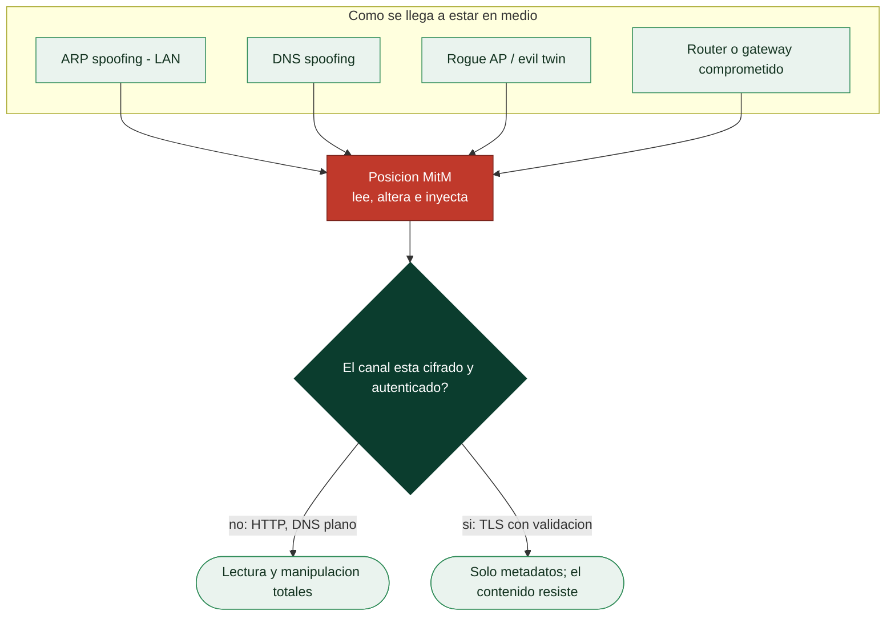

# Clase 040 — Man-in-the-Middle: técnicas y defensa

> Parte: **1 — Redes y seguridad de redes** · Fuente: *OWASP; documentación de bettercap y mitmproxy*
> ⏱️ Duración estimada: **130 min** · Nivel: **Avanzado**

---

## 🎯 Objetivo

Integrar lo aprendido en un ataque **Man-in-the-Middle** completo: posicionamiento (ARP/DNS spoofing, rogue gateway), interceptación de tráfico, intentos de degradación de TLS y, sobre todo, las **defensas** que lo derrotan (HSTS, certificate pinning, cifrado extremo a extremo, DAI). El énfasis es entender el ataque para saber defender.

## 📚 Resultados de aprendizaje

Al finalizar, el alumno podrá:

1. **Describir** las fases de un ataque MitM y sus puntos de posicionamiento.
2. **Interceptar** y modificar tráfico HTTP con un proxy transparente en laboratorio.
3. **Explicar** por qué TLS bien implementado frustra el MitM y qué es SSL stripping.
4. **Reconocer** los indicadores de un MitM en curso.
5. **Aplicar** defensas: HSTS, HPKP/pinning, DNSSEC, DAI, VPN.
6. **Evaluar** el riesgo residual en redes no confiables (WiFi público).

## 🗺️ Temas

| # | Tema | Por qué importa |
|---|------|-----------------|
| 1 | Anatomía del MitM | Marco mental del ataque |
| 2 | Posicionamiento (ARP, DNS, rogue AP) | Cómo se interpone el atacante |
| 3 | Interceptación con proxy transparente | Ver y modificar el tráfico |
| 4 | SSL stripping y su mitigación | El punto débil histórico |
| 5 | HSTS, pinning, E2E | Defensas efectivas |
| 6 | Indicadores y detección | Reconocer un MitM |
| 7 | Redes no confiables | Riesgo real cotidiano |

## 🧠 Explicación en profundidad

### El MitM es una posición, no una herramienta

*Man-in-the-middle* nombra una **posición**: estar en medio de dos partes que creen
hablar directamente entre sí, pudiendo leer y modificar lo que se dicen. Cómo se llega a
esa posición varía —ARP spoofing en la LAN (clase 039), un servidor DNS que responde
mentiras (clase 041), un punto de acceso falso (clase 038), un router comprometido— pero
una vez en medio, las capacidades son las mismas: interceptar, alterar e inyectar. Separar
la *posición* de la *técnica de posicionamiento* es lo que permite razonar sobre defensas,
porque cada vía de acceso se cierra distinto pero todas desembocan en el mismo riesgo.



### SSL stripping y por qué HTTPS por sí solo no bastaba

El ataque que hizo famoso al MitM moderno es el **SSL stripping**. La idea es sencilla y
demoledora: muchos usuarios escriben `banco.com` sin `https://`, lo que genera una
primera petición en HTTP plano. El atacante en medio intercepta esa petición, habla
HTTPS con el banco por un lado y **HTTP en claro con la víctima** por el otro,
degradando la conexión sin que el usuario lo note más que por la ausencia del candado
—que casi nadie mira—. El cifrado del servidor seguía intacto; el ataque no lo rompía,
lo **evitaba** aprovechando ese primer salto sin proteger.

La respuesta fue una cadena de defensas que conviene conocer como sistema. **HSTS**
(*HTTP Strict Transport Security*) es una cabecera con la que el servidor ordena al
navegador "a partir de ahora, conéctate a mí solo por HTTPS, nunca en claro"; con
**HSTS preload**, esa regla viene de fábrica en el navegador y ni siquiera la primera
petición viaja en HTTP. El **certificate pinning** hace que una aplicación acepte solo un
certificado o una CA concretos, cerrando el MitM que usa un certificado fraudulento pero
técnicamente válido. Y el cifrado **extremo a extremo** de las aplicaciones de mensajería
saca la confidencialidad del canal y la lleva a los extremos, de modo que ni un
intermediario en la red ni el propio servidor pueden leer el contenido.

### Lo que el MitM ve hoy, y cómo se detecta

Con TLS bien implementado —validando el certificado y con HSTS— un atacante en medio ya
**no lee el contenido**: le quedan los metadatos (con quién hablas, cuándo, cuánto), que
no son inocuos pero no son el mensaje. El eslabón débil se desplaza entonces al usuario:
las advertencias de certificado que se aceptan sin leer son la puerta que reabre el
ataque, y por eso un MitM con certificado propio solo funciona si la víctima ignora el
aviso o si el atacante logró instalar su CA en el dispositivo.

Del lado defensivo, un MitM en la LAN deja señales: entradas ARP que cambian, dos IP con
la misma MAC, avisos de certificado inesperados, o tráfico que toma rutas que no debería.
Herramientas de vigilancia de ARP y el propio NSM de la clase 043 detectan esos patrones.
Y la lección práctica de más valor es de higiene: en una red que no controlas —una WiFi
pública— hay que asumir que puede haber alguien en medio, y confiar en el cifrado
extremo a extremo y en una VPN antes que en la buena fe del punto de acceso.

## 📖 Definiciones y características

- **MitM:** el atacante se sitúa entre dos partes, retransmitiendo (y opcionalmente alterando) su comunicación sin que lo noten.
- **SSL stripping:** degradación de HTTPS a HTTP interceptando la conexión inicial; se mitiga con HSTS.
- **HSTS (HTTP Strict Transport Security):** cabecera que obliga al navegador a usar solo HTTPS para un dominio, evitando el stripping.
- **Certificate pinning:** la aplicación acepta solo un certificado/clave concretos, de modo que un certificado falso del atacante es rechazado.
- **Rogue gateway / evil twin:** puerta de enlace o AP falso que canaliza el tráfico de la víctima por el atacante.
- **DNSSEC:** firma las respuestas DNS para evitar su falsificación (se amplía en la clase 041).

## 📔 Glosario

| Término | Definición concisa |
|---------|--------------------|
| Man-in-the-middle | Posición entre dos partes que permite leer, alterar e inyectar |
| Posicionamiento | Técnica para llegar a estar en medio (ARP, DNS, rogue AP…) |
| Proxy transparente | Intermediario que intercepta sin que el cliente lo configure |
| SSL stripping | Degradar HTTPS a HTTP aprovechando la primera petición en claro |
| HSTS | Cabecera que fuerza al navegador a usar solo HTTPS con ese sitio |
| HSTS preload | Lista integrada en el navegador; protege incluso la primera visita |
| Certificate pinning | Aceptar solo un certificado o CA concretos |
| Cifrado extremo a extremo | Confidencialidad entre los extremos; ni la red ni el servidor leen |
| Advertencia de certificado | Aviso del navegador que, ignorado, reabre el MitM |
| CA maliciosa | Autoridad instalada en el dispositivo que legitima certificados falsos |
| Metadatos | Con quién, cuándo y cuánto; visibles aun con TLS |
| Downgrade | Forzar un protocolo o cifrado más débil |

## 🧰 Herramientas y preparación

- **bettercap** (framework MitM), **mitmproxy** (proxy HTTP/HTTPS interactivo), **sslstrip** (histórico).
- Wireshark para verificar el cifrado.
- Laboratorio con víctima, atacante y un servidor web propio (uno con HSTS, otro sin) para comparar.

> ⚠️ **Nota ética:** el MitM intercepta comunicaciones de terceros; hacerlo sin autorización es un delito grave. Practica **solo** contra tus propias máquinas y servicios en un laboratorio aislado. El objetivo formativo es defensivo: entender el ataque para neutralizarlo.

## 🧪 Laboratorio guiado

1. **Posiciónate** como MitM por ARP spoofing (repaso de la clase 039) con bettercap y activa el sniffing.
2. **Intercepta HTTP** con mitmproxy en modo transparente:

   ```bash
   sudo sysctl -w net.ipv4.ip_forward=1
   sudo iptables -t nat -A PREROUTING -i eth0 -p tcp --dport 80 -j REDIRECT --to-port 8080
   mitmproxy --mode transparent --listen-port 8080
   ```

   Navega desde la víctima a tu servidor HTTP de laboratorio y observa/modifica las peticiones.
3. **Prueba SSL stripping** contra el servidor **sin** HSTS y observa que la conexión cae a HTTP.
4. **Repite contra el servidor con HSTS** y comprueba que el navegador **rechaza** el downgrade: el ataque falla.
5. **Verifica el cifrado**: en Wireshark, confirma que el tráfico HTTPS con TLS bien configurado es opaco para el atacante.
6. **Certificado falso**: intenta un MitM sobre HTTPS presentando un certificado no confiable y observa la advertencia del navegador (defensa por la cadena de confianza).
7. **Defensa de red**: activa DAI/ARP estático (clase 039) y demuestra que ya no puedes posicionarte.

## ✍️ Ejercicios

1. Intercepta y modifica una respuesta HTTP (p. ej. cambia un texto de la página) con mitmproxy en laboratorio.
2. Compara el resultado del stripping en un sitio con HSTS y otro sin él.
3. Explica por qué el pinning protege a una app móvil aun con un certificado "válido" del atacante.
4. Identifica en una captura los indicadores de un MitM (cambios de MAC del gateway, certificados anómalos).
5. Configura HSTS con `preload` en tu servidor y verifica la cabecera con `curl -I`.
6. Argumenta cómo una VPN (clase 036) reduce el riesgo de MitM en WiFi público.

## 📝 Reto verificable

Monta en laboratorio un escenario MitM contra dos versiones de tu propio sitio: una vulnerable (HTTP/sin HSTS) y otra endurecida (HTTPS + HSTS). Demuestra que puedes interceptar/modificar la primera y que la segunda resiste el ataque. Entrega capturas, la configuración de HSTS y una conclusión sobre qué defensa fue decisiva.

**Criterio de aceptación:** evidencias claras de intercepción exitosa en la versión vulnerable y de fallo del ataque en la endurecida, con explicación correcta del mecanismo defensivo (HSTS impide el downgrade; TLS válido impide leer el contenido).

## ⚠️ Errores comunes

| Síntoma / mensaje | Causa y cómo arreglar |
|-------------------|-----------------------|
| mitmproxy no ve tráfico | Falta el REDIRECT de iptables o `ip_forward`; revisa NAT y reenvío |
| El navegador muestra advertencia de certificado | Es la defensa funcionando; sin la CA del atacante instalada, TLS rechaza el MitM |
| SSL stripping no funciona | El sitio usa HSTS/preload; ese es precisamente el resultado esperado |
| La víctima pierde conexión | Reenvío mal configurado; verifica que retransmites el tráfico interceptado |
| No puedes modificar HTTPS | El cifrado lo impide sin un certificado de confianza; no es un fallo, es seguridad |

## ❓ Preguntas frecuentes

**❓ ¿HTTPS elimina el riesgo de MitM?**
Lo reduce enormemente si está bien implementado (certificados válidos, HSTS, TLS moderno). El riesgo residual viene de usuarios que ignoran advertencias o de CAs comprometidas; el pinning cubre esos casos.

**❓ ¿Qué es exactamente SSL stripping?**
Un ataque que impide que la víctima llegue a establecer HTTPS, manteniéndola en HTTP con el atacante en medio. HSTS lo neutraliza porque el navegador exige HTTPS de antemano.

**❓ ¿Cómo detecto que soy víctima de un MitM?**
Advertencias de certificado inesperadas, cambios en la MAC del gateway, degradación a HTTP en sitios que deberían ser HTTPS, o certificados emitidos por CAs raras.

**❓ ¿La mejor defensa personal en WiFi público?**
Usar siempre HTTPS/HSTS, una VPN de confianza y evitar aceptar certificados o instalar CAs que te pidan redes desconocidas.

## 🔗 Referencias

- OWASP — Man-in-the-Middle Attack. <https://owasp.org/www-community/attacks/Manipulator-in-the-middle_attack>
- mitmproxy documentation. <https://docs.mitmproxy.org/>
- RFC 6797 — HTTP Strict Transport Security (HSTS). <https://www.rfc-editor.org/rfc/rfc6797>
- MITRE ATT&CK — Adversary-in-the-Middle (T1557). <https://attack.mitre.org/techniques/T1557/>

## 📥 Material descargable

- 📄 [Guía en PDF](./clase-040-guia.pdf) — versión imprimible de esta clase.
- 🎞️ [Presentación (PPTX)](./clase-040-presentacion.pptx) — deck para proyectar en clase.

## ⬅️ Clase anterior

[Clase 039 — Ataques de capa 2: ARP spoofing y VLAN hopping](../039-ataques-de-capa-2-arp-spoofing-y-vlan-hopping/README.md)

## ➡️ Siguiente clase

[Clase 041 — Seguridad de DNS: envenenamiento, DNSSEC y tunneling](../041-seguridad-de-dns-envenenamiento-dnssec-y-tunneling/README.md)
