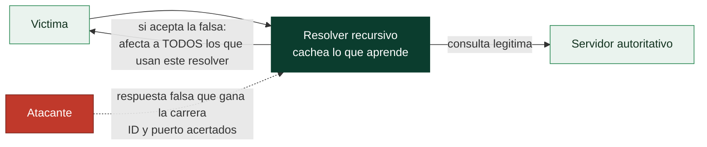

# Clase 041 — Seguridad de DNS: envenenamiento, DNSSEC y tunneling

> Parte: **1 — Redes y seguridad de redes** · Fuente: *RFC 1034/1035, RFC 4033 (DNSSEC); docs de BIND y iodine*
> ⏱️ Duración estimada: **120 min** · Nivel: **Avanzado**

---

## 🎯 Objetivo

Estudiar la seguridad del DNS: cómo se falsifican respuestas (cache poisoning, spoofing), cómo **DNSSEC** garantiza integridad y autenticidad, y cómo el DNS se abusa como canal encubierto (**tunneling** y exfiltración). El alumno aprenderá a detectar y mitigar estos abusos.

## 📚 Resultados de aprendizaje

Al finalizar, el alumno podrá:

1. **Explicar** la resolución DNS y sus puntos de confianza.
2. **Describir** el cache poisoning y el ataque de Kaminsky.
3. **Configurar** y validar DNSSEC en un resolver.
4. **Reconocer** DNS tunneling y exfiltración por DNS.
5. **Detectar** tráfico DNS anómalo (entropía, longitud, frecuencia).
6. **Aplicar** defensas: DNSSEC, DoT/DoH, filtrado y monitoreo.

## 🗺️ Temas

| # | Tema | Por qué importa |
|---|------|-----------------|
| 1 | Resolución DNS y jerarquía | Dónde está la confianza |
| 2 | Spoofing y cache poisoning | Redirigir víctimas |
| 3 | Ataque de Kaminsky | Clásico que motivó DNSSEC |
| 4 | DNSSEC (RRSIG, DNSKEY, DS) | Integridad y autenticidad |
| 5 | DNS tunneling y exfiltración | Canal encubierto de C2 |
| 6 | DoT / DoH | Confidencialidad del DNS |
| 7 | Detección y filtrado | Defensa práctica |

## 🧠 Explicación en profundidad

### El directorio del que todo depende y en el que nadie pensó proteger

El DNS traduce nombres en direcciones, y esa función tan modesta lo convierte en el
punto de confianza del que cuelga toda la navegación: quien controla la respuesta DNS
decide a qué servidor te conectas realmente, por muy bien que escribas el nombre. El
problema de origen es que el DNS clásico viaja sobre **UDP sin autenticación**, así que
el resolver acepta la primera respuesta que encaje con su pregunta sin comprobar quién la
envía. Entender la jerarquía —raíz, TLD, servidor autoritativo del dominio, y el resolver
recursivo que hace las preguntas por ti y **cachea** lo que aprende— es lo que permite
ubicar dónde se puede mentir y con qué consecuencia.

### Cache poisoning y el ataque de Kaminsky

El **cache poisoning** consiste en colar una respuesta falsa en la caché de un resolver
recursivo. Si el atacante lo consigue, no envenena a una víctima sino a **todos** los que
usan ese resolver, y la mentira persiste hasta que caduca el TTL. El clásico que lo
cambió todo es el **ataque de Kaminsky** (2008): en lugar de pelear por adivinar el ID de
una única consulta, Kaminsky mostró cómo forzar al resolver a preguntar por muchos
subdominios inexistentes y adjuntar en la respuesta falsa un registro que reasigna el
servidor autoritativo del dominio entero, multiplicando las oportunidades de acertar. La
mitigación de urgencia fue la **aleatorización del puerto de origen**, que amplió el
espacio a adivinar; la solución de fondo llegó con DNSSEC.



### DNSSEC firma; DoT y DoH cifran; y no es lo mismo

Aquí hay una distinción que se confunde constantemente y conviene fijar. **DNSSEC**
aporta **integridad y autenticidad**: firma criptográficamente los registros (con las
claves `DNSKEY`, las firmas `RRSIG` y la cadena de confianza que baja desde la raíz por
los registros `DS`), de modo que el resolver puede verificar que la respuesta es la que
publicó el dueño del dominio y no ha sido alterada. Lo que DNSSEC **no** hace es cifrar:
un observador sigue viendo qué dominios consultas. **DoT** (DNS over TLS) y **DoH** (DNS
over HTTPS) hacen exactamente lo contrario: aportan **confidencialidad** cifrando el
canal hacia el resolver, pero no garantizan por sí solos que el resolver te diga la
verdad. Son defensas complementarias contra amenazas distintas: DNSSEC contra la
manipulación, DoT/DoH contra la vigilancia. DoH además viaja sobre el 443 mezclado con el
resto del HTTPS, lo que dificulta filtrarlo —una ventaja para la privacidad del usuario y
un dolor de cabeza para el defensor que quería inspeccionar el DNS—.

### El DNS como canal encubierto

La misma ubicuidad que hace crítico al DNS lo convierte en un canal de fuga ideal. El
**DNS tunneling** codifica datos dentro de los nombres consultados: el cliente pide
`ZXhmaWx0cmFjaW9u.atacante.com` y el servidor autoritativo del atacante, que recibe esa
consulta, decodifica el subdominio y responde con más datos en un registro TXT. Como casi
ninguna red bloquea el DNS saliente —romperlo rompe todo—, este canal atraviesa firewalls
que paran cualquier otra cosa, y por eso el malware lo usa para *command and control* y
para exfiltrar despacio y sin ruido.

Detectarlo es un ejercicio de análisis de metadatos que anticipa las tres clases
siguientes: nombres anormalmente largos o de alta entropía, un volumen desproporcionado
de consultas TXT o NULL, muchos subdominios distintos bajo un mismo dominio, y consultas
a dominios recién registrados. La defensa práctica combina forzar todo el DNS a través de
resolvers controlados que registren cada consulta, aplicar listas de reputación de
dominios, y alertar sobre esos patrones estadísticos —justo el tipo de detección por
metadatos que se sistematiza en NSM, Zeek y NetFlow—.

## 📖 Definiciones y características

- **Cache poisoning:** inyección de registros falsos en la caché de un resolver para que devuelva IPs controladas por el atacante.
- **Ataque de Kaminsky:** técnica que explotaba la baja entropía del ID de transacción y del puerto para envenenar cachés rápidamente; motivó la aleatorización de puerto de origen y DNSSEC.
- **DNSSEC:** extensiones que firman criptográficamente los registros (RRSIG) con claves (DNSKEY) encadenadas por registros DS hasta la raíz; garantiza integridad y autenticidad, no confidencialidad.
- **DNS tunneling:** encapsulación de datos arbitrarios en consultas/respuestas DNS para crear un canal (exfiltración o C2) que atraviesa firewalls que permiten DNS.
- **DoT / DoH:** DNS sobre TLS / sobre HTTPS; cifran la consulta para proteger la privacidad frente a observadores en la red.

## 📔 Glosario

| Término | Definición concisa |
|---------|--------------------|
| Resolver recursivo | Servidor que resuelve consultas por el cliente y cachea el resultado |
| Servidor autoritativo | El que tiene la verdad de una zona DNS |
| TTL | Tiempo que una respuesta permanece en caché |
| Cache poisoning | Inyectar una respuesta falsa en la caché de un resolver |
| Ataque de Kaminsky | Técnica que multiplicó las opciones de envenenar una caché |
| Aleatorización de puerto | Mitigación que amplió el espacio a adivinar del atacante |
| DNSSEC | Firma de registros: aporta integridad y autenticidad, no confidencialidad |
| DNSKEY / RRSIG / DS | Clave, firma y enlace de confianza de DNSSEC |
| DoT | DNS over TLS; cifra el canal (confidencialidad) |
| DoH | DNS over HTTPS; cifra y se mezcla con el tráfico web del 443 |
| DNS tunneling | Codificar datos en los nombres para crear un canal encubierto |
| Exfiltración por DNS | Sacar datos usando consultas DNS que casi nadie bloquea |
| Entropía del nombre | Aleatoriedad de un subdominio; indicio de tunneling |
| Dominio recién registrado | Señal frecuente de infraestructura maliciosa |

## 🧰 Herramientas y preparación

- **dig** / **delv** para consultas y validación DNSSEC.
- **BIND9** o **unbound** como resolver de laboratorio.
- **iodine** o **dnscat2** para practicar tunneling (en laboratorio).
- Zeek/Suricata (clases 035/044) para detección.

> ⚠️ **Nota ética:** el cache poisoning y el DNS tunneling son técnicas ofensivas (redirección de víctimas, canales de C2, exfiltración). Practícalas **solo** en tu laboratorio aislado. Usarlas contra infraestructura ajena es ilegal y puede facilitar fraude y robo de datos.

## 🧪 Laboratorio guiado

1. **Observa una resolución** completa y sus servidores:

   ```bash
   dig +trace example.com
   ```

2. **Valida DNSSEC** de un dominio firmado:

   ```bash
   dig +dnssec example.com
   delv example.com          # muestra "fully validated" si la cadena es correcta
   ```

3. **Configura un resolver validante** (unbound) con `auto-trust-anchor-file` apuntando a la raíz y verifica que rechaza respuestas manipuladas.
4. **Simula spoofing** en laboratorio: con dos resolvers (uno sin DNSSEC y otro con validación), inyecta una respuesta falsa y compara: el validante la descarta.
5. **DNS tunneling con iodine** (esquema, en tu laboratorio): levanta el servidor `iodined` en un dominio de pruebas y conecta el cliente `iodine`; observa el túnel encapsulado en consultas.
6. **Detección**: captura tráfico DNS y busca indicadores de tunneling:

   ```bash
   tshark -r dns.pcapng -Y 'dns.qry.name' -T fields -e dns.qry.name | awk '{ print length, $0 }' | sort -rn | head
   ```

   Nombres largos, alta entropía y muchas consultas TXT/NULL son sospechosos.

## ✍️ Ejercicios

1. Usa `dig +dnssec` sobre un dominio firmado y uno sin firmar; identifica los registros RRSIG.
2. Explica por qué DNSSEC no cifra las consultas y qué protocolo sí lo hace (DoT/DoH).
3. Describe paso a paso el ataque de Kaminsky y las dos mitigaciones que lo frenaron.
4. En una captura, calcula la longitud media de los nombres consultados y detecta un posible túnel.
5. Configura DoH en un navegador y verifica con Wireshark que las consultas ya no van en claro.
6. Investiga cómo Zeek registra las consultas DNS (`dns.log`) y qué campos ayudan a detectar tunneling.

## 📝 Reto verificable

Monta un resolver con validación DNSSEC y demuestra que rechaza una respuesta falsificada que un resolver sin validación aceptaría (usa dos dominios/servidores de laboratorio). Adicionalmente, genera tráfico de DNS tunneling en tu laboratorio y entrega un método reproducible (comando/consulta) que lo detecte por longitud o entropía de los nombres.

**Criterio de aceptación:** el resolver validante marca la respuesta manipulada como bogus mientras el no validante la acepta; y tu método de detección señala correctamente el tráfico de túnel frente al DNS legítimo.

## ⚠️ Errores comunes

| Síntoma / mensaje | Causa y cómo arreglar |
|-------------------|-----------------------|
| `dig +dnssec` no muestra RRSIG | El dominio no está firmado o el resolver no reenvía DNSSEC; usa uno que lo soporte |
| `delv` devuelve "insecure" | El dominio no tiene cadena de confianza; es esperado en dominios sin firmar |
| DNSSEC "bogus" en dominios legítimos | Trust anchor desactualizado o reloj desincronizado; actualiza el ancla y sincroniza NTP |
| iodine no levanta el túnel | Registros NS/A del dominio de delegación mal configurados; revisa la delegación |
| No detectas el tunneling | Solo miras el tamaño; combina longitud, entropía, tipo de registro y frecuencia |

## ❓ Preguntas frecuentes

**❓ ¿DNSSEC cifra mis consultas DNS?**
No. DNSSEC garantiza **integridad y autenticidad** (que la respuesta no fue alterada y proviene de quien dice), pero las consultas siguen viajando en claro. Para confidencialidad usa DoT o DoH.

**❓ ¿Por qué el DNS es un buen canal de exfiltración?**
Porque casi todas las redes permiten DNS saliente y pocas lo inspeccionan a fondo. Codificando datos en subdominios se crea un canal que atraviesa muchos firewalls.

**❓ ¿DoH mejora o empeora la seguridad?**
Mejora la privacidad frente a observadores, pero dificulta el filtrado y monitoreo corporativo del DNS. Es un equilibrio: bueno para el usuario, reto para el defensor.

**❓ ¿Cómo detecto DNS tunneling sin DNSSEC ni DoH?**
Analizando patrones: nombres muy largos, alta aleatoriedad (entropía), tipos de registro inusuales (TXT/NULL) y volumen anómalo de consultas a un mismo dominio.

## 🔗 Referencias

- RFC 4033 — DNS Security Introduction and Requirements (DNSSEC). <https://www.rfc-editor.org/rfc/rfc4033>
- RFC 1035 — Domain Names, Implementation and Specification. <https://www.rfc-editor.org/rfc/rfc1035>
- DNS Flag Day / DNSSEC. <https://dnssec-analyzer.verisignlabs.com/>
- SANS — Detecting DNS Tunneling. <https://www.sans.org/white-papers/>

## 📥 Material descargable

- 📄 [Guía en PDF](./clase-041-guia.pdf) — versión imprimible de esta clase.
- 🎞️ [Presentación (PPTX)](./clase-041-presentacion.pptx) — deck para proyectar en clase.

## ⬅️ Clase anterior

[Clase 040 — Man-in-the-Middle: técnicas y defensa](../040-man-in-the-middle-tecnicas-y-defensa/README.md)

## ➡️ Siguiente clase

[Clase 042 — Segmentación de red y arquitectura Zero Trust](../042-segmentacion-de-red-y-arquitectura-zero-trust/README.md)
