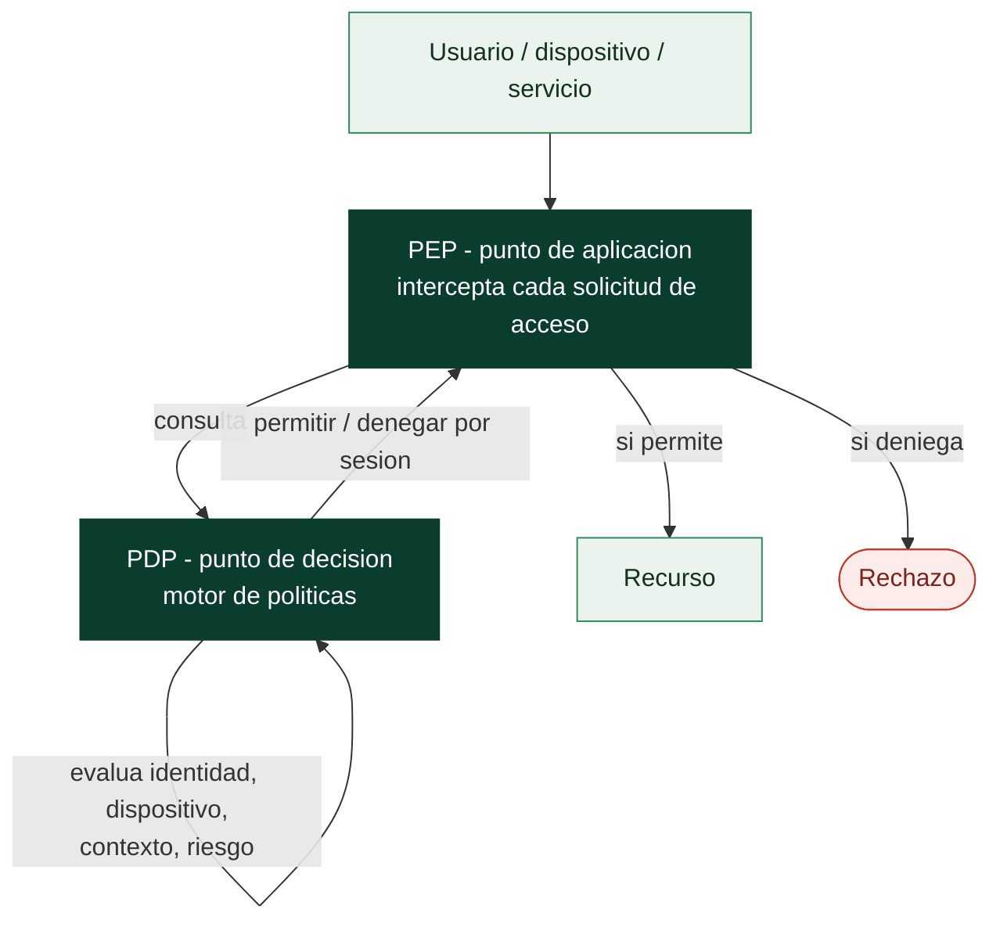

# Clase 042 — Segmentación de red y arquitectura Zero Trust

> Parte: **1 — Redes y seguridad de redes** · Fuente: *NIST SP 800-207 Zero Trust Architecture*
> ⏱️ Duración estimada: **120 min** · Nivel: **Avanzado**

---

## 🎯 Objetivo

Diseñar redes que limiten el movimiento lateral de un atacante mediante **segmentación** (VLANs, subredes, microsegmentación) y adoptar los principios de **Zero Trust**: "nunca confíes, siempre verifica". El alumno aprenderá a modelar zonas, definir políticas de acceso y evaluar una arquitectura frente a NIST SP 800-207.

## 📚 Resultados de aprendizaje

Al finalizar, el alumno podrá:

1. **Explicar** por qué la seguridad perimetral clásica es insuficiente.
2. **Diseñar** una segmentación por zonas de confianza y sensibilidad.
3. **Definir** políticas de acceso de mínimo privilegio entre segmentos.
4. **Describir** los componentes de Zero Trust (PEP, PDP, política).
5. **Aplicar** microsegmentación conceptual a un caso.
6. **Evaluar** una arquitectura frente a los principios de NIST SP 800-207.

## 🗺️ Temas

| # | Tema | Por qué importa |
|---|------|-----------------|
| 1 | Límites del modelo perímetro | Justifica Zero Trust |
| 2 | Segmentación: VLAN, subred, DMZ | Contener el movimiento lateral |
| 3 | Microsegmentación | Granularidad por carga de trabajo |
| 4 | Principios Zero Trust (NIST 800-207) | Marco de referencia |
| 5 | PEP / PDP / motor de políticas | Cómo se decide el acceso |
| 6 | Identidad como nuevo perímetro | Verificación continua |
| 7 | Diseño y evaluación de políticas | Llevarlo a la práctica |

## 🧠 Explicación en profundidad

### Por qué el castillo con foso dejó de funcionar

El modelo clásico de seguridad de red es el del **perímetro**: un muro fuerte —el
firewall— separa el "dentro" de confianza del "fuera" hostil. Su defecto es fatal y hoy
evidente: una vez que el atacante cruza el muro (con un phishing, una VPN robada, un
portátil comprometido), **la red interna le trata como a uno de los suyos** y puede
moverse lateralmente con poca resistencia. El teletrabajo, la nube y los dispositivos
móviles disolvieron además la propia idea de "dentro": ya no hay un borde único que
defender. La segmentación y el zero trust son las dos respuestas, complementarias, a ese
colapso.

### Segmentar es poner muros interiores

**Segmentar** consiste en dividir la red en zonas y controlar el tráfico **entre** ellas,
de modo que comprometer un equipo no dé acceso a toda la organización. Hay una gradación
de granularidad. Las **VLAN** y las **subredes** separan por grandes bloques
—servidores, usuarios, invitados, OT—. La **DMZ** es la zona intermedia donde viven los
servicios expuestos a Internet, aislada tanto de fuera como de la red interna, para que
comprometer el servidor web público no abra la puerta a las bases de datos. Y la
**microsegmentación** lleva la idea al extremo: políticas por carga de trabajo individual,
de forma que ni siquiera dos servidores de la misma VLAN se hablan si no hay una regla que
lo permita. El objetivo de todo ello es un solo verbo: **contener** el movimiento lateral,
convertir una brecha en un incidente acotado en vez de en un desastre.

### Zero Trust: no hay dentro

El **zero trust** (formalizado en **NIST SP 800-207**) parte de un principio incómodo y
liberador: **eliminar la confianza implícita basada en la ubicación de red**. Estar
"dentro" ya no concede nada; cada solicitud de acceso se verifica por sí misma según la
identidad probada, el estado del dispositivo, el contexto y el riesgo, y se concede el
**mínimo privilegio** para esa sesión y no más. Su arquitectura tiene tres piezas que
conviene nombrar con precisión: el **PEP** (*Policy Enforcement Point*) intercepta cada
acceso, el **PDP** (*Policy Decision Point*) es el motor que decide, y entre ambos aplican
la política. La consecuencia es que **la identidad se convierte en el nuevo perímetro**:
la pregunta deja de ser "¿desde dónde te conectas?" y pasa a ser "¿quién eres, con qué
dispositivo, y deberías poder hacer esto ahora?".

### Las dos ideas se necesitan

Segmentación y zero trust no compiten: se apoyan. La microsegmentación es, de hecho, uno
de los mecanismos con los que se implementa el zero trust a nivel de red, y el zero trust
da la lógica de decisión —basada en identidad y contexto— que dota de sentido a esos
muros interiores. Ambos son la materialización, a escala de arquitectura, de dos
principios que vienen de la clase 001: **defensa en profundidad** (varios controles en
capas, asumiendo que alguno fallará) y **mínimo privilegio** (cada quien accede solo a lo
que necesita). Y ambos exigen algo que no es tecnología: saber qué activos tienes, qué
flujos son legítimos y qué política quieres aplicar —sin ese inventario, cualquier
segmentación es adivinación—. Es también donde esta parte entronca con el monitoreo: no
se puede aplicar una política sobre flujos que no ves, y por eso las clases 043 a 045
enseñan a verlos.

## 📖 Definiciones y características

- **Segmentación de red:** división de la red en zonas aisladas con controles entre ellas, para que comprometer una no dé acceso a las demás.
- **DMZ:** zona intermedia que aloja servicios expuestos a Internet, separada de la red interna.
- **Microsegmentación:** segmentación fina, a nivel de carga de trabajo o aplicación, normalmente aplicada por políticas en el host o en el hipervisor.
- **Zero Trust:** modelo donde no se confía en ningún actor por su ubicación en la red; cada acceso se autentica, autoriza y cifra, verificándose continuamente.
- **PEP (Policy Enforcement Point):** componente que aplica la decisión de acceso (permite/deniega el flujo).
- **PDP (Policy Decision Point):** componente que decide, según políticas, identidad, dispositivo y contexto, si se concede el acceso.

## 📔 Glosario

| Término | Definición concisa |
|---------|--------------------|
| Perímetro | Modelo que confía en todo lo que está "dentro" del firewall |
| Movimiento lateral | Avance del atacante entre equipos internos tras la brecha |
| Segmentación | Dividir la red en zonas y controlar el tráfico entre ellas |
| VLAN / subred | Separación de la red en grandes bloques lógicos |
| DMZ | Zona aislada para los servicios expuestos a Internet |
| Microsegmentación | Políticas por carga de trabajo individual |
| Contención | Limitar el alcance de una brecha a una zona |
| Zero Trust | Modelo que elimina la confianza implícita por ubicación de red |
| NIST SP 800-207 | Documento de referencia de la arquitectura zero trust |
| PEP | *Policy Enforcement Point*: aplica la decisión en cada acceso |
| PDP | *Policy Decision Point*: motor que decide permitir o denegar |
| Mínimo privilegio | Conceder solo el acceso necesario para cada sesión |
| Identidad como perímetro | La verificación se centra en quién y con qué, no en dónde |
| Tráfico este-oeste | Comunicación entre hosts internos; objeto de la microsegmentación |

## 🧰 Herramientas y preparación

- Herramienta de diagramado (draw.io, Excalidraw) para modelar la arquitectura.
- Laboratorio de red (GNS3/EVE-NG o VMs con múltiples redes) para implementar VLANs y ACLs.
- Firewalls de host (nftables, clase 034) para simular microsegmentación.
- Documento NIST SP 800-207 como referencia.

## 🧪 Laboratorio guiado (ejercicio de diseño aplicado)

1. **Inventaria activos** de una organización ficticia: servidores web, base de datos, estaciones de trabajo, servidores de gestión, IoT/impresoras, servicios expuestos.
2. **Clasifica por sensibilidad** y agrupa en zonas: DMZ (web), zona de aplicaciones, zona de datos, zona de administración, zona de usuarios, zona de dispositivos no confiables.
3. **Dibuja el diagrama** con las zonas y los puntos de control (firewalls) entre ellas.
4. **Define la matriz de flujos permitidos** (tabla origen→destino:puerto), aplicando mínimo privilegio. Ejemplo:

   | Origen | Destino | Puerto | ¿Permitido? |
   |--------|---------|--------|-------------|
   | Usuarios | Web (DMZ) | 443 | Sí |
   | Web (DMZ) | App | 8080 | Sí |
   | App | Datos | 5432 | Sí |
   | Usuarios | Datos | 5432 | No |
   | Cualquier | Administración | 22 | Solo desde bastión con MFA |

5. **Traduce dos reglas** de la matriz a nftables/ACL concretas (integración con clase 034).
6. **Aplica principios Zero Trust**: identifica dónde estarían el PEP y el PDP, y qué señales (identidad, postura del dispositivo, MFA) alimentan la decisión.
7. **Evalúa** tu diseño contra los siete principios de NIST SP 800-207 y anota brechas.

## ✍️ Ejercicios

1. Justifica por qué una base de datos nunca debe ser accesible directamente desde la red de usuarios.
2. Diseña la ubicación de una DMZ para un servicio web con backend interno.
3. Convierte tres flujos de tu matriz en reglas de firewall reales.
4. Explica la diferencia entre segmentación tradicional (VLAN) y microsegmentación.
5. Identifica qué señales de contexto usarías para decidir un acceso Zero Trust.
6. Señala una brecha de tu diseño frente a NIST SP 800-207 y propón cómo cerrarla.

## 📝 Reto verificable

Diseña la arquitectura de red segmentada de una organización pequeña (al menos 5 zonas) con: diagrama, matriz de flujos permitidos de mínimo privilegio, y un mapeo explícito de dónde se aplican los principios Zero Trust (verificación de identidad, dispositivo, cifrado, monitoreo). Entrega el diagrama y la matriz, con al menos tres reglas traducidas a configuración de firewall real.

**Criterio de aceptación:** la matriz no contiene flujos innecesarios (mínimo privilegio verificable), el acceso a la zona de datos y de administración está estrictamente controlado, y el diseño aborda al menos cinco de los siete principios de NIST SP 800-207.

## ⚠️ Errores comunes

| Síntoma / mensaje | Causa y cómo arreglar |
|-------------------|-----------------------|
| "Segmentación" que en realidad es plana | VLANs sin ACLs entre ellas; la segmentación exige control de flujo, no solo separar |
| Zona de administración accesible desde todas partes | Falta un bastión/jump host con MFA; restringe el acceso de gestión |
| Reglas "permitir todo" entre zonas internas | Rompe el mínimo privilegio; define flujos explícitos y deniega por defecto |
| Zero Trust confundido con "instalar un producto" | Es una arquitectura y un conjunto de principios, no un solo producto |
| Sin monitoreo entre segmentos | Segmentar sin observar deja puntos ciegos; integra NSM (clases 043–045) |

## ❓ Preguntas frecuentes

**❓ ¿Zero Trust significa no confiar en nadie nunca?**
Significa no conceder confianza **implícita** por ubicación de red. Cada acceso se verifica con identidad, dispositivo y contexto, y se re-evalúa continuamente.

**❓ ¿La segmentación sustituye al firewall perimetral?**
No, lo complementa. Defensa en profundidad: perímetro + segmentación interna + microsegmentación + Zero Trust.

**❓ ¿Microsegmentación necesita hardware especial?**
No necesariamente. Puede implementarse con firewalls de host, políticas del hipervisor o mallas de servicio, además de soluciones dedicadas.

**❓ ¿Por dónde empiezo a aplicar Zero Trust?**
Por identidad fuerte (MFA), inventario de activos, segmentación de lo crítico (datos, administración) y monitoreo. Es un camino incremental, no un interruptor.

## 🔗 Referencias

- NIST SP 800-207 — Zero Trust Architecture. <https://csrc.nist.gov/pubs/sp/800/207/final>
- NIST SP 800-125 / segmentación y virtualización. <https://csrc.nist.gov/>
- CISA — Zero Trust Maturity Model. <https://www.cisa.gov/zero-trust-maturity-model>
- Cloud Security Alliance — Software-Defined Perimeter. <https://cloudsecurityalliance.org/>

## 📥 Material descargable

- 📄 [Guía en PDF](./clase-042-guia.pdf) — versión imprimible de esta clase.
- 🎞️ [Presentación (PPTX)](./clase-042-presentacion.pptx) — deck para proyectar en clase.

## ⬅️ Clase anterior

[Clase 041 — Seguridad de DNS: envenenamiento, DNSSEC y tunneling](../041-seguridad-de-dns-envenenamiento-dnssec-y-tunneling/README.md)

## ➡️ Siguiente clase

[Clase 043 — Network Security Monitoring (NSM): fundamentos](../043-network-security-monitoring-nsm-fundamentos/README.md)
