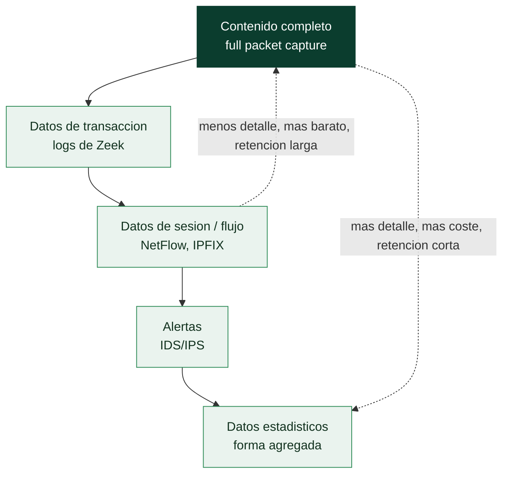

# Clase 043 — Network Security Monitoring (NSM): fundamentos

> Parte: **1 — Redes y seguridad de redes** · Fuente: *The Practice of Network Security Monitoring, R. Bejtlich*
> ⏱️ Duración estimada: **120 min** · Nivel: **Avanzado**

---

## 🎯 Objetivo

Introducir el **Network Security Monitoring** como disciplina: la recolección, análisis y escalado de indicadores de red para detectar y responder a intrusiones, partiendo de la premisa de que la prevención eventualmente falla. El alumno conocerá los tipos de datos NSM, el ciclo de detección y las plataformas que lo implementan (Security Onion).

## 📚 Resultados de aprendizaje

Al finalizar, el alumno podrá:

1. **Explicar** la filosofía NSM y por qué "la prevención falla".
2. **Distinguir** los tipos de datos NSM (full content, sesión, transacción, extraídos, alertas, estadísticos, metadatos).
3. **Ubicar** correctamente los sensores en la red.
4. **Recorrer** el ciclo detección → análisis → escalado → respuesta.
5. **Desplegar** una plataforma NSM de laboratorio (Security Onion).
6. **Realizar** análisis dirigido por indicadores y por hipótesis (threat hunting básico).

## 🗺️ Temas

| # | Tema | Por qué importa |
|---|------|-----------------|
| 1 | Filosofía NSM (Bejtlich) | Marco mental defensivo |
| 2 | Tipos de datos NSM | Qué recolectar y por qué |
| 3 | Colocación de sensores | Visibilidad efectiva |
| 4 | Ciclo de detección y respuesta | Operar el monitoreo |
| 5 | Security Onion | Plataforma integrada |
| 6 | Detección por indicadores vs. hunting | Reactivo y proactivo |
| 7 | Métricas y cobertura | Medir el programa |

## 🧠 Explicación en profundidad

### La premisa que ordena toda la defensa: la prevención falla

El *Network Security Monitoring* parte de una idea de Richard Bejtlich tan sobria como
poderosa: **la prevención acabará fallando**, así que hay que construir la capacidad de
*detectar* y *responder* con la misma seriedad con que se construyen los muros. NSM no es
un producto: es una disciplina de recolectar, mantener y analizar datos de red para
encontrar al intruso que ya está dentro y reconstruir lo que hizo. Cambia la pregunta de
"¿cómo impido que entren?" —importante pero insuficiente— por "¿cómo me entero de que
entraron, y qué evidencia tengo para responder?".

### Los tipos de datos, del más caro al más barato

La columna vertebral de NSM es entender qué datos existen, porque cada uno tiene un
compromiso distinto entre valor y coste de almacenamiento. El **contenido completo**
(*full packet capture*) lo guarda todo, byte a byte: es la máxima fidelidad y permite
extraer cualquier artefacto después, pero es carísimo de almacenar y solo se retiene
durante ventanas cortas. Los **datos de transacción** —los logs de Zeek de la clase 044—
resumen cada conexión y cada operación de aplicación en un registro estructurado: son la
pieza más útil del conjunto, porque conservan el "quién habló con quién, cuándo y qué
pidió" con un coste de almacenamiento moderado. Los **datos de sesión / flujo** —el
NetFlow de la clase 045— guardan solo los metadatos de cada conexión (la 5-tupla, bytes,
duración): baratísimos, y por eso los que se retienen durante meses. Las **alertas** son
la salida de los IDS de la clase 035. Y los **datos estadísticos** describen la forma
agregada del tráfico.



### Dónde poner el sensor decide qué puedes ver

Un programa de NSM vale lo que ve, y lo que ve depende de la **colocación del sensor**.
El principio es cubrir los puntos de estrangulamiento por los que pasa el tráfico que
importa: el perímetro (lo que entra y sale hacia Internet), las fronteras entre
segmentos internos (para ver el movimiento lateral que el perímetro no capta), y los
enlaces hacia activos críticos. Aquí reaparecen los conceptos de la clase 026: un TAP
para no perder paquetes, un SPAN cuando no hay más remedio, y el problema del **cifrado**,
que hoy oculta el contenido de la mayoría del tráfico y empuja el análisis hacia los
metadatos —con quién, cuándo, cuánto— que TLS no puede esconder.

### Detección e investigación: dos modos de mirar

NSM opera en dos modos complementarios que conviene no confundir. La **detección basada
en indicadores** es reactiva: reglas, firmas y listas de IOC que disparan cuando aparece
algo conocido —eficaz contra lo catalogado, ciega ante lo nuevo—. El ***threat hunting***
es proactivo: partir de una hipótesis ("si hubiera un C2 con *beaconing*, vería conexiones
periódicas a un mismo destino") y buscarla en los datos aunque ninguna alerta haya
saltado. Los dos se alimentan del mismo acervo de datos NSM y se necesitan mutuamente: lo
que un *hunt* descubre se convierte en la firma que automatiza su detección futura.
**Security Onion** empaqueta todo esto —Suricata, Zeek, almacenamiento y las interfaces de
análisis— en una distribución lista para desplegar, y es la forma habitual de montar un
laboratorio de NSM sin integrar cada pieza a mano.

## 📖 Definiciones y características

- **NSM:** recolección, análisis y escalado de indicaciones y advertencias para detectar y responder a intrusiones; asume que el atacante entrará y busca detectarlo pronto.
- **Full content data:** captura completa de paquetes (pcap); máxima fidelidad, alto coste de almacenamiento.
- **Session/flow data:** resumen de conexiones (5-tupla, bytes, duración); eficiente y muy útil para investigación.
- **Transaction data:** registros de protocolo de alto nivel (peticiones HTTP, consultas DNS, handshakes TLS) como los que produce Zeek.
- **Alert data:** salidas de IDS/IPS (Suricata/Snort) que señalan coincidencias con firmas.
- **Threat hunting:** búsqueda proactiva de amenazas guiada por hipótesis, sin depender de una alerta previa.

## 📔 Glosario

| Término | Definición concisa |
|---------|--------------------|
| NSM | Recolección y análisis de datos de red para detectar y responder |
| Bejtlich | Autor que formalizó la disciplina de NSM |
| Contenido completo | Captura íntegra de paquetes; máxima fidelidad, alto coste |
| Datos de transacción | Resumen estructurado por conexión y operación (logs de Zeek) |
| Datos de sesión / flujo | Metadatos por conexión (5-tupla, bytes, duración); baratos |
| Alertas | Salida de los IDS/IPS |
| Datos estadísticos | Descripción agregada de la forma del tráfico |
| Colocación de sensores | Dónde se observa el tráfico; determina la visibilidad |
| Punto de estrangulamiento | Enlace por el que pasa el tráfico que interesa vigilar |
| Detección por indicadores | Reglas y firmas sobre lo conocido; reactiva |
| Threat hunting | Búsqueda proactiva a partir de hipótesis, sin alerta previa |
| IOC | *Indicator of Compromise*: dato observable de una intrusión |
| Security Onion | Distribución que integra Suricata, Zeek y análisis para NSM |
| Cobertura | Proporción del tráfico y de las técnicas que el programa ve |

## 🧰 Herramientas y preparación

- **Security Onion 2.x** (distribución NSM que integra Suricata, Zeek, Stenographer, Elastic, Kibana).
- Alternativa ligera: Suricata + Zeek + un almacén de logs propio.
- Un TAP/SPAN o interfaz de captura en el laboratorio con tráfico representativo.
- Recursos: una VM con suficiente RAM (Security Onion pide bastante).

> ⚠️ **Nota ética:** el NSM implica capturar y almacenar tráfico, que puede contener datos personales. Monitoriza solo redes que administras, con base legal y políticas de privacidad claras (avisos a usuarios, retención mínima). En laboratorio, usa tu propio tráfico.

## 🧪 Laboratorio guiado

1. **Despliega Security Onion** en una VM (modo import/eval para laboratorio) y accede a su consola web.
2. **Importa un pcap** representativo (o el `lab027.pcapng` de clases previas) mediante `so-import-pcap`:

   ```bash
   sudo so-import-pcap /ruta/lab027.pcapng
   ```

3. **Explora las alertas** en la interfaz (Alerts): identifica qué firmas de Suricata dispararon.
4. **Pivota a los logs de Zeek**: para una alerta, abre los registros de sesión (`conn.log`), HTTP (`http.log`) y DNS (`dns.log`) asociados.
5. **Recupera el full content**: desde una alerta, extrae el pcap del flujo y ábrelo en Wireshark para el análisis fino.
6. **Recorre el ciclo NSM**: documenta detección (alerta) → análisis (logs + pcap) → decisión (falso positivo o incidente) → escalado.
7. **Hunting por hipótesis**: plantea "¿hay beaconing hacia un dominio raro?" y búscalo en `conn.log`/`dns.log` por frecuencia y regularidad de conexiones.

## ✍️ Ejercicios

1. Clasifica cada dato de un incidente en su tipo NSM (full content, sesión, transacción, alerta…).
2. Justifica dónde colocarías un sensor para monitorizar el tráfico entre la DMZ y la red interna.
3. A partir de una alerta, reconstruye la sesión completa usando los logs de Zeek.
4. Formula tres hipótesis de threat hunting y describe qué dato NSM usarías para cada una.
5. Explica el compromiso entre retención de full content y coste de almacenamiento.
6. Define tres métricas para medir la eficacia de un programa NSM (p. ej. tiempo medio de detección).

## 📝 Reto verificable

Con Security Onion (o Suricata+Zeek), procesa una captura que contenga actividad sospechosa (un escaneo y una descarga anómala que generes en tu laboratorio) y produce un "expediente" NSM del evento: la alerta que lo detectó, los logs de sesión y transacción que lo contextualizan, y el pcap del flujo. Concluye si es incidente o falso positivo y por qué.

**Criterio de aceptación:** el expediente enlaza correctamente alerta → logs → full content del mismo flujo, y la conclusión (incidente/falso positivo) está fundamentada en la evidencia recolectada.

## ⚠️ Errores comunes

| Síntoma / mensaje | Causa y cómo arreglar |
|-------------------|-----------------------|
| Security Onion sin datos | Sensor mal configurado o interfaz de monitoreo equivocada; revisa la config de captura |
| Demasiadas alertas, nadie las mira | Falta afinado y priorización; ajusta reglas y define un flujo de triaje |
| Solo se guardan alertas, no contexto | Sin session/transaction data no puedes investigar; habilita Zeek y retención de flujos |
| Disco lleno por full content | Retención de pcap demasiado larga; limita por tiempo/tamaño y prioriza sesiones |
| Sensor sin visibilidad | Mal colocado (no ve el tráfico relevante); usa TAP/SPAN en el punto correcto |

## ❓ Preguntas frecuentes

**❓ ¿NSM es lo mismo que un IDS?**
No. El IDS (alertas por firmas) es **una** fuente de datos dentro del NSM. El NSM abarca también sesión, transacción, full content y el proceso humano de análisis y respuesta.

**❓ ¿Por qué guardar tráfico si tengo un IDS?**
Porque las firmas no lo detectan todo. Con datos de sesión y full content puedes investigar incidentes que ninguna firma alertó y reconstruir lo ocurrido.

**❓ ¿NSM sustituye a la prevención?**
No, la complementa. Parte de que la prevención fallará y se centra en detectar y responder rápido para reducir el impacto.

**❓ ¿Qué es threat hunting?**
La búsqueda proactiva de amenazas guiada por hipótesis (no por alertas), usando los datos NSM para encontrar actividad maliciosa que pasó desapercibida.

## 🔗 Referencias

- Bejtlich, R. *The Practice of Network Security Monitoring*. No Starch Press. <https://nostarch.com/nsm>
- Sanders, C. & Smith, J. *Applied Network Security Monitoring*. Syngress.
- Security Onion documentation. <https://docs.securityonion.net/>
- SANS — NSM and Threat Hunting resources. <https://www.sans.org/>

## 📥 Material descargable

- 📄 [Guía en PDF](./clase-043-guia.pdf) — versión imprimible de esta clase.
- 🎞️ [Presentación (PPTX)](./clase-043-presentacion.pptx) — deck para proyectar en clase.

## ⬅️ Clase anterior

[Clase 042 — Segmentación de red y arquitectura Zero Trust](../042-segmentacion-de-red-y-arquitectura-zero-trust/README.md)

## ➡️ Siguiente clase

[Clase 044 — Zeek para análisis de red a gran escala](../044-zeek-para-analisis-de-red-a-gran-escala/README.md)
