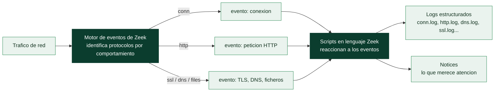

# Clase 044 — Zeek para análisis de red a gran escala

> Parte: **1 — Redes y seguridad de redes** · Fuente: *Documentación de Zeek; Applied NSM, Sanders & Smith*
> ⏱️ Duración estimada: **130 min** · Nivel: **Avanzado**

---

## 🎯 Objetivo

Dominar **Zeek** (antes Bro), el motor de análisis de red que convierte el tráfico en logs de transacción ricos y permite escribir lógica de detección personalizada. El alumno aprenderá a procesar pcaps y tráfico en vivo, a leer los logs de Zeek, a extraer artefactos y a escribir scripts de detección en el lenguaje de Zeek.

## 📚 Resultados de aprendizaje

Al finalizar, el alumno podrá:

1. **Ejecutar** Zeek sobre un pcap y en una interfaz en vivo.
2. **Interpretar** los logs principales (`conn`, `dns`, `http`, `ssl`, `files`, `notice`).
3. **Consultar** y correlacionar logs con `zeek-cut` y herramientas de línea de comandos.
4. **Extraer** archivos transferidos por la red.
5. **Escribir** un script de Zeek que genere una detección personalizada.
6. **Integrar** la salida de Zeek en un pipeline de análisis/NSM.

## 🗺️ Temas

| # | Tema | Por qué importa |
|---|------|-----------------|
| 1 | Arquitectura de Zeek (eventos) | Modelo mental del motor |
| 2 | Logs de Zeek y sus campos | Fuente de datos de transacción |
| 3 | `zeek-cut` y análisis por CLI | Consultar sin base de datos |
| 4 | Extracción de archivos | Recuperar artefactos |
| 5 | Zeek scripting y eventos | Detección a medida |
| 6 | Notices y framework de detección | Alertas propias |
| 7 | Zeek en producción (clusters) | Escala real |

## 🧠 Explicación en profundidad

### Zeek no busca firmas: describe lo que pasa

La diferencia esencial entre Zeek y un IDS de firmas como Suricata es de propósito.
Suricata pregunta "¿este tráfico coincide con algo malo conocido?". Zeek pregunta "¿qué
está ocurriendo en esta red?" y lo escribe en registros estructurados, dejando el juicio
para después. Por eso Zeek es la fuente de los **datos de transacción** de NSM: no genera
sobre todo alertas, genera un **diario** de la actividad de la red del que luego se puede
extraer casi cualquier cosa —incluida evidencia de ataques que aún no tenían firma cuando
ocurrieron—.

Su motor es **dirigido por eventos**. Zeek analiza el tráfico, reconoce protocolos
—incluso en puertos no estándar, porque los identifica por comportamiento y no por
número— y por cada cosa que ocurre (una conexión que se establece, una petición HTTP, un
*handshake* TLS, una consulta DNS) dispara un **evento**. Scripts escritos en el lenguaje
de Zeek reaccionan a esos eventos, y esa arquitectura es lo que lo hace a la vez un
generador de logs riquísimo y una plataforma de detección programable.



### Los logs y el arte de consultarlos sin base de datos

Zeek produce una familia de logs, uno por tipo de actividad, y conocer los principales es
media clase. `conn.log` es el registro maestro: una línea por conexión con la 5-tupla,
duración, bytes en cada sentido y estado. `http.log`, `dns.log`, `ssl.log`, `files.log` y
`x509.log` detallan cada protocolo. Todos comparten un formato tabular con un campo clave,
el **UID**, que es el mismo para todas las líneas de una misma conexión y permite
**correlacionar** entre logs: del `uid` de una conexión sospechosa en `conn.log` se salta
a su petición en `http.log` y al certificado en `ssl.log`.

La herramienta cotidiana para explorar esto es **`zeek-cut`**, que extrae columnas por
nombre y se combina con las utilidades de la Parte 0: `cat conn.log | zeek-cut id.resp_h
orig_bytes | sort | ...` responde preguntas reales sin montar ninguna base de datos. Este
es el pago de aquella clase de `grep`, `sort` y `awk`: los logs de Zeek están hechos para
ese flujo de trabajo.

### De describir a detectar, y de un host a un clúster

Sobre esa base descriptiva, Zeek permite construir detección propia. El **framework de
notices** es el mecanismo por el que un script eleva algo a la categoría de "esto merece
atención" —un fichero ejecutable descargado desde un dominio recién visto, una
transferencia de zona DNS, un certificado autofirmado en un servicio que debería tener uno
válido—, con la ventaja de que la lógica tiene todo el contexto de la conexión disponible.
Es detección a medida, complementaria a las firmas de Suricata: donde la firma reconoce un
patrón fijo, el script de Zeek expresa una regla de negocio sobre el comportamiento.

Para redes grandes, Zeek escala en **clúster**: varios procesos *worker* reparten el
tráfico, un *proxy* coordina el estado compartido y un *manager* consolida los logs, de
modo que un único punto de análisis lógico puede cubrir enlaces de muchos gigabits. Esa
capacidad de operar a escala real es lo que lo distingue de una simple herramienta de
laboratorio y lo sitúa en el corazón de los grandes programas de monitoreo.

## 📖 Definiciones y características

- **Zeek:** framework de análisis de red orientado a eventos; no es un IDS de firmas, sino un motor que registra la actividad y ejecuta scripts ante eventos de protocolo.
- **conn.log:** registro de cada conexión (5-tupla, duración, bytes, estado); el log más usado para investigación.
- **Log de transacción:** `dns.log`, `http.log`, `ssl.log`, `files.log`, etc.; describen la actividad a nivel de aplicación.
- **`zeek-cut`:** utilidad para extraer columnas específicas de los logs (con cabeceras) desde la línea de comandos.
- **notice:** mecanismo de Zeek para emitir alertas cuando un script detecta algo relevante.
- **Evento:** en Zeek, un hecho de red (p. ej. `http_request`) al que un script puede reaccionar con lógica propia.

## 📔 Glosario

| Término | Definición concisa |
|---------|--------------------|
| Zeek | Motor de análisis de red que genera logs de transacción, no firmas |
| Dirigido por eventos | Arquitectura en que cada actividad dispara un evento programable |
| Evento | Señal que emite el motor (conexión, petición HTTP, handshake TLS…) |
| Script de Zeek | Código que reacciona a eventos para generar logs o detección |
| `conn.log` | Registro maestro: una línea por conexión con su 5-tupla y bytes |
| `http.log` / `dns.log` / `ssl.log` | Logs detallados por protocolo |
| UID | Identificador de conexión común a todos los logs; permite correlacionar |
| `zeek-cut` | Extrae columnas de los logs por nombre, para análisis por CLI |
| Framework de notices | Mecanismo para elevar algo a "merece atención" |
| Notice | Evento destacado por un script como digno de revisión |
| Identificación por comportamiento | Reconocer un protocolo aunque use un puerto no estándar |
| Clúster Zeek | Despliegue con workers, proxy y manager para gran escala |
| Worker / manager | Procesos que reparten el tráfico y consolidan los logs |
| Datos de transacción | Resumen estructurado de la actividad; la aportación de Zeek a NSM |

## 🧰 Herramientas y preparación

- **Zeek 6.x**: instalación desde paquetes oficiales o `apt install zeek` (repos de OpenSUSE OBS) / compilación.
- `zeek-cut` viene con Zeek; `jq` si usas la salida JSON.
- Un pcap de laboratorio con varios protocolos (reutiliza los de clases anteriores).

> ⚠️ **Nota ética:** Zeek registra metadatos y puede extraer archivos del tráfico, lo que implica manejo de datos potencialmente sensibles. Úsalo sobre redes propias o autorizadas y protege los logs y artefactos extraídos. En laboratorio, usa tu propio tráfico.

## 🧪 Laboratorio guiado

1. **Procesa un pcap** y genera los logs:

   ```bash
   mkdir zeek-out && cd zeek-out
   zeek -r /tmp/lab027.pcapng
   ls    # conn.log dns.log http.log ssl.log files.log ...
   ```

2. **Inspecciona conexiones** con `zeek-cut`:

   ```bash
   cat conn.log | zeek-cut id.orig_h id.resp_h id.resp_p proto service duration orig_bytes resp_bytes
   ```

3. **Analiza DNS**:

   ```bash
   cat dns.log | zeek-cut query qtype_name answers | sort | uniq -c | sort -rn | head
   ```

4. **Analiza HTTP** (hosts y URIs solicitados):

   ```bash
   cat http.log | zeek-cut host uri method status_code | head
   ```

5. **Extrae archivos** del tráfico con el script incorporado:

   ```bash
   zeek -r /tmp/lab027.pcapng /opt/zeek/share/zeek/policy/frameworks/files/extract-all-files.zeek
   ls extract_files/
   ```

6. **Escribe un script de detección** `deteccion.zeek` que emita un notice ante user-agents sospechosos:

   ```zeek
   @load base/protocols/http

   redef enum Notice::Type += { Suspicious_UA };

   # Inspecciona la cabecera User-Agent cuando Zeek ya la ha parseado
   # (en http_request el valor aún no existe: c$http$user_agent estaría sin asignar).
   event http_header(c: connection, is_orig: bool, name: string, value: string) {
     if ( is_orig && name == "USER-AGENT" && /sqlmap|nikto|[Nn]map/ in value )
       NOTICE([$note=Suspicious_UA,
               $msg="User-Agent de herramienta ofensiva detectado",
               $conn=c]);
   }
   ```

   Ejecútalo:

   ```bash
   zeek -r /tmp/lab027.pcapng ./deteccion.zeek
   cat notice.log | zeek-cut msg
   ```

7. **Análisis en vivo** (opcional):

   ```bash
   sudo zeek -i eth0
   ```

## ✍️ Ejercicios

1. Con `zeek-cut`, lista las 10 conexiones que más bytes transfirieron.
2. Encuentra en `ssl.log` los certificados con validez sospechosa o autofirmados.
3. Extrae de una captura un archivo transferido por HTTP y verifica su hash.
4. Escribe un script que emita un notice cuando una conexión supere cierto volumen de datos (posible exfiltración).
5. Correlaciona `conn.log` y `dns.log` para detectar posible beaconing (conexiones regulares a un dominio).
6. Compara la información que aporta Zeek frente a una alerta de Suricata para el mismo tráfico.

## 📝 Reto verificable

Procesa con Zeek una captura de tu laboratorio que incluya actividad web y DNS, y entrega: (a) un resumen de las conexiones top por bytes con `zeek-cut`, (b) al menos un archivo extraído del tráfico con su hash, y (c) un script `.zeek` propio que genere un notice para una condición de detección que definas (user-agent, volumen o dominio). Incluye la salida de `notice.log`.

**Criterio de aceptación:** los logs se generan correctamente, el archivo extraído coincide (hash) con el transferido, y tu script produce el notice esperado al procesar la captura, sin falsos positivos sobre el tráfico legítimo.

## ⚠️ Errores comunes

| Síntoma / mensaje | Causa y cómo arreglar |
|-------------------|-----------------------|
| `zeek: command not found` | Zeek no está en el PATH; usa la ruta completa (`/opt/zeek/bin/zeek`) o ajusta el PATH |
| `zeek-cut` muestra nombres de campo raros | Estás mirando el log equivocado; consulta la referencia de campos por log |
| No se extraen archivos | No cargaste el script de extracción; añade el policy `extract-all-files.zeek` |
| Script no reacciona | Falta `@load` del protocolo o el evento es incorrecto; revisa el nombre del evento |
| Logs en JSON ilegibles con zeek-cut | La salida está en JSON; usa `jq` o cambia a formato TSV |

## ❓ Preguntas frecuentes

**❓ ¿Zeek es un IDS?**
No en el sentido clásico. Suricata/Snort detectan por firmas; Zeek es un motor de análisis que registra transacciones y ejecuta lógica propia. Se complementan: Suricata alerta, Zeek contextualiza.

**❓ ¿Qué log uso para empezar una investigación?**
Casi siempre `conn.log`: te da todas las conexiones y sirve de índice para pivotar a los logs de aplicación (dns, http, ssl).

**❓ ¿Puedo escribir mis propias detecciones?**
Sí, ese es el gran valor de Zeek. Su lenguaje de scripting permite reaccionar a eventos de red y emitir notices con lógica arbitraria.

**❓ ¿Zeek escala a redes grandes?**
Sí, con despliegues en clúster (un manager y varios workers) puede analizar enlaces de alta velocidad, que es como se usa en producción.

## 🔗 Referencias

- Zeek Documentation. <https://docs.zeek.org/>
- Zeek Log Files reference. <https://docs.zeek.org/en/master/logs/index.html>
- Zeek Scripting. <https://docs.zeek.org/en/master/scripting/index.html>
- Sanders, C. & Smith, J. *Applied Network Security Monitoring*. Syngress.

## 📥 Material descargable

- 📄 [Guía en PDF](./clase-044-guia.pdf) — versión imprimible de esta clase.
- 🎞️ [Presentación (PPTX)](./clase-044-presentacion.pptx) — deck para proyectar en clase.

## ⬅️ Clase anterior

[Clase 043 — Network Security Monitoring (NSM): fundamentos](../043-network-security-monitoring-nsm-fundamentos/README.md)

## ➡️ Siguiente clase

[Clase 045 — NetFlow y análisis de metadatos de tráfico](../045-netflow-y-analisis-de-metadatos-de-trafico/README.md)
