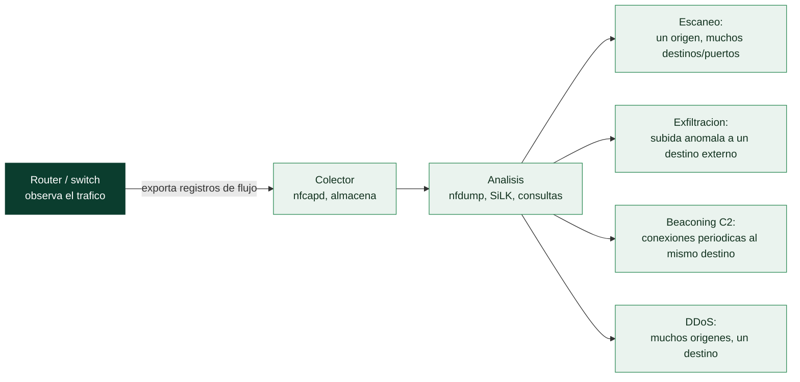

# Clase 045 — NetFlow y análisis de metadatos de tráfico

> Parte: **1 — Redes y seguridad de redes** · Fuente: *RFC 3954 (NetFlow v9), RFC 7011 (IPFIX); Applied NSM*
> ⏱️ Duración estimada: **120 min** · Nivel: **Avanzado**

---

## 🎯 Objetivo

Cerrar la parte con el análisis de **metadatos de flujo** (NetFlow/IPFIX/sFlow): resúmenes de conexiones que permiten monitorizar redes enormes con un coste mínimo de almacenamiento, detectar anomalías (escaneos, DDoS, exfiltración, beaconing) y responder preguntas de visibilidad a escala que la captura completa no puede afrontar.

## 📚 Resultados de aprendizaje

Al finalizar, el alumno podrá:

1. **Explicar** qué es un flujo y qué campos contiene un registro NetFlow/IPFIX.
2. **Diferenciar** NetFlow, IPFIX y sFlow, y el modelo exportador/colector.
3. **Recolectar** y consultar flujos con herramientas (nfdump/nfcapd, SiLK).
4. **Detectar** patrones anómalos (escaneos, DDoS, beaconing, exfiltración) en los flujos.
5. **Comparar** el análisis de metadatos con el de contenido completo.
6. **Diseñar** un monitoreo de flujo para una red de tamaño medio.

## 🗺️ Temas

| # | Tema | Por qué importa |
|---|------|-----------------|
| 1 | Concepto de flujo (5-tupla) | Unidad del análisis de metadatos |
| 2 | NetFlow v5/v9, IPFIX, sFlow | Formatos y diferencias |
| 3 | Arquitectura exportador/colector | Cómo se recolecta a escala |
| 4 | nfdump / SiLK | Herramientas de consulta |
| 5 | Detección de anomalías por flujo | Escaneos, DDoS, exfiltración |
| 6 | Beaconing y C2 en metadatos | Patrones temporales |
| 7 | Metadatos vs. full content | Cuándo usar cada uno |

## 🧠 Explicación en profundidad

### Cuando no puedes guardarlo todo, guarda quién habló con quién

El contenido completo es carísimo y el cifrado esconde la carga útil de casi todo el
tráfico. De esa doble realidad nace el análisis de **flujos**: renunciar a *qué* se dijo
para quedarse con los **metadatos** de *quién habló con quién, cuándo, por cuánto tiempo y
cuánto volumen*. Un **flujo** es una secuencia unidireccional de paquetes que comparten
una **5-tupla** —IP origen, IP destino, puerto origen, puerto destino y protocolo—; el
registro de flujo resume esa conversación en unas pocas decenas de bytes. Esa compresión
brutal es lo que permite **retener meses** de actividad de una red entera, y por eso los
flujos son la memoria larga de un programa de monitoreo.

Y aquí está la idea que sostiene toda la clase: los metadatos son sorprendentemente
reveladores **aunque el contenido esté cifrado**. TLS oculta lo que dice una conexión,
pero no puede ocultar que existe, ni su duración, ni su ritmo, ni su volumen —y con eso
basta para detectar muchísimo—.



### Formatos y arquitectura: exportador y colector

El vocabulario técnico es sencillo una vez ordenado. **NetFlow v5** es el formato
clásico de Cisco, de campos fijos; **NetFlow v9** lo hizo extensible con plantillas;
**IPFIX** es el estándar abierto derivado de v9; y **sFlow** es distinto en naturaleza,
porque **muestrea** paquetes (uno de cada N) en lugar de contabilizar todos los flujos,
lo que lo hace más ligero a costa de precisión. La arquitectura tiene dos piezas: el
**exportador** —el router o switch que observa el tráfico y emite los registros— y el
**colector** —el servidor que los recibe, almacena e indexa—. Herramientas como
**nfdump** (con `nfcapd` recogiendo y `nfdump` consultando) y **SiLK** son las que
convierten ese depósito en respuestas.

### Los patrones que delatan sin ver el contenido

El valor del análisis de flujos está en los **patrones temporales y volumétricos**, y hay
un puñado que conviene reconocer de memoria. Un **escaneo** se ve como un origen que
contacta con muchísimos destinos o puertos en poco tiempo, con flujos minúsculos. Una
**exfiltración** aparece como un volumen de subida anómalo hacia un destino externo, a
menudo fuera de horario. Un **DDoS** es la imagen especular: muchísimos orígenes
convergiendo en un destino. Y el más valioso y sutil es el **beaconing** de un canal de
*command and control*: conexiones **periódicas** a un mismo destino —cada 60 segundos, con
tamaño casi constante— que denuncian a un malware "llamando a casa" aunque cada conexión
individual parezca inocente y aunque todo el contenido esté cifrado. La regularidad es la
firma; ninguna carga útil hace falta.

La decisión de fondo que enmarca toda la clase es **metadatos frente a contenido
completo**. El contenido responde "¿qué se dijo exactamente?" pero es caro y el cifrado lo
tapa; los metadatos responden "¿quién, cuándo, cuánto y con qué ritmo?", son baratos, se
retienen mucho tiempo y sobreviven al cifrado. Un programa de monitoreo maduro usa los dos
en capas —flujos para la vigilancia amplia y de retención larga, contenido completo en
ventanas cortas cuando algo merece una mirada de cerca—, cerrando así el recorrido que
empezó con un solo paquete en Wireshark.

## 📖 Definiciones y características

- **Flujo (flow):** secuencia unidireccional de paquetes que comparten la 5-tupla (IP origen/destino, puertos, protocolo) en un intervalo; se resume en un registro con bytes, paquetes, marcas de tiempo y flags.
- **NetFlow:** tecnología de Cisco para exportar registros de flujo; v9 es basada en plantillas y IPFIX es su estandarización IETF.
- **sFlow:** muestreo de paquetes (no flujos completos) exportado por switches; útil para estadísticas a gran escala con bajo coste.
- **Exportador/colector:** el router/switch **exporta** los flujos; un **colector** (nfcapd, SiLK) los recibe y almacena para consulta.
- **Beaconing:** patrón de conexiones regulares y periódicas hacia un mismo destino, típico de malware que "llama a casa" (C2).

## 📔 Glosario

| Término | Definición concisa |
|---------|--------------------|
| Flujo | Secuencia unidireccional de paquetes con una 5-tupla común |
| 5-tupla | IP origen, IP destino, puerto origen, puerto destino y protocolo |
| Metadatos de tráfico | Quién, cuándo, cuánto y con qué ritmo; sin el contenido |
| NetFlow v5 | Formato clásico de Cisco, de campos fijos |
| NetFlow v9 | Formato extensible mediante plantillas |
| IPFIX | Estándar abierto derivado de NetFlow v9 |
| sFlow | Muestreo de paquetes (uno de cada N); más ligero, menos preciso |
| Exportador | Dispositivo que observa el tráfico y emite los registros de flujo |
| Colector | Servidor que recibe, almacena e indexa los flujos |
| nfdump / SiLK | Herramientas de captura y consulta de flujos |
| Beaconing | Conexiones periódicas a un mismo destino; firma de C2 |
| Command and control (C2) | Canal por el que el malware recibe órdenes |
| Exfiltración | Salida anómala de datos hacia un destino externo |
| Metadatos vs. contenido | Barato y resistente al cifrado frente a fiel pero caro |

## 🧰 Herramientas y preparación

- **nfdump/nfcapd** (colector y consulta de NetFlow): `sudo apt install nfdump`.
- **SiLK** (System for Internet-Level Knowledge) para análisis avanzado.
- **softflowd** o **fprobe** para generar NetFlow a partir de tráfico si no tienes un router que lo exporte.
- Un pcap o tráfico en vivo de laboratorio.

> ⚠️ **Nota ética:** aunque los metadatos no incluyen el contenido, revelan patrones de comunicación (quién habla con quién, cuándo y cuánto) que son sensibles. Recolecta flujos solo de redes propias/autorizadas y con políticas de retención y privacidad adecuadas.

## 🧪 Laboratorio guiado

1. **Genera NetFlow** desde tráfico en vivo con softflowd apuntando a un colector local:

   ```bash
   sudo softflowd -i eth0 -n 127.0.0.1:9995
   ```

2. **Recolecta** con nfcapd:

   ```bash
   nfcapd -w -D -l /tmp/flows -p 9995
   ```

3. **Consulta** los flujos con nfdump:

   ```bash
   nfdump -R /tmp/flows -o extended
   ```

4. **Top talkers** (quién genera más tráfico):

   ```bash
   nfdump -R /tmp/flows -s ip/bytes -n 10
   ```

5. **Detecta un escaneo** (una IP tocando muchos puertos/destinos con pocos bytes):

   ```bash
   nfdump -R /tmp/flows 'proto tcp and packets < 3' -s srcip/flows -n 10
   ```

6. **Busca beaconing**: agrupa por par origen-destino y observa la regularidad temporal de los flujos hacia un mismo destino.
7. **Detecta posible exfiltración**: flujos salientes con `orig_bytes` muy superiores a lo habitual hacia destinos externos:

   ```bash
   nfdump -R /tmp/flows 'src net 192.168.56.0/24 and bytes > 10000000' -s dstip/bytes
   ```

8. **Compara**: para un flujo sospechoso, recuerda que los metadatos te dicen *que* ocurrió; para saber *qué* contenía necesitarías el full content (Wireshark, clase 026).

## ✍️ Ejercicios

1. Identifica los cinco pares de hosts que más bytes intercambiaron en tu captura de flujos.
2. Detecta un escaneo horizontal (una IP contra muchas) en los flujos y descríbelo.
3. Explica cómo se vería un ataque DDoS volumétrico en los metadatos de flujo.
4. Busca un patrón de beaconing y argumenta por qué la regularidad temporal es sospechosa.
5. Compara el tamaño en disco de los flujos frente al pcap equivalente y comenta el ahorro.
6. Diseña qué campos de flujo alimentarías a un SIEM para alertas de anomalía de red.

## 📝 Reto verificable

Genera flujos NetFlow de tu laboratorio que incluyan tráfico normal más una actividad anómala que tú introduzcas (un escaneo con Nmap o una transferencia grande hacia un destino externo simulado). Usando solo los metadatos de flujo (sin abrir el pcap), detecta y caracteriza la anomalía: IP implicada, tipo de comportamiento y evidencia (consulta nfdump). Entrega los comandos y la conclusión.

**Criterio de aceptación:** identificas correctamente la actividad anómala a partir de los flujos (no del contenido), la caracterizas (escaneo/exfiltración/beaconing) y aportas la consulta nfdump que la evidencia, coincidiendo con lo que tú introdujiste.

## ⚠️ Errores comunes

| Síntoma / mensaje | Causa y cómo arreglar |
|-------------------|-----------------------|
| nfcapd no recibe flujos | Puerto/host del exportador no coincide; verifica que softflowd apunta al mismo `ip:puerto` |
| Flujos incompletos o cortados | Timeouts de flujo mal ajustados; configura los active/inactive timeouts del exportador |
| No distingues escaneo de tráfico normal | Falta filtrar por paquetes/bytes bajos y muchos destinos; refina la consulta |
| Metadatos sin el detalle que necesitas | Los flujos no llevan payload; para el contenido recurre al full content (pcap) |
| sFlow y NetFlow mezclados | Son formatos distintos (muestreo vs. flujo); usa el colector adecuado a cada uno |

## ❓ Preguntas frecuentes

**❓ ¿Por qué usar flujos si tengo capturas completas?**
Por escala. En redes grandes es inviable guardar todo el tráfico; los flujos ocupan una fracción y permiten monitoreo histórico amplio para detectar y triar, dejando el full content para lo puntual.

**❓ ¿Los metadatos revelan el contenido?**
No el contenido, pero sí el patrón de comunicación (quién, cuándo, cuánto, con qué). Eso ya es muy revelador y a menudo suficiente para detectar comportamiento malicioso.

**❓ ¿NetFlow, IPFIX o sFlow?**
NetFlow/IPFIX registran flujos completos (IPFIX es el estándar abierto); sFlow muestrea paquetes. Elige según lo que exporten tus dispositivos y el nivel de detalle que necesites.

**❓ ¿Cómo detecto C2 con flujos?**
Buscando beaconing: conexiones periódicas y regulares hacia un mismo destino, a menudo de tamaño similar, que delatan un canal automatizado aunque el contenido esté cifrado.

## 🔗 Referencias

- RFC 7011 — IPFIX Protocol Specification. <https://www.rfc-editor.org/rfc/rfc7011>
- RFC 3954 — Cisco NetFlow v9. <https://www.rfc-editor.org/rfc/rfc3954>
- nfdump/NfSen. <https://github.com/phaag/nfdump>
- CERT NetSA — SiLK. <https://tools.netsa.cert.org/silk/>

## 📥 Material descargable

- 📄 [Guía en PDF](./clase-045-guia.pdf) — versión imprimible de esta clase.
- 🎞️ [Presentación (PPTX)](./clase-045-presentacion.pptx) — deck para proyectar en clase.

## ⬅️ Clase anterior

[Clase 044 — Zeek para análisis de red a gran escala](../044-zeek-para-analisis-de-red-a-gran-escala/README.md)

## ➡️ Siguiente clase

[Clase 046 — Historia y fundamentos de la criptografía](../../parte-2-criptografia-aplicada/046-historia-y-fundamentos-de-la-criptografia/README.md)
