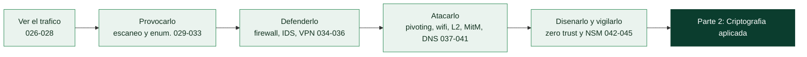

# Parte 1 — Redes y seguridad de redes

> [⬅️ Volver al programa](../../README.md) · [📚 Índice completo](../README.md) · [⏭️ Parte siguiente](../parte-2-criptografia-aplicada/README.md)

**20 clases** · rango 026–045 · Análisis de tráfico, escaneo, firewalls, IDS/IPS, VPN y monitoreo

**Fuentes de referencia de esta parte:**

- Chris Sanders — *Practical Packet Analysis* (3rd ed., No Starch Press, 2017).
- Gordon "Fyodor" Lyon — *Nmap Network Scanning* (Insecure.Com LLC, 2009). Referencia oficial también en <https://nmap.org/book/>.
- Richard Bejtlich — *The Practice of Network Security Monitoring* (No Starch Press, 2013).
- Chris Sanders & Jason Smith — *Applied Network Security Monitoring* (Syngress, 2014).
- Michael W. Lucas — *Absolute FreeBSD / PF* y documentación de nftables/iptables del kernel Linux.
- Estándares y proyectos: RFC 791/793 (IP/TCP), RFC 4301 (IPsec), NIST SP 800-207 (Zero Trust), documentación oficial de Wireshark, Suricata, Snort y Zeek.

---

## 🎯 ¿De qué trata esta parte?

Las redes son el sistema circulatorio de cualquier organización: todo dato sensible viaja por ellas en algún momento. Esta parte enseña a **ver** ese tráfico como lo ve un analista de seguridad, a **provocarlo** de forma controlada con herramientas de escaneo y enumeración, y a **defenderlo** con firewalls, sistemas de detección de intrusiones, cifrado de túneles y monitoreo continuo. Es la base técnica sobre la que se construyen el pentesting, la respuesta a incidentes y la ingeniería de detección.

Trabajamos con las herramientas que definen la profesión: Wireshark y tcpdump para análisis de paquetes, Nmap para descubrimiento y escaneo, iptables/nftables para filtrado, Snort y Suricata para detección basada en firmas, Zeek para análisis de metadatos a gran escala, y WireGuard/OpenVPN/IPsec para túneles cifrados. Cada clase combina teoría de protocolos (Ethernet, ARP, IP, TCP, UDP, DNS, TLS) con laboratorios reproducibles.

Sirve tanto al profesional **azul** (defensa, SOC, NSM, hardening de red) como al **rojo** (reconocimiento, pivoting, ataques de capa 2). Comprender ambos lados es el único camino para diseñar redes que resistan ataques reales.

## 🧩 Problemas que resuelve

- No saber qué protocolos y hosts realmente circulan por una red antes de asegurarla.
- Diagnosticar por qué una aplicación falla a nivel de red (retransmisiones, MTU, resets, latencia).
- Descubrir la superficie de ataque expuesta: hosts vivos, puertos abiertos, servicios y versiones.
- Filtrar y segmentar el tráfico con reglas de firewall correctas y auditables.
- Detectar intrusiones y comportamiento malicioso en tiempo casi real con IDS/IPS y NSM.
- Cifrar el tráfico entre sitios y usuarios remotos sin exponer claves ni rutas.
- Reconocer y mitigar ataques clásicos de red: ARP spoofing, MitM, envenenamiento de DNS, rogue AP.

## 🎓 Resultados de aprendizaje

Al terminar la parte, el alumno podrá:

- Capturar y disecar tráfico con Wireshark y tcpdump, aplicando filtros de captura y de visualización.
- Reconstruir flujos TCP/UDP y extraer artefactos (archivos, credenciales en claro, indicadores).
- Ejecutar escaneos Nmap completos: descubrimiento, puertos, versiones, OS y scripts NSE, e interpretar sus resultados.
- Escribir y depurar conjuntos de reglas de firewall con iptables y nftables.
- Desplegar y afinar reglas de Snort/Suricata y pipelines de Zeek para detección.
- Configurar túneles WireGuard, OpenVPN e IPsec con parámetros seguros.
- Identificar, reproducir en laboratorio y defenderse de ataques de capa 2, MitM y de DNS.
- Diseñar segmentación de red y una arquitectura Zero Trust básica alineada con NIST SP 800-207.

## 🧱 Prerrequisitos

Se asume la **[Parte 0 — Fundamentos y prerrequisitos](../parte-0-fundamentos-y-prerrequisitos/README.md)**: manejo de línea de comandos Linux, conceptos del modelo OSI/TCP-IP, direccionamiento IP y subredes, y un laboratorio virtualizado con al menos una VM atacante (Kali/Parrot) y una o dos víctimas aisladas en red interna (host-only). Familiaridad básica con Python ayuda en las clases de scripting.

Si alguna de estas afirmaciones te hace dudar, vuelve a la clase de la Parte 0 que la cubre antes de empezar:

| Necesitas tener claro… | Clase de la Parte 0 |
|---|---|
| Encapsulación y capas OSI/TCP-IP | [010](../parte-0-fundamentos-y-prerrequisitos/010-redes-tcp-ip-modelo-osi-encapsulacion-y-capas/README.md) |
| Cabeceras y flags de TCP/UDP/ICMP | [011](../parte-0-fundamentos-y-prerrequisitos/011-protocolos-de-red-ip-tcp-udp-e-icmp-en-profundidad/README.md) |
| DNS, DHCP y ARP y sus riesgos | [012](../parte-0-fundamentos-y-prerrequisitos/012-dns-dhcp-y-arp-funcionamiento-y-riesgos/README.md) |
| Subnetting y notación CIDR | [014](../parte-0-fundamentos-y-prerrequisitos/014-direccionamiento-ip-y-subnetting/README.md) |
| Laboratorio aislado y reversible | [004](../parte-0-fundamentos-y-prerrequisitos/004-montaje-del-laboratorio-virtualizacion-kali-snapshots-y-aislamiento-de-red/README.md) |

## 🧭 Cómo recorrer esta parte

**El orden importa, pero menos que en la Parte 0.** Los cinco bloques son en buena medida independientes, así que un analista defensivo con prisa podría ir directo a detección y monitoreo (034–035, 042–045) y un pentester al escaneo (029–033). Aun así, el orden numérico está pensado para que cada bloque prepare el siguiente: se aprende a **ver** el tráfico antes de **provocarlo**, y a provocarlo antes de **defenderlo**.

**El ritmo.** La parte suma unas **40 h 10 min** de trabajo guiado, sin contar ejercicios ni retos. A dos horas al día, entre semana, son unas **cuatro semanas**; a una hora más los fines de semana, entre siete y ocho.

**El método, clase a clase.** Cada README se recorre en el mismo orden, y en esta parte el laboratorio es especialmente importante porque casi todo se aprende ejecutándolo:

1. Lee **🎯 Objetivo** y **📚 Resultados de aprendizaje** para saber qué deberías poder hacer al final.
2. Lee **🧠 Explicación en profundidad** entera antes de tocar la herramienta. Es la sección que responde al *porqué*, con diagramas del mecanismo.
3. Prepara lo que pida **🧰 Herramientas y preparación** dentro de tu laboratorio aislado.
4. Haz el **🧪 Laboratorio guiado** paso a paso; si un comando falla, la respuesta suele estar en **⚠️ Errores comunes**.
5. Resuelve los **✍️ Ejercicios** y el **📝 Reto verificable**, que trae criterio de aceptación para autocorregirte.
6. Repasa el **📔 Glosario** al cerrar. Aquí hay mucha sigla (SPAN, BPF, CPE, NSE, DAI, PMF, IPFIX): si no sabrías explicar una en voz alta, vuelve a la sección donde aparece.

> ⚠️ **Uso ético y legal.** Escanear, capturar tráfico ajeno o probar ataques de red contra sistemas que no son tuyos ni tienes autorización escrita para tocar es delito en casi todos los países. Todo lo de esta parte se practica en **tu laboratorio aislado** o con permiso explícito por escrito. Repasa la [Clase 025](../parte-0-fundamentos-y-prerrequisitos/025-etica-legalidad-alcance-y-divulgacion-responsable/README.md) si tienes dudas sobre el alcance.

## 🧱 Anatomía de una clase

Las 20 clases siguen el **estándar pedagógico profundo** del programa, así que sabes de antemano qué encontrarás en cada README y en qué orden:

| Sección | Qué contiene | Para qué la usas |
|---|---|---|
| 🎯 Objetivo | Qué sabrás hacer al terminar y por qué importa | Decidir si necesitas la clase |
| 📚 Resultados de aprendizaje | Lista verificable de capacidades concretas | Autoevaluarte al final |
| 🗺️ Temas | Cada tema con el porqué de su inclusión | Ubicarte antes de leer |
| 🧠 Explicación en profundidad | El mecanismo explicado y conectado con el resto, con diagramas | Entender, no memorizar |
| 📖 Definiciones y características | Cada término desarrollado con su relevancia en seguridad | Consulta puntual |
| 📔 Glosario | Términos y siglas de la clase, en tabla | Repaso rápido |
| 🧰 Herramientas y preparación | Qué instalar y tener a mano | Antes del laboratorio |
| 🧪 Laboratorio guiado | Práctica paso a paso con herramientas reales | Donde de verdad se aprende |
| ✍️ Ejercicios · 📝 Reto verificable | Problemas propios y un entregable con criterio de aceptación | Consolidar y demostrar |
| ⚠️ Errores comunes · ❓ Preguntas frecuentes | Tropiezos reales y dudas auténticas | Cuando algo falla |
| 🔗 Referencias | Fuentes primarias y documentación oficial | Profundizar |

El CI del repositorio verifica que ninguna clase de esta parte pierda las secciones **🧠 Explicación en profundidad** ni **📔 Glosario**.

## 🗺️ Estructura temática

| Bloque | Clases | Foco | Tiempo |
|-------|--------|------|--------|
| Análisis de tráfico | 026–028 | Wireshark, filtros y flujos, tcpdump | ≈ 5 h 30 |
| Escaneo y enumeración (Nmap) | 029–033 | Descubrimiento, puertos, versiones, OS, NSE, enumeración | ≈ 9 h 20 |
| Defensa perimetral | 034–036 | Firewalls, IDS/IPS, VPN y túneles | ≈ 6 h 40 |
| Ataques de red | 037–041 | Proxies/NAT/pivoting, WiFi, capa 2, MitM, DNS | ≈ 10 h 30 |
| Arquitectura y monitoreo | 042–045 | Segmentación/Zero Trust, NSM, Zeek, NetFlow | ≈ 8 h 10 |

## 📖 Guía capítulo a capítulo

Qué hace cada clase, por qué está donde está y para qué te sirve después.

### 🔎 Bloque 1 · Análisis de tráfico — clases 026 a 028

Antes de asegurar o atacar una red hay que **verla**. Este bloque enseña a capturar y leer tráfico, y fija una idea que recorre toda la parte: el análisis empieza por decidir dónde y cómo capturar, no por qué filtro escribir.

- **[026 · Wireshark: captura y análisis de paquetes](026-wireshark-captura-y-analisis-de-paquetes/README.md)** · 120 min — Dónde enchufar el analizador (host, SPAN, TAP, monitor), la diferencia entre filtro de captura (BPF) y de visualización, y cómo el disector convierte bytes en campos con nombre siguiendo la encapsulación de la Parte 0. Es tu instrumento principal para el resto del programa.
- **[027 · Análisis de tráfico: filtros, seguimiento de flujos y estadísticas](027-analisis-de-trafico-filtros-seguimiento-de-flujos-y-estadisticas/README.md)** · 120 min — El filtro de visualización como lenguaje de campos tipados, *Follow Stream* para pasar del paquete a la conversación, y las estadísticas (Conversations, Endpoints, jerarquía de protocolos) que resuelven la mayoría de los triajes. Con `tshark` para escalar de una captura a cien.
- **[028 · tcpdump y captura de tráfico en línea de comandos](028-tcpdump-y-captura-de-trafico-en-linea-de-comandos/README.md)** · 90 min — La herramienta que usas cuando no hay entorno gráfico, cuando la captura dura días o cuando va dentro de un script. BPF compilado y ejecutado en el kernel, y la rotación (`-C`/`-G`/`-W`) que hace posible una captura de larga duración sin llenar el disco.

### 🎯 Bloque 2 · Escaneo y enumeración — clases 029 a 033

El reconocimiento activo: descubrir qué hay y qué te deja ver. Cinco clases que van del barrido de hosts al detalle de cada servicio, con Nmap como hilo conductor.

- **[029 · Nmap: descubrimiento de hosts y técnicas de ping](029-nmap-descubrimiento-de-hosts-y-tecnicas-de-ping/README.md)** · 100 min — Nmap como tubería de fases, por qué un fallo en el descubrimiento hace desaparecer un host del informe, y las sondas (ARP en la LAN, ICMP y TCP/UDP a través de routers) para encontrar lo que está vivo. Con `-sn` y `-Pn` como las dos banderas que hay que dominar.
- **[030 · Nmap: escaneo de puertos y tipos de escaneo](030-nmap-escaneo-de-puertos-y-tipos-de-escaneo/README.md)** · 120 min — Los seis estados de un puerto (y por qué "filtrado" es un hallazgo, no una ausencia), SYN vs. connect scan y quién necesita privilegios, el escaneo UDP que casi todos omiten, y el triángulo velocidad-precisión-sigilo del que solo se eligen dos lados.
- **[031 · Nmap: detección de servicios y fingerprinting de OS](031-nmap-deteccion-de-servicios-y-fingerprinting-de-os/README.md)** · 100 min — De "puerto abierto" a "servicio con versión", que es lo que se puede cruzar con vulnerabilidades. El identificador **CPE** que enlaza tu escaneo con las CVE del NVD, y por qué una versión vulnerable es una hipótesis, no una prueba (backports, mitigaciones).
- **[032 · Nmap Scripting Engine (NSE)](032-nmap-scripting-engine-nse/README.md)** · 110 min — El motor Lua que convierte Nmap en plataforma. Las categorías como declaración de riesgo —`--script vuln` no es inocente— y el control fino de selección para acotar qué se ejecuta y contra qué.
- **[033 · Enumeración de servicios de red](033-enumeracion-de-servicios-de-red/README.md)** · 130 min — La fase que más determina el resultado de un pentest: qué preguntar a SMB, HTTP, DNS, SNMP, SMTP, FTP y LDAP, con un método exhaustivo, iterativo y documentado. Y la frontera entre enumerar (consultar lo público) y explotar (que exige alcance autorizado).

### 🛡️ Bloque 3 · Defensa perimetral — clases 034 a 036

Los controles que filtran, detectan y cifran. Tres clases que dan el otro lado de lo aprendido: cómo se para lo que el bloque anterior encuentra.

- **[034 · Firewalls: tipos, iptables y nftables](034-firewalls-tipos-iptables-y-nftables/README.md)** · 130 min — Por qué el estado (conntrack) lo cambia todo y permite escribir un firewall de host en cuatro reglas, dónde actúa cada regla en los cinco ganchos de netfilter, y la migración a nftables con sus conjuntos y su tabla `inet` que no olvida IPv6.
- **[035 · IDS/IPS con Snort y Suricata](035-ids-ips-con-snort-y-suricata/README.md)** · 140 min — Detectar frente a bloquear y qué implica cada despliegue, la anatomía de una regla leída como una frase, y el problema real que no es escribir firmas sino **afinar el ruido**. Con el límite del método: no ve lo nuevo ni el interior del tráfico cifrado, lo que empuja hacia los metadatos.
- **[036 · VPN y túneles: IPsec, WireGuard y OpenVPN](036-vpn-y-tuneles-ipsec-wireguard-y-openvpn/README.md)** · 130 min — El túnel como paquete dentro de otro paquete, las dos arquitecturas (acceso remoto y site-to-site), y las tres tecnologías con sus filosofías. Con lo que un túnel no da gratis: el split tunneling mal entendido y la fuga de DNS.

### 💥 Bloque 4 · Ataques de red — clases 037 a 041

El repertorio ofensivo de red, cada técnica con su defensa. Es el bloque más largo porque cubre desde el pivoting hasta los ataques de infraestructura (WiFi, capa 2, MitM, DNS).

- **[037 · Proxies, NAT y pivoting de red](037-proxies-nat-y-pivoting-de-red/README.md)** · 130 min — Las tres formas de NAT y por qué su tabla impide iniciar conexiones desde fuera —lo que obliga al atacante a hacerlas nacer desde dentro—. Los tres túneles SSH (`-L`/`-R`/`-D`), proxychains y sus límites, y las huellas que el pivoting deja para el defensor.
- **[038 · Seguridad WiFi: WPA2, WPA3 y superficie de ataque](038-seguridad-wifi-wpa2-wpa3-y-superficie-de-ataque/README.md)** · 130 min — Por qué el medio compartido cambia las reglas, el talón de Aquiles del 4-way handshake de WPA2 (captura + crackeo offline, deauth, PMKID), y las defensas que sí funcionan: WPA3-SAE, que no expone material crackeable, y PMF, que neutraliza el deauth.
- **[039 · Ataques de capa 2: ARP spoofing y VLAN hopping](039-ataques-de-capa-2-arp-spoofing-y-vlan-hopping/README.md)** · 120 min — La capa 2 confía en todos por diseño, y de ahí cuelgan ARP spoofing, MAC flooding, ataques a STP y VLAN hopping. La defensa no está en el host sino en el switch: DAI, port security, BPDU Guard y desactivar DTP.
- **[040 · Man-in-the-Middle: técnicas y defensa](040-man-in-the-middle-tecnicas-y-defensa/README.md)** · 130 min — El MitM como posición y no como herramienta, el SSL stripping que evitaba (no rompía) HTTPS, y la cadena de defensas que lo cerró: HSTS, preload, pinning y cifrado extremo a extremo. Con lo que un MitM ve hoy y cómo se detecta.
- **[041 · Seguridad de DNS: envenenamiento, DNSSEC y tunneling](041-seguridad-de-dns-envenenamiento-dnssec-y-tunneling/README.md)** · 120 min — El directorio del que todo depende, el cache poisoning y el ataque de Kaminsky, y la distinción clave: DNSSEC **firma** (integridad), DoT/DoH **cifran** (confidencialidad). Con el DNS como canal encubierto de exfiltración y C2, y cómo se detecta por metadatos.

### 🏛️ Bloque 5 · Arquitectura y monitoreo — clases 042 a 045

El cierre: cómo se diseña una red para contener y cómo se vigila lo que pasa por ella. Aquí se materializan a escala de arquitectura los principios de defensa en profundidad y mínimo privilegio de la Clase 001.

- **[042 · Segmentación de red y arquitectura Zero Trust](042-segmentacion-de-red-y-arquitectura-zero-trust/README.md)** · 120 min — Por qué el castillo con foso dejó de funcionar, la segmentación (VLAN, DMZ, microsegmentación) que contiene el movimiento lateral, y el Zero Trust de NIST SP 800-207 con su PEP/PDP y la identidad como nuevo perímetro. Segmentar y Zero Trust se necesitan mutuamente.
- **[043 · Network Security Monitoring (NSM): fundamentos](043-network-security-monitoring-nsm-fundamentos/README.md)** · 120 min — La premisa de Bejtlich —la prevención acabará fallando—, los tipos de datos NSM del más caro al más barato, dónde colocar el sensor, y los dos modos de mirar: detección por indicadores y *threat hunting*. Con Security Onion como plataforma integrada.
- **[044 · Zeek para análisis de red a gran escala](044-zeek-para-analisis-de-red-a-gran-escala/README.md)** · 130 min — Zeek no busca firmas: escribe un diario de la red. El motor dirigido por eventos, los logs correlacionables por UID, `zeek-cut` que paga la clase de `grep`/`awk` de la Parte 0, y el framework de notices para detección a medida. Con el clúster para escala real.
- **[045 · NetFlow y análisis de metadatos de tráfico](045-netflow-y-analisis-de-metadatos-de-trafico/README.md)** · 120 min — Cuando no puedes guardarlo todo, guarda quién habló con quién: el flujo (5-tupla), los formatos (NetFlow, IPFIX, sFlow) y la arquitectura exportador/colector. Y los patrones que delatan sin ver el contenido —escaneo, exfiltración, DDoS, **beaconing** de C2— porque sobreviven al cifrado.

## 🧰 Qué tendrás al terminar

- Un método reproducible para pasar de una **captura cruda** a una conclusión, con Wireshark y con `tcpdump` en un servidor sin GUI.
- **Escaneos Nmap** completos e interpretados: de hosts vivos a servicios con versión, con la cadena hasta las CVE por CPE.
- **Reglas de firewall** propias en iptables y nftables, con política por defecto `DROP` y estado.
- Una **firma de Suricata** escrita y afinada por ti, y el criterio para no ahogar un SOC en ruido.
- Un **túnel cifrado** (WireGuard) montado y **verificado** capturando en el interfaz físico.
- Ataques clásicos de red **reproducidos en laboratorio y contenidos**: ARP spoofing, deauth WiFi, SSL stripping, DNS spoofing.
- Un diseño de **segmentación y Zero Trust** básico, y logs de **Zeek/NetFlow** consultados para cazar patrones de C2 y exfiltración.

## 🚦 ¿Puedo saltarme clases?

Los bloques son bastante independientes, pero dentro de cada uno el orden encadena. Sáltate una clase solo si respondes de memoria a su pregunta de control:

| Si dominas… | Pregunta de control | Si titubeas |
|---|---|---|
| Wireshark (026–027) | ¿En qué se diferencia un filtro de captura de uno de visualización? | Haz 026 |
| Escaneo Nmap (029–030) | ¿Qué distingue un puerto **filtrado** de uno **cerrado**? | Haz 030 |
| Firewalls (034) | ¿Qué hace `conntrack` y por qué permite un firewall en cuatro reglas? | Haz 034 |
| Ataques L2 (039) | ¿Por qué el ARP spoofing no se "parchea" y dónde se contiene? | Haz 039 |
| Monitoreo (043–045) | ¿Qué revela el **beaconing** aunque el tráfico esté cifrado? | Haz 045 |

## 🔗 Referencias de la parte

- Sanders, C. *Practical Packet Analysis*, 3rd ed. No Starch Press. <https://nostarch.com/packetanalysis3>
- Lyon, G. *Nmap Network Scanning*. <https://nmap.org/book/>
- Bejtlich, R. *The Practice of Network Security Monitoring*. <https://nostarch.com/nsm>
- Sanders, C. & Smith, J. *Applied Network Security Monitoring*. Syngress.
- NIST SP 800-207 *Zero Trust Architecture*. <https://csrc.nist.gov/pubs/sp/800/207/final>
- Documentación oficial: Wireshark <https://www.wireshark.org/docs/>, Suricata <https://docs.suricata.io/>, Zeek <https://docs.zeek.org/>.

## ▶️ Empezar

Si vas a hacer la parte entera, empieza por el principio:

[Clase 026 — Wireshark: captura y análisis de paquetes](026-wireshark-captura-y-analisis-de-paquetes/README.md)
