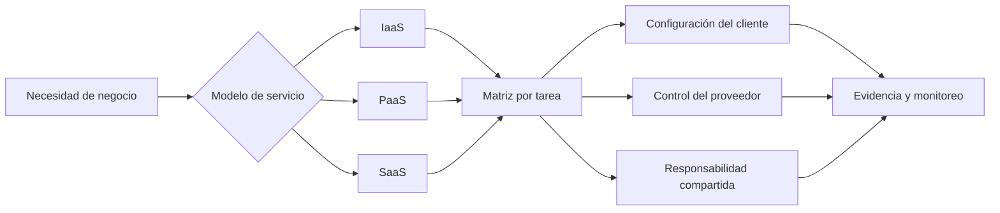

# Clase 221 — Fundamentos de seguridad en la nube y responsabilidad compartida

> Parte: **10 — Seguridad en la nube y contenedores** · Fuente: *AWS Well-Architected Framework: Security Pillar (documentación oficial de AWS)*
> ⏱️ Duración estimada: **90 min** · Nivel: **Fundamentos**

---

## 🎯 Objetivo

Comprender qué cambia cuando la infraestructura se mueve a la nube y dónde queda exactamente la
frontera de responsabilidad entre el proveedor y el cliente. Al terminar, el alumno sabrá clasificar
cualquier servicio (IaaS, PaaS, SaaS) según quién asegura qué, e identificar los errores de
configuración del cliente que pueden exponer datos, identidades y servicios.

## 📚 Resultados de aprendizaje

Al finalizar, el alumno podrá:

1. **Explicar** el modelo de responsabilidad compartida y cómo se desplaza según el tipo de servicio.
2. **Distinguir** "seguridad DE la nube" (proveedor) de "seguridad EN la nube" (cliente).
3. **Identificar** las categorías de misconfiguration más frecuentes y su impacto.
4. **Aplicar** los cinco pilares del pensamiento Well-Architected al diseño seguro.
5. **Mapear** controles de seguridad tradicionales a sus equivalentes cloud.

## 🗺️ Temas

| # | Tema | Por qué importa |
|---|------|-----------------|
| 1 | Modelo de responsabilidad compartida | Asigna tareas técnicas y operativas según servicio y contrato |
| 2 | IaaS vs PaaS vs SaaS | La frontera de responsabilidad se mueve con cada modelo |
| 3 | "DE la nube" vs "EN la nube" | Separa fallos del proveedor de errores del cliente |
| 4 | Configuración insegura y estado efectivo | Distinguir intención, valor por defecto y cambio desplegado |
| 5 | Identidad, red y datos como controles compuestos | Ninguna capa reemplaza por sí sola a las demás |
| 6 | Regiones, zonas y soberanía de datos | Cumplimiento, latencia y aislamiento de fallos |
| 7 | Modelo de amenazas cloud | Superficie de API, plano de gestión y datos |

## 🧠 Explicación en profundidad

La nube combina recursos virtualizados, servicios administrados y automatización por API. NIST SP 800-145 define características y modelos de servicio, pero esa taxonomía no decide quién configura una clave, revisa un log o corrige una aplicación. Para cada servicio se construye una matriz de **tarea**, **parte responsable**, **evidencia de cumplimiento** y **dependencia compartida**.



El diagrama no presenta una línea fija: obliga a clasificar tareas. En IaaS el proveedor opera instalaciones y virtualización, mientras el cliente suele administrar sistema invitado, aplicaciones, identidades y reglas. En un servicio administrado, el parche del motor puede pasar al proveedor, pero esquema, acceso, cifrado elegido y datos siguen requiriendo decisiones del cliente. En SaaS permanecen cuentas, configuración, dispositivos, compartición y gobierno de datos.

### «Seguridad de» y «seguridad en» la nube

La distinción popular ayuda a empezar, pero puede ocultar dependencias. El proveedor protege la infraestructura del servicio y publica capacidades; el cliente debe activarlas y operar sus controles. Algunas tareas son compartidas: el proveedor ofrece cifrado y resiliencia regional, mientras el cliente selecciona claves, región, replicación y pruebas de recuperación. La responsabilidad también tiene una dimensión contractual: SLA y certificaciones no demuestran que una arquitectura concreta cumpla el requisito del cliente.

### API, identidad, red y datos

El plano de control crea, cambia o elimina recursos; el plano de datos procesa contenido; el plano de identidad emite y evalúa sesiones. Una acción administrativa puede venir desde Internet sin cruzar la VPC de la carga. Por eso IAM es crítico, pero no «sustituye» firewall, segmentación, validación de aplicación o cifrado. Un rol mínimo puede invocar una API vulnerable; una red privada puede contener una identidad excesiva; un dato cifrado puede quedar públicamente legible para una identidad autorizada de forma incorrecta.

### Región, zona y soberanía

Región describe una ubicación geográfica ofrecida por el proveedor; zonas dentro de ella aportan dominios de fallo separados según el servicio. Desplegar en dos zonas mejora tolerancia a ciertos fallos, pero no protege automáticamente contra borrado lógico, credencial comprometida o dependencia regional compartida. Residencia, transferencia, jurisdicción y backup deben analizarse por tipo de dato y servicio, no solo por el nombre de la región.

## 📖 Definiciones y características

- **Responsabilidad compartida:** modelo donde el proveedor asegura la infraestructura subyacente y el cliente asegura lo que despliega encima. *Característica clave:* la línea divisoria depende del servicio contratado.
- **IaaS (Infrastructure as a Service):** el proveedor da cómputo, red y almacenamiento virtualizados (p. ej. EC2). *Clave:* el cliente asegura SO, parches, red y aplicación.
- **PaaS (Platform as a Service):** el proveedor gestiona también el runtime y el SO (p. ej. App Engine, RDS). *Clave:* el cliente asegura datos, configuración y accesos.
- **SaaS (Software as a Service):** el proveedor entrega una aplicación administrada. *Clave:* el cliente conserva responsabilidades sobre identidades, dispositivos, datos, configuración e integración según contrato.
- **Plano de control (control plane):** APIs y mecanismos que administran recursos. *Clave:* el impacto de una sesión comprometida depende de permisos, límites organizacionales y controles de detección.
- **Configuración insegura:** estado efectivo que expone o debilita un recurso respecto de su requisito. *Clave:* puede provenir de valores por defecto, cambios manuales, IaC, herencia o excepción.
- **Blast radius:** alcance del daño si un recurso se compromete. *Clave:* se limita con segmentación de cuentas, VPCs y privilegio mínimo.

## 🔍 Caso razonado — la misma base de datos en IaaS y PaaS

Una organización puede instalar PostgreSQL en una VM o contratar una base administrada. En la VM controla parche, sistema, proceso, backup, red, credenciales y datos. En PaaS el proveedor asume sistema y motor dentro del servicio, pero el cliente todavía define acceso público o privado, usuarios, parámetros disponibles, retención, claves y restauración. «El proveedor parchea» no significa «la base está segura».

La matriz de evidencia cambia: en IaaS se conserva inventario y estado de parche del host; en PaaS se usa versión administrada, configuración, logs del servicio y pruebas de restauración. En ambos casos se verifica IAM, red, clasificación de datos y monitoreo. Esa comparación muestra por qué el modelo se aplica por tarea, no mediante un porcentaje genérico.

## ✅ Criterio de dominio

Dominas la clase cuando puedes tomar un servicio concreto, asignar al menos diez tareas entre proveedor, cliente y compartidas, indicar una evidencia verificable para cada tarea y explicar cómo identidad, red, aplicación, datos, región y operación reducen riesgos distintos.

## 🧰 Herramientas y preparación

- Cuenta gratuita en al menos un proveedor (AWS Free Tier, Azure free account o GCP free tier). **No subas datos reales**; usa una cuenta de laboratorio dedicada.
- CLIs oficiales instaladas: `aws`, `az`, `gcloud`.
- Habilita **MFA en la cuenta raíz/administrador** antes de cualquier práctica.

```bash
# Verificar instalación de CLIs
aws --version
az version
gcloud version
```

## 🧪 Laboratorio guiado (ejercicio aplicado)

Este es un tema conceptual: el laboratorio es un análisis de arquitectura y una matriz de responsabilidad.

1. Elige tres servicios reales, uno por modelo: por ejemplo **EC2** (IaaS), **AWS Lambda** (PaaS/FaaS) y **Amazon S3** (almacenamiento gestionado).
2. Para cada uno, construye una tabla con las capas: *hardware físico, red, hipervisor, SO, runtime, aplicación, datos, IAM/config*. Marca en cada capa quién es responsable: **Proveedor**, **Cliente** o **Compartida**.
3. Investiga en la documentación oficial cómo describe el proveedor la frontera de cada servicio y contrasta con tu tabla.
4. Toma un incidente cloud documentado y separa hechos públicos, control afectado y tareas del proveedor, cliente o compartidas. No atribuyas causa si el informe público no la demuestra.
5. Redacta un párrafo de "controles mínimos del cliente" para cada uno de los tres servicios.
6. Repite el ejercicio de la capa IAM: describe por qué en la nube el perímetro es la identidad y no la red.

## ✍️ Ejercicios

1. Dibuja el diagrama de responsabilidad compartida para IaaS, PaaS y SaaS lado a lado.
2. Clasifica 10 servicios reales de tu proveedor favorito según el modelo que representan.
3. Enumera cinco categorías de misconfiguration y asocia a cada una un control preventivo.
4. Explica con un ejemplo por qué "el proveedor es seguro" no implica "mi cuenta es segura".
5. Diseña un esquema de múltiples cuentas para separar producción de desarrollo y justifica el blast radius reducido.
6. Redacta una política interna de una página sobre uso de la cuenta raíz.

## 📝 Reto verificable

Elabora una **matriz de responsabilidad compartida** en formato tabla para una arquitectura de tres
capas (balanceador gestionado + contenedores + base de datos gestionada) en el proveedor que elijas.

**Criterio de aceptación:** cada componente lista al menos seis capas, cada capa tiene asignado
responsable (Proveedor/Cliente/Compartida) coherente con la documentación oficial, y se incluye al
menos un control concreto del cliente por componente.

## ⚠️ Errores comunes

| Síntoma / mensaje | Causa y cómo arreglar |
|-------------------|-----------------------|
| "El proveedor ya me protege, no necesito hacer nada" | Confunde operación del servicio con configuración y gobierno del cliente. Construye la matriz por tarea y contrato. |
| Bucket o blob accesible públicamente sin querer | ACL/política heredada o pública por defecto en versiones antiguas; activa *block public access*. |
| Uso diario de la cuenta raíz | Rompe el privilegio mínimo; crea usuarios/roles y guarda la raíz solo para tareas críticas con MFA. |
| Datos en región equivocada | Se ignoró soberanía/latencia; define región por diseño y bloquea otras con SCP/policies. |
| "No sé qué recursos tengo" | Falta de inventario; habilita Config/Asset Inventory desde el día uno. |

## ❓ Preguntas frecuentes

**❓ ¿La responsabilidad compartida es un contrato legal o solo técnico?**
Ambas cosas. Está reflejada en el acuerdo del proveedor y define técnicamente qué controles quedan de tu lado; en una brecha por misconfiguration la responsabilidad legal suele ser del cliente.

**❓ ¿En SaaS ya no tengo nada que asegurar?**
Sí lo tienes: identidades, permisos, configuración de la app y los datos que subes. La mayoría de incidentes SaaS son por cuentas mal protegidas o permisos excesivos.

**❓ ¿Por qué se dice que "la identidad es el nuevo perímetro"?**
Porque no hay un firewall físico entre tú y el mundo: cualquiera con credenciales válidas puede llamar a la API. Controlar quién puede hacer qué (IAM) es el control central.

## 🔗 Referencias verificables y alcance

- AWS Shared Responsibility Model. <https://aws.amazon.com/compliance/shared-responsibility-model/> — explicación oficial AWS; la división se concreta por servicio.
- Microsoft — Shared responsibility in the cloud. <https://learn.microsoft.com/en-us/azure/security/fundamentals/shared-responsibility> — matriz oficial actualizada para IaaS, PaaS y SaaS.
- Google Cloud — Shared responsibility and shared fate. <https://cloud.google.com/architecture/framework/security/shared-responsibility-shared-fate> — perspectiva oficial Google; no modifica las obligaciones contractuales del cliente.
- NIST SP 800-145. <https://doi.org/10.6028/NIST.SP.800-145> — definición neutral de características, modelos de servicio y despliegue cloud.
- AWS Well-Architected — Security Pillar. <https://docs.aws.amazon.com/wellarchitected/latest/security-pillar/welcome.html> — principios de diseño; debe aplicarse a arquitectura y requisitos concretos.

## 📥 Material descargable

- 📄 [Guía en PDF](./clase-221-guia.pdf) — versión imprimible de esta clase.
- 🎞️ [Presentación (PPTX)](./clase-221-presentacion.pptx) — deck para proyectar en clase.

## ⬅️ Clase anterior

[Clase 220 — Caso completo de respuesta a incidentes end-to-end](../../parte-9-forense-digital-y-respuesta-a-incidentes/220-caso-completo-de-respuesta-a-incidentes-end-to-end/README.md)

## ➡️ Siguiente clase

[Clase 222 — IAM en la nube: identidades, roles y permisos](../222-iam-en-la-nube-identidades-roles-y-permisos/README.md)
